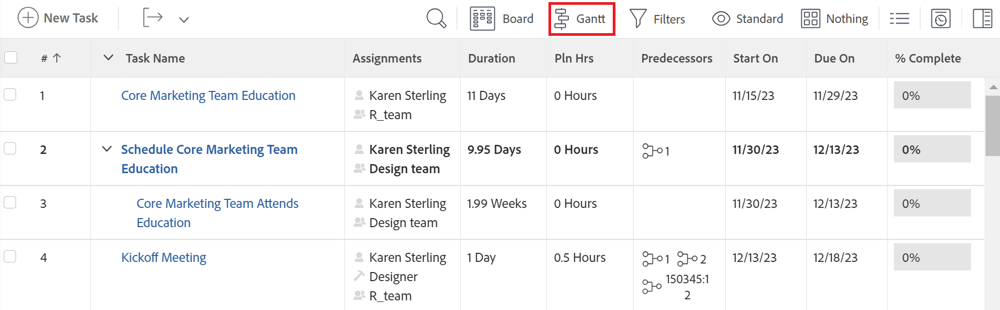

# Aan de slag met de [!UICONTROL Gantt Chart]

In [!DNL Adobe Workfront], er zijn twee [!UICONTROL Gantt charts] met vergelijkbare functionaliteit:

* De takenlijst [!UICONTROL Gantt Chart]: de vertoningeninformatie over taken op het projectniveau en is editable.
* De projectlijst [!UICONTROL Gantt Chart]: geeft informatie weer over projecten en kan niet worden bewerkt.

Hoewel ze er ongeveer hetzelfde uitzien, is de functionaliteit van elk model anders.

## Toegang krijgen tot [!UICONTROL Gantt Chart]

De [!UICONTROL Gantt] grafieken in [!DNL Workfront]  een visuele weergave van een lijst met taken of projecten. U kunt de takenlijst weergeven [!UICONTROL Gantt Chart] rechtstreeks van de taaklijst op een project of van een taakrapport. U kunt de projectlijst weergeven [!UICONTROL Gantt Chart] in een projectlijst of een projectrapport.

* [Takenlijst [!UICONTROL Gantt Chart]](#task-list-gantt-chart)
* [Projectlijst [!UICONTROL Gantt Chart]](#project-list-gantt-chart)

### Takenlijst [!UICONTROL Gantt Chart] {#task-list-gantt-chart}

De takenlijst [!UICONTROL Gantt Chart] is toegankelijk in de volgende gebieden:

* Binnen een project

   * [!UICONTROL Tasks] gebied
   * [!UICONTROL Subtasks] gebied

* Binnen een sjabloon

Toegang tot de takenlijst [!UICONTROL Gantt Chart], navigeert u naar een van de bovenstaande gebieden en klikt u op de knop [!UICONTROL Gantt Chart] pictogram.

### Projectlijst [!UICONTROL Gantt Chart] {#project-list-gantt-chart}

De projectlijst [!UICONTROL Gantt Chart] is toegankelijk in de volgende gebieden:

* Binnen de [!UICONTROL Projects] gebied
* Binnen een Portfolio

   * [!UICONTROL Projects] gebied

* Binnen een projectrapport

   * Een project- of taakrapport

* Binnen een programma

   * In de [!UICONTROL Projects] gebied

Om toegang te krijgen tot [!UICONTROL project list Gantt Chart], navigeert u naar een van de bovenstaande gebieden en klikt u op de knop [!UICONTROL Gantt Chart] pictogram.

## Configureer hoe informatie wordt weergegeven op het tabblad [!UICONTROL Gantt Chart]

U kunt vormen welke informatie op beide takenlijst toont [!UICONTROL Gantt Chart] en de projectlijst [!UICONTROL Gantt Chart].\
U kunt de kleuren of lettertypen waarin de [!UICONTROL Gantt chart] informatie wordt weergegeven.

* [Takenlijst [!UICONTROL Gantt Chart]](#task-list-gantt-chart)
* [Projectlijst [!UICONTROL Gantt Chart]](#project-list-gantt-chart)

### Takenlijst [!UICONTROL Gantt Chart] {#task-list-gantt-chart-1}

De volgende weergaveopties zijn beschikbaar in de takenlijst [!UICONTROL Gantt Chart]:

* [!UICONTROL Actual Dates]
* [!UICONTROL Assignments]
* [!UICONTROL Baseline]
* [!UICONTROL Commit Date]
* [!UICONTROL % Complete]
* [!UICONTROL Critical Path]
* [!UICONTROL Milestone Diamonds]
* [!UICONTROL Milestone Lines]
* [!UICONTROL Predecessors]
* [!UICONTROL Progress Status]
* [!UICONTROL Projected dates]

Voor gedetailleerde informatie over de hierboven vermelde weergaveopties raadpleegt u [Configureer hoe informatie wordt weergegeven op het tabblad [!UICONTROL Gantt Chart]](../../../manage-work/gantt-chart/use-the-gantt-chart/configure-info-on-gantt-chart.md).

### Projectlijst [!UICONTROL Gantt Chart] {#project-list-gantt-chart-1}

De volgende weergaveopties zijn beschikbaar in de projectlijst [!UICONTROL Gantt Chart]:

* [!UICONTROL Actual Dates]
* [!UICONTROL % Complete]
* [!UICONTROL Milestone Diamonds]
* [!UICONTROL Milestone Lines]
* [!UICONTROL Predecessors]
* [!UICONTROL Progress Status]
* [!UICONTROL Projected Dates]

Voor informatie over de hierboven vermelde weergaveopties raadpleegt u [Configureer hoe informatie wordt weergegeven op het tabblad [!UICONTROL Gantt Chart]](../../../manage-work/gantt-chart/use-the-gantt-chart/configure-info-on-gantt-chart.md).

## Werk de [!UICONTROL Gantt Chart]

Wanneer de informatie van de taaklijst wordt bijgewerkt, wordt het automatisch weerspiegeld in zowel de taaklijst [!UICONTROL Gantt Chart] en de projectlijst [!UICONTROL Gantt Chart].

* [Takenlijst [!UICONTROL Gantt Chart]](#task-list-gantt-chart)
* [Projectlijst [!UICONTROL Gantt Chart]](#project-list-gantt-chart)

### Takenlijst [!UICONTROL Gantt Chart] {#task-list-gantt-chart-2}

In een project kunt u de takenlijst bijwerken [!UICONTROL Gantt Chart] rechtstreeks van de [!UICONTROL Gantt chart] of uit de takenlijst. Zie voor meer informatie [Gegevens in de takenlijst bijwerken [!UICONTROL Gantt Chart]](../../../manage-work/gantt-chart/use-the-gantt-chart/update-info-task-list-gantt.md).

In een malplaatje, de taaklijst [!UICONTROL Gantt Chart] geeft de updates weer die zijn aangebracht in de takenlijst van de sjabloon. Dit [!UICONTROL Gantt chart] kan niet worden bewerkt.

### Projectlijst [!UICONTROL Gantt Chart] {#project-list-gantt-chart-2}

De [!UICONTROL project list Gantt Chart] geeft de updates weer die zijn aangebracht in de takenlijst van elk project. Dit [!UICONTROL Gantt chart] kan niet worden bewerkt.

## Informatie weergeven op de [!UICONTROL Gantt Chart]

De takenlijst [!UICONTROL Gantt Chart] en projectlijst [!UICONTROL Gantt Chart] informatie weergeven over taken en projecten. Zie voor meer informatie [Informatie weergeven in het dialoogvenster [!UICONTROL Gantt Chart]](../../../manage-work/gantt-chart/use-the-gantt-chart/view-info-in-gantt.md).
