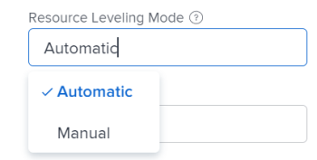

# Niveau-bronnen in het dialoogvenster [!UICONTROL Gantt Chart]

Het Niveau van uw middelen op een project heeft twee doeleinden:

* De overtoewijzing van tijd voor toegewezen personen automatisch aanpassen.
* Om automatisch een realistisch taakprogramma voor een project tot stand te brengen.

## Toegangsvereisten

U moet de volgende toegang hebben om de stappen in dit artikel uit te voeren:

<table style="table-layout:auto"> 
 <col> 
 <col> 
 <tbody> 
  <tr> 
   <td role="rowheader">[!DNL Adobe Workfront] plan*</td> 
   <td> 
Alle 
 </td> 
  </tr> 
  <tr> 
   <td role="rowheader">[!DNL Workfront] licentie*</td> 
   <td> 
[!UICONTROL Plan] 
 </td> 
  </tr> 
  <tr> 
   <td role="rowheader">Configuraties op toegangsniveau*</td> 
   <td> 
[!UICONTROL Edit] toegang tot projecten
 
<b>OPMERKING</b>

Als u nog steeds geen toegang hebt, vraagt u [!DNL Workfront] beheerder als zij extra beperkingen in uw toegangsniveau plaatsen. Voor informatie over hoe een [!DNL Workfront] de beheerder kan uw toegangsniveau wijzigen, zie <a href="../../../administration-and-setup/add-users/configure-and-grant-access/create-modify-access-levels.md" class="MCXref xref">Aangepaste toegangsniveaus maken of wijzigen</a>.
 </td>
</tr> 
  <tr> 
   <td role="rowheader">Objectmachtigingen</td> 
   <td> 
[!UICONTROL Manage] toegang tot het project
 
Voor informatie over het aanvragen van aanvullende toegang raadpleegt u <a href="../../../workfront-basics/grant-and-request-access-to-objects/request-access.md" class="MCXref xref">Toegang tot objecten aanvragen </a>.
 </td> 
  </tr> 
 </tbody> 
</table>

&#42;Neem contact op met uw [!DNL Workfront] beheerder.

## Overzicht van het Niveaus van Middelen

Als dezelfde bron aan twee verschillende taken is toegewezen, kunt u de tijdlijn van de taken aanpassen door de resources nivelleren te gebruiken, zodat deze niet tegelijkertijd plaatsvinden.

Overweeg het volgende wanneer het nivelleren van middelen op een project:

* Het niveau van het middel is slechts op één project van toepassing, zo [!DNL Adobe Workfront] brengt geen niveau van middelen over meer dan één project tegelijkertijd.
* Indien **[!UICONTROL Effort Driven]** is geselecteerd als een **[!UICONTROL Duration Type]**, [!DNL Workfront] zal de middelen niet op peil houden.
* Wanneer meerdere gebruikers aan dezelfde taak zijn toegewezen, wordt nivelleren geannuleerd.
* Voorwaarden voor het type **[!UICONTROL Task Constraint]** zal voorrang krijgen boven het niveau van de middelen. Als **[!UICONTROL Fixed Dates]** is geselecteerd als de [!UICONTROL Task Constraint]De taakdatums blijven ongewijzigd.
* Eerdere relaties hebben voorrang op bronnenniveau.
* **[!UICONTROL Resource Leveling]** moet worden ingesteld op **[!UICONTROL Manual]** voor het project om het niveau van de [!UICONTROL Gantt chart]. Als u beheerdersmachtigingen hebt voor het project, kunt u het systeem automatisch bronnen laten nivelleren door deze instelling aan te passen op het project en **[!UICONTROL Automatic]** in plaats van **[!UICONTROL Manual]** in de **[!UICONTROL Edit Project]** doos.

   

* Als projecteigenaar, of de taak toegewezen, kunt u een nivellerende vertraging voor een taak introduceren om erop te wijzen dat er een grote kans is dat de taak extra tijd zou kunnen vereisen. Voor informatie over het toevoegen van een niveauvertraging aan een taak, zie [Vertraging taakniveaus bijwerken](../../../manage-work/tasks/task-information/task-leveling-delay.md).

## Bronniveaus toepassen in het dialoogvenster [!UICONTROL Gantt Chart]

U kunt de Lijst van de Taak gebruiken [!UICONTROL Gantt Chart] om uw bronnen op peil te houden.

1. Ga naar het project u wilt vlakken.
1. In de **[!UICONTROL Tasks]** gebied, klikt u op **[!UICONTROL Gantt chart]** pictogram.

   Alle wijzigingen worden automatisch opgeslagen wanneer de **[!UICONTROL Autosave]** is ingeschakeld. Deze optie is standaard ingeschakeld.

1. (Optioneel) Klik op de knop **[!UICONTROL Plan]mode** pictogram en selecteer **[!UICONTROL Manual save Standard]** of **[!UICONTROL Timeline Planning]** om uw wijzigingen handmatig op te slaan.

   >[!TIP]
   >
   >U kunt resources niet in de  [!UICONTROL Gantt Chart] wanneer de [!UICONTROL Autosave] is ingeschakeld.

   

1. Klik op de knop **[!UICONTROL Level Resources]** vervolgkeuzemenu.

   

1. Selecteer een van de volgende opties:

   * **[!UICONTROL Level Now]**: Hiermee past u bronniveau toe op de geselecteerde taak.
   * **[!UICONTROL Clear Leveling]**: Hiermee verwijdert u alle bronniveaus van de geselecteerde taak.

   >[!NOTE]
   >
   >Uw middelen zouden kunnen worden oververdeeld als zij aan veelvoudige taken worden toegewezen die tijdens het zelfde tijdkader voorkomen.

1. (Optioneel en voorwaardelijk) Als u de optie Automatisch opslaan hebt uitgeschakeld, klikt u op de knop **[!UICONTROL Undo]** of &#x200B;**[!UICONTROL Redo]** als u een van de wijzigingen wilt annuleren of dupliceren.

   >[!TIP]
   >
   >U kunt de volgende sneltoetsen gebruiken om wijzigingen in het dialoogvenster [!UICONTROL Gantt Chart]:
   >
   >* [!DNL Mac]: Gebruiken [!UICONTROL Command + Z] om ongedaan te maken en [!UICONTROL Command + Shift + Z] om opnieuw uit te voeren.
   >* Windows: Gebruiken [!UICONTROL Ctrl + Z] om ongedaan te maken en [!UICONTROL Ctrl + Y] om opnieuw uit te voeren.

1. Klikken **[!UICONTROL Save]** in de rechterbovenhoek van het dialoogvenster [!UICONTROL Gantt chart].

<!--

<h2>Overview of Leveling Delay</h2>

(NOTE: moved to its own article: /Content/Manage work/Tasks/Task information/task-leveling-delay.htm) 

At times, there might be conflicts between task schedules on a project. You can level resources or address resource conflicts by rescheduling resources and tasks so that all tasks can be completed within a realistic schedule. 

As the project manager, or the task assignee, you can also add a Leveling Delay on individual tasks to account for any resource or scheduling conflicts. In other words, a task might be scheduled with a delay to ensure that when Adobe Workfront levels the tasks a more realistic schedule overcomes resource conflicts.

To manually add a Leveling Delay to a task:

<ol>
<li value="1">Navigate to a task for which you want to add a Leveling Delay.</li>
<li value="2"> 
 Click the <strong>More icon</strong> to the right of the task name, then click <strong>Edit</strong>. 
 
  
 </li>
<li value="3">Click <strong>Settings</strong>. </li>
<li value="4">Specify the <strong>Leveling Delay</strong>, in hours. This is the time that the resource will be delayed starting the task due to resource conflicts.</li>
<li value="5">Click <strong>Save Changes</strong>. </li>
</ol>

-->
