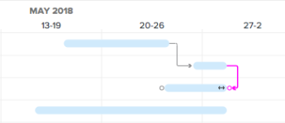

# Gegevens bijwerken in de takenlijst [!UICONTROL Gantt Chart]

<!--Audited: 08/2025-->

[!UICONTROL Gantt Chart] van een de taaklijst van Adobe Workfront toont details over taken die op een project of een malplaatje zijn.

In een sjabloon geeft de takenlijst [!UICONTROL Gantt Chart] de updates weer die in de takenlijst van de sjabloon op sjabloontaakniveau zijn aangebracht. U kunt de aan een sjabloon gekoppelde [!UICONTROL Gantt chart] niet bewerken.

In een project kunt u taakgegevens rechtstreeks in de takenlijst bijwerken [!UICONTROL Gantt Chart] .

In dit artikel worden de volgende handelingen beschreven die u rechtstreeks in de Taaklijst kunt uitvoeren [!UICONTROL Gantt Chart] :

* Taakduur wijzigen
* Vorige relaties maken of verwijderen
* Start- en einddatum van taak wijzigen
* Percentage bijwerken voltooid
* Niveau-projectbronnen

## Toegangsvereisten

+++ Breid uit om de toegangseisen voor de functionaliteit in dit artikel weer te geven. 

<table style="table-layout:auto"> 
 <col> 
 <col> 
 <tbody> 
  <tr> 
   <td role="rowheader">[!DNL Adobe Workfront] package</td> 
   <td> 
Alle
 </td> 
  </tr> 
  <tr> 
   <td role="rowheader">[!DNL Adobe Workfront] licentie</td> 
   <td> 
[!UICONTROL Standard]

   
[!UICONTROL Plan]
 </td> 
  </tr> 
  <tr> 
   <td role="rowheader">Configuraties op toegangsniveau</td> 
   <td> 
[!UICONTROL Edit] toegang tot projecten en taken
 </td> 
  </tr> 
  <tr> 
   <td role="rowheader">Objectmachtigingen</td> 
   <td> 
[!UICONTROL Manage] toegang tot het project en de taken
 </td> 
  </tr> 
 </tbody> 
</table>

Voor meer detail over de informatie in deze lijst, zie [ vereisten van de Toegang in de documentatie van Workfront ](/help/quicksilver/administration-and-setup/add-users/access-levels-and-object-permissions/access-level-requirements-in-documentation.md).

+++ 

<!--Old:

<table style="table-layout:auto"> 
 <col> 
 <col> 
 <tbody> 
  <tr> 
   <td role="rowheader">[!DNL Adobe Workfront] plan*</td> 
   <td> 
Any 
 </td> 
  </tr> 
  <tr> 
   <td role="rowheader">[!DNL Adobe Workfront] license*</td> 
   <td> 
[!UICONTROL Plan] 
 </td> 
  </tr> 
  <tr> 
   <td role="rowheader">Access level configurations*</td> 
   <td> 
[!UICONTROL Edit] access to Projects and Tasks
 
Note: If you still don't have access, ask your [!DNL Workfront] administrator if they set additional restrictions in your access level. For information on how a [!DNL Workfront] administrator can modify your access level, see <a href="../../../administration-and-setup/add-users/configure-and-grant-access/create-modify-access-levels.md" class="MCXref xref">Create or modify custom access levels</a>.
 </td> 
  </tr> 
  <tr> 
   <td role="rowheader">Object permissions</td> 
   <td> 
[!UICONTROL Manage] access to the project and tasks 
 
For information on requesting additional access, see <a href="../../../workfront-basics/grant-and-request-access-to-objects/request-access.md" class="MCXref xref">Request access to objects </a>.
 </td> 
  </tr> 
 </tbody> 
</table>-->

## Taakduur wijzigen

1. Ga naar het project u wilt wijzigen.
1. Klik op **[!UICONTROL Tasks]** in het linkerdeelvenster.

   

1. Klik op het pictogram **[!UICONTROL Gantt chart]** .

   

   Alle wijzigingen worden automatisch opgeslagen wanneer de optie **[!UICONTROL Autosave]** is ingeschakeld. Deze optie is standaard ingeschakeld.

1. (Optioneel) Klik op het pictogram **[!UICONTROL Plan mode]** en selecteer **[!UICONTROL Manual save Standard]** of **[!UICONTROL Timeline Planning]** om de wijzigingen handmatig op te slaan.

   

1. Houd de cursor boven de tijdlijn van een taak en sleep de tijdlijnindicator naar een andere datum.
1. Zet de indicator neer wanneer u de correcte nieuwe Datum van Voltooiing voor de taak hebt bereikt.
1. (Optioneel en voorwaardelijk) Als u hebt opgegeven dat u de wijzigingen handmatig wilt opslaan, klikt u op het pictogram **[!UICONTROL Undo]** of &#x200B; **[!UICONTROL Redo]** als u een van de wijzigingen wilt annuleren of dupliceren.

   >[!TIP]
   >
   >U kunt de volgende sneltoetsen gebruiken om wijzigingen in het Gantt-diagram ongedaan te maken of opnieuw uit te voeren:
   >
   >   
   >   
   >   * [!DNL Mac]: gebruik [!UICONTROL Command + Z] om ongedaan te maken en [!UICONTROL Command + Shift + Z] om opnieuw uit te voeren.
   >   * [!DNL Windows]: gebruik [!UICONTROL Ctrl + Z] om ongedaan te maken en [!UICONTROL Ctrl + Y] om opnieuw uit te voeren.
   >   
   >

1. Klik op **[!UICONTROL Save]** in de rechterbovenhoek van [!UICONTROL Gantt chart] .

## Vorige relaties maken of verwijderen

1. Ga naar het project u wilt wijzigen.
1. Klik in het gebied **[!UICONTROL Tasks]** op het pictogram **[!UICONTROL Gantt chart]** .

   De optie **[!UICONTROL Autosave]** is standaard geselecteerd. In dat geval worden alle wijzigingen automatisch opgeslagen.

   

1. (Optioneel) Klik op het pictogram **[!UICONTROL Plan mode]** en selecteer **[!UICONTROL Manual save Standard]** of **[!UICONTROL Timeline Planning]** om de wijzigingen handmatig op te slaan.

   

1. Als u een voorgaande relatie wilt maken, klikt u op het beginpunt van een taak en sleept u deze naar het eindpunt van de taak.
1. Als u een eerdere relatie wilt verwijderen, klikt u op een eerdere regel die twee taken met elkaar verbindt om deze te selecteren en drukt u vervolgens op **[!UICONTROL Delete]** op het toetsenbord.\
   

1. (Optioneel en voorwaardelijk) Als u de wijzigingen handmatig wilt opslaan, klikt u op het pictogram **[!UICONTROL Undo]** of &#x200B; **[!UICONTROL Redo]** als u een van de wijzigingen wilt annuleren of dupliceren.

   >[!TIP]
   >
   >U kunt de volgende sneltoetsen gebruiken om wijzigingen in het Gantt-diagram ongedaan te maken of opnieuw uit te voeren:
   >
   >   
   >   
   >   * [!DNL Mac]: gebruik [!UICONTROL Command + Z] om ongedaan te maken en [!UICONTROL Command + Shift + Z] om opnieuw uit te voeren.
   >   * [!DNL Windows] : [!UICONTROL Use Ctrl + Z] ongedaan maken en [!UICONTROL Ctrl + Y] opnieuw uitvoeren.
   >   
   >

1. Klik op **[!UICONTROL Save]** .

## Start- en einddatum van taak wijzigen

1. Ga naar het project u wilt wijzigen.
1. Klik in het gebied **[!UICONTROL Tasks]** op het pictogram **[!UICONTROL Gantt chart]** .

   Alle wijzigingen worden automatisch opgeslagen wanneer de optie **[!UICONTROL Autosave]** is ingeschakeld. Deze optie is standaard ingeschakeld.

   

1. (Optioneel) Klik op het pictogram **[!UICONTROL Plan mode]** en selecteer **[!UICONTROL Manual save Standard]** of **[!UICONTROL Timeline Planning]** om de wijzigingen handmatig op te slaan.

   

1. Houd de muisaanwijzer boven het midden van de taak en zoek de pijl met meerdere richtingen.
1. Klik en sleep de taak naar de gewenste datum.

   

1. Als u de taakdatum wijzigt op een manier die invloed heeft op de taakbeperking, klikt u op **[!UICONTROL Accept]** om de wijziging in de taakbeperking te bevestigen.

   >[!NOTE]
   >
   >Als de taak een van de volgende beperkingen heeft, werkt het systeem de [!UICONTROL Task Constraint] naar [!UICONTROL Start No Earlier] Than bij als het project gepland is vanuit de [!UICONTROL Start Date] of [!UICONTROL Finish No Later Than] als het project gepland is vanuit de [!UICONTROL Completion Date] :
   >
   >   
   >   
   >   * [!UICONTROL As Soon As Possible]
   >   * [!UICONTROL As Late As Possible]
   >   * [!UICONTROL Earliest Available Time]
   >   * [!UICONTROL Latest Available Time]
   >   
   >   
   >In sommige gevallen, zouden de voorgangersverhoudingen de taken kunnen verhinderen vroeger te beginnen, en de taakbeweging wordt niet toegestaan.

1. (Optioneel en voorwaardelijk) Als u de wijzigingen handmatig wilt opslaan, klikt u op de pictogrammen **[!UICONTROL Undo]** of &#x200B; **[!UICONTROL Redo]** als u een van de wijzigingen wilt annuleren of dupliceren.

   >[!TIP]
   >
   >U kunt de volgende sneltoetsen gebruiken om wijzigingen in de [!UICONTROL Gantt chart] ongedaan te maken of opnieuw uit te voeren:
   >
   >   
   >   
   >   * [!DNL Mac]: gebruik [!UICONTROL Command + Z] om ongedaan te maken en [!UICONTROL Command + Shift + Z] om opnieuw uit te voeren.
   >   * [!DNL Windows]: gebruik [!UICONTROL Ctrl + Z] om ongedaan te maken en [!UICONTROL Ctrl + Y] om opnieuw uit te voeren.
   >   
   >

1. Klik op **[!UICONTROL Save]**.

## Percentage bijwerken voltooid

1. Ga naar het project u wilt wijzigen.
1. Klik in het gebied **[!UICONTROL Tasks]** op het pictogram **[!UICONTROL Gantt chart]** .

   

   Alle wijzigingen worden automatisch opgeslagen wanneer de optie **[!UICONTROL Autosave]** is ingeschakeld. Deze optie is standaard ingeschakeld.

1. (Optioneel) Klik op het pictogram **[!UICONTROL Plan mode]** en selecteer **[!UICONTROL Manual save Standard]** of **[!UICONTROL Timeline Planning]** om de wijzigingen handmatig op te slaan.
1. Dubbelklik op het percentagenummer in de taak en voer het getal in.

   >[!IMPORTANT]
   >
   >U moet [!UICONTROL % Complete] in het dialoogvenster [!UICONTROL Options] hebben geselecteerd om het volledige percentage bij te werken. Klik hiertoe op het pictogram **[!UICONTROL Options]** en selecteer **[!UICONTROL % Complete]** .
   >
   >
   >   >
   >

1. (Optioneel en voorwaardelijk) Als u de wijzigingen handmatig wilt opslaan, klikt u op het pictogram **[!UICONTROL Undo]** of &#x200B; **[!UICONTROL Redo]** als u een van de wijzigingen wilt annuleren of dupliceren.

   >[!TIP]
   >
   >U kunt de volgende sneltoetsen gebruiken om wijzigingen in de [!UICONTROL Gantt chart] ongedaan te maken of opnieuw uit te voeren:
   >
   >   
   >   
   >   * [!DNL Mac]: gebruik [!UICONTROL Command + Z] om ongedaan te maken en [!UICONTROL Command + Shift + Z] om opnieuw uit te voeren.
   >   * [!DNL Windows]: gebruik [!UICONTROL Ctrl + Z] om ongedaan te maken en [!UICONTROL Ctrl + Y] om opnieuw uit te voeren.
   >   
   >

1. Klik op **[!UICONTROL Save]** in de rechterbovenhoek van [!UICONTROL Gantt chart] .

## Niveau-projectmiddelen

U kunt de Taaklijst [!UICONTROL Gantt Chart] gebruiken om uw middelen te nivelleren.

Voor informatie over het nivelleren van middelen in [!UICONTROL Gantt chart], zie [ Middelen van het Niveau in [!UICONTROL Gantt Chart]](../../../manage-work/gantt-chart/use-the-gantt-chart/level-resources-in-gantt.md).

<!--

(NOTE: this is drafted because I moved the whole content to the article linked above)

<ol>
<li value="1">Go to the project you want to level.</li>
<li value="2"> 
 In the <strong>Tasks</strong> area, click the <strong>Gantt chart</strong> icon.
 
All changes are saved automatically when the <strong>Autosave</strong> option is enabled. It is enabled by default. 
 </li>
<li value="3">

(Optional) Click the <strong>Plan mode</strong> icon and select <strong>Manual save Standard</strong> or <strong>Timeline Planning</strong> to save your changes manually.
 <note type="tip">
You cannot level resources in the Gantt chart when the Autosave option is enabled.
</note>

  

 </li>
<li value="4"> 
Click the <strong>Level Resources</strong> drop-down menu.
 
  
 </li>
<li value="5">Select one of following options:
<ul>
<li><strong>Level Now</strong>: Applies resource leveling to the selected task.</li>
<li>
<strong>Clear Leveling</strong>: Removes all resource leveling from the selected task.
</li>
</ul><note type="note">
Your resources might be overallocated if they are assigned to multiple tasks which occur during the same time frame.
</note></li>
<li value="6"> 
(Optional and conditional) If you have disabled the Autosave option, click the <strong>Undo</strong> or<strong>Redo</strong> icons if you want to cancel or duplicate any of the changes. 
 <note type="tip">

You can use the following keyboard shortcuts to undo or redo changes on the Gantt chart:

<ul>
<li>Mac: Use Command + Z to undo and Command + Shift + Z to redo.</li>
<li>Windows: Use Ctrl + Z to undo and Ctrl + Y to redo.</li>
</ul>
</note> </li>
<li value="7">Click <strong>Save</strong> in the upper-right corner of the Gantt chart.</li>
</ol>

-->

<!--
<h2 data-mc-conditions="QuicksilverOrClassic.Draft mode"> </h2>
-->
