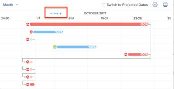

# Informatie weergeven in de [!UICONTROL Gantt Chart]

In de taaklijst [!UICONTROL Gantt Chart] en de projectlijst [!UICONTROL Gantt Chart] wordt informatie over projecten en taken weergegeven.

## Toegangsvereisten

U moet het volgende hebben om de stappen in dit artikel te volgen:

<table style="table-layout:auto"> 
 <col> 
 <col> 
 <tbody> 
  <tr> 
   <td role="rowheader">[!DNL Adobe Workfront] plan*</td> 
   <td> 
Alle 
 </td> 
  </tr> 
  <tr> 
   <td role="rowheader">[!DNL Adobe Workfront] overzicht van licenties*</td> 
   <td> 
[!UICONTROL Review] of hoger
 </td> 
  </tr> 
  <tr> 
   <td role="rowheader">Configuraties op toegangsniveau*</td> 
   <td> 
[!UICONTROL View] of betere toegang tot Projecten en Taken
 
<b>OPMERKING</b>

Als u nog steeds geen toegang hebt, vraagt u de [!DNL Workfront] -beheerder of deze aanvullende beperkingen op uw toegangsniveau instelt. Voor informatie over hoe een [!DNL Workfront] beheerder uw toegangsniveau kan wijzigen, zie <a href="../../../administration-and-setup/add-users/configure-and-grant-access/create-modify-access-levels.md" class="MCXref xref"> tot douanetoegangsniveaus </a> leiden of wijzigen.
 </td>
</tr> 
  <tr> 
   <td role="rowheader">Objectmachtigingen</td> 
   <td> 
[!UICONTROL View] of een betere toegang tot het project
 
Voor informatie bij het vragen van om extra toegang, zie <a href="../../../workfront-basics/grant-and-request-access-to-objects/request-access.md" class="MCXref xref"> de toegang van het Verzoek tot voorwerpen </a>.
 </td> 
  </tr> 
 </tbody> 
</table>

&#42; om te weten te komen welk plan, vergunningstype, of toegang u hebt, contacteer uw [!DNL Workfront] beheerder.

## Zoek de [!UICONTROL Gantt Chart]

U kunt zowel het Gantt-diagram als de projectlijst [!UICONTROL Gantt chart] vinden in meerdere gebieden in Workfront. Voor meer informatie, zie [ begonnen worden met [!UICONTROL Gantt Chart]](../../../manage-work/gantt-chart/use-the-gantt-chart/get-started-with-gantt.md).

## Taken weergeven op de [!UICONTROL Critical Path]

In de Projectlijst [!UICONTROL Gantt Chart] worden taken die zich niet in [!UICONTROL Critical Path] bevinden, weergegeven als lichtblauwe horizontale lijnen. Taken die zich op [!UICONTROL Critical Path] van een project bevinden, worden weergegeven als rode horizontale lijnen.

Voor meer informatie over taken over [!UICONTROL Critical Path], zie [ Overzicht van het project [!UICONTROL Critical Path]](../../../manage-work/tasks/manage-tasks/critical-path.md).

## Taakgegevens weergeven in de projectlijst [!UICONTROL Gantt Chart]

U kunt de taakinformatie voor een project direct van de Lijst van het Project bekijken. De taken worden vermeld onder de naam van elk project.

>[!NOTE]
>
>U kunt taken niet bewerken in de projectlijst [!UICONTROL Gantt Chart] .

U kunt de taakinformatie voor een project direct van een lijst van projecten op de volgende gebieden bekijken:

* In het [!UICONTROL Projects] -gebied
* Binnen een Portfolio
* Binnen een programma

Om taken in een project van een lijst van projecten te bekijken:

1. Ga naar een van de bovengenoemde gebieden.

   Klik bijvoorbeeld in het vak [!UICONTROL Main Menu] op **[!UICONTROL Projects]** .

   Een lijst met projecten wordt weergegeven.

1. Klik het **[!UICONTROL Gantt chart]** pictogram  in de hoger-juiste hoek van het scherm.

   <!--
   
(NOTE: images conditioned for classic and nwe)  

   -->

1. Klik op het pictogram **[!UICONTROL Show Task List]** .

1. In de projectlijst aan de linkerzijde, klik de drop-down pijl naast de naam van het project om het even welke taken onder dat project te tonen.\
   Hierdoor wordt taakinformatie weergegeven op de [!UICONTROL Gantt Chart] .\
   

1. (Optioneel) Klik op het pictogram **[!UICONTROL Print]** in de rechterbovenhoek om de [!UICONTROL Gantt Chart] te exporteren.

   >[!NOTE]
   >
   >De projectlijst [!UICONTROL Gantt Chart] exporteert alleen projecten. Taakgegevens zijn niet opgenomen.

## De tijdsperiode wijzigen waarin informatie wordt weergegeven in de [!UICONTROL Gantt Chart]

U kunt de tijdsperiode aanpassen die op [!UICONTROL Gantt Chart] wordt weergegeven om informatie in korreligheid weer te geven, of u kunt snel naar een dag-, week-, maand-, kwartaal- of jaarweergave navigeren:

* [De tijdsperiode korrelig wijzigen](#change-the-time-period-on-a-granular-level)
* [Gegevens weergeven op dag, week, maand, kwartaal of jaar](#view-information-by-day-week-month-quarter-or-year)

### De tijdsperiode korrelig wijzigen {#change-the-time-period-on-a-granular-level}

1. Houd de muisaanwijzer boven de tijdlijn van [!UICONTROL Gantt Chart] en sleep de zoomindicator van links naar rechts om de tijdlijn uit te breiden of in te perken.\
   

### Gegevens weergeven op dag, week, maand, kwartaal of jaar {#view-information-by-day-week-month-quarter-or-year}

1. Klik in het [!UICONTROL Gantt Chart] op de vervolgkeuzelijst voor het tijdframe.

   

1. Selecteer een tijdkader uit de volgende beschikbare opties:

   * **[!UICONTROL Fit All]**: met deze optie geeft u de tijdlijn van het gehele project weer.
   * **[!UICONTROL All Projects]**: deze optie is alleen beschikbaar in het Gantt-diagram van de Projectlijst.
   * **[!UICONTROL Year]**
   * **[!UICONTROL Quarter]**
   * **[!UICONTROL Month]**
   * **[!UICONTROL Week]**
   * **[!UICONTROL Day]**

1. (Optioneel) Selecteer een korrelig tijdframe, zoals [!UICONTROL Week] of [!UICONTROL Day] , en klik en sleep de horizontale schuifbalk onder aan het [!UICONTROL Gantt Chart] om naar rechts te gaan op de tijdlijn van het project.\
   Een tijdlijnmomentopname van [!UICONTROL Gantt] toont om het volledige project te tonen.

   >[!TIP]
   >
   >De tijdlijnopname wordt alleen weergegeven nadat u op de horizontale schuifbalk hebt geklikt.

   

1. (Optioneel) Klik ergens in de momentopname van de tijdlijn om naar een specifiek punt in de levensduur van het project te navigeren.\
   of\
   Sleep de grepen van de viewer voor momentopnamen om een specifiek tijdlijnbereik te selecteren dat u wilt weergeven in de hoofdmap [!UICONTROL Gantt] .

## Filters, weergaven en groepen gebruiken

[!UICONTROL Gantt Chart] is een visuele weergave van de informatie die momenteel wordt weergegeven in de takenlijst. U kunt filters, meningen, en groeperingen op de voorwerpen toepassen die in beide [!UICONTROL Gantt Chart] worden vermeld.

>[!CAUTION]
>
>U kunt geen filters, weergaven en groepen toepassen wanneer u [!UICONTROL Manual] Opslaan [!UICONTROL Timeline Planning] selecteert om de wijzigingen in uw takenlijst op te slaan. Voor informatie over het bewaren van veranderingen in taken in een lijst, zie [ taken in een lijst ](../../../manage-work/tasks/manage-tasks/edit-tasks-in-a-list.md) uitgeven.

De filters en de groeperingen die u op de lijst toepast worden weerspiegeld op zowel de Lijst van het Project als Lijst van de Taak [!UICONTROL Gantt Chart] s en ook inbegrepen wanneer de grafieken van Gantt worden uitgevoerd:

* Filters\
   U kunt een filter op de lijst toepassen om de informatie te controleren die in [!UICONTROL Gantt Chart] wordt getoond.\
   Voor informatie over het toepassen van een Filter, zie [ Overzicht van Filters ](../../../reports-and-dashboards/reports/reporting-elements/filters-overview.md).

* Groepen\
   Groepen die u op de lijst toepast, worden weergegeven in de [!UICONTROL Gantt Chart] .\
   Voor informatie over het toepassen van een Groepering, zie [ Overzicht van Groepen in Adobe Workfront ](../../../reports-and-dashboards/reports/reporting-elements/groupings-overview.md).

Weergaven worden niet weerspiegeld in de [!UICONTROL Gantt Chart] . Nochtans, wanneer u [!UICONTROL Gantt Chart] (zoals die in [ wordt beschreven de Uitvoer [!UICONTROL Gantt Chart] naar PDF ](../../../manage-work/gantt-chart/use-the-gantt-chart/export-gantt-chart-to-pdf.md)) uitvoert, wordt de taaklijst uitgevoerd naast [!UICONTROL Gantt chart], met de huidige Mening die op de lijst wordt toegepast.

## Weergaveopties configureren

U kunt kiezen welk type informatie in beide [!UICONTROL Gantt charts] wordt weergegeven. Voor meer informatie, zie [ vormen hoe de informatievertoningen op [!UICONTROL Gantt Chart]](../../../manage-work/gantt-chart/use-the-gantt-chart/configure-info-on-gantt-chart.md).
