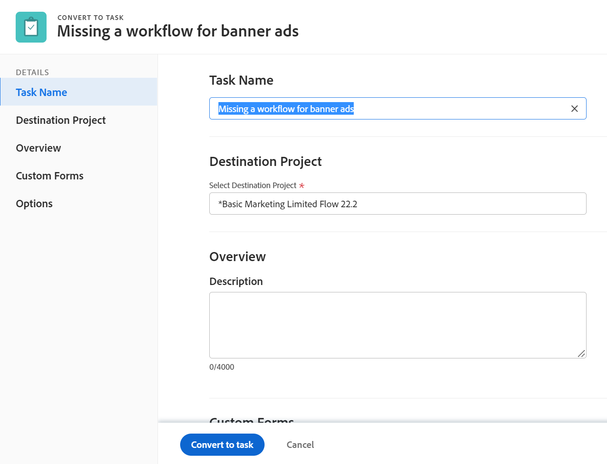

# Een uitgave converteren naar een taak

<!--Audited: 08/2025-->

Als er meer moet worden gedaan om een probleem op te lossen nadat het probleem is verzonden, kunt u het probleem converteren naar een taak in Adobe Workfront.

Voor algemene informatie over het omzetten van kwesties, zie [ Overzicht van het omzetten van kwesties in Adobe Workfront ](../../../manage-work/issues/convert-issues/convert-issues.md).

## Toegangsvereisten

+++ Breid uit om de toegangseisen voor de functionaliteit in dit artikel weer te geven.

U moet de volgende toegang hebben om de stappen in dit artikel uit te voeren:

<table style="table-layout:auto"> 
 <col> 
 <col> 
 <tbody> 
  <tr> 
   <td role="rowheader">Adobe Workfront-pakket</td> 
   <td> 
Alle
 </td> 
  </tr> 
  <tr> 
   <td role="rowheader">Adobe Workfront-licentie</td> 
   <td> 
Standard

   
Werk of hoger

    </td> 
  </tr> 
  <tr> 
   <td role="rowheader">Configuraties op toegangsniveau</td> 
   <td> 
Toegang tot problemen, taken en projecten bewerken
</td> 
  </tr> 
  <tr> 
   <td role="rowheader">Objectmachtigingen</td> 
   <td> 
Machtigingen weergeven voor de uitgave
 
Contribute-machtigingen voor het project
 
U krijgt beheermachtigingen voor de taak nadat de uitgave is omgezet
 </td> 
  </tr> 
 </tbody> 
</table>

Voor meer detail over de informatie in deze lijst, zie [ vereisten van de Toegang in de documentatie van Workfront ](/help/quicksilver/administration-and-setup/add-users/access-levels-and-object-permissions/access-level-requirements-in-documentation.md).

+++

<!--Old:
<table style="table-layout:auto"> 
 <col> 
 <col> 
 <tbody> 
  <tr> 
   <td role="rowheader">Adobe Workfront plan*</td> 
   <td> 
Any
 </td> 
  </tr> 
  <tr> 
   <td role="rowheader">Adobe Workfront license*</td> 
   <td> 
Work or higher
 </td> 
  </tr> 
  <tr> 
   <td role="rowheader">Access level configurations*</td> 
   <td> 
Edit access to Issues, Tasks, and Projects
 
Note: If you still don't have access, ask your Workfront administrator if they set additional restrictions in your access level. For information on how a Workfront administrator can change your access level, see <a href="../../../administration-and-setup/add-users/configure-and-grant-access/create-modify-access-levels.md" class="MCXref xref">Create or modify custom access levels</a>.
 </td> 
  </tr> 
  <tr> 
   <td role="rowheader">Object permissions</td> 
   <td> 
View permissions to the issue
 
Contribute permissions to the project
 
You obtain Manage permissions to the task after the issue is converted
 
For information on requesting additional access, see <a href="../../../workfront-basics/grant-and-request-access-to-objects/request-access.md" class="MCXref xref">Request access to objects </a>.
 </td> 
  </tr> 
 </tbody> 
</table> -->

## Overwegingen

* Er geldt een verwerkingslimiet van 5 minuten voor het converteren van een uitgave naar een taak. Als er een groot aantal documenten aan de uitgave is gekoppeld en deze niet kan worden geconverteerd, moet u mogelijk enkele documenten verwijderen en het opnieuw proberen.

## Een uitgave converteren naar een taak

1. Ga naar een project en klik [!UICONTROL **Kwesties**] in het linkerpaneel.
1. Klik op de uitgave die u wilt converteren om naar de openingspagina van de uitgave te gaan.
1. Klik het [!UICONTROL **Meer**] menu op de kwestie, dan [!UICONTROL **zet in Taak**] om.

   

   >[!TIP]
   >
   >Als het probleem is gekoppeld aan een goedkeuringsproces of al is gekoppeld aan een oplossend object, geeft Workfront boven in het vak [!UICONTROL Convert to Project] een waarschuwing weer om aan te geven dat de goedkeuring is verwijderd of dat het oplossende object tijdens de conversie is overschreven. Voor meer informatie, zie [ Overzicht van het omzetten van kwesties in Adobe Workfront ](../../../manage-work/issues/convert-issues/convert-issues.md).

1. Werk de taaknaam bij in de sectie [!UICONTROL Task Name] . Standaard krijgt de taak dezelfde naam als de oorspronkelijke uitgave.

   

1. Klik [!UICONTROL **Project van de Bestemming**], dan begin de naam van het project te typen waar u de nieuwe taak in het [!UICONTROL **gebied van het Project van de Bestemming**] wilt plaatsen en het selecteren wanneer het in de lijst toont. Het project van de kwestie wordt geselecteerd door gebrek.

1. Klik [!UICONTROL **Overzicht**], dan type a [!UICONTROL **Beschrijving**] voor de taak.

   >[!TIP]
   >
   >   Een systeem- of groepsbeheerder kan de volgorde van de secties in het linkerdeelvenster van het conversievak wijzigen door de lay-outsjabloon te wijzigen.

1. (Facultatief en voorwaardelijk) klik [!UICONTROL **Opties**], selecteer om het even welke hieronder opties.

   De Workfront-beheerder of groepsbeheerder moet deze voorkeuren inschakelen voordat deze zichtbaar zijn tijdens de conversie van uitgaven:

   * [!UICONTROL **houd de originele kwestie en verbind zijn resolutie aan deze taak**]

     Als deze optie niet is geselecteerd, wordt de oorspronkelijke uitgave verwijderd.

     >[!NOTE]
     >
     >Gebruikers zonder toegang of machtigingen om problemen te verwijderen, kunnen de uitgave niet verwijderen omdat ze deze converteren, ongeacht de status van deze instelling. Voor informatie over toegang en toestemmingen tot kwesties, zie:
     >   
     >   * [ de toegang van de Verlening tot kwesties ](../../../administration-and-setup/add-users/configure-and-grant-access/grant-access-issues.md)
     >   * [ Deel een kwestie ](../../../workfront-basics/grant-and-request-access-to-objects/share-an-issue.md)
     >   
     >

   * [!UICONTROL **staat (de Naam van de Gebruiker) toe om toegang tot deze taak te hebben**]

     Als deze optie niet is geselecteerd, heeft de primaire contactpersoon van de uitgave geen toegang tot de nieuwe taak.

   * [!UICONTROL **houd de geplande voltooiingsdatum van de kwestie**]

     Als deze optie niet is geselecteerd, wordt de [!UICONTROL Planned Completion Date] van de nieuwe taak berekend vanuit de [!UICONTROL Planned Start Date] van de taak. De [!UICONTROL Planned Start Date] van de nieuwe taak wordt ingesteld op basis van de systeemvoorkeuren voor nieuwe taken.

     >[!NOTE]
     >
     >
     >Welke opties hier worden weergegeven, is afhankelijk van de configuratie die de Workfront-beheerder heeft opgegeven voor iedereen in het systeem. Voor meer informatie, zie [ taak voor het hele systeem vormen en voorkeur uitgeven ](../../../administration-and-setup/set-up-workfront/configure-system-defaults/set-task-issue-preferences.md).
     >
     >Of, als de top-level groepen in uw organisatie hen afzonderlijk vormden, hangen de opties die hier tonen af van welke groep met het project wordt geassocieerd u in stap 6 selecteerde. Voor meer informatie, zie [ taak vormen en uitgiftevoorkeur voor een groep ](../../../administration-and-setup/manage-groups/create-and-manage-groups/configure-task-issue-preferences-group.md).

1. (Facultatief) klik [!UICONTROL **Aangepaste Forms**] en maak een douaneformulier voor de nieuwe taak vast.

   >[!TIP]
   >
   >* Als een aangepast formulier voor meerdere objecten dat aan de uitgave is gekoppeld, is geconfigureerd voor gebruik met zowel uitgaven als taken, blijft alle informatie die in het formulier is opgeslagen behouden wanneer u de conversie uitvoert als de velden zowel voor de uitgave als voor de aangepaste formulieren van de taak bestaan.
   >* Als een aangepast formulier met meerdere objecten en een berekend veld aan de uitgave en de taak is gekoppeld, moeten de uitgave en de taak compatibel zijn met alle velden waarnaar wordt verwezen in de berekende aangepaste velden van het formulier. Als er sprake is van incompatibiliteit, wordt u gewaarschuwd dat u aanpassingen moet aanbrengen. Voor meer informatie, zie [ berekende gebieden aan een vorm ](/help/quicksilver/administration-and-setup/customize-workfront/create-manage-custom-forms/form-designer/design-a-form/add-a-calculated-field.md) toevoegen.
   >* Als voor het doelproject standaardformulieren zijn gedefinieerd in het veld Standaard aangepaste Forms voor taak bij het bewerken van het project, worden deze taakformulieren ook toegevoegd aan de nieuwe taak. Aangepaste velden die veel voorkomen tussen de oorspronkelijke uitgave en de velden op de standaardtaakformulieren, worden vooraf ingevuld met informatie uit de uitgiftevelden.

1. Klik [!UICONTROL **Bekeerling aan taak**].

   De kwestie is nu een taak op het aangewezen project, als u besloot om de originele kwestie te schrappen.

   of

   Het probleem is nu gekoppeld aan de nieuwe taak voor het project dat u hebt gekozen en wordt voltooid zodra de taak is voltooid, als u de oorspronkelijke uitgave wilt behouden.

   Sommige probleemvelden worden overgebracht naar de taak. Voor informatie, zie de [ oorspronkelijke de uitgevende informatie van de Mening over projecten en taken ](#view-original-issue-information-on-projects-and-tasks) sectie in dit artikel.

1. (Optioneel) Ga desgewenst verder met het bewerken van de taak.

## Originele informatie over projecten en taken weergeven {#view-original-issue-information-on-projects-and-tasks}

U kunt de originele uitgifteinformatie in project en taaklijsten en rapporten of in het gebied van de Details van het Project bekijken. Voor informatie over de bouw van rapporten, zie [ een douanerapport ](../../../reports-and-dashboards/reports/creating-and-managing-reports/create-custom-report.md) creëren.

In de volgende tabel wordt aangegeven welke velden zichtbaar zijn van de omgezette projecten en taken.

| Probleemvelden | Project- of taakveld | Projectlijst of -rapport | Het gebied Projectdetails | Taaklijst of rapport | Taakdetails, gebied |
|---|---|---|---|---|---|
| [!UICONTROL Issue Name] | [!UICONTROL Converted Issue Name] | ✔ | ✔ | ✔ | ✔ |
| [!UICONTROL Primary Contact] | [!UICONTROL Converted Issue Originator Name] | ✔ | ✔ | ✔ |  |
| [!UICONTROL Entry Date] | [!UICONTROL Converted Issue Entry Date] | ✔ |  | ✔ |  |

>[!CAUTION]
>
>Als [!UICONTROL Primary Contact] van een kwestie verandert of als de kwestie van het project of de taak losgemaakt wordt nadat de kwestie is omgezet, [!UICONTROL Converted Issue Originator Name] werkt niet bij en het toont origineel [!UICONTROL Primary Contact] van de kwestie op het tijdstip dat de kwestie werd omgezet.
