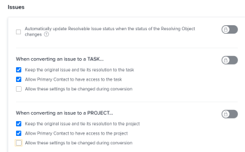
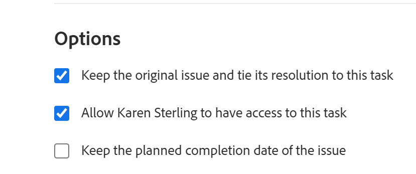
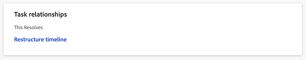

# Overzicht van Oplossende en Oplosbare objecten

<!-- Audited: 08/2025 -->

Een oplosbaar object is een probleem waarvan de resolutie is gekoppeld aan een oplosbaar object. Een oplossend Voorwerp is een project, een taak, of een andere kwestie.

Wanneer u een kwestie in een taak of een project omzet, wordt de kwestie het Oplosbare Voorwerp van de taak of het project.

U kunt een kwestie aan een het oplossen Voorwerp manueel ook verbinden, dat een taak, een project, of een kwestie kan zijn. Voor informatie, zie [ manueel de resolutie van een kwestie aan andere kwesties, taken, of projecten ](../../../manage-work/issues/convert-issues/manually-tie-resolution-of-issue-to-ptis.md) binden.

In dit scenario, wordt de originele kwestie het Resolvable Voorwerp van de taak, het project, of de kwestie.

## Adobe Workfront instellen voor verwerking van oplosbare objecten {#set-up-adobe-workfront-to-handle-resolvable-objects}

Als Workfront-beheerder of groepsbeheerder kunt u bepalen hoe u de Oplosbare objecten in uw systeem of voor uw groep wilt verwerken.

U kunt selecteren om het Resolvable Voorwerp te houden aangezien u het in een taak of een project omzet, of het te schrappen zodra de taak of het project wordt gecreeerd. U kunt deze instellingen wijzigen tijdens het converteren van uitgaven. Hiermee kan de gebruiker de uitgaven converteren en selecteren of de uitgave behouden of verwijderen tijdens het converteren.

>[!NOTE]
>
>Oplosbare objecten zijn altijd problemen waarvan de resolutie en status afhankelijk kunnen zijn van de resolutie en status van het object dat ze hebben opgelost. Het oplossen van Voorwerpen kan kwesties, taken, of projecten zijn.

Voor informatie over vestiging voorkeur voor de behandeling van Oplosbare Voorwerpen, zie [ de taak van het hele systeem vormen en voorkeur uitgeven ](../../../administration-and-setup/set-up-workfront/configure-system-defaults/set-task-issue-preferences.md).

<!--WRITER

(Note: drafted and just pointed the user to the article linked above) 

To establish the system default for what happens to the issue as it is being converted to a task or a project:

<ol>
<li value="1">Log in to Workfront as a Workfront administrator or group administrator.</li>
<li value="2"> 
  From the main menu, click <strong>Setup</strong>. 
 
  
 </li>
<li value="3">Expand <strong>Project Preferences</strong>.</li>
<li value="4">Click <strong>Tasks & Issues</strong>.</li>
<li value="5">Go to the <strong>Issues</strong> area of the setup.  Consider editing any of the following settings:
<ul>
<li>
<strong>Automatically update Resolvable Issue status when the status of the Resolving Object changes:</strong> Select this option to tie the resolution of the original issue to the resolution of its Resolving Object. In order for this setting to have any effect, the options to <strong>Keep the original issue and tie its resolution to the task</strong> or<strong>project</strong> must be selected.

<ul>
<li>When this setting is enabled, you can create custom statuses with the same key for both issues and projects or tasks. When the project or task (as a resolvable object) turns into the custom status, the change also reflects on the status of the issue. The status key must be the same for the issue and project or task statuses.</li>
<li>
When this setting is disabled, resolving object statuses are automatically set to the default status, instead of the custom ones. For more information about the default statuses, see <a href="#synchronize-the-status-of-the-resolvable-object-with-that-of-the-resolving-object" class="MCXref xref">Synchronize the Status of the Resolvable Object with that of the Resolving Object</a>.
<note type="note">
The default status of the issue is controlled by the status of the project or task, regardless of whether this option is selected or not.
</note></li>
</ul></li>
<li><strong>When converting an issue to a TASK...:</strong> The settings in this section determine what happens during the conversion process from issue to task:
<ul>
<li><strong>Keep the original issue and tie its resolution to the task:</strong> When converting the issue, it remains visible as an issue until the task is complete. The status of the issue automatically changes to Closed when the task completes.</li>
<li><strong>Allow Primary Contact to have access to the task:</strong> Gives the primary contact (issue creator) access to the task to review the task, make updates, and stay informed of its progress.</li>
<li><strong>Allow these settings to be changed during conversion:</strong> Allows the user who is converting the issue to change these options during the conversion of an issue to a task. </li>
</ul></li>
<li><strong>When converting an issue to a PROJECT...:</strong> The settings in this section determine what happens during the conversion process from issue to project:
<ul>
<li><strong>Keep the original issue and tie its resolution to the project:</strong> When converting the issue, it remains visible as an issue until the project is complete. The status of the issue automatically changes to Closed when the project completes.</li>
<li><strong>Allow Primary Contact to have access to the project:</strong> Gives the primary contact (issue creator) access to the project to review the project, make updates, and stay informed of its progress.</li>
<li><strong>Allow these settings to be changed during conversion:</strong> Allows the user who is converting the issue to change these options during the conversion of an issue to a project. </li>
</ul></li>
</ul></li>
<li value="6">Click <strong>Save</strong>.</li>
</ol>

-->

## Verwerk het oplosbare object tijdens de conversie naar een project of een taak

Afhankelijk van de manier de Workfront of de groepsbeheerder de systeem- of groep-vlakke Voorkeur van de Uitgave vormde, zou u het oplosbare voorwerp tijdens de omzetting van een kwestie in een project of een taak kunnen kunnen behandelen.

De volgende scenario&#39;s bestaan:

* Als de Workfront of de groepsbeheerder de optie De oorspronkelijke uitgave behouden heeft en zijn resolutie aan de taak en de optie De oorspronkelijke uitgave behouden heeft en zijn resolutie aan het geselecteerde project bindt en Toestaan dat deze instellingen tijdens de conversie worden gewijzigd niet selecteert, kunt u deze instellingen niet wijzigen wanneer u uitgaven converteert naar taken of projecten.\
  

* Als de Workfront of de groepsbeheerder de optie De oorspronkelijke uitgave behouden heeft en zijn resolutie aan de taak en de optie De oorspronkelijke uitgave behouden heeft en de resolutie aan het geselecteerde of niet-geselecteerde project vastlegt en de optie Deze instellingen tijdens de conversie wijzigen toestaan is geselecteerd, kunt u deze instellingen wijzigen terwijl u uitgaven omzet in taken of projecten.\
   te houden

Voor meer informatie over het omzetten van kwesties in taken en projecten, zie [ Overzicht van het omzetten van kwesties in Adobe Workfront ](../../../manage-work/issues/convert-issues/convert-issues.md).

<!--WRITER

<h2>Tie the resolution of an issue to a project, task or </h2> 

(NOTE: created new article for this section; draft when the article is live and see if you need to make a link from this one to the new article) 

You can manually tie the resolution of an issue to the resolution of a project, task, or issue without converting the issue. The issue becomes one of the Resolvable Objects of the project, task, or issue you select. When you do this, a change in the status of the project, task, or issue triggers a change in the status of the original issue, so you cannot manually edit the status of the original issue.  For more information about how the status of the Resolving Object affects the Resolvable Object, see <a href="#synchronize-the-status-of-the-resolvable-object-with-that-of-the-resolving-object" class="MCXref xref">Synchronize the Status of the Resolvable Object with that of the Resolving Object</a>.

You must have Manage permissions on the original issue and View permissions on the project, task, or issue to do this. 

To tie the resolution of an issue to the resolution of a project, task, or issue:

<ol>
<li value="1">Navigate to an issue whose resolution you want to tie to a task or a project.</li>
<li value="2"> 
  Click the <strong>Issue Details</strong> > <strong>Overview</strong> area. 
  </li>
<li value="3"> 
Click the <strong>Edit</strong> icon  in the upper-right corner of the Issue Details section. 
 </li>
<li value="4">At the bottom of the form,  click in the <strong>Resolved By</strong> field,  and select from the following types of resolving objects:
<ul>
<li><strong>Project</strong></li>
<li><strong>Task</strong></li>
<li>
<strong>Issue</strong>
</li>
</ul>
The field for the resolving object displays. 
</li>
<li value="5">After selecting the object, start typing the name of a specific project, task, or issue in the available field and select it when it appears in the drop-down list. </li>
<li value="6">Click <strong>Save</strong> <strong>Changes</strong>. The original issue becomes the Resolvable Object for the project, task, or issue you selected in step 4 and 5. <note type="note">
One project, task, or issue may have multiple issues as Resolvable Objects.
</note></li>
</ol>

-->

## De status van het verwijderbare object synchroniseren met die van het oplosbare object {#synchronize-the-status-of-the-resolvable-object-with-that-of-the-resolving-object}

* [ synchroniseer statussen wanneer het Resolving Voorwerp een kwestie ](#synchronize-statuses-when-the-resolving-object-is-an-issue) is
* [Synchroniseer statussen wanneer het Oplossende Voorwerp een taak of een project is](#synchronize-statuses-when-the-resolving-object-is-a-task-or-a-project)

### Statussen synchroniseren wanneer het oplossen van object een probleem is {#synchronize-statuses-when-the-resolving-object-is-an-issue}

Wanneer een uitgave handmatig aan een andere uitgave is gekoppeld, wordt door de status van de tweede uitgave (Object oplossen) een wijziging in de status van de eerste uitgave (Oplosbaar object) veroorzaakt. De status van de eerste uitgave komt overeen met de status waarnaar de tweede uitgave wordt gewijzigd. Dit geldt zowel voor de standaardstatus als voor de aangepaste uitgiftestatus.

### Synchroniseer statussen wanneer het Oplossende Voorwerp een taak of een project is {#synchronize-statuses-when-the-resolving-object-is-a-task-or-a-project}

Wanneer een kwestie het Oplosbare Voorwerp van een taak of een project is, brengen de veranderingen in het statuut van de taken en de projecten veranderingen in het statuut van de kwestie teweeg. Standaardstatussen worden anders geactiveerd dan aangepaste statussen, in dit geval.

Wanneer de douanestatus van een project aan een standaardstatus evenaart die geen verandering in de uitgiftestatus teweegbrengt, brengt de verandering in de projectstatus geen verandering in status voor de kwestie teweeg.

* [ synchroniseer de Standaardstatus van het Resolving Voorwerp met de StandaardStatus van het Resolvable Voorwerp ](#synchronize-the-default-status-of-the-resolving-object-with-the-default-status-of-the-resolvable-object)
* [Synchroniseer de Status van de Douane van het Resolving Voorwerp met de Status van de Douane van het Oplosbare Voorwerp](#synchronize-the-custom-status-of-the-resolving-object-with-the-custom-status-of-the-resolvable-object)

#### Synchroniseer de Standaardstatus van het Oplossende Voorwerp met de Standaardstatus van het Oplosbare Voorwerp {#synchronize-the-default-status-of-the-resolving-object-with-the-default-status-of-the-resolvable-object}

Ongeacht of de status van het Probleem met oplossing automatisch bijwerken wanneer de status van de optie Oplosbaar object wijzigt is geselecteerd, verandert telkens als de standaardstatus verandert in de Oplossende objecten (projecten of taken) de status van het Oplosbare object (problemen) dienovereenkomstig. Alleen standaardstatussen worden al toegewezen om een dergelijke wijziging te activeren.

De volgende standaardtaakstatussen activeren de volgende wijzigingen in de standaardemissiestatus wanneer de uitgave is ingesteld als het oplossende object van de taak:

| **STATUS VAN DE TAAK** | **STATUS VAN DE UITGAVE** |
|---|---|
| Nieuw | Nieuw |
| In uitvoering | In uitvoering |
| Voltooid | Gesloten |

De volgende standaardprojectstatussen brengen de volgende veranderingen in de standaardemissiestatus teweeg wanneer de kwestie als Resolvable Voorwerp van een project wordt geplaatst. Sommige statussen van projecten activeren geen wijzigingen in de status van de uitgave. De kwesties blijven in de status verkeren die zij hadden voordat het project in een van deze statussen werd omgezet:

| **STATUS VAN HET PROJECT** | **STATUS VAN DE UITGAVE** |
|---|---|
| Planning | Nieuw |
| Huidig | In uitvoering |
| In de wachtstand | In de wachtstand |
| Gevraagd | Hiermee wordt geen wijziging in de emissiestatus veroorzaakt |
| Goedgekeurd | Hiermee wordt geen wijziging in de emissiestatus veroorzaakt |
| Geweigerd | Hiermee wordt geen wijziging in de emissiestatus veroorzaakt |
| Idea | Hiermee wordt geen wijziging in de emissiestatus veroorzaakt |
| Dead | Gesloten |
| Voltooid | Gesloten |

>[!NOTE]
>
>Nadat de uitgiftestatus is gesloten (als gevolg van het sluiten van de taak of het project), blijft het probleem gesloten, ongeacht in welke taak of projectstatus deze wordt gewijzigd nadat de taak of het project is gesloten.

#### Synchroniseer de Status van de Douane van het Resolving Voorwerp met de Status van de Douane van het Oplosbare Voorwerp {#synchronize-the-custom-status-of-the-resolving-object-with-the-custom-status-of-the-resolvable-object}

Wanneer u de status van de taak of het project wijzigt in een aangepaste status, verandert de status van de uitgave alleen in de status van een aangepaste uitgave als aan de volgende twee voorwaarden is voldaan:

* De status Oplosbaar probleem automatisch bijwerken wanneer de status van de optie Oplossend object wijzigt is geselecteerd. Voor meer informatie, zie [ Opstelling Adobe Workfront om Oplosbare Voorwerpen ](#set-up-adobe-workfront-to-handle-resolvable-objects) te behandelen.

* De douanestatus van het project of de taak heeft de zelfde drie-lettercode zoals de status van de uitgiftedouane.

U kunt aangepaste statussen maken met dezelfde sleutel voor zowel uitgaven als projecten of taken. Wanneer het project of de taak (als Oplossend Voorwerp) in de douanestatus worden veranderd, weerspiegelt de verandering ook op de uitgiftestatus. De statussleutel moet gelijk zijn voor de uitgave en project- of taakstatus.

Stel dat u een aangepaste status voor een project maakt met de naam Launched met de drieletterige code-LCD, die gelijk is aan Current. Vervolgens maakt u een aangepaste status voor uitgave met de naam Project Launched, ook met de lettercode LCD, die overeenkomt met In uitvoering. Wanneer u het project als Gelanceerd merkt, zal de kwestie automatisch de status in Ganceerd Project veranderen. Als de status van het probleem Oplosbaar probleem automatisch bijwerken wanneer de status van de instelling voor het wijzigen van objecten wordt uitgeschakeld, verandert de status van het probleem in Bezig.

Voor meer informatie over het creëren van een douanestatus, zie [ een status ](../../../administration-and-setup/customize-workfront/creating-custom-status-and-priority-labels/create-or-edit-a-status.md) creëren of uitgeven.

## Synchroniseer het percentage voltooide van een Oplossend Voorwerp met dat van het Oplosbare Voorwerp

Als een kwestie door een taak of een project wordt opgelost, het percentage van de kwestie volledige updates over de oplosbare kwestie wanneer om het even welke volgende dingen voorkomen:

* Wanneer iemand een wijziging in de taak of het project opslaat.
* Wanneer de tijdlijn van het project opnieuw wordt berekend.

Als een probleem door een ander probleem wordt opgelost, wordt het percentage bijgewerkt wanneer een van de problemen wordt bijgewerkt.

## Zoek het oplosbare object op een taak of een project

>[!NOTE]
>
>Om de stappen in deze sectie uit te voeren, moet u minstens toegang van de Mening tot taken en projecten en toestemmingen van de Mening aan de taak of het project hebben die het oplosbare voorwerp bevat u wilt bekijken.

Het vinden van het het oplossen van voorwerp is identiek voor taken en projecten.

1. Navigeer naar een project of een taak u door een kwestie om te zetten creeerde.
1. Op de linkerkant van de pagina, selecteer de **Details van de Taak** of **Details van het Project** tabel.
1. Bij de bodem van de **sectie van het Overzicht**, bepaal de plaats van **Dit lost** gebied op waar het Resolvable Voorwerp van de taak of het project wordt getoond.

    op

   >[!NOTE]
   >
   >Uitgaven kunnen niet naar andere uitgaven worden geconverteerd, maar ze kunnen handmatig aan een Probleem oplossen worden gekoppeld. Een project, taak of kwestie kan veelvoudige kwesties als Oplosbare Voorwerpen hebben. Wanneer het project, de taak, of de kwestie oplossen, lost het Oplosbare Voorwerp (kwestie) ook op. Het Oplossbare probleem blijft gesloten, zelfs als het project, de taak of het probleem dat het oplost opnieuw wordt geopend.

## Probleem identificeren met een oplossend object in een lijst

In een lijst van kwesties, kunt u kwesties identificeren die als het oplossen van voorwerpen via statuspictogrammen door dit pictogram in de **pictogrammen van de Status** of **kolommen van Vlaggen** worden geëtiketteerd:

## De informatie van Objecten van de mening Oplosbaar en van het Oplossen in een rapport

U kunt informatie over de Oplosbare of Oplossende Voorwerpen in de mening of het rapport voor projecten, taken, of kwesties tonen.

In de volgende tabel wordt aangegeven welke velden u kunt weergeven en in welke weergaven u deze kunt weergeven:

<table style="table-layout:auto"> 
 <col> 
 <col> 
 <col> 
 <col> 
 <thead> 
  <tr> 
   <th><strong> Gebied in Mening </strong> </th> 
   <th><strong> Mening van de Uitgave </strong> </th> 
   <th><strong> Mening van de Taak </strong> </th> 
   <th><strong> Mening van het Project </strong> </th> 
  </tr> 
 </thead> 
 <tbody> 
  <tr> 
   <td><strong> heeft Resolvables </strong>: Toont een Echte waarde als het project of de taak Oplosbare Kwesties verbonden aan hen, en een Vals waarde heeft als zij niet.</td> 
   <td>✓</td> 
   <td>✓</td> 
   <td>✓</td> 
  </tr> 
  <tr> 
   <td><strong> Oorspronkelijke Naam van de Uitgave, de Oorspronkelijke Datum van de Ingang van de Uitgave, de Naam van de Afgever </strong>: Toont de naam en ingangsdatum van de originele kwestie, evenals de naam van de gebruiker die de kwestie in een tekst-wijze aangepaste mening creeerde.  voor meer informatie, zie <a href="../../../reports-and-dashboards/reports/custom-view-filter-grouping-samples/view-display-original-issue-info-task-project-list.md" class="MCXref xref"> Mening: toon originele uitgifteinformatie over taak of projectlijsten </a>. </td> 
   <td> </td> 
   <td> ✓</td> 
   <td> ✓</td> 
  </tr> 
  <tr> 
   <td> 
<strong> Resolvables:</strong> toont een lijst van alle Resolvable Voorwerpen op een de douanemening van de tekstwijze voor een project of taakrapport of een lijst.
 
Voor meer informatie, zie <a href="../../../reports-and-dashboards/reports/custom-view-filter-grouping-samples/view-resolvable-objects-task-project-report.md" class="MCXref xref"> Mening: De oplosbare Voorwerpen in een taak of projectrapport </a>
 </td> 
   <td> </td> 
   <td>✓</td> 
   <td> ✓</td> 
  </tr> 
  <tr> 
   <td><strong> Bekeerde de Hervormer van de Uitgave </strong>: De informatie van vertoningen over de gebruiker die oorspronkelijk de kwestie opende die later in de taak werd omgezet. </td> 
   <td> </td> 
   <td>✓</td> 
   <td> </td> 
  </tr> 
  <tr> 
   <td><strong> los Project </strong> op: De informatie van vertoningen over het Oplossende Project dat of van de originele kwestie of manueel als Oplossend Voorwerp van een kwestie werd omgezet werd aangewezen.</td> 
   <td>✓</td> 
   <td> </td> 
   <td> </td> 
  </tr> 
  <tr> 
   <td><strong> los Taak </strong> op: De informatie van vertoningen over de Resolving Taak die of van de originele kwestie werd omgezet of manueel als het Oplossen Voorwerp van een kwestie werd aangewezen.</td> 
   <td>✓ </td> 
   <td> </td> 
   <td> </td> 
  </tr> 
  <tr> 
   <td><strong> los Uitgave </strong> op: De informatie van vertoningen over het Oplossen Uitgave die manueel als het Oplossen Voorwerp van een kwestie werd aangewezen.</td> 
   <td> ✓</td> 
   <td> </td> 
   <td> </td> 
  </tr> 
 </tbody> 
</table>
