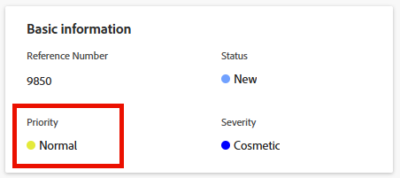

# Prioriteit van probleem bijwerken

U kunt een prioriteit voor een kwestie bepalen om te wijzen op hoe belangrijk de kwestie is.

U moet over beheerdersmachtigingen voor het probleem beschikken om de prioriteit van het probleem te wijzigen. [ werk de Prioriteit van een kwestie ](#update-the-priority-of-an-issue) bij.

## Toegangsvereisten

U moet de volgende toegang hebben om de stappen in dit artikel uit te voeren:

<table style="table-layout:auto"> 
 <col> 
 <col> 
 <tbody> 
  <tr> 
   <td role="rowheader">Adobe Workfront-abonnement*</td> 
   <td> 
Alle 
 </td> 
  </tr> 
  <tr> 
   <td role="rowheader">Adobe Workfront-licentie*</td> 
   <td> 
Aanvraag of hoger
 </td> 
  </tr> 
  <tr> 
   <td role="rowheader">Configuraties op toegangsniveau*</td> 
   <td> 
Toegang tot problemen bewerken
 
Opmerking: als u nog steeds geen toegang hebt, vraag dan aan de Workfront-beheerder of deze aanvullende beperkingen op uw toegangsniveau heeft ingesteld. Voor informatie over hoe een beheerder van Workfront uw toegangsniveau kan wijzigen, zie <a href="../../../administration-and-setup/add-users/configure-and-grant-access/create-modify-access-levels.md" class="MCXref xref"> tot douanetoegangsniveaus </a> leiden of wijzigen.
 </td> 
  </tr> 
  <tr> 
   <td role="rowheader">Objectmachtigingen</td> 
   <td> 
Rechten voor het probleem beheren
 
Voor informatie bij het vragen van om extra toegang, zie <a href="../../../workfront-basics/grant-and-request-access-to-objects/request-access.md" class="MCXref xref"> de toegang van het Verzoek tot voorwerpen </a>.
 </td> 
  </tr> 
 </tbody> 
</table>

&#42; om te weten te komen welk plan, vergunningstype, of toegang u hebt, contacteer uw beheerder van Workfront.

## Overzicht van de prioriteiten van de problematiek

Aan elk prioritair label is een nummer gekoppeld dat niet kan worden gewijzigd.

Adobe Workfront-beheerders kunnen prioriteitslabels in Workfront wijzigen of ze kunnen nieuwe prioriteiten maken. Hierdoor kunnen de opties die u hebt voor het veld Prioriteit in uw Workfront-instantie afwijken van de opties die hieronder worden vermeld.

U zou vertrouwd met de nummeringsopeenvolging voor prioriteiten moeten worden die in uw organisatie worden gebruikt.\
Bijvoorbeeld, zou uw organisatie aantal 1 kunnen gebruiken om naar urgente taken te verwijzen, als het etiket van de prioriteit is gewijzigd.

Voor meer informatie over het aanpassen van de namen van prioriteiten in uw instantie, zie [ prioriteiten ](../../../administration-and-setup/customize-workfront/creating-custom-status-and-priority-labels/create-customize-priorities.md) creëren en aanpassen.

Verwijs naar de volgende lijst om elk standaard prioritaire etiket en zijn overeenkomstige aantal te begrijpen:

<table style="table-layout:auto"> 
 <col> 
 <col> 
 <thead> 
  <tr> 
   <th>Prioriteitslabel   (kan worden gewijzigd) </th> 
   <th>Prioriteitsnummer   (kan niet worden gewijzigd) </th> 
  </tr> 
 </thead> 
 <tbody> 
  <tr> 
   <td> Geen </td> 
   <td> 0 </td> 
  </tr> 
  <tr> 
   <td> Laag </td> 
   <td> 1 </td> 
  </tr> 
  <tr> 
   <td> Normaal </td> 
   <td> 2 </td> 
  </tr> 
  <tr> 
   <td> Hoog </td> 
   <td> 3 </td> 
  </tr> 
  <tr> 
   <td> Dringend </td> 
   <td> 4 </td> 
  </tr> 
 </tbody> 
</table>

## De prioriteit van een probleem bijwerken {#update-the-priority-of-an-issue}

1. Ga naar de kwestie waarvan prioriteit u wilt wijzigen.
1. Klik **Details van de Uitgave** in het linkerpaneel.

   De **sectie van het Overzicht** zou door gebrek moeten tonen.

1. Klik het **Prioritaire** gebied op het **Basisinformatie** gebied.

   

1. Selecteer een waarde voor het **Prioritaire** gebied.

   Afhankelijk van hoe uw Workfront-beheerder Prioriteiten heeft geconfigureerd in uw systeem, kunnen de opties variëren.

1. Klik **sparen Veranderingen**.
