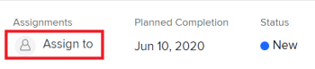

# Problemen toewijzen

U kunt problemen toewijzen aan gebruikers, rollen en teams om aan te geven wie verantwoordelijk is voor het voltooien van de problemen. Voor algemene informatie over het toewijzen van problemen raadpleegt u [Overzicht van uitgaven wijzigen](../../../manage-work/issues/manage-issues/modify-issue-assignments-overview.md).

>[!TIP]
>
>U kunt meerdere gebruikers, taakrollen of teams toewijzen. U kunt alleen actieve gebruikers, taakrollen en teams toewijzen.
>
>Als een gebruiker, een baanrol, of een team werden toegewezen alvorens zij werden gedeactiveerd, blijven zij toegewezen aan het het werkpunt. In dit geval raden we het volgende aan:
>
>* Wijs het werkitem opnieuw toe aan actieve bronnen.
>* Koppel de gebruikers in een gedeactiveerd team aan een actief team en wijs het het werkpunt aan het actieve team opnieuw toe.

Naast dit artikel raden we u aan de volgende artikelen te lezen voor meer informatie over het toewijzen van problemen:

* [Overzicht van uitgaven wijzigen](../../../manage-work/issues/manage-issues/modify-issue-assignments-overview.md)
* [Problemen bewerken](../../../manage-work/issues/manage-issues/edit-issues.md)
* [Gebruikerstoewijzingen wijzigen voor meerdere uitgaven in een lijst](../../../manage-work/issues/manage-issues/edit-assignments-for-multiple-issues.md)
* [Geavanceerde toewijzingen maken](../../../manage-work/tasks/assign-tasks/create-advanced-assignments.md)
* [Slimme toewijzingen maken](../../../manage-work/tasks/assign-tasks/make-smart-assignments.md)
* [Overzicht van slimme toewijzingen](../../../manage-work/tasks/assign-tasks/smart-assignments.md)
* [Overzicht van het toewijzen van werk in de werklastverdeler](../../../resource-mgmt/workload-balancer/assign-work-in-workload-balancer.md)

U kunt een kwestie aan één of veelvoudige middelen op het individuele emissieniveau toewijzen, of u kunt veelvoudige middelen aan veelvoudige kwesties in één keer toewijzen.

Het toewijzen van problemen en taken is vergelijkbaar in Adobe Workfront. Voor algemene informatie over het toewijzen van taken raadpleegt u [Overzicht van het wijzigen van taaktaken](../../../manage-work/tasks/assign-tasks/modify-task-assignments-overview.md).

## Toegangsvereisten

U moet de volgende toegang hebben om de stappen in dit artikel uit te voeren:

<table style="table-layout:auto"> 
 <col> 
 </col> 
 <col> 
 </col> 
 <tbody> 
  <tr> 
   <td role="rowheader">Adobe Workfront-abonnement*</td> 
   <td> 
Alle 
 </td> 
  </tr> 
  <tr> 
   <td role="rowheader">Adobe Workfront-licentie*</td> 
   <td> 
Controleren of hoger
 </td> 
  </tr> 
  <tr> 
   <td role="rowheader">Toegangsniveau*</td> 
   <td> 
Toegang tot problemen bewerken
 
De mening of hogere toegang tot Projecten en Taken
 
Als u nog steeds geen toegang hebt, vraagt u de Workfront-beheerder of deze aanvullende beperkingen op uw toegangsniveau instelt. Voor informatie over toegang tot kwesties in uw Niveau van de Toegang, zie <a href="../../../administration-and-setup/add-users/configure-and-grant-access/grant-access-issues.md" class="MCXref xref">Toegang verlenen tot kwesties</a>. Voor informatie over hoe een beheerder van Workfront uw toegangsniveau kan veranderen, zie <a href="../../../administration-and-setup/add-users/configure-and-grant-access/create-modify-access-levels.md" class="MCXref xref">Aangepaste toegangsniveaus maken of wijzigen</a>. 
 </td> 
  </tr> 
  <tr> 
   <td role="rowheader">Objectmachtigingen</td> 
   <td> 
Rechten voor het probleem beheren
 
Contribute-machtigingen voor het item waar u het probleem kopieert met de mogelijkheid om problemen toe te voegen.
 
 Voor informatie over het verlenen van machtigingen voor uitgaven raadpleegt u <a href="../../../workfront-basics/grant-and-request-access-to-objects/share-an-issue.md" class="MCXref xref">Een uitgave delen </a>
 
Voor informatie over het aanvragen van aanvullende machtigingen raadpleegt u <a href="../../../administration-and-setup/add-users/configure-and-grant-access/grant-access-other-users.md">Toegang verlenen aan gebruikers</a>.
 </td> 
  </tr> 
 </tbody> 
</table>

*Neem contact op met uw Workfront-beheerder om te weten te komen welk abonnement, licentietype of toegang u hebt.

## Overwegingen voor veelvoudige taken aan baanrollen, teams, en gebruikers

Overweeg het volgende wanneer het toewijzen van veelvoudige middelen aan een het werkpunt:

* Gebruikers kunnen meer dan één taakrol aan hun profiel koppelen. Voor informatie over het associëren van gebruikers met baanrollen, zie [Gebruikersprofiel bewerken](../../../administration-and-setup/add-users/create-and-manage-users/edit-a-users-profile.md).

* Taken of problemen worden doorgaans eerst toegewezen aan een of meerdere taakrollen of teams. Wanneer de projecten klaar zijn om te beginnen, zouden zij ook aan gebruikers kunnen moeten worden toegewezen.

  Als een taak of een kwestie aan één of veelvoudige rollen wordt toegewezen en u dan ook een gebruiker toewijst, beslist Adobe Workfront welke baanrol aan de extra gebruiker (als om het even welk) te associëren volgens de volgende regels:

   * Als er slechts één taakrol is toegewezen en deze overeenkomt met de primaire rol van de gebruiker, wordt de taak of kwestie alleen toegewezen aan de gebruiker die zijn primaire rol vervult.
   * Als er veelvoudige toegewezen rollen zijn en minstens één van de rollen de secundaire rollen van de gebruiker aanpast, dan wordt de taak of de kwestie toegewezen aan de gebruiker die één van hun Andere Rollen vervult — die Workfront willekeurig selecteert als er veelvoudige gelijken zijn — evenals om het even welke extra rollen die worden toegewezen.
   * Als er een of meer toegewezen taakrollen zijn en er geen overeenkomsten met de rollen van de gebruiker zijn, dan wordt de taak of kwestie toegewezen aan zowel de rol of de rollen als aan de gebruiker.

* Als een taak of een kwestie aan een team wordt toegewezen en u ook een gebruiker toewijst, blijft de taak of de kwestie toegewezen aan zowel het team als de gebruiker.

<!--

<h2> </h2>
<h2>Considerations about removing assignments from issues</h2> 

(NOTE: drafted and moved to Modify issue assignments overview article)

You can remove assignments from one issue at a time, or you can remove assignments from multiple issues in bulk.

For more information about removing assignments from issues in bulk, see <a href="../../../manage-work/issues/manage-issues/edit-assignments-for-multiple-issues.md" class="MCXref xref">Modify user assignments for multiple issues in a list</a>. 

Consider the following when removing assignments from issues: 

<ul>
<li>When you unassign a user from an issue, the issue remains assigned to the job role that the user fulfilled on the issue.</li>
<li>When you unassign a job role or a team from an issue, the issue remains unassigned if it is not assigned to any other resources. </li>
</ul>

-->

## Eén probleem toewijzen

1. Ga naar een probleem dat u wilt toewijzen.
1. Klikken **Toewijzen aan** in de rechterbovenhoek van de uitgiftekop, in het gedeelte **Toewijzingen** gebied

   of

   Klik op de naam van de huidige toewijzingen als de uitgave al is toegewezen.

   

1. Voer een van de volgende handelingen uit:

   * Typ de naam van een gebruiker, rol of team die u wilt toewijzen en klik vervolgens op de naam wanneer deze in de lijst wordt weergegeven.

     

   * (Voorwaardelijk) Klik op een van de namen in het dialoogvenster **Voorgestelde toewijzingen** list
   * Klikken **Toewijzen aan mij** om het aan zich toe te wijzen
   * Klikken **Geavanceerd**

     Het maken van geavanceerde toewijzingen is vergelijkbaar voor taken en problemen. Voor informatie over hoe te om geavanceerde taken te maken, zie [Geavanceerde toewijzingen maken](../../../manage-work/tasks/assign-tasks/create-advanced-assignments.md).

     >[!TIP]
     >
     >Wanneer u een gebruikerstoewijzing toevoegt, ziet u de avatar, de primaire rol van de gebruiker of hun e-mailadres om onderscheid te maken tussen gebruikers met identieke namen.
     >
     >Gebruikers moeten aan ten minste één taakrol zijn gekoppeld om deze te kunnen bekijken terwijl u ze toevoegt.
     >
     >De instelling Contactinfo weergeven moet zijn ingeschakeld op uw toegangsniveau zodat gebruikers de e-mails van gebruikers kunnen bekijken. Zie voor meer informatie [Toegang verlenen aan gebruikers](../../../administration-and-setup/add-users/configure-and-grant-access/grant-access-other-users.md)

1. Klikken **Opslaan** om het toewijzen van het probleem te voltooien.
1. (Optioneel) Klik op de knop **X-pictogram** naast de naam van de toewijzingen in het gebied Toewijzingen in de koptekst van de uitgave om een toewijzing te verwijderen.

## Een probleem in een lijst toewijzen

U kunt kwesties in een lijst of een rapport toewijzen wanneer om het even welke toewijzingsgebieden in de mening van de lijst zichtbaar zijn. Dit is een snellere manier om problemen toe te wijzen.

Afhankelijk van welk veld zichtbaar is in de weergave, kunt u de volgende entiteiten aan de uitgave toewijzen:

| Option | Toegewezen entiteiten |
|---|---|
| **Toewijzen aan** | Eén gebruiker toewijzen |
| **Toegewezen** | Eén gebruiker toewijzen |
| **Toewijzingen** | Wijs gebruikers, baanrollen, of teams toe. |

Om kwesties in een lijst toe te wijzen:

1. Ga naar een lijst met problemen waarvoor de velden Toegewezen aan, Toegewezen of Toewijzingen in de weergave staan.
1. Voer een van de volgende handelingen uit om problemen toe te wijzen:

   * Klik in het dialoogvenster **Toegewezen aan** of **Toegewezen** en typ de naam van een actieve gebruiker die u aan de uitgave wilt toewijzen. Klik vervolgens op de naam wanneer deze wordt weergegeven in de lijst.

     

   * Klik in het dialoogvenster **Toewijzingen** veld en typ de naam van een actieve gebruiker, taakrol of actief team die u aan de uitgave wilt toewijzen, en klik vervolgens op de naam wanneer deze in de lijst wordt weergegeven.

     

   >[!TIP]
   >
   >Wanneer u een gebruikerstoewijzing toevoegt, ziet u de avatar, de primaire rol van de gebruiker of hun e-mailadres om onderscheid te maken tussen gebruikers met identieke namen.
   >
   >Gebruikers moeten aan ten minste één taakrol zijn gekoppeld om deze te kunnen bekijken terwijl u ze toevoegt.
   >
   >De instelling Contactinfo weergeven moet zijn ingeschakeld op uw toegangsniveau zodat gebruikers de e-mails van gebruikers kunnen bekijken. Zie voor meer informatie [Toegang verlenen aan gebruikers](../../../administration-and-setup/add-users/configure-and-grant-access/grant-access-other-users.md).

1. (Voorwaardelijk) Klik, indien zichtbaar in het veld Toewijzingen, op de knop **Personenpictogram**  in de rechterbovenhoek van het toewijzingsvak om het vak Geavanceerde toewijzingen te openen en geavanceerde toewijzingen te maken. Zie voor meer informatie [Geavanceerde toewijzingen maken](../../../manage-work/tasks/assign-tasks/create-advanced-assignments.md).

   >[!TIP]
   >
   >U kunt geen geavanceerde toewijzingen maken vanuit de velden Toegewezen aan of Toegewezen.

1. Nadat u de toewijzingen aan de uitgave hebt toegevoegd, drukt u op Enter of klikt u ergens op de pagina om de wijzigingen op te slaan.

## Problemen bulksgewijs toewijzen

1. Ga naar een lijst met problemen die u bulksgewijs wilt toewijzen.
1. Selecteer verschillende problemen in de lijst.
1. Klik op de knop **Pictogram Bewerken** .

   De **Problemen bewerken** wordt geopend.

1. In de **Toewijzingen** gebied, selecteert u de **Geadresseerde** typt u vervolgens de naam van een gebruiker, taakrol of team die u aan alle problemen wilt toewijzen.

   >[!IMPORTANT]
   >
   >Als een van de problemen al is toegewezen, worden de bronnen die u hier opgeeft, toegevoegd aan de problemen in plaats van de bestaande bronnen over de problemen te vervangen.

1. (Optioneel) Selecteer het keuzerondje in het dialoogvenster **Eigenaar van uitgave** kolom om aan te geven welke bron de primaire ontvanger of de eigenaar van de uitgave is, wanneer u meer dan één bron aan de uitgave toewijst. Dit is niet beschikbaar voor teams.
1. (Optioneel) Selecteer een rol die de gebruiker moet vervullen in de publicatie **Een rol kiezen** vervolgkeuzelijst in het dialoogvenster **Rol van de gemachtigde** wanneer u gebruikers toewijst aan uitgaven. Als u geen rol selecteert, selecteert Workfront automatisch de Primaire Rol van de gebruiker.

1. (Optioneel) Als u bestaande toewijzingen uit alle uitgaven wilt verwijderen, voert u een van de volgende handelingen uit:

   1. Typ de naam van een gebruiker, rol of team die u uit de uitgave wilt verwijderen en selecteer deze vervolgens wanneer deze in de lijst wordt weergegeven en klik op **Toegewezen verwijderen** om extra te verwijderen toewijzingen toe te voegen.
   1. Klikken **Alle bestaande toewijzingen verwijderen** om alle toewijzingen uit alle geselecteerde uitgaven te verwijderen.

1. Klikken **Wijzigingen opslaan**.
1. (Optioneel en voorwaardelijk) Wanneer de velden Toegewezen aan of Toewijzingen in uw lijst met problemen worden weergegeven, klikt u in een van deze kolommen voor een uitgave en klikt u vervolgens op de knop **X-pictogram** naast de naam van een toegewezen persoon om deze uit de uitgave te verwijderen.
