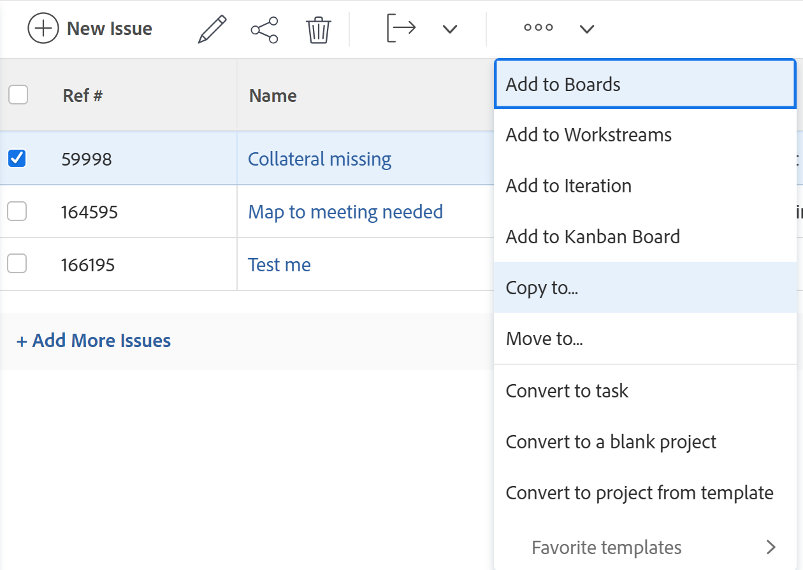

# Uitgaven kopiëren

<!--Audited: 08/2025-->

U kunt een uitgave of een verzoek kopiëren en hen op het zelfde of een ander project opslaan. U kunt een kwestie van een taak aan een ander project ook kopiëren.

U kunt uitgaven van de volgende voorwerpen kopiëren:

* Van een project aan het zelfde project (dupliceer het op het zelfde project)
* Van een taak naar dezelfde taak (dupliceren als deze zich op dezelfde taak bevindt)
* Van een project naar een ander project
* Van een taak tot een project

>[!TIP]
>
>&quot;Issues&quot; en &quot;request&quot; worden door elkaar gebruikt in Workfront. U kunt kwesties over zowel projecten als taken registreren om op onvoorzien werk te wijzen dat moet worden gericht. U kunt verzoeken ook voorleggen die als kwesties op een project worden geregistreerd dat als Rij van het Verzoek wordt aangewezen.

## Toegangsvereisten

+++ Breid uit om de toegangseisen voor de functionaliteit in dit artikel weer te geven.

<table style="table-layout:auto"> 
 <col> 
 <col> 
 <tbody> 
  <tr> 
   <td role="rowheader">Adobe Workfront-pakket</td> 
   <td> 
Alle
 </td> 
  </tr> 
  <tr> 
   <td role="rowheader">Adobe Workfront-licentie</td> 
   <td> 
   <ul><li>
Medewerker of hoger
 </li>
   <li>
Lichte of hogere vergunning om een kwestie in de sectie van Kwesties van een project te kopiëren
</li></ul>
   of
   <ul><li>
Aanvrager of hoger
 </li>
   <li>
De revisor of hoger licentie om een uitgave te kopiëren in de sectie Issues van een project
</li></ul> </td> 
  </tr> 
  <tr> 
   <td role="rowheader">Configuratie op toegangsniveau</td> 
   <td> 
Toegang tot problemen bewerken
 
De mening of hogere toegang tot Projecten en Taken
 </td> 
  </tr> 
  <tr> 
   <td role="rowheader">Objectmachtigingen</td> 
   <td> 
Rechten voor het probleem beheren
 
Contribute-machtigingen voor het item waarnaar u het probleem kopieert, met de mogelijkheid om problemen toe te voegen.
</td> 
  </tr> 
 </tbody> 
</table>

Voor meer detail over de informatie in deze lijst, zie [&#x200B; vereisten van de Toegang in de documentatie van Workfront &#x200B;](/help/quicksilver/administration-and-setup/add-users/access-levels-and-object-permissions/access-level-requirements-in-documentation.md).

+++

<!--Old:

<table style="table-layout:auto"> 
 <col> 
 <col> 
 <tbody> 
  <tr> 
   <td role="rowheader">Adobe Workfront plan*</td> 
   <td> 
Any
 </td> 
  </tr> 
  <tr> 
   <td role="rowheader">Adobe Workfront license*</td> 
   <td> 
Request or higher
 
Review or higher license to copy an issue in the Issues section of a project.
 </td> 
  </tr> 
  <tr> 
   <td role="rowheader">Access level*</td> 
   <td> 
Edit access to Issues
 
View or higher access to Projects and Tasks
 
Note: If you still don't have access, ask your Workfront administrator if they set additional restrictions in your access level. For information about access to issues in your Access Level, see <a href="../../../administration-and-setup/add-users/configure-and-grant-access/grant-access-issues.md" class="MCXref xref">Grant access to issues</a>. For information on how a Workfront administrator can change your access level, see <a href="../../../administration-and-setup/add-users/configure-and-grant-access/create-modify-access-levels.md" class="MCXref xref">Create or modify custom access levels</a>. 
 </td> 
  </tr> 
  <tr> 
   <td role="rowheader">Object permissions</td> 
   <td> 
Manage permissions to the issue
 
Contribute permissions to the item where you are copying the issue to with the ability to Add Issues.
 
 For information about granting permissions to issues, see <a href="../../../workfront-basics/grant-and-request-access-to-objects/share-an-issue.md" class="MCXref xref">Share an issue </a>
 
For information on requesting additional permissions, see <a href="../../../workfront-basics/grant-and-request-access-to-objects/request-access.md" class="MCXref xref">Request access to objects </a>.
 </td> 
  </tr> 
 </tbody> 
</table>-->

## Overwegingen bij het kopiëren van problemen

### Algemene overwegingen bij het kopiëren van problemen

U hebt de kans om te selecteren om sommige punten met betrekking tot de kwestie aan de gekopieerde kwestie tijdens het kopiëren te kopiëren. Sommige items worden echter standaard overgebracht naar de nieuwe uitgave, andere niet, zoals in de onderstaande lijsten wordt beschreven.

De volgende items worden standaard naar de nieuwe uitgave gekopieerd:

* Primaire contactpersoon
* Aangepaste formulieren. De informatie in de aangepaste velden wordt alleen naar de nieuwe uitgave gekopieerd wanneer u Aangepaste gegevens selecteert tijdens het kopiëren.
* Goedkeuringen
* Geplande begin- en geplande einddatum

De volgende objecten worden standaard niet naar de nieuwe uitgave gekopieerd:

* Aangemeld aantal uren

### Overwegingen voor problemen die samenhangen met documenten of aanvraagwachtrijen

Overweeg het volgende wanneer het kopiëren van kwesties die documenten bevatten of met een verzoekrij worden geassocieerd:

* **wanneer een kwestie met een verzoekrij wordt geassocieerd:** wanneer u een kwestie aan een ander voorwerp kopieert en de kwestie met een verzoekrij wordt geassocieerd, wordt de gekopieerde kwestie niet meer geassocieerd met de originele rij de eerste kwestie voortgekomen uit.
* **wanneer een document aan de kwestie in bijlage is:** wanneer u een kwestie aan een ander voorwerp kopieert en de kwestie een document in bijlage aan het heeft, bewegen het document en zijn versies ook naar de nieuwe kwestie. Proefdrukken of goedkeuringen die aan het document zijn gekoppeld, worden niet verplaatst.
* **wanneer een kwestie met een document of een omslag wordt verbonden:** wanneer u een kwestie kopieert die documenten of omslagen verbonden met een derdedienst zoals de Aandrijving van Google heeft, de verbindingen met de documenten overbrengen naar de gekopieerde kwestie.

## Uitgaven kopiëren in een lijst

U kunt een of meerdere uitgaven kopiëren uit een lijst met problemen of uit een uitgiftenrapport.

1. Ga naar het project dat de kwestie of de kwesties bevat die u wilt kopiëren.

   of

   Ga naar een probleemrapport.

1. Als u selecteerde om naar een project te gaan, klik **Kwesties** in het linkerpaneel.
1. Selecteer de kwestie of de kwesties die u wilt kopiëren en **klikken Meer menu** bij de bovenkant van de lijst van de kwestie, dan klik **Exemplaar aan**.

   

1. Ga met het kopiëren van de kwestie voort, zoals die in de sectie [&#x200B; wordt beschreven Kopieer één enkele kwestie &#x200B;](#copy-a-single-issue) die met Stap 2 begint.

   <!--
   <MadCap:conditionalText data-mc-conditions="QuicksilverOrClassic.Draft mode">
   (NOTE: ensure step number stays accurate)
   </MadCap:conditionalText>
   -->

## Eén uitgave kopiëren {#copy-a-single-issue}

U kunt één uitgave kopiëren wanneer het bekijken.

1. Ga naar een kwestie die u wilt kopiëren, dan **Meer** menu  aan het recht van de uitgevende naam, dan **Exemplaar aan** klikken.

   

   De **vertoningen van de Kwestie van het Exemplaar**.

   

1. In de **Uitgezochte sectie van het Project van de Bestemming**, specificeer de naam van het project waar u de kwesties wilt kopiëren. De naam van het huidige project toont door gebrek.

   >[!TIP]
   >
   >Er worden slechts 100 projecten weergegeven in de lijst.

1. (Voorwaardelijk) klik **verzoektoegang** als u geen toegang hebt om kwesties aan het project te kopiëren.
1. (Voorwaardelijk) blijf de kwestie aan het geselecteerde bestemmingsproject kopiëren zonder toegang te vragen als u toegang hebt om kwesties aan één van de taken op het bestemmingsproject toe te voegen.

   

   >[!TIP]
   >
   >De gelijkaardige berichten tonen als het geselecteerde project in afwachting van goedkeuring, voltooid, of dood is, wanneer de beheerder van Workfront het toevoegen van kwesties aan deze projecten verhindert. Voor meer informatie, zie [&#x200B; systeem-brede projectvoorkeur &#x200B;](../../../administration-and-setup/set-up-workfront/configure-system-defaults/set-project-preferences.md) vormen.

1. (Facultatief) in de **sectie van Opties**, schrap om het even welke punten die in de lijst hieronder worden vermeld om hen uit de nieuwe kwestie te verwijderen. Alle opties zijn standaard geselecteerd.

   >[!NOTE]
   >
   >Dit is alleen van invloed op de gekopieerde problemen, niet op de oorspronkelijke problemen.

   <table style="table-layout:auto"> 
    <col> 
    <col> 
    <tbody> 
     <tr> 
      <td role="rowheader">Toewijzingen</td> 
      <td>Verwijdert gebruikers, baanrollen, of teams die aan de kwestie worden toegewezen.</td> 
     </tr> 
     <tr> 
      <td role="rowheader">Voortgang</td> 
      <td>Hiermee verwijdert u het eventuele percentage van de uitgave dat is voltooid.</td> 
     </tr> 
     <tr> 
      <td role="rowheader">Documenten</td> 
      <td> verwijdert alles in het documentlusje, met inbegrip van documentversies, verbonden documenten, en omslagen.   Door gebrek, kunnen de proefdrukken van het document en de goedkeuringen niet aan een andere kwestie worden gekopieerd.</td> 
     </tr> 
     <tr> 
      <td role="rowheader">Machtigingen</td> 
      <td>Hiermee verwijdert u de entiteiten waarmee de uitgave wordt gedeeld. </td> 
     </tr> 
     <tr> 
      <td role="rowheader">Updates</td> 
      <td>Hiermee verwijdert u opmerkingen uit de sectie Updates van de uitgave.</td> 
     </tr> 
     <tr> 
      <td role="rowheader">Aangepaste gegevens</td> 
      <td>Hiermee verwijdert u de informatie uit het aangepaste formulier over de uitgave en de informatie over de aangepaste formulieren die zijn gekoppeld aan de documenten die bij de uitgave zijn gevoegd, als deze ook met de uitgave zijn gekopieerd. De aangepaste formulieren blijven bij de formulieren en documenten horen, maar de informatie over de formulieren gaat niet over op de nieuwe uitgave. </td> 
     </tr> 
    </tbody> 
   </table>

1. (Facultatief) in de **Uitgezochte Taak** sectie, selecteer de taak waar u de kwestie wilt bewegen.
1. Klik **kwestie van het Exemplaar** of **kwesties van het Exemplaar** als u veelvoudige kwesties in een lijst selecteerde.

   De gekopieerde problemen worden toegevoegd aan het opgegeven project.

