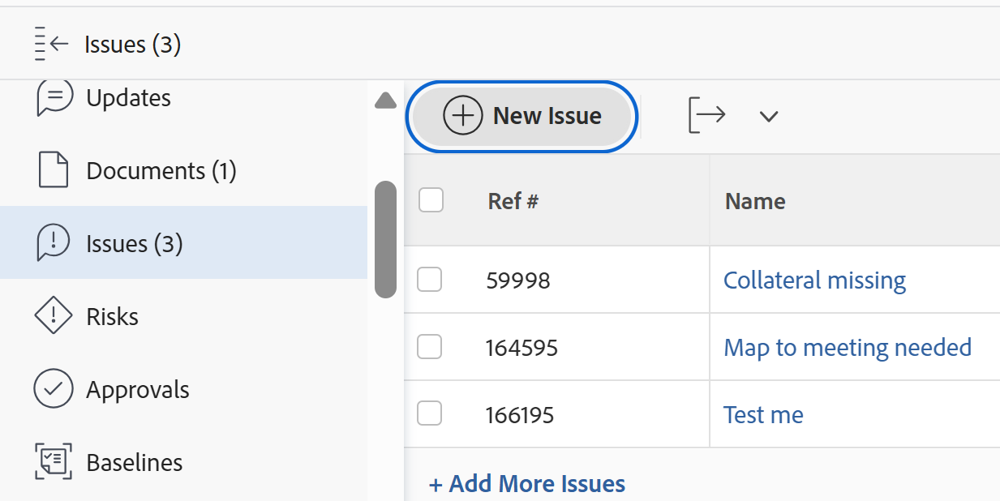

# Problemen bewerken

<!--Audited: 10/2025-->

<!--
 

The highlighted information on this page refers to functionality not yet generally available. It is available only in the Preview environment for all customers. The same features will also be available in the Production environment for all customers starting with  a week from the Preview release.      

For more information, see [Interface modernization](/help/quicksilver/product-announcements/product-releases/interface-modernization/interface-modernization.md).  

-->

U kunt informatie bewerken over uitgaven die u hebt gemaakt of die andere gebruikers hebben gemaakt als zij de problemen met u hebben gedeeld.

U kunt één uitgave bewerken of u kunt uitgaven in een lijst bewerken. Voor informatie over het uitgeven van kwesties in een lijst, zie [&#x200B; kwesties in een lijst &#x200B;](../../../manage-work/issues/manage-issues/edit-issues-in-a-list.md) uitgeven.

## Toegangsvereisten

+++ Breid uit om de toegangseisen voor de functionaliteit in dit artikel weer te geven. 

<table style="table-layout:auto"> 
 <col> 
 <col> 
 <tbody> 
  <tr> 
   <td role="rowheader">Adobe Workfront-pakket</td> 
   <td> 
Alle
 </td> 
  </tr> 
  <tr> 
   <td role="rowheader">Adobe Workfront-licentie</td> 
   <td> <ul><li>Medewerker of hoger</li>
   <li>Licht of hoger om kwesties in de sectie van Kwesties van een taak of een project uit te geven</li></ul>
   Of:
   <ul><li>Aanvraag of hoger</li> <li>Revisie of hoger om problemen in de sectie Problemen van een taak of project te bewerken</li></ul> </td> 
  </tr> 
  <tr> 
   <td role="rowheader">Toegangsniveau</td> 
   <td> 
Toegang tot problemen bewerken
  </td> 
  </tr> 
  <tr> 
   <td role="rowheader">Objectmachtigingen</td> 
   <td> 
Contribute-machtigingen voor een uitgave om de volgende velden in het gebied Details te bewerken: 

   <ul>
   <li>Beschrijving</li>
   <li>Status</li>
   <li>Ernst</li>
   </ul>
   
Rechten beheren voor een uitgave om alle velden in het gebied Details of in het vak Uitgave bewerken te bewerken
 
 Voor informatie over het verlenen van toestemmingen aan kwesties, zie <a href="../../../workfront-basics/grant-and-request-access-to-objects/share-an-issue.md" class="MCXref xref"> een kwestie delen </a>
 
Voor informatie bij het vragen van extra toestemmingen, zie <a href="../../../workfront-basics/grant-and-request-access-to-objects/request-access.md" class="MCXref xref"> Toegang tot voorwerpen verzoeken </a>.
 </td> 
  </tr> 
 </tbody> 
</table>

*For informatie, zie [&#x200B; vereisten van de Toegang in de documentatie van Workfront &#x200B;](/help/quicksilver/administration-and-setup/add-users/access-levels-and-object-permissions/access-level-requirements-in-documentation.md).

+++

<!--Old:

<table style="table-layout:auto"> 
 <col> 
 <col> 
 <tbody> 
  <tr> 
   <td role="rowheader">Adobe Workfront plan</td> 
   <td> 
Any 
 </td> 
  </tr> 
  <tr> 
   <td role="rowheader">Adobe Workfront license*</td> 
   <td> 
New license:

   <ul><li>Contributor or higher</li>
   <li>Light or higher to edit issues in the Issues section of a task or project</li></ul>
   
Current license:

  <ul><li>Request or higher</li> <li>Review or higher to edit issues in the Issues section of a task or a project</li></ul> </td> 
  </tr> 
  <tr> 
   <td role="rowheader">Access level</td> 
   <td> 
Edit access to Issues
  </td> 
  </tr> 
  <tr> 
   <td role="rowheader">Object permissions</td> 
   <td> 
Contribute permissions to an issue to edit the following fields in the Details area: 

   <ul>
   <li>Description</li>
   <li>Status</li>
   <li>Severity</li>
   </ul>
   
Manage permissions to an issue to edit all the fields in the Details area or in the Edit Issue box
 
 For information about granting permissions to issues, see <a href="../../../workfront-basics/grant-and-request-access-to-objects/share-an-issue.md" class="MCXref xref">Share an issue </a>
 
For information on requesting additional permissions, see <a href="../../../workfront-basics/grant-and-request-access-to-objects/request-access.md" class="MCXref xref">Request access to objects </a>.
 </td> 
  </tr> 
 </tbody> 
</table>-->

## Beperkingen bij het bewerken van problemen

Er zijn enkele beperkingen die kunnen voorkomen dat u problemen kunt bewerken.

* U kunt geen kwesties uitgeven die in een Goedkeuringsproces zijn. U kunt de status van een probleem dat zich in afwachting van goedkeuring bevindt, alleen aanmelden of bijwerken.
* U kunt documenten aan kwesties op een project uitgeven en toevoegen dat een status van Voltooid heeft, Dead, of in afwachting van Goedkeuring slechts wanneer uw beheerder van Workfront of een groepsbeheerder deze functionaliteit op het gebied van de Voorkeur van het Project toeliet. Voor informatie over het plaatsen van projectvoorkeur, zie [&#x200B; systeem-brede projectvoorkeur &#x200B;](../../../administration-and-setup/set-up-workfront/configure-system-defaults/set-project-preferences.md) vormen.

## Eén uitgave bewerken

U kunt een uitgave bewerken met de gebieden Probleem bewerken of Details van probleem. In de volgende stappen wordt het bewerken van een probleem beschreven in het venster Uitgave bewerken.

1. Ga naar het **Belangrijkste Menu**.
1. Klik **Projecten**, dan klik de naam van een project om het project te openen.
1. (Facultatief) klik **Taken**, dan klik de naam van een taak om de taak te openen.
1. Klik **Kwesties** in het linkerpaneel.

   

1. (Facultatief) om beperkte informatie over een kwestie uit te geven, klik **Details van de Uitgave** in het linkerpaneel.

   >[!NOTE]
   >
   >Afhankelijk van de manier waarop uw Workfront-beheerder of groepsbeheerder uw lay-outsjabloon heeft gewijzigd, kunnen de velden in het gebied Details van uitgave opnieuw worden gerangschikt of niet worden weergegeven. Voor informatie, zie [&#x200B; de mening van Details aanpassen gebruikend een lay-outmalplaatje &#x200B;](../../../administration-and-setup/customize-workfront/use-layout-templates/customize-details-view-layout-template.md).

   Ga als volgt te werk om de gegevens in de sectie Details te bewerken:

   1. (Optioneel) Klik op het pictogram **Alles samenvouwen** rechtsboven om alle gebieden samen te vouwen.
   1. (Facultatief en voorwaardelijk) wanneer een gebied wordt doen ineenstorten, klik de **juist-richt pijl**  naast elk gebied om het gebied uit te breiden u wilt uitgeven.
   1. (Facultatief) om een douaneformulier vast te maken, begin de naam van een vorm in **te typen voeg douaneformulier** toe, dan selecteer het wanneer het in de lijst toont, dan klik **sparen Veranderingen**.
   1. (Facultatief) klik het **pictogram van de Uitvoer** pictogram van de Uitvoer  Uitvoer **.** Selecteer een van de volgende opties:

      * Alles selecteren (wordt alleen weergegeven als er ten minste één aangepast formulier is gekoppeld)
      * Overzicht
      * De naam van een of meerdere aangepaste formulieren

      Het PDF-bestand wordt naar uw computer gedownload.

      

      Voor meer informatie, zie [&#x200B; de douaneformulieren en objecten details van de Uitvoer &#x200B;](../../../workfront-basics/work-with-custom-forms/export-custom-forms-details.md).

   Voor informatie over de velden die zichtbaar zijn in de sectie Details van uitgave, gaat u verder met het bewerken van het probleem in het venster Uitgave bewerken, zoals hieronder beschreven.

1. Om alle informatie over een kwestie uit te geven, selecteer een kwestie in een lijst, dan klik **uitgeven** bij de bovenkant van de lijst

   of

   Klik de naam van een kwestie in een lijst dan klikken **Meer** menu naast de voorwaardennaam, dan **geeft uit.**

   De **geeft** vertoningen van de dialoogdoos uit.

   >[!IMPORTANT]
   >
   >U moet over beheerdersmachtigingen voor het probleem beschikken om de koppeling Bewerken te kunnen zien.

   Alle uitgiftevelden zijn beschikbaar in het vak Uitgave bewerken en zijn gegroepeerd op de gebieden in het linkerdeelvenster.

1. Overweeg informatie op te geven in een van de volgende secties:

   * [Naam van uitgave](#issue-name)
   * [Overzicht](#overview)
   * [Toewijzingen](#assignments)
   * [Aangepaste Forms](#Custom%C2%A0F)
   * [Instellingen](#settings)

   >[!NOTE]
   >
   >Afhankelijk van de manier waarop uw Workfront-beheerder onze lay-outsjabloon instelt, kunnen de velden in het vak Probleem bewerken verschillen in uw omgeving. Voor informatie, zie [&#x200B; de mening van Details aanpassen gebruikend een lay-outmalplaatje &#x200B;](../../../administration-and-setup/customize-workfront/use-layout-templates/customize-details-view-layout-template.md).
   >
   >De meeste velden in de onderstaande secties zijn ook toegankelijk vanuit het vak Nieuwe uitgave wanneer u een uitgave maakt. De secties waaronder de velden zich bevinden, komen niet overeen met het vak Nieuwe uitgave. Voor informatie over het creëren van kwesties, zie [&#x200B; kwesties &#x200B;](../../issues/manage-issues/create-issues.md) creëren.

### Naam van uitgave {#issue-name}

1. Bewerk een uitgave zoals hierboven beschreven.
1. Klik **Naam van de Uitgave**.

   {de naamsectie van 0} Uitgave 

1. Werk het **gebied van de Naam van de Uitgave** bij.
1. Klik **sparen** of blijf het uitgeven van de volgende secties.

### Overzicht {#overview}

1. Bewerk een uitgave zoals hierboven beschreven.
1. Klik **Overzicht**.

   

1. Werk of herzie om het even welke gebieden in de volgende lijst bij:

   <table style="table-layout:auto"> 
    <col> 
    <col> 
    <tbody> 
     <tr> 
      <td role="rowheader">Beschrijving</td> 
      <td> 
Voeg aanvullende informatie toe over het probleem.
 </td> 
     </tr>

   <tr> 
      <td role="rowheader">Status</td> 
      <td> 
Selecteer de status van de uitgave. Voor meer informatie over uitgiftestatussen, zie <a href="../../../administration-and-setup/customize-workfront/creating-custom-status-and-priority-labels/issue-statuses.md" class="MCXref xref"> Toegang tot de lijst van de statussen van de systeemkwestie </a>. 
 </td> 
     </tr> 
     <tr> 
      <td role="rowheader">Prioriteit</td> 
      <td> 
Dit is een visuele vlag voor u die u toestaat om kwesties voorrang te geven.
 
Selecteer een van de volgende opties:
 
       <ul> 
        <li> 
<strong> niets </strong> 
 </li> 
        <li> 
<strong> Laag </strong> 
 </li> 
        <li> 
<strong> Normaal </strong> 
 </li> 
        <li> 
<strong> Hoog </strong> 
 </li> 
        <li> 
<strong> Dringend </strong> 
 </li> 
       </ul> 
Afhankelijk van de projectvoorkeuren die door uw Workfront-beheerder zijn geselecteerd, kunnen de namen van prioriteiten voor u anders zijn. Voor meer informatie over het uitgeven van prioriteiten, zie <a href="../../../administration-and-setup/customize-workfront/creating-custom-status-and-priority-labels/create-customize-priorities.md" class="MCXref xref"> prioriteiten </a> creëren en aanpassen.
 </td> 
     </tr> 
     <tr> 
      <td role="rowheader">Ernst</td> 
      <td> 
Dit is een visuele markering die aangeeft hoe ernstig het probleem is dat in het probleem wordt beschreven. Ernsten zijn specifiek voor problemen. Selecteer een van de volgende opties:
 
       <ul> 
        <li> 
Cosmetisch
 </li> 
        <li> 
Verwardheid
 </li> 
        <li> 
Fout met tijdelijke oplossing
 </li> 
        <li> 
Fout zonder tijdelijke oplossing
 </li> 
        <li> 
Fatale fout
 </li> 
       </ul> 
Afhankelijk van de projectvoorkeuren die door uw Workfront-beheerder zijn geselecteerd, kunnen de namen van de bestandscontroles voor u anders zijn. Voor meer informatie over het uitgeven van controles, zie <a href="../../../administration-and-setup/customize-workfront/creating-custom-status-and-priority-labels/create-customize-issue-severities.md" class="MCXref xref"> creeer of pas de controles van de kwestie </a> aan.
 </td> 
     </tr>

   <tr> 
   <td role="rowheader">Uitgave</td> 
   <td> 
De voorwaarde van een kwestie is een vlag die op het wordt geplaatst om erop te wijzen hoe het gaat.
 
   
U kunt de voorwaarde van een taak of een kwestie of automatisch of manueel plaatsen.

   
U moet aan de kwestie worden toegewezen om zijn voorwaarde te veranderen.

   
Selecteer een van de volgende opties:
 
      <ul> 
   <li> 
Vloeiend
 </li> 
   <li> 
Sommige problemen
 </li> 
   <li> 
Belangrijkste wegversperringen
 </li> 
   </ul> </td> 
     </tr>

   <tr> 
      <td role="rowheader">URL</td> 
      <td> 
Typ een webkoppeling die betrekking heeft op de informatie over de uitgave.
 </td> 
     </tr> 
     <tr> 
      <td role="rowheader">Type</td> 
      <td> 
Volgens de Eigenschappen van de Rij die door uw projectmanager op het gebied van de Details van de Rij van het project worden geselecteerd, zou u het type van de kwestie kunnen specificeren. Selecteer van de volgende opties in het <b> Type </b> drop-down menu: 
 
       <ul> 
        <li> 
<strong> Bugrapport </strong> 
 </li> 
        <li> 
<strong> de Orde van de Verandering </strong> 
 </li> 
        <li> 
<strong> Uitgave </strong> 
 </li> 
        <li> 
<strong> Verzoek </strong> 
 </li> 
       </ul> 
Afhankelijk van de projectvoorkeuren die door uw Workfront-beheerder zijn geselecteerd, kunnen de namen van de typen problemen voor u verschillen.
 </td> 
     </tr> 
     <tr> 
      <td role="rowheader">Primaire contactpersoon</td> 
      <td>Standaard is de primaire contactpersoon de maker van de uitgave. Als u dit wilt wijzigen, typt u de naam van een actieve gebruiker in Workfront en selecteert u deze in de lijst. Een kwestie kan slechts één Primaire Contact hebben.  Als u de primaire contactpersoon wijzigt, heeft de oorspronkelijke primaire contactpersoon nog steeds beheertoegang tot het probleem. U moet deze toegang uit het vakje van de Toegang van de Uitgave manueel verwijderen, wanneer het delen van een kwestie.

   <b> TIP </b>

   
Wanneer u een gebruiker van een primaire contactpersoon toevoegt, ziet u de avatar, de primaire rol van de gebruiker en hun e-mailadres om onderscheid te maken tussen gebruikers met identieke namen. Gebruikers moeten aan ten minste één taakrol zijn gekoppeld om deze te kunnen bekijken terwijl u ze toevoegt.

      
 De instelling Contactinfo weergeven moet zijn ingeschakeld op uw toegangsniveau zodat gebruikers de e-mails van gebruikers kunnen bekijken. Voor informatie, zie <a href="../../../administration-and-setup/add-users/configure-and-grant-access/grant-access-other-users.md"> toegang van de Verlening tot gebruikers </a>.

   </td> 
     </tr> 
     <tr> 
      <td role="rowheader">Datum en tijd vastleggen</td> 
      <td> 
Dit is de datum waarop de ontvanger van de uitgifte schat dat de uitgifte zal worden voltooid. Alleen toegewezen personen kunnen dit veld bewerken.
 </td> 
     </tr> 
     <tr> 
      <td role="rowheader">Geplande begindatum</td> 
      <td>Standaard is de geplande begindatum de datum en het tijdstip waarop de uitgave is gemaakt. U kunt de <strong> Geplande Datum van het Begin </strong> van de kwestie bijwerken. </td> 
     </tr> 
     <tr> 
      <td role="rowheader">Geplande voltooiing Datum en tijd</td> 
      <td> Standaard is de geplande aanmaakdatum 24 uur na de standaardbegindatum. Standaard hebben uitgaven een Duur van 1 dag. U kunt de <strong> Geplande Datum van de Voltooiing </strong> van de kwestie bijwerken.</td> 
     </tr> 
     <tr> 
      <td role="rowheader">Begindatum en -tijd</td> 
      <td>De Ware Datum van het Begin wordt automatisch bevolkt wanneer u het statuut van de kwestie in <strong> Bezig </strong> verandert. U kunt de <strong> Ware Datum van het Begin </strong> van de kwestie bijwerken. U kunt de datum desgewenst handmatig bijwerken. </td> 
     </tr> 
     <tr> 
      <td role="rowheader">Werkelijke einddatum en -tijd</td> 
      <td>De Ware Datum van de Voltooiing wordt automatisch bevolkt wanneer u het statuut van de kwestie <strong> Gesloten </strong> verandert of <strong> Opgeloste </strong>. U kunt de <strong> Ware Datum van de Voltooiing </strong> voor de kwestie bijwerken. U kunt de datum desgewenst handmatig bijwerken.</td> 
     </tr> 
     <tr> 
      <td role="rowheader">Opgelost door</td> 
      <td> 
Dit toont of de kwestie door een ander voorwerp wordt opgelost. U kunt selecteren of deze kwestie door een taak, een project, of een andere kwestie van het drop-down menu wordt opgelost, dan begin de naam van de taak, het project, of de kwestie te typen die de kwestie zal oplossen. Selecteer het wanneer het in de lijst verschijnt.

   <b> NOTITIES </b>

   <ul><li>Wanneer u een object selecteert om een probleem op te lossen, is de status van het probleem gekoppeld aan de status van het object dat het probleem oplost en kan deze status niet worden gewijzigd. Voor meer informatie over het oplossen van voorwerpen, zie <a href="../../../manage-work/issues/convert-issues/resolving-and-resolvable-objects.md" class="MCXref xref"> Overzicht van het Oplossen van en Oplosbare Voorwerpen </a>.</li>

   <li>Wanneer u een probleem verbindt dat door een andere taak, kwestie, of project moet worden opgelost, brengt geen informatie van de kwestie naar het het oplossen voorwerp (de taak, de kwestie, of het project dat in Resolved door gebied wordt vermeld) over. </li>

   <li>Wanneer uw systeem of groepsbeheerder het veld "Opgelost door" toevoegt aan een aangepaste koptekst voor uitgaven, verandert het veld in "Probleem oplossen", "Taak oplossen" of "Project oplossen" wanneer er een object is dat is gekoppeld aan de kwestie.

   U kunt dit veld niet bewerken wanneer het wordt weergegeven in de uitgiftheader. Voor meer informatie over het aanpassen van uitgiftekopballen, zie <a href="../../../administration-and-setup/customize-workfront/use-layout-templates/customize-object-headers.md"> Objectekopballen aanpassen gebruikend een lay-outmalplaatje </a></li></ul>
   </td> 
     </tr>

   <tr> 
      <td role="rowheader">Probleem oplossen, Taak oplossen of Project oplossen</td> 
      <td>De gekoppelde naam van het probleem, de taak of het probleem dat het probleem verhelpt.  </td> 
     </tr> 
      <tr> 
      <td role="rowheader">Deze oplossingen</td> 
      <td>De gekoppelde naam van het probleem dat wordt voltooid wanneer het probleem dat u opent, is opgelost.  </td> 
     </tr> 
    </tbody> 
   </table>

1. Klik **sparen** of blijf het uitgeven van de volgende secties.

#### Toewijzingen {#assignments}

1. Bewerk de uitgave zoals hierboven beschreven.
1. Klik **Toewijzingen** in het linkerpaneel.

   

1. Klik **mensen van het Onderzoek, rol en teams** en begin de naam van een gebruiker, een rol, of een team te typen dat u aan de kwestie wilt toewijzen, dan het klikken of drukken binnengaan wanneer het op de lijst toont.

   <!--
   (NOTE: ensure this is still called this; asked Anna to change it to "roles" and add a comma)
   -->

   >[!NOTE]
   >
   >Als de naam van de gebruiker een speciaal teken bevat, moet u het speciale teken in het zoekveld opnemen.

   U kunt meerdere gebruikers, taakrollen of teams toewijzen. U kunt alleen actieve gebruikers, taakrollen en teams toewijzen.

   >[!TIP]
   >
   >
   >Als een gebruiker, een baanrol, of een team werden toegewezen alvorens zij werden gedeactiveerd, blijven zij toegewezen aan het het werkpunt. In dit geval raden we het volgende aan:
   >
   >* Wijs het werkitem opnieuw toe aan actieve bronnen.
   >* Koppel de gebruikers in een gedeactiveerd team aan een actief team en wijs het het werkpunt aan het actieve team opnieuw toe.

   <!--1. In the Production environment:
         1. Indicate whether an assignee is the primary assignee on the issue, by hovering over the name of the assignee and clicking **Make Primary**. A team cannot be the primary assignee of an issue.
         1. Update the following fields: 
         <table style="table-layout:auto"> 
         <col> 
         </col> 
         <col> 
         </col> 
         <tbody> 
         <tr> 
            <td role="rowheader">Planned Hours</td> 
            <td> 
This is the amount of actual time it would take the assignees of the issue to complete it. Type the number of Planned Hours for the issue. 
 
<b>NOTE</b>
  
Changing the Planned Hours of the issue will not change the issue Planned Completion Date. 
 </td> 
         </tr> 
         <tr data-mc-conditions=""> 
            <td role="rowheader">Assignee's Role</td> 
            <td> 
Select a role from the <strong>Assignee's Role</strong> drop-down menu when you selected a person as an assignee. This is the role that the assignee can fulfill on this issue. 
 
<b>TIP</b>
            
            Only the job roles associated with each assignee in their profile appear in the drop-down menu.
 </td> 
         </tr> 
         </tbody> 
         </table>-->

1. (Facultatief) klik **toewijzen aan me** om de kwestie aan zich toe te wijzen.
1. (Facultatief) werk het **Geplande Uren** gebied bij.

   **Geplande Uren** is de hoeveelheid uren het de wijzers van de kwestie zou nemen om het te voltooien.

   >[!NOTE]
   >
   >Als u de geplande uren van de uitgave wijzigt, blijft de geplande afwerkingsdatum ongewijzigd.

1. Om taken uit alle kwesties te verwijderen, zie [&#x200B; kwesties toewijzen &#x200B;](/help/quicksilver/manage-work/issues/manage-issues/assign-issues.md).

1. Klik **sparen** of blijf het uitgeven van de volgende secties.

### Aangepaste Forms

1. Bewerk een uitgave zoals hierboven beschreven.
1. Klik **Aangepaste Forms**.

   

1. In **voeg douaneformulier** gebied toe, selecteer de douanevorm of de vormen die u met de kwestie wilt associëren. U moet aangepaste formulieren maken voordat u ze in dit veld kunt selecteren. Alleen actieve aangepaste formulieren worden in de lijst weergegeven. Voor meer informatie over de bouw van douaneformulieren, zie [&#x200B; een douaneformulier &#x200B;](/help/quicksilver/administration-and-setup/customize-workfront/create-manage-custom-forms/form-designer/design-a-form/design-a-form.md) creëren. U kunt maximaal tien aangepaste formulieren toevoegen aan een uitgave.

1. (Voorwaardelijk) Als u een aangepast formulier aan de uitgave hebt gekoppeld, bewerkt u alle velden op het formulier. U moet alle vereiste velden opgeven voordat u de uitgave kunt opslaan.

   >[!NOTE]
   >
   >Afhankelijk van de manier waarop uw Workfront-beheerder de machtigingen voor de secties in uw aangepaste formulier instelt, kan niet iedereen dezelfde velden op een aangepast formulier weergeven of bewerken. De machtigingen voor het bewerken van velden in een sectie van een aangepast formulier zijn afhankelijk van de machtigingen die u hebt voor de uitgave zelf. Voor informatie over het plaatsen van toestemmingen op secties van een douaneformulier, zie [&#x200B; een douaneformulier &#x200B;](/help/quicksilver/administration-and-setup/customize-workfront/create-manage-custom-forms/form-designer/design-a-form/design-a-form.md) creëren. Voor informatie over het plaatsen van de toestemmingen van de uitgave, zie [&#x200B; een kwestie &#x200B;](../../../workfront-basics/grant-and-request-access-to-objects/share-an-issue.md) delen.

1. Klik **sparen** of blijf het uitgeven van de volgende sectie.

### Instellingen {#settings}

1. Bewerk een uitgave zoals hierboven beschreven.
1. Klik **Montages**.

   

   Werk de volgende gegevens bij:

   <table style="table-layout:auto"> 
    <col> 
    </col> 
    <col> 
    </col> 
    <tbody> 
     <tr> 
      <td role="rowheader">Goedkeuringsproces</td> 
      <td> 
       
 
       
Selecteer een goedkeuringsproces dat u met de kwestie wilt associëren. Uw Workfront-beheerder moet goedkeuringsprocessen op systeemniveau definiëren voordat u deze aan problemen kunt koppelen. Gebruikers met beheertoegang tot goedkeuringsprocessen  kunnen ook groepsspecifieke goedkeuringsprocessen maken. voor meer informatie over het creëren van de Processen van de Goedkeuring, zie <a href="../../../administration-and-setup/customize-workfront/configure-approval-milestone-processes/create-approval-processes.md" class="MCXref xref"> een goedkeuringsproces voor het werkpunten </a> creëren. 
 
       
Houd rekening met het volgende wanneer u goedkeuringsprocessen toevoegt: 
 
       <ul> 
       <li>Alleen actieve goedkeuringsprocessen worden in de lijst weergegeven. </li> 
       <li> 
Systeemspecifieke en groepsspecifieke goedkeuringsprocessen worden in de lijst weergegeven. Een goedkeuringsproces verbonden aan een groep buiten die van het project toont niet in de lijst.
 
Belangrijk: als de groep van het project verandert, wordt het groepsspecifieke goedkeuringsproces een goedkeuringsproces voor eenmalig gebruik. Voor meer informatie over hoe de veranderingen in de groep van het project of de veranderingen in het goedkeuringsproces goedkeuringsmontages beïnvloeden, zie <a href="../../../administration-and-setup/customize-workfront/configure-approval-milestone-processes/how-changes-affect-group-approvals.md" class="MCXref xref"> hoe de groep en de veranderingen van het goedkeuringsproces aangewezen goedkeuringsprocessen </a> beïnvloeden. 
 </li> 
       <li> 
U kunt standaardgoedkeuringsprocessen bepalen die automatisch aan kwesties moeten worden vastgemaakt wanneer het creëren van verzoekrijen of de Onderwerpen van de Rij. Voor informatie over het bijwerken van de Details van de Rij, zie <a href="../../../manage-work/requests/create-and-manage-request-queues/create-request-queue.md" class="MCXref xref"> een Rij van het Verzoek </a> creëren. Voor informatie over het creëren van de Onderwerpen van de Rij, zie <a href="../../../manage-work/requests/create-and-manage-request-queues/create-queue-topics.md" class="MCXref xref"> de Onderwerpen van de Rij </a> creëren. 
 </li> 
       <li>Bij problemen met bulkbewerking bestaan de volgende scenario's: 
       <ul> 
       <li>
Wanneer u meerdere problemen van dezelfde groep selecteert, worden zowel systeemspecifieke als groepsspecifieke goedkeuringsprocessen in dit veld weergegeven.
</li> 
       <li>
Wanneer u meerdere problemen selecteert uit verschillende groepen, worden alleen goedkeuringsprocessen op systeemniveau weergegeven in dit veld.
</li> 
       <li>
Als voor een van de problemen een goedkeuringsproces voor eenmalig gebruik is gekoppeld, wordt dit vervangen door het goedkeuringsproces op systeemniveau of groepsniveau dat u selecteert. 
</li> 
       </ul></li> 
       </ul> 
       
 </td> 
     </tr> 
     <tr> 
      <td role="rowheader">Herinneringsmeldingen</td> 
      <td> 
Schakel het selectievakje in waarvoor meldingen voor herinneringen die u aan deze uitgave wilt toevoegen. Alle herinneringsmeldingen voor problemen worden weergegeven. Uw Workfront-beheerder moet Herinneringsmeldingen configureren voordat u deze op een uitgave kunt selecteren. Voor meer informatie over het vormen van de Meldingen van de Herinnering, zie <a href="../../../administration-and-setup/manage-workfront/emails/set-up-reminder-notifications.md" class="MCXref xref"> de herinneringsberichten van de Opstelling </a>
 </td> 
     </tr> 
    </tbody> 
   </table>

1. Klik **sparen.**

## Een probleem bewerken in de uitgaveheader (beperkt)

U kunt een beperkte hoeveelheid informatie in de uitgiftheader bewerken.

Uw systeem- of groepsbeheerder kan de velden die u in de uitgiftekop ziet, aanpassen. Voor informatie, zie [&#x200B; objecten kopballen aanpassen gebruikend een lay-outmalplaatje &#x200B;](../../../administration-and-setup/customize-workfront/use-layout-templates/customize-object-headers.md).

De volgende velden worden standaard opgenomen in de uitgiftheader:

* Naam van uitgave
* Percentage voltooid

  Voor informatie, zie [&#x200B; Mening en werk Percent bij Voltooid voor taken &#x200B;](/help/quicksilver/manage-work/projects/updating-work-in-a-project/view-update-percent-complete-for-tasks.md).
* Toewijzingen
* Geplande voltooiing Datum en tijd
* Status
* Goedkeuringsbeslissingen nemen als u in een huidig goedkeuringsproces als fiatteur bent ingesteld
