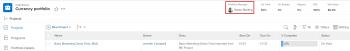

# Een portfolio maken

<!--Audited: 08/2025-->

Een Portfolio is een verzameling projecten die met dezelfde middelen, budget en planning concurreert. De projecten in een Portfolio zijn gelijkaardig genoeg dat zij de zelfde Pool van het Middel zouden gebruiken en tegen de zelfde scorecard worden gemeten.

U kunt Portfolio&#39;s gebruiken om projecten te groeperen die tot dezelfde productlijnen, afdelingen, afdelingen, bedrijven of andere bedrijfseenheden behoren.

## Toegangsvereisten

+++ Breid uit om de toegangseisen voor de functionaliteit in dit artikel weer te geven. 

<table style="table-layout:auto"> 
 <col> 
 <col> 
 <tbody> 
  <tr> 
   <td role="rowheader">[!DNL Adobe Workfront] package</td> 
   <td> 
Alle
</td> 
  </tr> 
  <tr> 
   <td role="rowheader">[!DNL Adobe Workfront] licentie</td> 
   <td> 
[!UICONTROL Standard]

   
[!UICONTROL Plan] 
 </td> 
  </tr> 
  <tr> 
   <td role="rowheader">Configuraties op toegangsniveau</td> 
   <td> 
[!UICONTROL Edit] toegang tot portfolio's
  </td> 
  </tr> 
  <tr> 
   <td role="rowheader">Objectmachtigingen</td> 
   <td> 
Nadat u een portfolio hebt gemaakt, hebt u de machtiging Beheren
  </td> 
  </tr> 
 </tbody> 
</table>

*For informatie, zie [&#x200B; vereisten van de Toegang in de documentatie van Workfront &#x200B;](/help/quicksilver/administration-and-setup/add-users/access-levels-and-object-permissions/access-level-requirements-in-documentation.md).

+++

<!--Old:

<table style="table-layout:auto"> 
 <col> 
 <col> 
 <tbody> 
  <tr> 
   <td role="rowheader">[!DNL Adobe Workfront] plan*</td> 
   <td> 
Any
</td> 
  </tr> 
  <tr> 
   <td role="rowheader">[!DNL Adobe Workfront] license*</td> 
   <td> 
New: [!UICONTROL Standard]

   
Current:[!UICONTROL Plan] 
 </td> 
  </tr> 
  <tr> 
   <td role="rowheader">Access level configurations</td> 
   <td> 
[!UICONTROL Edit] access to Portfolios
  </td> 
  </tr> 
  <tr> 
   <td role="rowheader">Object permissions</td> 
   <td> 
After you create a portfolio, you have Manage permissions to it, by default
  </td> 
  </tr> 
 </tbody> 
</table>

*For information, see [Access requirements in Workfront documentation](/help/quicksilver/administration-and-setup/add-users/access-levels-and-object-permissions/access-level-requirements-in-documentation.md). -->

## Manieren om portfolio&#39;s te maken

U kunt op een van de volgende manieren een portfolio&#39;s maken in Workfront:

* Maak een geheel nieuw portfolio, te beginnen in het gedeelte Portfolio&#39;s van het Hoofdmenu. In dit artikel wordt beschreven hoe u een geheel nieuw portfolio kunt maken.

* Importeer een portfolio met de functie voor het starten.

  Als Workfront-beheerder kunt u portfolio&#39;s importeren met behulp van een trap-start.

  Voor informatie over het invoeren van gegevens gebruikend schop-begin in Workfront, zie [&#x200B; Gegevens van de Invoer in Adobe Workfront gebruikend een Kick-Begin malplaatje &#x200B;](/help/quicksilver/administration-and-setup/manage-workfront/using-kick-starts/import-data-via-kickstarts.md).

* Voeg portefeuilles toe aangezien u hen van een verslagtype in de Planning van Workfront verbindt.

  U moet een nieuwe Workfront-licentie en een extra Workfront Planning-licentie voor Workfront Planning hebben.

  Voor informatie over toegang tot de Planning van Workfront, zie [&#x200B; Overzicht van de Toegang &#x200B;](/help/quicksilver/planning/access/access-overview.md).

  Voor informatie over het creëren van portefeuilles door hen aan verslagen toe te voegen, zie de sectie &quot;verslagen tot stand brengen aangezien u hen&quot;in artikel [&#x200B; verbindt tot verslagen &#x200B;](/help/quicksilver/planning/records/create-records.md).

## Een portfolio maken

{{step1-click-main-menu}}

1. Klik op **[!UICONTROL Portfolios]**.
1. Klik op **[!UICONTROL New Portfolio]**.
1. Vervang **[!UICONTROL Untitled Portfolio]** door de gewenste naam voor het portfolio.

   De naam mag maximaal 255 tekens bevatten.

1. (Optioneel) Klik op de naam onder **[!UICONTROL Portfolio Manager]** in de koptekst boven aan de pagina om een andere beheerder voor het portfolio toe te wijzen.

   

   Als de maker van het portfolio wordt u standaard toegewezen als vermogensbeheerder.

1. Klik op **[!UICONTROL Portfolio Details]** in het linkerdeelvenster.
1. Wijzig in het gebied **[!UICONTROL Overview]** een van de volgende gegevens:

   <table style="table-layout:auto"> 
    <col> 
    <col> 
    <tbody> 
     <tr> 
      <td role="rowheader">[!UICONTROL Description]</td> 
      <td> 
Typ een beschrijving voor de Portfolio om aan te geven wat er uniek aan is. 
 </td> 
     </tr> 
     <tr> 
      <td role="rowheader">[!UICONTROL Portfolio Manager]</td> 
      <td> 
Typ de naam van een gebruiker die u wilt aangeven als portfoliobeheerder en selecteer deze naam wanneer deze wordt weergegeven in de lijst. Dit is het zelfde als [!UICONTROL Portfolio Owner]. Dit is de persoon die het werk kan controleren dat in de projecten van de portefeuille wordt bepaald en het BedrijfsGeval kan goedkeuren.
 
Belangrijk: wanneer u iemand aanwijst als [!UICONTROL Portfolio Manager] , krijgt deze automatisch [!UICONTROL Manage] -machtigingen voor het portfolio, de programma's en de projecten in het portfolio. 
 
Tip: u kunt de header [!UICONTROL Portfolio Manager] ook boven aan de pagina bijwerken.
 </td> 
     </tr> 
     <tr data-mc-conditions=""> 
      <td role="rowheader">Groep </td> 
      <td> 
Voeg de naam van één groep toe als de groep eigenaar is van het portfolio of verantwoordelijk is voor het voltooien ervan. 
 
U kunt ervoor zorgen dat u de juiste groep selecteert door de muisaanwijzer boven de groep te plaatsen en op het pictogram [!UICONTROL information]  naast de groep te klikken. Hier wordt knopinfo weergegeven met informatie over de groep, zoals de hiërarchie van de bovenliggende groepen en de bijbehorende beheerders.
 
  
 </td> 
     </tr> 
    </tbody> 
   </table>

1. (Optioneel) Klik in het vak **[!UICONTROL Add custom form]** rechtsboven op de pagina [!UICONTROL Portfolio Details] om een aangepast formulier voor het portfolio te selecteren en de aangepaste velden bij te werken.

   >[!TIP]
   >
   >U moet beschikken over aangepaste portfolioformulieren die al zijn gemaakt voordat u deze aan portfolio&#39;s kunt koppelen.

1. Klik op **[!UICONTROL Save Changes]**.
1. (Optioneel) Klik op **[!UICONTROL Programs]** in het linkerdeelvenster en **[!UICONTROL Add Programs]** om programma&#39;s toe te voegen aan het portfolio.

   Voor meer informatie over het creëren van Programma&#39;s, zie [&#x200B; een programma &#x200B;](../../../manage-work/portfolios/create-and-manage-programs/create-program.md) creëren.

1. (Optioneel) Klik op **[!UICONTROL Projects]** in het linkerdeelvenster en **[!UICONTROL Add Projects]** om projecten toe te voegen aan het portfolio.

   Voor meer informatie over het toevoegen van projecten aan Portfolio, zie [&#x200B; projecten aan een portefeuille &#x200B;](../../../manage-work/portfolios/create-and-manage-portfolios/add-projects-to-portfolios.md) toevoegen.

<!--

<h2>Deactivate a portfolio</h2>

(NOTE: drafted this and moved it to their own article: delete-deactivate-portfolios)

When you deactivate a portfolio, you can still access it from the Portfolios area, but it no longer displays in the list of portfolios when users try to add it to a project.

<ol>
<li value="1">Click the <strong>Main Menu</strong> icon  in the upper-right corner of Adobe Workfront.</li>
<li value="2">Click <strong>Portfolios</strong> .</li>
<li value="3"> 
Click the name of the portfolio.
 </li>
<li value="4" data-mc-conditions="QuicksilverOrClassic.Quicksilver">Click the More menu  to the right of the portfolio name, then click <strong>Deactivate Portfolio</strong>.</li>
</ol>
<h2>Delete a portfolio</h2>
<ol>
<li value="1">Click the <strong>Main Menu</strong> icon  in the upper-right corner of Adobe Workfront.</li>
<li value="2"> 
Click <strong>Portfolios</strong> .
 </li>
<li value="3"> 
Select the portfolio, then click the Delete icon .
 </li>
<li value="4"> 
In the box that appears, click <strong>Yes, Delete It</strong> to confirm.
 </li>
</ol>

-->
