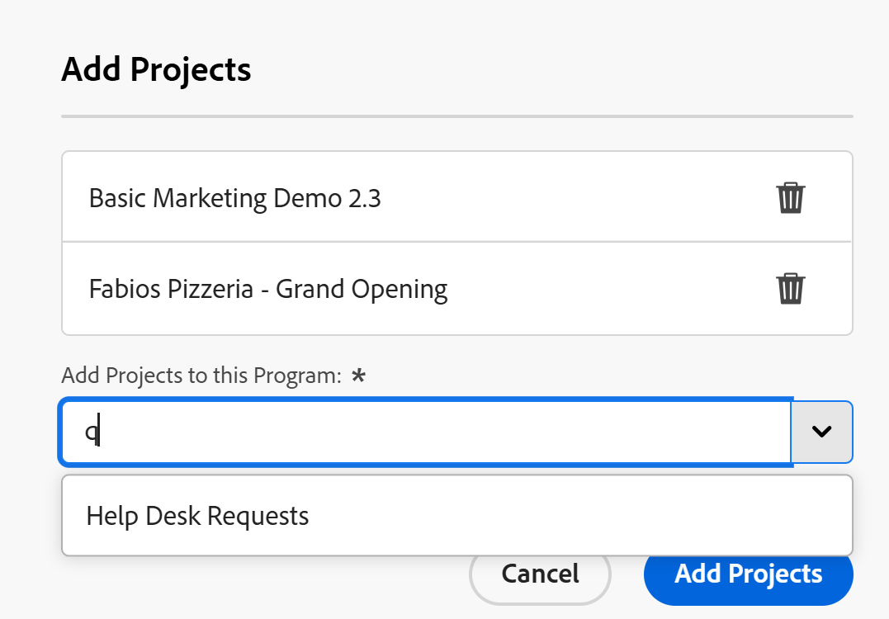

# Een project toevoegen aan een programma

<!--Audited: 5/2025-->

 de benadrukte informatie op deze pagina verwijst naar functionaliteit nog niet algemeen beschikbaar. Deze optie is alleen beschikbaar in de voorvertoningsomgeving voor alle klanten. Dezelfde functies zijn ook beschikbaar in de productieomgeving voor alle klanten na een week vanaf de release Preview. 

 voor meer informatie, zie [ de modernisering van de Interface ](/help/quicksilver/product-announcements/product-releases/interface-modernization/interface-modernization.md). 

U kunt uw projecten ordenen door deze toe te voegen aan programma&#39;s binnen portfolio&#39;s. U kunt veelvoudige projecten binnen van één programma hebben, maar u kunt slechts één programma met een project associëren.

U moet een portfolio en een programma in dit portfolio maken voordat u een project aan een programma kunt toevoegen.

Als u een project aan een programma toevoegt, wordt dit automatisch toegevoegd aan de portfolio van het programma.

Voor informatie over het creëren van portefeuilles, zie [ een portefeuille ](../../../manage-work/portfolios/create-and-manage-portfolios/create-portfolios.md) creëren.

Voor informatie over het creëren van programma&#39;s, zie [ een programma ](../../../manage-work/portfolios/create-and-manage-programs/create-program.md) creëren.

## Toegangsvereisten

+++ Breid uit om de toegangseisen voor de functionaliteit in dit artikel weer te geven.

<table style="table-layout:auto"> 
 <col> 
 <col> 
 <tbody> 
  <tr> 
   <td role="rowheader">[!DNL Adobe Workfront] plan</td> 
   <td> 
Alle
 </td> 
  </tr> 
  <tr> 
   <td role="rowheader">[!DNL Adobe Workfront] licentie*</td> 
   <td>
Nieuw: Standaard
 
   
Huidig: [!UICONTROL Plan] 
 </td> 
  </tr> 
  <tr> 
   <td role="rowheader">Toegangsniveau</td> 
   <td> 
[!UICONTROL Edit] toegang tot programma's of hoger
 
[!UICONTROL Edit] toegang tot projecten
 </td> 
  </tr> 
  <tr> 
   <td role="rowheader">Objectmachtigingen</td> 
   <td> 
[!UICONTROL Manage] machtigingen voor het programma
 
[!UICONTROL Manage] machtigingen voor de projecten
 </td> 
  </tr> 
 </tbody> 
</table>

*For informatie, zie [ vereisten van de Toegang in de documentatie van Workfront ](/help/quicksilver/administration-and-setup/add-users/access-levels-and-object-permissions/access-level-requirements-in-documentation.md).

+++

## Een project toevoegen aan een bestaand programma

1. Ga naar een programma.

   Klik op **[!UICONTROL Projects]** in het linkerdeelvenster.

1. Klik op **[!UICONTROL New Project]** en selecteer een methode om het project toe te voegen.

   >[!TIP]
   >
   >U kunt geen project toevoegen wanneer u de lijst van projecten in de [!UICONTROL Milestone] mening bekijkt.

   Selecteer een van de volgende opties:

   <table style="table-layout:auto"> 
    <col> 
    <col> 
    <tbody> 
     <tr> 
      <td role="rowheader">[!UICONTROL Existing Project]</td> 
      <td> 
Voeg een project toe dat reeds is gecreeerd.
 </td> 
     </tr> 
     <tr> 
      <td role="rowheader">[!UICONTROL New Project]</td> 
      <td> 
Een geheel nieuw project toevoegen. 
 
Voor meer informatie over het creëren van een project van kras, zie <a href="../../../manage-work/projects/create-projects/create-project.md" class="MCXref xref"> een project </a> creëren. 
 </td> 
     </tr> 
     <tr> 
      <td role="rowheader">[!UICONTROL Import a Project from [!DNL MS Project]] </td> 
      <td> 
Voeg een project toe dat u eerder hebt geëxporteerd vanuit [!DNL MS Project] en dat op uw computer hebt opgeslagen. 
 
Voor meer informatie over het creëren van een nieuw project door het van [!DNL Microsoft Project] in te voeren, zie <a href="../../../manage-work/projects/create-projects/import-project-from-ms-project.md" class="MCXref xref"> een project van [!DNL Microsoft Project]</a> invoeren.
 </td> 
     </tr> 
     <tr> 
      <td role="rowheader">[!UICONTROL Request Project]</td> 
      <td> 
Vraag of het nieuwe project is goedgekeurd voordat u eraan kunt gaan werken.
 
Voor informatie over het verzoeken van projecten, zie <a href="../../../manage-work/projects/create-projects/request-project.md"> het Aanvragen van een Project </a>. 
 </td> 
     </tr> 
     <tr> 
      <td role="rowheader">[!UICONTROL New from Template]</td> 
      <td> 
Voeg een nieuw project toe gebruikend een bestaand malplaatje. 
 
Voor meer informatie over het creëren van een project van een malplaatje, zie <a href="../../../manage-work/projects/create-projects/create-project-from-template.md" class="MCXref xref"> een project creëren gebruikend een malplaatje </a>.
 </td> 
     </tr> 
    </tbody> 
   </table>

1. (Voorwaardelijk) als u **[!UICONTROL Existing Project]** selecteerde, **voegt de doos van Projecten** toe  opent. <!--check at unshimming-->

   <!--check at unshimming--> toe

1. Ga als volgt te werk:

   1. In het **[!UICONTROL Add Projects]** vakje, typ de naam van een project in **voegt Projecten aan dit 2&rbrace; gebied van het Programma toe, dan selecteert het wanneer het in de lijst toont. <!--check casing on links and buttons-->**

      U kunt meerdere projecten toevoegen.
   1. (Facultatief) klik het **pictogram van de Schrapping  naast de naam van een project als u besluit om het niet aan het programma toe te voegen.**

   1. Klik op **[!UICONTROL Add Projects]** . <!--check at unshimming-->

      Het project wordt weergegeven op het tabblad **[!UICONTROL Projects]** van het programma en is nu gekoppeld aan het programma en de respectievelijke portfolio van het programma.
