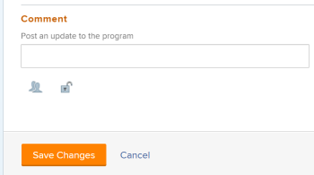

# Programma&#39;s bewerken

U kunt informatie bewerken over programma&#39;s die u hebt gemaakt of over programma&#39;s die andere gebruikers hebben gemaakt als ze deze met u hebben gedeeld.

U kunt een programma op de programmapagina bewerken of programma&#39;s in een lijst bewerken.

## Toegangsvereisten

+++ Breid uit om de toegangseisen voor de functionaliteit in dit artikel weer te geven.

U moet de volgende toegang hebben om de stappen in dit artikel uit te voeren:

<table style="table-layout:auto"> 
 <col> 
 <col> 
 <tbody> 
  <tr> 
   <td role="rowheader">[!DNL Adobe Workfront] plan</td> 
   <td> 
Alle
 </td> 
  </tr> 
  <tr> 
   <td role="rowheader">[!DNL Adobe Workfront] licentie*</td> 
   <td> 
Nieuw: [!UICONTROL Standard] 

of 

Huidig: [!UICONTROL Plan] 
 </td> 
  </tr> 
  <tr> 
   <td role="rowheader">Toegangsniveau</td> 
   <td> 
[!UICONTROL Edit] toegang tot programma's
  </td> 
  </tr> 
  <tr> 
   <td role="rowheader">Objectmachtigingen</td> 
   <td> 
[!UICONTROL Manage] machtigingen voor een programma
  </td> 
  </tr> 
 </tbody> 
</table>

*For informatie, zie [ vereisten van de Toegang in de documentatie van Workfront ](/help/quicksilver/administration-and-setup/add-users/access-levels-and-object-permissions/access-level-requirements-in-documentation.md).

+++

## Programma&#39;s bewerken

1. Ga naar de **[!UICONTROL Main Menu]** .
1. Klik op **[!UICONTROL Programs]** en klik vervolgens op de naam van een programma om het te openen.

   >[!TIP]
   >
   >U kunt een programma openen vanuit het portfolio waaraan het is gekoppeld, door eerst naar het portfolio te gaan en vervolgens op **[!UICONTROL Programs]** te klikken in het linkerdeelvenster. Voor meer informatie, zie [ een programma ](../../../manage-work/portfolios/create-and-manage-programs/create-program.md) creëren.

1. (Optioneel) Als u de beperkte informatie over het programma wilt bewerken, klikt u op **[!UICONTROL Program Details]** in het linkerdeelvenster.

   >[!TIP]
   >
   >Ga naar stap 4 als u alle informatie over het programma wilt bewerken.

   

   >[!NOTE]
   >
   >Afhankelijk van de manier waarop uw [!DNL Workfront] -beheerder of groepsbeheerder uw lay-outsjabloon heeft gewijzigd, kunnen de velden in het [!UICONTROL Program Details] -gebied opnieuw worden gerangschikt of niet worden weergegeven. Voor informatie, zie [ de [!UICONTROL Details] mening aanpassen gebruikend een lay-outmalplaatje ](../../../administration-and-setup/customize-workfront/use-layout-templates/customize-details-view-layout-template.md).

   <!--
   
(NOTE: the above note will also come to the Edit Program box)

   -->

   Ga als volgt te werk om informatie in de sectie [!UICONTROL Details] te bewerken:

   1. (Optioneel) Klik op het pictogram **[!UICONTROL Collapse All]** in de rechterbovenhoek om alle gebieden samen te vouwen.
   1. (Facultatief en voorwaardelijk) wanneer een gebied wordt doen ineenstorten, klik de **juist-richt pijl**  naast elk gebied om het gebied uit te breiden u wilt uitgeven.
   1. Voor informatie over de velden die zichtbaar zijn in de sectie [!UICONTROL Program Details] , gaat u verder met het bewerken van het programma in het vak [!UICONTROL Edit Program] , zoals hieronder wordt beschreven.
   1. (Optioneel) Als er geen aangepaste formulieren aan het programma zijn gekoppeld, typt u de naam van een formulier in het veld **[!UICONTROL Add custom form]** , selecteert u het formulier wanneer het in de lijst wordt weergegeven en klikt u op **[!UICONTROL Save Changes]** .
   1. (Optioneel) Klik op het pictogram **[!UICONTROL Export]**  om de [!UICONTROL Overview] -gegevens en aangepaste formuliergegevens te exporteren naar een PDF-bestand en klik vervolgens op **[!UICONTROL Export]** . Selecteer een van de volgende opties:

      * Alles selecteren (wordt alleen weergegeven als er ten minste één aangepast formulier is gekoppeld)
      * [!UICONTROL Overview]
      * De naam van een of meerdere aangepaste formulieren

      Het PDF-bestand wordt naar de computer gedownload.

      

      Voor meer informatie, zie [ de douaneformulieren en objecten details van de Uitvoer ](../../../workfront-basics/work-with-custom-forms/export-custom-forms-details.md).

1. Voer een van de volgende handelingen uit als u alle informatie over een of meer programma&#39;s wilt bewerken:

   * Klik op het **[!UICONTROL More]** menu  naast de naam van het programma en &#x200B; **[!UICONTROL Edit].**
   * Ga naar een lijst met programma&#39;s en selecteer een of meer programma&#39;s die u wilt bewerken. Klik vervolgens op het pictogram **[!UICONTROL Edit]**  boven aan de lijst.

   Het dialoogvenster **[!UICONTROL Edit Program]** wordt weergegeven.

   

   Alle programmavelden zijn beschikbaar in het vak [!UICONTROL Edit Program] en worden gegroepeerd op de gebieden die in het linkerdeelvenster worden vermeld.

1. Overweeg informatie op te geven in een van de volgende secties:

   * [[!UICONTROL Overview]](#overview)
   * [[!UICONTROL Custom Forms]](#Custom%C2%A0F)
   * [[!UICONTROL Comment]](#comment)

### [!UICONTROL Overview] {#overview}

1. Bewerk een programma zoals hierboven beschreven.
1. Klik op **[!UICONTROL Overview]** en geef de volgende velden op:

   <!--
   
(NOTE:&nbsp;note below drafted for now)

   -->

   <!--
   <note type="note">
   Depending on how your Workfront administrator or Group administrator sets up our Layout Template, the fields in the Edit Program box might be rearranged or not display. For information, see
   <a href="../../../administration-and-setup/customize-workfront/use-layout-templates/customize-details-view-layout-template.md" class="MCXref xref">Customize the Details view using a layout template</a>.
   </note>
   -->

   <table style="table-layout:auto"> 
    <col> 
    <col> 
    <tbody> 
     <tr> 
      <td role="rowheader">[!UICONTROL Name]</td> 
      <td> 
Werk de naam van het programma bij. 
 
Tip: deze optie is niet beschikbaar wanneer u meerdere programma's hebt geselecteerd. 
 </td> 
     </tr> 
     <tr> 
      <td role="rowheader">[!UICONTROL Description]</td> 
      <td> 
Typ een beschrijving voor het Portfolio om aan te geven wat er uniek aan is. 
 </td> 
     </tr> 
     <tr> 
      <td role="rowheader">[!UICONTROL Program Manager]</td> 
      <td> 
Typ de naam van een gebruiker die u als programmamanager wilt aangeven en selecteer deze naam wanneer deze in de lijst wordt weergegeven. Dit is de persoon die kan toezien op het werk dat in de projecten van het programma wordt gedefinieerd. 
 
Belangrijk: wanneer u iemand aanwijst als programmabeheerder, krijgt deze automatisch [!UICONTROL Manage] machtigingen voor het programma en de projecten in het programma. 
 
Tip: u kunt de programmamanager snel bijwerken in de koptekst van het programma. 
 </td> 
     </tr> 
     <tr> 
      <td role="rowheader">[!UICONTROL Group]</td> 
      <td> 
Voeg de naam van één groep toe als de groep is gekoppeld aan het programma of als de groep verantwoordelijk is voor het voltooien van het programma. 
 
Tip:  
Ga als volgt te werk wanneer u het veld [!UICONTROL Group] opent vanaf de pagina [!UICONTROL Program Details] : 
 
U kunt ervoor zorgen dat u de juiste groep selecteert door de muisaanwijzer boven de groep te plaatsen en op het pictogram [!UICONTROL information]  naast de groep te klikken. Hier wordt knopinfo weergegeven met informatie over de groep, zoals de hiërarchie van de bovenliggende groepen en de bijbehorende beheerders.
 
  
 
Deze optie is niet beschikbaar in het vak [!UICONTROL Edit Program] . 
 
 </td> 
     </tr> 
     <tr> 
      <td role="rowheader">[!UICONTROL Is Active]</td> 
      <td> 
 Schakel dit selectievakje in als u wilt dat het programma actief is. Andere gebruikers kunnen actieve programma's zoeken en deze aan projecten koppelen of aan portfolio's toevoegen. Niet-actieve programma's kunnen niet aan projecten of portfolio's worden gekoppeld. Dit is standaard ingeschakeld.
 </td> 
     </tr> 
    </tbody> 
   </table>

1. Klik op **[!UICONTROL Save Changes]** of ga door met het bewerken van de volgende secties.

### [!UICONTROL Custom Forms]

1. Bewerk het programma zoals hierboven beschreven.
1. Klik op het vervolgkeuzemenu **[!UICONTROL Add Forms]** om aangepaste formulieren te selecteren en toe te voegen aan het programma.

   U moet aangepaste formulieren voor programma&#39;s maken voordat u deze kunt toevoegen.

   >[!NOTE]
   >
   >Afhankelijk van de manier waarop de [!DNL Workfront] -beheerder de machtigingen voor de secties in het aangepaste formulier instelt, kan niet iedereen dezelfde velden op een aangepast formulier weergeven of bewerken. De machtigingen voor het bewerken van velden in een sectie van een aangepast formulier zijn afhankelijk van de machtigingen die u hebt voor het programma zelf. Voor informatie over het plaatsen van toestemmingen op secties van een douanevorm, zie [ Ontwerp een vorm met de vormontwerper ](/help/quicksilver/administration-and-setup/customize-workfront/create-manage-custom-forms/form-designer/design-a-form/design-a-form.md).

1. Werk alle velden in de aangepaste formulieren bij en klik op **[!UICONTROL Save Changes]** of ga verder met de volgende sectie.

### [!UICONTROL Comment] {#comment}

1. Bewerk een programma zoals hierboven beschreven.
1. Klik op **[!UICONTROL Comment]** .

   

1. Voeg een opmerking toe in het veld **[!UICONTROL Post an update to the program]** .
1. (Optioneel) Klik op het pictogram **[!UICONTROL People]** om een gebruiker of een team aan de opmerking toe te voegen.
1. (Optioneel) Klik op het pictogram **[!UICONTROL Lock]** om de opmerking te vergrendelen en deze alleen toegankelijk te maken voor gebruikers in uw bedrijf.

   Nadat u de wijzigingen hebt opgeslagen, wordt de opmerking die u toevoegt, weergegeven op het tabblad [!UICONTROL Updates] van het programma en wordt een e-mail verzonden naar de gebruikers die er deel van uitmaken.
