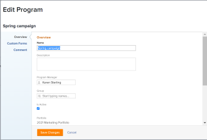

# Programma&#39;s bewerken

U kunt informatie bewerken over programma&#39;s die u hebt gemaakt of over programma&#39;s die andere gebruikers hebben gemaakt als ze deze met u hebben gedeeld.

U kunt een programma op de programmapagina bewerken of programma&#39;s in een lijst bewerken.

## Toegangsvereisten

U moet de volgende toegang hebben om de stappen in dit artikel uit te voeren:

<table style="table-layout:auto"> 
 <col> 
 <col> 
 <tbody> 
  <tr> 
   <td role="rowheader">[!DNL Adobe Workfront] plan*</td> 
   <td> 
Alle
 </td> 
  </tr> 
  <tr> 
   <td role="rowheader">[!DNL Adobe Workfront] licentie*</td> 
   <td> 
[!UICONTROL Plan] 
 </td> 
  </tr> 
  <tr> 
   <td role="rowheader">Toegangsniveau*</td> 
   <td> 
[!UICONTROL Edit] toegang tot programma's
 
Opmerking: Als u nog steeds geen toegang hebt, vraagt u [!DNL Workfront] beheerder als zij extra beperkingen in uw toegangsniveau plaatsen. Voor informatie over toegang tot programma's in uw Niveau van de Toegang, zie <a href="../../../administration-and-setup/add-users/configure-and-grant-access/grant-access-programs.md" class="MCXref xref">Toegang verlenen tot programma's</a>. Voor informatie over hoe een [!DNL Workfront] de beheerder kan uw toegangsniveau veranderen, zie <a href="../../../administration-and-setup/add-users/configure-and-grant-access/create-modify-access-levels.md" class="MCXref xref">Aangepaste toegangsniveaus maken of wijzigen</a>. 
 </td> 
  </tr> 
  <tr> 
   <td role="rowheader">Objectmachtigingen</td> 
   <td> 
[!UICONTROL Manage] machtigingen voor een programma
 
 Voor informatie over het verlenen van machtigingen aan programma's raadpleegt u <a href="../../../workfront-basics/grant-and-request-access-to-objects/share-a-program.md" class="MCXref xref">Een programma delen </a>. 
 
Voor informatie over het aanvragen van aanvullende machtigingen raadpleegt u <a href="../../../workfront-basics/grant-and-request-access-to-objects/request-access.md" class="MCXref xref">Toegang tot objecten aanvragen </a>.
 </td> 
  </tr> 
 </tbody> 
</table>

&#42;Neem contact op met uw [!DNL Workfront] beheerder.

## Programma&#39;s bewerken

1. Ga naar de **[!UICONTROL Main Menu]**.
1. Klikken **[!UICONTROL Programs]** en klikt u op de naam van een programma om het te openen.

   >[!TIP]
   >
   >U kunt een programma openen vanuit het portfolio waaraan het is gekoppeld, door eerst naar het portfolio te gaan en vervolgens te klikken **[!UICONTROL Programs]** in het linkerdeelvenster. Zie voor meer informatie [Een programma maken](../../../manage-work/portfolios/create-and-manage-programs/create-program.md).

1. (Optioneel) Als u beperkte informatie over het programma wilt bewerken, klikt u op **[!UICONTROL Program Details]** in het linkerdeelvenster.

   >[!TIP]
   >
   >Ga naar stap 4 als u alle informatie over het programma wilt bewerken.

   

   >[!NOTE]
   >
   >Afhankelijk van hoe uw [!DNL Workfront] de beheerder of de beheerder van de Groep wijzigde uw Malplaatje van de Lay-out, de gebieden in [!UICONTROL Program Details] kan opnieuw worden gerangschikt of niet worden weergegeven. Zie voor meer informatie [De [!UICONTROL Details] weergeven met een lay-outsjabloon](../../../administration-and-setup/customize-workfront/use-layout-templates/customize-details-view-layout-template.md).

   <!--
   
(NOTE: the above note will also come to the Edit Program box)

   -->

   Gegevens bewerken in het dialoogvenster [!UICONTROL Details] Ga als volgt te werk:

   1. (Optioneel) Klik op de knop **[!UICONTROL Collapse All]** in de rechterbovenhoek om alle gebieden samen te vouwen.
   1. (Optioneel en voorwaardelijk) Als een gebied is samengevouwen, klikt u op de knop **pijl-rechts**  naast elk gebied om het gebied uit te breiden u wilt uitgeven.
   1. Voor informatie over de velden die in het dialoogvenster [!UICONTROL Program Details] in het gedeelte, doorgaan met het bewerken van het programma in het dialoogvenster [!UICONTROL Edit Program] zoals hieronder beschreven.
   1. (Optioneel) Als er geen aangepaste formulieren aan het programma zijn gekoppeld, typt u de naam van een formulier in het dialoogvenster **[!UICONTROL Add custom form]** , selecteert u het veld wanneer het wordt weergegeven in de lijst en klikt u vervolgens op **[!UICONTROL Save Changes]**.
   1. (Optioneel) Klik op de knop **[!UICONTROL Export]** pictogram  om de [!UICONTROL Overview] en aangepaste formuliergegevens naar een PDF-bestand, klikt u vervolgens op **[!UICONTROL Export]**. Selecteer een van de volgende opties:

      * Alles selecteren (wordt alleen weergegeven als er ten minste één aangepast formulier is gekoppeld)
      * [!UICONTROL Overview]
      * De naam van een of meerdere aangepaste formulieren

      Het PDF-bestand wordt naar de computer gedownload.

      

      Zie voor meer informatie [Aangepaste formulieren en objectdetails exporteren](../../../workfront-basics/work-with-custom-forms/export-custom-forms-details.md).

1. Voer een van de volgende handelingen uit als u alle informatie over een of meer programma&#39;s wilt bewerken:

   * Klik op de knop **[!UICONTROL More]** menu  naast de naam van het programma, &#x200B;**[!UICONTROL Edit].**
   * Ga naar een lijst met programma&#39;s en selecteer een of meer programma&#39;s die u wilt bewerken. Klik vervolgens op de knop **[!UICONTROL Edit]** pictogram  boven aan de lijst.

   De **[!UICONTROL Edit Program]** wordt weergegeven.

   

   Alle programmavelden zijn beschikbaar in het dialoogvenster [!UICONTROL Edit Program] en worden gegroepeerd door de gebieden in het linkerdeelvenster.

1. Overweeg informatie op te geven in een van de volgende secties:

   * [[!UICONTROL Overview]](#overview)
   * [[!UICONTROL Custom Forms]](#Custom%C2%A0F)
   * [[!UICONTROL Comment]](#comment)

### [!UICONTROL Overview] {#overview}

1. Bewerk een programma zoals hierboven beschreven.
1. Klikken **[!UICONTROL Overview]** en geef de volgende velden op:

   <!--
   
(NOTE:&nbsp;note below drafted for now)

   -->

   <!--
   <note type="note">
   Depending on how your Workfront administrator or Group administrator sets up our Layout Template, the fields in the Edit Program box might be rearranged or not display. For information, see
   <a href="../../../administration-and-setup/customize-workfront/use-layout-templates/customize-details-view-layout-template.md" class="MCXref xref">Customize the Details view using a layout template</a>.
   </note>
   -->

   <table style="table-layout:auto"> 
    <col> 
    <col> 
    <tbody> 
     <tr> 
      <td role="rowheader">[!UICONTROL Name]</td> 
      <td> 
Werk de naam van het programma bij. 
 
Tip: Dit is niet beschikbaar wanneer u meerdere programma's hebt geselecteerd. 
 </td> 
     </tr> 
     <tr> 
      <td role="rowheader">[!UICONTROL Description]</td> 
      <td> 
Typ een beschrijving voor de Portfolio om aan te geven wat er uniek aan is. 
 </td> 
     </tr> 
     <tr> 
      <td role="rowheader">[!UICONTROL Program Manager]</td> 
      <td> 
Typ de naam van een gebruiker die u als programmamanager wilt aangeven en selecteer deze naam wanneer deze in de lijst wordt weergegeven. Dit is de persoon die kan toezien op het werk dat in de projecten van het programma wordt gedefinieerd. 
 
Belangrijk: Wanneer u iemand aanwijst als Programmamanager, krijgen deze automatisch [!UICONTROL Manage] machtigingen voor het programma en de projecten in het programma. 
 
Tip: U kunt de programmamanager snel bijwerken in de programmakop. 
 </td> 
     </tr> 
     <tr> 
      <td role="rowheader">[!UICONTROL Group]</td> 
      <td> 
Voeg de naam van één groep toe als de groep is gekoppeld aan het programma of als de groep verantwoordelijk is voor het voltooien van het programma. 
 
Tip:  
Wanneer u het dialoogvenster [!UICONTROL Group] veld van [!UICONTROL Program Details] pagina, ga als volgt te werk: 
 
U kunt ervoor zorgen dat u de juiste groep selecteert door de muisaanwijzer boven de groep te plaatsen en op de knop [!UICONTROL information] pictogram  die ernaast wordt weergegeven. Hier wordt knopinfo weergegeven met informatie over de groep, zoals de hiërarchie van de bovenliggende groepen en de bijbehorende beheerders.
 
  
 
Deze optie is niet beschikbaar in het dialoogvenster [!UICONTROL Edit Program] doos. 
 
 </td> 
     </tr> 
     <tr> 
      <td role="rowheader">[!UICONTROL Is Active]</td> 
      <td> 
 Schakel dit selectievakje in als u het programma actief wilt maken. Andere gebruikers kunnen actieve programma's zoeken en deze aan projecten koppelen of aan portfolio's toevoegen. Niet-actieve programma's kunnen niet aan projecten of portfolio's worden gekoppeld. Dit is standaard ingeschakeld.
 </td> 
     </tr> 
    </tbody> 
   </table>

1. Klikken **[!UICONTROL Save Changes]** of ga door met het bewerken van de volgende secties.

### [!UICONTROL Custom Forms]

1. Bewerk het programma zoals hierboven beschreven.
1. Klik op de knop **[!UICONTROL Add Forms]** vervolgkeuzelijst om aangepaste formulieren te selecteren en toe te voegen aan het programma.

   U moet aangepaste formulieren voor programma&#39;s maken voordat u deze kunt toevoegen.

   >[!NOTE]
   >
   >Afhankelijk van hoe uw [!DNL Workfront] beheerder stelt de machtigingen in voor de secties in het aangepaste formulier. Niet iedereen kan dezelfde velden op een aangepast formulier weergeven of bewerken. De machtigingen voor het bewerken van velden in een sectie van een aangepast formulier zijn afhankelijk van de machtigingen die u hebt voor het programma zelf. Voor informatie over het instellen van machtigingen voor secties in een aangepast formulier raadpleegt u [Een aangepast formulier maken of bewerken](../../../administration-and-setup/customize-workfront/create-manage-custom-forms/create-or-edit-a-custom-form.md).

1. Werk alle velden in de aangepaste formulieren bij en klik vervolgens op **[!UICONTROL Save Changes]** of ga verder met de volgende sectie.

### [!UICONTROL Comment] {#comment}

1. Bewerk een programma zoals hierboven beschreven.
1. Klik op **[!UICONTROL Comment]**.

   

1. Voeg een opmerking toe in het dialoogvenster **[!UICONTROL Post an update to the program]** veld.
1. (Optioneel) Klik op de knop **[!UICONTROL People]** om een gebruiker of een team aan de opmerking toe te voegen.
1. (Optioneel) Klik op de knop **[!UICONTROL Lock]** pictogram om de opmerking te vergrendelen en deze alleen toegankelijk te maken voor gebruikers in uw bedrijf.

   Nadat u de wijzigingen hebt opgeslagen, wordt de opmerking die u toevoegt, weergegeven in de [!UICONTROL Updates] en verzendt een e-mail naar de gebruikers die er deel van uitmaken.
