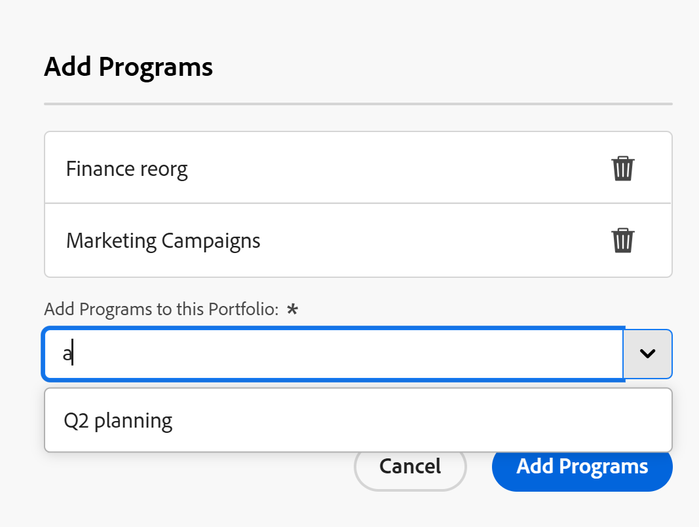

# Een bestaand programma toevoegen aan een portfolio

<!--Audited: 5/2025-->

<!--The highlighted information on this page refers to functionality not yet generally available. It is available only in the Preview environment for all customers. The same features will also be available in the Production environment for all customers after a week from the Preview release.    

For more information, see [Interface modernization](/help/quicksilver/product-announcements/product-releases/interface-modernization/interface-modernization.md). -->

U kunt bestaande programma&#39;s toevoegen aan een portfolio. Omdat programma&#39;s niet in twee verschillende portfolio&#39;s kunnen bestaan, wordt de bestaande portfolio permanent verplaatst wanneer u een bestaand programma toevoegt.

## Toegangsvereisten

+++ Breid uit om de toegangseisen voor de functionaliteit in dit artikel weer te geven.

U moet de volgende toegang hebben om de stappen in dit artikel uit te voeren:

<table style="table-layout:auto"> 
 <col> 
 <col> 
 <tbody> 
  <tr> 
   <td role="rowheader">[!DNL Adobe Workfront] plan</td> 
   <td> 
Alle
 </td> 
  </tr> 
  <tr> 
   <td role="rowheader">[!DNL Adobe Workfront] licentie*</td> 
   <td> 
Nieuw: [!UICONTROL Standard] 

of 

Huidig: [!UICONTROL Plan] 
 </td> 
  </tr> 
  <tr> 
   <td role="rowheader">Configuraties op toegangsniveau</td> 
   <td> 
[!UICONTROL Edit] toegang tot portfolio's en programma's 
 </td> 
  </tr> 
  <tr> 
   <td role="rowheader">Objectmachtigingen</td> 
   <td> 
[!UICONTROL Manage] machtigingen voor het portfolio en het programma
 </td> 
  </tr> 
 </tbody> 
</table>

*For informatie, zie [&#x200B; vereisten van de Toegang in de documentatie van Workfront &#x200B;](/help/quicksilver/administration-and-setup/add-users/access-levels-and-object-permissions/access-level-requirements-in-documentation.md).

+++

## Een bestaand programma toevoegen aan een portfolio

1. Ga naar een portfolio en klik op **[!UICONTROL Programs]** in het linkerdeelvenster.
1. Klik op **[!UICONTROL New Program]**.
1. Klik op **[!UICONTROL Existing Program]**.

   **voegt Programma&#39;s** doos toe opent. <!--check screen shot - I logged changes for this casing-->

    toe

   >[!IMPORTANT]
   >
   >Als u een bestaand programma toevoegt, worden alle projecten die met dat programma verband houden, aan het portfolio toegevoegd. Zorg ervoor dat u projecten niet per ongeluk op deze manier verplaatst.

1. Typ in het veld **[!UICONTROL Add Programs to this Portfolio]** de naam van een programma en selecteer het programma wanneer het in de lijst wordt weergegeven. <!--see the name of this field, I suggested changes here-->

   U kunt meerdere programma&#39;s toevoegen.

1. (Facultatief) klik het **pictogram van de Schrapping  naast de naam van een programma als u besluit om het niet aan de portefeuille toe te voegen.**

1. Klik op **[!UICONTROL Add Programs]** . <!--check this button in the UI after they implemented the changes??-->

   Het programma wordt weergegeven op het tabblad **[!UICONTROL Programs]** in het portfolio dat u hebt geselecteerd.
