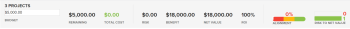
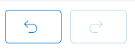
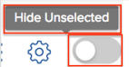

# [!UICONTROL Portfolio Optimizer] overzicht

De [!UICONTROL Portfolio Optimizer] is het instrument dat wordt gebruikt voor projectevaluatie en -vergelijking. Het proces van evaluatie en vergelijking [!UICONTROL Business Case] de waarden voor projecten die aan een portefeuille worden toegewezen zijn hoe een portefeuillebeheerder aan projecten kan voorrang geven en de meeste waarde voor een organisatie kan produceren.

Het doel van de [!UICONTROL portfolio optimizer] moet een interface bieden waarmee een portefeuillebeheerder, stuurcomité of productmanagementkantoor beknopte informatie kan bekijken over het bedrijfscase van elk project. De projecten kunnen dan worden geprioriteerd volgens strategische waarden en doelstellingen, of volgens hun algemene score.

De [!UICONTROL Portfolio Optimizer] U kunt u alleen helpen als u aan de volgende voorwaarden hebt voldaan:

* De [!UICONTROL Business Cases] voor de projecten zijn voltooid. Zie de artikelen in de sectie voor meer informatie [Een bedrijfscase definiëren](../../projects/define-a-business-case/define-business-case.md).
* Een portefeuille wordt bepaald in het gebied van het Overzicht van het Project van de sectie van de Details van het Project voor de projecten u wilt herzien
* U hebt de projectbegroting en het geplande voordeel voor de projecten aangegeven u wilt herzien. Vaste kosten en Vaste inkomsten zijn optioneel, maar geven een extra waarde. Zie voor meer informatie [Projectfinancieringvelden](../../projects/project-finances/project-finances-overview-1.md).

Voor informatie over de locatie van de [!UICONTROL Portfolio Optimizer], zie [Zoek de [!UICONTROL Portfolio Optimizer]](../../../manage-work/portfolios/portfolio-optimizer/locate-portfolio-optimizer.md).

## Financiële middelen in het [!UICONTROL Portfolio Optimizer]

* [De financiële gebieden in de [!UICONTROL Portfolio Optimizer]](#the-financial-areas-in-the-portfolio-optimizer)
* [De financiële gebieden in de [!UICONTROL Portfolio Optimizer]](#the-financial-fields-in-the-portfolio-optimizer)

U kunt de financiële status van uw portfolio op elk gewenst moment tijdens de levensduur van uw project bekijken wanneer u de [!UICONTROL Portfolio Optimizer].

Houd rekening met het volgende wanneer u met financiën werkt in het deelvenster [!UICONTROL Portfolio Optimizer]:

* Projecten krijgen elk een score wanneer hun [!UICONTROL Business Cases] worden uitgevoerd op basis van de criteria die zij in het [!UICONTROL Portfolio Optimizer]. Lage kosten of uitlijningsprojecten krijgen bijvoorbeeld een hogere score.

   Raadpleeg het artikel voor meer informatie over het berekenen van de score van een project voor het optimaliseren van portfolio&#39;s [Overzicht van de [!UICONTROL Portfolio Optimizer] Score](../../../manage-work/portfolios/portfolio-optimizer/portfolio-optimizer-score.md).

* De financiële berekeningen voor de [!UICONTROL Portfolio Optimizer] gebruiken [!UICONTROL Budgeted Cost] in de [!UICONTROL Business Case] van het project.
* U kunt uw projecten in manueel voorrang geven [!UICONTROL Portfolio Optimizer], rekening houdend met alle informatie die over hen wordt verstrekt. Dit omvat financiële gegevens, aanpassing aan hun scorecards, ROI, bijvoorbeeld.

### De financiële gebieden in de [!UICONTROL Portfolio Optimizer] {#the-financial-areas-in-the-portfolio-optimizer}

U kunt financiële informatie weergeven op de volgende gebieden van het dialoogvenster [!UICONTROL Portfolio Optimizer]:

* **[!UICONTROL Portfolio Header]**: Dit gebied toont financiële informatie die van alle projecten in de portefeuille wordt verzameld. Deze wordt weergegeven op elk tabblad van het object Portfolio.
* **[!UICONTROL Portfolio Finances for Selected Projects]**: Dit gebied toont financiële informatie die van de projecten wordt verzameld die in [!UICONTROL Portfolio Optimizer]. U kunt projecten toevoegen of verwijderen en begrijpen hoe dit de financiën van de portefeuille door de informatie op dit gebied te bekijken zal beïnvloeden.
* **[!UICONTROL Projects Finances]**: In dit gebied wordt de financiële informatie van elk project weergegeven dat in het dialoogvenster [!UICONTROL Portfolio Optimizer].

### De financiële gebieden in de [!UICONTROL Portfolio Optimizer] {#the-financial-fields-in-the-portfolio-optimizer}

De volgende financiële velden worden weergegeven in de [!UICONTROL Portfolio Optimizer]:

* [Portfolio header](#portfolio-header)
* [Portfolio financiert geselecteerde projecten](#portfolio-finances-for-selected-projects)

#### Portfolio header {#portfolio-header}

[!DNL Adobe Workfront] berekent de financiële gebieden in de portfoliokopbal gebruikend informatie van projecten met statussen die slechts met gelijken [!UICONTROL Approved] of [!UICONTROL Current].

<table style="table-layout:auto"> 
 <col> 
 <col> 
 <thead> 
  <tr> 
   <th><strong>Naam van veld</strong> </th> 
   <th><strong>Beschrijving</strong> </th> 
  </tr> 
 </thead> 
 <tbody> 
  <tr> 
   <td>[!UICONTROL On Time]</td> 
   <td> 
Het percentage projecten in de portefeuille dat als [!UICONTROL On Time]. Dit is zichtbaar vanaf elke tab in een Portfolio.
 
Een project wordt geacht [!UICONTROL On Time] wanneer het project <strong>[!UICONTROL Condition]</strong> is <strong>[!UICONTROL On Target]</strong>.  Meer informatie over [!UICONTROL Project Conditions], zie het artikel <a href="../../../manage-work/projects/manage-projects/project-condition-and-condition-type.md" class="MCXref xref">Overzicht van het type Projectvoorwaarde en Voorwaarde</a>.
 
De <strong>[!UICONTROL On Time]</strong> percentage wordt berekend met behulp van de volgende formule:
 
<em>[!UICONTROL On Time Portfolio Percentage] = Aantal [!UICONTROL On Time] Projecten/Totaal aantal projecten in een [!UICONTROL Current] of [!UICONTROL Approved] status</em> 
 </td> 
  </tr> 
  <tr> 
   <td>[!UICONTROL On Budget]</td> 
   <td> 
Het percentage projecten in de portefeuille dat als [!UICONTROL On Budget]. Dit is zichtbaar vanaf elk tabblad in een [!UICONTROL Portfolio].
 
Projecten <strong>[!UICONTROL On Budget]</strong> wanneer zij hun vooraf vastgestelde begroting niet hebben overschreden.  Raadpleeg het artikel voor meer informatie over het budget van een project <a href="../../../manage-work/projects/project-finances/manage-project-finance-area.md" class="MCXref xref">[!UICONTROL Manage] Informatie in het projectfinancieringsgebied</a>.
 
De [!UICONTROL On Budget] percentage wordt berekend met behulp van de volgende formule:
 
<em>[!UICONTROL On Budget Portfolio Percentage] = Aantal [!UICONTROL On Budget] Projecten/totaal aantal projecten </em><em>in een [!UICONTROL Current] of [!UICONTROL Approved] status</em> 
 </td> 
  </tr> 
  <tr> 
   <td>ROI (voor portefeuille)</td> 
   <td> 
De [!UICONTROL Return on Investment] (ROI) voor de portefeuille wordt berekend met inachtneming van het totaal [!UICONTROL Benefit] van de [!UICONTROL Portfolio] en het totaal van de [!UICONTROL Budgeted Costs] van de projecten. Dit is zichtbaar vanaf elke tab in een Portfolio.
 
De ROI-waarde van Portfolio wordt berekend met behulp van de volgende formule:
 
<em>Portfolio ROI = ([!UICONTROL Total Benefit] - [!UICONTROL Total Budgeted Cost])/ [!UICONTROL Total Cost] * 100</em> 
 
Voor meer informatie over hoe ROI voor een project wordt berekend, zie het artikel <a href="../../../manage-work/projects/project-finances/calculate-roi.md" class="MCXref xref">Rendement op investering berekenen (ROI)</a> .
 </td> 
  </tr> 
  <tr> 
   <td>[!UICONTROL Aligned] of [!UICONTROL Alignment Score] </td> 
   <td> 
Een gemiddelde van alle [!UICONTROL Project Alignment Score] waarden die worden berekend na voltooiing van de [!UICONTROL Scorecard] in de [!UICONTROL Business Case] van het project. De uitlijningsscore van elk project wordt vermeld in het dialoogvenster [!UICONTROL Alignment] kolom van de [!UICONTROL Portfolio Optimizer]. Dit is zichtbaar vanaf elk tabblad in een portfolio.
 
Zie het artikel voor meer informatie over het genereren van een uitlijningsscore voor een project <a href="../../../manage-work/projects/define-a-business-case/apply-scorecard-to-project-to-generate-alignment-score.md" class="MCXref xref">Pas een scorecard op een project toe en produceer een Score van de Uitlijning</a>.
 </td> 
  </tr> 
  <tr> 
   <td>[!UICONTROL Net Value]</td> 
   <td> 
De som van alle [!UICONTROL Net Values] van alle projecten in de portefeuille. Dit is zichtbaar vanaf elk tabblad in een portfolio.
 
Voor meer informatie over hoe [!UICONTROL Net Value] wordt berekend voor een project, zie het artikel <a href="../../../manage-work/projects/project-finances/calculate-net-value.md" class="MCXref xref">Nettowaarde berekenen</a>.
 </td> 
  </tr> 
 </tbody> 
</table>

#### Portfolio financiert geselecteerde projecten {#portfolio-finances-for-selected-projects}

<table style="table-layout:auto"> 
 <col> 
 <col> 
 <thead> 
  <tr> 
   <th><strong>Naam van veld</strong> </th> 
   <th> 
<strong>Beschrijving</strong> 
 
 
 </th> 
  </tr> 
 </thead> 
 <tbody> 
  <tr> 
   <td>[!UICONTROL Number of projects]</td> 
   <td> 
Het totale aantal actieve projecten in de portefeuille. Projecten die in een portfolio als actief worden beschouwd, kunnen zich in een van de volgende statussen bevinden:
 
    <ul> 
     <li>[!UICONTROL Current]</li> 
     <li>[!UICONTROL Planning]</li> 
     <li>[!UICONTROL Approved]</li> 
    </ul> </td> 
  </tr> 
  <tr> 
   <td>[!UICONTROL Budget]</td> 
   <td>U kunt dit veld handmatig bijwerken om aan te geven wat het totale budget voor de gehele portfolio is. Dit budget wordt gebruikt voor alle projecten binnen de portefeuille. </td> 
  </tr> 
  <tr> 
   <td>[!UICONTROL Remaining]</td> 
   <td> 
De resterende begroting na alles [!UICONTROL Budgeted Costs] voor alle projecten binnen de portefeuille zijn afgetrokken van de begroting van de portefeuille.
 
De [!UICONTROL Remaining Portfolio Budget] wordt berekend met behulp van de volgende formule:
 
<em>[!UICONTROL Remaining Portfolio Budget] = [!UICONTROL Total Portfolio Budget] - Totaal [!UICONTROL Budgeted Cost] Alle Portfolio-projecten</em> 
 
De [!UICONTROL Budgeted Cost] van alle projecten in de portefeuille wordt in de indicatorbar onder het begrotingsgebied weergegeven. 
 
Raadpleeg het artikel voor meer informatie over het bijhouden van kosten voor een project<a href="../../../manage-work/projects/project-finances/track-costs.md" class="MCXref xref">Trackkosten</a>.
 </td> 
  </tr> 
  <tr> 
   <td>[!UICONTROL Total Cost]</td> 
   <td> 
De som van de kosten van alle in de [!UICONTROL Portfolio Optimizer]. De kosten van elk project zijn gelijk aan die van [!UICONTROL Budgeted Cost] van het project zoals het in [!UICONTROL Business Case Summary]. 
 
Voor meer informatie over de financiële gebieden van projecten in de [!UICONTROL Business Case], zie de sectie "Understanding Financial Fields in the Business Case" in het artikel <a href="../../../manage-work/projects/define-a-business-case/create-business-case.md" class="MCXref xref">Een bedrijfscase maken voor een project </a>.
 </td> 
  </tr> 
  <tr> 
   <td>[!UICONTROL Risk] </td> 
   <td> 
De som van alle [!UICONTROL Potential Risk Costs] van alle projecten in de portefeuille. De [!UICONTROL Potential Risk Cost] van elk project wordt vermeld in [!UICONTROL Risk] kolom van de [!UICONTROL Portfolio Optimizer]. 
 
Raadpleeg het artikel voor meer informatie over het berekenen van risico's voor projecten <a href="../../../manage-work/projects/project-finances/potential-risk-cost.md" class="MCXref xref">Mogelijke risicokosten berekenen </a>.
 </td> 
  </tr> 
  <tr> 
   <td>[!UICONTROL Benefit]</td> 
   <td> 
De som van alle [!UICONTROL Planned Benefit] waarden van alle projecten in de portefeuille. De geplande waarde van het Voordeel van elk project is vermeld in [!UICONTROL Benefit] kolom van de [!UICONTROL Portfolio Optimizer]. 
 
Voor meer informatie over de [!UICONTROL Planned Benefit] van een project, zie het artikel <a href="../../../manage-work/projects/project-finances/project-planned-benefit.md" class="MCXref xref">Overzicht van het geplande project</a>.
 </td> 
  </tr> 
  <tr> 
   <td>[!UICONTROL Risk to Net Value] indicator</td> 
   <td> 
Maatregelen de [!UICONTROL Potential Risk] waarde rekening houdend met de [!UICONTROL Net Value] verstrekt door alle projecten in de portefeuille. Om de meest efficiënte oplossing binnen de portfolio te bereiken, wilt u dat de [!UICONTROL Risk] de indicator is laag en de [!UICONTROL Net Value] de indicator is hoog. 
 
Voor meer informatie over het berekenen van risico aan [!UICONTROL Net Value], zie het artikel <a href="../../../manage-work/portfolios/portfolio-optimizer/calculate-risk-to-net-value-in-portfolio.md" class="MCXref xref">Het risico voor de nettowaarde in een portefeuille berekenen</a>.
 </td> 
  </tr> 
 </tbody> 
</table>

## De [!UICONTROL Portfolio Optimizer]

U kunt alleen het gebied met de projectlijst van het dialoogvenster [!UICONTROL Portfolio Optimizer] door instellingen te gebruiken om de informatie in de lijst te wijzigen.

De volgende pictogrammen en opties zijn beschikbaar voor de [!UICONTROL Portfolio Optimizer]:

<table style="table-layout:auto"> 
 <col> 
 <col> 
 <col> 
 <tbody> 
  <tr> 
   <td>Pictogram in de Portfolio Optimizer</td> 
   <td>Naam</td> 
   <td>-functie</td> 
  </tr> 
  <tr> 
   <td>  </td> 
   <td>[!UICONTROL Set project priority]</td> 
   <td>Gebruik dit pictogram wanneer u de projectorde wilt bewaren, die op hun prioriteit wordt gebaseerd. </td> 
  </tr> 
  <tr> 
   <td>  </td> 
   <td>[!UICONTROL Optimize portfolio]</td> 
   <td>Gebruik dit pictogram om het portfolio te optimaliseren op basis van de volgende financiële waarden van de projecten:
    <ul>
     <li>[!UICONTROL Cost]</li>
     <li>[!UICONTROL Alignment]</li>
     <li>[!UICONTROL Value]</li>
     <li>[!UICONTROL Risk to Benefit]</li>
     <li>[!UICONTROL ROI]</li>
    </ul>
Raadpleeg het artikel voor meer informatie over het optimaliseren van uw portfolio <a href="../../../manage-work/portfolios/portfolio-optimizer/optimize-projects-in-portfolio-optimizer.md" class="MCXref xref">Projecten optimaliseren in het dialoogvenster [!UICONTROL Portfolio Optimizer] </a>.
</td> 
  </tr> 
  <tr> 
   <td>  </td> 
   <td>[!UICONTROL Undo]/ [!UICONTROL Redo] pictogrammen</td> 
   <td>Gebruik deze pictogrammen om de wijzigingen die u hebt aangebracht in het dialoogvenster [!UICONTROL Portfolio Optimizer] vóór het opslaan.</td> 
  </tr> 
  <tr> 
   <td>  </td> 
   <td>[!UICONTROL Show]/ [!UICONTROL Hide unchecked] projecten</td> 
   <td>Gebruik deze pictogrammen om de ongecontroleerde projecten in het portfolio weer te geven of te verbergen.</td> 
  </tr> 
  <tr> 
   <td>  </td> 
   <td>[!UICONTROL Export] </td> 
   <td> 
Met dit pictogram kunt u de gegevens in het dialoogvenster [!UICONTROL Project Prioritization] gebied van de [!UICONTROL Portfolio Optimizer]. U kunt het naar de volgende formaten uitvoeren:
 
    <ul> 
     <li>PDF</li> 
     <li>[!DNL Excel]</li> 
     <li>[!UICONTROL Tab] Gescheiden</li> 
    </ul> </td> 
  </tr> 
  <tr> 
   <td>  </td> 
   <td>[!UICONTROL Preferences]</td> 
   <td> 
Gebruik dit pictogram om de projectgebieden te wijzigen die in de kolommen van worden getoond [!UICONTROL Portfolio Optimizer]of om te wijzigen welke projecten u in de [!UICONTROL Optimizer], op basis van hun status. 
 
Tip:  
     <ul> 
      <li> 
Niet alle [!DNL Workfront] er zijn standaardvelden beschikbaar om toe te voegen in de kolommen. 
 </li> 
     </ul> 
     <ul> 
      <li> 
U kunt alleen aangepaste velden toevoegen die een andere waarde dan nul hebben in een van de projecten in het portfolio.
 </li> 
     </ul> 
 </td> 
  </tr> 
 </tbody> 
</table>
