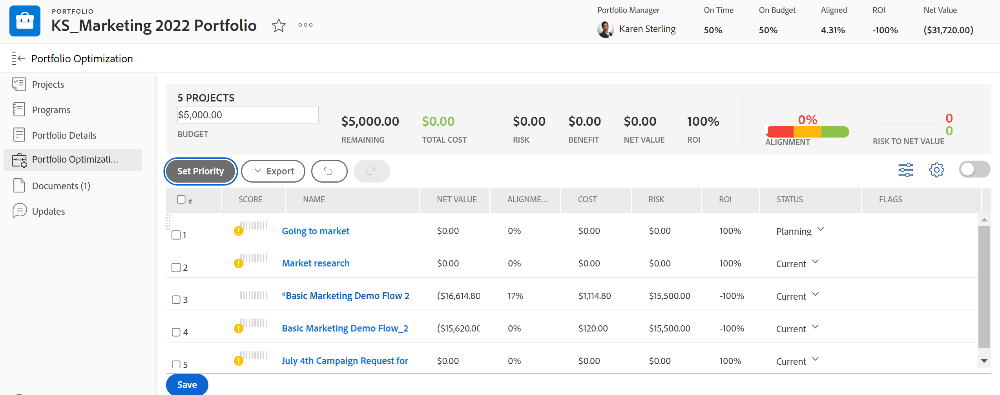

# Navigeren binnen een portfolio

<!--

(NOTE: This article will need to be further revised and maybe merged into Understanding Portfolios?! (other?!).)

-->

In [!DNL Adobe Workfront], vertegenwoordigt een portefeuille een inzameling van projecten die voor de zelfde middelen, begroting, programma, en prioriteit concurreren. Het belangrijkste doel van de portefeuille is om leidinggevenden en projectmanagers bij te staan bij het selecteren van projecten die de organisatie het meest ten goede komen.

Voor meer informatie over portefeuilles, zie [ overzicht van het Portfolio in  [!DNL Adobe Workfront]](../../../manage-work/portfolios/portfolios-overview/portfolio-overview.md).

## Toegangsvereisten

U moet de volgende toegang hebben om de stappen in dit artikel uit te voeren:

<table style="table-layout:auto"> 
 <col> 
 <col> 
 <tbody> 
  <tr> 
   <td role="rowheader">[!DNL Adobe Workfront] plan*</td> 
   <td> 
Alle 
 </td> 
  </tr> 
  <tr> 
   <td role="rowheader">[!DNL Adobe Workfront] licentie*</td> 
   <td> 
[!UICONTROL Plan] 
 </td> 
  </tr> 
  <tr> 
   <td role="rowheader">Configuraties op toegangsniveau*</td> 
   <td> 
[!UICONTROL Edit] toegang tot projecten en Portfolio's
 
Opmerking: als u nog steeds geen toegang hebt, vraag dan aan de [!DNL Workfront] -beheerder of deze aanvullende beperkingen op uw toegangsniveau heeft ingesteld. Voor informatie over hoe een [!DNL Workfront] beheerder uw toegangsniveau kan wijzigen, zie <a href="../../../administration-and-setup/add-users/configure-and-grant-access/create-modify-access-levels.md" class="MCXref xref"> tot douanetoegangsniveaus </a> leiden of wijzigen.
 </td> 
  </tr> 
  <tr> 
   <td role="rowheader">Objectmachtigingen</td> 
   <td> 
[!UICONTROL Manage] machtigingen voor het portfolio
 
De toestemmingen van de mening of hoger aan de projecten
 
Voor informatie bij het vragen van om extra toegang, zie <a href="../../../workfront-basics/grant-and-request-access-to-objects/request-access.md" class="MCXref xref"> de toegang van het Verzoek tot voorwerpen </a>.
 </td> 
  </tr> 
 </tbody> 
</table>

&#42; om te weten te komen welk plan, vergunningstype, of toegang u hebt, contacteer uw [!DNL Workfront] beheerder.

## Navigeren binnen een portfolio

1. Klik op het **[!UICONTROL Main Menu]** pictogram  rechtsboven in [!DNL Adobe Workfront] .

1. Klik op [!UICONTROL Portfolios].
1. Selecteer de volgende opties in het vervolgkeuzemenu **[!UICONTROL Filter]** :

   * **[!UICONTROL Portfolios I Own]** - Bevat een lijst met portfolio&#39;s waarvoor u de naam [!UICONTROL Portfolio Manager] hebt gegeven.
   * **[!UICONTROL All]**: Bevat alle portfolio&#39;s waarvoor u ten minste toegang hebt tot Weergave.\

     Voor meer informatie over toegang tot Portfolio&#39;s, zie [ overzicht van de Niveaus van de Toegang ](../../../administration-and-setup/add-users/access-levels-and-object-permissions/access-levels-overview.md).\
      Voor meer informatie over toestemmingen aan Portfolio&#39;s, zie [ een portefeuille ](../../../workfront-basics/grant-and-request-access-to-objects/share-a-portfolio.md) delen.

     Om nieuwe portefeuilles toe te voegen, zie [ een portefeuille ](../../../manage-work/portfolios/create-and-manage-portfolios/create-portfolios.md) creëren.

1. Klik op de naam van een portfolio om dit te openen.\
   De volgende maatstaven voor portfolioprestaties worden weergegeven in het gebied [!UICONTROL Portfolio Details] binnen een portfolio:

   * Of het portfolio [!UICONTROL On Time] is
   * Of het portfolio [!UICONTROL On Budget] is
   * De [!UICONTROL Return on Investment] (ROI)
   * Het portfolio [!UICONTROL Alignment]
   * Het portfolio [!UICONTROL Net Value]

1. (Optioneel)   Klik op **[!UICONTROL Projects]** in het linkerdeelvenster om projecten weer te geven die aan het geselecteerde portfolio zijn gekoppeld. Selecteer vervolgens een van de volgende filters in het vervolgkeuzemenu **[!UICONTROL Filter]** :

   * **[!UICONTROL Active]**: omvat alle projecten die zijn gekoppeld aan het geselecteerde portfolio en die zich in de volgende statussen bevinden:

      * [!UICONTROL Planning]
      * [!UICONTROL Approved]
      * [!UICONTROL Current]
   * **[!UICONTROL Requested]**: omvat projecten die zijn gekoppeld aan het geselecteerde portfolio met de status **[!UICONTROL Requested]** .

     Voor informatie over het herzien van Gevraagde projecten, zie [ Overzicht Gevraagde Projecten ](../../../manage-work/portfolios/create-and-manage-portfolios/review-requested-projects.md).

   * **[!UICONTROL All]**: omvat alle projecten die aan het geselecteerde portfolio zijn gekoppeld.

     >[!NOTE]
     >
     >Als u alleen bepaalde projecten wilt zien, kunt u een projectfilter maken in het vervolgkeuzemenu **[!UICONTROL Filter]** boven aan de lijst met projecten om het aantal weergegeven projecten te verminderen.

     Voor meer informatie over het creëren van filters, zie [ Overzicht van Filters ](../../../reports-and-dashboards/reports/reporting-elements/filters-overview.md).

1. Klik op **[!UICONTROL Programs]** in het linkerdeelvenster om programma&#39;s in het portfolio te maken of bestaande programma&#39;s te beheren.\
   Voor informatie over programma&#39;s, zie [ programma&#39;s ](../../../manage-work/portfolios/create-and-manage-programs/create-and-manage-programs.md) sectie creëren en beheren.

1. (Optioneel) Vouw het gebied **[!UICONTROL Portfolio Details]** in het linkerdeelvenster uit en klik op **[!UICONTROL Overview]** of **[!UICONTROL Custom Forms]** om de gegevens over het portfolio te bewerken.

1. (Optioneel) Klik op **[!UICONTROL Portfolio Optimization]** in het linkerdeelvenster om de prestaties van het portfolio te optimaliseren.

   

   >[!IMPORTANT]
   >
   >Uw bedrijf moet een [!UICONTROL Business] of hoger [!DNL Workfront] abonnement hebben om toegang te hebben tot [!UICONTROL Portfolio Optimizer] .

   Voor informatie over het gebruiken van Portfolio Optimizer, zie [ projecten in de Optimizer van het Portfolio ](../../../manage-work/portfolios/portfolio-optimizer/manage-projects-in-portfolio-optimizer.md) sectie leiden.

1. (Facultatief) klik **Documenten** in het linkerpaneel om documenten aan de portefeuille vast te maken.
1. (Optioneel) Klik op **[!UICONTROL Updates]** in het linkerdeelvenster om opmerkingen toe te voegen aan de updatestream van het portfolio. Voor informatie, zie [ het werk van de Update ](../../../workfront-basics/updating-work-items-and-viewing-updates/update-work.md).
1. (Optioneel) Klik op het **[!UICONTROL More]menu** om een van de volgende handelingen uit te voeren: 

   * Deactiveer het portfolio. Wanneer een portefeuille wordt gedeactiveerd, kunt u het niet meer associëren met projecten op het projectniveau.
   * Het portfolio verwijderen.

     >[!IMPORTANT]
     >
     >Hiermee worden de projecten die aan de portfolio zijn gekoppeld, niet verwijderd. Hierdoor wordt de naam van het portfolio verwijderd uit de projecten die er momenteel aan gekoppeld zijn.

   * Het portfolio delen met andere gebruikers.

1. (Facultatief) klik de **pictogram van de Ster**  rechts van de portefeuillenaam om de portefeuille aan uw lijst van favorieten toe te voegen.
