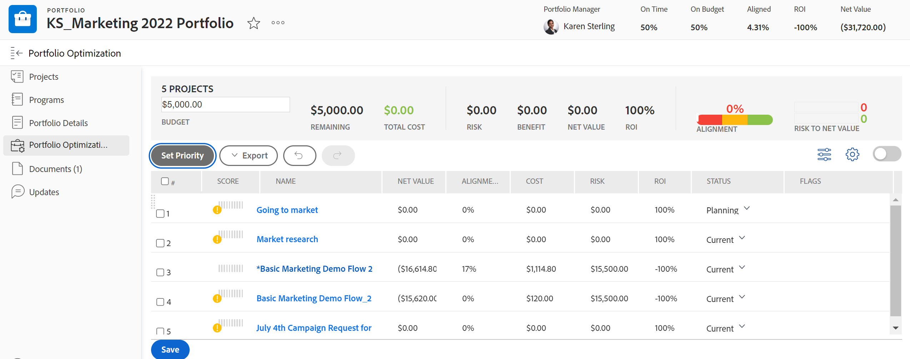

# Navigeren binnen een portfolio

<!--Audited: 08/2025-->

<!--

(NOTE: This article will need to be further revised and maybe merged into Understanding Portfolios?! (other?!).)

-->

In [!DNL Adobe Workfront], vertegenwoordigt een portefeuille een inzameling van projecten die voor de zelfde middelen, begroting, programma, en prioriteit concurreren. Het belangrijkste doel van de portefeuille is om leidinggevenden en projectmanagers bij te staan bij het selecteren van projecten die de organisatie het meest ten goede komen.

Voor meer informatie over portefeuilles, zie [ portefeuillemethodologie ](../../../manage-work/portfolios/portfolios-overview/portfolio-overview.md) begrijpen.

## Toegangsvereisten

+++ Breid uit om de toegangseisen voor de functionaliteit in dit artikel weer te geven. 

<table style="table-layout:auto"> 
 <col> 
 <col> 
 <tbody> 
  <tr> 
   <td role="rowheader">[!DNL Adobe Workfront] package</td> 
   <td> 
Alle
 </td> 
  </tr> 
  <tr> 
   <td role="rowheader">[!DNL Adobe Workfront] licentie</td> 
   <td> 
[!UICONTROL Standard] 

   
[!UICONTROL Plan] 
 </td> 
  </tr> 
  <tr> 
   <td role="rowheader">Configuraties op toegangsniveau</td> 
   <td> 
[!UICONTROL Edit] toegang tot [!UICONTROL Projects] en [!UICONTROL Portfolios]
  </td> 
  </tr> 
  <tr> 
   <td role="rowheader">Objectmachtigingen</td> 
   <td> 
[!UICONTROL Manage] machtigingen voor het portfolio
 
De toestemmingen van de mening of hoger aan de projecten
  </td> 
  </tr> 
 </tbody> 
</table>

*For informatie, zie [ vereisten van de Toegang in de documentatie van Workfront ](/help/quicksilver/administration-and-setup/add-users/access-levels-and-object-permissions/access-level-requirements-in-documentation.md).

+++

<!--
Old:

<table style="table-layout:auto"> 
 <col> 
 <col> 
 <tbody> 
  <tr> 
   <td role="rowheader">[!DNL Adobe Workfront] plan</td> 
   <td> 
Any 
 </td> 
  </tr> 
  <tr> 
   <td role="rowheader">[!DNL Adobe Workfront] license*</td> 
   <td> 
New: [!UICONTROL Standard] 

   
Current: [!UICONTROL Plan] 
 </td> 
  </tr> 
  <tr> 
   <td role="rowheader">Access level configurations</td> 
   <td> 
[!UICONTROL Edit] access to Projects and Portfolios
  </td> 
  </tr> 
  <tr> 
   <td role="rowheader">Object permissions</td> 
   <td> 
[!UICONTROL Manage] permissions to the portfolio
 
View or higher permissions to the projects
  </td> 
  </tr> 
 </tbody> 
</table>

*For information, see [Access requirements in Workfront documentation](/help/quicksilver/administration-and-setup/add-users/access-levels-and-object-permissions/access-level-requirements-in-documentation.md).
-->

## Navigeren binnen een portfolio

{{step1-to-portfolios}}

1. Selecteer de volgende opties in het vervolgkeuzemenu **[!UICONTROL Filter]** :

   * **[!UICONTROL Portfolios I Own]** : Bevat een lijst met portfolio&#39;s waarvoor u als [!UICONTROL Portfolio Manager] bent aangewezen.
   * **[!UICONTROL All]** : Bevat alle portfolio&#39;s waarvoor u ten minste toegang hebt tot Weergave.

     Voor meer informatie over toegang tot Portfolio&#39;s, zie [ overzicht van de Niveaus van de Toegang ](../../../administration-and-setup/add-users/access-levels-and-object-permissions/access-levels-overview.md).
Voor meer informatie over toestemmingen aan Portfolio&#39;s, zie [ een portefeuille ](../../../workfront-basics/grant-and-request-access-to-objects/share-a-portfolio.md) delen.

     Om nieuwe portefeuilles toe te voegen, zie [ een portefeuille ](../../../manage-work/portfolios/create-and-manage-portfolios/create-portfolios.md) creëren.

1. Klik op de naam van een portfolio om dit te openen.
De volgende maatstaven voor portfolioprestaties worden weergegeven in het gebied [!UICONTROL Portfolio Details] binnen een portfolio:

   * Of het portfolio [!UICONTROL On Time] is
   * Of het portfolio [!UICONTROL On Budget] is
   * De [!UICONTROL Return on Investment] (ROI)
   * Het portfolio [!UICONTROL Alignment]
   * Het portfolio [!UICONTROL Net Value]

1. (Optioneel) Klik in het linkerdeelvenster op **[!UICONTROL Projects]** om projecten weer te geven die aan het geselecteerde portfolio zijn gekoppeld. Selecteer vervolgens een van de volgende filters in het vervolgkeuzemenu van **[!UICONTROL Filter]** :

   * **[!UICONTROL Active]** : Omvat alle projecten verbonden aan de geselecteerde portefeuille die in de volgende statussen zijn:

      * [!UICONTROL Planning]
      * [!UICONTROL Approved]
      * [!UICONTROL Current]
   * **[!UICONTROL Requested]** : Omvat projecten verbonden aan het geselecteerde portefeuille met een status van **[!UICONTROL Requested]**.

     Voor informatie over het herzien van Gevraagde projecten, zie [ Overzicht Gevraagde Projecten ](../../../manage-work/portfolios/create-and-manage-portfolios/review-requested-projects.md).

   * **[!UICONTROL All]** : Omvat alle projecten verbonden aan de geselecteerde portefeuille.

     >[!NOTE]
     >
     >Als u alleen bepaalde projecten wilt zien, kunt u een projectfilter maken in het vervolgkeuzemenu **[!UICONTROL Filter]** boven aan de lijst met projecten om het aantal weergegeven projecten te verminderen.

     Voor meer informatie over het creëren van filters, zie [ Overzicht van Filters ](../../../reports-and-dashboards/reports/reporting-elements/filters-overview.md).

1. Klik op **[!UICONTROL Programs]** in het linkerdeelvenster om programma&#39;s in het portfolio te maken of bestaande programma&#39;s te beheren.
Voor informatie over programma&#39;s, zie [ programma&#39;s ](../../../manage-work/portfolios/create-and-manage-programs/create-and-manage-programs.md) sectie creëren en beheren.

1. (Optioneel) Vouw het gebied **[!UICONTROL Portfolio Details]** in het linkerdeelvenster uit en klik op **[!UICONTROL Overview]** of **[!UICONTROL Custom Forms]** om de gegevens over het portfolio te bewerken.

1. (Optioneel) Klik op **[!UICONTROL Portfolio Optimization]** in het linkerdeelvenster om de prestaties van het portfolio te optimaliseren.

   

   >[!IMPORTANT]
   >
   >Uw bedrijf moet een [!UICONTROL Prime] of hoger [!DNL Workfront] -pakket hebben om toegang te hebben tot [!UICONTROL Portfolio Optimizer] .
   >

   Voor informatie over het gebruiken van de Optimizer van Portfolio, zie [ projecten in Optimizer van Portfolio beheren: artikel index ](../../../manage-work/portfolios/portfolio-optimizer/manage-projects-in-portfolio-optimizer.md) sectie.

1. (Facultatief) klik **Documenten** in het linkerpaneel om documenten aan de portefeuille vast te maken.

   >[!NOTE]
   >
   >Het toevoegen van documenten aan portfolio&#39;s hangt af van het type opslag dat uw organisatie gebruikt voor Workfront.
   >Sommige klanten hebben mogelijk toegang tot beide volgende opslagomgevingen voor documenten:
   >
   >  * **de opslag van erfenisWorkfront**: De portefeuilles die deze opslag gebruiken hebben het pictogram van de erfenisopslag  naast de naam.
   >  * **de ondernemingsopslag van Adobe**
   >
   >Uw Workfront-beheerder bepaalt welke opslagruimte uw bedrijf gebruikt, of u kunt kiezen met welke opslagruimte u elk portfolio werkt.
   >Voor meer informatie, zie [ de ondernemingsopslag van Adobe voor uw organisatie ](/help/quicksilver/administration-and-setup/set-up-workfront/configure-system-defaults/enable-esm.md) toelaten.
   >
   >Het toevoegen van documenten aan portfolio&#39;s hangt af van het type opslag dat u gebruikt.
   >
   >Voor informatie, zie [ documenten aan Adobe Workfront van uw dossiersysteem ](/help/quicksilver/documents/adding-documents-to-workfront/add-documents-from-file-system.md) toevoegen.

1. (Optioneel) Klik op **[!UICONTROL Updates]** in het linkerdeelvenster om opmerkingen toe te voegen aan de updatestream van het portfolio. Voor informatie, zie [ het werk van de Update ](../../../workfront-basics/updating-work-items-and-viewing-updates/update-work.md).
1. (Facultatief) klik het **[!UICONTROL More]menu**  om één van het volgende te doen:

   * Deactiveer het portfolio. Wanneer een portefeuille wordt gedeactiveerd, kunt u het niet meer associëren met projecten op het projectniveau.
   * Het portfolio verwijderen.

     >[!IMPORTANT]
     >
     >Hiermee worden de projecten die aan de portfolio zijn gekoppeld, niet verwijderd. Hierdoor wordt de naam van het portfolio verwijderd uit de projecten die er momenteel aan gekoppeld zijn.

   * Het portfolio delen met andere gebruikers.

1. (Facultatief) klik het **pictogram van de Ster  rechts van de portefeuillenaam om de portefeuille aan uw lijst van favorieten toe te voegen.**
