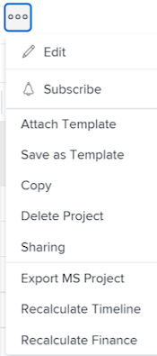

# Een sjabloon aan een project koppelen

<!-- Audited: 10/2025 -->

U kunt een malplaatje aan een project of tijdens de aanvankelijke creatiefase van het project of vastmaken nadat het is gecreeerd.

Voor meer informatie over het creëren van een project dat een malplaatje gebruikt, zie [&#x200B; een project creëren gebruikend een malplaatje &#x200B;](../../../manage-work/projects/create-projects/create-project-from-template.md).

## Toegangsvereisten

+++ Breid uit om de toegangseisen voor de functionaliteit in dit artikel weer te geven.

<table style="table-layout:auto"> 
 <col> 
 <col> 
 <tbody> 
  <tr> 
   <td role="rowheader">Adobe Workfront-pakket</td> 
   <td> 
Alle
 </td> 
  </tr> 
  <tr> 
   <td role="rowheader">Adobe Workfront-licentie</td> 
   <td> 
Standard

    
Plan

    
 </td> 
  </tr> 
  <tr> 
   <td role="rowheader">Configuraties op toegangsniveau</td> 
   <td> 
Toegang tot projecten bewerken 
 
Toegang tot sjablonen weergeven
</td> 
  </tr> 
  <tr> 
   <td role="rowheader">Objectmachtigingen</td> 
   <td> 
Rechten voor het project beheren
 
Machtigingen voor de sjabloon weergeven of hoger
 </td> 
  </tr> 
 </tbody> 
</table>

Voor meer detail over de informatie in deze lijst, zie [&#x200B; vereisten van de Toegang in de documentatie van Workfront &#x200B;](/help/quicksilver/administration-and-setup/add-users/access-levels-and-object-permissions/access-level-requirements-in-documentation.md).

+++

<!--Old:
 
 <table style="table-layout:auto"> 
 <col> 
 <col> 
 <tbody> 
  <tr> 
   <td role="rowheader">Adobe Workfront plan</td> 
   <td> 
Any 
 </td> 
  </tr> 
  <tr> 
   <td role="rowheader">Adobe Workfront license</td> 
   <td> 
New: Standard

   
Or

   
Current: Plan

    
 </td> 
  </tr> 
  <tr> 
   <td role="rowheader">Access level configurations</td> 
   <td> 
Edit access to Projects 
 
For information about project access, see <a href="../../../administration-and-setup/add-users/configure-and-grant-access/grant-access-projects.md" class="MCXref xref">Grant access to projects</a>.
 
View access to Templates
 
For information about template permissions, see <a href="../../../workfront-basics/grant-and-request-access-to-objects/share-a-template.md" class="MCXref xref">Share a template</a>. 
 
For information about template access, see <a href="../../../administration-and-setup/add-users/configure-and-grant-access/grant-access-templates.md" class="MCXref xref">Grant access to templates</a>.
 
Note: If you still don't have access, ask your Workfront administrator if they set additional restrictions in your access level. For information on how a Workfront administrator can modify your access level, see <a href="../../../administration-and-setup/add-users/configure-and-grant-access/create-modify-access-levels.md" class="MCXref xref">Create and modify custom access levels</a>.
 </td> 
  </tr> 
  <tr> 
   <td role="rowheader">Object permissions</td> 
   <td> 
Manage permissions to the project
 
For information about project permissions, see <a href="../../../workfront-basics/grant-and-request-access-to-objects/share-a-project.md" class="MCXref xref">Share a project in Adobe Workfront</a>. 
 
View permissions or higher to the template
 
For information on requesting additional access, see <a href="../../../workfront-basics/grant-and-request-access-to-objects/request-access.md" class="MCXref xref">Request access to objects </a>.
 </td> 
  </tr> 
 </tbody> 
</table>-->

<!--

<h2>Considerations when adding templates to projects</h2>

(NOTE: moved this to an Overview article of its own) 

Consider the following when adding templates to projects:

<ul>
<li> 
You can attach only active templates to projects. 
 </li>
<li> 
You can attach a template to a project when the project is in a status of Complete, Dead, or in Pending Approval, only when your Adobe Workfront administrator or a group administrator has enabled this functionality in the Project Preferences area. For information about setting project preferences, see <a href="../../../administration-and-setup/set-up-workfront/configure-system-defaults/set-project-preferences.md" class="MCXref xref">Configure system-wide project preferences</a>. 
 </li>
<li> 
Unless you exclude specific template tasks from being added in the attachment process, all template tasks are added to the existing project. 
 </li>
<li> 
Most template settings are added to the project. 
 </li>
<li> 
Some settings from the template automatically transfer to the project, unless you specifically mark them to be excluded. 

Example: </b>">
<b>Example: </b>

For example, these settings are added to the project:

<ul>
<li>Start From field</li>
<li>Custom forms and the information on them</li>
<li>Queue Details </li>
<li>Financial settings </li>
</ul>

 </li>
</ul>

-->

## Een sjabloon aan een bestaand project koppelen {#attach-a-template-to-an-existing-project}

U kunt een malplaatje aan een project van de projectpagina of van een projectlijst of een rapport vastmaken.

{{step1-to-projects}}

1. Voor de **pagina van Projecten**, selecteer het project u een malplaatje aan wilt vastmaken.

1. Klik **Meer** pictogram  rechts van de projectnaam.

   

   of

   Ga naar een projectlijst of een rapport en selecteer een project, dan klik het **Meer** pictogram  bij de bovenkant van de lijst.

   

1. Klik **Sjabloon** vastmaken. De **vertoningen van het Malplaatje van de Band** doos.

1. Begin het typen van de naam van het malplaatje dat u op het **gebied van Malplaatjes van het Onderzoek** wilt vastmaken &lbrace;, dan het klikken wanneer het in de lijst toont.

   of

   Klik de naam van een malplaatje in het **Andere gebied van Malplaatjes**.

   Een voorbeeld van de sjabloon wordt rechts weergegeven met de volgende informatie over de sjabloon:

   * Duur
   * Eigenaar
   * Het aantal taken op hoofdniveau (bevat een lijst met de eerste drie taken op hoofdniveau)
   * Totaal aantal taken
   * Namen van bijgevoegde aangepaste formulieren

   

1. (Facultatief) klik het **pictogram van Favorieten** pictogram van Favorieten  Favorieten **lijst.**

1. (Facultatief) klik het **pictogram van Favorieten** pictogram van Favorieten  **lijst van Favorieten te verwijderen.**
1. Klik **aanpassen en verbinden**. Het **Sjabloon** zijpaneel van de Band opent.

1. (Optioneel) Werk de gegevens in de volgende secties bij:

   <table style="table-layout:auto"> 
    <col> 
    <col> 
    <tbody> 
     <tr> 
      <td role="rowheader" colspan="2"> 
Sectie Taken
 
  
 </td> 
     </tr> 
     <tr> 
      <td role="rowheader">De geselecteerde sjabloontaken hieronder worden geïmporteerd in het project. Schakel de opties uit die u wilt uitsluiten. </td> 
      <td>
Hef de selectie op van alle taken die u van de sjabloon wilt uitsluiten voordat u deze aan het project koppelt.

      
<b>TIP</b>

      
U kunt slechts één taak kiezen.

      </td> 
     </tr> 
     <tr> 
      <td role="rowheader">Selecteer de projecttaak u als voorganger voor de taken in dit malplaatje wilt.</td> 
      <td> 
Klik in het veldvak om een lijst met projecttaken weer te geven en selecteer vervolgens welke taak moet worden voltooid voordat de sjabloontaken kunnen worden gestart. Alternatief, kunt u deze stap en opstellingsverhoudingen binnen het project overslaan nadat het malplaatje in bijlage is. 
 
 Selecteer het <strong> Type van Afhankelijkheid </strong>, <strong> de informatie van de Tijd van de Lag </strong>, en als u voorganger wilt worden afgedwongen door <strong> te controleren Afdwingen Predecessor </strong> checkbox. 
 </td> 
     </tr> 
     <tr> 
      <td role="rowheader">Selecteer de projecttaak die u als ouder van de taken in dit malplaatje wilt.</td> 
      <td> 
Selecteer welke projecttaak u als oudertaak voor alle malplaatjetaken wilt aanwijzen. Als u geen selectie maakt, verschijnen alle malplaatjetaken aan het eind van uw huidige projecttaken. U kunt deze stap overslaan en taken verplaatsen in het project nadat de sjabloon is bijgevoegd.

      
<b>OPMERKING</b>

      
Als u een taak van het oudermalplaatje met extra kinderen selecteerde, slechts zal de ouder de projecttaak als zijn voorganger tonen nadat het aan het project is toegevoegd. De taken van het kindmalplaatje zullen geen voorganger tonen.

      
Als u slechts een taak van het kindmalplaatje selecteerde, zal de projecttaak als zijn voorganger tonen nadat het aan het project wordt toegevoegd. 

   </td> 
     </tr> 
     <tr> 
      <td role="rowheader" colspan="2"> 
Sectie Opties
 
  
 </td> 
     </tr> 
     <tr> 
      <td role="rowheader">De onderstaande geselecteerde items worden overgebracht naar het project. Schakel de opties uit die u wilt uitsluiten.</td> 
      <td> 
Schakel de selectievakjes voor alle informatie uit die u van de sjabloon wilt uitsluiten voordat u deze aan het project koppelt. Voor meer informatie over elk gebied, zie <a href="../../../manage-work/projects/create-and-manage-templates/attach-template-to-project-overview.md" class="MCXref xref"> Overzicht van het vastmaken van een malplaatje aan een project </a>. 
 
Belangrijk: Als u de <strong> doos van de Eigenschappen van de Rij &amp; van de Opstelling van Kwesties </strong> controleert, beschrijven de Details van de Rij van het malplaatje die van het project. In dit geval, worden de Verpletterende Regels, de Onderwerpen van de Rij, en de Groepen van het Onderwerp van het malplaatje toegevoegd aan die van het project.   als het project opstelling als verzoekrij is en het malplaatje u aan het project vastmaakt niet opstelling als verzoekrij, wordt de de rijinformatie van het project verwijderd als u de <strong> gecontroleerde doos van de Eigenschappen van de Rij en van de Opstelling van de Uitgave </strong> verlaat.   als u de <strong> Eigenschappen van de Rij en de doos van de Opstelling van de Uitgave </strong> schrapt, worden alle montages van de Opstelling van de Rij van het project bewaard en geen montages van de Opstelling van de Rij van het malplaatje zijn in bijlage. 
 </td> 
     </tr> 
     <tr> 
      <td role="rowheader" colspan="2"> 
Aangepaste Forms-sectie
 
  
 </td> 
     </tr> 
     <tr> 
      <td role="rowheader">Aangepaste Forms</td> 
      <td> 
Als aangepaste formulieren aan de sjabloon zijn gekoppeld, worden de namen van de formulieren in het linkerdeelvenster weergegeven. 
 </td> 
     </tr> 
    </tbody> 
   </table>

1. (Optioneel) Werk de gegevens in de aangepaste formulieren bij. Deze informatie wordt overgedragen naar het project.

   >[!TIP]
   >
   >* Deze stap is verplicht wanneer de aangepaste formulieren op de sjabloon verplichte velden bevatten die leeg zijn.
   >* Als de gebieden van de malplaatjedouane vormen reeds op het project bestaan en informatie bevatten, behouden zij de informatie reeds over het project. U kunt ze niet bewerken tijdens het koppelen van de sjabloon.

1. Klik **Sjabloon vastmaken.**
1. Klik **annuleer gehechtheid** ophouden vastmakend het malplaatje.

   of

   Toestaan dat de bijlage klaar is om de sjabloon aan het project toe te voegen.

   Na het vastmaken van het malplaatje, kunt u het project uitgeven en om het even welke taken, informatie, of montages aanpassen zoals nodig.

1. (Facultatief) in het linkerpaneel, klik **Details van het Project**, dan **Overzicht** om de naam van het malplaatje te bekijken u in het **verhoudingen van het Project** gebied vastmaakte.

   >[!TIP]
   >
   >Als u meer dan één malplaatje aan het project vastmaakt, slechts zal het malplaatje u eerst in bijlage op dit gebied tonen. Voor informatie, zie [&#x200B; veelvoudige malplaatjes aan een bestaand project vastmaken en de informatie van het meningsmalplaatje &#x200B;](#attach-multiple-templates-to-an-existing-project-and-view-template-information) sectie in dit artikel.

1. (Optioneel) Verwijder sjabloongegevens uit het project waar u de sjabloon hebt gekoppeld. Voor informatie, zie [&#x200B; malplaatjeinformatie uit een project &#x200B;](../../../manage-work/projects/create-and-manage-templates/remove-template-from-project.md) verwijderen.

## Meerdere sjablonen koppelen aan een bestaand project en sjablooninformatie weergeven {#attach-multiple-templates-to-an-existing-project-and-view-template-information}

U kunt veelvoudige malplaatjes (één tegelijkertijd) aan het zelfde project vastmaken na de stappen die in de sectie [&#x200B; worden beschreven een malplaatje aan een bestaand project &#x200B;](#attach-a-template-to-an-existing-project) in dit artikel vastmaken. Dit voegt de taken en andere informatie van elk malplaatje aan het project toe.

>[!TIP]
>
>Wanneer u verscheidene malplaatjes aan een project vastmaakt, slechts zal het malplaatje u eerst in bijlage op het gebied van de Details van het Project tonen.

Om te bekijken welke malplaatje wordt toegepast op een project:

{{step1-to-projects}}

1. Voor de **pagina van Projecten**, selecteer het project dat een malplaatje in bijlage heeft.

1. Klik **Details van het Project** in het linkerpaneel.

1. Bepaal de plaats van de naam van het malplaatje in bijlage aan het project op het **gebied van het Malplaatje** bij de bodem van de **sectie van het Overzicht** onder **verhoudingen van het Project**.

   

