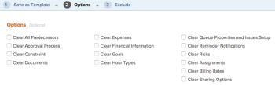

# Sjabloon maken van project

<!--

(Note: Keep this article in the Creating and Managing Templates area with the detailed information that this contains. Since this is an article about creating TEMPLATES, this needs to be detailed under Templates; there is a similar article with almost the same title in Managing projects that points to this one - since this functionality is in the UI under Projects, this article must have a presence in that areas as well. Keep both, but make this one the only editable one (iterative))

-->

U kunt sjablonen maken wanneer u een bestaand project opslaat als een sjabloon.

Nadat u een bestaand project als malplaatje opslaat, kunt u het nieuwe malplaatje gebruiken om nieuwe projecten tot stand te brengen. Dit vereenvoudigt en versnelt het proces van de projectverwezenlijking.

>[!NOTE]
>
>Wanneer het bewaren van een project als malplaatje, slaan de daadwerkelijke data van de taken en van het project niet voor het malplaatje op.
>
>Een malplaatje en zijn taken hebben geen daadwerkelijke data, maar eerder een aanwijzing van welke dag (van wanneer het toekomstige project zou kunnen beginnen) een taak zou kunnen beginnen en op welke dag de taak zou kunnen moeten voltooien. Wanneer het gebruiken van malplaatjes om de toekomstige projecten tot stand te brengen, zullen de projecten daadwerkelijke data ontvangen. Voor informatie, zie [ een project ](../create-projects/create-project.md) creëren.

## Toegangsvereisten

+++ Breid uit om de toegangseisen voor de functionaliteit in dit artikel weer te geven.

<table style="table-layout:auto"> 
 <col> 
 <col> 
 <tbody> 
  <tr> 
   <td role="rowheader">Adobe Workfront-pakket</td> 
   <td> 
Alle
 </td> 
  </tr> 
  <tr> 
   <td role="rowheader">Adobe Workfront-licentie</td> 
   <td>
Standard
 
   
Plan
 </td> 
  </tr> 
  <tr> 
   <td role="rowheader">Configuraties op toegangsniveau</td> 
   <td> 
Toegang tot sjablonen bewerken
</td> 
  </tr> 
  <tr> 
   <td role="rowheader">Objectmachtigingen</td> 
   <td> 
De toestemmingen van de mening of hoger aan een project 
 
Nadat u de sjabloon hebt gemaakt, hebt u beheermachtigingen voor de sjabloon nodig
</td> 
  </tr> 
 </tbody> 
</table>

Voor meer detail over de informatie in deze lijst, zie [ vereisten van de Toegang in de documentatie van Workfront ](/help/quicksilver/administration-and-setup/add-users/access-levels-and-object-permissions/access-level-requirements-in-documentation.md).

+++

<!--Old:
<table style="table-layout:auto"> 
 <col> 
 <col> 
 <tbody> 
  <tr> 
   <td role="rowheader">Adobe Workfront plan*</td> 
   <td> 
Any 
 </td> 
  </tr> 
  <tr> 
   <td role="rowheader">Adobe Workfront license*</td> 
   <td> 
Plan 
 </td> 
  </tr> 
  <tr> 
   <td role="rowheader">Access level configurations*</td> 
   <td> 
Edit access to Templates
 
Note: If you still don't have access, ask your Workfront administrator if they set additional restrictions in your access level. For information on how a Workfront administrator can modify your access level, see <a href="../../../administration-and-setup/add-users/configure-and-grant-access/create-modify-access-levels.md" class="MCXref xref">Create or modify custom access levels</a>.
 </td> 
  </tr> 
  <tr> 
   <td role="rowheader">Object permissions</td> 
   <td> 
View or higher permissions to a project 
 
You obtain Manage permissions to the template after you create it
 
For information on requesting additional access, see <a href="../../../workfront-basics/grant-and-request-access-to-objects/request-access.md" class="MCXref xref">Request access to objects </a>.
 </td> 
  </tr> 
 </tbody> 
</table>-->

## Sjabloon maken van project

1. Ga naar het project dat u als malplaatje wilt bewaren.
1. Klik **Meer** menu , dan **sparen als Malplaatje**.
1. Geef de volgende informatie voor de sjabloon op:

   <table style="table-layout:auto"> 
    <col> 
    <col> 
    <tbody> 
     <tr> 
      <td role="rowheader">Naam</td> 
      <td>Geef een naam voor de sjabloon op.</td> 
     </tr> 
     <tr> 
      <td role="rowheader">Beschrijving</td> 
      <td>Geef een beschrijving voor de sjabloon.</td> 
     </tr> 
     <tr> 
      <td role="rowheader">Is actief</td> 
      <td> 
Selecteer een van de volgende opties:
 
       <ul> 
        <li> 
<strong> ja </strong>: Andere gebruikers kunnen het malplaatje vinden en het aan projecten vastmaken.
 </li> 
        <li><strong> Nr </strong>: Andere gebruikers kunnen niet het malplaatje vinden en kunnen het niet aan projecten vastmaken.</li> 
       </ul> </td> 
     </tr> 
     <tr> 
      <td role="rowheader">Aangepaste Forms</td> 
      <td>Gebruik de vervolgkeuzelijst om aangepaste formulieren te selecteren die u aan de sjabloon wilt koppelen. Als er al aangepaste formulieren aan het project zijn gekoppeld, worden alle gegevensvelden van die aangepaste formulieren weergegeven.  u kunt tot 10 douaneformulieren op één enkel malplaatje omvatten.</td> 
     </tr> 
    </tbody> 
   </table>

1. Klik **leiden Forms** om de vormen te verwijderen of opnieuw in orde te brengen. Voor informatie over hoe te om douaneformulieren op het malplaatje te verwijderen en opnieuw in orde te brengen, zie [ de vormen van de Douane ](../../../administration-and-setup/customize-workfront/create-manage-custom-forms/create-and-manage-custom-forms.md).

   

1. Klik **Volgende Stap.**
1. In de **sectie van Opties**, selecteer checkbox naast om het even welke informatie u van het malplaatje wilt ontruimen.

   

1. Klik **Volgende Stap.**
1. In de **uitsluiten** sectie, selecteer om het even welke taken die u van het project wilt uitsluiten.

   

1. Klik **Einde en sparen Malplaatje.**

   Uw sjabloon wordt nu weergegeven in de lijst met beschikbare sjablonen en kan worden gekoppeld aan een bestaand project of worden gebruikt om een nieuw project te maken.

 
