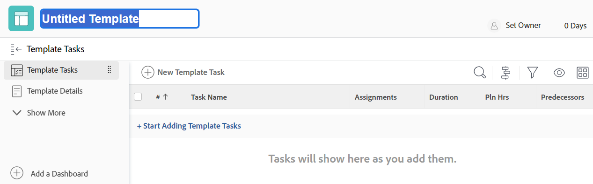

# Een projectsjabloon maken

<!-- Audited: 1/2024 -->

U kunt sjablonen maken en verwijderen vanuit het gebied Sjablonen. Wanneer u een nieuwe sjabloon maakt, kunt u de informatie voor alle taken en voor uw toekomstige projectinstellingen invoeren. Deze informatie zal dan aan om het even welk project overbrengen dat u van het malplaatje creeert.

>[!NOTE]
>
>Een malplaatje en zijn taken hebben geen daadwerkelijke data, maar eerder een aanwijzing van welke dag (van wanneer het toekomstige project zou kunnen beginnen) een taak zou kunnen beginnen en op welke dag de taak zou kunnen moeten voltooien. Wanneer het gebruiken van malplaatjes om de toekomstige projecten tot stand te brengen, zullen de projecten daadwerkelijke data ontvangen. Zie voor meer informatie [Een project maken](../create-projects/create-project.md).

U kunt op de volgende manieren een nieuwe sjabloon maken:

* Geheel nieuw, zoals beschreven in dit artikel.
* Van bestaande projecten, door een project als malplaatje te bewaren.

  Voor meer informatie over het creëren van malplaatjes van bestaande projecten, zie [Een project opslaan als een sjabloon](../../../manage-work/projects/manage-projects/save-project-as-template.md).

* Door deze uit een andere sjabloon te kopiëren.

  Zie voor meer informatie over het kopiëren van een bestaande sjabloon [Een projectsjabloon kopiëren](../../../manage-work/projects/create-and-manage-templates/copy-template.md).

* Door blauwdrukken te importeren. U moet een Workfront-beheerder zijn om blauwdrukken te kunnen importeren. Zie voor meer informatie [Een blauwdruk configureren](../../../administration-and-setup/blueprints/configure-template-package.md).

## Toegangsvereisten

U moet het volgende hebben:

<table style="table-layout:auto"> 
 <col> 
 <col> 
 <tbody> 
  <tr> 
   <td role="rowheader">Adobe Workfront-plan</td> 
   <td> 
Alle
 </td> 
  </tr> 
  <tr> 
   <td role="rowheader">Adobe Workfront-licentie</td> 
   <td> 
Nieuw: Standaard 

of 

Huidig: Plan 
 
U moet systeembeheerder zijn om malplaatjes van Blauwdrukken in te voeren
 </td> 
  </tr> 
  <tr> 
   <td role="rowheader">Configuraties op toegangsniveau*</td> 
   <td> 
Toegang tot sjablonen bewerken
 </td> 
  </tr> 
  <tr> 
   <td role="rowheader">Objectmachtigingen</td> 
   <td> 
U hebt standaard beheerdersmachtigingen voor de sjablonen die u maakt
  </td> 
  </tr> 
 </tbody> 
</table>

Zie voor meer informatie over de informatie in deze tabel [Toegangsvereisten in Workfront-documentatie](/help/quicksilver/administration-and-setup/add-users/access-levels-and-object-permissions/access-level-requirements-in-documentation.md).

## Een sjabloon maken

1. Klik op de knop **[!UICONTROL Main Menu]** pictogram  in de rechterbovenhoek van Adobe Workfront of (indien beschikbaar) op de knop **[!UICONTROL Main Menu]** pictogram  in de linkerbovenhoek klikt u op **Sjablonen**.

1. Klikken **Nieuwe sjabloon**.

   De sjabloon heeft geen naam.

   

1. Geef een naam voor de nieuwe sjabloon op in de sjabloonkoptekst en druk vervolgens op **Enter.**
1. Klik op de knop **Sjabloontaken** in het linkerdeelvenster.
1. Klikken **Sjabloontaken toevoegen starten**.

   of

   Klikken **Nieuwe sjabloontaak** om taken aan uw sjabloon toe te voegen.

   Het toevoegen van malplaatjetaken aan een malplaatje is identiek aan het toevoegen van taken aan een project.

   Voor meer informatie over het toevoegen van taken aan een project, zie [Taken maken in een project](../../../manage-work/tasks/create-tasks/create-tasks-in-project.md).

   >[!NOTE]
   >
   >U kunt geen terugkerende taken aan een sjabloon toevoegen.

1. (Optioneel) Klik op de knop **Gantt-grafiek** pictogram in de hoger-juiste hoek van de Lijst van de Taak om een visuele vertegenwoordiging van de de taaklijst van het malplaatje te zien.

   >[!TIP]
   >
   >U kunt taken niet rechtstreeks vanuit dit Gantt-diagram bewerken.

1. Als u informatie wilt toevoegen aan uw nieuwe sjabloon, klikt u op de knop **Meer** menu en klik vervolgens op **Bewerken**.

   Zie voor informatie over het bewerken van een sjabloon [Projectsjablonen bewerken](../../../manage-work/projects/create-and-manage-templates/edit-templates.md).

1. Klikken **Wijzigingen opslaan**.
1. (Optioneel) Zie de sectie als u aanvullende items aan de sjabloon wilt toevoegen [Extra items aan een sjabloon toevoegen](../../../manage-work/projects/create-and-manage-templates/edit-templates.md#add-additional-items-to-a-template) in het artikel [Projectsjablonen bewerken](../../../manage-work/projects/create-and-manage-templates/edit-templates.md).

## Sjablooninstellingen bepaald door groepskoppeling

De koppeling van een projectsjabloon met een groep (of het ontbreken van een groep) bepaalt hoe project-, taak- en uitgiftevoorkeuren bepaalde instellingen in de sjabloon bepalen. Zie de sectie voor meer informatie [De projectsjablonen van een groep maken en wijzigen](../../../administration-and-setup/manage-groups/work-with-group-objects/create-and-modify-a-groups-templates.md#create-and-modify-a-groups-project-templates) in het artikel [De projectsjablonen van een groep maken en wijzigen](../../../administration-and-setup/manage-groups/work-with-group-objects/create-and-modify-a-groups-templates.md).
