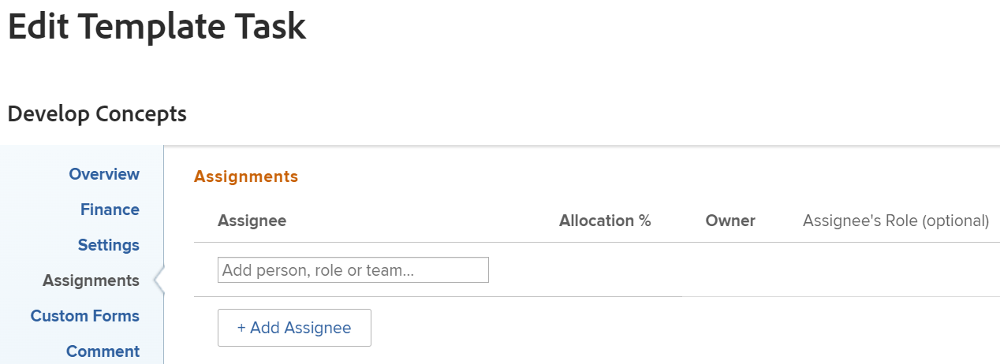

# Sjabloontaken bewerken

<!--Audited: 11/2025-->

<!--take out production and preview references and new/ old experiences at release-->

<!--

 

The highlighted information on this page refers to functionality not yet generally available. It is available only in the Preview environment for all customers. The same features will also be available in the Production environment for all customers starting with a week from the Preview release.      

For more information, see [Interface modernization](/help/quicksilver/product-announcements/product-releases/interface-modernization/interface-modernization.md).  

 
-->

Nadat u een sjabloon hebt gemaakt, kunt u de informatie van de sjabloontaken bewerken. De informatie u op een malplaatjetaak bijwerkt wordt geassocieerd met projecttaken nadat u het malplaatje gebruikt om een project tot stand te brengen of u het malplaatje aan een project vastmaakt.

Voor informatie over het creëren van een malplaatje, zie [ een projectmalplaatje ](../../../manage-work/projects/create-and-manage-templates/create-template.md) creëren.

U kunt één sjabloontaak tegelijk bewerken of sjabloontaken bulksgewijs bewerken.

>[!NOTE]
>
>U kunt sjabloontaken die tot verschillende sjablonen behoren, niet bulksgewijs bewerken. U kunt sjabloontaken alleen bewerken die tot dezelfde sjabloon behoren.

## Toegangsvereisten

+++ Breid uit om de toegangseisen voor de functionaliteit in dit artikel weer te geven.

<table style="table-layout:auto"> 
 <col> 
 <col> 
 <tbody> 
  <tr> 
   <td role="rowheader">Adobe Workfront-pakket</td> 
   <td> 
Alle
 </td> 
  </tr> 
  <tr> 
   <td role="rowheader">Adobe Workfront-licentie</td> 
   <td> 
Standard

   
Plan 
</td> 
  </tr> 
  <tr> 
   <td role="rowheader">Configuratie op toegangsniveau</td> 
   <td> 
Toegang tot sjablonen bewerken
  </td> 
  </tr> 
  <tr> 
   <td role="rowheader">Objectmachtigingen </td> 
   <td> 
Rechten voor een sjabloon beheren. 
 
U kunt een sjabloontaak niet delen. 
 </td> 
  </tr> 
 </tbody> 
</table>

Voor meer informatie, zie [ vereisten van de Toegang in de documentatie van Workfront ](/help/quicksilver/administration-and-setup/add-users/access-levels-and-object-permissions/access-level-requirements-in-documentation.md).

+++

<!--Old:

<table style="table-layout:auto"> 
 <col> 
 <col> 
 <tbody> 
  <tr> 
   <td role="rowheader">Adobe Workfront plan</td> 
   <td> 
Any
 </td> 
  </tr> 
  <tr> 
   <td role="rowheader">Adobe Workfront license*</td> 
   <td> 
Standard 

   
Plan 
 </td> 
  </tr> 
  <tr> 
   <td role="rowheader">Access level</td> 
   <td> 
Edit access to Templates
  </td> 
  </tr> 
  <tr> 
   <td role="rowheader">Object permissions </td> 
   <td> 
Manage permissions for a template. 
 
You cannot share a template task. 
 </td> 
  </tr> 
 </tbody> 
</table>-->

## Vereisten

Voordat u begint, moet u

* Maak een sjabloon.

  Voor informatie over het creëren van een malplaatje, zie [ een projectmalplaatje ](../../../manage-work/projects/create-and-manage-templates/create-template.md) creëren.

## Sjabloontaken bewerken

U kunt een sjabloontaak bewerken met de gebieden Sjabloontaak bewerken of Sjabloontaakdetails.

{{step1-to-templates}}

1. Klik op de naam van een sjabloon om deze te openen.
1. Klik **Taken van het Malplaatje** in het linkerpaneel.
1. Klik op de naam van een sjabloontaak in de lijst om de sjabloontaak te openen.
1. Ga als volgt te werk om beperkte informatie over de sjabloontaak te bewerken:
   1. (Facultatief) klik **Updates** in het linkerpaneel om updates aan de malplaatjetaak toe te voegen. De de taakupdates van het malplaatje brengen niet naar projecttaken over wanneer het malplaatje wordt gebruikt om een project tot stand te brengen.
   1. (Facultatief) klik **Documenten** in het linkerpaneel om documenten aan de malplaatjetaak toe te voegen. De documenten zullen naar de projecttaken overbrengen wanneer u het malplaatje gebruikt om het project tot stand te brengen.
   1. (Voorwaardelijk) om beperkte informatie over een malplaatjetaak uit te geven, klik **Details van de Taak van het Malplaatje** in het linkerpaneel, dan ga naar de gebieden van de sectie van Details om informatie voor elk gebied uit te geven.
   1. (Optioneel) Voer een van de volgende handelingen uit:
      * Klik **samenvouwen alle** pictogram  om alle gebieden samen te vouwen.
      * Klik het **uitgeven** pictogram  uit, dan selecteren van om het even welke gebieden hieronder, of klik **geef allen** uit om informatie op alle gebieden uit te geven:

         * Overzicht
         * Aangepaste Forms
De namen van douaneformulieren worden alleen weergegeven als er aangepaste formulieren aan de sjabloontaak zijn gekoppeld.
         * Financiën

        >[!TIP]
        >
        >Voor informatie over alle velden die in het gebied Details worden weergegeven, gaat u verder met het bewerken van alle velden via het vak Sjabloontaak bewerken, zoals hieronder wordt beschreven.

   1. (Facultatief) klik de **Subtasks** sectie in het linkerpaneel om kinderen voor de malplaatjetaak toe te voegen. Het toevoegen van subtaken voor malplaatjetaken is gelijkaardig aan het toevoegen van subtasks van de projecttaak. Voor informatie, zie de sectie &quot;subtasks van de taak subtasks sectie&quot;in artikel [ tot subtasks ](/help/quicksilver/manage-work/tasks/create-tasks/create-subtasks.md) leiden.
   1. (Facultatief) klik **Uitgaven** in het linkerpaneel, en voeg uitgaven aan de malplaatjetaken toe. De de taakuitgaven van het malplaatje overdracht aan toekomstige projecttaken, wanneer het malplaatje wordt gebruikt om een project tot stand te brengen.
   1. (Facultatief) klik **goedkeurt** in het linkerpaneel om goedkeuringen tot stand te brengen of globale of groep-vlakke goedkeuringen aan de malplaatjetaken vast te maken. De goedkeuringen worden overgedragen naar toekomstige projecttaken.
   1. (Facultatief) klik de **sectie van Predecessors** in het linkerpaneel om predecessors voor de malplaatjetaken toe te voegen. Het toevoegen van predecessors van de malplaatjetaak is gelijkaardig aan het toevoegen van predecessors van de projecttaak. Voor informatie, zie [ een voorgangersverhouding creëren gebruikend het gebied van Voorgangers ](/help/quicksilver/manage-work/tasks/use-prdcssrs/create-predecessors-in-predecessors-area.md).

1. (Facultatief) om verscheidene malplaatjetaken in bulk uit te geven, selecteer veelvoudige malplaatjetaken, dan klik **uitgeven** bij de bovenkant van de malplaatjelijst.
1. (Voorwaardelijk) om alle informatie over de malplaatjetaak of over verscheidene taken tezelfdertijd uit te geven, klik om hen van een lijst te selecteren, dan **uitgeeft** pictogram  bij de bovenkant van de lijst uit te geven.

   De **geeft de taakvertoningen van het Malplaatje uit**.

   >[!TIP]
   >
   >U kunt een malplaatjetaak in een lijst ook selecteren, dan **** aan het recht van de naam van de malplaatjetaak in de kopbal uitgeven, om **te openen geeft de Taak van het Malplaatje** vakje uit.

    uit

   <!--1. (Conditional) In the Production environment, -->
1. Overweeg informatie op te geven in een van de volgende secties:

   * [Overzicht](#overview)
   * [Financiën](#finance)
   * [Instellingen](#settings)
   * [Toewijzingen](#assignments)
   * [Aangepaste Forms](#custom-forms)
   * [Opmerking](#comment)

<!--1. Continue editing the template task as described in the Edit a template task using the old experience section in this article (********add hashtag anchor here*******)-->

<!--1. (Conditional) In the Preview environment, click **Try new experience** in the upper-right corner of the **Edit Template Task** box , then continue editing the template task as described in the Edit a template task using the new experience section in this article (********add hashtag anchor here*******).
1. (Optional) Click **Switch back to old experience** at the bottom of the Edit Template Task box  
-->

<!--### Edit a template task using the old experience
(and make all the headers below "####")-->

### Overzicht {#overview}

1. Beginnen met het bewerken van een sjabloontaak zoals hierboven beschreven.
1. Klik **Overzicht**.

   

1. Werk een van de volgende items bij:

   <table style="table-layout:auto"> 
    <col> 
    <col> 
    <tbody> 
     <tr> 
      <td role="rowheader"><strong> Naam </strong> </td> 
      <td>Geef een naam op voor de sjabloontaak. Dit veld wordt niet weergegeven wanneer sjabloontaken bulksgewijs worden bewerkt.</td> 
     </tr> 
     <tr> 
      <td role="rowheader"><strong> Beschrijving </strong> </td> 
      <td>Voeg aanvullende informatie toe over de sjabloontaak.</td> 
     </tr> 
     <tr> 
      <td role="rowheader"><strong> URL </strong> </td> 
      <td>Geef een webkoppeling op die betrekking heeft op de informatie over de sjabloontaak.</td> 
     </tr> 
     <tr> 
      <td role="rowheader"><strong> Prioriteit </strong> </td> 
      <td> 
Dit is een visuele vlag voor u die u toestaat om aan uw malplaatjetaken voorrang te geven. 
 
Selecteer een van de volgende opties:
 
       <ul> 
        <li> 
<strong> niets </strong> 
 </li> 
        <li> 
<strong> Laag </strong> 
 </li> 
        <li> 
 <b> Normaal </b>
 </li> 
        <li> 
<b> Hoog </b> 
 </li> 
        <li> 
<b> Dringend </b> 
 </li> 
       </ul> 
Afhankelijk van de projectvoorkeuren die door uw Workfront-beheerder zijn geselecteerd, kunnen de namen van prioriteiten voor u anders zijn. Voor meer informatie over het uitgeven van prioriteiten, zie <a href="../../../administration-and-setup/customize-workfront/creating-custom-status-and-priority-labels/create-customize-priorities.md" class="MCXref xref"> prioriteiten </a> creëren en aanpassen.
 </td> 
     </tr> 
     <tr> 
      <td role="rowheader"><strong> Type van Duur </strong> </td> 
      <td> 
De toekomstige die taak van dit malplaatje wordt gecreeerd zal dit Type van Duur hebben.   het Type van Duur identificeert het verband tussen het volgende:
 
- aantal aan een taak toegewezen middelen
 
- de totale inspanning die nodig is om de taak te voltooien
 
- de totale duur van de taak. 
 
De Types van Duur laten u toe om verenigbare middeltaken te plaatsen die op de behoeften van de taak worden gebaseerd. Voor meer informatie over het Type van Duur van een taak, zie <a href="../../../manage-work/tasks/taskdurtn/task-duration-and-duration-type.md" class="MCXref xref"> Overzicht van het Type van Duur en van de Duur van de Taak </a>.
 
Selecteer een van de volgende opties:
 
       <ul> 
        <li> 
 Berekende Taak  
 </li> 
        <li> 
 Berekend Werk  
 </li> 
        <li> 
 Gedreven inspanning  
 </li> 
        <li> 
 Eenvoudig    
 </li> 
       </ul> </td> 
     </tr> 
     <tr> 
      <td role="rowheader"><strong> Duur </strong> </td> 
      <td> 
Geef de duur van de toekomstige taken op in minuten, uren, dagen, weken of maanden. Voor de toekomstige taak die met deze sjabloon wordt gemaakt, wordt de hier opgegeven Duur gebruikt.
 
Workfront meet standaard Duur in dagen. Dit is de hoeveelheid tijd die u toestaat voor de taak om onvolledig te blijven, alvorens het moet worden voltooid. U kunt niet de Duur van een taak specificeren wanneer het <strong> Type van Duur </strong> van de taak <strong> Eenvoudig </strong> is, of wanneer de <strong> Beperking van de Taak </strong> <strong> Vaste Datums </strong> is.
 
<b>BELANGRIJK</b>
 
De duur is typisch de hoeveelheid tijd tussen de Geplande Begin en de Geplande Datums van de Voltooiing van een malplaatjetaak, en daarom, beïnvloedt het de chronologie van het malplaatje. Hiermee bepaalt u de tijdlijn van het toekomstige project dat op basis van de sjabloon wordt gemaakt. 
 </td> 
     </tr> 
     <tr> 
      <td role="rowheader"><strong> Geplande Uren </strong> </td> 
      <td> 
Geef het aantal geplande uren voor de toekomstige taak op voor het project dat met deze sjabloon is gemaakt. Dit is de hoeveelheid werkelijke tijd die nodig is om de taken af te ronden. U kunt het aantal Geplande Uren voor een taak slechts specificeren wanneer het <strong> Type van Duur </strong> aan <strong> Berekende Toewijzing </strong> wordt geplaatst. 
 </td> 
     </tr>

   <tr> 
      <td role="rowheader"><strong> Beperking van de Taak </strong> </td> 
      <td> 
De taak op het project dat van dit malplaatje wordt gecreeerd zal deze beperking hebben. De Beperkingen van de taak identificeren wanneer een taak moet worden voltooid. 
 
Selecteer een van de volgende opties:
 
       <ul> 
        <li><strong> Vaste Datums </strong>. Specificeer a <strong> Geplande Begin </strong> en a <strong> Geplande Datum van de Voltooiing.</strong></li> 
        <li><strong> moet </strong> beginnen. Specificeer a <strong> Geplande Datum van het Begin.</strong></li> 
        <li><strong> moet op </strong> beëindigen. Specificeer a <strong> Geplande Datum van de Voltooiing </strong>.</li> 
        <li><strong> zo spoedig mogelijk </strong> </li> 
        <li><strong> zo laat mogelijk </strong> </li> 
        <li style="font-weight: bold;"><strong> vroegst Beschikbare Tijd </strong> </li> 
        <li style="font-weight: bold;"><strong> Laatste Beschikbare Tijd </strong> </li> 
        <li>Begin niet later dan. Specificeer a <strong> Geplande Datum van het Begin </strong>.</li> 
        <li><strong> Begin niet vroeger dan </strong>. Specificeer a <strong> Geplande Datum van het Begin </strong>.</li> 
        <li><strong> beëindigt niet later dan </strong>. Specificeer a <strong> Geplande Datum van de Voltooiing </strong>.</li> 
        <li><strong> beëindigt geen vroeger dan </strong>. Specificeer a <strong> Geplande Datum van de Voltooiing </strong>.</li> 
       </ul> 
Voor meer informatie over de Beperking van de Taak, zie <a href="../../../manage-work/tasks/task-constraints/task-constraint-overview.md" class="MCXref xref"> Overzicht van de Beperking van de Taak </a>.
 </td> 
     </tr> 
     <tr> 
      <td role="rowheader"> Dag van het Begin   (Facultatieve en voorwaardelijke)  </td> 
      <td> 
 U kunt de Dag van het Begin van een malplaatjetaak specificeren slechts wanneer de Beperking van de Taak één van het volgende is:
 
       <ul> 
        <li>Moet beginnen op</li> 
        <li>Niet eerder starten dan</li> 
        <li>Niet later starten dan</li> 
        <li>Vaste datums</li> 
       </ul> 
Dit komt overeen met de datum binnen de tijdlijn van het toekomstige project waarop de taak zal starten. Voor alle andere beperkingen berekent Workfront de Begindag op basis van de afhankelijkheid van een voorganger tussen de taken. 
 </td> 
     </tr> 
     <tr> 
      <td role="rowheader"><strong> Dag van de Voltooiing </strong>  (Facultatieve en voorwaardelijke)  </td> 
      <td> 
 U kunt de Dag van de Voltooiing van een malplaatjetaak slechts specificeren wanneer de Beperking van de Taak één van het volgende is:
 
       <ul style="list-style-type: circle;"> 
        <li>Moet worden voltooid op</li> 
        <li>Niet eerder voltooien dan</li> 
        <li>Uiterlijk op</li> 
        <li>Vaste datums</li> 
       </ul> 
Dit komt overeen met de datum binnen de tijdlijn van het toekomstige project waarop de taak wordt voltooid. Voor alle andere beperkingen, berekent Workfront de Dag van de Voltooiing die op Duur en voorgangsafhankelijkheid wordt gebaseerd. 
 </td> 
     </tr> 
    </tbody> 
   </table>

1. (Optioneel) Ga door met het bewerken van de volgende secties, afhankelijk van de gegevens die u wilt wijzigen.

   of

   Klik **sparen Veranderingen**.

### Financiën {#finance}

1. Beginnen met het bewerken van een sjabloontaak zoals hierboven beschreven.
1. Klik **Financiën**.

   

1. Werk een van de volgende items bij:

   <table style="table-layout:auto"> 
    <col> 
    <col> 
    <tbody> 
     <tr> 
      <td role="rowheader"><strong> Type van Kosten </strong> </td> 
      <td> 
Geef het type kosten voor de toekomstige taak op. Dit gaat bepalen hoe de Kosten op de taak, gebaseerd op het aantal uren op de taken wordt berekend. 
 
Selecteer een van de volgende opties:
 
       <ul> 
        <li> 
 Geen Kosten  
 </li> 
        <li> 
 Vaste Uur  
 </li> 
        <li> 
 Uur van de Gebruiker  
 </li> 
        <li> 
 Rol Uur  
 </li> 
       </ul> 
Voor meer informatie over het volgen van kosten, zie <a href="../../../manage-work/projects/project-finances/track-costs.md" class="MCXref xref"> Kosten van het Spoor </a>.
 </td> 
     </tr> 
     <tr> 
      <td role="rowheader"><strong> Type van Inkomsten </strong> </td> 
      <td> 
Geef het type inkomsten voor de toekomstige taak op. Dit gaat bepalen hoe de Inkomsten op de taak worden berekend, gebaseerd op het aantal uren op de taken.
 
Selecteer een van de volgende opties: 
 
       <ul> 
        <li> 
Niet opblaasbaar
 </li> 
        <li> 
Uur gebruiker
 </li> 
        <li> 
Rol Uur
 </li> 
        <li> 
Vast uurwerk
 </li> 
        <li> 
Uur gebruiker met lampvoet
 </li> 
        <li> 
Rol Uur met lampvoet
 </li> 
        <li> 
Uur plus vaste kosten gebruiker
 </li> 
        <li> 
Rol Uur plus vast
 </li> 
        <li> 
Vaste inkomsten
 </li> 
       </ul> 
Voor meer informatie over het volgen van opbrengst, zie <a href="../../../manage-work/projects/project-finances/billing-and-revenue-overview.md" class="MCXref xref"> Overzicht van Facturering en Ontvangsten </a>.
 </td> 
     </tr> 
    </tbody> 
   </table>

1. (Optioneel) Ga door met het bewerken van de volgende secties, afhankelijk van de gegevens die u wilt wijzigen.

   of

   Klik **sparen Veranderingen**.

### Instellingen {#settings}

1. Beginnen met het bewerken van een sjabloontaak zoals hierboven beschreven.
1. Klik **Montages**.

    uit

1. Werk een van de volgende items bij:

   <table style="table-layout:auto"> 
    <col> 
    <col> 
    <tbody> 
   <tr> 
      <td role="rowheader">
<b>Mijlsteen</b>
</strong> </td> 
      <td> 
Kies een mijlpaal die u aan de geselecteerde sjabloontaak wilt koppelen.

   
<b>BELANGRIJK</b>

   
U moet een milestone-pad aan een sjabloon koppelen, zodat dit veld kan worden weergegeven. Voor meer informatie, zie <a href="../create-and-manage-templates/edit-templates.md"> projectmalplaatjes </a> uitgeven.
 
   </td> 
     </tr>
     <tr> 
      <td role="rowheader"><strong> het Volgen Wijze </strong> </td> 
      <td> 
Geef op hoe de voortgangsstatus van de toekomstige taak wordt bijgehouden. 
 
Selecteer een van de volgende opties:
 
       <ul> 
        <li> 
<strong> Gebruiker moet </strong> bijwerken 
 </li> 
        <li> 
<strong> veronderstel op Tijd </strong> 
 </li> 
        <li> 
<strong> negeer Late Waarschuwingen </strong> 
 </li> 
        <li> 
<strong> Autocomplete </strong> 
 </li> 
        <li> 
<strong> Predecessor </strong> 
 </li> 
       </ul> 
Voor meer informatie over de het Volgen Wijze op taken, zie <a href="../../../manage-work/tasks/task-information/task-tracking-mode.md" class="MCXref xref"> het Volgen van de Taak overzicht van de Wijze </a>.
 </td> 
     </tr> 
     <tr> 
      <td role="rowheader"><strong> Proces van de Goedkeuring </strong> </td> 
      <td> 
Selecteer het goedkeuringsproces u met de malplaatjetaak wilt associëren. Uw Workfront-beheerder moet processen voor taakgoedkeuring op systeemniveau definiëren voordat u deze aan sjabloontaken kunt koppelen.  de gebruiker van A met administratieve toegang tot de processen van de Goedkeuring kan tot groep-specifieke goedkeuringsprocessen ook leiden. voor meer informatie over het creëren van goedkeuringsprocessen, zie <a href="../../../administration-and-setup/customize-workfront/configure-approval-milestone-processes/create-approval-processes.md" class="MCXref xref"> een goedkeuringsproces voor het werkpunten </a> creëren.
 
Houd rekening met het volgende wanneer u goedkeuringsprocessen toevoegt: 
 
       <ul> 
       <li>Alleen actieve goedkeuringsprocessen worden in de lijst weergegeven. </li> 
       <li> 
Systeemspecifieke en groepsspecifieke goedkeuringsprocessen worden in de lijst weergegeven. Goedkeuringsprocessen die aan een andere groep dan die van de sjabloon zijn gekoppeld, worden niet in de lijst weergegeven.
 
Belangrijk: als de groep die aan de sjabloon is gekoppeld, verandert het groepsspecifieke goedkeuringsproces in een goedkeuringsproces voor één gebruik. Voor meer informatie over hoe de veranderingen in de groep van het project of de veranderingen in het goedkeuringsproces goedkeuringsmontages beïnvloeden, zie <a href="../../../administration-and-setup/customize-workfront/configure-approval-milestone-processes/how-changes-affect-group-approvals.md" class="MCXref xref"> hoe de groep en de veranderingen van het goedkeuringsproces aangewezen goedkeuringsprocessen </a> beïnvloeden. 
 </li> 
       <li> 
Als u een goedkeuringsproces voor eenmalig gebruik hebt toegevoegd, wordt dit weergegeven als "&lt;Custom&gt;" in dit veld. Voor informatie, zie <a href="../../../review-and-approve-work/manage-approvals/associate-approval-with-work.md" class="MCXref xref"> een nieuw of bestaand goedkeuringsproces met het werk </a> associëren. 
 <!--
(NOTE: this will be valid only for Classic when they edit the Edit Template box in NWE)
--> </li> 
       <li> 
Bij het bulkbewerken van sjabloontaken bestaan de volgende scenario's:
 
       <ul> 
       <li> 
Wanneer u sjabloontaken selecteert uit dezelfde sjabloongroep, worden zowel op systeemniveau als op groepsniveau goedkeuringsprocessen weergegeven in dit veld.
 </li> 
       <li> 
Wanneer u sjabloontaken selecteert uit verschillende sjabloongroepen, worden alleen goedkeuringsprocessen op systeemniveau weergegeven in dit veld.
 </li> 
       <li> 
Wanneer om het even welke malplaatjetaken een enig-gebruiks goedkeuringsproces in bijlage hebben, wordt het vervangen door het systeem-niveau  of groep-vlakke goedkeuringsproces  u selecteert. 
 </li> 
       </ul> </li> 
       </ul> </td> 
     </tr> 
     <tr> 
      <td role="rowheader"><strong> Meldingen van de Herinnering </strong> </td> 
      <td> 
Selecteer welke herinneringsberichten u aan de malplaatjetaak wilt vastmaken. Zij zullen aan de toekomstige taken op het project worden vastgemaakt dat van dit malplaatje wordt gecreeerd. Uw systeembeheerder moet Meldingen van de Herinnering vormen alvorens u hen op een taak kunt selecteren. Voor meer informatie over het vormen van de Meldingen van de Herinnering, zie <a href="../../../administration-and-setup/manage-workfront/emails/set-up-reminder-notifications.md" class="MCXref xref"> de herinneringsberichten van de Opstelling </a>.
 </td> 
     </tr> 
    </tbody> 
   </table>

1. (Optioneel) Ga door met het bewerken van de volgende secties, afhankelijk van de gegevens die u wilt wijzigen.

   of

   Klik **sparen Veranderingen**.

### Toewijzingen {#assignments}

1. Beginnen met het bewerken van een sjabloontaak zoals hierboven beschreven.
1. Klik **Taken**.

   

1. Klik **toevoegen Ontvanger** om een nieuwe ontvanger aan de malplaatjetaak toe te voegen. U kunt gebruikers, rollen, of teams aan een taak toewijzen. U kunt meerdere toewijzingen aan een taak toewijzen. De toekomstige taken zullen de zelfde middelen hebben die aan het wanneer gecreeerd van deze malplaatjetaak worden toegewezen.
1. (Facultatief) als u veelvoudige wijzers hebt, selecteer het **Keuzerondje van de Eigenaar** om op te wijzen welke gebruiker of rol als de Eigenaar van de Taak of Primaire Ontvanger wordt beschouwd. Workfront markeert de eerste gebruiker of de baanrol die u aan een malplaatjetaak als Eigenaar of Primaire Ontvanger toewijst.
1. (Voorwaardelijk en facultatief) als uw Beperking van de Taak Berekend Gedreven Werk of de Gemotiveerde inspanning is, specificeer **Toewijzing %** (toewijzingspercentage) voor elke toegewezen. Dit is de hoeveelheid tijd van het programma van de toegewezen persoon die zij aan deze taak kunnen uitgeven. Als het toewijzingspercentage voor een toegewezen persoon wordt gewijzigd, veranderen de geplande uren van een taak.
1. (Voorwaardelijk en facultatief) als uw Beperking van de Taak Eenvoudig is, specificeer de **Uren** van elke toegewezen

   of

   Specificeer het totale aantal **Geplande Uren** voor de malplaatjetaak. Dit verdeelt de totale uren gelijkelijk over alle toegewezen personen.

1. (Voorwaardelijk en facultatief) als uw Beperking van de Taak Eenvoudig is, specificeer de **Duur** van de malplaatjetaak in dagen. Dit wordt de duur van de taak die op basis van deze sjabloon wordt gemaakt.
1. (Facultatief) selecteer een rol van het **drop-down menu van de Rol van 0} toewijzen.** Dit is de rol die de ontvanger kan vervullen bij deze toekomstige taak. Alleen de functies die aan elke toegewezen persoon in het profiel zijn gekoppeld, worden weergegeven in het vervolgkeuzemenu.
1. (Optioneel) Ga door met het bewerken van de volgende secties, afhankelijk van de gegevens die u wilt wijzigen.

   of

   Klik **sparen Veranderingen**.

### Aangepaste Forms {#custom-forms}

U kunt aangepaste formulieren definiëren die automatisch aan taken worden gekoppeld wanneer de taken aan een project worden toegevoegd. Voor informatie over vestiging het project om de vormen van de standaardtaakdouane te omvatten, zie de &quot;sectie van Taken&quot;in het artikel [ projecten ](../../../manage-work/projects/manage-projects/edit-projects.md) uitgeven.

U kunt ook aangepaste formulieren toevoegen aan de toekomstige taken van een project wanneer het project wordt gemaakt op basis van een sjabloon, door de aangepaste formulieren toe te voegen aan de sjabloontaken.

1. Beginnen met het bewerken van een sjabloontaak zoals hierboven beschreven.
1. Klik **Aangepaste Forms**.

   

1. Selecteer het aangepaste formulier of de formulieren die u aan de sjabloontaak wilt koppelen.

   U moet aangepaste formulieren maken voordat u ze in dit veld kunt selecteren.
Alleen actieve aangepaste formulieren worden in de lijst weergegeven.
Voor meer informatie over de bouw van douaneformulieren, zie [ een douaneformulier ](/help/quicksilver/administration-and-setup/customize-workfront/create-manage-custom-forms/form-designer/design-a-form/design-a-form.md) creëren.
U kunt maximaal tien aangepaste formulieren toevoegen aan een sjabloontaak.
De formulieren worden automatisch toegevoegd aan de taken die op basis van de sjabloon worden gemaakt.
1. (Voorwaardelijk en optioneel) Als u een aangepast formulier aan de sjabloontaak hebt gekoppeld, bewerkt u alle velden op het formulier. U moet alle vereiste velden opgeven voordat u de sjabloontaak kunt opslaan.

   >[!NOTE]
   >
   >Afhankelijk van de manier waarop uw Workfront-beheerder de machtigingen voor de secties in uw aangepaste formulier instelt, kan niet iedereen dezelfde velden op een aangepast formulier weergeven of bewerken. De machtigingen voor het bewerken van velden in een sectie van een aangepast formulier zijn afhankelijk van de machtigingen die u hebt voor de sjabloontaak of de toekomstige taak.\
   >Voor informatie over het plaatsen van toestemmingen op secties van een douanevorm, zie [ een douanevorm ](../../../administration-and-setup/customize-workfront/create-manage-custom-forms/share-access-to-a-custom-form.md) delen.\
   >Voor informatie over het plaatsen van taaktoestemmingen, zie [ een taak ](../../../workfront-basics/grant-and-request-access-to-objects/share-a-task.md) delen.\
   >Voor informatie over het plaatsen van malplaatjetoestemmingen, zie [ een malplaatje ](../../../workfront-basics/grant-and-request-access-to-objects/share-a-template.md) delen.

1. (Optioneel) Ga door met het bewerken van de volgende sectie, afhankelijk van de informatie die u wilt wijzigen.

   of

   Klik **sparen Veranderingen**.

### Opmerking {#comment}

1. Beginnen met het bewerken van een sjabloontaak zoals hierboven beschreven.
1. Klik **Commentaar**.

   

1. Geef een opmerking op die u in de updatestream van de sjabloontaak wilt weergeven in het beschikbare veld. Deze opmerking is zichtbaar voor iedereen met Weergavetoegang tot de sjabloon en de sjabloontaak en met toegang tot weergavenotities.
1. Klik **sparen Veranderingen**.

   Wanneer u of een andere gebruiker een project van dit malplaatje creeert, worden alle montages u op malplaatjetaken toepaste de montages voor de projecttaken.

<!--

 

### Edit a template task using the new experience

Consider specifying information in any of the following sections:

   * [Template task name](#template-task-name)
   * [Overview](#overview-1)
   * [Assignments](#assignments-1)
   * [Finance](#finance-1)
   * [Custom Forms](#custom-forms-1)
   * [Settings](#settings-1)
   * [Comment](#comment-1)

#### Template Task Name

1. Begin editing a template task as described above.
1. In the Edit Template Task box, click **Template Task Name** and add a name for the template task. 

   This view is not available when editing template tasks in bulk. 

1. (Optional) Continue editing the following sections, depending on the information you want to modify.

   Or

   Click **Save**. 

#### Overview {#overview-1}

1. Begin editing a template task as described above.
1. In the **Edit Template Task** box, click **Overview** in the left panel. 

   

1. Update any of the following:

   <table style="table-layout:auto"> 
    <col> 
    <col> 
    <tbody> 
     <tr> 
      <td role="rowheader"><strong>Description</strong> </td> 
      <td>Add additional information about the template task.</td> 
     </tr> 
     <tr> 
      <td role="rowheader"><strong>Priority</strong> </td> 
      <td> 
This is a visual flag for you which allows you to prioritize your template tasks. 
 
Select from the following options:
 
       <ul> 
        <li> 
<strong>None</strong> 
 </li> 
        <li> 
<strong>Low</strong> 
 </li> 
        <li> 
 <b>Normal</b>
 </li> 
        <li> 
<b>High</b> 
 </li> 
        <li> 
<b>Urgent</b> 
 </li> 
       </ul> 
Depending on the Project Preferences selected by your Workfront administrator, the names of priorities might be different for you. For more information about editing priorities, see <a href="../../../administration-and-setup/customize-workfront/creating-custom-status-and-priority-labels/create-customize-priorities.md" class="MCXref xref">Create and customize priorities</a>.
 </td> 
     </tr> 
     <tr> 
      <td role="rowheader"><strong>Task Constraint</strong> </td> 
      <td> 
The task on the project created from this template will have this constraint. Task Constraints identify when a task must be completed. 
 
Select from the following options:
 
       <ul> 
        <li><strong>Fixed Dates</strong>. Specify a <strong>Planned Start</strong> and a <strong>Planned Completion Date.</strong></li> 
        <li><strong>Must Start On</strong>. Specify a <strong>Planned Start Date.</strong></li> 
        <li><strong>Must Finish On</strong>. Specify a <strong>Planned Completion Date</strong>.</li> 
        <li><strong>As Soon as Possible</strong> </li> 
        <li><strong>As Late as Possible</strong> </li> 
        <li style="font-weight: bold;"><strong>Earliest Available Time</strong> </li> 
        <li style="font-weight: bold;"><strong>Latest Available Time</strong> </li> 
        <li>Start No Later Than. Specify a <strong>Planned Start Date</strong>.</li> 
        <li><strong>Start No Earlier Than</strong>. Specify a <strong>Planned Start Date</strong>.</li> 
        <li><strong>Finish No Later Than</strong>. Specify a <strong>Planned Completion Date</strong>.</li> 
        <li><strong>Finish No Earlier Than</strong>. Specify a <strong>Planned Completion Date</strong>.</li> 
       </ul> 
For more information on Task Constraint, see <a href="../../../manage-work/tasks/task-constraints/task-constraint-overview.md" class="MCXref xref">Task Constraint overview</a>.
 </td> 
     </tr> 
     <tr> 
      <td role="rowheader">Start Day (Optional and conditional) </td> 
      <td> 
 You can specify the Start Day of a template task only when the Task&nbsp;Constraint is one of the following:
 
       <ul> 
        <li>Must Start On</li> 
        <li>Start No&nbsp;Earlier Than</li> 
        <li>Start No Later Than</li> 
        <li>Fixed Dates</li> 
       </ul> 
This will correspond to the date within the timeline of the future project when the task will start. For all other constraints, Workfront calculates the Start Day based on predecessor dependency between the tasks. 
 </td> 
     </tr> 
     <tr> 
      <td role="rowheader"><strong>Completion Day</strong> (Optional and conditional) </td> 
      <td> 
 You can specify the Completion Day of a template task only when the Task Constraint is one of the following:
 
       <ul style="list-style-type: circle;"> 
        <li>Must Finish On</li> 
        <li>Finish No Earlier Than</li> 
        <li>Finish No Later Than</li> 
        <li>Fixed Dates</li> 
       </ul> 
This will correspond to the date within the timeline of the future project when the task will complete. For all other constraints, Workfront calculates the Completion Day based on Duration and predecessor dependency. 
 </td> 
     </tr> 
     <tr> 
      <td role="rowheader"><strong>URL</strong> </td> 
      <td>Specify a web link that relates to the information about the template task.</td> 
     </tr> 

     <tr> 
      <td role="rowheader"><strong>Work Effort</strong> </td> 
      <td>Choose from the following options:
      <ul><li>Small</li>
      <li>Medium</li>
      <li>Large</li></ul>

      
<b>IMPORTANT</b>

      
The Work Effort field displays when editing a template task only when you select the <b>Use Work Effort to automatically calculate task Planned Hours</b> setting when editing the template.

      </td> 
     </tr> 
     </tbody> 
   </table>

1. (Optional) Continue editing the following sections, depending on the information you want to modify.

   Or

   Click **Save**.

#### Assignments {#assignments-1}

1. Begin editing a template task as described above.
1. In the **Edit Template Task** box, click **Assignments** in the left panel.

   

1. In the Search people, role, or teams field, start typing the name of an assignee, then select it when it displays in the list

   Or

   Click **Assign to me** to assign the template task to yourself.
1. Consider updating the following information: 

<table style="table-layout:auto"> 
    <col> 
    <col> 
    <tbody> 

<tr> 
      <td role="rowheader"><strong>Duration Type</strong> </td> 
      <td> 
The future task created from this template will have this Duration Type.  The Duration Type identifies the relationship between the following:
 
      <ul>
      <li>
Number of resources assigned to a task
 </li>
      <li>
The total effort required to complete the task
</li> 
      <li>
The total duration of the task 
</li></ul> 
Using Duration Types, you can set consistent resource assignments based on the needs of the task. For more information about the Duration Type of a task, see <a href="../../../manage-work/tasks/taskdurtn/task-duration-and-duration-type.md" class="MCXref xref">Overview of Task Duration and Duration Type</a>.
 
Select from the following options:
 
       <ul> 
        <li> 
Calculated Assignment 
 </li> 
        <li> 
Calculated Work 
 </li> 
        <li> 
Effort Driven 
 </li> 
        <li> 
Simple   
 </li> 
       </ul> </td> 
     </tr> 
     <tr> 
      <td role="rowheader"><strong>Duration</strong> </td> 
      <td> 
Specify the Duration of the future tasks, in minutes, hours, days, weeks, or months. The future task created from this template will have the Duration specified here.
 
By default, Workfront measures Duration in days. This is the amount of time that you allow for the task to remain incomplete, before it must be completed. You cannot specify the Duration of a task when the <strong>Duration Type</strong> of the task is <strong>Simple</strong>, or when the <strong>Task Constraint</strong> is <strong>Fixed Dates</strong>.
 
<b>IMPORTANT</b>
 
Duration is typically the amount of time between the Planned Start and the Planned Completion Dates of a template task, and for this reason, it affects the timeline of the template. This determines the timeline of the future project created from the template. 
 </td> 
     </tr> 
     <tr> 
      <td role="rowheader"><strong>Planned Hours</strong> </td> 
      <td> 
Specify the number of Planned Hours for the future task on the project created with this template. This is the amount of actual time it would take the assignees of the task to complete it. You can only specify the number of Planned Hours for a task when the <strong>Duration Type</strong> is set to <strong>Calculated Assignment</strong>. 
 </td> 
     </tr> 
  </tbody> 
   </table>

1. (Optional) Continue editing the following sections, depending on the information you want to modify.

   Or

   Click **Save**.

#### Finance {#finance-1}

1. Begin editing a template task as described above.
1. In the **Edit Template Task** box, click **Finance** in the left panel.

   

1. Update any of the following:

   <table style="table-layout:auto"> 
    <col> 
    <col> 
    <tbody> 
     <tr> 
      <td role="rowheader"><strong>Cost Type</strong> </td> 
      <td> 
Specify the Cost Type for the future task. This is going to determine how the Cost on the task is calculated, based on the number of hours on the tasks. 
 
Select from the following options:
 
       <ul> 
        <li> 
No Cost 
 </li> 
        <li> 
Fixed Hourly 
 </li> 
        <li> 
User Hourly 
 </li> 
        <li> 
Role Hourly 
 </li> 
       </ul> 
For more information about tracking costs, see <a href="../../../manage-work/projects/project-finances/track-costs.md" class="MCXref xref">Track costs</a>.
 </td> 
     </tr> 
     <tr> 
      <td role="rowheader"><strong>Revenue Type</strong> </td> 
      <td> 
Specify the Revenue Type for the future task. This is going to determine how the Revenue on the task is calculated, based on the number of hours on the tasks.
 
Select from the following options: 
 
       <ul> 
        <li> 
Not Billable
 </li> 
        <li> 
User Hourly
 </li> 
        <li> 
Role Hourly
 </li> 
        <li> 
Fixed Hourly
 </li> 
        <li> 
User Hourly w/Cap
 </li> 
        <li> 
Role Hourly w/Cap
 </li> 
        <li> 
User Hourly Plus Fixed
 </li> 
        <li> 
Role Hourly Plus Fixed
 </li> 
        <li> 
Fixed Revenue
 </li> 
       </ul> 
For more information about tracking revenue, see <a href="../../../manage-work/projects/project-finances/billing-and-revenue-overview.md" class="MCXref xref">Overview of Billing and Revenue</a>.
 </td> 
     </tr> 
    </tbody> 
   </table>

1. (Optional) Continue editing the following sections, depending on the information you want to modify.

   Or

   Click **Save**.

#### Custom Forms {#custom-forms}

You can define custom forms to be automatically attached by default to tasks when the tasks are added to a project. For information about setting up the project to include default task custom forms, see the "Tasks" section in the article [Edit projects](../../../manage-work/projects/manage-projects/edit-projects.md).

You can also add custom forms to the future tasks of a project when the project is created from a template, by adding the custom forms to the template tasks. 

1. Begin editing a template task as described above.
1. In the **Edit Template Task** box, click **Custom Forms** in the left panel.

   

1. Select the custom form or forms that you want to associate with the template task. 

   You must build the custom forms before they are available to select in this field. 
   Only active custom forms display in the list. 

   For more information about building custom forms, see [Create a custom form](/help/quicksilver/administration-and-setup/customize-workfront/create-manage-custom-forms/form-designer/design-a-form/design-a-form.md). 

   You can add up to ten custom forms to a template task. 
   The forms are automatically added to the tasks created from the template. 
1. (Conditional and optional) If you attached a custom form to the template task, edit any fields on the form. You must specify all required fields before you can save the template task.

   >[!NOTE]
   >
   >Depending on how your Workfront administrator set the permissions for the sections in your custom form, not everyone can view or edit the same fields on a given custom form. The permissions to edit fields within a section of a custom form depend on the permissions you have on the template task or the future task.   
   >For information about setting permissions on sections of a custom form, see [Share a custom form](../../../administration-and-setup/customize-workfront/create-manage-custom-forms/share-access-to-a-custom-form.md).   
   >For information about setting task permissions, see [Share a task](../../../workfront-basics/grant-and-request-access-to-objects/share-a-task.md).   
   >For information about setting template permissions, see [Share a template](../../../workfront-basics/grant-and-request-access-to-objects/share-a-template.md).

1. (Optional) Continue editing the following section, depending on the information you want to modify.

   Or

   Click **Save**.

#### Settings {#settings-1}

1. Begin editing a template task as described above.
1. In the **Edit Template Task Box**, click **Settings** in the left panel.

   

1. Update any of the following:

   <table style="table-layout:auto"> 
    <col> 
    <col> 
    <tbody> 
   <tr> 
      <td role="rowheader">
<b>Milestone</b>
</strong> </td> 
      <td> 
Choose a milestone to associate with the selected template task.

      
   
<b>IMPORTANT</b>

   
You must associate a milestone path with a template for this field to display. For more information, see <a href="../create-and-manage-templates/edit-templates.md">Edit project templates</a>.
 
   </td> 
     </tr>
     <tr> 
      <td role="rowheader"><strong>Tracking Mode</strong> </td> 
      <td> 
Specify how the progress status of the future task will be tracked. 
 
Select from the following options:
 
       <ul> 
        <li> 
<strong>User Must Update</strong> 
 </li> 
        <li> 
<strong>Assume on Time</strong> 
 </li> 
        <li> 
<strong>Ignore Late Warnings</strong> 
 </li> 
        <li> 
<strong>Autocomplete</strong> 
 </li> 
        <li> 
<strong>Predecessor</strong> 
 </li> 
       </ul> 
For more information about the Tracking Mode on tasks, see <a href="../../../manage-work/tasks/task-information/task-tracking-mode.md" class="MCXref xref">Task Tracking Mode overview</a>.
 </td> 
     </tr> 
     <tr> 
      <td role="rowheader"><strong>Reminder Notifications</strong> </td> 
      <td> 
Select which Reminder Notifications you would like to attach to the template task. They will be attached to the future tasks on the project created from this template. Your system administrator must configure Reminder Notifications before you can select them on a task. For more information about configuring Reminder Notifications, see <a href="../../../administration-and-setup/manage-workfront/emails/set-up-reminder-notifications.md" class="MCXref xref">Set up reminder notifications</a>.
 </td> 
     </tr> 
     <tr> 
      <td role="rowheader"><strong>Approval Process</strong> </td> 
      <td> 
Select the approval process you want to associate with the template task. Your Workfront administrator must define system-level task Approval Processes before you can associate them with template tasks. A user with administrative access to Approval processes can also create group-specific approval processes. For more information about creating approval processes, see <a href="../../../administration-and-setup/customize-workfront/configure-approval-milestone-processes/create-approval-processes.md" class="MCXref xref">Create an approval process for work items</a>.
 
Consider the following when adding approval processes: 
 
       <ul> 
       <li>Only active approval processes display in the list. </li> 
       <li> 
System-wide and group-specific approval processes display in the list. Approval processes associated with a group other than that of the template do not display in the list.
 
Important: If the group associated with the template changes, the group-specific approval process becomes a single-use approval process. For more information about how changes to the group of the project or changes in the approval process affect approval settings, see <a href="../../../administration-and-setup/customize-workfront/configure-approval-milestone-processes/how-changes-affect-group-approvals.md" class="MCXref xref">How group and approval process changes affect assigned approval processes</a>. 
 </li> 
       <li> 
If you added a single-use approval process, it displays as "&lt;Custom&gt;" in this field. For information, see <a href="../../../review-and-approve-work/manage-approvals/associate-approval-with-work.md" class="MCXref xref">Associate a new or existing approval process with work</a>. 
  </li> 
       <li> 
When bulk-editing template tasks, the following scenarios exist:
 
       <ul> 
       <li> 
When you select template tasks from the same template group, both system-level and group-level approval processes display in this field.
 </li> 
       <li> 
When you select template tasks from different template groups, only system-level approval processes display in this field.
 </li> 
       <li> 
When any of the template tasks has a single-use approval process attached, it is replaced by the system-level or group-level approval process you select. 
 </li> 
       </ul> </li> 
       </ul> </td> 
     </tr> 
     
    </tbody> 
   </table>

1. (Optional) Continue editing the following sections, depending on the information you want to modify.

   Or

   Click **Save**.

#### Comment {#comment-1}

1. Begin editing a template task as described above.
1. In the **Edit Template Task** box, click **Comment** in the left panel.

   

1. In the **Add an update to the template task** area, specify a comment that you want to display in the updates stream of the template task in the available field. This comment is visible for everyone with View access to the template and the template task and with access to view Notes.
1. Click **Save**.

   When you or another user creates a project from this template, all settings you applied to template tasks become the settings for the project tasks.

-->