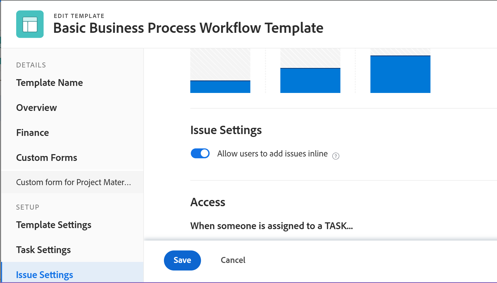
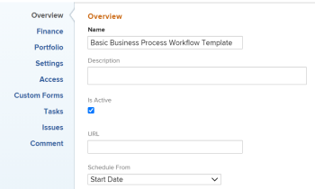

# Projectsjablonen bewerken

<!-- Audited: 7/2025 -->

<!--The Resource Pools part also duplicates in the "Working with Resource Pools" article-->

<!--

 

The highlighted information on this page refers to functionality not yet generally available. It is available only in the Preview environment for all customers. The same features will also be available in the Production environment for all customers after a week from the Preview release.      

For more information, see [Interface modernization](/help/quicksilver/product-announcements/product-releases/interface-modernization/interface-modernization.md).  

 

-->

U kunt projectmalplaatjes uitgeven om op veranderingen in de processen en de montages van toekomstige projecten te wijzen.

Nadat u de veranderingen op een malplaatje bijwerkt en bewaart, zijn de nieuwe veranderingen zichtbaar in nieuwe projecten wanneer de projecten gebruikend het malplaatje worden gecreeerd.

De wijzigingen die u aanbrengt in de sjabloon, zijn niet van toepassing op projecten die momenteel gebruikmaken van die sjabloon.

U kunt één sjabloon tegelijk bewerken of sjablonen bulksgewijs bewerken.

## Toegangsvereisten

+++ Vouw uit om de vereisten voor toegang weer te geven.

<table style="table-layout:auto"> 
 <col> 
 <col> 
 <tbody> 
  <tr> 
   <td role="rowheader">Adobe Workfront-pakket</td> 
   <td> 
Alle
 </td> 
  </tr> 
  <tr> 
   <td role="rowheader">Adobe Workfront-licenties</td> 
   <td>
      
Standard

      
Plan

   </td> 
  </tr> 
  <tr> 
   <td role="rowheader">Configuraties op toegangsniveau</td> 
   <td> 
Toegang tot sjablonen bewerken
 </td> 
  </tr> 
  <tr> 
   <td role="rowheader">Objectmachtigingen</td> 
   <td> 
    
Contribute-machtigingen voor een sjabloon om deze te bewerken op het tabblad Sjabloondetails
 
     
Rechten voor een sjabloon beheren om deze te bewerken in het vak Sjabloon bewerken

   </td> 
  </tr> 
 </tbody> 
</table>

*For meer detail over de informatie in deze lijst, zie [&#x200B; vereisten van de Toegang in de documentatie van Workfront &#x200B;](/help/quicksilver/administration-and-setup/add-users/access-levels-and-object-permissions/access-level-requirements-in-documentation.md).

+++

<!--Old:

<table style="table-layout:auto"> 
 <col> 
 <col> 
 <tbody> 
  <tr> 
   <td role="rowheader">Adobe Workfront plan</td> 
   <td> 
Any 
 </td> 
  </tr> 
  <tr> 
   <td role="rowheader">Adobe Workfront licenses*</td> 
   <td>
      
New: Standard

      
Or

      
Current: Plan

   </td> 
  </tr> 
  <tr> 
   <td role="rowheader">Access level</td> 
   <td> 
Edit access to Templates
 </td> 
  </tr> 
  <tr> 
   <td role="rowheader">Object permissions</td> 
   <td> 
    <ul> 
     <li> 
Contribute permissions to a template to edit it in the Template Details tab
 </li> 
     <li> 
Manage permissions to a template to edit it in the Edit Template box
 </li> 
   </td> 
  </tr> 
 </tbody> 
</table>-->

## Een sjabloon bewerken {#edit-a-template}

1. Ga naar de sjabloon die u wilt bewerken.
1. (Voorwaardelijk) om beperkte informatie over het malplaatje uit te geven, klik **Details van het Malplaatje** in het linkerpaneel, dan ga naar de gebieden die in het linkerpaneel worden vermeld om informatie voor elk gebied uit te geven.
1. Om informatie in de sectie van Details uit te geven, **uitgeef** pictogram , dan uitgezocht van om het even welke hieronder gebieden, of klik **geef allen** uit om informatie op alle gebieden uit te geven:

   * Overzicht
   * Aangepaste Forms

   De namen van douaneformulieren worden alleen weergegeven als er aangepaste formulieren aan het object zijn gekoppeld.

   * Financiën

   >[!TIP]
   >
   >Voor informatie over alle velden die in het gebied Details worden weergegeven, gaat u verder met het bewerken van alle velden in het vak Sjabloon bewerken hieronder.

1. (Voorwaardelijk) om alle informatie over het malplaatje uit te geven, klik **Meer** menu  naast de naam van het malplaatje, dan klik **uitgeven**.

   Het **geeft Malplaatje** vakje uit opent. De secties in dit vakje bevatten de gebieden beschikbaar in de sectie van de Details van het Malplaatje, evenals extra gebieden.

1. U kunt de gegevens in de volgende secties bewerken:

   * [&#x200B; Naam van het Malplaatje &#x200B;](#template-name)
   * [Overzicht](#overview-preview)
   * [&#x200B; Financiën &#x200B;](#finance-preview)
   * [&#x200B; Aangepaste Forms &#x200B;](#custom-forms-preview)
   * [&#x200B; Montages van het Malplaatje &#x200B;](#template-settings)
   * [&#x200B; Montages van Taken &#x200B;](#task-settings)
   * [&#x200B; Montages van de Uitgave &#x200B;](#issue-settings)
   * [&#x200B; Toegang &#x200B;](#access-preview)
   * [Opmerking](#comment)
   <!--* [Linked folders](#linked-folders-conditional-availability) -->

### Sjabloonnaam{#template-name}

1. Je template bewerken zoals hierboven beschreven.
1. In **geef het vakje van het Malplaatje** uit, klik **Naam van het Malplaatje**.
1. De naam van de sjabloon bijwerken of vervangen.
1. (Optioneel) Ga door met het bewerken van de volgende secties, afhankelijk van de gegevens die u wilt wijzigen

   of

   Klik **sparen**.

### Overzicht {#overview-preview}

1. Je template bewerken zoals hierboven beschreven.
1. In **geef Malplaatje** doos uit, klik **Overzicht**.

    uit

1. Werk de volgende velden bij:

   <table style="table-layout:auto"> 
       <col> 
       <col> 
       <tbody> 
         <tr> 
         <td role="rowheader"><strong>Beschrijving</strong></td> 
         <td>Voeg aanvullende informatie over de sjabloon toe.</td> 
       </tr> 
         <tr> 
         <td role="rowheader"><strong>Prioriteit</strong></td> 
         <td>
Dit is enkel een visuele vlag voor u die u toestaat om aan uw toekomstige projecten voorrang te geven. Selecteer een van de volgende opties:
 
         <ul> 
         <li>
<strong>Geen</strong>
</li> 
         <li>
<strong>Laag</strong>
</li> 
         <li>
<strong>Normaal</strong>
</li> 
         <li>
<strong>Hoog</strong>
</li> 
         <li>
<strong>Dringend</strong>
</li> 
         </ul>

Afhankelijk van de projectvoorkeuren die door uw Workfront-beheerder zijn geselecteerd, kunnen de namen van prioriteiten voor u anders zijn. Voor meer informatie over het uitgeven van prioriteiten, zie <a href="../../../administration-and-setup/customize-workfront/creating-custom-status-and-priority-labels/create-customize-priorities.md" class="MCXref xref"> prioriteiten </a> creëren en aanpassen.

</td> 
       </tr> 
       <tr> 
       <td role="rowheader"><strong>URL</strong></td> 
         <td>Geef een webkoppeling op die betrekking heeft op informatie over deze sjabloon.</td> 
       </tr>
   <tr> 
      <td role="rowheader"><strong>Is actief</strong></td> 
      <td>
Schakel deze optie in als u de sjabloon actief wilt maken. Andere gebruikers kunnen dit malplaatje vinden en het aan projecten vastmaken wanneer het creëren van projecten. Schakel deze optie uit als u sjablonen die niet meer worden gebruikt, wilt deactiveren. Gedetactiveerde sjablonen kunnen niet worden gekoppeld aan projecten. Dit is standaard ingeschakeld. 

<b>TIP</b>

   
U kunt een sjabloon deactiveren vanuit de sjabloonkoptekst, zoals beschreven in de sectie Een sjabloon activeren of deactiveren in dit artikel.
</td> 
     </tr>

   <tr> 
   <td role="rowheader"><strong>Type voorwaarde</strong></td> 
      <td>
Selecteer een van de volgende Condition Types:
 
      <ul> 
      <li><strong> Handboek:</strong> de projecteigenaar plaatst manueel de Voorwaarde van het project op het project. <strong></strong></li> 
      <li><strong> Status van de Voortgang:</strong> Workfront plaatst automatisch de Voorwaarde van het toekomstige project dat op de Status van de Voortgang van taken op de Kritieke Weg wordt gebaseerd. Voor meer informatie over het begrip van de Status van de Voortgang, zie <a href="../../../manage-work/tasks/task-information/task-progress-status.md" class="MCXref xref"> Overzicht van de Status van de Voortgang van de Taak </a>.</li> 
      </ul>
      </td> 
      </tr> 
      <tr> 
      <td role="rowheader"><strong>Planningsmodus</strong></td> 
      <td>
Specificeer of het project dat dit malplaatje gebruikt van de <strong> Datum van het Begin </strong>, of van de <strong> Datum van de Voltooiing </strong> wordt gepland. Deze selectie bepaalt de geplande data van de toekomstige taken op het project gebruikend dit malplaatje. 

Selecteer een van de volgende opties: 
 
      <ul> 
      <li>
<strong> Programma van de Datum van het Begin </strong>: De Datum van het Begin van het malplaatje is eigenlijk de Dag van het Begin. Wanneer u een malplaatje van de Datum van het Begin plant, berekent Adobe Workfront de Dag van de Voltooiing van het malplaatje dat op de Duur van alle malplaatjetaken wordt gebaseerd. De Begindag van de sjabloon wordt de geplande begindatum van het toekomstige project.
</li> 
      <li>
<strong> Programma van de Datum van de Voltooiing </strong>: De Datum van de Voltooiing van het malplaatje is eigenlijk de Dag van de Voltooiing. Wanneer u een malplaatje van de Datum van de Voltooiing plant, berekent Workfront de Dag van het Begin van het malplaatje dat op de Duur van alle malplaatjetaken wordt gebaseerd. De Voltooiingsdag van het malplaatje wordt de Geplande VoltooiingsDatum van het toekomstige project. 
</li> 
      </ul>
Voor meer informatie over de Dagen van het Begin en van de Voltooiing van malplaatjetaken, zie <a href="../../../manage-work/projects/create-and-manage-templates/overview-of-start-completion-day-on-template.md" class="MCXref xref"> Overzicht van Begin en Dagen van de Voltooiing in een malplaatje </a>. 

Het Programma van het plaatsen voor malplaatjes is gelijkaardig aan dat van projecten. Uw Workfront-beheerder selecteert het standaardschema bij het instellen voor de projecten in uw systeem. Voor informatie over het plaatsen van projectgebreken, zie <a href="../../../administration-and-setup/set-up-workfront/configure-system-defaults/set-project-preferences.md" class="MCXref xref"> systeem-brede projectvoorkeur </a> vormen.
</td> 
      </tr>

   <tr> 
      <td role="rowheader"><strong>Portfolio</strong></td> 
      <td>
Geef een Portfolio op voor de projecten die op basis van deze sjabloon worden gemaakt. U moet eerst een Portfolio maken voordat deze in de vervolgkeuzelijst wordt weergegeven. 

Alleen actieve portfolio's worden in de lijst weergegeven. Zie <a href="../../../manage-work/portfolios/create-and-manage-portfolios/create-portfolios.md" class="MCXref xref"> Een portfolio maken </a> voor meer informatie over het maken van portfolio's.
</td> 
      </tr> 
      <tr> 
      <td role="rowheader"><strong>Programma</strong></td> 
      <td>
Als u een Portfolio voor het malplaatje selecteerde, specificeer a <strong> Programma </strong> voor het toekomstige project. Niet alle portfolio's hebben een programma. U moet eerst een programma maken voordat het in deze vervolgkeuzelijst wordt weergegeven. Alleen actieve programma's worden in de lijst weergegeven.

Voor meer informatie over het creëren van programma's, zie <a href="../../../manage-work/portfolios/create-and-manage-programs/create-program.md" class="MCXref xref"> een programma </a> creëren.
</td> 
      </tr>  
      <tr data-mc-conditions="QuicksilverOrClassic.Quicksilver"> 
      <td role="rowheader"><strong>Groep</strong></td> 
      <td>
In de drop-down lijst, selecteer de groep die u met projecten wilt worden geassocieerd die van het malplaatje worden gecreeerd. Het kan een groep van om het even welk niveau zijn. 

U kunt ervoor zorgen dat u de juiste groep selecteert door de muisaanwijzer boven de groep te plaatsen en op het informatiepictogram  naast de groep te klikken. Hier wordt knopinfo weergegeven met informatie over de groep, zoals de hiërarchie van de bovenliggende groepen en de bijbehorende beheerders.
 
<b>NOTITIES</b>

   <ul> 
      <li>
In het gebied van Projecten op de pagina van een groep, wanneer iemand tot een project leidt gebruikend een malplaatje dat geen geselecteerde groep heeft, associeert het systeem de momenteel open groep met het project.

Dit is verschillend van andere gebieden waar het systeem de Groep van het Huis van een gebruiker met het project associeert wanneer de gebruiker het project gebruikend een malplaatje leidt dat geen geselecteerde groep heeft.
</li> 
      <li>
Als een gebruiker een malplaatje selecteert dat een geselecteerde groep terwijl het creëren van een project-of terwijl het omzetten van een taak of een kwestie in een project-de gebruiker heeft kan een verschillende groep voor het project kiezen.
</li> 
      <li>Hoewel dit veld alleen beschikbaar is in sjablonen in de nieuwe Adobe Workfront-ervaring, kunt u het veld wel zien in lijsten en rapporten, zowel daar als in Adobe Workfront Classic. </li> 
      </ul> 
</td> 
      </tr> 
      <tr> 
      <td role="rowheader"><strong>Bedrijf</strong></td> 
      <td>
Geef het bedrijf op dat u aan de sjabloon wilt koppelen. Alleen actieve bedrijven worden in de lijst weergegeven.
</td> 
      </tr> 
      <tr> 
      <td role="rowheader"><strong>Sjablooneigenaar</strong></td> 
      <td>
De gebruiker die is aangewezen als de sjablooneigenaar moet een actieve Workfront-gebruiker zijn. 

Overweeg het volgende over de gebruiker die als de Eigenaar van het Malplaatje wordt aangewezen: 
 
      <ul> 
      <li>Ze krijgen automatisch beheermachtigingen voor de sjabloon. </li> 
      <li>Ze worden toegevoegd aan het projectteam en krijgen automatisch beheermachtigingen voor het project dat met de sjabloon is gemaakt. </li> 
      <li>Zij worden de Eigenaar van het Project, wanneer het project van dit malplaatje wordt gecreeerd. </li> 
      <li> Als de gebruiker die als de Eigenaar van het Malplaatje wordt aangewezen toegang tot malplaatjes of projecten van hun toegangsniveau beperkt heeft, zullen hun Manage toestemmingen op het malplaatje en op de projecten worden beperkt. Bijvoorbeeld, als zij slechts de toegang van de Mening voor malplaatjes of projecten in hun toegangsniveau hebben, zullen zij automatisch de toestemmingen van de Mening over het malplaatje en het project ontvangen wanneer zij als Eigenaar van het Malplaatje worden aangewezen.</li>
      </ul></td> 
      </tr> 
      <tr> 
      <td role="rowheader"><strong>Sjabloonsponsor</strong></td> 
      <td>
De gebruiker op dit gebied wordt gespecificeerd wordt de Sponsor van het Project, wanneer het malplaatje aan het project wordt toegevoegd. Deze gebruiker wordt toegevoegd aan het projectteam en automatisch meningstoestemmingen aan het project gegeven. De gebruiker die als Sjabloonsponsor is aangewezen, moet een actieve Workfront-gebruiker zijn. 
</td> 
      </tr> 
      <tr> 
      <td role="rowheader"><strong>Resource Manager</strong></td> 
      <td>
De gespecificeerde gebruikers worden automatisch gegeven beheren toestemmingen aan de toekomstige projecten en kunnen middelen aan de taken en de kwesties van de projecten toewijzen. U kunt meerdere Resource Manager opgeven. 
</td> 
      </tr> 
      </table>

1. (Optioneel) Ga door met het bewerken van de volgende secties, afhankelijk van de gegevens die u wilt wijzigen.

   of

   Klik **sparen**.

### Financiën {#finance-preview}

1. Je template bewerken zoals hierboven beschreven.
1. In **geef Malplaatje** doos uit, klik **Financiën**.

   

1. Werk de volgende velden bij:

   <table style="table-layout:auto"> 
       <col> 
       <col> 
       <tbody> 
         <tr> 
         <td role="rowheader"><strong>Beschrijving</strong></td> 
         <td>Voeg aanvullende informatie over de sjabloon toe.</td> 
       </tr> 
         <tr> 
         <td role="rowheader"><strong>Prioriteit</strong></td> 
         <td>
Dit is enkel een visuele vlag voor u die u toestaat om aan uw toekomstige projecten voorrang te geven. Selecteer een van de volgende opties:
 
         <ul> 
         <li>
<strong>Geen</strong>
</li> 
         <li>
<strong>Laag</strong>
</li> 
         <li>
<strong>Normaal</strong>
</li> 
         <li>
<strong>Hoog</strong>
</li> 
         <li>
<strong>Dringend</strong>
</li> 
         </ul>

Afhankelijk van de projectvoorkeuren die door uw Workfront-beheerder zijn geselecteerd, kunnen de namen van prioriteiten voor u anders zijn. Voor meer informatie over het uitgeven van prioriteiten, zie <a href="../../../administration-and-setup/customize-workfront/creating-custom-status-and-priority-labels/create-customize-priorities.md" class="MCXref xref"> prioriteiten </a> creëren en aanpassen.

</td> 
       </tr> 
       <tr> 
       <td role="rowheader"><strong>URL</strong></td> 
         <td>Geef een webkoppeling op die betrekking heeft op informatie over deze sjabloon.</td> 
       </tr>
      <tr> 
      <td role="rowheader"><strong>Is actief</strong></td> 
      <td>
Schakel deze optie in als u de sjabloon actief wilt maken. Andere gebruikers kunnen dit malplaatje vinden en het aan projecten vastmaken wanneer het creëren van projecten. Schakel deze optie uit als u sjablonen die niet meer worden gebruikt, wilt deactiveren. Gedetactiveerde sjablonen kunnen niet worden gekoppeld aan projecten. Dit is standaard ingeschakeld. 

<b>TIP</b>

   
U kunt een sjabloon deactiveren vanuit de sjabloonkoptekst, zoals beschreven in de sectie Een sjabloon activeren of deactiveren in dit artikel.
</td> 
     </tr>

   <tr> 
      <td role="rowheader"><strong>Type voorwaarde</strong></td> 
      <td>
Selecteer een van de volgende Condition Types:
 
      <ul> 
      <li><strong> Handboek:</strong> de projecteigenaar plaatst manueel de Voorwaarde van het project op het project. <strong></strong></li> 
      <li><strong> Status van de Voortgang:</strong> Workfront plaatst automatisch de Voorwaarde van het toekomstige project dat op de Status van de Voortgang van taken op de Kritieke Weg wordt gebaseerd. Voor meer informatie over het begrip van de Status van de Voortgang, zie <a href="../../../manage-work/tasks/task-information/task-progress-status.md" class="MCXref xref"> Overzicht van de Status van de Voortgang van de Taak </a>.</li> 
      </ul>
      </td> 
      </tr> 
      <tr> 
      <td role="rowheader"><strong>Planningsmodus</strong></td> 
      <td>
Specificeer of het project dat dit malplaatje gebruikt van de <strong> Datum van het Begin </strong>, of van de <strong> Datum van de Voltooiing </strong> wordt gepland. Deze selectie bepaalt de geplande data van de toekomstige taken op het project gebruikend dit malplaatje. 

Selecteer een van de volgende opties: 
 
      <ul> 
      <li>
<strong> Programma van de Datum van het Begin </strong>: De Datum van het Begin van het malplaatje is eigenlijk de Dag van het Begin. Wanneer u een malplaatje van de Datum van het Begin plant, berekent Adobe Workfront de Dag van de Voltooiing van het malplaatje dat op de Duur van alle malplaatjetaken wordt gebaseerd. De Begindag van de sjabloon wordt de geplande begindatum van het toekomstige project.
</li> 
      <li>
<strong> Programma van de Datum van de Voltooiing </strong>: De Datum van de Voltooiing van het malplaatje is eigenlijk de Dag van de Voltooiing. Wanneer u een malplaatje van de Datum van de Voltooiing plant, berekent Workfront de Dag van het Begin van het malplaatje dat op de Duur van alle malplaatjetaken wordt gebaseerd. De Voltooiingsdag van het malplaatje wordt de Geplande VoltooiingsDatum van het toekomstige project. 
</li> 
      </ul>
Voor meer informatie over de Dagen van het Begin en van de Voltooiing van malplaatjetaken, zie <a href="../../../manage-work/projects/create-and-manage-templates/overview-of-start-completion-day-on-template.md" class="MCXref xref"> Overzicht van Begin en Dagen van de Voltooiing in een malplaatje </a>. 

Het Programma van het plaatsen voor malplaatjes is gelijkaardig aan dat van projecten. Uw Workfront-beheerder selecteert het standaardschema bij het instellen voor de projecten in uw systeem. Voor informatie over het plaatsen van projectgebreken, zie <a href="../../../administration-and-setup/set-up-workfront/configure-system-defaults/set-project-preferences.md" class="MCXref xref"> systeem-brede projectvoorkeur </a> vormen.
</td> 
      </tr>

   <tr> 
      <td role="rowheader"><strong>Portfolio</strong></td> 
      <td>
Geef een Portfolio op voor de projecten die op basis van deze sjabloon worden gemaakt. U moet eerst een Portfolio maken voordat deze in de vervolgkeuzelijst wordt weergegeven. 

Alleen actieve portfolio's worden in de lijst weergegeven. Zie <a href="../../../manage-work/portfolios/create-and-manage-portfolios/create-portfolios.md" class="MCXref xref"> Een portfolio maken </a> voor meer informatie over het maken van portfolio's.
</td> 
      </tr> 
      <tr> 
      <td role="rowheader"><strong>Programma</strong></td> 
      <td>
Als u een Portfolio voor het malplaatje selecteerde, specificeer a <strong> Programma </strong> voor het toekomstige project. Niet alle portfolio's hebben een programma. U moet eerst een programma maken voordat het in deze vervolgkeuzelijst wordt weergegeven. Alleen actieve programma's worden in de lijst weergegeven.

Voor meer informatie over het creëren van programma's, zie <a href="../../../manage-work/portfolios/create-and-manage-programs/create-program.md" class="MCXref xref"> een programma </a> creëren.
</td> 
      </tr>  
      <tr data-mc-conditions="QuicksilverOrClassic.Quicksilver"> 
      <td role="rowheader"><strong>Groep</strong></td> 
      <td>
In de drop-down lijst, selecteer de groep die u met projecten wilt worden geassocieerd die van het malplaatje worden gecreeerd. Het kan een groep van om het even welk niveau zijn. 

U kunt ervoor zorgen dat u de juiste groep selecteert door de muisaanwijzer boven de groep te plaatsen en op het informatiepictogram  naast de groep te klikken. Hier wordt knopinfo weergegeven met informatie over de groep, zoals de hiërarchie van de bovenliggende groepen en de bijbehorende beheerders.
 
<b>NOTITIES</b>

   <ul> 
      <li>
In het gebied van Projecten op de pagina van een groep, wanneer iemand tot een project leidt gebruikend een malplaatje dat geen geselecteerde groep heeft, associeert het systeem de momenteel open groep met het project.

Dit is verschillend van andere gebieden waar het systeem de Groep van het Huis van een gebruiker met het project associeert wanneer de gebruiker het project gebruikend een malplaatje leidt dat geen geselecteerde groep heeft.
</li> 
      <li>
Als een gebruiker een malplaatje selecteert dat een geselecteerde groep terwijl het creëren van een project-of terwijl het omzetten van een taak of een kwestie in een project-de gebruiker heeft kan een verschillende groep voor het project kiezen.
</li> 
      <li>Hoewel dit veld alleen beschikbaar is in sjablonen in de nieuwe Adobe Workfront-ervaring, kunt u het veld wel zien in lijsten en rapporten, zowel daar als in Adobe Workfront Classic. </li> 
      </ul> 
</td> 
      </tr> 
      <tr> 
      <td role="rowheader"><strong>Bedrijf</strong></td> 
      <td>
Geef het bedrijf op dat u aan de sjabloon wilt koppelen. Alleen actieve bedrijven worden in de lijst weergegeven.
</td> 
      </tr> 
      <tr> 
      <td role="rowheader"><strong>Sjablooneigenaar</strong></td> 
      <td>
De gebruiker die is aangewezen als de sjablooneigenaar moet een actieve Workfront-gebruiker zijn. 

Overweeg het volgende over de gebruiker die als de Eigenaar van het Malplaatje wordt aangewezen: 
 
      <ul> 
      <li>Ze krijgen automatisch beheermachtigingen voor de sjabloon. </li> 
      <li>Ze worden toegevoegd aan het projectteam en krijgen automatisch beheermachtigingen voor het project dat met de sjabloon is gemaakt. </li> 
      <li>Zij worden de Eigenaar van het Project, wanneer het project van dit malplaatje wordt gecreeerd. </li> 
      <li> Als de gebruiker die als de Eigenaar van het Malplaatje wordt aangewezen toegang tot malplaatjes of projecten van hun toegangsniveau beperkt heeft, zullen hun Manage toestemmingen op het malplaatje en op de projecten worden beperkt. Bijvoorbeeld, als zij slechts de toegang van de Mening voor malplaatjes of projecten in hun toegangsniveau hebben, zullen zij automatisch de toestemmingen van de Mening over het malplaatje en het project ontvangen wanneer zij als Eigenaar van het Malplaatje worden aangewezen.</li>
      </ul></td> 
      </tr> 
      <tr> 
      <td role="rowheader"><strong>Sjabloonsponsor</strong></td> 
      <td>
De gebruiker op dit gebied wordt gespecificeerd wordt de Sponsor van het Project, wanneer het malplaatje aan het project wordt toegevoegd. Deze gebruiker wordt toegevoegd aan het projectteam en automatisch meningstoestemmingen aan het project gegeven. De gebruiker die als Sjabloonsponsor is aangewezen, moet een actieve Workfront-gebruiker zijn. 
</td> 
      </tr> 
      <tr> 
      <td role="rowheader"><strong>Resource Manager</strong></td> 
      <td>
De gespecificeerde gebruikers worden automatisch gegeven beheren toestemmingen aan de toekomstige projecten en kunnen middelen aan de taken en de kwesties van de projecten toewijzen. U kunt meerdere Resource Manager opgeven. 
</td> 
      </tr> 
      </table>

1. (Optioneel) Ga door met het bewerken van de volgende secties, afhankelijk van de gegevens die u wilt wijzigen.

   of

   Klik **sparen**.

### Aangepaste Forms {#custom-forms-preview}

1. Je template bewerken zoals hierboven beschreven.
1. In **geef Malplaatje** doos uit, klik **Douane Forms**.

   

   De namen van de aangepaste formulieren die al aan de sjabloon zijn gekoppeld, worden in het linkerdeelvenster weergegeven.

1. Klik binnen **voeg douaneformulier** gebied toe en selecteer de douanevorm of de vormen die u met het malplaatje wilt associëren. U moet aangepaste formulieren maken voordat u ze in dit veld kunt selecteren.

   Alleen actieve aangepaste formulieren worden in de lijst weergegeven. Voor meer informatie over de bouw van douaneformulieren, zie [&#x200B; een douaneformulier &#x200B;](/help/quicksilver/administration-and-setup/customize-workfront/create-manage-custom-forms/form-designer/design-a-form/design-a-form.md) creëren.

   U kunt maximaal tien aangepaste formulieren aan een sjabloon toevoegen.

   De formulieren worden toegevoegd aan het project dat op basis van deze sjabloon is gemaakt.

1. (Optioneel) Werk informatie bij in een van de velden op de aangepaste formulieren. De informatie zal naar de projecten overbrengen die van het malplaatje zullen worden gecreeerd.

1. (Facultatief) klik het **x** pictogram rechts van een naam van de douanevorm, dan **verwijderen** om het uit het malplaatje te verwijderen.

1. (Optioneel) Ga door met het bewerken van de volgende sectie, afhankelijk van de informatie die u wilt wijzigen.

   of

   Klik **sparen**.

### Sjablooninstellingen {#template-settings}

1. Je template bewerken zoals hierboven beschreven.
1. In **geef Malplaatje** doos uit, klik **de Montages van het Project**.

   

1. Werk de volgende velden bij:

   <table style="table-layout:auto"> 
       <col> 
       <col> 
       <tbody> 
       <tr> 
       <td role="rowheader"><strong> Mijlpaal Weg </strong> </td> 
       <td> 
Selecteer een milestone-pad voor de sjabloon. Alleen actieve milestone-paden worden in de lijst weergegeven.  voor meer informatie over de Wegen van de Mijlsteen, zie <a href="../../../administration-and-setup/customize-workfront/configure-approval-milestone-processes/create-milestone-path.md" class="MCXref xref"> een milestone weg </a> creëren.
 </td> 
       </tr> 
       <tr> 
       <td role="rowheader"><strong> Wijze van de Voltooiing </strong> </td> 
       <td> 
Bepaalt hoe het toekomstige project wordt gemarkeerd als Voltooid.   Uitgezocht van de volgende opties:
 
       <ul> 
       <li> 
<strong> Automatisch </strong>: Het project is duidelijk Volledig wanneer alle taken en kwesties worden voltooid.
 </li> 
       <li> 
<strong> Hand </strong>: U moet de Volledige status voor het project manueel selecteren, wanneer alle taken en kwesties worden voltooid. 
 </li> 
       </ul> </td> 
       </tr> 
       <tr> 
       <td role="rowheader"><strong> Samenvattende Wijze van de Voltooiing </strong> </td> 
       <td> 
Controls how the parent tasks on the future project are marked as Complete.   Uitgezocht van de volgende opties:
 
       <ul> 
       <li> 
<strong> Automatisch </strong>: De oudertaken zijn duidelijk Voltooid en zij werken automatisch hun percentage bij volledig, aangezien de kindtaken worden voltooid en het percentage volledig van de kinderen wordt bijgewerkt. 
 </li> 
       <li> 
<strong> Hand </strong>: U moet het percentage manueel bijwerken volledig en het statuut van de oudertaken, onafhankelijk van welke veranderingen aan de kindtaken worden aangebracht. 
 </li> 
       </ul> </td> 
       </tr> 
       <tr> 
       <td role="rowheader"><strong> Type van Update </strong> </td> 
       <td> 
Controles wanneer de veranderingen u aan de chronologie van het toekomstige project aanbrengt op het project worden bewaard. 
 
       <b> VOORBEELD </b> 
       
De volgende wijzigingen in het project activeren een update van de tijdlijn van het project:
 
       <ul> 
       <li> 
de takendata bijwerken
 </li> 
       <li> 
vorige relaties wijzigen 
 </li> 
       <li> 
bovenliggend-onderliggende relaties wijzigen
 </li> 
       <li> 
U kunt niet alleen taken toevoegen of verwijderen, maar ook het type taakbeperking of duur wijzigen.
 </li> 
       </ul> 
       
 
Selecteer een van de volgende opties: 
 
       <ul> 
       <li> 
<strong> Automatisch en op Verandering </strong> (Gebrek die) plaatst: De toekomstige projectchronologie wordt bijgewerkt telkens als een verandering in het project of in een ander project voorkomt dat de chronologie van (op Verandering) afhankelijk is. De projecttijdlijn wordt ook elke avond bijgewerkt (automatisch).  dit is het geadviseerde plaatsen voor dit gebied omdat het ervoor zorgt dat de projectchronologie altijd bijgewerkt is.  wanneer u een actie op een taak of een project uitvoert die een chronologieherberekening teweegbrengt, worden alle beschikbare data onmiddellijk getoond, toestaand u blijven werkend. Voor projecten met meer dan 100 taken worden datums die langere herberekeningen vereisen kort weergegeven als een vraagteken (tussen 1 en 5 seconden, of tot een minuut voor grote projecten). Dit geeft aan dat de herberekening nog niet is voltooid en dat de datums kunnen worden gewijzigd. 
 </li> 
       </ul> 
       <ul> 
       <li> 
<strong> Verandering slechts </strong>: De projectchronologie wordt bijgewerkt telkens als een verandering in het project of in een ander project voorkomt dat de chronologie van afhankelijk is. U zou deze optie kunnen willen selecteren als de veranderingen zelden in het project of in andere projecten voorkomen dat de chronologie van afhankelijk is. 
 </li> 
       </ul> 
       <ul> 
       <li> 
<strong> Automatisch slechts </strong>: De projectchronologie wordt bijgewerkt elke nacht; het wordt niet onmiddellijk bijgewerkt nadat de veranderingen worden aangebracht.  u zou deze optie kunnen willen selecteren als vele veranderingen elke dag in het project of in andere projecten voorkomen dat de chronologie van afhankelijk is. Houd er echter rekening mee dat u deze instelling hebt gekozen, aangezien het project niet tegelijk met de wijzigingen wordt bijgewerkt. 
 </li> 
       </ul> 
       <ul> 
       <li> 
<strong> Hand slechts </strong>: De projectchronologie wordt bijgewerkt slechts wanneer u de optie selecteert om Chronologie opnieuw te berekenen, zoals die in <a href="../../../manage-work/projects/manage-projects/recalculate-project-timeline.md" class="MCXref xref"> wordt beschreven projectchronologie </a> opnieuw berekenen. 
 </li> 
       </ul> 
U kunt deze optie selecteren als u in één keer veel wijzigingen aanbrengt in het project en u wilt dat de tijdlijnherberekening plaatsvindt nadat alle wijzigingen zijn aangebracht (in plaats van na elke afzonderlijke wijziging).
 </td> 
       </tr> 
       <tr> 
       <td role="rowheader"><strong> Programma </strong> </td> 
       <td> 
Selecteer een schema voor uw sjabloon. Dit zal het programma van het project worden dat van dit malplaatje wordt gecreeerd. Dit zou het zelfde programma moeten zijn dat aan de meeste mensen wordt toegewezen die aan het project werken. U moet een schema creëren alvorens u het aan een malplaatje kunt toewijzen.  voor meer informatie over het creëren van programma's, zie <a href="../../../administration-and-setup/set-up-workfront/configure-timesheets-schedules/create-schedules.md" class="MCXref xref"> een programma </a> creëren.   als u geen douaneschema's in uw systeem hebt gecreeerd, wordt het StandaardProgramma geselecteerd. 
 </td> 
       </tr> 
       <tr> 
       <td role="rowheader"><strong> Tijd van de Gebruiker weg </strong> </td> 
       <td> 
Bepaalt of de tijd van de Primaire Ontvanger van een taak de taak geplande data aanpast. Wanneer u het malplaatje aan een bestaand project vastmaakt, en het malplaatje heeft een verschillend het plaatsen voor dit gebied dan het project, blijft het plaatsen op het project onveranderd. De standaardoptie voor dit het plaatsen voor een nieuw malplaatje is het zelfde als de systeem-vlakke projectvoorkeur. 
 
Voor informatie over de projectvoorkeur op het niveau van het Systeem, zie <a href="../../../administration-and-setup/set-up-workfront/configure-system-defaults/set-project-preferences.md" class="MCXref xref"> systeem-brede projectvoorkeur </a> vormen. 
 
Voor informatie over hoe dit het plaatsen de taakdata op een project beïnvloedt, zie <a href="../../../manage-work/projects/manage-projects/edit-projects.md" class="MCXref xref"> projecten </a> uitgeven.  Uitgezocht van de volgende opties: 
 
       <ul> 
       <li> 
<strong> Overweeg gebruikerstijd van taakduur </strong>: Wanneer het selecteren van deze optie, passen de geplande die data van de taken op het project van dit malplaatje worden gecreeerd volgens de tijd van de Primaire Ontvanger van de taak aan, als de tijd van weg tijdens de duur van de taak voorkomt. 
 </li> 
       <li> 
<strong> negeert gebruikerstijd van taakduur </strong>: Wanneer het selecteren van deze optie, blijven de geplande die data van de taken op het project van dit malplaatje worden gecreeerd zoals oorspronkelijk gepland, zelfs als de Primaire Ontvanger van de taak tijd weg tijdens de duur van de taak heeft. 
 </li> 
       </ul> </td> 
       </tr> 
       <tr> 
       <td role="rowheader"><strong> Wijze van het Niveaus van het Middel </strong> </td> 
       <td> 
Selecteer een van de volgende opties: 
 
       <ul> 
       <li> 
<strong> Handboek </strong>: u moet uw middelen op het project manueel niveau dat van dit malplaatje wordt gecreeerd (dit is het gebrek dat plaatst)
 </li> 
       <li> 
<strong> Automatisch:</strong> Workfront niveaus de middelen op het toekomstige project.   voor meer informatie over het Levelen van het Middel, zie <a href="../../../manage-work/gantt-chart/use-the-gantt-chart/level-resources-in-gantt.md" class="MCXref xref"> Middelen van het Niveau in de Grafiek van Gantt </a>. 
 </li> 
       </ul> </td> 
       </tr> 
       <tr> 
       <td role="rowheader"><strong> Risico </strong> </td> 
       <td> 
Bepaal het risiconiveau van de projecten die van dit malplaatje worden gecreeerd. Het risico is slechts een indicator van hoe riskant een project kan zijn. U kunt de uitvoering van uw projecten prioriteren op basis van het risiconiveau.  overweegt het selecteren van de volgende niveaus van risico: 
 
       <ul> 
       <li> 
<strong> zeer Laag </strong> 
 </li> 
       <li> 
<strong> Laag </strong> 
 </li> 
       <li> 
<strong> Medium </strong> 
 </li> 
       <li> 
<strong> Hoog </strong> 
 </li> 
       <li> 
<strong> zeer Hoog </strong> 
 </li> 
       </ul> </td> 
       </tr> 
       <tr> 
       <td role="rowheader"><strong> Pools van het Middel </strong> </td> 
       <td> 
Geef de bronnenpools op die aan de sjabloon zijn gekoppeld. De pools van het middel zijn inzamelingen van gebruikers die tezelfdertijd voor de voltooiing van een project nodig zijn. Zie <a href="../../../resource-mgmt/resource-planning/resource-pools/work-with-resource-pools.md" class="MCXref xref"> Overzicht van bronnenpools </a> voor meer informatie over bronnenpools.
 
 
<b>OPMERKING</b>

        wanneer u malplaatjes in massa uitgeeft, slechts verschijnen de middelgroepen die voor alle geselecteerde malplaatjes gemeenschappelijk zijn op dit gebied. Als de geselecteerde sjablonen geen gedeelde bronnenpools hebben, is dit veld leeg. De middelpools u hier specificeert zullen de individuele middelpools van malplaatjes beschrijven.&lt;/p> &lt;/p> &lt;/td>
       &lt;/tr> 
   
   <tr> 
      <td role="rowheader"><strong>Voor dit project goed te keuren tijd vereisen</strong></td>

   <td>
Selecteer deze optie om de toekomstige Eigenaar van het Project van het project te vereisen dat van dit malplaatje wordt gecreeerd tijd goed te keuren het programma wordt geopend het project.
 
      
Als u de Verslagen van de Facturering gebruikt en u deze optie selecteert, slechts verschijnen de goedgekeurde uren op het project als beschikbare factureerbare uren voor de Verslagen van de Facturering. 

      
De goedkeuring van de tijd voor het project staat los van de goedkeuring van tijdbladen. Voor meer informatie over het vereisen van tijd om op een project worden goedgekeurd, zie <a href="../../../manage-work/projects/manage-projects/require-time-approval-for-projects.md" class="MCXref xref"> tijd vereisen om voor een project </a> worden goedgekeurd.

      </td> 
      </tr> 
      <tr> 
      <td role="rowheader"><strong> het urentype van de Filter </strong> </td> 
      <td> 
Overweeg het volgende:
 
Selecteer <strong> Nr </strong> om alle project-specifieke uurtypes van het toekomstige project ter beschikking te stellen. (Dit is de standaardselectie)
 
of
 
Selecteer <strong> ja </strong> om slechts een ondergroep van de project-specifieke uurtypes beschikbaar op het toekomstige project te maken, dan de uurtypes te selecteren u beschikbaar wilt maken. (Houd Shift ingedrukt als u meerdere uurtypen wilt selecteren.)
 
Als u deze optie selecteert, worden alleen de uurstypen die u selecteert, beschikbaar gemaakt om te selecteren wanneer u zich aanmeldt in uren voor het project (of voor taken en problemen binnen het project). U moet minstens één uurtype selecteren; als u deze optie selecteert en u geen uurtypes selecteert, worden alle uurtypes ter beschikking gesteld op het project.
 
De selectie van het type van zelfde uur moet op het individuele gebruikersniveau worden gemaakt opdat de gebruiker deze uurtypeopties op het project ziet. 
 
Voor meer informatie over het bepalen van uurtypes op het gebruikersniveau, zie de tijd van het sectie <a href="../../../timesheets/create-and-manage-timesheets/log-time.md#understa" class="MCXref xref"> Logboek </a> in <a href="../../../timesheets/create-and-manage-timesheets/log-time.md" class="MCXref xref"> tijd van het Logboek </a>.
 </td> 
      </tr> 
      <tr> 
      <td role="rowheader"><strong> Bericht van de Herinnering </strong> </td> 
      <td>Selecteer de Herinneringsmelding die aan het toekomstige project moet worden gekoppeld. U moet de Berichten van de Herinnering voor projecten voor dit gebied vormen om tijdens het uitgeven van een malplaatje te verschijnen.   voor meer informatie over het vormen van de Meldingen van de Herinnering, zie <a href="../../../administration-and-setup/manage-workfront/emails/set-up-reminder-notifications.md" class="MCXref xref"> de herinneringen van de Opstelling </a>.</td> 
      </tr>
      <tr> 
      <td role="rowheader"><strong> proces van de Goedkeuring </strong> </td> 
      <td> 
Selecteer het goedkeuringsproces u met het malplaatje wilt associëren. Uw beheerder van Workfront of een gebruiker met administratieve toegang tot de Processen van de Goedkeuring moet systeem-niveau of groep-vlakke processen van de projectgoedkeuring bepalen alvorens u hen met een malplaatje kunt associëren. Voor meer informatie over het creëren van goedkeuringsprocessen, zie <a href="../../../administration-and-setup/customize-workfront/configure-approval-milestone-processes/create-approval-processes.md" class="MCXref xref"> een goedkeuringsproces voor het werkpunten </a> creëren.
 
Houd rekening met het volgende wanneer u goedkeuringsprocessen toevoegt: 
 
      <ul> 
      <li>Alleen actieve goedkeuringsprocessen worden in de lijst weergegeven. </li> 
      <li> 
Systeemspecifieke en groepsspecifieke goedkeuringsprocessen worden in de lijst weergegeven. Een goedkeuringsproces verbonden aan een groep buiten die van het malplaatje wordt niet getoond in de lijst.
 
<b>BELANGRIJK</b>

   Als de groep die aan de sjabloon is gekoppeld, verandert het groepsspecifieke goedkeuringsproces in een goedkeuringsproces voor eenmalig gebruik. Voor meer informatie over hoe de veranderingen in de groep van het project of de veranderingen in het goedkeuringsproces goedkeuringsmontages beïnvloeden, zie <a href="../../../administration-and-setup/customize-workfront/configure-approval-milestone-processes/how-changes-affect-group-approvals.md"> hoe de groep en de veranderingen van het goedkeuringsproces aangewezen goedkeuringsprocessen </a> beïnvloeden. 
 </li>
   <li> 
Als u een goedkeuringsproces voor eenmalig gebruik hebt toegevoegd, wordt dit in dit veld weergegeven als "Aangepast". Voor informatie, zie <a href="../../../review-and-approve-work/manage-approvals/associate-approval-with-work.md" class="MCXref xref"> een nieuw of bestaand goedkeuringsproces met het werk </a> associëren. 
 
      </li> 
      <li> 
Bij sjablonen voor bulkbewerking bestaan de volgende scenario's:
 
      <ul> 
         <li> 
Wanneer u sjablonen selecteert uit dezelfde groep, worden zowel op systeemniveau als op groepsniveau goedkeuringsprocessen weergegeven in dit veld.
 </li> 
         <li> 
Wanneer u sjablonen selecteert uit verschillende groepen, worden alleen goedkeuringsprocessen op systeemniveau weergegeven in dit veld.
 </li> 
         <li> 
Als voor een van de sjablonen een goedkeuringsproces voor één gebruik is gekoppeld, wordt dit vervangen door het systeemniveau dat u selecteert. 
 </li> 
      </ul> </li> 
      </ul> </td> 
       </tr>  
       </tbody> 
      </table>

1. (Optioneel) Ga door met het bewerken van de volgende secties, afhankelijk van de gegevens die u wilt wijzigen.\
   of
1. Klik **sparen**.

### Taakinstellingen {#task-settings}

U kunt de gebreken bepalen die met alle nieuwe taken zullen worden geassocieerd wanneer u hen aan een project toevoegt dat van het malplaatje wordt gecreeerd.

Voor informatie over hoe deze montages het creëren van nieuwe taken beïnvloeden, zie [&#x200B; takenoverzicht &#x200B;](../../../manage-work/tasks/create-tasks/create-tasks-overview.md) creëren.

1. Je template bewerken zoals hierboven beschreven.
1. In **geef Malplaatje** doos uit, klik **de Montages van de Taak**.

   

1. In het **vakje van het Proces van de Goedkeuring Standaard van de Taak 0&rbrace;, selecteer het Proces van de Goedkeuring u met alle nieuwe taken wilt associëren wanneer u hen aan een project toevoegt dat van dit malplaatje wordt gecreeerd.** U moet een goedkeuringsproces voor taken creëren alvorens u het met taken kunt associëren. Alleen actieve goedkeuringsprocessen worden in de lijst weergegeven. Voor meer informatie over het creëren van de Processen van de Goedkeuring, zie [&#x200B; Creërend de Processen van de Goedkeuring &#x200B;](../../../administration-and-setup/customize-workfront/configure-approval-milestone-processes/create-approval-processes.md).
1. In het **vakje van de Aangepaste Forms van de Taak Standaard**, selecteer de douanevorm of de vormen die u met alle nieuwe taken wilt associëren wanneer u hen aan een project toevoegt dat van dit malplaatje wordt gecreeerd. U moet aangepaste formulieren maken voordat u ze in dit veld kunt selecteren. Alleen actieve aangepaste formulieren worden in de lijst weergegeven. Voor meer informatie over de bouw van douaneformulieren, zie [&#x200B; een douaneformulier &#x200B;](/help/quicksilver/administration-and-setup/customize-workfront/create-manage-custom-forms/form-designer/design-a-form/design-a-form.md) creëren. U kunt maximaal tien aangepaste formulieren aan een taak koppelen.
1. (Optioneel) Selecteer **Werkinspanning van het Gebruik om taak Geplande Uren** automatisch te berekenen als u het beheren van taakinspanning wilt toelaten door de Werkinspanning in plaats van Geplande Uren in het project te gebruiken dat van het malplaatje wordt gecreeerd.
1. (Voorwaardelijk en optioneel) Als u Werkinspanning gebruiken hebt geselecteerd om taken Geplande uren automatisch te berekenen, klikt u op het vervolgkeuzemenu om het percentage voor elk niveau van de Werkinspanning bij te werken. De volgende percentagewaarden zijn de standaardwaarden:

   | Werkinspanningsniveau | Waarde percentage |
   |---|---|
   | Klein | 25% |
   | Medium | 50% |
   | Groot | 75% |

   Voor informatie over het gebruiken van de Werkinspanning om de inspanning op taken op projecten te beheren, zie [&#x200B; Overzicht van de Werkinspanning van het Werk &#x200B;](../../../manage-work/tasks/task-information/work-effort.md).

1. (Optioneel) Ga door met het bewerken van de volgende sectie, afhankelijk van de informatie die u wilt wijzigen.

   of

   Klik **sparen**.

### Instellingen van uitgave {#issue-settings}

Door publicatie-instellingen te bewerken, kunt u voorkomen dat gebruikers inline uitgaven toevoegen in het toekomstige project dat met de sjabloon wordt gemaakt.

1. Je template bewerken zoals hierboven beschreven.
1. In **geef Malplaatje** doos uit, klik **de Montages van de Uitgave**.

   

1. (Facultatief) schrap **staat gebruikers toe om kwesties binnen** optie toe te voegen. Deze optie is standaard ingeschakeld.

   Wanneer het onbruikbaar maken van deze optie kunnen de gebruikers geen kwesties inline aan het project of de taken in de sectie van Kwesties toevoegen, wanneer het project van het malplaatje wordt gecreeerd.

   >[!TIP]
   >
   >Schakel deze optie uit als u wilt dat gebruikers de velden Nieuw probleem of de aangepaste formulieren voor nieuwe uitgaven invullen.

   Wanneer het onbruikbaar maken van deze optie, kunnen de gebruikers met toestemmingen om kwesties aan het project toe te voegen dat van het malplaatje wordt gecreeerd dit doen door de Nieuwe knoop van de Uitgave of een verzoekrij te gebruiken verbonden aan het project.

   Voor meer informatie over het vormen van uitgeven montages op projecten, zie de [&#x200B; sectie van de Montages van de Uitgave &#x200B;](../../../manage-work/projects/manage-projects/edit-projects.md#issue) in artikel [&#x200B; projecten &#x200B;](../../../manage-work/projects/manage-projects/edit-projects.md) uitgeven.

   Voor informatie over het creëren van kwesties op projecten, zie [&#x200B; kwesties &#x200B;](../../../manage-work/issues/manage-issues/create-issues.md) creëren.

1. (Optioneel) Ga door met het bewerken van de volgende sectie, afhankelijk van de informatie die u wilt wijzigen.

   of

   Klik **sparen**.

### Toegang {#access-preview}

1. Je template bewerken zoals hierboven beschreven.
1. In **geef Malplaatje** doos uit, klik **Toegang**.

   

   De toegang u voor uw malplaatje specificeert zal de Toegang van gebruikers verbonden aan het project worden wanneer het malplaatje wordt gebruikt om een project tot stand te brengen.

   Specificeer de volgende **informatie van de Toegang** voor het malplaatje:

   <table style="table-layout:auto"> 
       <col> 
       <col> 
       <tbody> 
       <tr> 
         <td role="rowheader"><strong> wanneer iemand aan een taak </strong> wordt toegewezen </td> 
         <td> 
Selecteer van <strong> Mening </strong>, <strong> bijdragen, </strong> of <strong> leiden </strong> toegang tot een taak. De gebruiker die aan een taak wordt toegewezen wordt automatisch verleend deze toegang tot de taak. 
 </td> 
       </tr> 
       <tr> 
         <td role="rowheader"><strong> verleent ook toegang tot het project </strong> </td> 
         <td> 
 Selecteer van <strong> Mening </strong>, <strong> bijdragen </strong>, of <strong> leiden </strong> toegang tot het project. De gebruiker die aan een taak wordt toegewezen wordt automatisch deze toegang tot het project, eveneens verleend. 
 </td> 
       </tr> 
       <tr> 
         <td role="rowheader"><strong> wanneer iemand aan een kwestie </strong> wordt toegewezen </td> 
         <td> 
Selecteer van <strong> Mening </strong>, <strong> bijdragen, </strong> of <strong> leiden </strong> toegang tot een kwestie. De gebruiker aan een kwestie wordt toegewezen wordt automatisch verleend deze toegang tot de kwestie. 
 </td> 
       </tr> 
       <tr> 
         <td role="rowheader"><strong> verleent ook toegang tot het project </strong> </td> 
         <td> 
 Selecteer van <strong> Mening </strong>, <strong> bijdragen </strong>, of <strong> leiden </strong> toegang tot het project. De gebruiker die aan een kwestie wordt toegewezen wordt automatisch deze toegang tot het project, eveneens verleend. 
 </td> 
       </tr> 
       <tr> 
         <td role="rowheader"><strong> wanneer iemand een verzoek voorlegt: Geef hen toegang </strong> </td> 
         <td> 
 Selecteer van <strong> Mening </strong>, <strong> bijdragen </strong>, of <strong> leiden </strong> toegang tot het verzoek. Wanneer zij een verzoek indienen bij het project, krijgen zij toegang tot het door hen ingediende verzoek. Voor meer informatie, zie <a href="../../../workfront-basics/grant-and-request-access-to-objects/share-an-issue.md" class="MCXref xref"> een kwestie delen </a>.
 </td> 
       </tr> 
       <tr> 
         <td role="rowheader"><strong> de Mensen van het zelfde bedrijf zullen de zelfde toestemmingen voor alle verzoeken </strong> erven </td> 
         <td> 
Selecteer dit gebied als u mensen van het zelfde bedrijf de zelfde toegang tot alle verzoeken op het project wilt hebben, of zij hen of niet voorlegden.
 </td> 
       </tr> 
       <tr> 
         <td role="rowheader"><strong> wanneer iemand toegang tot dit project wordt verleend: Geef hen toegang tot...</strong> </td> 
         <td> 
Selecteer de toegangsopties die gebruikers in het project moeten hebben, als het project met hen wordt gedeeld. Selecteer de specifieke opties voor hun toegang, als zij als <strong> Kijkers </strong> worden aangewezen, <strong> Medewerkers </strong>, of <strong> Managers </strong> wanneer het delen van het project met hen. 
 </td> 
       </tr> 
       </tbody> 
      </table>

1. (Optioneel) Ga door met het bewerken van de volgende secties, afhankelijk van de gegevens die u wilt wijzigen.

   of

   Klik **sparen**.

   Uw wijzigingen worden verzonden voor deze sjabloon.

   Nu, wanneer u dit malplaatje gebruikt om een project tot stand te brengen zullen al deze montages aan het nieuwe project overbrengen.

<!--I don't think this note is valid anymore - this note was on Edit project when the section below was in that article, by mistake: 
>[!NOTE]
>
>Because linked folders are created when the project is created, editing the linked folder workflow on an existing project is ineffective. Editing these values when creating a project functions as expected.-->

<!-- This section is here by mistake - it should be maybe in layout templates?? 

### Linked folders (conditional availability) {#linked-folders}

Linked folder functionality automatically creates folders in Adobe Experience Manager Assets, and connects these folders to Workfront. 

This section appears only if all of the following apply:

* Your organization has been migrated to the Adobe Admin Console
* Your organization has enabled and configured an integration with Adobe Experience Manager
* The template has enabled and configured linked folders.

For instructions on editing Linked folders, see [Edit workflow values in a project](/help/quicksilver/documents/adobe-workfront-for-experience-manager-assets-essentials/use-aem-workflows.md#edit-workflow-values-in-a-project) in the article [Use workflows in the Experience Manager Assets integration](/help/quicksilver/documents/adobe-workfront-for-experience-manager-assets-essentials/use-aem-workflows.md).

-->

### Opmerking

1. Je template bewerken zoals hierboven beschreven.
1. In **geef Malplaatje** doos uit, klik **Commentaar**.

   
1. Voeg een commentaar over de update toe u maakt, extra gebruikers etiketteert, of selecteert **Privé aan mijn bedrijf** doos om de update privé aan gebruikers in uw bedrijf te houden, dan klik **sparen**.

   >[!TIP]
   >
   >**Privé aan mijn bedrijf** het plaatsen is slechts beschikbaar wanneer uw profiel van Workfront met een bedrijf wordt geassocieerd.

## Sjablonen bulksgewijs bewerken

U kunt sjablonen bulksgewijs bewerken en alle gegevens tegelijk bijwerken.

<!--
Editing templates in bulk differs depending on which environment you are using. 

### Edit templates in bulk in the Production environment 

*****************and hide the first line below************ -->

{{step1-to-templates}}

1. Selecteer verschillende sjablonen in de lijst.
1. Klik **uitgeven** pictogram .

   Het **geeft de dialoogvakje van Malplaatjes** uit opent.

   

1. Klik op de secties aan de linkerkant om alle geselecteerde sjablonen te bewerken.

   Voor meer informatie over het uitgeven van informatie over malplaatjes, zie [&#x200B; een malplaatje &#x200B;](#edit-a-template) sectie in dit artikel uitgeven.

1. Werk de volgende secties van de geselecteerde sjablonen bij:

   * Overzicht
   * Financiën
   * Aangepaste Forms
   * Sjablooninstellingen
   * Taakinstellingen
   * Instellingen van uitgave
   * Toegang
   * Opmerking

1. Klik **sparen**.

   Alle wijzigingen die u hebt aangebracht, zijn nu zichtbaar in alle geselecteerde sjablonen.

<!--

### Edit templates in bulk in the Preview environment 

*****************and hide/delete the first line below************

To edit templates in bulk:

{{step1-to-templates}}

1. Select several templates in the list.
1. Click the **Edit** icon .

   The **Edit Templates** dialog box opens.

   

1. Click the sections on the left to edit all selected templates.

   For more information about editing information on templates, see the [Edit a template](#edit-a-template) section in this article.

1. Update the following sections of the selected templates:

   * Overview
   * Custom Forms
   * Finance
   * Template Settings
   * Task Settings
   * Issue Settings
   * Access
   * Comment

1. Click **Save**.

   All changes you made are now visible on all the selected templates.

-->

## Taken toevoegen aan een sjabloon

Nadat u de sjabloon hebt gemaakt en de sjabloongegevens hebt bewerkt, kunt u er taken aan toevoegen.

Het toevoegen van taken aan een malplaatje is gelijkaardig aan het toevoegen van taken aan een project.

Voor meer informatie over het toevoegen van taken aan een project, zie [&#x200B; tot taken in een project &#x200B;](../../../manage-work/tasks/create-tasks/create-tasks-in-project.md) leiden.

Wanneer u taken aan een sjabloon toevoegt, veranderen de Duur van de sjabloon en de Dagen van begin en voltooiing van de sjabloon dienovereenkomstig. Voor informatie over de Dagen van het Begin en van de Voltooiing van het malplaatje en van de malplaatjetaken, zie [&#x200B; Overzicht van Begin en de Dagen van de Voltooiing in een malplaatje &#x200B;](../../../manage-work/projects/create-and-manage-templates/overview-of-start-completion-day-on-template.md).

## Meer items aan een sjabloon toevoegen

Nadat u de sjabloon hebt gemaakt en de sjabloongegevens hebt bewerkt, kunt u er meer items aan toevoegen. De items die u toevoegt, zijn beschikbaar voor het project wanneer u het maakt op basis van de sjabloon.

Het toevoegen van de volgende punten aan een malplaatje is identiek aan het toevoegen van hen aan een project:

* Documenten
* Risico&#39;s

  Voor meer informatie over het creëren van risico&#39;s, zie [&#x200B; risico&#39;s op projecten &#x200B;](/help/quicksilver/manage-work/projects/define-a-business-case/create-edit-risks-on-projects.md) creëren en uitgeven.

* Goedkeuringsprocessen

  Voor informatie over het associëren van goedkeuringsprocessen met het werk, zie [&#x200B; een nieuw of bestaand goedkeuringsproces met het werk &#x200B;](../../../review-and-approve-work/manage-approvals/associate-approval-with-work.md) associëren.

* Factureringstarieven

  Het toevoegen van factureringstarieven voor een malplaatje is gelijkaardig aan het toevoegen van factureringstarieven aan een project. Voor meer informatie, zie [&#x200B; het Facturerings van de Rol van de Opheffing van de Baan op het projectniveau &#x200B;](/help/quicksilver/manage-work/projects/project-finances/override-job-role-billing-rates-at-the-project-level.md).

* Uitgaven

  Voor meer informatie over het toevoegen van uitgaven, zie [&#x200B; projectuitgaven beheren &#x200B;](../../../manage-work/projects/project-finances/manage-project-expenses.md).

* Wachtrij

  Voor informatie over het toevoegen van de Details van de Rij aan een project of een malplaatje, zie [&#x200B; een Rij van het Verzoek &#x200B;](/help/quicksilver/manage-work/requests/create-and-manage-request-queues/create-request-queue.md) creëren.

* Onderwerpgroepen en onderwerpen in de wachtrij

  Voor informatie over het toevoegen van de Groepen van het Onderwerp en de Onderwerpen van de Rij aan een project of een malplaatje, zie de volgende artikelen:

   * [Onderwerpgroepen maken](/help/quicksilver/manage-work/requests/create-and-manage-request-queues/create-topic-groups.md)
   * [Werkvoorraadonderwerpen maken](/help/quicksilver/manage-work/requests/create-and-manage-request-queues/create-queue-topics.md)

U kunt de volgende punten aan de taken in het malplaatje toevoegen:

* Documenten
* Uitgaven

  Voor meer informatie over het toevoegen van uitgaven, zie [&#x200B; projectuitgaven beheren &#x200B;](../../../manage-work/projects/project-finances/manage-project-expenses.md).

* Goedkeuringen

  Voor meer informatie over het associëren van goedkeuringen met het werk, zie [&#x200B; een nieuw of bestaand goedkeuringsproces met het werk &#x200B;](../../../review-and-approve-work/manage-approvals/associate-approval-with-work.md) associëren.

## Een sjabloon activeren of deactiveren

U kunt een sjabloon deactiveren als u wilt dat gebruikers de sjabloon niet kunnen vinden en er projecten van kunnen maken. U kunt een gedeactiveerde sjabloon niet aan projecten koppelen en niet gebruiken om een project te maken.

De gedeactiveerde malplaatjes beïnvloeden geen bestaande projecten die gebruikend hen werden gecreeerd.

Een sjabloon deactiveren:

1. Ga naar een actief malplaatje, dan klik **Meer**  menu naast de malplaatjenaam, dan klik **Deactivate**.

   

   De sjabloon is niet meer actief en gebruikers kunnen het niet meer vinden om er projecten van te maken.
1. (Facultatief) om het malplaatje te activeren, klik **Meer**  menu naast de malplaatjenaam, dan klik **activeert**.

   Het malplaatje is nu actief en kan aan projecten worden vastgemaakt of worden gebruikt om projecten tot stand te brengen.

<!--
Editing a template differs depending on what environment you choose. 

### Edit a template in the Production environment {#edit-a-template-in-the-production-environment} 

1. Go to the template you want to edit.
1. (Conditional) To edit limited information about the template,  click **Template Details** in the left panel, then go to the areas listed in the left panel to edit information for each area. 
1. To edit information in the Details section, click the **Edit** icon , then select from any of the areas below, or click **Edit all** to edit information in all areas:

   * Overview
   * Custom Forms

     Names of customs forms display only if there are custom forms attached to the object.
   
   * Finance

   >[!TIP]
   >
   >For information about all fields that display in the Details area, continue with editing all fields using the Edit Template box below.

1. (Conditional) To edit all information about the template, click the **More** menu  next to the name of the template, then click **Edit**.

   The **Edit Template** box opens. The sections in this box contain the same fields available in  the Template Details section .

1. Consider editing information in any of the following sections:

   * [Overview](#overview) 
   * [Finance](#finance) 
   * [Portfolio](#portfolio) 
   * [Settings](#settings) 
   * [Access](#access) 
   * [Custom Forms](#custom-forms) 
   * [Tasks](#tasks) 
   * [Issues](#issues) 
   * [Comment](#comment)

### Overview {#overview}

1. Begin editing your template as described above.
1. In the **Edit Template** box, click **Overview**.

   

1. Update the following fields:

   <table style="table-layout:auto"> 
    <col> 
    <col> 
    <tbody> 
     <tr> 
      <td role="rowheader"><strong>Name</strong></td> 
      <td>Specify a name for the template.</td> 
     </tr> 
     <tr> 
      <td role="rowheader"><strong>Description</strong></td> 
      <td>Add additional information about the template.</td> 
     </tr> 
     <tr> 
      <td role="rowheader"><strong>Is Active</strong></td> 
      <td>
Select this checkbox if you want the template to be active. Other users can find this template and attach it to projects when creating projects. Deselect this checkbox if you want to deactivate templates that are no longer used. Deactivated templates cannot be attached to projects. This is enabled by default. 

<b>TIP</b>
      
      You can deactivate a template from the template header as described in the [Activate or deactivate a template](#activate-or-deactivate-a-template) section in this article.
</td> 
     </tr> 
     <tr> 
      <td role="rowheader"><strong>URL</strong></td> 
      <td>Specify a web link that relates to information about this template.</td> 
     </tr> 
     <tr> 
      <td role="rowheader"><strong>Schedule From</strong></td> 
      <td>
Specify whether the project using this template is scheduled from the <strong>Start Date</strong>, or from the <strong>Completion Date</strong>. This selection determines the planned dates of the future tasks on the project using this template. 

Select from the following: 
 
       <ul> 
        <li>
<strong>Schedule From Start Date</strong>: The Start Date of the template is actually the Start Day. When you schedule a template from Start Date, Adobe Workfront calculates the Completion Day of the template based on the Duration of all the template tasks. The Start Day of the template becomes the Planned Start Date of the future project.
</li> 
        <li>
<strong>Schedule from Completion Date</strong>: The Completion Date of the template is actually the Completion Day. When you schedule a template from Completion Date, Workfront calculates the Start Day of the template based on the Duration of all the template tasks. The Completion Day of the template becomes the Planned Completion Date of the future project. 
</li> 
       </ul>
For more information about the Start and Completion Days of template tasks, see <a href="../../../manage-work/projects/create-and-manage-templates/overview-of-start-completion-day-on-template.md" class="MCXref xref">Overview of Start and Completion Days in a template</a>. 

The Schedule From setting for templates is similar to that of projects. Your Workfront administrator selects the default Schedule From setting for the projects in your system. For information about setting project defaults, see <a href="../../../administration-and-setup/set-up-workfront/configure-system-defaults/set-project-preferences.md" class="MCXref xref">Configure system-wide project preferences</a>.
</td> 
     </tr> 
     <tr> 
      <td role="rowheader"><strong>Condition Type</strong></td> 
      <td>
Select between the following Condition Types:
 
       <ul> 
        <li><strong>Manual:</strong> The project owner sets the Condition of the project on the project manually. <strong></strong></li> 
        <li><strong>Progress Status:</strong> Workfront automatically sets the Condition of the future project based on the Progress Status of tasks on the Critical Path. For more information about understanding Progress Status, see <a href="../../../manage-work/tasks/task-information/task-progress-status.md" class="MCXref xref">Task Progress Status overview</a>.</li> 
       </ul></td> 
     </tr> 
     <tr> 
      <td role="rowheader"><strong>Priority</strong></td> 
      <td>
This is just a visual flag for you which allows you to prioritize your future projects. Select from the following options:
 
       <ul> 
        <li>
<strong>None</strong>
</li> 
        <li>
<strong>Low</strong>
</li> 
        <li>
<strong>Normal</strong>
</li> 
        <li>
<strong>High</strong>
</li> 
        <li>
<strong>Urgent</strong>
</li> 
       </ul>

Depending on the Project Preferences selected by your Workfront administrator, the names of priorities might be different for you. For more information about editing priorities, see <a href="../../../administration-and-setup/customize-workfront/creating-custom-status-and-priority-labels/create-customize-priorities.md" class="MCXref xref">Create and customize priorities</a>.

</td> 
     </tr> 
     <tr> 
      <td role="rowheader"><strong>Template Owner</strong></td> 
      <td>
The user who is designated as the Template Owner must be a Workfront active user. 

Consider the following about the user designated as the Template Owner: 
 
       <ul> 
        <li>They are automatically given Manage permissions to the template. </li> 
        <li>They are added to the project team and are automatically given Manage permissions to the project created from the template. </li> 
        <li>They become the Project Owner, when the project is created from this template. </li> 
       </ul></td> 
     </tr> 
     <tr> 
      <td role="rowheader"><strong>Template Sponsor</strong></td> 
      <td>
The user specified in this field becomes the Project Sponsor, when the template is added to the project. This user is added to the project team and is automatically given view permissions to the project. The user who is designated as the Template Sponsor must be a Workfront active user. 
</td> 
     </tr> 
     <tr> 
      <td role="rowheader"><strong>Resource Manager</strong></td> 
      <td>
The specified users are automatically given manage permissions to the future projects and can assign resources to the tasks and issues of the projects. You can specify more than one Resource Manager. 
</td> 
     </tr> 
     <tr data-mc-conditions="QuicksilverOrClassic.Quicksilver"> 
      <td role="rowheader"><strong>Group</strong></td> 
      <td>
In the drop-down list, select the group that you want to be associated with projects created from the template. It can be a group of any level. 

You can make sure you are selecting the right group by hovering over it and clicking the information icon  that displays next to it. This displays a tooltip listing information about the group, such as the hierarchy of groups above it and its administrators.
 
<b>NOTES</b>
      
    <ul> 
    <li>
In the Projects area on a group's page, when someone creates a project using a template that doesn't have a group selected, the system associates the currently open group with the project.

This is different from other areas where the system associates a user's Home Group with the project when the user creates the project using a template that doesn't have a group selected.

    </li> 
      <li>
If a user selects a template that has a group selected while creating a project—or while converting a task or issue to a project—the user can choose a different group for the project.
</li> 
      <li>Though this field is available in templates only in the new Adobe Workfront experience, you can see it in lists and reports both there and in Adobe Workfront Classic. </li> 
      </ul> 
</td> 
     </tr> 
     <tr> 
      <td role="rowheader"><strong>Company</strong></td> 
      <td>
Specify the Company that you want to associate with the template. Only active companies display in the list.
</td> 
     </tr> 
    </tbody> 
   </table>

1. (Optional) Continue editing the following sections, depending on the information you want to modify.

   Or

   Click **Save Changes**.

### Finance {#finance}

1. Begin editing your template as described above.
1. In the **Edit Template** box, click **Finance**.

   

1. Update the following fields:

   <table style="table-layout:auto"> 
    <col> 
    <col> 
    <tbody> 
     <tr> 
      <td role="rowheader"><strong>Performance Index Method</strong></td> 
      <td>
Specify whether the Earned Value metrics of the future project are calculated using hours or costs. For more information about the Performance Index Method, see <a href="../../../manage-work/projects/project-finances/set-pim.md" class="MCXref xref">Set the Performance Index Method (PIM)</a>. 
</td> 
     </tr> 
     <tr> 
      <td role="rowheader"><strong>Budget</strong></td> 
      <td>
Specify a Budget for the projects that are created from this template.
</td> 
     </tr> 
     <tr> 
      <td role="rowheader"><strong>Fixed Cost</strong></td> 
      <td>
Specify the Fixed Cost for the projects that are created from this template. This is different than the Labor Cost which comes from the hours on the project and the Expense Cost which comes from the amount of expenses on the project. The Fixed Cost of a project is taken into account when calculating the Net Value of a project and it is part of the Budgeted Cost.
</td> 
     </tr> 
     <tr> 
      <td role="rowheader"><strong>Fixed Revenue</strong></td> 
      <td>
Specify the Fixed Revenue for the projects that are created from this template.
</td> 
     </tr> 
     <tr> 
      <td role="rowheader"><strong>Template Currency</strong></td> 
      <td>
Specify the currency for the future project, if it is different than the default currency of your system. This field is not visible if you have only the default currency in the system. For more information about currency, see <a href="../../../administration-and-setup/manage-workfront/exchange-rates/set-up-exchange-rates.md" class="MCXref xref">Set up exchange rates</a>.
</td> 
     </tr> 
     <tr> 
      <td role="rowheader"><strong>Require time to be approved for this project</strong></td> 
      <td>
Select this option to require the Project Owner of the future project created from this template to approve time logged on the project. If you are using Billing Records and you select this option, only the approved hours on the project appear as available billable hours for the Billing Records. Approving time on the project is independent of approving timesheets. For more information about requiring time to be approved on a project, see <a href="../../../manage-work/projects/manage-projects/require-time-approval-for-projects.md" class="MCXref xref">Require time to be approved for a project</a>.
</td> 
     </tr> 
    </tbody> 
   </table>

1. (Optional) Continue editing the following sections, depending on the information you want to modify.

   Or

   Click **Save Changes**.

### Portfolio {#portfolio}

1. Begin editing your template as described above.
1. In the **Edit Template** box, click **Portfolio**.

   

1. Update the following fields:

   <table style="table-layout:auto">
    <col> 
    <tbody> 
     <tr> 
      <td role="rowheader"><strong>Portfolio</strong></td> 
      <td>
Specify a Portfolio for the projects that are created from this template. You must create a Portfolio first, before it appears in the drop-down list. 

Only active portfolios display in the list. For more information about creating portfolios, see <a href="../../../manage-work/portfolios/create-and-manage-portfolios/create-portfolios.md" class="MCXref xref">Create a portfolio </a>.
</td> 
     </tr> 
     <tr> 
      <td role="rowheader"><strong>Program</strong></td> 
      <td>
If you selected a Portfolio for the template, specify a <strong>Program</strong> for the future project. Some Portfolios might not have Programs. You must create a Program first, before it appears in this drop-down list. Only active programs display in the list.

For more information about creating programs, see <a href="../../../manage-work/portfolios/create-and-manage-programs/create-program.md" class="MCXref xref">Create a program</a>.
</td> 
     </tr> 
     <tr> 
      <td role="rowheader"><strong>Planned Benefit</strong></td> 
      <td>
Specify the Planned Benefit of the projects that are created from this template. The Planned Benefit is used in the Business Case of the project and the Portfolio Optimizer. 

For more information about the Planned Benefit of a project, see <a href="../../../manage-work/projects/project-finances/project-planned-benefit.md" class="MCXref xref">Overview of project Planned Benefit</a>. The Planned Benefit of a project is taken into account when the Net Value of a project is calculated. 

For more information about using the Portfolio Optimizer, see <a href="../../../manage-work/portfolios/portfolio-optimizer/manage-projects-in-portfolio-optimizer.md" class="MCXref xref">Manage projects in the Portfolio Optimizer</a> 
</td> 
     </tr> 
    </tbody> 
   </table>

1. (Optional) Continue editing the following sections, depending on the information you want to modify.

   Or

   Click **Save Changes**.

### Settings {#settings}

1. Begin editing your template as described above.
1. In the **Edit Template** box, click **Settings**.

   

1. Update the following fields: 

   <table style="table-layout:auto"> 
    <col> 
    <col> 
    <tbody> 
     <tr> 
      <td role="rowheader"><strong>Milestone Path</strong> </td> 
      <td> 
Select a Milestone Path for the template. Only active milestone paths display in the list. For more information about Milestone Paths, see <a href="../../../administration-and-setup/customize-workfront/configure-approval-milestone-processes/create-milestone-path.md" class="MCXref xref">Create a milestone path</a>.
 </td> 
     </tr> 
     <tr> 
      <td role="rowheader"><strong>Completion Mode</strong> </td> 
      <td> 
Controls how the future project will be marked as Complete.  Select from the following options:
 
       <ul> 
        <li> 
<strong>Automatic</strong>: The project is marked Complete when all the tasks and issues are completed.
 </li> 
        <li> 
<strong>Manual</strong>: You have to manually select the Complete status for the project, when all the tasks and issues are completed. 
 </li> 
       </ul> </td> 
     </tr> 
     <tr> 
      <td role="rowheader"><strong>Summary Completion Mode</strong> </td> 
      <td> 
Controls how the parent tasks on the future project are marked as Complete.  Select from the following options:
 
       <ul> 
        <li> 
<strong>Automatic</strong>: The parent tasks are marked Complete and they update their percent complete automatically, as the children tasks are completed and the percent complete of the children is updated. 
 </li> 
        <li> 
<strong>Manual</strong>: You have to manually update the percent complete and the status of the parent tasks, independently of what changes are made to the children tasks. 
 </li> 
       </ul> </td> 
     </tr> 
     <tr> 
      <td role="rowheader"><strong>Update Type</strong> </td> 
      <td> 
Controls when the changes you make to the timeline of the future project are saved on the project. 
 
       <b>EXAMPLE </b> 
        
The following changes to the project trigger an update to the timeline of the project:
 
        <ul> 
         <li> 
update the dates of tasks
 </li> 
         <li> 
change predecessor relationships 
 </li> 
         <li> 
change parent-child relationships
 </li> 
         <li> 
add or remove assignments in addition to changing the task constraint or duration type.
 </li> 
        </ul> 
       
 
Select from the following options: 
 
       <ul> 
        <li> 
<strong>Automatic and On Change</strong> (Default setting): The future project timeline is updated each time a change occurs in the project or in another project that the timeline is dependent on (On Change). The project timeline is also updated each night (Automatic). This is the recommended setting for this field because it ensures that the project timeline is always up to date. When you perform an action on a task or project that triggers a timeline recalculation, all available dates are immediately displayed, allowing you to continue working. On projects with more than 100 tasks, dates that require longer recalculations display briefly as a question mark (between 1 and 5 seconds, or up to a minute for large projects). This indicates that the recalculation is not yet finished, and the dates are subject to change. 
 </li> 
       </ul> 
       <ul> 
        <li> 
<strong>Change Only</strong>: The project timeline is updated each time a change occurs in the project or in another project that the timeline is dependent on. You might want to select this option if changes rarely occur in the project or in other projects that the timeline is dependent on. 
 </li> 
       </ul> 
       <ul> 
        <li> 
<strong>Automatic Only</strong>: The project timeline is updated each night; it is not updated immediately after changes are made. You might want to select this option if many changes occur each day in the project or in other projects that the timeline is dependent on. However, be aware that you chose this setting, as the project will not update at the same time that the changes are made. 
 </li> 
       </ul> 
       <ul> 
        <li> 
<strong>Manual Only</strong>: The project timeline is updated only when you select the option to Recalculate Timelines, as described in <a href="../../../manage-work/projects/manage-projects/recalculate-project-timeline.md" class="MCXref xref">Recalculate project timelines</a>. 
 </li> 
       </ul> 
You might want to select this option if you are making many changes to the project at one time, and you want the timeline recalculation to occur after all of the changes have been made (rather than after each individual change).
 </td> 
     </tr> 
     <tr> 
      <td role="rowheader"><strong>Schedule</strong> </td> 
      <td> 
Select a schedule for your template. This will become the schedule of the project that is created from this template. This should be the same schedule assigned to most people that are working on the project. You must create a schedule before you can assign it to a template. For more information about creating schedules, see <a href="../../../administration-and-setup/set-up-workfront/configure-timesheets-schedules/create-schedules.md" class="MCXref xref">Create a schedule</a>.  If you have not created custom schedules in your system, the Default Schedule is selected. 
 </td> 
     </tr> 
     <tr> 
      <td role="rowheader"><strong>User Time Off</strong> </td> 
      <td> 
Determines whether the time off of the Primary Assignee of a task adjusts the task planned dates. When you attach the template to an existing project, and the template has a different setting for this field than the project, the setting on the project remains unchanged. The default option for this setting for a new template is the same as the system-level project preference. 
 
For information about the project preferences at the System level, see <a href="../../../administration-and-setup/set-up-workfront/configure-system-defaults/set-project-preferences.md" class="MCXref xref">Configure system-wide project preferences</a>. 
 
For information about how this setting affects the task dates on a project, see <a href="../../../manage-work/projects/manage-projects/edit-projects.md" class="MCXref xref">Edit projects</a>. Select from the following options: 
 
       <ul> 
        <li> 
<strong>Consider user time off in task durations</strong>: When selecting this option, the planned dates of the tasks on the project created from this template adjust according to the time off of the Primary Assignee of the task, if the time off occurs during the duration of the task. 
 </li> 
        <li> 
<strong>Ignore user time off in task durations</strong>: When selecting this option, the planned dates of the tasks on the project created from this template remain as originally planned, even if the Primary Assignee of the task has time off during the duration of the task. 
 </li> 
       </ul> </td> 
     </tr> 
     <tr> 
      <td role="rowheader"><strong>Resource Leveling Mode</strong> </td> 
      <td> 
Select from the following options: 
 
       <ul> 
        <li> 
<strong>Manual</strong>: you must manually level your resources on the project created from this template (this is the default setting)
 </li> 
        <li> 
<strong>Automatic:</strong> Workfront levels the resources on the future project.  For more information about Resource Leveling, see <a href="../../../manage-work/gantt-chart/use-the-gantt-chart/level-resources-in-gantt.md" class="MCXref xref">Level Resources in the Gantt Chart </a>. 
 </li> 
       </ul> </td> 
     </tr> 
     <tr> 
      <td role="rowheader"><strong>Risk</strong> </td> 
      <td> 
Define the level of risk of the projects created from this template. The risk is just an indicator of how risky a project can be. You can prioritize the execution of your projects based on the level of risk. Consider selecting from the following levels of risk: 
 
       <ul> 
        <li> 
<strong>Very Low</strong> 
 </li> 
        <li> 
<strong>Low</strong> 
 </li> 
        <li> 
<strong>Medium</strong> 
 </li> 
        <li> 
<strong>High</strong> 
 </li> 
        <li> 
<strong>Very High</strong> 
 </li> 
       </ul> </td> 
     </tr> 
     <tr> 
      <td role="rowheader"><strong>Resource Pools</strong> </td> 
      <td> 
Specify the resource pools associated with the template. Resource pools are collections of users that are needed at the same time for the completion of a project. For more information about resource pools, see <a href="../../../resource-mgmt/resource-planning/resource-pools/work-with-resource-pools.md" class="MCXref xref"> Resource pools overview </a>.
 
 
<b>NOTE</b> 
      
      When you edit templates in bulk, only the resource pools that are common to all the templates selected appear in this field. If the templates selected have no shared resource pools, this field will be empty. The resource pools you specify here will overwrite the templates' individual resource pools.
 
 </td> 
     </tr> 
     <tr> 
      <td role="rowheader"><strong>Approval Process</strong> </td> 
      <td> 
Select the approval process you want to associate with the template. Your Workfront administrator or a user with administrative access to Approval Processes must define system-level or group-level project approval processes before you can associate them with a template. For more information about creating approval processes, see <a href="../../../administration-and-setup/customize-workfront/configure-approval-milestone-processes/create-approval-processes.md" class="MCXref xref">Create an approval process for work items</a>.
 
Consider the following when adding approval processes: 
 
      <ul> 
      <li>Only active approval processes display in the list. </li> 
      <li> 
System-wide and group-specific approval processes display in the list. An approval process associated with a group other than that of the template does not display in the list.
 
<b>IMPORTANT</b> 
      
      If the group associated with the template changes, the group-specific approval process becomes a single-use approval process. For more information about how changes to the group of the project or changes in the approval process affect approval settings, see <a href="../../../administration-and-setup/customize-workfront/configure-approval-milestone-processes/how-changes-affect-group-approvals.md">How group and approval process changes affect assigned approval processes</a>. 
 </li> 
      <li> 
If you added a single-use approval process, it displays as "Custom" in this field. For information, see <a href="../../../review-and-approve-work/manage-approvals/associate-approval-with-work.md" class="MCXref xref">Associate a new or existing approval process with work</a>. 
 
      </li> 
      <li> 
When bulk-editing templates, the following scenarios exist:
 
      <ul> 
         <li> 
When you select templates from the same group, both system-level and group-level approval processes display in this field.
 </li> 
         <li> 
When you select templates from different groups, only system-level approval processes display in this field.
 </li> 
         <li> 
When any of the templates has a single-use approval process attached, it is replaced by the system-level you select. 
 </li> 
      </ul> </li> 
      </ul> </td> 
     </tr> 
     <tr> 
      <td role="rowheader"><strong>Filter Hour Types</strong> </td> 
      <td> 
Consider the following:
 
Select <strong>No</strong> to make all project-specific hour types available on the future project. (This is the default selection)
 
Or
 
Select <strong>Yes</strong> to make only a subset of the project-specific hour types available on the future project, then select the hour types you want to make available. (Hold the Shift key to select multiple hour types.)
 
If you select this option, only the hour types you select are made available to select when logging hours on the project (or on tasks and issues within the project). You must select at least one hour type; if you select this option and you do not select any hour types, all hour types are made available on the project.
 
The same hour type selections must be made at the individual user level in order for the user to see these hour type options on the project. 
 
For more information about defining hour types at the user level, see the section <a href="../../../timesheets/create-and-manage-timesheets/log-time.md#understa" class="MCXref xref">Log time</a> in <a href="../../../timesheets/create-and-manage-timesheets/log-time.md" class="MCXref xref">Log time</a>.
 </td> 
     </tr> 
     <tr> 
      <td role="rowheader"><strong>Reminder Notification</strong> </td> 
      <td>Select the Reminder Notification that should be associated with the future project. You must configure Reminder Notifications for projects for this field to appear during editing a template.  For more information about configuring Reminder Notifications, see <a href="../../../administration-and-setup/manage-workfront/emails/set-up-reminder-notifications.md" class="MCXref xref">Set up reminder notifications</a>.</td> 
     </tr> 
    </tbody> 
   </table>

1. (Optional) Continue editing the following sections, depending on the information you want to modify.  
   Or
1. Click **Save Changes**.

### Access {#access}

1. Begin editing your template as described above.
1. In the **Edit Template** box, click **Access**.

   

   The Access you specify for your template will become the Access of users associated with the project when the template is used to create a project.

   Specify the following **Access** information for the template:

   <table style="table-layout:auto"> 
    <col> 
    <col> 
    <tbody> 
     <tr> 
      <td role="rowheader"><strong>When someone is assigned to a task</strong> </td> 
      <td> 
Select from <strong>View</strong>, <strong>Contribute,</strong> or <strong>Manage</strong> access to a task. The user assigned to a task is automatically granted this access to the task. 
 </td> 
     </tr> 
     <tr> 
      <td role="rowheader"><strong>Also grant access to the project</strong> </td> 
      <td> 
 Select from <strong>View</strong>, <strong>Contribute</strong>, or <strong>Manage</strong> access to the project. The user assigned to a task is automatically granted this access to the project, as well. 
 </td> 
     </tr> 
     <tr> 
      <td role="rowheader"><strong>When someone is assigned to an issue</strong> </td> 
      <td> 
Select from <strong>View</strong>, <strong>Contribute,</strong> or <strong>Manage</strong> access to an issue. The user assigned to an issue is automatically granted this access to the issue. 
 </td> 
     </tr> 
     <tr> 
      <td role="rowheader"><strong>Also grant access to the project</strong> </td> 
      <td> 
 Select from <strong>View</strong>, <strong>Contribute</strong>, or <strong>Manage</strong> access to the project. The user assigned to an issue is automatically granted this access to the project, as well. 
 </td> 
     </tr> 
     <tr> 
      <td role="rowheader"><strong>When someone submits a request: Give them access</strong> </td> 
      <td> 
 Select from <strong>View</strong>, <strong>Contribute</strong>, or <strong>Manage</strong> access to the request. When they submit a request to the project, they are granted this access to the request they submitted. For more information, see <a href="../../../workfront-basics/grant-and-request-access-to-objects/share-an-issue.md" class="MCXref xref">Share an issue </a>.
 </td> 
     </tr> 
     <tr> 
      <td role="rowheader"><strong>People from the same company will inherit the same permissions for all requests</strong> </td> 
      <td> 
Select this field if you want people from the same company to have the same access to all the requests on the project, whether they submitted them or not.
 </td> 
     </tr> 
     <tr> 
      <td role="rowheader"><strong>When someone is given access to this project: Give them access to ...</strong> </td> 
      <td> 
Select the access options that you want users to have on the project, if the project is shared with them. Select the specific options for their access, if they are designated as <strong>Viewers</strong>, <strong>Contributors</strong>, or <strong>Managers</strong> when sharing the project with them. 
 </td> 
     </tr> 
    </tbody> 
   </table>

1. (Optional) Continue editing the following sections, depending on the information you want to modify.

   Or

   Click **Save Changes**.

### Custom Forms {#custom-forms}

1. Begin editing your template as described above.
1. In the **Edit Template** box, click **Custom Forms**.

   

1. Select the custom form or forms that you want to associate with the template. You must build the custom forms before they are available to select in this field.

   Only active custom forms display in the list. s

   You can add up to ten custom forms to a template.

   The forms will be added to the project that is created from this template. 

1. (Optional) Continue editing the following section, depending on the information you want to modify.

   Or

   Click **Save Changes**.

### Tasks {#tasks}

You can define the defaults that will be associated with all the new tasks when you add them to a project that is created from the template.

For information about how these settings affect creating new tasks, see [Create tasks overview](../../../manage-work/tasks/create-tasks/create-tasks-overview.md).

1. Begin editing your template as described above.
1. In the **Edit Template** box, click **Tasks**.

   

1. In the **Task Default Approval Process** box, select the Approval Process you want to associate with all new tasks when you add them to a project created from this template. You must create an Approval Process for tasks before you can associate it with tasks. Only active approval processes display in the list. For more information about creating Approval Processes, see [Creating Approval Processes](../../../administration-and-setup/customize-workfront/configure-approval-milestone-processes/create-approval-processes.md).
1. In the **Task Default Custom Forms** box, select the custom form or forms that you want to associate with all new tasks when you add them to a project created from this template. You must build the custom forms before they are available to select in this field. Only active custom forms display in the list. You can associate up to ten custom forms with a task.
1. (Optional) **Select Use Work Effort to automatically calculate task Planned Hours** if you want to enable managing task effort by using Work Effort instead of Planned Hours in the project created from the template.
1. (Conditional and optional) If you selected Use Work Effort to automatically calculate task Planned Hours, click the drop-down menu to update the percentage for each level of Work Effort. The following percentage values are the defaults:
 
   | Work Effort level |Percentage value|
   |---|---|
   | Small |25% |
   | Medium |50% |
   | Large |75% |

  For information about using Work Effort to manage the effort on tasks on projects, see [Work Effort overview](../../../manage-work/tasks/task-information/work-effort.md).

1. (Optional) Continue editing the following section, depending on the information you want to modify.

   Or

   Click **Save Changes**.

### Issues {#issues}

By editing issue settings, you can prevent users from adding issues inline in the future project created from the template.

1. Begin editing your template as described above.
1. In the **Edit Template** box, click **Issues**.

   

1. (Optional) Deselect the **Allow users to add issues inline** option. It is enabled by default.

   When disabling this option users cannot add issues inline to the project or the tasks in the Issues section, when the project is created from the template.

   >[!TIP]
   >
   >Disable this option if you want to enforce users to complete the New Issue Fields or the custom forms associated with new issues.

   When disabling this option, users with permissions to add issues to the project created from the template can do so by using the New Issue button or a request queue associated with the project.

   For more information about configuring issue settings on projects, see the [Issue Settings](../../../manage-work/projects/manage-projects/edit-projects.md#issue) section in the article [Edit projects](../../../manage-work/projects/manage-projects/edit-projects.md).

   For information about creating issues on projects, see [Create issues](../../../manage-work/issues/manage-issues/create-issues.md). 

1. (Optional) Continue editing the following section, depending on the information you want to modify.

   Or

   Click **Save Changes**.

### Comment {#comment}

1. Begin editing your template as described above.
1. In the **Edit Template** box, click **Comment**.

   

1. Specify a comment that you want to display in the updates stream of the template in the available field.

   This comment is visible for everyone with View access to the template and with access to view Notes.

1. Click **Save Changes**.

   Your changes will be submitted for this template.

   Now, when you use this template to create a project all these settings will transfer to the new project.

   <!--drafted section below for the edit template story: 
   remove this tag and add the Preview blurb at the top of this article in yellow, if it's not already there. Keep the "div class" tags below until 23.1 production: 

### Edit a template in the Preview environment {#edit-a-template-in-the-preview-environment}
-->