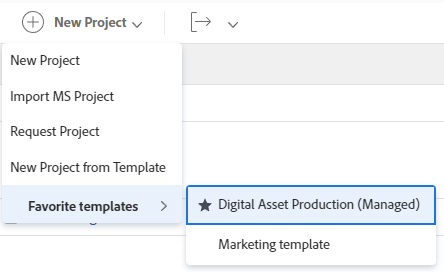

# Een project maken met een sjabloon

<!-- Audited: 01/2024 -->

U kunt sjablonen als een framework gebruiken om projecten te maken in Adobe Workfront. Als u projecten hebt die vaak herhalen, bewaart het gebruiken van malplaatjes voor de algemene chronologie van het nieuwe project u van het moeten de zelfde projecten herhaaldelijk bouwen.

De malplaatjes voorzien u van een manier om herhaalbare processen, informatie, en montages te vangen verbonden aan uw projecten. De informatie verbonden aan een malplaatje wordt overgebracht naar het project. Dit omvat taken, taken, duur, documenten, financiële details, risico&#39;s, en douaneformulieren.

>[!TIP]
>
>Workfront definieert de groep en status van het nieuwe project als volgt:
>
>* De standaardstatus van een nieuw project dat van een malplaatje wordt gecreeerd beantwoordt aan de status die door uw beheerder van Workfront in het belangrijkste gebied van de Voorkeur van het Project wordt bepaald, of door een groepsbeheerder (of beheerder van Workfront) in het gebied van de Voorkeur van het Project voor een groep. Voor informatie over het vormen van projectvoorkeur, zie [ systeem-brede projectvoorkeur ](../../../administration-and-setup/set-up-workfront/configure-system-defaults/set-project-preferences.md) vormen of [ projectvoorkeur voor een groep ](../../../administration-and-setup/manage-groups/create-and-manage-groups/configure-project-preferences-group.md) vormen.
>
>* De Groep van het nieuwe project is de Groep van het malplaatje. Als het malplaatje niet met een Groep wordt geassocieerd, dan is de Groep van het project de Groep van het Huis van de gebruiker die tot het project leidt.
>
>* De statussen beschikbaar voor een nieuw project passen de statussen van de Groep van het project aan, die of de Groep van het malplaatje, of de Groep van het Huis van de gebruiker is die tot het project leidt.

U hebt de volgende opties voor het maken van een project op basis van een sjabloon:

* Creeer een project van een malplaatje in het gebied van Projecten
* Een project maken op basis van een sjabloon op sjabloonniveau
* Een sjabloon aan een bestaand project koppelen

  Voor informatie, zie [ een malplaatje aan een project ](../../../manage-work/projects/create-and-manage-templates/attach-template-to-project.md) vastmaken.

* Een project maken van een sjabloon in het gebied Groepen

## Toegangsvereisten

+++ Breid uit om de toegangseisen voor de functionaliteit in dit artikel weer te geven.

U moet de volgende toegang hebben om de stappen in dit artikel uit te voeren:

<table style="table-layout:auto"> 
 <col> 
 <col> 
 <tbody> 
  <tr> 
   <td role="rowheader">Adobe Workfront-plan</td> 
   <td> 
Alle 
 </td> 
  </tr> 
  <tr> 
   <td role="rowheader">Workfront-licentie*</td> 
   <td> 
Nieuw: Standaard

        
of

        
Huidig: Plan 
 </td> 
  </tr> 
  <tr> 
   <td role="rowheader">Toegangsniveau</td> 
   <td> 
Toegang tot projecten en sjablonen bewerken

geef toegang tot Portfolio's en Programma's uit, als het malplaatje u gebruikt een Portfolio en een Programma bevat

</td> 
  </tr> 
  <tr> 
   <td role="rowheader">Objectmachtigingen</td> 
   <td> 
Machtigingen weergeven voor een sjabloon
 
  
Als de sjabloon die u gebruikt een Portfolio en een programma bevat, moet u beheerdersmachtigingen voor het portfolio en het programma hebben om het project te maken 
 
   
Wanneer u een project creeert, ontvangt u automatisch Manage toestemmingen aan het project.
</td> 
  </tr> 
 </tbody> 
</table>

*For meer detail over de informatie in deze lijst, zie [ vereisten van de Toegang in de documentatie van Workfront ](/help/quicksilver/administration-and-setup/add-users/access-levels-and-object-permissions/access-level-requirements-in-documentation.md).

+++

## Creeer een project van een malplaatje in het gebied van Projecten

U kunt een project van het gebied van Projecten in het Belangrijkste Menu, of van het gebied van Projecten van een portefeuille of een programma tot stand brengen.

>[!NOTE]
>
>Uw systeem of groepsbeheerder zou uw interface kunnen wijzigen gebruikend een lay-outmalplaatje. In dit geval kunnen sommige namen van de secties en gebieden waarnaar in de volgende stappen wordt verwezen, anders zijn in uw exemplaar van Workfront.

1. Voer een van de volgende handelingen uit:

   * Klik het **[!UICONTROL Main Menu]** pictogram  in de hoger-juiste hoek van Adobe Workfront, of (als beschikbaar), klik het **[!UICONTROL Main Menu]** pictogram  in de upper-left hoek. Klik **Projecten**, dan breid **Nieuw Project** uit.
   * Ga naar een portefeuille, dan breid **Nieuw Project** uit.

     >[!TIP]
     >
     >Wanneer u een project gebruikend een malplaatje van een portefeuille creeert, werkt het gebied van het Portfolio van het nieuwe project bij om de portefeuille te tonen u verkoos om het project tot stand te brengen van. Hiermee wordt het veld Portfolio in de sjabloon overschreven, als dit is opgegeven.

   * Ga naar een programma, dan breid **Nieuw Project** uit.

     >[!TIP]
     >
     >Wanneer u een project gebruikend een malplaatje van een programma creeert, werkt het gebied van het Programma van de nieuwe projecten bij om het Programma te tonen u verkoos om het project van tot stand te brengen. Het gebied van het Portfolio van het malplaatje werkt bij om de portefeuille van het programma te tonen u verkoos om het project van tot stand te brengen. Hiermee overschrijft u de velden Programma en Portfolio in de sjabloon, als deze zijn opgegeven.

   * Als u een groepsbeheerder bent, kunt u een project in de sectie van Projecten van een groep ook tot stand brengen u beheert. Voor meer informatie, zie [ tot stand brengen en wijzigen de projecten van een groep ](../../../administration-and-setup/manage-groups/work-with-group-objects/create-and-modify-a-groups-projects.md).

     >[!TIP]
     >
     >Wanneer u een project gebruikend een malplaatje van een groep creeert, de groep u het project van vertoningen op het gebied van de Groep van het nieuwe project creeert slechts wanneer het gebied van de Groep van het malplaatje niet wordt gespecificeerd. Als het gebied van de malplaatjegroep wordt gespecificeerd, is het gebied van de Groep van het nieuwe project dat van het malplaatje.

   <!--
   
(this, above, is hyperlinked to the classic version of this article; the Milestone View steps are similar to creating a project in Classic than to the way you do it in NWE)

   -->

   

1. Klik de naam van een malplaatje in de **Favoriete malplaatjes** lijst.

   

   of

   Ga als volgt te werk:

   1. Selecteer **Nieuw Project van Malplaatje**.
   1. Op het **gebied van de Malplaatjes van het Onderzoek**, begin de naam van een malplaatje te typen en het te klikken wanneer het in de lijst toont.
   1. Bekijk de sjabloondetails aan de rechterkant.

      De sjabloondetails bevatten onder meer de volgende informatie:

      * Sjabloonduur
      * Eigenaar van sjabloon
      * Het aantal taken op hoofdniveau, die de namen van de drie belangrijkste taken omvat
      * Het aantal taken in de sjabloon
      * De namen van de aangepaste sjabloonformulieren

   1. (Facultatief) Beweeg over de naam van een malplaatjenaam in de linkerruit en klik de **Favorieten** **pictogram**  om het als favoriet voor toekomstig gebruik te merken.

      of

      Breid de **Favoriete malplaatjes** lijst uit en selecteer een malplaatje van de drop-down lijst.

      >[!TIP]
      >
      >Je kunt maximaal 40 Workfront-objecten als favorieten laten markeren. Dit omvat sjablonen en andere items.

   1. Klik **malplaatje van het Gebruik** wanneer u een malplaatje hebt geselecteerd.

      

      >[!NOTE]
      >
      >Als u de Mening van de Mijlpaal hebt die op de lijst van projecten wordt toegepast, klik de naam van een malplaatje in **Nieuw van de sectie van het Malplaatje**.
      >
      >
      >
      >

   Het **Nieuwe vakje van het Project** opent.

   

1. Als een gebied reeds in het malplaatje bevolkt is, is het gebied pre-bevolkt in het **Nieuwe vakje van het Project**. U kunt de vooraf ingevulde waarden bewerken zodat deze beter overeenkomen met uw project. Voor meer informatie, zie [ projecten ](../../../manage-work/projects/manage-projects/edit-projects.md) uitgeven.
1. Klik **creëren Project**.

   Alle details die in het malplaatje worden bepaald associëren automatisch met het pas gecreëerde project als u hen in de vorige stap niet veranderde.

## Een project maken van een sjabloon in het gebied Sjablonen

In plaats van in het gebied van Projecten te beginnen, kunt u een project van een malplaatje tot stand brengen door met het malplaatje te beginnen.

{{step1-to-templates}}

1. Klik op de naam van een sjabloon die u wilt gebruiken.
1. Klik **Meer** menu , dan klik **leidt tot Project**.

   

   Het **Nieuwe vakje van het Project** opent.

1. Ga een naam voor het project in, herzie dan elke sectie en breng om het even welke noodzakelijke veranderingen aan.

   

   Als een gebied reeds in het malplaatje bevolkt is, is het gebied pre-bevolkt in het **Nieuwe vakje van het Project**. U kunt de vooraf ingevulde waarden bewerken zodat deze beter overeenkomen met uw project. Voor meer informatie, zie [ projecten ](../../../manage-work/projects/manage-projects/edit-projects.md) uitgeven.

1. Klik **creëren Project**.

   Alle details die in het malplaatje worden bepaald associëren automatisch met het pas gecreëerde project als u hen in de vorige stap niet veranderde.
