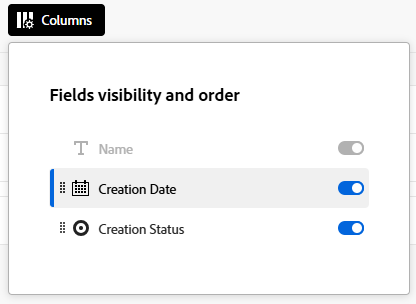
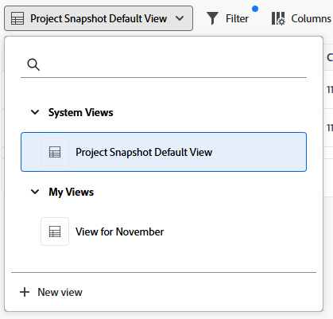

# Projectmomentopnamen maken en weergeven

{{highlighted-preview-article-level}}

Projectmanagers moeten vaak de gegevens uit het verleden van een project vergelijken met de huidige status om geïnformeerde beslissingen te nemen en te zien hoe hun projecten in de loop der tijd zijn veranderd.

Met momentopnamen in Adobe Workfront kunt u deze verschillen zien tussen momentopnamen (genomen op een bepaalde datum en tijd) en de huidige gegevens van het project snel en nauwkeurig, zodat u projecten effectiever kunt beheren en betere beslissingen kunt nemen. De vergelijkingen van de momentopname tonen zij aan zij hoe het project heeft geëvolueerd.

## Toegangsvereisten

+++ Breid uit om de toegangseisen voor de functionaliteit in dit artikel weer te geven.

<table style="table-layout:auto"> 
 <col> 
 <col> 
 <tbody> 
  <tr> 
   <td>Adobe Workfront-pakket</td> 
   <td> 
Workflow Ultimate
 </td> 
  </tr> 
  <tr> 
   <td>Adobe Workfront-licentie</td> 
    <td>Standard</td> 
  </tr> 
  <tr> 
   <td>Configuratie op toegangsniveau</td> 
   <td>Toegang tot projecten bewerken</td> 
  </tr> 
  <tr> 
   <td>Objectmachtigingen</td> 
   <td>Wanneer u een opname weergeeft, kunt u alle velden weergeven die u gemachtigd bent om het oorspronkelijke project te bekijken </td> 
  </tr> 
 </tbody> 
</table>

Voor meer informatie, zie [&#x200B; vereisten van de Toegang in de documentatie van Workfront &#x200B;](/help/quicksilver/administration-and-setup/add-users/access-levels-and-object-permissions/access-level-requirements-in-documentation.md).

+++

## Een opname maken

1. Ga naar een project.
1. In het linkerpaneel, klik **Momentopnamen**.

   

1. Klik **Nieuwe momentopname**.
1. Typ een naam voor de momentopname op de **Nieuwe momentopname** dialoog, en klik **sparen**.

   De naam van de momentopname wordt weergegeven in de lijst.

   >[!NOTE]
   >
   >Wanneer u een opname maakt, is deze niet meteen beschikbaar voor weergave. Op basis van gegevens die op de achtergrond worden uitgevoerd, kan het maximaal 4 uur duren voordat de gegevens gereed zijn. De Status van de Creatie is **in afwachting** wanneer de momentopname nog niet beschikbaar is, en **Klaar** wanneer u het kunt bekijken.

## Eén opname weergeven

1. Ga naar een project en klik **Momentopnamen** in het linkerpaneel.
1. Klik op de naam van een opname in de lijst om deze te openen. De status moet **Klaar** zijn alvorens u het kunt openen.

   >[!TIP]
   >
   >De broodkruimels bij de bovenkant van het scherm verbinden terug naar het project en helpen u identificeren dat u een momentopname bekijkt.

   De momentopname toont de volgende punten aangezien zij op het tijdstip bestonden de momentopname werd gecreeerd:

   * De hiërarchie van taken en subtaken in het project
   * Projectdetails en eventuele aangepaste formulieren die bij de details zijn gevoegd
   * Bijbehorende projecten en hun hiërarchie
   * Problemen
   * Tarieven
   * Factureringsgegevens
   * Uitgaven <!--* Bookings (on its own line of course when they get released)-->
   * Projectteam (tabblad Personen)

   U kunt lijsten in de momentopname aanpassen door te filteren, te sorteren, kolommen toe te voegen en te verwijderen, of een mening toe te passen. KPI&#39;s met tijdfasering zijn beschikbaar om toe te voegen aan de momentopnameweergave. Voor meer informatie, zie [&#x200B; momentopnamelijsten &#x200B;](#customize-snapshot-lists) in dit artikel aanpassen.

## Momentopnamen vergelijken

1. Ga naar een project en klik **Momentopnamen** in het linkerpaneel.
1. Selecteer een optie voor het vergelijken van momentopnamen:

   * Om twee of meer momentopnamen aan elkaar te vergelijken, selecteer de controledozen naast de momentopnamen in de lijst, en klik **vergelijken** in de actiebar bij de bodem van het scherm.
   * Om momentopnamen met het huidige project te vergelijken, selecteer de controledozen naast de momentopnamen in de lijst, en klik **vergelijk met huidig** in de actiebar bij de bodem van het scherm.

     >[!NOTE]
     >
     >Het statuut van elke momentopname u wilt vergelijken moet **Klaar** zijn.

1. Voor het scherm van de Vergelijking, breid elke momentopname en het huidige project uit om de hiërarchie onder te zien.

   

1. U kunt de vergelijking aanpassen door kolommen te sorteren, toe te voegen en te verwijderen of een weergave toe te passen. Voor meer informatie, zie [&#x200B; momentopnamelijsten &#x200B;](#customize-snapshot-lists) in dit artikel aanpassen.

## Momentopnamen exporteren

U kunt de lijst van alle momentopnamen of een momentopnamevergelijking in .xlsx of .csv formaat uitvoeren. Alle weergegeven kolommen worden opgenomen in het geëxporteerde bestand.

1. Klik het **pictogram van de Uitvoer van de 1&rbrace; Uitvoer** 
1. Selecteer de indeling voor het exportbestand.

   Het bestand wordt opgeslagen op uw computer. Mogelijk wordt u gevraagd om de locatie te kiezen.

1. (Optioneel) Open de geëxporteerde lijst met de juiste toepassing.

## Opnamelijsten aanpassen

U kunt de lijst van alle momentopnamen, evenals om het even welke lijsten binnen een momentopname of vergelijking aanpassen, door te filtreren, te sorteren, toe te voegen en te verwijderen kolommen, of een mening toe te passen.

Voor meer informatie over lijstaanpassingen, zie [&#x200B; Gebruik verbeterde lijsten &#x200B;](/help/quicksilver/workfront-basics/navigate-workfront/use-lists/enhanced-lists.md).

### Items in een lijst filteren

Met filters vermindert u de hoeveelheid informatie die u in de lijst weergeeft.

1. Klik **Filter** boven de lijst.
1. In de doos van de Filter, klik **toevoegt voorwaarde**.
1. Selecteer een veld waarop u wilt filteren.
1. Selecteer een filtermodifier, zoals &quot;Heeft een van de opties,&quot; &quot;Heeft geen van de opties&quot;, &quot;Is ervoor&quot; of &quot;Is erna&quot;. De opties voor wijzigingstoetsen zijn afhankelijk van het type veld waarop u filtert.
1. Selecteer de veldwaarde(n). Afhankelijk van het veldtype waarop u filtert, wordt u mogelijk gevraagd het item in een lijst te selecteren, ernaar te zoeken of een kalender te gebruiken om een datumbereik te selecteren.

   

   Het filter wordt automatisch toegepast op de lijst.

1. Klik **toevoegen voorwaarde** om een andere voorwaarde aan de filter toe te voegen.

   U kunt veelvoudige filters door EN of een OF schakelaar aansluiten.

1. Wanneer de filter wordt toegepast, kunt u de **opties van de Filter** opnieuw openen om de filteropties te veranderen of alle filters te ontruimen.

   Een indicator verschijnt op de **knoop van de Filter** wanneer een filter op de lijst wordt toegepast.

   

### Sorteren in een lijst

Afzonderlijke kolommen sorteren:

1. Beweeg over de kolom, dan klik de benedenpijl en selecteer **Soort**.

   Een pictogram naast een kolomnaam geeft aan dat de lijst wordt gesorteerd op de waarden in die kolom en op de richting van de sortering.

   

### Kolommen in een lijst aanpassen

U kunt kolommen in een lijst verbergen, weergeven en opnieuw ordenen.

1. Klik **Kolommen** boven de lijst.

   

1. Met de schakelopties kunt u kolommen in de lijst weergeven of verbergen.
1. Om de kolommen opnieuw in orde te brengen, klik het **pictogram van de Belemmering** pictogram  Als u kolommen verplaatst, wordt de lijst automatisch gewijzigd.

   >[!NOTE]
   >
   >Het primaire veld is de eerste kolom in de lijst. De kolom staat op de eerste positie en u kunt de kolom niet wijzigen. Als het aantal kolommen groot is, wordt het primaire veld naar links bevroren en als u horizontaal schuift, ziet u het altijd.
   >
   >Het pictogram naast een veldnaam geeft het veldtype aan, zoals tekst of datumveld.

   Een indicator verschijnt op de **knoop van Kolommen** wanneer de kolommen worden verborgen. De indicator wordt niet weergegeven wanneer u de kolommen opnieuw ordent.

   

### Kolommen toevoegen en verwijderen met Kolombeheer

Met Kolombeheer in bepaalde uitgebreide lijsten kunt u eenvoudig kolommen aan de lijst toevoegen en eruit verwijderen. U kunt zowel systeem- als aangepaste velden die al in Workfront als kolommen bestaan, toevoegen of verwijderen.

1. Klik het **+** pictogram op de hoger-juiste hoek van de lijst om de **manager van de Kolom** doos te openen.

   

1. Onderzoek naar een bestaand objecten gebied in de **Beschikbare** kolom, dan klik **+** rechts van het gebied naam het om het aan de **Geselecteerde** kolom toe te voegen.
1. Klik **-** rechts van een gebied in de **Geselecteerde** kolom om het uit de lijst te verwijderen.
1. Klik **sparen**.

   De lijst werkt de kolommen bij volgens de keuzes die u hebt gemaakt.

### Een weergave toepassen op een lijst

Een weergave toepassen of maken:

1. Klik de **drop-down Meningen** en selecteer een bestaande mening om het op de lijst toe te passen

   OF

   Klik **Nieuwe mening** om te creëren.

   

1. (Voorwaardelijk) voor het toevoegen van een nieuwe mening, ga een naam voor de mening in, dan klik **creeer**.
1. (Optioneel) U kunt de kolommen verbergen, weergeven of opnieuw rangschikken. Voor meer informatie, zie [&#x200B; kolommen in een lijst &#x200B;](#customize-columns-in-a-list) aanpassen.
1. (Optioneel) Filter de lijst. Voor meer informatie, zie [&#x200B; punten van de Filter in een lijst &#x200B;](#filter-items-in-a-list).

Wijzigingen in weergaven worden automatisch opgeslagen. De volgende keer dat u deze weergave toepast, blijven de kolom- en filterinstellingen behouden zoals u ze instelt. Voor meer informatie over meningen, zie [&#x200B; Gebruik verbeterde lijsten &#x200B;](/help/quicksilver/workfront-basics/navigate-workfront/use-lists/enhanced-lists.md).

