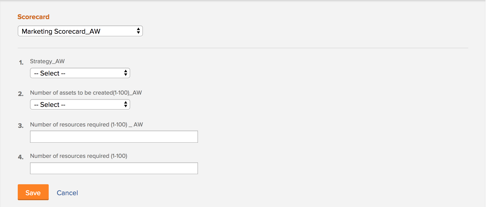

# Pas een scorecard op een project toe en produceer een Score van de Uitlijning

<!-- Audited: 02/2024 -->

U kunt een scorecard gebruiken om te meten hoe goed een project zich op de eerder vastgestelde criteria van een portefeuille richt. Een scorecard weerspiegelt vaak de missie, de waarden, en de strategische doelstellingen van een organisatie.

Voor meer informatie over scorecards en hoe u kunt creëren, zie [Een scorecard maken](../../../administration-and-setup/set-up-workfront/configure-system-defaults/create-scorecard.md).

## Toegangsvereisten

+++ Breid uit om de toegangseisen voor de functionaliteit in dit artikel weer te geven.

U moet de volgende toegang hebben om de stappen in dit artikel uit te voeren:

<table style="table-layout:auto"> 
 <col> 
 <col> 
 <tbody> 
  <tr> 
   <td role="rowheader">Adobe Workfront-plan</td> 
   <td>
   
Nieuw: Primair of hoger

   
of

   
Huidig: Zakelijk of hoger
 </td>
  </tr> 
  <tr> 
   <td role="rowheader">Adobe Workfront-licentie</td> 
   <td>
   
Nieuw: Standaard

   
of

   
Huidig: Plan
</td>  
  </tr> 
  <tr> 
   <td role="rowheader">Configuraties op toegangsniveau</td> 
   <td> 
Toegang tot projecten bewerken
 
Toegang tot Portfolio's weergeven of vergroten
 </td> 
  </tr> 
  <tr> 
   <td role="rowheader">Objectmachtigingen</td> 
   <td>
Rechten voor een project beheren
 
Machtigingen voor een portfolio weergeven of hoger
 </td> 
  </tr> 
 </tbody> 
</table>

Zie voor meer informatie over de informatie in deze tabel [Toegangsvereisten in Workfront-documentatie](/help/quicksilver/administration-and-setup/add-users/access-levels-and-object-permissions/access-level-requirements-in-documentation.md).

+++

## Projectscorecards {#project-scorecards}

* [Overzicht van Scorecards](#scorecards-overview)
* [Pas een scorecard op een project toe](#apply-a-scorecard-to-a-project)

### Overzicht van Scorecards {#scorecards-overview}

Typisch, voltooit een projectmanager de scorecard informatie om een groeperingswaarde tussen 0 en 100 voor het project te veroorzaken. De geproduceerde waarde wordt later gebruikt wanneer de portefeuillebeheerder de projecten in portefeuille optimizer controleert om hen te vergelijken.

Zie voor meer informatie over het optimaliseren van portfolio&#39;s [Overzicht van Portfolio optimaliseren](../../../manage-work/portfolios/portfolio-optimizer/portfolio-optimizer-overview.md).

### Pas een scorecard op een project toe

Als gebruiker met een Standaard of vergunning van het Plan en leidt toestemmingen aan een project, kunt u een scorecard aan het project vastmaken.

Zie voor meer informatie over projectmachtigingen [Een project delen in Adobe Workfront](../../../workfront-basics/grant-and-request-access-to-objects/share-a-project.md).

U kunt scorecards aan een project als deel van de bouw van het bedrijfsgeval voor het project toevoegen.

Voor meer informatie over het bouwen van een bedrijfsgeval, zie [Een bedrijfscase maken voor een project](../../../manage-work/projects/define-a-business-case/create-business-case.md).

Uw beheerder van Adobe Workfront of groepsbeheerder moet de sectie van het Scorecard op het BedrijfsGeval gebied van uw projecten toelaten alvorens u tot scorecards van de BedrijfsGeval kunt toegang hebben. Voor informatie over het opzetten van projectvoorkeur en het toelaten van gebieden van het BedrijfsGeval, zie [Projectvoorkeuren voor het hele systeem configureren](../../../administration-and-setup/set-up-workfront/configure-system-defaults/set-project-preferences.md).

Een scorecard toepassen op een project:

1. Ga naar een project waarop u een scorecard wilt toepassen.
1. Klikken **Bedrijfs-case** in het linkerdeelvenster.
1. Zoek de **Scorecard** van de Business Case.\
   U moet een scorecard vóór creëren **Scorecard** in de Business Case weergegeven.

   Voor informatie over het creëren van een scorecard, zie [Een scorecard maken](../../../administration-and-setup/set-up-workfront/configure-system-defaults/create-scorecard.md).

1. Selecteer een scorecard in het keuzemenu.

   

1. Voer een antwoord in voor alle vragen in de scorecard.

   Workfront past een score toe op elke beantwoorde vraag en berekent een algemene projectscore op basis van de individuele score van elke vraag.

   Voor meer informatie over het produceren van de project algemene groeperingsscore, zie [Een uitlijningsscore genereren voor een project](#generate-an-alignment-score-for-a-project).

1. Klikken **Opslaan** om scorecard te bewaren en het project te scoren.

   scorecard wordt nu geassocieerd met het project en het project wordt genoteerd.

<!--This functionality was removed when we redesigned bulk editing projects with 23.2: 

1. (Conditional) When changes occur in the values of scorecard questions, you must recalculate the scorecard to reflect the new values for the project score. To recaulate the scorecard, do the following: 

   1. Go to a list of projects and select all projects in the list. 
   1. Click the **Edit** icon at the top of the list. 
   1. Click **Settings** in the left panel, then check the **Recalculate Scorecards** option at the end of the Settings area. 
   1. Click Save. This recalculates the score value based on the scorecards attached for all the selected projects.  

      >[!NOTE]
      >
      >   The option to recalculate scorecards has been removed from the Preview environment, when editing projects in bulk. 

-->

## Een uitlijningsscore genereren

* [Een uitlijningsscore genereren voor een project](#generate-an-alignment-score-for-a-project)
* [Een uitlijningsscore genereren voor een portfolio](#generate-an-alignment-score-for-a-portfolio)

### Een uitlijningsscore genereren voor een project {#generate-an-alignment-score-for-a-project}

De uitlijningsscore is de waarde die wordt geproduceerd nadat de scorecard is voltooid.

Scorecards bevatten vragen met antwoordkeuzen waaraan numerieke waarden zijn toegewezen, uitlijningspunten genoemd. Deze punten worden gebruikt om te bepalen hoe goed het project zich op uw organisatie richt. De uitlijningspunten voor elke vraag bevatten een getal tussen 0 en 100.

Wanneer scorecard wordt voltooid, berekent Workfront de groeperingsscore van het project als percentage, gebruikend de volgende formule:

`Project Alignment Score = The sum of the question points from the scorecard met at a given time / The sum of the possible points on the scorecard`

Zie voor meer informatie [Een scorecard maken](../../../administration-and-setup/set-up-workfront/configure-system-defaults/create-scorecard.md).

### Een uitlijningsscore genereren voor een portfolio {#generate-an-alignment-score-for-a-portfolio}

De uitlijningsscore van het portfolio is een gemiddelde van de uitlijningsscores van alle projecten in het portfolio.

Wanneer de scorecards van de projecten worden voltooid, gebruikt Workfront die waarden om de groeperingsscore van de portefeuille als percentage te berekenen, gebruikend de volgende formule:

`Portfolio Alignment Score = The sum of the percentages of the project alignment scores / Number of projects in the portfolio`

>[!NOTE]
>
>Als een project geen scorecard verbonden aan het heeft, en daarom heeft het geen groeperingsscore, wordt het beschouwd als om een 0% groepering in de portefeuille te hebben. Het project wordt in aanmerking genomen in het aantal projecten in de portefeuille.

## De uitlijningsscore weergeven

U kunt de groeperingsscore van een project op het projectniveau, of in Portfolio bekijken Optimizer.

* [De score voor uitlijning weergeven voor een project](#view-the-alignment-score-on-a-project)
* [De scores voor uitlijning van het project en het portfolio weergeven in Portfolio optimaliseren](#view-the-alignment-scores-of-the-project-and-of-the-portfolio-in-the-portfolio-optimizer)

### De score voor uitlijning weergeven voor een project

U kunt de uitlijningsscore van een project weergeven op projectniveau als u Contribute-rechten voor het project hebt.

1. Ga naar het project waarvan de Score van de Uitlijning u wilt bekijken.
1. Klikken **Bedrijfs-case** in het linkerdeelvenster.
1. Ga naar de **Overzicht van bedrijfscase** aan de rechterkant van het scherm.

   De score voor uitlijning bevindt zich in het overzicht Bedrijfscase, in het gedeelte **Uitgelijnd** waarde.

   

### De scores voor uitlijning van het project en het portfolio weergeven in Portfolio optimaliseren

U kunt de uitlijningsscore van een project of van een portfolio weergeven in Portfolio optimaliseren als u beheertoegang tot het portfolio hebt.

Voor meer informatie over de informatie die in Optimizer van het Portfolio wordt getoond, zie [Overzicht van Portfolio optimaliseren](../../../manage-work/portfolios/portfolio-optimizer/portfolio-optimizer-overview.md).

* [Zoek de score voor uitlijning van het project in Portfolio optimaliseren](#locate-the-alignment-score-of-the-project-in-the-portfolio-optimizer)
* [De uitlijningsscore van het portfolio zoeken in Portfolio optimaliseren](#locate-the-alignment-score-of-the-portfolio-in-the-portfolio-optimizer)

  

#### Zoek de score voor uitlijning van het project in Portfolio optimaliseren {#locate-the-alignment-score-of-the-project-in-the-portfolio-optimizer}

{{step1-to-portfolios}}

1. Klik op de naam van een portfolio.
1. Klikken **Portfolio optimaliseren** in het linkerdeelvenster.

   De functie Portfolio optimaliseren wordt weergegeven.

   De uitlijningsscore van een project wordt weergegeven als een percentage in het deelvenster **Uitlijning** kolom van Portfolio Optimizer.

   Dit is de groeperingsscore van het project dat op scorecard wordt gebaseerd verbonden aan het project.

#### De uitlijningsscore van het portfolio zoeken in Portfolio optimaliseren  {#locate-the-alignment-score-of-the-portfolio-in-the-portfolio-optimizer}

{{step1-to-portfolios}}

1. Klik op de naam van een portfolio.
1. Klikken **Portfolio optimaliseren** in het linkerdeelvenster.
1. Boven aan het Portfolio Optimizer vindt u de **Uitgelijnd** en de **Uitlijning** profiel, dat de uitlijningsscore van de portfolio aangeeft.

   Dit is de uitlijningsscore van het portfolio.

   Zie voor meer informatie over hoe de uitlijningsscore van een portfolio wordt gegenereerd [Een uitlijningsscore genereren voor een portfolio](#generate-an-alignment-score-for-a-portfolio).

## Overzicht van de Portfolio Optimizer Score

Er is een verschil tussen de uitlijningsscore en de optimaliseringsscore van een project voor het portfolio.

De groeperingsscore van een project wordt berekend gebaseerd op de punten die na de voltooiing van scorecard worden verkregen. Deze score wordt vervolgens gebruikt om de uitlijningsscore van het portfolio te bepalen. De uitlijningsscore wordt weergegeven als een percentage.

De uitlijningsscore van een project wordt weergegeven in het deelvenster **Uitlijning** kolom van Portfolio Optimizer.

De score voor het optimaliseren van het portfolio is een positie die automatisch wordt berekend in Portfolio Optimizer op basis waarvan aan projecten prioriteiten kunnen worden toegewezen. De score voor het optimaliseren van het portfolio wordt weergegeven als een indicatiepictogram en er wordt een nummer weergegeven in het dialoogvenster **Score** kolom van Portfolio Optimizer. Een score van de Optimizer van het Portfolio wordt geproduceerd slechts wanneer alle secties van het BedrijfsGeval, behalve Doelstellingen worden voltooid.

Voor meer informatie over het creëren van een BedrijfsGeval voor een project, zie [Een bedrijfscase maken voor een project](../../../manage-work/projects/define-a-business-case/create-business-case.md).

Voor meer informatie over het berekenen van de score van een project voor het optimaliseren van het portfolio raadpleegt u [Overzicht van de Portfolio Optimizer Score](../../../manage-work/portfolios/portfolio-optimizer/portfolio-optimizer-score.md).
