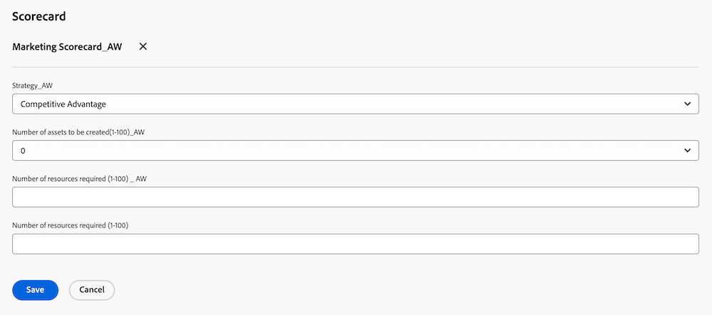
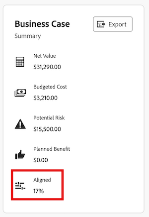

# Pas een scorecard op een project toe en produceer een Score van de Uitlijning

<!-- Audited: 06/2025 -->

U kunt een scorecard gebruiken om te meten hoe goed een project zich op de eerder vastgestelde criteria van een portefeuille richt. Een scorecard weerspiegelt vaak de missie, de waarden, en de strategische doelstellingen van een organisatie.

Voor meer informatie over scorecards en hoe u één kunt tot stand brengen, zie [&#x200B; een scorecard &#x200B;](../../../administration-and-setup/set-up-workfront/configure-system-defaults/create-scorecard.md) creëren.

## Toegangsvereisten

+++ Breid uit om de toegangseisen voor de functionaliteit in dit artikel weer te geven.

<table style="table-layout:auto"> 
 <col> 
 <col> 
 <tbody> 
  <tr> 
   <td role="rowheader">Adobe Workfront-pakket</td> 
   <td>
   
Prime of hoger

  </tr> 
  <tr> 
   <td role="rowheader">Adobe Workfront-licentie</td> 
   <td>
   
Standard

   
Plan
</td>  
  </tr> 
  <tr> 
   <td role="rowheader">Configuraties op toegangsniveau</td> 
   <td> 
Toegang tot projecten bewerken
 
Toegang tot portfolio's weergeven of vergroten
 </td> 
  </tr> 
  <tr> 
   <td role="rowheader">Objectmachtigingen</td> 
   <td>
Rechten voor een project beheren
 
Machtigingen voor een portfolio weergeven of hoger
 </td> 
  </tr> 
 </tbody> 
</table>

Voor informatie, zie [&#x200B; vereisten van de Toegang in de documentatie van Workfront &#x200B;](/help/quicksilver/administration-and-setup/add-users/access-levels-and-object-permissions/access-level-requirements-in-documentation.md).

+++

## Projectscorecards {#project-scorecards}

* [&#x200B; Scorecards overzicht &#x200B;](#scorecards-overview)
* [Pas een scorecard op een project toe](#apply-a-scorecard-to-a-project)

### Overzicht van Scorecards {#scorecards-overview}

Typisch, voltooit een projectmanager de scorecard informatie om een groeperingswaarde tussen 0 en 100 voor het project te veroorzaken. De geproduceerde waarde wordt later gebruikt wanneer de portefeuillebeheerder de projecten in portefeuille optimizer controleert om hen te vergelijken.

Voor meer informatie over portefeuillestimalisatie, zie [&#x200B; het Optimizer overzicht van Portfolio &#x200B;](../../../manage-work/portfolios/portfolio-optimizer/portfolio-optimizer-overview.md).

### Pas een scorecard op een project toe

Als gebruiker met een Standaard of vergunning van het Plan en leidt toestemmingen aan een project, kunt u een scorecard aan het project vastmaken.

Voor meer informatie over projecttoestemmingen, zie [&#x200B; een project in Adobe Workfront &#x200B;](../../../workfront-basics/grant-and-request-access-to-objects/share-a-project.md) delen.

U kunt scorecards aan een project als deel van de bouw van het bedrijfsgeval voor het project toevoegen.

Voor meer informatie over de bouw van een bedrijfsgeval, zie [&#x200B; een BedrijfsGeval voor een project &#x200B;](../../../manage-work/projects/define-a-business-case/create-business-case.md) creëren.

Uw beheerder van Adobe Workfront of groepsbeheerder moet de sectie van het Scorecard op het BedrijfsGeval gebied van uw projecten toelaten alvorens u tot scorecards van de BedrijfsGeval kunt toegang hebben. Voor informatie over vestiging projectvoorkeur en toelatend gebieden van het BedrijfsGeval, zie [&#x200B; systeem-brede projectvoorkeur &#x200B;](../../../administration-and-setup/set-up-workfront/configure-system-defaults/set-project-preferences.md) vormen.

Een scorecard toepassen op een project:

1. Ga naar een project waarop u een scorecard wilt toepassen.
1. Klik **Bedrijfs Geval** in het linkerpaneel.
1. Vind de **Scorecard** sectie van het BedrijfsGeval.\
   U moet een scorecard vóór de **Scorecard** sectievertoningen op het BedrijfsGeval tot stand brengen.

   Voor informatie over het creëren van een scorecard, zie [&#x200B; een scorecard &#x200B;](../../../administration-and-setup/set-up-workfront/configure-system-defaults/create-scorecard.md) creëren.

1. Selecteer een scorecard in het keuzemenu.

   

1. Voer een antwoord in voor alle vragen in de scorecard.

   Workfront past een score toe op elke beantwoorde vraag en berekent een algemene projectscore op basis van de individuele score van elke vraag.

   Voor meer informatie over het produceren van de project algemene groeperingsscore, zie [&#x200B; een Score van de Groepering voor een project &#x200B;](#generate-an-alignment-score-for-a-project) produceren.

1. Klik **sparen** om scorecard te bewaren en het project te scoren.

   scorecard wordt nu geassocieerd met het project en het project wordt genoteerd.

<!--This functionality was removed when we redesigned bulk editing projects with 23.2: 

1. (Conditional) When changes occur in the values of scorecard questions, you must recalculate the scorecard to reflect the new values for the project score. To recaulate the scorecard, do the following: 

   1. Go to a list of projects and select all projects in the list. 
   1. Click the **Edit** icon at the top of the list. 
   1. Click **Settings** in the left panel, then check the **Recalculate Scorecards** option at the end of the Settings area. 
   1. Click Save. This recalculates the score value based on the scorecards attached for all the selected projects.  

      >[!NOTE]
      >
      >   The option to recalculate scorecards has been removed from the Preview environment, when editing projects in bulk. 

-->

## Een uitlijningsscore genereren

* [&#x200B; produceer een Score van de Groepering voor een project &#x200B;](#generate-an-alignment-score-for-a-project)
* [Een uitlijningsscore genereren voor een portfolio](#generate-an-alignment-score-for-a-portfolio)

### Een uitlijningsscore genereren voor een project {#generate-an-alignment-score-for-a-project}

De uitlijningsscore is de waarde die wordt geproduceerd nadat de scorecard is voltooid.

Scorecards bevatten vragen met antwoordkeuzen waaraan numerieke waarden zijn toegewezen, uitlijningspunten genoemd. Deze punten worden gebruikt om te bepalen hoe goed het project zich op uw organisatie richt. De uitlijningspunten voor elke vraag bevatten een getal tussen 0 en 100.

Wanneer scorecard wordt voltooid, berekent Workfront de groeperingsscore van het project als percentage, gebruikend de volgende formule:

`Project Alignment Score = The sum of the question points from the scorecard met at a given time / The sum of the possible points on the scorecard`

Voor meer informatie, zie [&#x200B; een scorecard &#x200B;](../../../administration-and-setup/set-up-workfront/configure-system-defaults/create-scorecard.md) creëren.

### Een uitlijningsscore genereren voor een portfolio {#generate-an-alignment-score-for-a-portfolio}

De uitlijningsscore van het portfolio is een gemiddelde van de uitlijningsscores van alle projecten in het portfolio.

Wanneer de scorecards van de projecten worden voltooid, gebruikt Workfront die waarden om de groeperingsscore van de portefeuille als percentage te berekenen, gebruikend de volgende formule:

`Portfolio Alignment Score = The sum of the percentages of the project alignment scores / Number of projects in the portfolio`

>[!NOTE]
>
>Als een project geen scorecard verbonden aan het heeft, en daarom heeft het geen groeperingsscore, wordt het beschouwd als om een 0% groepering in de portefeuille te hebben. Het project wordt in aanmerking genomen in het aantal projecten in de portefeuille.

## De uitlijningsscore weergeven

U kunt de groeperingsscore van een project op het projectniveau, of in de Optimizer van Portfolio bekijken.

* [&#x200B; Mening de Score van de Groepering op een project &#x200B;](#view-the-alignment-score-on-a-project)
* [De uitlijningsscores van het project en het portfolio weergeven in Portfolio Optimizer](#view-the-alignment-scores-of-the-project-and-of-the-portfolio-in-the-portfolio-optimizer)

### De score voor uitlijning weergeven voor een project

U kunt de uitlijningsscore van een project weergeven op projectniveau als u Contribute-rechten voor het project hebt.

1. Ga naar het project waarvan de Score van de Uitlijning u wilt bekijken.
1. Klik **Bedrijfs Geval** in het linkerpaneel.
1. Ga naar de **Samenvatting van BedrijfsGeval** op de rechterkant van uw scherm. De Score van de Groepering wordt gevestigd in de Samenvatting Bedrijfs van het Geval, in de **Uitgelijnde** waarde.

   

### De uitlijningsscores van het project en het portfolio weergeven in Portfolio Optimizer

U kunt de uitlijningsscore van een project of van een portfolio weergeven in Portfolio Optimizer als u beheertoegang tot het portfolio hebt.

Voor meer informatie over de informatie die in Portfolio Optimizer wordt getoond, zie [&#x200B; het Optimizer overzicht van Portfolio &#x200B;](../../../manage-work/portfolios/portfolio-optimizer/portfolio-optimizer-overview.md).

* [&#x200B; bepaal de plaats van de Score van de Groepering van het project in Portfolio Optimizer &#x200B;](#locate-the-alignment-score-of-the-project-in-the-portfolio-optimizer)
* [De uitlijningsscore van het portfolio zoeken in Portfolio Optimizer](#locate-the-alignment-score-of-the-portfolio-in-the-portfolio-optimizer)

  

#### De uitlijningsscore van het project zoeken in Portfolio Optimizer {#locate-the-alignment-score-of-the-project-in-the-portfolio-optimizer}

{{step1-to-portfolios}}

1. Klik op de naam van een portfolio.
1. Klik **Optimalisering van Portfolio** in het linkerpaneel. De functie Portfolio Optimizer wordt weergegeven.

   De groeperingsscore van een project wordt getoond als percentage in de **kolom van de Groepering** van Portfolio Optimizer.

   Dit is de groeperingsscore van het project dat op scorecard wordt gebaseerd verbonden aan het project.

#### De uitlijningsscore van het portfolio zoeken in Portfolio Optimizer  {#locate-the-alignment-score-of-the-portfolio-in-the-portfolio-optimizer}

{{step1-to-portfolios}}

1. Klik op de naam van een portfolio.
1. Klik **Optimalisering van Portfolio** in het linkerpaneel.
1. Bij de bovenkant van de Optimizer van Portfolio vindt **Uitgelijnde** waarde, evenals **de 3&rbrace; maat van de Groepering &lbrace;, die op de groeperingsscore van de portefeuille wijzen.**

   Dit is de uitlijningsscore van het portfolio.

   Voor meer informatie over hoe de groeperingsscore van een portefeuille wordt geproduceerd, zie [&#x200B; een Score van de Groepering voor een portefeuille &#x200B;](#generate-an-alignment-score-for-a-portfolio) produceren.

## Overzicht van de Portfolio Optimizer Score

Er is een verschil tussen de uitlijningsscore en de optimaliseringsscore van een project voor het portfolio.

De groeperingsscore van een project wordt berekend gebaseerd op de punten die na de voltooiing van scorecard worden verkregen. Deze score wordt vervolgens gebruikt om de uitlijningsscore van het portfolio te bepalen. De uitlijningsscore wordt weergegeven als een percentage.

De groeperingsscore van een projectvertoningen in de **kolom van de Groepering** van Portfolio optimaliseert.

De score voor het optimaliseren van het portfolio is een positie die automatisch wordt berekend in Portfolio Optimizer aan de hand waarvan aan projecten prioriteiten kunnen worden toegewezen. De portefeuille optimizer score wordt getoond als indicatorpictogram vergezeld van een aantal en het toont in de **kolom van de Score** van Portfolio Optimizer. Een Portfolio Optimizer score wordt geproduceerd slechts wanneer alle secties van de BedrijfsGeval, behalve Doelstellingen worden voltooid.

Voor meer informatie over het creëren van een BedrijfsGeval voor een project, zie [&#x200B; een BedrijfsGeval voor een project &#x200B;](../../../manage-work/projects/define-a-business-case/create-business-case.md) creëren.

Voor meer informatie over het berekenen van de portefeuille optimizer score van een project, zie [&#x200B; Overzicht van de Score van de Optimizer van Portfolio &#x200B;](../../../manage-work/portfolios/portfolio-optimizer/portfolio-optimizer-score.md).
