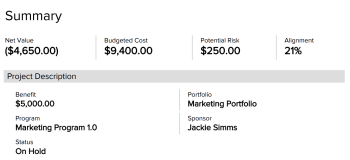

# Overzicht van Business Case Arees

<!-- Audited: 4/2025 -->

Dit artikel beschrijft de gebieden van het BedrijfsGeval van een project.

Voor informatie over het creëren van een BedrijfsGeval voor een project, zie [&#x200B; een BedrijfsGeval voor een project &#x200B;](../../../manage-work/projects/define-a-business-case/create-business-case.md) creëren.

Uw beheerder van Adobe Workfront of groepsbeheerder moet alle secties in het BedrijfsGeval toelaten alvorens zij op het project, behalve de sectie van Info van het Project zichtbaar zijn. Het gedeelte Projectinfo is standaard ingeschakeld.

Voor meer informatie over het toelaten van de gebieden van het BedrijfsGeval, zie de sectie Bedrijfs van Gevallen in het artikel [&#x200B; vorm systeem-brede projectvoorkeur &#x200B;](../../../administration-and-setup/set-up-workfront/configure-system-defaults/set-project-preferences.md).

Hier volgt een overzicht van de gebieden in het Business Case van een project:

* Projectinfo
* Doelen
* Uitgaven
* Bronnen begroten
* Risico&#39;s
* Scorecard
* Aangepaste Forms
* Overzicht van bedrijfscase

## Projectinfo

Het gedeelte Projectinfo van de bedrijfscase bevat de basisinformatie van een project voordat het project daadwerkelijk is gestart.

Alle projecten hebben een gebied van Info van het Project in het BedrijfsGeval met vooraf ingestelde gebieden, betekenend kunnen de beheerders van Workfront niet vormen welke gebieden op dit gebied verschijnen.

U kunt de volgende velden bewerken:

* **Beschrijving**: Voeg een beschrijving voor uw project toe.

* **Eigenaar van het Project**: Door gebrek, is de gebruiker die het project creeert ook de Eigenaar van het Project. Bewerk dit veld om een andere actieve gebruiker als eigenaar van het project te selecteren.

* **Sponsor van het Project**: Selecteer een actieve gebruiker die de Sponsor van het Project zal zijn. De sponsor ontvangt de goedkeuring van de Business Case.

* **Portfolio**: Selecteer een Portfolio voor het project. U moet de Portfolio maken en deze in de status Actief plaatsen voordat u deze kunt selecteren in dit vervolgkeuzemenu.

  Voor meer informatie over portefeuilles, zie [&#x200B; overzicht van Portfolio in Adobe Workfront &#x200B;](../../../manage-work/portfolios/portfolios-overview/portfolio-overview.md).

  Voor meer informatie over het creëren van Portfolio&#39;s, zie [&#x200B; een portefeuille &#x200B;](../../../manage-work/portfolios/create-and-manage-portfolios/create-portfolios.md) creëren.

* **Gepland Voordeel**: Schatting wat het monetaire voordeel voor uw organisatie gepland is te zijn wanneer dit project wordt voltooid. Het kan om het even welk bedrag van munt zijn, en het moet een positieve waarde (b.v. $10.000) zijn.

* **Status**: Door gebrek, wordt de Status voor een projectverzoek geplaatst aan Idea. Als u de Status in om het even wat buiten Idee of Planning verandert, verdwijnt de Submit knoop uit het gebied van de Samenvatting van BedrijfsGeval, en u kunt niet meer de BedrijfsGeval ter goedkeuring voorleggen.

* **Vaste Datum van het Begin**: Specificeer een datum wanneer u het project zou willen beginnen.

* **Vaste Datum van het Eind**: Specificeer een datum wanneer u het project om zou willen beëindigen.

  >[!NOTE]
  >
  >De vaste begin- en einddatum in het bedrijfscase hebben geen invloed op de geplande begin- en einddatum van het project. Deze staan voor de data waarop de projectmaker het project ideaal zou ontwikkelen. In plaats daarvan geven de geplande aanvangs- en geplande voltooiingsdatums van het project de geplande tijdlijn voor het project aan, die is gebaseerd op de taken van het project.

## Doelen

Doelstellingen bepalen de doelstellingen van het project. Dit gebied is standaard ingeschakeld in het geval Business, maar de Workfront-beheerder kan ervoor kiezen dit gebied niet weer te geven. In dit veld worden de doelstellingen in volgorde van prioriteit weergegeven.

<!--

(NOTE: below snippet: NWE only, not classic)

-->

>[!TIP]
>
>U kunt strategische doelstellingen voor uw organisatie tot stand brengen die niet met de individuele BedrijfsGeval van een project worden verbonden. U moet toegang hebben tot Adobe Workfront-doelen om strategische doelen te kunnen maken. U kunt hen dan met projecten buiten hun Zaken verbinden. Voor informatie over het creëren van doelstellingen die de Doelen van Workfront gebruiken, zie [&#x200B; overzicht van de Doelen van Adobe Workfront &#x200B;](../../../workfront-goals/goal-management/wf-goals-overview.md).

Het bepalen van de doelstellingen is facultatief voor het project om een Score in Optimizer van Portfolio te ontvangen. Deze sectie is de enige optionele sectie in de Business Case. Alle andere secties van het BedrijfsGeval moeten worden voltooid alvorens het project in Portfolio Optimizer wordt gescoord. U kunt een prioriteitsniveau voor een doel aangeven terwijl u het doel maakt.

Voor meer informatie, zie [&#x200B; BedrijfsGevallendoelstellingen &#x200B;](../../../manage-work/projects/define-a-business-case/create-business-case-goals.md) creëren.

## Uitgaven

De kosten vertegenwoordigen de niet-loonkosten die tijdens de looptijd van een project kunnen worden gemaakt. Dit gebied is standaard ingeschakeld in het geval Business, maar de Workfront-beheerder kan ervoor kiezen dit gebied niet weer te geven.

Eventuele kosten die u in de Business Case opgeeft, worden ook als geplande uitgaven op het tabblad Uitgaven van het project ingevoerd.

De uitgaven beïnvloeden de volgende gebieden op het project:

* Geraamde kosten
* Nettowaarde

Uw Workfront-beheerder kan aangepaste kostentypen instellen.

Voor meer informatie over de Begrotende Kosten en Netto Waarden, zie [&#x200B; Overzicht van de Financiële gebieden van het BedrijfsGeval &#x200B;](../../../manage-work/projects/define-a-business-case/business-case-finances.md).

Voor meer informatie over uitgaven, zie [&#x200B; projectuitgaven beheren &#x200B;](../../../manage-work/projects/project-finances/manage-project-expenses.md).

Voor meer informatie over het creëren van de Types van Uitgaven van de douane, zie [&#x200B; de types van douanevergoeding &#x200B;](../../../administration-and-setup/set-up-workfront/configure-system-defaults/create-custom-expense-types.md) creëren.

## Bronnen begroten

U kunt de volgende acties op het gebied van de Begroting van het Middel van de BedrijfsKwestie uitvoeren:

* Brongroepen koppelen aan het project.
* Maak een budget voor uw middelen op projectniveau.

De uren die voor de middelen van het project in de begroting worden opgenomen tonen op het gebied van de Begroting van het Middel van het BedrijfsGeval, die de Begrotende Arbeidskosten van het project produceren. Dit gebied is standaard ingeschakeld.

Voor meer informatie over het opnemen van middelen voor het project in het BedrijfsGeval, zie &lbrace;de middelen van de Begroting in het BedrijfsGeval [.](../../../manage-work/projects/define-a-business-case/budget-resources-in-business-case.md)

<!---->

Overweeg het volgende wanneer het bekijken van de sectie van de Begroting van het Middel van het BedrijfsGeval:

* U kunt hier broninformatie begroten met behulp van de volgende hulpmiddelen:

   * De bronnenplanner

     Voor informatie, zie [&#x200B; middelen van de Begroting in het BedrijfsGeval gebruikend de Planner van het Middel &#x200B;](../../../manage-work/projects/define-a-business-case/budget-resources-in-business-case-use-resource-planner.md).

   * Scenario Planner

     Voor meer informatie, zie [&#x200B; middelen van de Begroting in het BedrijfsGeval gebruikend de Planner van het Scenario &#x200B;](../../../manage-work/projects/define-a-business-case/budget-resources-in-business-case-use-scenario-planner.md).

     De Scenario Planner is alleen beschikbaar in de nieuwe Adobe Workfront-ervaring en vereist een aanvullende licentie. Voor informatie over de Planner van het Scenario van Workfront, zie [&#x200B; het overzicht van de Planner van het Scenario &#x200B;](../../../scenario-planner/scenario-planner-overview.md).

* De informatie die hier wordt getoond toont ook in de Planner van het Middel op systeemniveau of de Planner van het Scenario.

  <!--
  
(NOTE: the "or" stays in NWE only) 

  -->

* Na het begroten van uw middelen, toont de begrote Kosten van de Arbeid van het project op het gebied van de Begroting van het Middel als de rollen met Kosten per uren tarieven worden geassocieerd. De begrote arbeidskosten worden weergegeven in de valuta van het project.

  >[!IMPORTANT]
  >
  >De begrote arbeidskosten zijn de kosten verbonden aan de rollen op het project, en niet aan de gebruikers. De som van alle begrote arbeidskosten voor de gebruikers kan al dan niet gelijk zijn aan de begrote arbeidskosten van de aan de gebruikers gekoppelde functie.

  Voor meer informatie over de Gefabriceerde Kosten van de Arbeid, zie [&#x200B; Overzicht van BedrijfsGeval financiële gebieden &#x200B;](../../../manage-work/projects/define-a-business-case/business-case-finances.md).

  Voor meer informatie over het creëren van baanrollen en het associëren van Kosten per de tarieven van het Uur met hen, zie [&#x200B; baanrollen &#x200B;](../../../administration-and-setup/set-up-workfront/organizational-setup/create-manage-job-roles.md) creëren en beheren.

## Risico&#39;s

Risico&#39;s zijn factoren die kunnen verhinderen dat een project op tijd of op de begroting wordt afgerond. Het definiëren van deze factoren is belangrijk voor de Portfolio-beheerder of projectsponsor om een gefundeerd besluit te nemen over de goedkeuring van het project. Dit gebied is standaard ingeschakeld in het geval Business, maar de Workfront-beheerder kan ervoor kiezen dit gebied niet weer te geven.

U kunt mogelijke kosten koppelen aan de risico&#39;s die u definieert voor het geval deze zich voordoen. De kosten van de risico&#39;s beïnvloeden de nettowaarde van het project.

Uw Workfront-beheerder kan aangepaste typen risico instellen.

Voor meer informatie over de Netto Waarde van het project, zie [&#x200B; Overzicht van BedrijfsGeval financiële gebieden &#x200B;](../../../manage-work/projects/define-a-business-case/business-case-finances.md).

Voor meer informatie over het creëren van risico&#39;s, zie [&#x200B; risico&#39;s op projecten &#x200B;](../../../manage-work/projects/define-a-business-case/create-edit-risks-on-projects.md) creëren en uitgeven.

Voor meer informatie over het creëren van en het uitgeven van de Types van het douanerisico, zie [&#x200B; uitgeven en creeer risicstypes &#x200B;](../../../administration-and-setup/set-up-workfront/configure-system-defaults/edit-create-risk-types.md).

## Scorecard

Scorecards meten de Uitlijning van het project. Dit gebied is standaard ingeschakeld in het geval Business, maar de Workfront-beheerder kan ervoor kiezen dit gebied niet weer te geven.

Als u een scorecard wilt toepassen, moet uw Workfront-beheerder er eerst een maken. Het Scorecard gebied van de BedrijfsGeval zal niet tonen tenzij een scorecard wordt gecreeerd.

Voor meer informatie over het toepassen van een scorecard op een project en het produceren van een groeperingsscore, zie [&#x200B; een scorecard op een project toepassen en een Score van de Uitlijning &#x200B;](../../../manage-work/projects/define-a-business-case/apply-scorecard-to-project-to-generate-alignment-score.md) produceren.

Voor meer informatie over het creëren van een scorecard, zie [&#x200B; een scorecard &#x200B;](../../../administration-and-setup/set-up-workfront/configure-system-defaults/create-scorecard.md) creëren.

## Aangepaste Forms

U kunt Aangepaste Forms aan een project koppelen wanneer u een bedrijfscase definieert. Dit gebied is niet standaard ingeschakeld in de Business Case en de Workfront-beheerder moet dit inschakelen om het in de Business Case weer te geven.

Als u een aangepast formulier wilt toepassen, moet uw Workfront-beheerder er eerst een maken.

U kunt aangepaste formulieren gebruiken voor het verzamelen van aanvullende informatie die niet wordt weergegeven in de andere velden van de kwestie Business.

Voor meer informatie over het toelaten van de gebieden van het BedrijfsGeval, zie [&#x200B; systeem-brede projectvoorkeur &#x200B;](../../../administration-and-setup/set-up-workfront/configure-system-defaults/set-project-preferences.md) vormen.

Voor meer informatie over het creëren van een douanevorm, zie [&#x200B; een douanevorm &#x200B;](/help/quicksilver/administration-and-setup/customize-workfront/create-manage-custom-forms/form-designer/design-a-form/design-a-form.md) creëren.

Voor meer informatie over het toepassen van een douanevorm, zie [&#x200B; een Vorm van de Douane aan een BedrijfsGeval &#x200B;](../../../manage-work/projects/define-a-business-case/attach-custom-form-to-business-case.md) vastmaken.

## Overzicht van bedrijfscase

* [&#x200B; Overzicht van het BedrijfsGeval Samenvatting &#x200B;](#overview-of-the-business-case-summary)
* [De Business Case exporteren](#export-the-business-case)

### Overzicht van de samenvatting van bedrijfscase {#overview-of-the-business-case-summary}

U kunt een samenvatting van de belangrijkste projectfinanciën zien en of een project of niet met een Scorecard in het BedrijfsGevallenoverzicht wordt gericht, dat in de hoger-juiste hoek van de BedrijfsGeval wordt gevestigd.

Het Overzicht van bedrijfscase is slechts een snelle mening van de staat van het project aangezien het op financiële gebieden en Scorecard betrekking heeft, en het kan niet worden uitgegeven.

De volgende velden worden weergegeven in het Business Case Summary:

* De nettowaarde van het project
* De begrote projectkosten
* De potentiële risicokosten
* Het geplande voordeel
* De uitlijningsscore

Voor meer informatie over deze gebieden, zie [&#x200B; Overzicht van Financiële gebieden Bedrijfs van het Geval &#x200B;](../../../manage-work/projects/define-a-business-case/business-case-finances.md).

### De Business Case exporteren {#export-the-business-case}

<!--

(NOTE: made this into a standalone article, linked in the first paragraph of this section)

-->

U kunt de Business Case naar een PDF-bestand exporteren als u het wilt afdrukken of als u het wilt toevoegen aan een e-mailbericht in een gecondenseerde indeling.

Voor informatie, zie [&#x200B; het BedrijfsGeval van een project &#x200B;](../../../manage-work/projects/define-a-business-case/export-business-case.md) uitvoeren.

<!--

To export a Business Case:

<ol>
<li value="1">Go to the <strong>Business Case</strong> area of a project. </li>
<li value="2"> 
In the<strong>Business Case Summary</strong> area, click <strong>Export</strong>. A PDF file is downloaded to your computer. The file contains all areas of the Business Case in an easy to read format.
 
  
 </li>
<li value="3">(Optional) You can attach the PDF file to an email, or print it. </li>
</ol>

-->

<!--

You can export the Business Case to a PDF file, in case you need to print it or attach it to an email in a more condensed format.  The file contains all areas of the Business Case in an easy to read format.

For information about how to export the Business Case, see <a href="../../../manage-work/projects/define-a-business-case/export-business-case.md" class="MCXref xref">Export the Business Case of a project </a>
 <!--

(NOTE: drafted and will replace the info above, when the standalone arrticle is live >> Becky!)

-->

