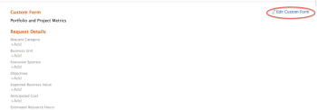

# Een aangepast formulier toevoegen aan een bedrijfscase

Aangepaste Forms wordt gebruikt om informatie te verzamelen die niet in bestaande Adobe Workfront-velden wordt weergegeven.

Voor meer informatie over het creëren van Douane Forms, zie het artikel [&#x200B; een douaneformulier &#x200B;](/help/quicksilver/administration-and-setup/customize-workfront/create-manage-custom-forms/form-designer/design-a-form/design-a-form.md) creëren.

## Toegangsvereisten

<!--Audit: 06/2025-->

+++ Breid uit om de toegangseisen voor de functionaliteit in dit artikel weer te geven.

<table style="table-layout:auto"> 
 <col> 
 <col> 
 <tbody> 
  <tr> 
   <td role="rowheader">
Adobe Workfront-pakket
</td> 
   <td> 
Prime of hoger

  </tr> 
  <tr> 
   <td role="rowheader">
Adobe Workfront-licentie/p&gt;</td> 
   <td> 
   
Standard 
 
   
Plan 
 </td> 
  </tr> 
  <tr> 
   <td role="rowheader">Configuraties op toegangsniveau</td> 
   <td> 
Toegang tot projecten bewerken
  </td> 
  </tr> 
  <tr> 
   <td role="rowheader">
Objectmachtigingen
</td> 
   <td> 
Rechten voor het project beheren of hoger
  </td> 
  </tr> 
 </tbody> 
</table>

Voor informatie, zie [&#x200B; vereisten van de Toegang in de documentatie van Workfront &#x200B;](/help/quicksilver/administration-and-setup/add-users/access-levels-and-object-permissions/access-level-requirements-in-documentation.md).

+++

## Aangepaste Forms aan projecten koppelen

U kunt Aangepaste Forms op de volgende gebieden aan een project koppelen:

* Wanneer het uitgeven van een project, in de sectie van de Details van het Project.
* Wanneer het uitgeven van een project, in het Edit vakje van het Project.
* Wanneer het uitgeven van veelvoudige projecten in bulk, van een lijst van projecten.

  Voor informatie over het vastmaken van douaneformulieren aan projecten terwijl het uitgeven van één of veelvoudige projecten, zie het artikel [&#x200B; projecten &#x200B;](../../../manage-work/projects/manage-projects/edit-projects.md) uitgeven.

* Bij het bouwen van het BedrijfsGeval van een project, in het BedrijfsGeval zoals die in dit artikel wordt beschreven.

Voor informatie over het vastmaken van douaneformulieren aan voorwerpen, zie [&#x200B; een douaneformulier aan een voorwerp &#x200B;](../../../workfront-basics/work-with-custom-forms/add-a-custom-form-to-an-object.md) toevoegen.

## Aangepaste Forms aan de bedrijfscase koppelen

Als u een aangepaste versie wilt toevoegen van een Business Case, moet uw Workfront-beheerder deze optie selecteren in Setup. Voor meer informatie over het toelaten van douaneformulieren in Opstelling, zie [&#x200B; systeem-brede projectvoorkeur &#x200B;](../../../administration-and-setup/set-up-workfront/configure-system-defaults/set-project-preferences.md) vormen.

Een aangepast formulier bijvoegen:

1. Ga naar het project u de vorm aan wilt vastmaken, dan klik **BedrijfsGeval** in het linkerpaneel. De Business Case-displays.

1. In de **sectie van de Vorm van de Douane**, selecteer de douanevorm u van het drop-down menu wilt vastmaken. De douanevorm verschijnt in de **Toegevoegde vormen** hieronder sectie.

1. (Optioneel) Als u de aangepaste formulierdetails wilt uitbreiden, klikt u op de pijl links van de aangepaste formuliernaam.

   

<!--1. (Optional) Select **Edit Custom Form**.  
  

1. (Optional) Specify information in the fields of the custom form, then click **Save** . -->
