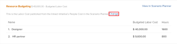

# De middelen van de begroting in BedrijfsGeval die de Planner van het Middel gebruiken

<!--Audited: 06/2025-->

Als deel van middelplanning, kunt u de project-vlakke Planner van het Middel gebruiken om de baanrollen noodzakelijk voor de voltooiing van het werk in een project te voorzien wanneer u het bedrijfscase bouwt.

Voor meer informatie over het creëren van een bedrijfsgeval, zie [ een BedrijfsGeval voor een project ](../../../manage-work/projects/define-a-business-case/create-business-case.md) creëren.

>[!TIP]
>
>De informatie u in de project-vlakke Planner van het Middel ingaat is ook zichtbaar in de systeem-vlakke Planner van het Middel. Het omgekeerde geldt ook. Voor informatie over de Planner van het Middel, zie [ Overzicht van de Planner van het Middel ](../../../resource-mgmt/resource-planning/get-started-resource-planner.md).

U kunt middelen in de bedrijfscase ook begroten gebruikend de Planner van het Scenario van Adobe Workfront. Voor meer informatie, zie [ middelen van de Begroting in het BedrijfsGeval gebruikend de Planner van het Scenario ](../../../manage-work/projects/define-a-business-case/budget-resources-in-business-case-use-scenario-planner.md).

## Toegangsvereisten

+++ Breid uit om de toegangseisen voor de functionaliteit in dit artikel weer te geven. 

<table style="table-layout:auto"> 
 <col> 
 <col> 
 <tbody> 
  <tr> 
   <td role="rowheader">
Adobe Workfront-plan
</td> 
   <td> 
Prime of hoger

    </td> 
  </tr> 
  <tr> 
   <td role="rowheader">
Adobe Workfront-licentie
</td> 
   <td> 
Licht of hoger

   
Controleren of hoger

<b>BELANGRIJK:</b>
 
   
U moet over een Standard- of Plan-licentie beschikken om de informatie over het budgetteren van bronnen te wijzigen. 
 
   </td> 
  </tr> 
  <tr> 
   <td role="rowheader">
Configuraties op toegangsniveau
</td> 
   <td> 
Toegang tot het volgende bewerken: 
 
    <ul> 
     <li> 
Projecten
 </li> 
     <li> 
Bronbeheer
 </li> 
     <li> 
Financiële gegevens
 </li> 
    </ul> </td> 
  </tr> 
  <tr> 
   <td role="rowheader">
Objectmachtigingen
</td> 
   <td> 
Rechten voor het project beheren
 </td> 
  </tr> 
 </tbody> 
</table>

Voor informatie, zie [ vereisten van de Toegang in de documentatie van Workfront ](/help/quicksilver/administration-and-setup/add-users/access-levels-and-object-permissions/access-level-requirements-in-documentation.md).

+++

## Vereisten

Voordat u begint, moet u het volgende doen:

* Voldoe aan alle voorwaarden voor middelplanning in Adobe Workfront. Voor informatie, zie [ overzicht van de Planner van het Middel ](../../../resource-mgmt/resource-planning/get-started-resource-planner.md).

* Brongroepen koppelen aan het project.

  <!--
  
(NOTE:(you must have tasks assigned to job roles and users on the project - this is optional because the users and their roles come from the pools))

  -->

  >[!NOTE]
  >
  >U kunt geen middelen begroten die aan kwesties in de BedrijfsGeval worden toegewezen. U kunt ze begroten in de bronnenplanner op systeemniveau. Voor meer informatie over de Planner van het Middel, zie [ Overzicht van de Planner van het Middel ](../../../resource-mgmt/resource-planning/get-started-resource-planner.md).

* Hoewel dit geen voorwaarde is, adviseren wij ook dat u op Geplande Uren voor de taken op het project wijst. Dit helpt u begrijpen hoeveel werk een taak zou kunnen moeten voltooien die met het besluit van veel tijd de middelen voor de voltooiing van de taak zou moeten worden begroot. Voor informatie over het associëren van taken met Geplande Uren, zie [ taken ](../../../manage-work/tasks/manage-tasks/edit-tasks.md) uitgeven.

## Bronnenpools toepassen op een project en budgetbronnen in de bedrijfscase

>[!IMPORTANT]
>
>U kunt uw middelen voor een periode van 15 jaar begroten. Als u middelen begroot voor een project met een looptijd van meer dan 15 jaar, is de begrotingsinformatie misschien niet correct.

Om de Pools van het Middel en de middelen van het begrotingsproject in het BedrijfsGeval voor een project zonder Groep van het Middel toe te passen:

1. Ga naar het project waarvoor u middelen wilt begroten.
1. Klik **Bedrijfs Geval** in het linkerpaneel.
1. (Voorwaardelijk) als uw bedrijf geen vergunning voor de Planner van het Scenario van Workfront heeft, klik **uitgeven Middel die** in de **Begrotende sectie van het Middel** in de begroting plaatst, dan met stap 5 verdergaat.

   <!--
   
(NOTE: ensure it stays right - this is 5 instead of 6 because step 2 won't print for nwe)

   -->

1. (Facultatief en voorwaardelijk) als de projectinformatie van een initiatief op de Planner Scenario is gepubliceerd, doe één van het volgende:

   * Selecteer de Planner van het Middel in **kiezen welke uren om de Begrotende Kosten van de Arbeid van het project** gebied te gebruiken, dan **kiezen** > **Middel het Begrotend** uitgeven.

   <!-- -->

   * Als de Planner van het Scenario voor het in de begroting opnemen van middelen voor het project werd geselecteerd, klik **Verandering** > **geef het Middel in de begroting op**.

     <!-- -->

   Dit gebruikt de begrotingsuren van het project om de begrote arbeidskosten voor het project te berekenen.

   De Scenario Planner is alleen beschikbaar in de nieuwe Adobe Workfront-ervaring en vereist een aanvullende licentie. Voor informatie over de Planner van het Scenario van Workfront, zie [ het overzicht van de Planner van het Scenario ](../../../scenario-planner/scenario-planner-overview.md).

   >[!NOTE]
   >
   >Wij adviseren dat u het besluit neemt of om de Planner van het Middel of de Planner van het Scenario te gebruiken wanneer u begint werkend aan een project. Het vaak schakelen tussen beide tijdens de duur van het project kan tot inconsistenties in de manier leiden u uw middelen voor het project begroot.

1. Op het **Uitgezochte Pool van het Middel** gebied, specificeer één of verscheidene **Pools van het Middel**.

   U moet alleen bronnenpools opgeven die zijn gevuld met actieve gebruikers.

   >[!TIP]
   >
   >Als het project reeds met de Pools van het Middel wordt geassocieerd, toont de Planner van het Middel door gebrek. Om meer Pools van het Middel aan het project toe te voegen, geef het project uit. Voor informatie over het uitgeven van een project, zie [ projecten ](../../../manage-work/projects/manage-projects/edit-projects.md) uitgeven.

1. Klik **toepassen**.

   De Planner van het Middel wordt getoond, voor het geselecteerde project.

   Door gebrek, zijn de eerste 20 baanrollen verbonden aan dit project vermeld in de sectie van de Begroting van het Middel in alfabetische orde.

   Voor meer informatie over de Planner van het Middel, zie [ Overzicht van de Planner van het Middel ](../../../resource-mgmt/resource-planning/get-started-resource-planner.md).

   <!---->

1. (Optioneel en voorwaardelijk) Vergroot de taakrollen om de gebruikers te zien die aan deze rollen zijn gekoppeld.

   >[!NOTE]
   >
   >De actieve gebruikers worden getoond onder de baanrollen verbonden aan hen slechts als zij aan de volgende criteria voldoen:
   >
   >   
   >   
   >   * Zij behoren tot één van de Groepen van Middel van het project.
   >   * Ze hebben de toegewezen uren begroot.
   >   * Zij worden geassocieerd met één van de baanrollen van het project.
   >   
   >

1. Klik **vandaag** om aan timeframe van vandaag terug te keren.
1. (Facultatief) klik **Week**, **Maand** of **Kwartaal** aan vertoningsinformatie voor het project in verschillende timeframes.
1. (Facultatief) klik het **drop-down menu van de Uren** Uren **,** VTE **, of** Kosten **om te veranderen hoe de informatievertoningen in de Planner van het Middel.** Standaardweergave in uren.

1. (Facultatief) klik **Uitvoer** om de Planner van het Middel naar een dossier van Excel uit te voeren.

   >[!NOTE]
   >
   >U kunt gegevens gedurende maximaal 12 tijdsperioden tegelijk exporteren.

1. (Facultatief) klik het **Volledige pictogram van het Scherm**  om de Planner van het Middel op het volledige schermwijze te tonen.

1. Werk het **BDG** (Begonnen uren) gebied met Uur, FTE, of de waarden van Kosten voor de gebruikers, de rollen, of het project bij door één van het volgende te doen:

   * Geef handmatig een schatting van de hoeveelheid uren, FTE of Kostenwaarden voor rollen, gebruikers of het project.

     of

   * Klik het **pictogram van Opties** voor het project of de baanrollen en selecteer een optie om de uren voor rollen, gebruikers, of het project automatisch te begroten.

   Voor meer informatie over het in de begroting opnemen in de Mening van het Project van de Planner van het Middel, zie [ de middelen van de Begroting in de Planner van het Middel gebruikend de meningen van het Project en van de Rol ](../../../resource-mgmt/resource-planning/budget-resources-project-role-views-resource-planner.md).

   >[!NOTE]
   >
   >U kunt uren, FTEs, of kosten voor uw middelen voor om het even welk tijdkader begroten dat in het het Begrotinggebied van het Middel wordt getoond, onafhankelijk van de chronologie van het project. Als u bijvoorbeeld wilt aangeven dat uw bronnen mogelijk niet beschikbaar zijn tijdens de tijdlijn van het project (waar ze zijn gekoppeld aan geplande uren), maar wel op een ander tijdstip beschikbaar zijn, kunt u dit doen door de bronnen in de begroting op te nemen voor tijdframes waarin de geplande uren nul zijn, als dat het moment is waarop ze beschikbaar zijn om te werken.

1. (Facultatief) om te begrijpen of u de in de begroting opgenomen Uren, FTEs, of Kosten aan een ander tijdkader kunt bewegen, klik het **pictogram van Opties**, dan **Adjust het Begrotende Datums**.

   Voor meer informatie over het aanpassen van in de begroting opgenomen data, zie [ het opnemen van data in de Planner van het Middel ](../../../resource-mgmt/resource-planning/adjust-budgeting-dates.md) aanpassen.

1. Klik **sparen**.

   Als u de Tarieven van Kosten per Uur verbonden aan uw baanrollen hebt, berekent het in de begroting opnemen van de middelen in het gebied van de Begroting van het Middel de **Begrotende Kosten van de Arbeid** van het project. De begrote arbeidskosten worden getoond in het gebied van de Begroting van het Middel van het BedrijfsGeval en in het BedrijfsGevallenoverzicht.

   >[!TIP]
   >
   >Kostendenvertoningen in het BedrijfsGeval in de valuta van het project.

   De informatie over budgettering die in het bedrijfscase wordt gespecificeerd, wordt ook getoond in de Planner van het Middel.

   Wanneer u een project kopieert, hebt u de optie om de Begrotingshours aan het nieuwe project ook te kopiëren. Alleen uren die in de bronnenplanner zijn opgenomen, worden gekopieerd. Voor meer informatie, zie [ een project ](../manage-projects/copy-project.md) kopiëren.
