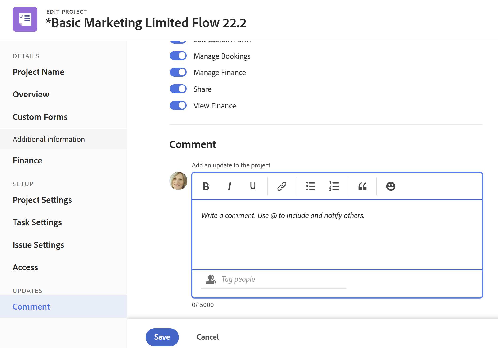
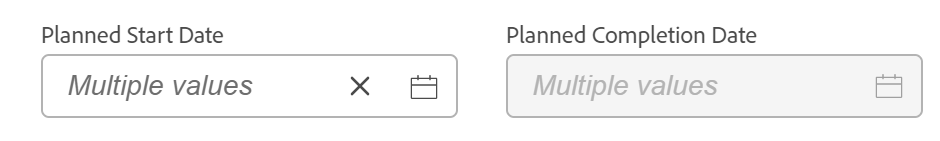

# Projecten bewerken

<!--Audited: 07/2024-->

<!--The highlighted information on this page refers to functionality not yet generally available. It is available only in the Preview environment for all customers. After the monthly releases to Production, the same features are also available in the Production environment for customers who enabled fast releases.    

For information about fast releases, see [Enable or disable fast releases for your organization](/help/quicksilver/administration-and-setup/set-up-workfront/configure-system-defaults/enable-fast-release-process.md). -->

<!--

***Linked to many articles,

The Resource Pools part also duplicates in the "Working with Resource Pools" article 

The Update Type section is also documented in Selecting the Project Update Type article

Keep the reference link to the other article that also documents the Update Type) 

(NOTE 2: information described here also exists in these articles:

** Project Overview area

**Manage project Finance area

If you need to update just one field, check to see if that field is also listed there and update in both places.)

-->

U kunt een project in Adobe Workfront zo vaak uitgeven zoals vaak nodig. Wij adviseren dat u projecten na hun statusveranderingen in Huidig minimaal uitgeeft, om verwarring te vermijden door berichten over de veranderingen naar het volledige projectteam te verzenden.

Ideaal gezien, zou u een project moeten uitgeven wanneer het project in de status van de Planning is. Voor informatie over het projectteam, zie [&#x200B; Overzicht van het Team van het Project &#x200B;](../../../manage-work/projects/planning-a-project/project-team-overview.md).

## Toegangsvereisten

+++ Breid uit om de toegangseisen voor de functionaliteit in dit artikel weer te geven.

<table style="table-layout:auto"> 
 <col> 
 <col> 
 <tbody> 
  <tr> 
   <td role="rowheader">Adobe Workfront-pakket</td> 
   <td> 
Alle
 </td> 
  </tr> 
  <tr> 
   <td role="rowheader">Adobe Workfront-licentie</td> 
   <td>
Standard
 
   
Plan
 </td> 
  </tr> 
  <tr> 
   <td role="rowheader">Configuraties op toegangsniveau</td> 
   <td> 
Toegang tot projecten bewerken
 </td> 
  </tr> 
  <tr> 
   <td role="rowheader">Objectmachtigingen</td> 
   <td> 
     
Rechten voor een project beheren
 
     </td> 
  </tr> 
 </tbody> 
</table>

*For meer detail over de informatie in deze lijst, zie [&#x200B; vereisten van de Toegang in de documentatie van Workfront &#x200B;](/help/quicksilver/administration-and-setup/add-users/access-levels-and-object-permissions/access-level-requirements-in-documentation.md).

+++

<!--Old:

<table style="table-layout:auto"> 
 <col> 
 <col> 
 <tbody> 
  <tr> 
   <td role="rowheader">Adobe Workfront plan</td> 
   <td> 
Any
 </td> 
  </tr> 
  <tr> 
   <td role="rowheader">Adobe Workfront license*</td> 
   <td>
New: Standard 
 
   Or
   
Current: Plan 
 </td> 
  </tr> 
  <tr> 
   <td role="rowheader">Access level configurations</td> 
   <td> 
Edit access to Projects
 </td> 
  </tr> 
  <tr> 
   <td role="rowheader">Object permissions</td> 
   <td> 
     
Manage permissions to a project 
 
     </td> 
  </tr> 
 </tbody> 
</table>

*For more detail about the information in this table, see [Access requirements in Workfront documentation](/help/quicksilver/administration-and-setup/add-users/access-levels-and-object-permissions/access-level-requirements-in-documentation.md).-->

## Beperkingen voor het bewerken van projecten

Er zijn enkele beperkingen die kunnen voorkomen dat u projecten kunt bewerken.

Houd rekening met het volgende wanneer u projecten bewerkt:

* U kunt geen projecten uitgeven die in een Proces van de Goedkeuring zijn, behalve registrerentijd en het veranderen van de Status.
* U kunt documenten of malplaatjes aan een project vastmaken dat een status van Voltooid heeft, Dead, of in Hangende Goedkeuring slechts als uw beheerder van Workfront of een groepsbeheerder deze functionaliteit op het gebied van de Voorkeur van het Project toeliet. Voor informatie over het plaatsen van projectvoorkeur, zie [&#x200B; systeem-brede projectvoorkeur &#x200B;](../../../administration-and-setup/set-up-workfront/configure-system-defaults/set-project-preferences.md) vormen.
* U kunt de volgende informatie over een project alleen bewerken in de status Dead of Voltooid:

   * Bestaande uitgaven wijzigen.
   * Aangepaste formulieren toevoegen, verwijderen of bewerken.

## Een project bewerken

Door een project uit te geven kunt u informatie en montages voor het project, evenals taken en kwesties op het project wijzigen.

Sommige montages die in dit artikel worden vermeld zouden van hun standaardstatus door hun staat in het malplaatje kunnen worden gewijzigd waarvan het project werd gecreeerd.

Voor informatie over het uitgeven van malplaatjes, zie [&#x200B; projectmalplaatjes &#x200B;](../../../manage-work/projects/create-and-manage-templates/edit-templates.md) uitgeven.

Voor informatie over het creëren van een project van een malplaatje, zie [&#x200B; een project creëren gebruikend een malplaatje &#x200B;](/help/quicksilver/manage-work/projects/create-projects/create-project-from-template.md).

{{step1-to-projects}}

1. (Facultatief) klik **Projecten I** of **Projecten I Bezit** in de hoger-juiste hoek om projecten te tonen waar u de eigenaar of de projecten bent waar u deel van het projectteam uitmaakt.

   

   >[!NOTE]
   >
   >Als u een groepsbeheerder bent, kunt u de projecten van uw groep in het gebied van Groepen evenals in het gebied van Projecten zien en uitgeven. Voor meer informatie, zie [&#x200B; tot stand brengen en wijzigen de projecten van een groep &#x200B;](../../../administration-and-setup/manage-groups/work-with-group-objects/create-and-modify-a-groups-projects.md).

1. Klik de naam van het project u wilt uitgeven om de projectpagina te openen.

1. (Facultatief) om beperkte informatie over een project uit te geven, klik **Details van het Project** in het linkerpaneel. Ga naar stap 5 als u alle informatie over het project wilt bewerken. <!--accurate?!-->

   

   >[!NOTE]
   >
   >Afhankelijk van hoe uw Workfront-beheerder of groepsbeheerder uw lay-outsjabloon heeft gewijzigd, kunnen de velden in het gebied Projectdetails opnieuw worden gerangschikt of niet worden weergegeven. Voor informatie, zie [&#x200B; de mening van Details aanpassen gebruikend een lay-outmalplaatje &#x200B;](../../../administration-and-setup/customize-workfront/use-layout-templates/customize-details-view-layout-template.md).

   Ga als volgt te werk om de gegevens in de sectie Details te bewerken:

   1. (Facultatief) klik **Vouw Alle** pictogram  in de hoger-juiste hoek om alle gebieden samen te vouwen.
   1. (Facultatief en voorwaardelijk) wanneer een gebied wordt doen ineenstorten, klik de **juist-richt pijl**  naast elk gebied om het gebied uit te breiden u wilt uitgeven.
   1. Raadpleeg de volgende artikelen voor meer informatie over het bewerken van informatie op het tabblad Projectdetails:

      * [&#x200B; beheert informatie in het gebied van het projectoverzicht &#x200B;](../../../manage-work/projects/manage-projects/understand-project-overview-area.md)
      * [Informatie beheren in het gebied Projectfinanciering](../../../manage-work/projects/project-finances/manage-project-finance-area.md)

   1. (Facultatief) om een douaneformulier vast te maken, begin de naam van een vorm in **te typen voeg douaneformulier** toe, dan selecteer het wanneer het in de lijst toont, dan klik **sparen Veranderingen**.
   1. (Facultatief) klik het **pictogram van de Uitvoer** pictogram van de Uitvoer  Uitvoer **.** Selecteer een van de volgende opties:

      * Alles selecteren (wordt alleen weergegeven als er ten minste één aangepast formulier is gekoppeld)
      * Overzicht
      * De naam van een of meerdere aangepaste formulieren

      Het PDF-bestand wordt naar uw computer gedownload.

      

      Voor meer informatie, zie [&#x200B; de douaneformulieren en objecten details van de Uitvoer &#x200B;](../../../workfront-basics/work-with-custom-forms/export-custom-forms-details.md).

   Voor informatie over de gebieden zichtbaar in de sectie van de Details van het Project, ga met het uitgeven van het project in het Edit vakje van het Project zoals hieronder beschreven verder.
1. Om alle informatie over het project uit te geven, klik **Meer** menu  naast de naam van het project, dan klik **uitgeven**.

   of

   Van een lijst van projecten, selecteer één of veelvoudige projecten, dan klik **uitgeven** pictogram  bij de bovenkant van de lijst uitgeven.

   Voor meer informatie over het uitgeven van projecten in bulk, zie de sectie [&#x200B; projecten in bulk &#x200B;](#edit-projects-in-bulk) in dit artikel uitgeven.

   Het **geeft de doos van het Project** uit opent.

   >[!IMPORTANT]
   >
   >U moet over beheermachtigingen voor het project beschikken om de optie Bewerken te kunnen zien.

   Alle projectvelden zijn beschikbaar in het vak Project bewerken en zijn gegroepeerd op de gebieden in het linkerdeelvenster.

   >[!NOTE]
   >
   >Afhankelijk van de manier waarop uw Workfront-beheerder of groepsbeheerder uw lay-outsjabloon heeft gewijzigd, kunnen de gebieden in het linkerdeelvenster van het vak Project bewerken of de velden in deze gebieden opnieuw worden gerangschikt of niet worden weergegeven. Voor informatie, zie [&#x200B; de mening van Details aanpassen gebruikend een lay-outmalplaatje &#x200B;](../../../administration-and-setup/customize-workfront/use-layout-templates/customize-details-view-layout-template.md).

1. (Voorwaardelijk) als u het **Meer** menu klikte en dan **&#x200B;**&#x200B;uitgeeft, werk informatie in om het even welke volgende die gebieden bij in het linkerpaneel worden vermeld:

   * [&#x200B; de Naam van het Project &#x200B;](#project-name)
   * [Overzicht](#overview)
   * [&#x200B; Aangepaste Forms &#x200B;](#custom-forms)
   * [&#x200B; Financiën &#x200B;](#finance)
   * [&#x200B; Montages van het Project &#x200B;](#project-settings)
   * [&#x200B; Montages van de Taak &#x200B;](#task-settings)
   * [&#x200B; Montages van de Uitgave &#x200B;](#issue-settings)
   * [Toegang](#access)
   * [Opmerking](#comment)

   >[!NOTE]
   >
   >Afhankelijk van de manier waarop uw Workfront-beheerder onze lay-outsjabloon instelt voor het gebied Details van het project, kunnen de secties en velden in het vak Project bewerken in uw omgeving verschillen. Voor informatie, zie [&#x200B; de mening van Details aanpassen gebruikend een lay-outmalplaatje &#x200B;](../../../administration-and-setup/customize-workfront/use-layout-templates/customize-details-view-layout-template.md).

### Projectnaam {#project-name}

1. Bewerk uw project zoals hierboven beschreven.
1. Klik **Naam van het Project** in het linkerpaneel.

   

1. Werk de naam van het project bij.

   U kunt de projectnaam niet bewerken wanneer u projecten bulksgewijs bewerkt.

### Overzicht {#overview}

1. Bewerk uw project zoals hierboven beschreven.
1. Klik **Overzicht** in het linkerpaneel.

   

1. Werk de volgende informatie over het project bij:

   <table style="table-layout:auto"> 
      <col> 
      <col> 
      <tbody> 
      <tr> 
         <td role="rowheader"><strong> Beschrijving </strong> </td> 
         <td> 
Voeg aanvullende informatie toe over het project.
 </td> 
      </tr> 
      <tr> 
         <td role="rowheader"><strong> Status </strong> </td> 
         <td> 
Selecteer de status van het project. U kunt een project niet markeren voltooid voordat alle taken en problemen zijn voltooid. Voor informatie over projectstatussen, zie <a href="../../../administration-and-setup/customize-workfront/creating-custom-status-and-priority-labels/project-statuses.md" class="MCXref xref"> Toegang tot de lijst van de statussen van het systeemproject </a>
 </td> 
      </tr> 
      <tr> 
         <td role="rowheader"><strong> Prioriteit </strong> </td> 
         <td> 
 
Dit is enkel een visuele vlag voor u die u toestaat om aan uw projecten voorrang te geven.
 
Afhankelijk van de projectvoorkeuren die door uw Workfront-beheerder zijn geselecteerd, kunnen de namen van prioriteiten voor u anders zijn. Voor meer informatie over het uitgeven van prioriteiten, zie <a href="../../../administration-and-setup/customize-workfront/creating-custom-status-and-priority-labels/create-customize-priorities.md" class="MCXref xref"> prioriteiten creëren en aanpassen </a>
 
 </td> 
      </tr> 
      <tr> 
         <td role="rowheader"><strong> URL </strong> </td> 
         <td> 
Geef een webkoppeling op die betrekking heeft op informatie over dit project.
 </td> 
      </tr> 
      <tr> 
         <td role="rowheader"><strong> Type van Voorwaarde </strong> </td> 
         <td> 
Selecteer een van de volgende Condition Types: 
         <ul> 
         <li><strong> Handboek:</strong> de projecteigenaar plaatst manueel de voorwaarde op het project.</li> 
         <li><strong> Status van de Voortgang:</strong> Workfront plaatst automatisch de voorwaarde die op de Status van de Voortgang van taken op de Kritieke Weg wordt gebaseerd. Voor meer informatie over het begrip van de Status van de Voortgang, zie <a href="../../../manage-work/tasks/task-information/task-progress-status.md" class="MCXref xref"> Overzicht van de Status van de Voortgang van de Taak </a>.</li> 
         </ul>
Uw beheerder van Workfront  of een groepsbeheerder  selecteert het gebrek voor hoe de voorwaarde van de projecten voor uw systeem  of uw groep  wordt berekend. Voor informatie over het plaatsen van projectgebreken, zie <a href="../../../administration-and-setup/set-up-workfront/configure-system-defaults/set-project-preferences.md" class="MCXref xref"> systeem-brede projectvoorkeur </a> vormen. 

 </td> 
      </tr> 
      <tr> 
         <td role="rowheader"><strong> Voorwaarde </strong> </td> 
         <td> 
 
(Toont slechts nadat u <strong> Handboek </strong> voor het <strong> Type van Voorwaarde </strong> selecteert): Selecteer een Voorwaarde om erop te wijzen hoe het project gaat. 
 
Voor informatie hoe de projectvoorwaarden automatisch of manueel kunnen worden geplaatst, zie <a href="../../../manage-work/projects/manage-projects/project-condition-and-condition-type.md" class="MCXref xref"> Overzicht van de Voorwaarde van het Project en Type van Voorwaarde </a>
 
 </td> 
      </tr> 
      <tr> 
         <td role="rowheader"><strong> Wijze van het Programma </strong> </td> 
         <td> 
Geef op of het project gepland is vanaf de begindatum of vanaf de einddatum. Deze selectie bepaalt de geplande data van de taken betreffende het project. 
         <ul> 
         <li><strong> Datum van het Begin </strong>: De eerste taak van het project heeft de zelfde Geplande Datum van het Begin zoals het project door gebrek. Voor informatie over de taak Geplande Datum van het Begin, zie <a href="../../../manage-work/tasks/task-information/task-planned-start-date.md" class="MCXref xref"> Overzicht van de taak Geplande Datum van het Begin </a>. De projecttijdlijn berekent vanaf de begindatum en de einddatum van het project wordt door het systeem berekend op basis van de duur van alle taken. </li> 
         <li><strong> Datum van de Voltooiing </strong>: De laatste taak van het project heeft de zelfde Geplande Datum van de Voltooiing zoals het project. De projecttijdlijn berekent vanaf de afsluitende datum en de begindatum van het project wordt door het systeem berekend door de duur van alle taken af te trekken van de afsluitende datum van het project. </li> 
         </ul>
Uw beheerder van Workfront  of een groepsbeheerder  selecteert de standaardwijze die van het Programma voor uw systeem of uw groep plaatst. Voor informatie over het plaatsen van projectgebreken, zie <a href="../../../administration-and-setup/set-up-workfront/configure-system-defaults/set-project-preferences.md" class="MCXref xref"> systeem-brede projectvoorkeur </a> vormen.

 </td> 
      </tr> 
      <tr> 
         <td role="rowheader"><strong> Geplande Datum en tijd van het Begin </strong> </td> 
         <td> 
 
Specificeer de datum wanneer u <strong> Programma van de Datum van het Begin </strong> selecteert.  
 
Dit is een read-only gebied wanneer u <strong> Programma van de Datum van de Voltooiing </strong> selecteert. 
 
 </td> 
      </tr> 
      <tr> 
         <td role="rowheader"><strong> Geplande Datum en tijd van de Voltooiing </strong> </td> 
         <td> 
Specificeer de datum wanneer u <strong> Programma van de Datum van de Voltooiing </strong> selecteert. 
 
Dit is een read-only gebied wanneer u <strong> Programma van de Datum van het Begin </strong> selecteert. 
 </td> 
      </tr> 
      <tr> 
         <td role="rowheader"><strong>Portfolio</strong></td> 
         <td>Geef een Portfolio aan waartoe het project behoort. U moet eerst een Portfolio maken voordat deze in de vervolgkeuzelijst wordt weergegeven. Alleen actieve portfolio's kunnen aan een project worden gekoppeld. Zie <a href="../../../manage-work/portfolios/create-and-manage-portfolios/create-portfolios.md" class="MCXref xref"> Een portfolio maken </a> voor meer informatie over het maken van portfolio's.
         
<b>OPMERKING</b>

         
U moet over beheerdersmachtigingen voor het portfolio beschikken om het aan het project toe te voegen of te verwijderen.

      </td> 
      </tr> 
      <tr> 
         <td role="rowheader"><strong>Programma</strong></td> 
         <td> 
Als u een Portfolio voor het project selecteert, specificeer een Programma voor het project. Niet alle portfolio's hebben een programma. U moet eerst een programma maken voordat het in deze vervolgkeuzelijst wordt weergegeven. Alleen actieve programma's kunnen aan een project worden gekoppeld. 
 
Voor meer informatie over het creëren van programma's, zie <a href="../../../manage-work/portfolios/create-and-manage-programs/create-program.md" class="MCXref xref"> een programma </a> creëren.
 
      
<b>OPMERKING</b>

         
U moet over beheerdersmachtigingen voor het programma beschikken om het aan het project toe te voegen of te verwijderen.
   
      </td> 
      </tr> 
      <tr> 
         <td role="rowheader"><strong>Groep</strong></td> 
         <td> 
 
Geef de naam op van de groep die aan het project is gekoppeld. 
Dit is een verplicht veld. U kunt geen project hebben dat niet aan een groep wordt geassocieerd. 
 
U kunt ervoor zorgen dat u de juiste groep selecteert door de muisaanwijzer boven de groep te plaatsen en op het informatiepictogram  naast de groep te klikken. Hier wordt knopinfo weergegeven met informatie over de groep, zoals de hiërarchie van de bovenliggende groepen en de bijbehorende beheerders.
 Door gebrek, wordt één van de volgende groepen automatisch geassocieerd met een project wanneer het wordt gecreeerd, tenzij u een verschillende groep specificeert:
 
         <ul> 
         <li> 
 wanneer het project van het gebied van Projecten wordt gecreeerd, wordt de Groep van het Huis van de projectschepper geassocieerd met het project. 
 
Dit is ook waar wanneer het project van de sectie van Projecten in een portefeuille of een programma wordt gecreeerd.
 </li> 
         <li> 
Wanneer het project van de belangrijkste pagina van een groep in het gebied van de Opstelling wordt gecreeerd, wordt die groep geassocieerd met het project.
 </li> 
         </ul> 
 
  
 
         
<b>NOTITIES</b>

         <ul>
         <li>
Als het project, of zijn taken of kwesties met een groep-vlakke douanestatus worden geassocieerd, zou het veranderen van de Groep van het project de Status van het project, de taken, of de kwesties kunnen veroorzaken om te veranderen om de nieuwe groep aan te passen.
</li>
         <li>
Als het project, of zijn taken of kwesties reeds met een groep-vlakke goedkeuringsproces gebruikend groep-vlakke douanestatus worden geassocieerd, zou het veranderen van de groep een conflict tussen de goedkeuringsstatussen van de vorige groep en die op het systeemniveau kunnen tot stand brengen.

         
U kunt overwegen de goedkeuringsprocessen op groepsniveau voor het project of de taken of problemen ervan te verwijderen voordat u de groep bijwerkt.

         
Voor informatie over het creëren van groep-vlakke goedkeuringsprocessen, zie <a href="../../../administration-and-setup/manage-groups/work-with-group-objects/create-and-modify-groups-approval-processes.md" class="MCXref xref"> groep-vlakke goedkeuringsprocessen </a>.

         
Voor informatie over het creëren van een groep-vlakke douanestatus, zie <a href="../../../administration-and-setup/manage-groups/manage-group-statuses/create-or-edit-a-group-status.md" class="MCXref xref"> een groepsstatus </a> creëren of uitgeven
</li></ul> </td> 
      </tr> 
      <tr> 
         <td role="rowheader"><strong> Bedrijf </strong> </td> 
         <td> 
Geef een bedrijf op dat aan het project is gekoppeld. U moet een bedrijf tot stand brengen alvorens u het met een project kunt associëren. Alleen actieve bedrijven kunnen met een project worden geassocieerd. Voor informatie over het creëren van bedrijven, zie <a href="../../../administration-and-setup/set-up-workfront/organizational-setup/create-and-edit-companies.md" class="MCXref xref"> bedrijven </a> creëren en uitgeven.
 </td> 
      </tr> 
      <tr> 
         <td role="rowheader"><strong> Eigenaar van het Project </strong> </td> 
         <td> 
Begin de naam van een gebruiker te typen om hen aan het project toe te voegen, dan het te selecteren wanneer het in de lijst toont. De gebruiker wordt toegevoegd aan het projectteam en krijgt automatisch beheermachtigingen voor het project. De gebruiker die als de eigenaar van het Project wordt aangewezen moet een actieve gebruiker van Workfront zijn.

         </td> 
      </tr> 
      <tr> 
         <td role="rowheader"><strong> Sponsor van het Project </strong> </td> 
         <td> 
Begin de naam van een gebruiker te typen om hen aan het project toe te voegen, dan het te selecteren wanneer het in de lijst toont. De gebruiker wordt toegevoegd aan het projectteam en krijgt automatisch de toestemmingen van de Mening aan het project. De gebruiker die is aangewezen als projectsponsor moet een actieve Workfront-gebruiker zijn. 
 </td> 
      </tr> 
      <tr> 
         <td role="rowheader"><strong> Manager van het Middel </strong> </td> 
         <td> 
 Begin de namen van gebruikers te typen om hen aan het project toe te voegen, dan hen te selecteren wanneer zij in de lijst tonen. De gebruikers worden toegevoegd aan het projectteam en krijgen automatisch beheermachtigingen voor het project en kunnen bronnen toewijzen aan de taken en problemen van het project. De gebruikers handhaven leiden toestemmingen op het project zelfs wanneer zij uit het gebied van de Manager van het Middel worden verwijderd. U kunt meerdere Resource Manager opgeven. 
 </td> 
      </tr>

   <tr> 
         <td role="rowheader"><strong> Omgezette Originator van de Uitgave </strong> </td> 
         <td> 
 Standaard wordt in dit veld automatisch de naam ingevuld van de gebruiker die de uitgave heeft gemaakt waarvan het project is omgezet. U kunt deze naam bijwerken met de naam van een andere gebruiker in Workfront.  
 </td> 
      </tr>

   </tbody> 
      </table>

   >[!TIP]
   >
   >Wanneer u de velden Projecteigenaar, Projectsponsor en Resource Manager bijwerkt, ziet u de avatar, de primaire rol van de gebruiker of hun e-mailadres om onderscheid te maken tussen gebruikers met identieke namen.
   >
   >Gebruikers moeten aan ten minste één taakrol zijn gekoppeld om deze te kunnen bekijken terwijl u ze toevoegt.
   >
   >De instelling Contactinfo weergeven moet zijn ingeschakeld op uw toegangsniveau zodat gebruikers de e-mails van gebruikers kunnen bekijken. Voor informatie, zie [&#x200B; toegang van de Verlening tot gebruikers &#x200B;](../../../administration-and-setup/add-users/configure-and-grant-access/grant-access-other-users.md).

1. (Optioneel) Ga door met het bewerken van de volgende secties, afhankelijk van de gegevens die u wilt wijzigen

   of

   Klik **sparen**.

### Aangepaste Forms {#custom-forms}

Afhankelijk van uw toegangsniveau en op uw toestemming op het project, bestaan de volgende scenario&#39;s:

* Als u geen machtiging voor Aangepast formulier bewerken hebt voor het project, kunt u de velden op de gekoppelde aangepaste formulieren niet bewerken. U kunt de velden alleen weergeven op de aangepaste formulieren die zijn gekoppeld aan het project.
* Als u toegang hebt tot een sectie op een aangepast formulier met Weergave (en niet Bewerken), kunt u de velden in die sectie niet bewerken.
* Als u geen toegang hebt tot een sectie op een van de aangepaste formulieren die aan het project zijn gekoppeld, wordt de sectie niet weergegeven in het vak Project bewerken.

Wanneer het selecteren van meer dan één project om hen in bulk uit te geven, bestaan de volgende scenario&#39;s:

* Als u niet de toestemmingen van de Vorm van de Douane op minstens één van de geselecteerde projecten hebt uitgeven, kunt u niet de gebieden op om het even welke in bijlage douaneformulieren uitgeven. U kunt de velden alleen weergeven op de bijgevoegde aangepaste formulieren
* Als u toegang hebt tot een sectie op een aangepast formulier met Weergave (en niet Bewerken), kunt u de velden in die sectie niet bewerken. U kunt de velden in die sectie alleen weergeven.
* Als u geen toegang hebt tot een sectie op een van de aangepaste formulieren die aan ten minste een van de projecten is gekoppeld, wordt de sectie niet weergegeven in het vak Projecten bewerken.
* Als u vereiste gebieden op om het even welke douaneformulieren in bijlage aan alle projecten hebt, en u één gebied selecteert zonder het eigenlijk uit te geven, moet u uw veranderingen op dat gebied verwerpen of informatie toevoegen aan het alvorens u de projecten kunt bewaren u selecteerde. Als u helemaal geen vereist gebied selecteert, kunt u de projecten bewaren u selecteerde zelfs als het vereiste gebied leeg is.

Raadpleeg de volgende artikelen voor informatie over aangepaste toegang tot formulieren:

* [Een aangepast formulier delen](../../../administration-and-setup/customize-workfront/create-manage-custom-forms/share-access-to-a-custom-form.md)
* [Een formulier ordenen en een voorbeeld ervan bekijken](/help/quicksilver/administration-and-setup/customize-workfront/create-manage-custom-forms/form-designer/design-a-form/organize-a-form.md)

Informatie over aangepaste formulieren bewerken tijdens het bewerken van een project:

1. Bewerk uw project zoals hierboven beschreven.
1. Klik **Forms van de Douane** in het linkerpaneel.

   

1. Klik **voeg de doos van de douanevorm** toe en selecteer een vorm van de lijst om het aan het project vast te maken. Standaard worden de eerste 40 formulieren in alfabetische volgorde weergegeven. Als het formulier niet in de lijst wordt weergegeven, typt u de naam en selecteert u het vervolgens wanneer het in de lijst wordt weergegeven.

   >[!NOTE]
   >
   >U moet aangepaste formulieren maken voordat u ze in dit veld kunt selecteren. Alleen actieve aangepaste formulieren worden in de lijst weergegeven. Voor meer informatie over de bouw van douaneformulieren, zie [&#x200B; een douaneformulier &#x200B;](/help/quicksilver/administration-and-setup/customize-workfront/create-manage-custom-forms/form-designer/design-a-form/design-a-form.md) creëren. U kunt maximaal tien aangepaste formulieren aan een project toevoegen.

1. (Voorwaardelijk) Als u een aangepast formulier aan het project hebt gekoppeld, bewerkt u alle velden op het formulier. U moet alle vereiste gebieden specificeren alvorens u het project kunt bewaren.
1. (Facultatief) klik het **pictogram van X** rechts van de naam van een douanevorm om het te verwijderen, dan klik **verwijderen**.
1. (Optioneel) Ga door met het bewerken van de volgende secties, afhankelijk van de gegevens die u wilt wijzigen

   of

   Klik **sparen**.

### Financiën {#finance}

Afhankelijk van uw toegangsniveau en op uw toestemming op het project, bestaan de volgende scenario&#39;s:

* Als u de toegang van de Mening tot Financiële Gegevens en de toestemmingen van de Financiën van de Mening over het project hebt, kunt u de gebieden in de sectie van de Financiën slechts bekijken. U kunt de velden in deze sectie niet bewerken.
* Als u toegang tot financiële gegevens hebt bewerken en de machtigingen Financiën beheren voor het project, kunt u de velden in deze sectie bijwerken.

Wanneer het selecteren van meer dan één project om hen in bulk uit te geven en, bestaan de volgende scenario&#39;s:

* Als u minstens één project selecteert waar u de toestemmingen van de Financiën van de Mening (in plaats van Beheren van Financiën) hebt, kunt u de gebieden in deze sectie voor alle geselecteerde projecten slechts bekijken. U kunt de velden in de sectie Financiën niet bulksgewijs bewerken.
* Als u ten minste één project selecteert waarvoor u geen financiële machtigingen hebt, wordt deze sectie helemaal niet weergegeven.

Velden bewerken in het gebied Financiën:

1. Bewerk uw project zoals hierboven beschreven.
1. Klik **Financiën** in het linkerpaneel.

   

1. Werk de volgende financiële informatie voor het project bij:

   <table style="table-layout:auto"> 
    <col> 
    <col> 
    <tbody> 
     <tr data-mc-conditions=""> 
      <td role="rowheader"><strong> Valuta </strong> </td> 
      <td> 
 
Geef de valuta voor het project op als deze afwijkt van de standaardvaluta van uw systeem. U kunt de valuta van een project niet wijzigen als er al financiële informatie over het project beschikbaar is. Dit veld is niet zichtbaar als u alleen de standaardvaluta in het systeem hebt. 
 
Voor meer informatie over munt, zie <a href="../../../administration-and-setup/manage-workfront/exchange-rates/set-up-exchange-rates.md" class="MCXref xref"> de wisselkoers van de Opstelling </a>. 
 
 </td> 
     </tr> 
     <tr> 
      <td role="rowheader"><strong> Begroting </strong> </td> 
      <td> Geef een budget voor het project op. </td> 
     </tr> 
     <tr> 
      <td role="rowheader"><strong> Methode van de Index van Prestaties van Prestaties </strong> </td> 
      <td> 
Selecteer <b> op uur-Gebaseerde </b>, of <b> op kosten-Gebaseerd </b> om erop te wijzen of de Verwichte metriek van de Waarde van het project (zoals de Index van de Prestaties van Kosten of Geschatte Ware Kosten) gebruikend uren of kosten wordt berekend. 
 
Voor meer informatie over de Methode van de Index van Prestaties, zie <a href="../../../manage-work/projects/project-finances/set-pim.md" class="MCXref xref"> plaats de Methode van de Index van Prestaties (PIM) </a>. 
 
Uw beheerder van Workfront  of een groepsbeheerder  selecteert de methode die van de Index van standaardPrestaties voor uw systeem of uw groep plaatst. Voor informatie over het plaatsen van projectgebreken, zie <a href="../../../administration-and-setup/set-up-workfront/configure-system-defaults/set-project-preferences.md" class="MCXref xref"> systeem-brede projectvoorkeur </a> vormen.
 </td> 
     </tr> 
     <tr> 
      <td role="rowheader"><strong> Schatting bij Voltooiing </strong> </td> 
      <td> 
 
Geef op hoe Workfront de schatting bij voltooiing (EAC) moet berekenen. 

      Selecteer een van de volgende opties: 
      <ul><li><b>Berekenen op projectniveau</b></li>
      <li><b>Omhoog schuiven vanuit taken/subtaken</b></li> </ul>
      
Voor meer informatie over hoe de Schatting bij Voltooiing berekent, zie <a href="../../../manage-work/projects/project-finances/calculate-eac.md" class="MCXref xref"> Schatting bij Voltooiing (EAC) berekenen </a>.
 
Uw Workfront- of groepsbeheerder selecteert de standaardschatting bij voltooiing voor uw systeem of groep. Voor informatie over het plaatsen van projectgebreken, zie <a href="../../../administration-and-setup/set-up-workfront/configure-system-defaults/set-project-preferences.md" class="MCXref xref"> systeem-brede projectvoorkeur </a> vormen.
 
 </td> 
     </tr> 
     <tr> 
      <td role="rowheader"><strong> Gepland Voordeel </strong> </td> 
      <td> 
Schatting wat het geplande voordeel van het project is. Dit wordt gebruikt in het BedrijfsGeval van het project en Portfolio Optimizer. Voor meer informatie over het Geplande Voordeel van een project, zie <a href="../../../manage-work/projects/project-finances/project-planned-benefit.md" class="MCXref xref"> Overzicht van project Gepland Voordeel </a>. Bij de berekening van de nettowaarde van een project wordt rekening gehouden met het geplande voordeel van een project. 
 
Voor meer informatie, zie <a href="../../../manage-work/portfolios/portfolio-optimizer/manage-projects-in-portfolio-optimizer.md" class="MCXref xref"> projecten in de Optimizer van Portfolio beheren: artikelindex </a>. 
 </td> 
     </tr> 
     <tr> 
      <td role="rowheader"><strong> Ware Voordelen </strong> </td> 
      <td> 
Schatting van het werkelijke voordeel van het project. Dit is een valutabedrag dat het voordeel vertegenwoordigt dat uw bedrijf of afdeling zou behalen als dit project is voltooid. 
 </td> 
     </tr> 
      <tr> 
      <td role="rowheader"><strong> Vaste Kosten </strong> </td> 
      <td> 
Geef de vaste kosten voor het project op. Dit is anders dan de loonkosten die voortvloeien uit de uren van het project en de kosten die voortvloeien uit de kosten van het project. De vaste kosten van een project worden in aanmerking genomen bij de berekening van de nettowaarde van een project en maken deel uit van de begrote kosten. 
 </td> 
     </tr> 
     <tr> 
      <td role="rowheader"><strong> Vaste Inkomsten </strong> </td> 
      <td> 
Geef de vaste inkomsten voor het project op. 
 </td> 
     </tr> 
    </tbody> 
   </table>

1. (Optioneel) Ga door met het bewerken van de volgende secties, afhankelijk van de gegevens die u wilt wijzigen.

   of

   Klik **sparen**.

### Projectinstellingen {#project-settings}

1. Bewerk uw project zoals hierboven beschreven.
1. Klik **Montages van het Project** in het linkerpaneel.

   

1. Werk de volgende gegevens bij:

   <table style="table-layout:auto"> 
      <col> 
      <col> 
      <tbody> 
      <tr> 
      <td role="rowheader"><strong> Mijlpaal Weg </strong> </td> 
       <td> 
Selecteer een Mijlpad voor het project. Alleen actieve milestone-paden worden in de lijst weergegeven.
 
Voor meer informatie over de Wegen van de Mijlsteen, zie <a href="../../../administration-and-setup/customize-workfront/configure-approval-milestone-processes/create-milestone-path.md" class="MCXref xref"> een milestone weg </a> creëren.
 </td> 
      </tr> 
      <tr> 
      <td role="rowheader"><strong> Wijze van de Voltooiing </strong> </td> 
      <td> 
Bepaalt hoe het project wordt gemarkeerd als Voltooid. Selecteer een van de volgende opties: 
       <ul> 
       <li>
<strong> Automatisch </strong>: Het project is duidelijk Volledig wanneer alle taken en kwesties worden voltooid.

De status van het project wordt automatisch gewijzigd in Voltooien slechts wanneer de projectstatus Huidig is wanneer de taken worden voltooid. 
</li> 
       <li><strong> Hand </strong>: U moet de Volledige status voor het project manueel selecteren, wanneer alle taken en kwesties worden voltooid.</li> 
       </ul>
 </td> 
       </tr> 
       <tr> 
       <td role="rowheader"><strong>Samenvattingsmodus</strong></td> 
       <td> 
Controls how the parent tasks are marked as Complete. Selecteer een van de volgende opties: 
       <ul> 
       <li><strong> Automatisch </strong>: De oudertaken zijn duidelijk Voltooid en zij werken automatisch hun percentage bij volledig, aangezien de kindtaken worden voltooid en het percentage volledig van de kinderen wordt bijgewerkt. </li> 
       <li><strong> Hand </strong>: U moet het percentage manueel bijwerken volledig en het statuut van de oudertaken, onafhankelijk van welke veranderingen aan de kindtaken worden aangebracht. Hierdoor kunt u een bovenliggende taak markeren die is voltooid, zelfs als de subtaken onvolledig zijn. </li> 
       </ul>
 </td> 
       </tr> 
       <tr> 
       <td role="rowheader"><strong>Type update</strong></td> 
       <td> 
Controles wanneer de veranderingen u aan de projectchronologie aanbrengt op het project of de oudertaken worden bewaard. De volgende wijzigingen in het project activeren bijvoorbeeld een update van de tijdlijn van het project: 
       <ul> 
       <li>Datums van taken bijwerken</li> 
       <li>De voorgangersrelaties van taken wijzigen</li> 
       <li>
Verander ouder-kind verhoudingen, toevoegend of verwijderend taken naast het veranderen van de taakbeperking of het type van duur.

Wanneer de taken bijwerken, werken hun oudervoorwerpen (oudertaken of het project) op de tijd bij die door het Type van Update wordt vermeld. 

Als de bovenliggende objecten niet onmiddellijk na de wijziging worden bijgewerkt wanneer u Automatisch en bij wijziging of Alleen wijziging bijwerken selecteert, vernieuwt u de pagina

Selecteer een van de volgende opties: 

- <strong> Automatisch en op Verandering </strong> (Gebrek die) plaatst: De projectchronologie wordt bijgewerkt telkens als een verandering in het project of in een ander project voorkomt dat het project van (op Verandering) afhankelijk is. De projecttijdlijn wordt ook elke avond bijgewerkt (automatisch).

Dit is het geadviseerde plaatsen voor dit gebied omdat het ervoor zorgt dat het project altijd bijgewerkt is.

Wanneer u een handeling uitvoert op een taak of project waarmee een tijdlijnherberekening wordt gestart, worden alle beschikbare datums direct weergegeven, zodat u kunt doorgaan met werken. Voor projecten met meer dan 100 taken worden datums die langere herberekeningen vereisen kort weergegeven als een vraagteken (tussen 1 en 5 seconden, of tot een minuut voor grote projecten). Dit geeft aan dat de herberekening nog niet is voltooid en dat de datums kunnen worden gewijzigd.

- <strong> Verandering slechts </strong>: De projectchronologie wordt bijgewerkt telkens als een verandering in het project of in een ander project voorkomt dat het project van afhankelijk is. U zou deze optie kunnen willen selecteren als de veranderingen zelden in het project of in andere projecten voorkomen dat de chronologie van afhankelijk is.

- <strong> Automatisch slechts </strong>: De projectchronologie wordt bijgewerkt elke nacht; de chronologie wordt niet onmiddellijk bijgewerkt nadat de veranderingen worden aangebracht.

U zou deze optie kunnen willen selecteren als vele veranderingen elke dag in het project of in andere projecten voorkomen dat de chronologie van afhankelijk is. Houd er echter rekening mee dat u deze instelling hebt gekozen, aangezien het project niet tegelijk met de wijzigingen wordt bijgewerkt.

- <strong> Handmatig slechts </strong>: De projectchronologie wordt bijgewerkt slechts wanneer u de optie selecteert om Chronologie opnieuw te berekenen. Voor meer informatie over manueel het opnieuw berekenen van de projectchronologie, zie <a href="../../../manage-work/projects/manage-projects/recalculate-project-timeline.md" class="MCXref xref"> projectchronologie </a> opnieuw berekenen. 

U kunt deze optie selecteren als u in één keer veel wijzigingen aanbrengt in het project en u wilt dat de tijdlijnherberekening plaatsvindt nadat alle wijzigingen zijn aangebracht (in plaats van na elke afzonderlijke wijziging).
</li> 
       </ul>
 </td> 
       </tr> 
       <tr> 
       <td role="rowheader"><strong> Programma </strong> </td> 
       <td> 
Selecteer een schema voor uw project. Dit zou het zelfde programma moeten zijn dat aan de meeste mensen wordt toegewezen die aan het project werken. U moet een programma tot stand brengen alvorens u het aan een project of een gebruiker kunt toewijzen. Als u geen aangepaste schema's in uw systeem hebt gemaakt, wordt Standaardschema geselecteerd.
 
Voor meer informatie over het creëren van programma's, zie <a href="../../../administration-and-setup/set-up-workfront/configure-timesheets-schedules/create-schedules.md" class="MCXref xref"> een programma </a> creëren. 
 </td> 
       </tr> 
       <tr> 
       <td role="rowheader"><strong> Tijd van de Gebruiker weg </strong> </td> 
       <td> 
Bepaalt of de tijd van de Primaire Ontvanger van een taak de taak geplande data op het project aanpast. 

Uw beheerder van Workfront  of een groepsbeheerder  selecteert het gebrek voor dit het plaatsen voor uw systeem  of uw groep . Voor informatie over het plaatsen van projectgebreken, zie <a href="../../../administration-and-setup/set-up-workfront/configure-system-defaults/set-project-preferences.md" class="MCXref xref"> systeem-brede projectvoorkeur </a> vormen. 

Selecteer van de volgende opties:  - <strong> overweegt gebruikerstijd in taakduur </strong>: Wanneer het selecteren van deze optie, passen de geplande data van de taken volgens de tijd van de Primaire Ontvanger van de taak aan, als de tijd van weg tijdens de duur van de taak voorkomt. 

Als bijvoorbeeld een taak met een beperking van Zo snel mogelijk op 1 juni begint en op 3 juni wordt voltooid, en de primaire ontvanger op 2 juni is gemarkeerd voor een time-off, zijn de geplande taakdata 1 juni tot 4 juni. Afhankelijk van de Beperking van de Taak, bestaan de volgende scenario's: 
 
       <ul> 
       <li>Voor taakbeperkingen die betrekking hebben op planning vanaf een begindatum (zo snel mogelijk, Vroegst beschikbare tijd, Begin niet vroeger dan, Begin niet later dan, moet beginnen) verandert de Geplande Datum van het Begin niet maar de Geplande Datum van de Voltooiing verandert.</li> 
       <li>Voor taakbeperkingen die betrekking hebben op planning vanaf een voltooiingsdatum (zo laat mogelijk, laatst beschikbare tijd, Afwerking niet vroeger dan, Afwerking niet later dan, moet beëindigen), verandert de geplande voltooiingsdatum niet, maar de geplande begindatum verandert.</li> 
       <li>Voor taken met een beperking van Vaste datums, verandert noch de Geplande Begin noch de Datum van de Voltooiing. </li> 
       </ul>
De duur van de taak verandert niet wanneer u deze instelling selecteert. Alleen de geplande datums veranderen, afhankelijk van de Taakbeperking. Voor informatie over taakbeperking, zie <a href="../../../manage-work/tasks/task-constraints/task-constraint-overview.md" class="MCXref xref"> Overzicht van de Beperking van de Taak </a>. 

- <strong> negeert gebruikerstijd van taakduur </strong>: Wanneer het selecteren van deze optie, blijven de geplande data van de taken op het project zoals oorspronkelijk gepland, zelfs als de Primaire Ontvanger van de taak tijd weg tijdens de duur van de taak heeft. 

Houd rekening met het volgende wanneer u opties voor deze instelling selecteert:
 
       <ul> 
       <li>
De standaardoptie voor dit het plaatsen voor een nieuw project is het zelfde als de systeem-vlakke projectvoorkeur. 

Voor informatie over de projectvoorkeur op het niveau van het Systeem, zie <a href="../../../administration-and-setup/set-up-workfront/configure-system-defaults/set-project-preferences.md" class="MCXref xref"> systeem-brede projectvoorkeur </a> vormen. 
</li> 
       <li>Wanneer u een malplaatje aan een bestaand project vastmaakt, wordt het plaatsen op het project bijgewerkt om één van het malplaatje aan te passen. </li> 
       <li>
Workfront bepaalt welke geplande taakdatums moeten worden aangepast op basis van de taakbeperkingswaarde van de taak. Afhankelijk van wat dat is, of het Geplande Begin of de Geplande VoltooiingsDatum, of allebei zou kunnen worden beïnvloed, of zelfs het zelfde zouden kunnen blijven. Bijvoorbeeld, als een taak een Beperking van Vaste Datums heeft, passen de data zich niet aan wanneer Primaire Ontvanger tijd weg heeft, zelfs wanneer <strong> gebruikerstijd van in taakduur </strong> wordt geselecteerd overweegt. 
</li> 
       </ul></td> 
      </tr> 
      <tr> 
       <td role="rowheader"><strong> Wijze van het Niveaus van het Middel </strong> </td> 
       <td> 
 
Selecteer een van de volgende opties:
 
- <strong> Handboek </strong>: u moet uw middelen manueel niveau (dit is het gebrek dat plaatst)
 
- <strong> Automatisch </strong>: Niveaus Workfront uw middelen.
 
Voor meer informatie over het Levelen van het Middel, zie <a href="../../../manage-work/gantt-chart/use-the-gantt-chart/level-resources-in-gantt.md" class="MCXref xref"> Middelen van het Niveau in de Grafiek van Gantt </a>.
 
 </td> 
      </tr> 
      <tr> 
       <td role="rowheader"><strong> Risico </strong> </td> 
       <td> 
 
Bepaal het risiconiveau van uw project. Het risico is slechts een indicator van hoe riskant een project kan zijn. U kunt de uitvoering van uw projecten prioriteren op basis van het risiconiveau.
 
 
U kunt kiezen uit de volgende risiconiveaus:
 
- Zeer laag
 
- Laag
 
- MEDIUM
 
- Hoog
 
- Zeer hoog
 
De risiconiveaus die u hier aangeeft, kunnen niet worden aangepast.
 
Deze houden geen verband met de potentiële Risico's die tijdens de duur van een project konden voorkomen en die u op het lusje van Risks van het project, of in het BedrijfsGeval zou moeten registreren. Voor informatie over potentiële projectrisico's, zie <a href="../../../administration-and-setup/set-up-workfront/configure-system-defaults/edit-create-risk-types.md" class="MCXref xref"> uitgeven en creeer risicstypes </a>. 
 
 
 </td> 
      </tr> 
      <tr> 
       <td role="rowheader"><strong> Pools van het Middel </strong> </td> 
       <td> 
 
Specificeer de Pools van het Middel verbonden aan het project. Bronnenpools zijn verzamelingen van gebruikers die tegelijk nodig zijn voor de voltooiing van een project en die projectbudgettering in de bronnenplanner mogelijk maken. Zie <a href="../../../resource-mgmt/resource-planning/resource-pools/work-with-resource-pools.md" class="MCXref xref"> Overzicht van bronnenpools </a> voor meer informatie over bronnenpools. 
 
Wanneer u projecten in bulk uitgeeft, slechts verschijnen de Groepen van het Middel die voor alle geselecteerde projecten gemeenschappelijk zijn op dit gebied. Als de geselecteerde projecten geen gedeelde Groepen van het Middel hebben, zal dit gebied leeg zijn. De Brongroepen die u hier opgeeft, overschrijven de afzonderlijke bronnenpools van de projecten.
 
 </td> 
      </tr> 
      <tr> 
       <td role="rowheader"> <strong> sta bedrijf-vlakke het factureren tarieven toe om project-vlakke het factureren tarieven met voeten te treden </strong></td> 
       <td>Selecteer deze optie om factureringstarieven op bedrijfsniveau toe te staan om historische baan roltarieven met voeten te treden tenzij die tarieven als facturerings worden gemerkt. Als u deze optie inschakelt, overschrijft u de historische rolpercentages voor taken, tenzij deze als gefactureerd worden gemarkeerd.   voor meer informatie, zie <a href="../../../manage-work/projects/project-finances/override-project-level-with-company-level-billing-rates.md" class="MCXref xref"> project-Vlakke het Facturerings Tarieven met het bedrijf-Vlakke Facturerings </a> met voeten treden.</td> 
      </tr> 
      <tr> 
       <td role="rowheader"><strong>Voor dit project goed te keuren tijd vereisen</strong></td> 
       <td> 
 Selecteer deze optie om de Eigenaar van het Project te vereisen om tijd goed te keuren die op het project wordt geregistreerd. Als u de Verslagen van de Facturering gebruikt en u deze optie selecteert, slechts verschijnen de goedgekeurde uren op het project als beschikbare factureerbare uren voor de Verslagen van de Facturering. De goedkeuring van de tijd voor het project staat los van de goedkeuring van tijdbladen. 
 
Voor meer informatie over het vereisen van tijd om op een project worden goedgekeurd, zie <a href="../../../manage-work/projects/manage-projects/require-time-approval-for-projects.md" class="MCXref xref"> tijd vereisen om voor een project </a> worden goedgekeurd.
 </td> 
      </tr> 
      <tr> 
       <td role="rowheader"><strong> de Types van Uur van de Filter </strong> en  <strong> Types van Uur </strong></td> 
       <td> 
 
Selecteer een van de volgende opties:
 
       <ul> 
       <li> 
Selecteer <strong> Nr </strong> om alle project-specifieke uurtypes beschikbaar te maken op het project. (Dit is de standaardselectie)
 
of
 </li> 
       <li>Selecteer <strong> ja </strong> om slechts een ondergroep van de project-specifieke uurtypes beschikbaar op het project te maken, dan de uurtypes te selecteren u van het <b> 3&rbrace; gebied van de Types van Uur &lbrace;beschikbaar wilt maken.</b></li> 
       
<b>TIP</b>

       
Het <b> gebied van de Types van Uur </b> is niet editable wanneer u <b> Nr </b> selecteert.
 
       
Als u deze optie selecteert, worden alleen de uurstypen die u selecteert, beschikbaar gemaakt om te selecteren wanneer u zich aanmeldt in uren voor het project (of voor taken en problemen binnen het project). U moet minstens één uurtype selecteren; als u deze optie selecteert en u geen uurtypes selecteert, worden alle uurtypes ter beschikking gesteld op het project.
 </ul>

   
De selectie van het type van zelfde uur moet op het individuele gebruikersniveau worden gemaakt opdat de gebruiker deze uurtypeopties op het project ziet. Voor meer informatie over het bepalen van uurtypes op het gebruikersniveau, zie <a href="../../../timesheets/create-and-manage-timesheets/log-time.md" class="MCXref xref"> tijd van het Logboek </a>. 
 
 </td> 
      </tr> 
      <tr data-mc-conditions=""> 
       <td role="rowheader"><strong> Bericht van de Herinnering </strong> </td> 
       <td> 
 
Selecteer de Herinneringsmelding die aan het project moet worden gekoppeld. U moet de Berichten van de Herinnering voor projecten voor dit gebied vormen om tijdens het uitgeven van een project te verschijnen. Voor meer informatie over het vormen van de Meldingen van de Herinnering, zie <a href="../../../administration-and-setup/manage-workfront/emails/set-up-reminder-notifications.md"> <a href="../../../administration-and-setup/manage-workfront/emails/set-up-reminder-notifications.md" class="MCXref xref"> de herinneringsberichten van de Opstelling </a>.</a>
 
 </td> 
      </tr> 
      <tr data-mc-conditions=""> 
       <td role="rowheader"><strong>Goedkeuringsproces</strong></td> 
       <td> 
Selecteer het goedkeuringsproces u met het project wilt associëren. Uw Workfront-beheerder moet goedkeuringsprocessen op systeemniveau definiëren voordat u deze aan projecten kunt koppelen.  de gebruiker van A met administratieve toegang tot de processen van de Goedkeuring kan tot groep-specifieke goedkeuringsprocessen ook leiden. voor meer informatie over het creëren van goedkeuringsprocessen, zie <a href="../../../administration-and-setup/customize-workfront/configure-approval-milestone-processes/create-approval-processes.md" class="MCXref xref"> een goedkeuringsproces voor het werkpunten </a> creëren.
 
Houd rekening met het volgende wanneer u goedkeuringsprocessen toevoegt: 
 
       <ul> 
       <li>Alleen actieve goedkeuringsprocessen worden in de lijst weergegeven. </li> 
       <li> 
Systeemspecifieke en groepsspecifieke goedkeuringsprocessen worden in de lijst weergegeven. Een goedkeuringsproces verbonden aan een groep buiten die van het project toont niet in de lijst.
 
Als de groep verbonden aan het project verandert, wordt het groep-specifieke goedkeuringsproces een enig-gebruiksgoedkeuringsproces. Voor meer informatie over hoe de veranderingen in de groep van het project of de veranderingen in het goedkeuringsproces goedkeuringsmontages beïnvloeden, zie <a href="../../../administration-and-setup/customize-workfront/configure-approval-milestone-processes/how-changes-affect-group-approvals.md" class="MCXref xref"> hoe de groep en de veranderingen van het goedkeuringsproces aangewezen goedkeuringsprocessen </a> beïnvloeden. 
 </li> <!--(NOTE: this bullet stays here although the sections it might appear in are QS only, so we can use the snippet for both Qs and classic)-->
       
Bij projecten voor het bewerken van grote hoeveelheden bestaan de volgende scenario's:
 
       <ul> 
       <li> 
Wanneer u projecten van de zelfde groep selecteert, zowel systeem-vlakke als groep-vlakke goedkeuringsprocessen tonen op dit gebied.
 </li> 
       <li> 
Wanneer u projecten uit verschillende groepen selecteert, worden op dit gebied alleen goedkeuringsprocessen op systeemniveau weergegeven.
 </li> 
       <li> 
Wanneer voor een van de projecten een goedkeuringsproces voor eenmalig gebruik is gekoppeld, wordt dit vervangen door het goedkeuringsproces op systeemniveau of op groepsniveau dat u selecteert. 
 </li> 
      </ul> </td> 
      </tr> 
      <tr> 
      </tr> 
      </tbody> 
      </table>

1. (Optioneel) Ga door met het bewerken van de volgende secties, afhankelijk van de gegevens die u wilt wijzigen.

   of

   Klik **sparen**.

### Taakinstellingen {#task-settings}

U kunt de gebreken bepalen die met alle nieuwe taken zullen worden geassocieerd wanneer u hen aan het project toevoegt.

Voor informatie over hoe deze montages het creëren van nieuwe taken beïnvloeden, zie de gebreken van de sectie [&#x200B; Taak wanneer het toevoegen van taken aan een project &#x200B;](../../../manage-work/tasks/create-tasks/create-tasks-overview.md#understa) in het artikel [&#x200B; leidt tot takenoverzicht &#x200B;](../../../manage-work/tasks/create-tasks/create-tasks-overview.md).

1. Bewerk uw project zoals hierboven beschreven.
1. Klik **Montages van de Taak** in het linkerpaneel.

   

1. In het **vakje van het Proces van de Goedkeuring van het Standaard van de Taak 0&rbrace;, selecteer het proces van de taakgoedkeuring u met alle nieuwe taken wilt associëren wanneer u hen aan het project toevoegt.**

   Uw beheerder van Workfront (of een gebruiker met administratieve toegang tot de processen van de Goedkeuring) moet een systeem-niveau of groep-vlakke goedkeuringsproces voor een taak tot stand brengen alvorens u het met een project kunt associëren. Alleen actieve goedkeuringsprocessen worden in de lijst weergegeven. Voor informatie over het creëren van de Processen van de Goedkeuring, zie [&#x200B; een goedkeuringsproces voor het werkpunten &#x200B;](../../../administration-and-setup/customize-workfront/configure-approval-milestone-processes/create-approval-processes.md) creëren. Voor informatie over hoe de veranderingen in de groep van het project of de veranderingen in het goedkeuringsproces goedkeuringsmontages beïnvloeden, zie [&#x200B; hoe de groep en de veranderingen van het goedkeuringsproces aangewezen goedkeuringsprocessen &#x200B;](../../../administration-and-setup/customize-workfront/configure-approval-milestone-processes/how-changes-affect-group-approvals.md) beïnvloeden.

   Bij projecten voor het bewerken van grote hoeveelheden bestaan de volgende scenario&#39;s:

   * Wanneer u veelvoudige projecten van de zelfde groep selecteert, zowel systeem-niveau als groep-specifieke processen van de taakgoedkeuring tonen op dit gebied.
   * Wanneer u veelvoudige projecten van verschillende groepen selecteert, slechts worden de systeem-vlakke processen van de taakgoedkeuring getoond op dit gebied.

1. In het **vakje van de Aangepaste Forms van het Standaard van de Taak 0&rbrace;, selecteer de douanevorm of de vormen die u met alle nieuwe taken wilt associëren wanneer u hen aan het project toevoegt.** U moet aangepaste formulieren maken voordat u ze in dit veld kunt selecteren. Alleen actieve aangepaste formulieren worden in de lijst weergegeven. Voor meer informatie over de bouw van douaneformulieren, zie [&#x200B; een douaneformulier &#x200B;](/help/quicksilver/administration-and-setup/customize-workfront/create-manage-custom-forms/form-designer/design-a-form/design-a-form.md) creëren. U kunt maximaal tien aangepaste formulieren aan een taak koppelen.
1. (Optioneel) Selecteer **Werkinspanning van het Gebruik om taak Geplande Uren** automatisch te berekenen als u het beheren van taakinspanning wilt toelaten door de Werkinspanning in plaats van Geplande Uren te gebruiken.

   

1. (Voorwaardelijk en optioneel) Als u Werkinspanning gebruiken hebt geselecteerd om taken Geplande uren automatisch te berekenen, klikt u op het vervolgkeuzemenu voor elk inspanningsniveau en selecteert u een percentage voor elk niveau. De volgende percentagewaarden zijn standaardwaarden:

   | Grootte | Percentage |
   |---|---|
   | Klein | 25% |
   | Medium | 50% |
   | Groot | 75% |

   >[!TIP]
   >
   >Wanneer het Type van Projectupdate aan Automatisch wordt geplaatst en u dit het plaatsen selecteert, werken de Geplande Uren van de taken volgens de taakDuur en het percentage van de Werkinspanning bij, als zij aan nul worden geplaatst. Voor meer informatie over het gebruiken van de Werkinspanning van het Werk om inspanning voor een taak te plannen, zie [&#x200B; Overzicht van de Werkinspanning van het Werk &#x200B;](../../../manage-work/tasks/task-information/work-effort.md).

1. (Optioneel) Ga door met het bewerken van de volgende secties, afhankelijk van de gegevens die u wilt wijzigen.

   of

   Klik **sparen**.

### Instellingen van uitgave {#issue-settings}

1. Bewerk uw project zoals hierboven beschreven.
1. Klik **Montages van de Uitgave** in het linkerpaneel.

   

1. (Facultatief) schrap **staat gebruikers toe om kwesties binnen** optie toe te voegen. Deze optie is standaard geselecteerd.

   Als u deze optie uitschakelt, kunnen gebruikers geen problemen inline toevoegen aan het project of de taken in de sectie Problemen.

   >[!TIP]
   >
   >Schakel deze optie uit als u wilt dat gebruikers de velden Nieuw probleem of de aangepaste formulieren voor nieuwe uitgaven invullen. Als u gebruikers inline toegang geeft tot uitgaven, kunnen ze de velden Nieuwe uitgave en aangepaste formulieren omzeilen wanneer ze problemen maken. Voor informatie over het plaatsen van gebieden en douanevormen voor nieuwe kwesties, zie [&#x200B; een Rij van het Verzoek &#x200B;](../../../manage-work/requests/create-and-manage-request-queues/create-request-queue.md) creëren.

   Wanneer u deze optie uitschakelt, kunnen gebruikers met machtigingen voor het toevoegen van uitgaven aan het project of de taken dat op de volgende manieren doen:

   * Klik op Nieuw probleem boven aan de lijst met problemen in de sectie Problemen van het project of de taken.
   * Wanneer het project als verzoekrij wordt gevormd, kunnen zij een nieuw verzoek op het gebied van Verzoeken ingaan.

   >[!NOTE]
   >
   >Wanneer het uitgeven van projecten in bulk wordt dit het plaatsen toegelaten als minstens één project het heeft toegelaten en het wordt onbruikbaar gemaakt als alle geselecteerde projecten het gehandicapt hebben.

   <!--drafted for bulk edit projects: the statement above needs to be corrected when the new UI for bulk edit projects is updated; not sure if we'll need to describe this at all or we can cover this in  a "Considerations" mini section inside the Editing in bulk section below- ??? -->

1. (Optioneel) Ga door met het bewerken van de volgende secties, afhankelijk van de gegevens die u wilt wijzigen.

   of

   Klik **sparen**.

### Toegang {#access}

1. Bewerk uw project zoals hierboven beschreven.
1. Klik **Toegang** in het linkerpaneel.

   

1. Specificeer de volgende **informatie van de Toegang** voor het project:

   <table style="table-layout:auto"> 
    <col> 
    <col> 
    <tbody> 
     <tr data-mc-conditions=""> 
      <td role="rowheader"><strong>Wanneer iemand is toegewezen aan een taak</strong></td> 
      <td>
Selecteer van <strong> Mening </strong>, <strong> bijdragen, </strong> of <strong> leiden </strong> toegang tot een taak. De gebruiker die aan een taak wordt toegewezen wordt automatisch verleend deze toegang tot de taak.
</td> 
     </tr> 
     <tr data-mc-conditions=""> 
      <td role="rowheader"><strong>Ook toegang verlenen tot het project</strong></td> 
      <td>
Selecteer van <strong> Mening </strong>, <strong> bijdragen </strong>, of <strong> leiden </strong> toegang tot het project. De gebruiker die aan een taak wordt toegewezen wordt automatisch deze toegang tot het project, eveneens verleend. 
</td> 
     </tr> 
     <tr data-mc-conditions=""> 
      <td role="rowheader"><strong>Wanneer iemand aan een kwestie wordt toegewezen</strong></td> 
      <td>
Selecteer van <strong> Mening </strong>, <strong> bijdragen, </strong> of <strong> leiden </strong> toegang tot een kwestie. De gebruiker aan een kwestie wordt toegewezen wordt automatisch verleend deze toegang tot de kwestie. Voor meer informatie, zie <a href="../../../workfront-basics/grant-and-request-access-to-objects/share-an-issue.md" class="MCXref xref"> een kwestie delen </a>. 
</td> 
     </tr> 
     <tr data-mc-conditions=""> 
      <td role="rowheader"><strong>Ook toegang verlenen tot het project</strong></td> 
      <td>
Selecteer van <strong> Mening </strong>, <strong> bijdragen </strong>, of <strong> leiden </strong> toegang tot het project. De gebruiker die aan een kwestie wordt toegewezen wordt automatisch deze toegang tot het project, eveneens verleend. 
</td> 
     </tr> 
     <tr data-mc-conditions=""> 
      <td role="rowheader"><strong>Wanneer iemand een aanvraag indient: geef ze toegang</strong></td> 
      <td>
Selecteer van <strong> Mening </strong>, <strong> bijdragen </strong>, of <strong> leiden </strong> toegang tot het verzoek. Wanneer het project ook een verzoekrij is en een gebruiker een verzoek aan het project voorlegt, worden zij deze toegang tot het verzoek verleend zij voorlegden. Voor informatie over vestiging een project als verzoekrij, zie <a href="../../../manage-work/requests/create-and-manage-request-queues/create-request-queue.md" class="MCXref xref"> een Rij van het Verzoek </a> creëren. 
</td> 
     </tr> 
     <tr data-mc-conditions=""> 
      <td role="rowheader"><strong>De mensen van het zelfde bedrijf zullen de zelfde toestemmingen voor alle verzoeken erven.</strong></td> 
      <td>
Selecteer dit gebied als u mensen van het zelfde bedrijf de zelfde toegang tot alle verzoeken op het project wilt hebben, of zij hen of niet voorlegden. 
</td> 
     </tr> 
     <tr> 
      <td role="rowheader"><strong>Wanneer iemand toegang krijgt tot dit project: geef de standaardtoegang aan voor ...</strong></td> 
      <td>
Selecteer de toegangsopties die gebruikers in het project moeten hebben, als het project met hen wordt gedeeld. Selecteer de specifieke opties voor hun toegang als zij als <strong> Kijkers </strong> worden aangewezen, <strong> Medewerkers </strong>, of <strong> Managers </strong> wanneer het delen van het project met hen. 

De <strong> schrapping </strong> toegang in <strong> leidt </strong> toestemmingsniveau bepaalt of de gebruikers het project zelf kunnen schrappen. De gebruikers met <strong> leiden </strong> toegang tot het project kan taken en kwesties binnen het project ongeacht schrappen of deze optie wordt geselecteerd, als zij <strong> </strong> toestemmingen aan de taken en de kwesties hebben leiden. 
</td> 
     </tr> 
    </tbody> 
   </table>

1. Klik **sparen**.

### Opmerking

1. Bewerk uw project zoals hierboven beschreven.
1. Klik **Commentaar** in het linkerpaneel.

   

1. Voeg een opmerking toe aan de beschikbare ruimte. Workfront voegt de opmerking toe in het gedeelte Updates van het project. Voor meer informatie over het bijwerken van het werk, zie [&#x200B; het werk van de Update &#x200B;](/help/quicksilver/workfront-basics/updating-work-items-and-viewing-updates/update-work.md).
1. Klik **sparen**.

## Een project bewerken in de projectheader (beperkt)

U kunt een beperkte hoeveelheid informatie in de projectheader uitgeven.

Uw systeem of groepsbeheerder kan de gebieden aanpassen u in de projectkopbal ziet.

De volgende gebieden zijn inbegrepen in de projectheader, door gebrek.

* Projectnaam
* Percentage voltooid
* Projecteigenaar
* Geplande voltooiing Datum en tijd

  >[!NOTE]
  >
  >U kunt dit gebied slechts uitgeven wanneer het project van de Datum van de Voltooiing gepland is. Wanneer het project van de Datum van het Begin gepland is, berekent Workfront de Geplande Datum en de tijd van de Voltooiing gebaseerd op de duur van de taken.

* Voorwaarde

  >[!NOTE]
  >
  >U kunt dit gebied uitgeven slechts wanneer het Type van Voorwaarde van het project Handboek is. Wanneer het Voorwaardetype aan de Status van de Voortgang wordt geplaatst, berekent Workfront de voorwaarde die op de vooruitgang van de taken wordt gebaseerd. Voor informatie, zie [&#x200B; Overzicht van het Type van de Voorwaarde en van de Voorwaarde van het Project &#x200B;](../../../manage-work/projects/manage-projects/project-condition-and-condition-type.md).

* Status
* Goedkeuringsbeslissingen nemen als u in een huidig goedkeuringsproces als fiatteur bent ingesteld

## Projecten bulksgewijs bewerken

U kunt projecten in bulk uitgeven en informatie voor alle geselecteerde projecten tezelfdertijd bijwerken.

Houd rekening met het volgende wanneer u projecten bulksgewijs bewerkt:

* De informatie u op alle geselecteerde projecten verandert beschrijft de bestaande informatie over individuele projecten, behalve het gebied van de Manager van het Middel.

  Het toevoegen van een nieuwe middelmanager wanneer het uitgeven van projecten in bulk voegt die manager aan alle geselecteerde projecten toe. Als andere middelmanagers met de geselecteerde projecten worden geassocieerd, blijven zij op de projecten naast één toegevoegd door bulkgeef uit.

* Wanneer u projecten selecteert die verschillende waarden voor het zelfde gebied hebben, toont het gebied een &quot;Veelvoudige waarde&quot;indicator in het Edit de projectvakje. Naast velden die selectievakjes, keuzerondjes en schakelingen zijn, staat een indicator &quot;Meerdere waarden&quot;.

  

* Naast de indicator &quot;Meerdere waarden&quot; worden velden met meerdere opties op een van de volgende manieren weergegeven wanneer de gekozen opties verschillen op ten minste een van de geselecteerde projecten:

   * Velden voor selectievakjes hebben een regel in plaats van een selectievakje voor de optie die voor sommige maar niet voor alle geselecteerde projecten is ingeschakeld.

     

   * Velden van het type van-/uitschakelen worden grijs weergegeven, met de knevel in het midden voor de optie die voor sommige maar niet voor alle geselecteerde projecten is ingeschakeld.

   uit

   * In velden van het type keuzerondje waarin sommige opties zijn geselecteerd, maar niet alle opties, worden alle keuzerondjes als leeg weergegeven.

     

* Wanneer u een optie bijwerkt in een veld met meerdere opties (zoals een veld dat wordt weergegeven als een set gereedschappen of selectievakjes), moeten alle andere opties overeenkomen met de geselecteerde projecten.

  >[!IMPORTANT]
  >
  >U hebt bijvoorbeeld een selectievakje met drie selectievakjes (Option1, Option 2 en Option 3) en Optie 1 is voor alle projecten uitgeschakeld. Optie 2 en 3 worden voor sommige van de geselecteerde projecten gecontroleerd en voor andere projecten uitgeschakeld. Als u Optie 1 voor alle projecten wilt controleren, moet u Optie 2 en 3 ook maken gelijke voor alle geselecteerde projecten alvorens u uw veranderingen kunt bewaren, zodat moet u of hen selecteren of hen schrappen zodat zij op alle geselecteerde projecten kunnen aanpassen. Als u geen van de opties wijzigt, kunt u het veld ongewijzigd opslaan en behouden de projecten hun huidige selectie voor alle opties.

* Wanneer u veelvoudige projecten selecteert die tot verschillende groepen behoren, zijn de statussen die op het gebied van de Status tonen systeem-vlakke statussen en niet groep-vlakke statussen.

Projecten in bulk bewerken:

{{step1-to-projects}}

1. Selecteer meerdere projecten in de lijst.
1. Klik **uitgeven** pictogram  bij de bovenkant van de lijst.
**geeft Projecten** dialoogdoos uit opent.

    uit

Afhankelijk van de manier waarop uw Workfront-beheerder of groepsbeheerder uw lay-outsjabloon heeft gewijzigd, kunnen de gebieden in het linkerdeelvenster van het vak Project bewerken of de velden in deze gebieden opnieuw worden gerangschikt of niet worden weergegeven. Voor informatie, zie [&#x200B; de mening van Details aanpassen gebruikend een lay-outmalplaatje &#x200B;](../../../administration-and-setup/customize-workfront/use-layout-templates/customize-details-view-layout-template.md).

1. Klik **Overzicht** om algemene informatie over de geselecteerde projecten uit te geven.  Voor meer informatie over het uitgeven van het gebied van het Overzicht, zie het sectie [&#x200B; Overzicht &#x200B;](#overview) in dit artikel.

   >[!TIP]
   >
   >Velden die u bewerkt, worden weergegeven met een lichtpaarse achtergrond.

1. Klik **Forms van de Douane** om, douaneformulieren uit te geven toe te voegen of te vervangen verbonden aan de geselecteerde projecten.

   De douaneformulieren die aan alle geselecteerde projecten in bijlage zijn tonen in de **vormen van de Douane in gemeenschappelijke** onderafdeling in het **gebied van de Douane Forms**.

   

   >[!TIP]
   >
   >   De namen van de formulieren die alle geselecteerde projecten gebruiken, worden weergegeven in het linkerdeelvenster van het vak Projecten bewerken.

1. Begin typend de naam van een douanevorm in het **toevoegen douanevorm** gebied.

   

   De douaneformulieren die reeds in bijlage aan de geselecteerde projecten zijn tonen in de **Verbonden vormen** onderafdeling in **voegen douaneformulier** gebied toe.

   De extra douaneformulieren die met projecten kunnen worden geassocieerd maar niet in bijlage aan om het even welke geselecteerde projectenvertoning in **Forms zijn om** onderafdeling in **toe te voegen voegen voegen douaneformulier** gebied.

1. Klik om extra douanevormen in **te selecteren voeg douanevorm** of **Forms toe om** subsecties toe te voegen wanneer het in de lijst toont.

   Wanneer een aangepast formulier al aan bepaalde geselecteerde projecten is gekoppeld, wordt naast de naam van het formulier aangegeven hoeveel projecten het formulier al hebben gekoppeld wanneer een formulier wordt toegevoegd.

1. (Facultatief) klik het **x** pictogram rechts van de naam van een douanevorm, dan **verwijderen** om het uit alle geselecteerde projecten te verwijderen.

   >[!CAUTION]
   >
   >Als u aangepaste formulieren verwijdert, gaan alle bestaande aangepaste veldgegevens over de formulieren verloren. Dit kan niet worden hersteld.

   Voor meer informatie over het uitgeven van douaneformulieren, zie de sectie [&#x200B; Forms van de Douane &#x200B;](#custom-forms) in dit artikel.

1. Klik **Financiën** om financiële informatie voor alle geselecteerde projecten uit te geven.
Voor meer informatie over het uitgeven van het gebied van de Financiën, zie de sectie [&#x200B; Financiën &#x200B;](#finance) in dit artikel.
1. Klik **Montages van het Project** om de montages voor alle geselecteerde projecten uit te geven.
Voor meer informatie over het uitgeven van het gebied van de Montages van het Project, zie de sectie [&#x200B; Montages van het Project &#x200B;](#project-settings) in dit artikel.
1. Klik **Montages van de Taak** om de taakmontages voor alle geselecteerde projecten uit te geven.
Voor meer informatie over het uitgeven van het gebied van de Montages van de Taak, zie de sectie [&#x200B; Montages van de Taak &#x200B;](#task-settings) in dit artikel.
1. Klik **Montages van de Uitgave** om de uitgevende montages voor alle geselecteerde projecten uit te geven.
Voor meer informatie over het uitgeven van het gebied van de Montages van de Uitgave, zie de sectie [&#x200B; Montages van de Uitgave &#x200B;](#issue-settings) in dit artikel.
1. Klik **Toegang** om de toegangsmontages voor alle geselecteerde projecten uit te geven.
Voor meer informatie over het uitgeven van het gebied van de Toegang, zie de sectie [&#x200B; Toegang &#x200B;](#access) in dit artikel.
1. Klik **Commentaar**, dan voeg een commentaar in de verstrekte ruimte toe. Workfront voegt de commentaar in het **&#x200B;**&#x200B;gebied van Updates van elk project toe. Voor informatie over het bijwerken van het werk, zie [&#x200B; het werk van de Update &#x200B;](/help/quicksilver/workfront-basics/updating-work-items-and-viewing-updates/update-work.md).
1. (Facultatief) om het even welke informatie te verwijderen u in de Edit doos van Projecten toevoegde, beweegt over een uitgegeven gebied, dan klik **x** verwerpen pictogram aan het hoger-recht van het gebied.

   

1. (Facultatief) klik **annuleren** bij de bodem van **projecten** pagina uitgeven om alle veranderingen te verwijderen die aan alle projecten worden aangebracht.
1. Klik **sparen**.

<!-- Old information for how to bulk edit in classic/ before project bulk edit redesign: 

### Edit projects in bulk in the Production environment

To edit projects in bulk:

1. Click the **Main Menu** icon  in the upper-right corner of Adobe Workfront.

1. Click **Projects**.  
1. Select several projects in the list.
1. Click **Edit**.

   The **Edit Projects** dialog box opens.

   

1. Specify the information on all selected projects in the following sections:

   * **Overview**

     For information, see the [Overview](#overview) section in this article.
   
   * **Finance**

     For information, see the [Finance](#finance) section in this article.
   
   * **Portfolio**

     For information, see the "Project association" section in the [Overview](#overview) section in this article.
   
   * **Settings**

     For information, see the [Project Settings](#project-settings) section in this article.
   
   * **Access**

     For information, see the [Access](#access) section in this article.
   
   * **Custom Forms**

     For information, continue with step 7 below.

     <!--   
     
(NOTE: make sure this stays accurate)
   
     

   * **Tasks**

     For information, see the [Task Settings](#task-settings) section in this article.
   
   * **Issues**

     For information, see the   [Issue Settings](#issue-settings) section in this article.
   
   * **Comment**

     For information, continue with step 9 below.

     <!--   
     
(NOTE: ensure this step stays accurate)
   
     

1. (Optional) In the Settings area, select any of the following options:

   * **Recalculate Costs and Revenues**: Select this option to recalculate Costs and Revenues on all projects selected.
   * **Recalculate Timelines**: Select this option to recalculate the Timelines of all projects selected.
   * **Recalculate Scorecards**: Select this option to recalculate the Scorecard values for all projects selected.

   

1. Click **Custom Forms** to edit the custom forms attached to all the projects selected.

   If the projects selected do not have any common custom forms, no forms are listed in this section.

   You can edit only the fields on the forms that are attached to all projects selected and which you have permissions to edit. 

1. (Optional) In the Custom Forms section, select the **Recalculate Custom Expressions** option to ensure that all Calculated Custom Fields that are on the Custom Forms attached to the projects selected are up to date.

   >[!IMPORTANT]
   >
   >We recommend not to select more than 500 projects at a time when you recalculate custom expressions.

1. (Optional) Click **Comment**, then select the Post an update to each project box and specify a comment that you want to display in the updates stream of the project in the available field and do one of the following:

   * Click the **People** icon  to tag a user who will be notified about your comment.
   * Click the **Lock** icon  to restrict your comment only to people within your company.

   This comment is visible for everyone with View access to the project and with access to view Notes.

1. Click **Save Changes**.

   All changes you made are now visible on all the selected projects.

-->
