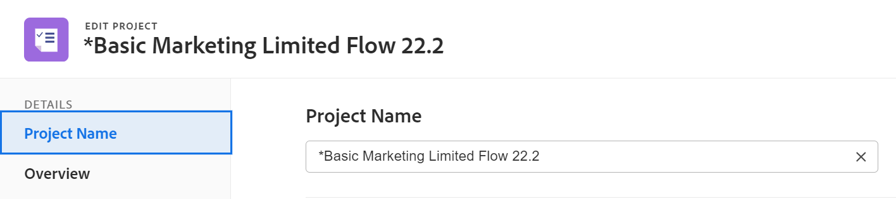

# Projecten bewerken

De gemarkeerde informatie op deze pagina verwijst naar functionaliteit die nog niet algemeen beschikbaar is. Deze optie is alleen beschikbaar in de voorvertoningsomgeving.

<!--

***Linked to many articles,

The Resource Pools part also duplicates in the "Working with Resource Pools" article 

The Update Type section is also documented in Selecting the Project Update Type article

Keep the reference link to the other article that also documents the Update Type) 

(NOTE 2: information described here also exists in these articles:

** Project Overview area

**Manage project Finance area

If you need to update just one field, check to see if that field is also listed there and update in both places.)

-->

U kunt een project in Adobe Workfront zo vaak uitgeven zoals vaak nodig. Wij adviseren dat u projecten na hun statusveranderingen in Huidig minimaal uitgeeft, om verwarring te vermijden door berichten over de veranderingen naar het volledige projectteam te verzenden. Ideaal gezien, zou u een project moeten uitgeven wanneer het project in de status van de Planning is. Voor informatie over het projectteam, zie [Overzicht van het projectteam](../../../manage-work/projects/planning-a-project/project-team-overview.md).

## Toegangsvereisten

<!--drafted - replace table at P&P:

<table style="table-layout:auto"> 
 <col> 
 <col> 
 <tbody> 
  <tr> 
   <td role="rowheader">Adobe Workfront plan*</td> 
   <td> 
Any
 </td> 
  </tr> 
  <tr> 
   <td role="rowheader">Adobe Workfront license*</td> 
   <td>
Current license: Standard 
 
   Or
   
Legacy license: Plan 
 </td> 
  </tr> 
  <tr> 
   <td role="rowheader">Access level configurations*</td> 
   <td> 
Edit access to Projects
 
If you still don't have access, ask your Workfront administrator if they set additional restrictions in your access level. For information about access to projects, see <a href="../../../administration-and-setup/add-users/configure-and-grant-access/grant-access-projects.md" class="MCXref xref">Grant access to projects</a>. For information on how a Workfront administrator can change your access level, see <a href="../../../administration-and-setup/add-users/configure-and-grant-access/create-modify-access-levels.md" class="MCXref xref">Create or modify custom access levels</a>. 
 </td> 
  </tr> 
  <tr> 
   <td role="rowheader">Object permissions</td> 
   <td> 
    <ul> 
     <li> 
Contribute permissions to a project to edit it in the Project Details area 
 </li> 
     <li> 
Manage permissions to a project to edit it in the Edit Project box
 </li> 
    </ul> 
 For information about project permissions, see <a href="../../../workfront-basics/grant-and-request-access-to-objects/share-a-project.md" class="MCXref xref">Share a project in Adobe Workfront</a>.
 
For information on requesting additional access, see <a href="../../../workfront-basics/grant-and-request-access-to-objects/request-access.md" class="MCXref xref">Request access to objects </a>.
 </td> 
  </tr> 
 </tbody> 
</table>
-->

U moet de volgende toegang hebben om de stappen in dit artikel uit te voeren:

<table style="table-layout:auto"> 
 <col> 
 <col> 
 <tbody> 
  <tr> 
   <td role="rowheader">Adobe Workfront-abonnement*</td> 
   <td> 
Alle
 </td> 
  </tr> 
  <tr> 
   <td role="rowheader">Adobe Workfront-licentie*</td> 
   <td> 
Plan 
 </td> 
  </tr> 
  <tr> 
   <td role="rowheader">Configuraties op toegangsniveau*</td> 
   <td> 
Toegang tot projecten bewerken
 
Als u nog steeds geen toegang hebt, vraagt u de Workfront-beheerder of deze aanvullende beperkingen op uw toegangsniveau instelt. Voor informatie over toegang tot projecten, zie <a href="../../../administration-and-setup/add-users/configure-and-grant-access/grant-access-projects.md" class="MCXref xref">Toegang verlenen tot projecten</a>. Voor informatie over hoe een beheerder van Workfront uw toegangsniveau kan veranderen, zie <a href="../../../administration-and-setup/add-users/configure-and-grant-access/create-modify-access-levels.md" class="MCXref xref">Aangepaste toegangsniveaus maken of wijzigen</a>. 
 </td> 
  </tr> 
  <tr> 
   <td role="rowheader">Objectmachtigingen</td> 
   <td> 
    <ul> 
     <li> 
Contribute-machtigingen voor een project om het te bewerken in het gebied Projectdetails 
 </li> 
     <li> 
Rechten voor een project beheren om het te bewerken in het vak Project bewerken
 </li> 
    </ul> 
 Voor informatie over projecttoestemmingen, zie <a href="../../../workfront-basics/grant-and-request-access-to-objects/share-a-project.md" class="MCXref xref">Een project delen in Adobe Workfront</a>.
 
Voor informatie over het aanvragen van aanvullende toegang raadpleegt u <a href="../../../workfront-basics/grant-and-request-access-to-objects/request-access.md" class="MCXref xref">Toegang tot objecten aanvragen </a>.
 </td> 
  </tr> 
 </tbody> 
</table>

*Neem contact op met uw Workfront-beheerder om te weten te komen welk abonnement, licentietype of toegang u hebt.

## Beperkingen voor het bewerken van projecten

Er zijn enkele beperkingen die kunnen voorkomen dat u projecten bewerkt.

Houd rekening met het volgende wanneer u projecten bewerkt:

* U kunt geen projecten uitgeven die in een Proces van de Goedkeuring, behalve registrerentijd zijn.
* U kunt documenten of malplaatjes aan een project vastmaken dat een status van Voltooid heeft, Dead, of in Hangende Goedkeuring slechts als uw beheerder van Workfront of een groepsbeheerder deze functionaliteit op het gebied van de Voorkeur van het Project toeliet. Voor informatie over het instellen van projectvoorkeuren raadpleegt u [Projectvoorkeuren voor het hele systeem configureren](../../../administration-and-setup/set-up-workfront/configure-system-defaults/set-project-preferences.md).
* U kunt de volgende informatie over een project alleen bewerken in de status Dead of Complete:

   * Bestaande uitgaven wijzigen.
   * Aangepaste formulieren toevoegen, verwijderen of bewerken.

## Een project bewerken

Door een project uit te geven kunt u informatie en montages voor het project, evenals taken en kwesties op het project wijzigen.

Sommige montages die in dit artikel worden vermeld zouden van hun standaardstatus door hun staat in het malplaatje kunnen worden gewijzigd waarvan het project werd gecreeerd. Voor informatie over het bewerken van sjablonen raadpleegt u [Projectsjablonen bewerken](../../../manage-work/projects/create-and-manage-templates/edit-templates.md).

1. Klik op de knop **Hoofdmenu** pictogram  in de rechterbovenhoek van Adobe Workfront klikt u op **Projecten**.
1. (Optioneel) Klik op **Projecten waar ik aan sta** of **Projecten die ik heb** in de hoger-juiste hoek om projecten te tonen waar u de eigenaar of de projecten bent waar u deel van het projectteam uitmaakt.

   

1. Klik de naam van het project u wilt uitgeven om de projectpagina te openen.

   >[!NOTE]
   >
   >Als u een groepsbeheerder bent, kunt u de projecten van uw groep in het gebied van Groepen evenals in het gebied van Projecten zien en uitgeven. Zie voor meer informatie [Projecten van een groep maken en wijzigen](../../../administration-and-setup/manage-groups/work-with-group-objects/create-and-modify-a-groups-projects.md).

1. (Optioneel) Als u de beperkte informatie over een project wilt bewerken, klikt u op **Projectdetails** in het linkerdeelvenster.

   

   >[!NOTE]
   >
   >Afhankelijk van hoe uw Workfront-beheerder of groepsbeheerder uw lay-outsjabloon heeft gewijzigd, kunnen de velden in het gebied Projectdetails opnieuw worden gerangschikt of niet worden weergegeven. Zie voor meer informatie [De weergave Details aanpassen met een lay-outsjabloon](../../../administration-and-setup/customize-workfront/use-layout-templates/customize-details-view-layout-template.md).

   Ga als volgt te werk om de gegevens in de sectie Details te bewerken:

   1. (Optioneel) Klik op de knop **Alles samenvouwen** in de rechterbovenhoek om alle gebieden samen te vouwen.
   1. (Optioneel en voorwaardelijk) Als een gebied is samengevouwen, klikt u op de knop **pijl-rechts**  naast elk gebied om het gebied uit te breiden u wilt uitgeven.
   1. Raadpleeg de volgende artikelen voor meer informatie over het bewerken van informatie op het tabblad Projectdetails:

      * [Informatie beheren in het gebied Projectoverzicht](../../../manage-work/projects/manage-projects/understand-project-overview-area.md)
      * [Informatie beheren in het gebied Projectfinanciering](../../../manage-work/projects/project-finances/manage-project-finance-area.md)
   1. (Optioneel) Als u een aangepast formulier wilt bijvoegen, typt u de naam van een formulier in het dialoogvenster **Aangepast formulier toevoegen** , selecteert u het veld wanneer het wordt weergegeven in de lijst en klikt u vervolgens op **Wijzigingen opslaan**.
   1. (Optioneel) Klik op de knop **Exporteren** pictogram  als u het overzicht en de aangepaste formuliergegevens wilt exporteren naar een PDF-bestand, klikt u op **Exporteren**. Selecteer een van de volgende opties:

      * Alles selecteren (wordt alleen weergegeven als er ten minste één aangepast formulier is gekoppeld)
      * Overzicht
      * De naam van een of meerdere aangepaste formulieren

      Het PDF-bestand wordt naar de computer gedownload.

      

      Zie voor meer informatie [Aangepaste formulieren en objectdetails exporteren](../../../workfront-basics/work-with-custom-forms/export-custom-forms-details.md).
   Voor informatie over de gebieden zichtbaar in de sectie van de Details van het Project, ga met het uitgeven van het project in het Edit vakje van het Project zoals hieronder beschreven verder.
1. Als u alle informatie over het project wilt bewerken, klikt u op de knop **Meer** menu  naast de naam van het project klikt u op **Bewerken**.

   of

   Van een lijst van projecten, selecteer een project, dan klik **Bewerken** pictogram  boven aan de lijst.

   De **Project bewerken** wordt geopend.

   >[!IMPORTANT]
   >
   >U moet over beheermachtigingen voor het project beschikken om de optie Bewerken te kunnen zien.

   Alle projectvelden zijn beschikbaar in het vak Project bewerken en zijn gegroepeerd op de gebieden in het linkerdeelvenster.

   >[!NOTE]
   >
   >Afhankelijk van de manier waarop uw Workfront-beheerder of groepsbeheerder uw lay-outsjabloon heeft gewijzigd, kunnen de gebieden in het linkerdeelvenster van het vak Project bewerken of de velden in deze gebieden opnieuw worden gerangschikt of niet worden weergegeven. Zie voor meer informatie [De weergave Details aanpassen met een lay-outsjabloon](../../../administration-and-setup/customize-workfront/use-layout-templates/customize-details-view-layout-template.md).

1. (Voorwaardelijk) Als u op de knop **Meer** en vervolgens **Bewerken** kunt u gegevens in de volgende gebieden in het linkervenster bijwerken:

   * [Projectnaam](#project-name)
   * [Overzicht](#overview)
   * [Aangepaste Forms](#custom-forms)
   * [Financiën](#finance)
   * [Projectinstellingen](#project-settings)
   * [Taakinstellingen](#task-settings)
   * [Instellingen van uitgave](#issue-settings)
   * [Toegang](#access)

   >[!NOTE]
   >
   >Afhankelijk van de manier waarop uw Workfront-beheerder onze lay-outsjabloon instelt voor het gebied Details van het project, kunnen de secties en velden in het vak Project bewerken in uw omgeving verschillen. Zie voor meer informatie [De weergave Details aanpassen met een lay-outsjabloon](../../../administration-and-setup/customize-workfront/use-layout-templates/customize-details-view-layout-template.md).

### Projectnaam {#project-name}

1. Bewerk uw project zoals hierboven beschreven.
1. Klikken **Projectnaam** in het linkerdeelvenster.

   

1. Werk de naam van het project bij.

   U kunt de projectnaam niet bewerken wanneer u projecten bulksgewijs bewerkt.

### Overzicht {#overview}

1. Bewerk uw project zoals hierboven beschreven.
1. Klikken **Overzicht** in het linkerdeelvenster.

   

1. Werk de volgende informatie over het project bij:

   <table style="table-layout:auto"> 
    <col> 
    <col> 
    <tbody> 
     <tr> 
      <td role="rowheader"><strong>Beschrijving</strong> </td> 
      <td> 
Voeg aanvullende informatie toe over het project.
 </td> 
     </tr> 
     <tr> 
      <td role="rowheader"><strong>Status</strong> </td> 
      <td> 
Selecteer de status van het project. U kunt een project niet markeren voltooid voordat alle taken en problemen zijn voltooid. Voor informatie over projectstatussen raadpleegt u <a href="../../../administration-and-setup/customize-workfront/creating-custom-status-and-priority-labels/project-statuses.md" class="MCXref xref">Heb toegang tot de lijst van de statussen van het systeemproject</a>
 </td> 
     </tr> 
     <tr> 
      <td role="rowheader"><strong>Prioriteit</strong> </td> 
      <td> 
 
Dit is enkel een visuele vlag voor u die u toestaat om aan uw projecten voorrang te geven.
 
Afhankelijk van de projectvoorkeuren die door uw Workfront-beheerder zijn geselecteerd, kunnen de namen van prioriteiten voor u anders zijn. Voor meer informatie over het uitgeven van prioriteiten, zie <a href="../../../administration-and-setup/customize-workfront/creating-custom-status-and-priority-labels/create-customize-priorities.md" class="MCXref xref">Prioriteiten maken en aanpassen</a>
 
 </td> 
     </tr> 
     <tr> 
      <td role="rowheader"><strong>URL</strong> </td> 
      <td> 
Geef een webkoppeling op die betrekking heeft op informatie over dit project.
 </td> 
     </tr> 
     <tr> 
      <td role="rowheader"><strong>Type voorwaarde</strong> </td> 
      <td> 
Selecteer een van de volgende Condition Types: 
       <ul> 
       <li><strong>Handmatig:</strong> De eigenaar van het project stelt de voorwaarde handmatig in op het project.</li> 
       <li><strong>Voortgangsstatus:</strong> Workfront stelt de voorwaarde automatisch in op basis van de status van voortgang van taken op het kritieke pad. Voor meer informatie over het begrijpen van de Status van de Voortgang, zie <a href="../../../manage-work/tasks/task-information/task-progress-status.md" class="MCXref xref">Overzicht van status voortgang van taak</a>.</li> 
       </ul>
Uw Workfront-beheerder of een groepsbeheerder selecteert het gebrek voor hoe de voorwaarde van de projecten voor uw systeem wordt berekend of uw groep. Voor informatie over het plaatsen van projectgebreken, zie <a href="../../../administration-and-setup/set-up-workfront/configure-system-defaults/set-project-preferences.md" class="MCXref xref">Projectvoorkeuren voor het hele systeem configureren</a>. 

 </td> 
     </tr> 
     <tr> 
      <td role="rowheader"><strong>Voorwaarde</strong> </td> 
      <td> 
 
(Wordt alleen weergegeven nadat u <strong>Handmatig</strong> voor de <strong>Type voorwaarde</strong>): Selecteer een voorwaarde om aan te geven hoe het project gaat. 
 
Voor informatie hoe de projectvoorwaarden automatisch of manueel kunnen worden geplaatst, zie <a href="../../../manage-work/projects/manage-projects/project-condition-and-condition-type.md" class="MCXref xref">Overzicht van het type Projectvoorwaarde en Voorwaarde</a>
 
 </td> 
     </tr> 
     <tr> 
      <td role="rowheader"><strong>Planningsmodus</strong> </td> 
      <td> 
Geef op of het project gepland is vanaf de begindatum of vanaf de einddatum. Deze selectie bepaalt de geplande data van de taken betreffende het project. 
       <ul> 
       <li><strong>Begindatum</strong>: De eerste taak van het project heeft de zelfde Geplande Datum van het Begin zoals het project door gebrek. Voor informatie over de taak Geplande Datum van het Begin, zie <a href="../../../manage-work/tasks/task-information/task-planned-start-date.md" class="MCXref xref">Overzicht van de geplande startdatum van de taak</a>. De projecttijdlijn berekent vanaf de begindatum en de einddatum van het project wordt door het systeem berekend op basis van de duur van alle taken. </li> 
       <li><strong>Voltooiingsdatum</strong>: De laatste taak van het project heeft de zelfde Geplande Datum van Voltooiing zoals het project. De projecttijdlijn berekent vanaf de afsluitende datum en de begindatum van het project wordt door het systeem berekend door de duur van alle taken af te trekken van de afsluitende datum van het project. </li> 
       </ul>
Uw Workfront-beheerder of een groepsbeheerder Hiermee selecteert u de standaardinstelling voor de planningsmodus voor uw systeem of groep. Voor informatie over het plaatsen van projectgebreken, zie <a href="../../../administration-and-setup/set-up-workfront/configure-system-defaults/set-project-preferences.md" class="MCXref xref">Projectvoorkeuren voor het hele systeem configureren</a>.

 </td> 
     </tr> 
     <tr> 
      <td role="rowheader"><strong>Geplande begindatum en -tijd</strong> </td> 
      <td> 
 
Geef de datum op waarop u <strong>Schema vanaf begindatum</strong>.  
 
Dit is een alleen-lezen veld wanneer u <strong>Planning vanaf voltooiing</strong>. 
 
 </td> 
     </tr> 
     <tr> 
      <td role="rowheader"><strong>Geplande voltooiing Datum en tijd</strong> </td> 
      <td> 
Geef de datum op waarop u <strong>Planning vanaf voltooiing</strong>. 
 
Dit is een alleen-lezen veld wanneer u <strong>Schema vanaf begindatum</strong>. 
 </td> 
     </tr> 
     <tr> 
      <td role="rowheader"><strong>Portfolio</strong></td> 
      <td>Geef een Portfolio aan waartoe het project behoort. U moet eerst een Portfolio maken voordat deze in de vervolgkeuzelijst wordt weergegeven. Alleen actieve portfolio's kunnen aan een project worden gekoppeld. Zie voor meer informatie over het maken van portfolio's <a href="../../../manage-work/portfolios/create-and-manage-portfolios/create-portfolios.md" class="MCXref xref">Een portfolio maken </a>.</td> 
     </tr> 
     <tr> 
      <td role="rowheader"><strong>Programma</strong></td> 
      <td> 
Als u een Portfolio voor het project selecteerde, specificeer een Programma voor het project. Sommige Portfolio hebben mogelijk geen programma's. U moet eerst een programma maken voordat het in deze vervolgkeuzelijst wordt weergegeven. Alleen actieve programma's kunnen aan een project worden gekoppeld. 
 
Ga voor meer informatie over het maken van programma's naar <a href="../../../manage-work/portfolios/create-and-manage-programs/create-program.md" class="MCXref xref">Een programma maken</a>.
 </td> 
     </tr> 
     <tr> 
      <td role="rowheader"><strong>Groep</strong></td> 
      <td> 
 
Geef de naam op van de groep die aan het project is gekoppeld. 
Dit is een verplicht veld. U kunt geen project hebben dat niet aan een groep wordt geassocieerd. 
 
U kunt ervoor zorgen dat u de juiste groep selecteert door de muisaanwijzer boven de groep te plaatsen en op het informatiepictogram te klikken  die ernaast wordt weergegeven. Hier wordt knopinfo weergegeven met informatie over de groep, zoals de hiërarchie van de bovenliggende groepen en de bijbehorende beheerders.
 Door gebrek, wordt één van de volgende groepen automatisch geassocieerd met een project wanneer het wordt gecreeerd, tenzij u een verschillende groep specificeert:
 
       <ul> 
       <li> 
Wanneer het project van het gebied van Projecten wordt gecreeerd, wordt de Groep van het Huis van de projectschepper geassocieerd met het project. 
 
Dit is ook waar wanneer het project van de sectie van Projecten in een portefeuille of een programma wordt gecreeerd.
 </li> 
       <li> 
Wanneer het project van de belangrijkste pagina van een groep in het gebied van de Opstelling wordt gecreeerd, wordt die groep geassocieerd met het project.
 </li> 
       </ul> 
 
  
 
Als het project, of zijn taken of kwesties reeds met een groep-vlakke goedkeuringsproces gebruikend groep-vlakke douanestatus worden geassocieerd, zou het veranderen van de groep een conflict tussen de goedkeuringsstatussen van de vorige groep en die op het systeemniveau kunnen tot stand brengen. U kunt overwegen de goedkeuringsprocessen op groepsniveau voor het project of de taken of problemen ervan te verwijderen voordat u de groep bijwerkt. Voor informatie over het creëren van groep-vlakke goedkeuringsprocessen, zie <a href="../../../administration-and-setup/manage-groups/work-with-group-objects/create-and-modify-groups-approval-processes.md" class="MCXref xref">Goedkeuringsprocessen op groepsniveau</a>. Voor informatie over het creëren van een groep-vlakke douanestatus, zie <a href="../../../administration-and-setup/manage-groups/manage-group-statuses/create-or-edit-a-group-status.md" class="MCXref xref">Een groepsstatus maken of bewerken</a>
 </td> 
     </tr> 
     <tr> 
      <td role="rowheader"><strong>Bedrijf</strong> </td> 
      <td> 
Geef een bedrijf op dat aan het project is gekoppeld. U moet een bedrijf tot stand brengen alvorens u het met een project kunt associëren. Alleen actieve bedrijven kunnen met een project worden geassocieerd. Voor informatie over het creëren van bedrijven, zie <a href="../../../administration-and-setup/set-up-workfront/organizational-setup/create-and-edit-companies.md" class="MCXref xref">Bedrijven maken en bewerken</a>.
 </td> 
     </tr> 
     <tr> 
      <td role="rowheader"><strong>Projecteigenaar</strong> </td> 
      <td> 
Begin de naam van een gebruiker te typen om hen aan het project toe te voegen, dan het te selecteren wanneer het in de lijst toont. De gebruiker wordt toegevoegd aan het projectteam en krijgt automatisch beheermachtigingen voor het project. De gebruiker die als de Eigenaar van het Project wordt aangewezen moet een actieve gebruiker van Workfront zijn.

      </td> 
     </tr> 
     <tr> 
      <td role="rowheader"><strong>Projectsponsor</strong> </td> 
      <td> 
Begin de naam van een gebruiker te typen om hen aan het project toe te voegen, dan het te selecteren wanneer het in de lijst toont. De gebruiker wordt toegevoegd aan het projectteam en krijgt automatisch de toestemmingen van de Mening aan het project. De gebruiker die is aangewezen als projectsponsor moet een actieve Workfront-gebruiker zijn. 
 </td> 
     </tr> 
     <tr> 
      <td role="rowheader"><strong>Resource Manager</strong> </td> 
      <td> 
 Begin de namen van gebruikers te typen om hen aan het project toe te voegen, dan hen te selecteren wanneer zij in de lijst tonen. De gebruikers worden toegevoegd aan het projectteam en krijgen automatisch beheermachtigingen voor het project en kunnen bronnen toewijzen aan de taken en problemen van het project. De gebruikers handhaven leiden toestemmingen op het project zelfs wanneer zij uit het gebied van de Manager van het Middel worden verwijderd. U kunt meerdere Resource Manager opgeven. 
 </td> 
     </tr> 
    </tbody> 
   </table>

   >[!TIP]
   >
   >Wanneer u de velden Projecteigenaar, Projectsponsor en Resource Manager bijwerkt, ziet u de avatar, de primaire rol van de gebruiker of hun e-mailadres om onderscheid te maken tussen gebruikers met identieke namen. Gebruikers moeten aan ten minste één taakrol zijn gekoppeld om deze te kunnen bekijken terwijl u ze toevoegt.

1. (Optioneel) Ga door met het bewerken van de volgende secties, afhankelijk van de gegevens die u wilt wijzigen.

   of

   Klikken **Opslaan**.

### Aangepaste Forms {#custom-forms}

Afhankelijk van uw toegangsniveau en op uw toestemming op het project, bestaan de volgende scenario&#39;s:

* Als u geen machtiging voor Aangepast formulier bewerken hebt voor het project, kunt u de velden op de gekoppelde aangepaste formulieren niet bewerken. U kunt de velden alleen weergeven op de aangepaste formulieren die zijn gekoppeld aan het project.
* Als u toegang hebt tot een sectie op een aangepast formulier met Weergave (en niet Bewerken), kunt u de velden in die sectie niet bewerken.
* Als u geen toegang hebt tot een sectie op een van de aangepaste formulieren die aan het project zijn gekoppeld, wordt de sectie niet weergegeven in het vak Project bewerken.

Wanneer het selecteren van meer dan één project om hen in bulk uit te geven, bestaan de volgende scenario&#39;s:

* Als u niet de toestemmingen van de Vorm van de Douane op minstens één van de geselecteerde projecten hebt uitgeven, kunt u niet de gebieden op om het even welke in bijlage douaneformulieren uitgeven. U kunt de velden alleen weergeven op de bijgevoegde aangepaste formulieren
* Als u toegang hebt tot een sectie op een aangepast formulier met Weergave (en niet Bewerken), kunt u de velden in die sectie niet bewerken. U kunt de velden in die sectie alleen weergeven.
* Als u geen toegang hebt tot een sectie op een van de aangepaste formulieren die aan ten minste een van de projecten is gekoppeld, wordt de sectie niet weergegeven in het vak Projecten bewerken.

Raadpleeg de volgende artikelen voor informatie over aangepaste toegang tot formulieren:

* [Een aangepast formulier delen](../../../administration-and-setup/customize-workfront/create-manage-custom-forms/share-access-to-a-custom-form.md)
* [Een sectie-einde toevoegen aan een aangepast formulier](../../../administration-and-setup/customize-workfront/create-manage-custom-forms/add-a-section-break-to-a-custom-form.md)

Informatie bewerken op aangepaste formulieren:

1. Bewerk uw project zoals hierboven beschreven.
1. Klikken **Aangepaste Forms** in het linkerdeelvenster.

   

1. Klik op de knop **Aangepast formulier toevoegen** en selecteer een formulier in de lijst om het bij het project te voegen. Standaard worden de eerste 40 formulieren in alfabetische volgorde weergegeven. Als het formulier niet in de lijst wordt weergegeven, typt u de naam en selecteert u het vervolgens wanneer het in de lijst wordt weergegeven.

   >[!NOTE]
   >
   >U moet aangepaste formulieren maken voordat u ze in dit veld kunt selecteren. Alleen actieve aangepaste formulieren worden in de lijst weergegeven. Zie voor meer informatie over het samenstellen van aangepaste formulieren [Een aangepast formulier maken of bewerken](../../../administration-and-setup/customize-workfront/create-manage-custom-forms/create-or-edit-a-custom-form.md). U kunt maximaal tien aangepaste formulieren aan een project toevoegen.

1. (Voorwaardelijk) Als u een aangepast formulier aan het project hebt gekoppeld, bewerkt u alle velden op het formulier. U moet alle vereiste gebieden specificeren alvorens u het project kunt bewaren.
1. (Optioneel) Klik op de knop **X-pictogram** rechts van de naam van een aangepast formulier om het te verwijderen, klikt u op **Verwijderen**.
1. (Optioneel) Ga door met het bewerken van de volgende secties, afhankelijk van de gegevens die u wilt wijzigen

   of

   Klikken **Opslaan**.

### Financiën {#finance}

Afhankelijk van uw toegangsniveau en op uw toestemming op het project, bestaan de volgende scenario&#39;s:

* Als u de toegang van de Mening tot Financiële Gegevens en de toestemmingen van de Financiën van de Mening over het project hebt, kunt u de gebieden in de sectie van de Financiën slechts bekijken. U kunt de velden in deze sectie niet bewerken.
* Als u toegang tot financiële gegevens hebt bewerken en de machtigingen Financiën beheren voor het project, kunt u de velden in deze sectie bijwerken.

Wanneer het selecteren van meer dan één project om hen in bulk uit te geven en, bestaan de volgende scenario&#39;s:

* Als u minstens één project selecteert waar u de toestemmingen van de Financiën van de Mening (in plaats van Beheren van Financiën) hebt, kunt u de gebieden in deze sectie voor alle geselecteerde projecten slechts bekijken. U kunt de velden in de sectie Financiën niet bulksgewijs bewerken.
* Als u ten minste één project selecteert waarvoor u geen financiële machtigingen hebt, wordt deze sectie helemaal niet weergegeven.

Velden bewerken in het gebied Financiën:

1. Bewerk uw project zoals hierboven beschreven.
1. Klikken **Financiën** in het linkerdeelvenster.

   

1. Werk de volgende financiële informatie voor het project bij:

   <table style="table-layout:auto"> 
    <col> 
    <col> 
    <tbody> 
     <tr data-mc-conditions=""> 
      <td role="rowheader"><strong>Valuta</strong> </td> 
      <td> 
 
Geef de valuta voor het project op als deze afwijkt van de standaardvaluta van uw systeem. U kunt de valuta van een project niet wijzigen als er al financiële informatie over het project beschikbaar is. Dit veld is niet zichtbaar als u alleen de standaardvaluta in het systeem hebt. 
 
Zie voor meer informatie over valuta <a href="../../../administration-and-setup/manage-workfront/exchange-rates/set-up-exchange-rates.md" class="MCXref xref">Wisselkoersen instellen</a>. 
 
 </td> 
     </tr> 
     <tr> 
      <td role="rowheader"><strong>Begroting</strong> </td> 
      <td> 
Geef een budget voor het project op. 
 </td> 
     </tr> 
     <tr> 
      <td role="rowheader"><strong>Prestatiesindexmethode</strong> </td> 
      <td> 
Selecteren <b>Op uurbasis</b>, of <b>Op basis van kosten</b> om aan te geven of de gegevens over de waarde van het project (zoals de kostenprestatie-index of de geschatte werkelijke kosten) worden berekend aan de hand van uren of kosten. 
 
Voor meer informatie over de Methode van de Index van Prestaties, zie <a href="../../../manage-work/projects/project-finances/set-pim.md" class="MCXref xref">De PIM-methode (Performance Index) instellen</a>. 
 
Uw Workfront-beheerder of een groepsbeheerder Hiermee selecteert u de standaardinstelling voor de prestatie-indexmethode voor uw systeem of uw groep. Voor informatie over het plaatsen van projectgebreken, zie <a href="../../../administration-and-setup/set-up-workfront/configure-system-defaults/set-project-preferences.md" class="MCXref xref">Projectvoorkeuren voor het hele systeem configureren</a>.
 </td> 
     </tr> 
     <tr> 
      <td role="rowheader"><strong>Schatting bij voltooiing</strong> </td> 
      <td> 
 
Geef op hoe Workfront de schatting bij voltooiing (EAC) moet berekenen. 

      Selecteer een van de volgende opties: 
      <ul><li><b>Berekenen op projectniveau</b></li>
      <li><b>Omhoog rollen vanuit taken/subtaken</b></li> </ul>
      
Zie voor meer informatie over de berekening van de schatting bij voltooiing <a href="../../../manage-work/projects/project-finances/calculate-eac.md" class="MCXref xref">Schatting berekenen bij voltooiing (EAC)</a>.
 
Uw Workfront- of groepsbeheerder selecteert de standaardschatting bij voltooiing voor uw systeem of groep. Voor informatie over het plaatsen van projectgebreken, zie <a href="../../../administration-and-setup/set-up-workfront/configure-system-defaults/set-project-preferences.md" class="MCXref xref">Projectvoorkeuren voor het hele systeem configureren</a>.
 
 </td> 
     </tr> 
     <tr> 
      <td role="rowheader"><strong>Gepland voordeel</strong> </td> 
      <td> 
Schatting wat het geplande voordeel van het project is. Dit wordt gebruikt in het BedrijfsGeval van het project en Portfolio Optimizer. Voor meer informatie over het Geplande Voordeel van een project, zie <a href="../../../manage-work/projects/project-finances/project-planned-benefit.md" class="MCXref xref">Overzicht van het geplande project</a>. Bij de berekening van de nettowaarde van een project wordt rekening gehouden met het geplande voordeel van een project. 
 
Zie voor meer informatie <a href="../../../manage-work/portfolios/portfolio-optimizer/manage-projects-in-portfolio-optimizer.md" class="MCXref xref">Projecten beheren in de Portfolio Optimizer</a> . 
 </td> 
     </tr> 
     <tr> 
      <td role="rowheader"><strong>Werkelijk voordeel</strong> </td> 
      <td> 
Schatting van het werkelijke voordeel van het project. Dit is een valutabedrag dat het voordeel vertegenwoordigt dat uw bedrijf of afdeling zou behalen als dit project is voltooid. 
 </td> 
     </tr> 
      <tr> 
      <td role="rowheader"><strong>Vaste kosten</strong> </td> 
      <td> 
Geef de vaste kosten voor het project op. Dit is anders dan de loonkosten die voortvloeien uit de uren van het project en de kosten die voortvloeien uit de kosten van het project. De vaste kosten van een project worden in aanmerking genomen bij de berekening van de nettowaarde van een project en maken deel uit van de begrote kosten. 
 </td> 
     </tr> 
     <tr> 
      <td role="rowheader"><strong>Vaste inkomsten</strong> </td> 
      <td> 
Geef de vaste inkomsten voor het project op. 
 </td> 
     </tr> 
    </tbody> 
   </table>

1. (Optioneel) Ga door met het bewerken van de volgende secties, afhankelijk van de gegevens die u wilt wijzigen.

   of

   Klikken **Opslaan**.

### Projectinstellingen {#project-settings}

1. Bewerk uw project zoals hierboven beschreven.
1. Klikken **Projectinstellingen** in het linkerdeelvenster.

   

1. Werk de volgende gegevens bij:

   <table style="table-layout:auto"> 
      <col> 
      <col> 
      <tbody> 
      <tr> 
      <td role="rowheader"><strong>Mijlpad</strong> </td> 
       <td> 
Selecteer een Mijlpad voor het project. Alleen actieve milestone-paden worden in de lijst weergegeven.
 
Voor meer informatie over Mijlpaden raadpleegt u <a href="../../../administration-and-setup/customize-workfront/configure-approval-milestone-processes/create-milestone-path.md" class="MCXref xref">Een milestone-pad maken</a>.
 </td> 
      </tr> 
      <tr> 
      <td role="rowheader"><strong>Voltooiingsmodus</strong> </td> 
      <td> 
Bepaalt hoe het project wordt gemarkeerd als Voltooid. Selecteer een van de volgende opties: 
       <ul> 
       <li>
<strong>Automatisch</strong>: Het project is gemarkeerd als Voltooid wanneer alle taken en problemen zijn voltooid.

De status van het project wordt automatisch gewijzigd in Voltooien slechts wanneer de projectstatus Huidig is wanneer de taken worden voltooid. 
</li> 
       <li><strong>Handmatig</strong>: U moet manueel de Volledige status voor het project selecteren, wanneer alle taken en kwesties worden voltooid.</li> 
       </ul>
 </td> 
       </tr> 
       <tr> 
       <td role="rowheader"><strong>Samenvattingsmodus</strong></td> 
       <td> 
Controls how the parent tasks are marked as Complete. Selecteer een van de volgende opties: 
       <ul> 
       <li><strong>Automatisch</strong>: De oudertaken worden duidelijk Voltooid en zij werken hun percentage automatisch bij volledig, aangezien de kindtaken worden voltooid en het percentage complete van de kinderen wordt bijgewerkt. </li> 
       <li><strong>Handmatig</strong>: U moet manueel het percentage bijwerken voltooit en de status van de oudertaken, onafhankelijk van wat veranderingen in de kindtaken worden aangebracht.</li> 
       </ul>
 </td> 
       </tr> 
       <tr> 
       <td role="rowheader"><strong>Type update</strong></td> 
       <td> 
Controles wanneer de veranderingen u aan de projectchronologie aanbrengt op het project of de oudertaken worden bewaard. De volgende wijzigingen in het project activeren bijvoorbeeld een update van de tijdlijn van het project: 
       <ul> 
       <li>Datums van taken bijwerken</li> 
       <li>De voorgangersrelaties van taken wijzigen</li> 
       <li>
Verander ouder-kind verhoudingen, toevoegend of verwijderend taken naast het veranderen van de taakbeperking of het type van duur.

Wanneer de taken bijwerken, werken hun oudervoorwerpen (oudertaken of het project) op de tijd bij die door het Type van Update wordt vermeld. 

Als de bovenliggende objecten niet onmiddellijk na de wijziging worden bijgewerkt wanneer u Automatisch en bij wijziging of Alleen wijziging bijwerken selecteert, vernieuwt u de pagina

Selecteer een van de volgende opties: 

- <strong>Automatisch en bij wijziging</strong> (Standaardinstelling): De projectchronologie wordt bijgewerkt telkens als een verandering in het project of in een ander project voorkomt dat het project van (bij Verandering) afhankelijk is. De projecttijdlijn wordt ook elke avond bijgewerkt (automatisch).

Dit is het geadviseerde plaatsen voor dit gebied omdat het ervoor zorgt dat het project altijd bijgewerkt is.

Wanneer u een handeling uitvoert op een taak of project waarmee een tijdlijnherberekening wordt gestart, worden alle beschikbare datums direct weergegeven, zodat u kunt doorgaan met werken. Voor projecten met meer dan 100 taken worden datums die langere herberekeningen vereisen kort weergegeven als een vraagteken (tussen 1 en 5 seconden, of tot een minuut voor grote projecten). Dit geeft aan dat de herberekening nog niet is voltooid en dat de datums kunnen worden gewijzigd.

- <strong>Alleen wijzigen</strong>: De projectchronologie wordt bijgewerkt telkens als een verandering in het project of in een ander project voorkomt dat het project van afhankelijk is. U zou deze optie kunnen willen selecteren als de veranderingen zelden in het project of in andere projecten voorkomen dat de chronologie van afhankelijk is.

- <strong>Alleen automatisch</strong>: Het projecttijdschema wordt elke avond bijgewerkt; de tijdlijn wordt niet meteen na het aanbrengen van de wijzigingen bijgewerkt.

U zou deze optie kunnen willen selecteren als vele veranderingen elke dag in het project of in andere projecten voorkomen dat de chronologie van afhankelijk is. Houd er echter rekening mee dat u deze instelling hebt gekozen, aangezien het project niet tegelijk met de wijzigingen wordt bijgewerkt.

- <strong>Alleen handmatig</strong>: De projecttijdlijn wordt alleen bijgewerkt wanneer u de optie voor het opnieuw berekenen van de tijdlijn selecteert. Zie voor meer informatie over het handmatig opnieuw berekenen van de projecttijdlijn <a href="../../../manage-work/projects/manage-projects/recalculate-project-timeline.md" class="MCXref xref">Projecttijdlijnen opnieuw berekenen</a>. 

U kunt deze optie selecteren als u in één keer veel wijzigingen aanbrengt in het project en u wilt dat de tijdlijnherberekening plaatsvindt nadat alle wijzigingen zijn aangebracht (in plaats van na elke afzonderlijke wijziging).
</li> 
       </ul>
 </td> 
       </tr> 
       <tr> 
       <td role="rowheader"><strong>Schema</strong> </td> 
       <td> 
Selecteer een schema voor uw project. Dit zou het zelfde programma moeten zijn dat aan de meeste mensen wordt toegewezen die aan het project werken. U moet een programma tot stand brengen alvorens u het aan een project of een gebruiker kunt toewijzen. Als u geen aangepaste schema's in uw systeem hebt gemaakt, wordt Standaardschema geselecteerd.
 
Voor meer informatie over het creëren van programma's, zie <a href="../../../administration-and-setup/set-up-workfront/configure-timesheets-schedules/create-schedules.md" class="MCXref xref">Een schema maken</a>. 
 </td> 
       </tr> 
       <tr> 
       <td role="rowheader"><strong>Gebruikerstijd uit</strong> </td> 
       <td> 
Bepaalt of de tijd van de Primaire Ontvanger van een taak de taak geplande data op het project aanpast. 

Uw Workfront-beheerder of een groepsbeheerder Hiermee selecteert u de standaardinstelling voor deze instelling voor uw systeem of uw groep. Voor informatie over het plaatsen van projectgebreken, zie <a href="../../../administration-and-setup/set-up-workfront/configure-system-defaults/set-project-preferences.md" class="MCXref xref">Projectvoorkeuren voor het hele systeem configureren</a>. 

Selecteer een van de volgende opties: - <strong>Overweeg de gebruikerstijd in taakduur</strong>: Wanneer u deze optie selecteert, worden de geplande datums van de taken aangepast aan de tijd van de primaire ontvanger van de taak, als de time-off optreedt tijdens de duur van de taak. 

Als bijvoorbeeld een taak met een beperking van Zo snel mogelijk op 1 juni begint en op 3 juni wordt voltooid, en de primaire ontvanger op 2 juni is gemarkeerd voor een time-off, zijn de geplande taakdata 1 juni tot 4 juni. Afhankelijk van de Beperking van de Taak, bestaan de volgende scenario's: 
 
       <ul> 
       <li>Voor taakbeperkingen die betrekking hebben op planning vanaf een begindatum (zo snel mogelijk, Vroegst beschikbare tijd, Begin niet vroeger dan, Begin niet later dan, moet beginnen) verandert de Geplande Datum van het Begin niet maar de Geplande Datum van de Voltooiing verandert.</li> 
       <li>Voor taakbeperkingen die betrekking hebben op planning vanaf een voltooiingsdatum (zo laat mogelijk, laatst beschikbare tijd, Afwerking niet vroeger dan, Afwerking niet later dan, moet beëindigen), verandert de geplande voltooiingsdatum niet, maar de geplande begindatum verandert.</li> 
       <li>Voor taken met een beperking van Vaste datums, verandert noch de Geplande Begin noch de Datum van de Voltooiing. </li> 
       </ul>
De duur van de taak verandert niet wanneer u deze instelling selecteert. Alleen de geplande datums veranderen, afhankelijk van de Taakbeperking. Voor informatie over taakbeperking raadpleegt u <a href="../../../manage-work/tasks/task-constraints/task-constraint-overview.md" class="MCXref xref">Overzicht van taakbeperking</a>. 

- <strong>Gebruikerstijd in taakduur negeren</strong>: Bij het selecteren van deze optie blijven de geplande data van de taken voor het project zoals oorspronkelijk gepland, zelfs als de primaire ontvanger van de taak tijd heeft weg tijdens de duur van de taak. 

Houd rekening met het volgende wanneer u opties voor deze instelling selecteert:
 
       <ul> 
       <li>
De standaardoptie voor dit het plaatsen voor een nieuw project is het zelfde als de systeem-vlakke projectvoorkeur. 

Voor informatie over de projectvoorkeur op het niveau van het Systeem, zie <a href="../../../administration-and-setup/set-up-workfront/configure-system-defaults/set-project-preferences.md" class="MCXref xref">Projectvoorkeuren voor het hele systeem configureren</a>. 
</li> 
       <li>Wanneer u een malplaatje aan een bestaand project vastmaakt, wordt het plaatsen op het project bijgewerkt om één van het malplaatje aan te passen. </li> 
       <li>
Workfront bepaalt welke geplande taakdatums moeten worden aangepast volgens de taakbeperkingswaarde van de taak. Afhankelijk van wat dat is, of het Geplande Begin of de Geplande VoltooiingsDatum, of allebei zou kunnen worden beïnvloed, of zelfs het zelfde zouden kunnen blijven. Bijvoorbeeld, als een taak een Beperking van Vaste Datums heeft, passen de data niet aan wanneer de Primaire Ontvanger tijd weg heeft, zelfs wanneer <strong>Overweeg de gebruikerstijd in taakduur</strong> is geselecteerd. 
</li> 
       </ul></td> 
      </tr> 
      <tr> 
       <td role="rowheader"><strong>Modus Bronniveaus</strong> </td> 
       <td> 
 
Selecteer een van de volgende opties:
 
- <strong>Handmatig</strong>: u moet uw middelen manueel niveau (dit is het gebrek plaatsen)
 
- <strong>Automatisch</strong>: Workfront brengt uw bronnen op een hoger niveau.
 
Voor meer informatie over het Levelen van Middel, zie <a href="../../../manage-work/gantt-chart/use-the-gantt-chart/level-resources-in-gantt.md" class="MCXref xref">Niveaubronnen in de Gantt-grafiek </a>.
 
 </td> 
      </tr> 
      <tr> 
       <td role="rowheader"><strong>Risico</strong> </td> 
       <td> 
 
Bepaal het risiconiveau van uw project. Het risico is slechts een indicator van hoe riskant een project kan zijn. U kunt de uitvoering van uw projecten prioriteren op basis van het risiconiveau.
 
 
U kunt kiezen uit de volgende risiconiveaus:
 
- Zeer laag
 
- Laag
 
- Normaal
 
- Hoog
 
- Zeer hoog
 
De risiconiveaus die u hier aangeeft, kunnen niet worden aangepast.
 
Deze houden geen verband met de potentiële Risico's die tijdens de levensduur van een project konden voorkomen en die u op het lusje van Risks van het project, of in het BedrijfsGeval zou moeten registreren. Voor informatie over potentiële projectrisico's, zie <a href="../../../administration-and-setup/set-up-workfront/configure-system-defaults/edit-create-risk-types.md" class="MCXref xref">Risicotypen bewerken en maken</a>. 
 
 
 </td> 
      </tr> 
      <tr> 
       <td role="rowheader"><strong>Brongroepen</strong> </td> 
       <td> 
 
Specificeer de Pools van het Middel verbonden aan het project. Bronnenpools zijn verzamelingen van gebruikers die tegelijk nodig zijn voor de voltooiing van een project en die projectbudgettering in de bronnenplanner mogelijk maken. Voor meer informatie over Brongroepen raadpleegt u <a href="../../../resource-mgmt/resource-planning/resource-pools/work-with-resource-pools.md" class="MCXref xref"> Overzicht van bronnenpools </a>. 
 
Wanneer u projecten in bulk uitgeeft, slechts verschijnen de Groepen van het Middel die voor alle geselecteerde projecten gemeenschappelijk zijn op dit gebied. Als de geselecteerde projecten geen gedeelde Groepen van het Middel hebben, zal dit gebied leeg zijn. De Brongroepen die u hier opgeeft, overschrijven de afzonderlijke bronnenpools van de projecten.
 
 </td> 
      </tr> 
      <tr> 
       <td role="rowheader"> <strong>Factureringssnelheden op bedrijfsniveau toestaan om factureringssnelheden op projectniveau te overschrijven</strong></td> 
       <td>Selecteer deze optie om factureringstarieven op bedrijfsniveau toe te staan om historische baan roltarieven met voeten te treden tenzij die tarieven als facturerings worden gemerkt. Als u deze optie inschakelt, overschrijft u de historische rolpercentages voor taken, tenzij deze als gefactureerd worden gemarkeerd.  Zie voor meer informatie <a href="../../../manage-work/projects/project-finances/override-project-level-with-company-level-billing-rates.md" class="MCXref xref">Override project-Level het Factureren Tarieven met het bedrijf-Vlakke FactureringsTarieven</a>.</td> 
      </tr> 
      <tr> 
       <td role="rowheader"><strong>Voor dit project goed te keuren tijd vereisen</strong></td> 
       <td> 
 Selecteer deze optie om de Eigenaar van het Project te vereisen om tijd goed te keuren die op het project wordt het programma wordt geopend. Als u de Verslagen van de Facturering gebruikt en u deze optie selecteert, slechts verschijnen de goedgekeurde uren op het project als beschikbare factureerbare uren voor de Verslagen van de Facturering. De goedkeuring van de tijd voor het project staat los van de goedkeuring van tijdbladen. 
 
Voor meer informatie over het vereisen van tijd om over een project te worden goedgekeurd, zie <a href="../../../manage-work/projects/manage-projects/require-time-approval-for-projects.md" class="MCXref xref">Tijd vereisen om te worden goedgekeurd voor een project</a>.
 </td> 
      </tr> 
      <tr> 
       <td role="rowheader"><strong>Rijtypen filteren</strong> en <strong>Uurtypen</strong></td> 
       <td> 
 
Selecteer een van de volgende opties:
 
       <ul> 
       <li> 
Selecteren <strong>Nee</strong> om alle project-specifieke uurtypes op het project ter beschikking te stellen. (Dit is de standaardselectie)
 
of
 </li> 
       <li>Selecteren <strong>Ja</strong> om slechts een ondergroep van de project-specifieke uurtypes beschikbaar te maken op het project, dan selecteer de uurtypes u beschikbaar wilt maken. (Houd Shift ingedrukt als u meerdere uurtypen wilt selecteren.)</li> 
       
Als u deze optie selecteert, worden alleen de uurstypen die u selecteert, beschikbaar gemaakt om te selecteren wanneer u zich aanmeldt in uren voor het project (of voor taken en problemen binnen het project). U moet ten minste één uurtype selecteren; als u deze optie selecteert en u geen uurtypes selecteert, worden alle uurtypes ter beschikking gesteld op het project.
 </ul>

   
De selectie van het type van zelfde uur moet op het individuele gebruikersniveau worden gemaakt opdat de gebruiker deze uurtypeopties op het project ziet. Voor meer informatie over het bepalen van uurtypes op het gebruikersniveau, zie <a href="../../../timesheets/create-and-manage-timesheets/log-time.md" class="MCXref xref">Logtijd</a>. 
 
 </td> 
      </tr> 
      <tr data-mc-conditions=""> 
       <td role="rowheader"><strong>Herinneringsmelding</strong> </td> 
       <td> 
 
Selecteer de Herinneringsmelding die aan het project moet worden gekoppeld. U moet de Berichten van de Herinnering voor projecten voor dit gebied vormen om tijdens het uitgeven van een project te verschijnen. Voor meer informatie over het vormen van de Meldingen van de Herinnering, zie <a href="../../../administration-and-setup/manage-workfront/emails/set-up-reminder-notifications.md"><a href="../../../administration-and-setup/manage-workfront/emails/set-up-reminder-notifications.md" class="MCXref xref">Herinneringsmeldingen instellen</a> .</a>
 
 </td> 
      </tr> 
      <tr data-mc-conditions=""> 
       <td role="rowheader"><strong>Goedkeuringsproces</strong></td> 
       <td> 
Selecteer het goedkeuringsproces u met het project wilt associëren. Uw Workfront-beheerder moet goedkeuringsprocessen op systeemniveau definiëren voordat u deze aan projecten kunt koppelen. Een gebruiker met administratieve toegang tot goedkeuringsprocessen kan ook groepsspecifieke goedkeuringsprocessen maken. Voor meer informatie over het creëren van goedkeuringsprocessen, zie <a href="../../../administration-and-setup/customize-workfront/configure-approval-milestone-processes/create-approval-processes.md" class="MCXref xref">Een goedkeuringsproces voor werkitems maken</a>.
 
Houd rekening met het volgende wanneer u goedkeuringsprocessen toevoegt: 
 
       <ul> 
       <li>Alleen actieve goedkeuringsprocessen worden in de lijst weergegeven. </li> 
       <li> 
Systeemspecifieke en groepsspecifieke goedkeuringsprocessen worden in de lijst weergegeven. Een goedkeuringsproces verbonden aan een groep buiten die van het project toont niet in de lijst.
 
Als de groep verbonden aan het project verandert, wordt het groep-specifieke goedkeuringsproces een enig-gebruiksgoedkeuringsproces. Voor meer informatie over hoe de veranderingen in de groep van het project of de veranderingen in het goedkeuringsproces goedkeuringsmontages beïnvloeden, zie <a href="../../../administration-and-setup/customize-workfront/configure-approval-milestone-processes/how-changes-affect-group-approvals.md" class="MCXref xref">De invloed van wijzigingen in groep- en goedkeuringsproces op toegewezen goedkeuringsprocessen</a>. 
 </li> <!--(NOTE: this bullet stays here although the sections it might appear in are QS only, so we can use the snippet for both Qs and classic)-->
       
Bij projecten voor het bewerken van grote hoeveelheden bestaan de volgende scenario's:
 
       <ul> 
       <li> 
Wanneer u projecten van de zelfde groep selecteert, zowel systeem-vlakke als groep-vlakke goedkeuringsprocessen tonen op dit gebied.
 </li> 
       <li> 
Wanneer u projecten uit verschillende groepen selecteert, worden op dit gebied alleen goedkeuringsprocessen op systeemniveau weergegeven.
 </li> 
       <li> 
Wanneer voor een van de projecten een goedkeuringsproces voor eenmalig gebruik is gekoppeld, wordt dit vervangen door het goedkeuringsproces op systeemniveau of op groepsniveau dat u selecteert. 
 </li> 
      </ul> </td> 
      </tr> 
      <tr> 
      </tr> 
      </tbody> 
      </table>

1. (Optioneel) Ga door met het bewerken van de volgende secties, afhankelijk van de gegevens die u wilt wijzigen.

   of

   Klikken **Opslaan**.

### Taakinstellingen {#task-settings}

U kunt de gebreken bepalen die met alle nieuwe taken zullen worden geassocieerd wanneer u hen aan het project toevoegt.

Zie de sectie voor informatie over de invloed van deze instellingen op het maken van nieuwe taken [De gebreken van de taak wanneer het toevoegen van taken aan een project](../../../manage-work/tasks/create-tasks/create-tasks-overview.md#understa) in het artikel [Overzicht van taken maken](../../../manage-work/tasks/create-tasks/create-tasks-overview.md).

1. Bewerk uw project zoals hierboven beschreven.
1. Klikken **Taakinstellingen** in het linkerdeelvenster.

   

1. In de **Standaardgoedkeuringsproces taak** selecteert u het proces voor taakgoedkeuring dat u aan alle nieuwe taken wilt koppelen wanneer u deze aan het project toevoegt.

   Uw beheerder van Workfront (of een gebruiker met administratieve toegang tot de processen van de Goedkeuring) moet een systeem-vlakke goedkeuringsproces voor een taak tot stand brengen alvorens u het met een project kunt associëren. Alleen actieve goedkeuringsprocessen worden in de lijst weergegeven. Voor informatie over het maken van goedkeuringsprocessen raadpleegt u [Een goedkeuringsproces voor werkitems maken](../../../administration-and-setup/customize-workfront/configure-approval-milestone-processes/create-approval-processes.md). Voor informatie over hoe de veranderingen in de groep van het project of de veranderingen in het goedkeuringsproces goedkeuringsmontages beïnvloeden, zie [De invloed van wijzigingen in groep- en goedkeuringsproces op toegewezen goedkeuringsprocessen](../../../administration-and-setup/customize-workfront/configure-approval-milestone-processes/how-changes-affect-group-approvals.md).

   Bij projecten voor het bewerken van grote hoeveelheden bestaan de volgende scenario&#39;s:

   * Wanneer u veelvoudige projecten van de zelfde groep selecteert, zowel systeem-niveau als groep-specifieke processen van de taakgoedkeuring tonen op dit gebied.
   * Wanneer u veelvoudige projecten van verschillende groepen selecteert, slechts worden de systeem-vlakke processen van de taakgoedkeuring getoond op dit gebied.

1. In de **Standaard aangepaste Forms** selecteert u het aangepaste formulier of de formulieren die u aan alle nieuwe taken wilt koppelen wanneer u deze aan het project toevoegt. U moet aangepaste formulieren maken voordat u ze in dit veld kunt selecteren. Alleen actieve aangepaste formulieren worden in de lijst weergegeven. Zie voor meer informatie over het samenstellen van aangepaste formulieren [Een aangepast formulier maken of bewerken](../../../administration-and-setup/customize-workfront/create-manage-custom-forms/create-or-edit-a-custom-form.md). U kunt maximaal tien aangepaste formulieren aan een taak koppelen.
1. (Optioneel) Selecteer **Werk-inspanning gebruiken om de geplande uren automatisch te berekenen** als u het beheren van taakinspanning wilt toelaten door de Werkinspanning in plaats van Geplande Uren te gebruiken.

   

1. (Voorwaardelijk en optioneel) Als u Werkinspanning gebruiken hebt geselecteerd om taken Geplande uren automatisch te berekenen, klikt u op het vervolgkeuzemenu voor elk inspanningsniveau en selecteert u een percentage voor elk niveau. De volgende percentagewaarden zijn standaardwaarden:

   | Grootte | Percentage |
   |---|---|
   | Klein | 25% |
   | Normaal | 50% |
   | Groot | 75% |

   >[!TIP]
   >
   >Wanneer het Type van Projectupdate aan Automatisch wordt geplaatst en u dit het plaatsen selecteert, werken de Geplande Uren van de taken volgens de taakDuur en het percentage van de Werkinspanning bij, als zij aan nul worden geplaatst. Voor meer informatie over het gebruiken van de Werkinspanning van het Werk om inspanning voor een taak te plannen, zie [Overzicht van werkprestaties](../../../manage-work/tasks/task-information/work-effort.md).

1. (Optioneel) Ga door met het bewerken van de volgende secties, afhankelijk van de gegevens die u wilt wijzigen.

   of

   Klikken **Opslaan**.

### Instellingen van uitgave {#issue-settings}

1. Bewerk uw project zoals hierboven beschreven.
1. Klikken **Instellingen van uitgave** in het linkerdeelvenster.

   

1. (Optioneel) Schakel de optie **Gebruikers toestaan inline uitgaven toe te voegen** optie. Deze optie is standaard geselecteerd.

   Als u deze optie uitschakelt, kunnen gebruikers geen problemen inline toevoegen aan het project of de taken in de sectie Problemen.

   >[!TIP]
   >
   >Schakel deze optie uit als u wilt dat gebruikers de velden Nieuw probleem of de aangepaste formulieren voor nieuwe uitgaven invullen. Als u gebruikers inline toegang geeft tot uitgaven, kunnen ze de velden Nieuwe uitgave en aangepaste formulieren omzeilen wanneer ze problemen maken. Voor informatie over het instellen van velden en aangepaste formulieren voor nieuwe uitgaven raadpleegt u [Een aanvraagwachtrij maken](../../../manage-work/requests/create-and-manage-request-queues/create-request-queue.md).

   Wanneer u deze optie uitschakelt, kunnen gebruikers met machtigingen voor het toevoegen van uitgaven aan het project of de taken dat op de volgende manieren doen:

   * Klik op Nieuw probleem boven aan de lijst met problemen in de sectie Problemen van het project of de taken.
   * Wanneer het project als verzoekrij wordt gevormd, kunnen zij een nieuw verzoek op het gebied van Verzoeken ingaan.

   >[!NOTE]
   >
   >Wanneer het uitgeven van projecten in bulk wordt dit het plaatsen toegelaten als minstens één project het heeft toegelaten en het wordt onbruikbaar gemaakt als alle geselecteerde projecten het gehandicapt hebben.

   <!--drafted for bulk edit projects: the statement above needs to be corrected when the new UI for bulk edit projects is updated; not sure if we'll need to describe this at all or we can cover this in  a "Considerations" mini section inside the Editing in bulk section below- ??? -->

1. (Optioneel) Ga door met het bewerken van de volgende secties, afhankelijk van de gegevens die u wilt wijzigen.

   of

   Klikken **Opslaan**.

### Toegang {#access}

1. Bewerk uw project zoals hierboven beschreven.
1. Klikken **Toegang** in het linkerdeelvenster.

   

1. Geef het volgende op **Toegang** informatie voor het project :

   <table style="table-layout:auto"> 
    <col> 
    <col> 
    <tbody> 
     <tr data-mc-conditions=""> 
      <td role="rowheader"><strong>Wanneer iemand is toegewezen aan een taak</strong></td> 
      <td>
Selecteren uit <strong>Weergave</strong>, <strong>Contribute</strong> of <strong>Beheren</strong> toegang tot een taak. De gebruiker die aan een taak wordt toegewezen wordt automatisch verleend deze toegang tot de taak.
</td> 
     </tr> 
     <tr data-mc-conditions=""> 
      <td role="rowheader"><strong>Ook toegang verlenen tot het project</strong></td> 
      <td>
Selecteren uit <strong>Weergave</strong>, <strong>Contribute</strong>, of <strong>Beheren</strong> toegang tot het project. De gebruiker die aan een taak wordt toegewezen wordt automatisch deze toegang tot het project, eveneens verleend. 
</td> 
     </tr> 
     <tr data-mc-conditions=""> 
      <td role="rowheader"><strong>Wanneer iemand aan een kwestie wordt toegewezen</strong></td> 
      <td>
Selecteren uit <strong>Weergave</strong>, <strong>Contribute</strong> of <strong>Beheren</strong> toegang tot een probleem. De gebruiker aan een kwestie wordt toegewezen wordt automatisch verleend deze toegang tot de kwestie. Zie voor meer informatie <a href="../../../workfront-basics/grant-and-request-access-to-objects/share-an-issue.md" class="MCXref xref">Een uitgave delen </a>. 
</td> 
     </tr> 
     <tr data-mc-conditions=""> 
      <td role="rowheader"><strong>Ook toegang verlenen tot het project</strong></td> 
      <td>
Selecteren uit <strong>Weergave</strong>, <strong>Contribute</strong>, of <strong>Beheren</strong> toegang tot het project. De gebruiker die aan een kwestie wordt toegewezen wordt automatisch deze toegang tot het project, eveneens verleend. 
</td> 
     </tr> 
     <tr data-mc-conditions=""> 
      <td role="rowheader"><strong>Wanneer iemand een verzoek indient: Geef ze toegang</strong></td> 
      <td>
Selecteren uit <strong>Weergave</strong>, <strong>Contribute</strong>, of <strong>Beheren</strong> toegang tot het verzoek. Wanneer het project ook een verzoekrij is en een gebruiker een verzoek aan het project voorlegt, worden zij deze toegang tot het verzoek verleend zij voorlegden. Voor informatie over vestiging een project als verzoekrij, zie <a href="../../../manage-work/requests/create-and-manage-request-queues/create-request-queue.md" class="MCXref xref">Een aanvraagwachtrij maken</a>. 
</td> 
     </tr> 
     <tr data-mc-conditions=""> 
      <td role="rowheader"><strong>De mensen van het zelfde bedrijf zullen de zelfde toestemmingen voor alle verzoeken erven</strong></td> 
      <td>
Selecteer dit gebied als u mensen van het zelfde bedrijf de zelfde toegang tot alle verzoeken op het project wilt hebben, of zij hen of niet voorlegden. 
</td> 
     </tr> 
     <tr> 
      <td role="rowheader"><strong>Wanneer iemand toegang krijgt tot dit project: Ze toegang geven tot ...</strong></td> 
      <td>
Selecteer de toegangsopties die gebruikers in het project moeten hebben, als het project met hen wordt gedeeld. Selecteer de specifieke opties voor hun toegang als ze zijn aangewezen als <strong>Viewers</strong>, <strong>Medewerkers</strong>, of <strong>Managers</strong> wanneer het project met hen wordt gedeeld. 

De <strong>Verwijderen</strong> toegang tot <strong>Beheren</strong> Het toestemmingsniveau bepaalt of de gebruikers het project zelf kunnen schrappen. Gebruikers met <strong>Beheren</strong> de toegang tot het project kan taken en kwesties binnen het project schrappen ongeacht of deze optie wordt geselecteerd, als zij <strong>Beheren</strong> machtigingen voor de taken en uitgaven. 
</td> 
     </tr> 
    </tbody> 
   </table>

1. Klikken **Opslaan**.

## Een project bewerken in de projectheader (beperkt)

U kunt een beperkte hoeveelheid informatie in de projectheader uitgeven.

Uw systeem of groepsbeheerder kan de gebieden aanpassen u in de projectkopbal ziet.

De volgende gebieden zijn inbegrepen in de projectheader, door gebrek.

* Projectnaam
* Projecteigenaar
* Geplande voltooiing Datum en tijd

   >[!NOTE]
   >
   >U kunt dit gebied slechts uitgeven wanneer het project van de Datum van de Voltooiing gepland is. Wanneer het project van de Datum van het Begin gepland is, berekent Workfront de Geplande Datum en de tijd van de Voltooiing gebaseerd op de duur van de taken.

* Voorwaarde

   >[!NOTE]
   >
   >U kunt dit gebied uitgeven slechts wanneer het Type van Voorwaarde van het project Handboek is. Wanneer het Voorwaardetype aan de Status van de Voortgang wordt geplaatst, berekent Workfront de voorwaarde die op de vooruitgang van de taken wordt gebaseerd. Zie voor meer informatie [Overzicht van het type Projectvoorwaarde en Voorwaarde](../../../manage-work/projects/manage-projects/project-condition-and-condition-type.md).

* Status
* Goedkeuringsbeslissingen nemen als u in een huidig goedkeuringsproces als fiatteur bent ingesteld

## Projecten bulksgewijs bewerken

U kunt projecten in bulk uitgeven en informatie voor alle geselecteerde projecten tezelfdertijd bijwerken.

De informatie u op alle geselecteerde projecten verandert beschrijft de bestaande informatie over individuele projecten, behalve het gebied van de Manager van het Middel.

Het toevoegen van een nieuwe middelmanager wanneer het uitgeven van projecten in bulk voegt die manager aan alle geselecteerde projecten toe. Als andere middelmanagers met de geselecteerde projecten worden geassocieerd, blijven zij op de projecten naast één toegevoegd door bulkgeef uit.

Het bewerken van grote hoeveelheden projecten is afhankelijk van de omgeving waarin u deze wilt bijwerken.

### Projecten bulksgewijs bewerken in de productieomgeving

Projecten bulksgewijs bewerken:

1. Klik op de knop **Hoofdmenu** pictogram  in de rechterbovenhoek van Adobe Workfront.

1. Klikken **Projecten**.
1. Selecteer meerdere projecten in de lijst.
1. Klikken **Bewerken**.

   De **Projecten bewerken** wordt geopend.

   

1. Geef de informatie over alle geselecteerde projecten op in de volgende secties:

   * **Overzicht**

      Zie voor meer informatie de [Overzicht](#overview) in dit artikel.

   * **Financiën**

      Zie voor meer informatie de [Financiën](#finance) in dit artikel.

   * **Portfolio**

      Zie de sectie Projectassociatie in het gedeelte [Overzicht](#overview) in dit artikel.

   * **Instellingen**

      Zie voor meer informatie de [Projectinstellingen](#project-settings) in dit artikel.

   * **Toegang**

      Zie voor meer informatie de [Toegang](#access) in dit artikel.

   * **Aangepaste Forms**

      Ga voor meer informatie verder met stap 7 hieronder.

      <!--   
     
(NOTE:&nbsp;make sure this stays accurate)
   
     -->

   * **Taken**

      Zie voor meer informatie de [Taakinstellingen](#task-settings) in dit artikel.

   * **Problemen**

      Zie voor meer informatie de   [Instellingen van uitgave](#issue-settings) in dit artikel.

   * **Opmerking**

      Ga voor meer informatie verder met stap 9 hieronder.

      <!--   
     
(NOTE: ensure this step stays accurate)
   
     -->

1. (Optioneel) Selecteer in het gedeelte Instellingen een van de volgende opties:

   * **Kosten en opbrengsten opnieuw berekenen**: Selecteer deze optie om de kosten en opbrengsten van alle geselecteerde projecten opnieuw te berekenen.
   * **Tijdlijnen opnieuw berekenen**: Selecteer deze optie om de tijdlijnen van alle geselecteerde projecten opnieuw te berekenen.
   * **Scorecards opnieuw berekenen**: Selecteer deze optie om de waarden van de Scorecard voor alle geselecteerde projecten opnieuw te berekenen.

   

1. Klikken **Aangepaste Forms** om de aangepaste formulieren te bewerken die zijn gekoppeld aan alle geselecteerde projecten.

   Als de geselecteerde projecten geen gemeenschappelijke douaneformulieren hebben, zijn geen vormen vermeld in deze sectie.

   U kunt alleen de velden in de formulieren bewerken die zijn gekoppeld aan alle geselecteerde projecten en die u kunt bewerken.

1. (Optioneel) Selecteer in de sectie Aangepaste Forms de optie **Aangepaste expressies opnieuw berekenen** optie om ervoor te zorgen dat alle Berekende Gebieden van de Douane die op Forms in bijlage aan de geselecteerde projecten zijn bijgewerkt zijn.

   >[!IMPORTANT]
   >
   >We raden u aan niet meer dan 500 projecten te selecteren op een moment dat u aangepaste expressies opnieuw berekent.

1. (Optioneel) Klik op **Opmerking** selecteert u vervolgens de optie Een update voor elk projectvak plaatsen en geeft een opmerking op die u in de updatestream van het project wilt weergeven in het beschikbare veld. Voer een van de volgende handelingen uit:

   * Klik op de knop **Mensen** pictogram  om een tag toe te wijzen aan een gebruiker die op de hoogte wordt gesteld van uw opmerking.
   * Klik op de knop **Vergrendelen** pictogram  om uw commentaar tot slechts mensen binnen uw bedrijf te beperken.

   Deze opmerking is zichtbaar voor iedereen met Weergave toegang tot het project en met toegang tot weergavenotities.

1. Klikken **Wijzigingen opslaan**.

   Alle wijzigingen die u hebt aangebracht, zijn nu zichtbaar voor alle geselecteerde projecten.

### Projecten bewerken in de voorvertoningsomgeving

Overweeg het volgende wanneer het uitgeven van projecten in bulk in het milieu van de Voorproef:

* Wanneer u projecten selecteert die verschillende waarden voor het zelfde gebied hebben, toont het gebied een &quot;Veelvoudige waarde&quot;indicator in het Edit de projectvakje. Naast velden die selectievakjes, keuzerondjes en schakelingen zijn, staat een indicator &quot;Meerdere waarden&quot;.

   

* Naast de indicator &quot;Meerdere waarden&quot; worden velden met meerdere opties op een van de volgende manieren weergegeven wanneer de gekozen opties verschillen op ten minste een van de geselecteerde projecten:

   * Velden voor selectievakjes hebben een regel in plaats van een selectievakje voor de optie die voor sommige maar niet voor alle geselecteerde projecten is ingeschakeld.

      

   * Velden van het type van-/uitschakelen worden grijs weergegeven, met de knevel in het midden voor de optie die voor sommige maar niet voor alle geselecteerde projecten is ingeschakeld.

   

   * In velden van het type keuzerondje waarin sommige opties zijn geselecteerd, maar niet alle opties, worden alle keuzerondjes als leeg weergegeven.

      

* Wanneer u een optie bijwerkt in een veld met meerdere opties (zoals een veld dat wordt weergegeven als een set gereedschappen of selectievakjes), moeten alle andere opties overeenkomen met de geselecteerde projecten.

   >[!IMPORTANT]
   >
   >U hebt bijvoorbeeld een selectievakje met drie selectievakjes (Option1, Option 2 en Option 3) en Optie 1 is voor alle projecten uitgeschakeld. Optie 2 en 3 worden voor sommige van de geselecteerde projecten gecontroleerd en voor andere projecten uitgeschakeld. Als u Optie 1 voor alle projecten wilt controleren, moet u Optie 2 en 3 ook maken gelijke voor alle geselecteerde projecten alvorens u uw veranderingen kunt bewaren, zodat moet u of hen selecteren of hen schrappen zodat zij op alle geselecteerde projecten kunnen aanpassen. Als u geen van de opties wijzigt, kunt u het veld ongewijzigd opslaan en behouden de projecten hun huidige selectie voor alle opties.

* Wanneer u veelvoudige projecten selecteert die tot verschillende groepen behoren, zijn de statussen die op het gebied van de Status tonen systeem-vlakke statussen en niet groep-vlakke statussen.

Projecten bewerken in de voorvertoningsomgeving:

1. Klik op de knop **Hoofdmenu** pictogram  in de rechterbovenhoek van Adobe Workfront.
1. Klikken **Projecten**.
1. Selecteer meerdere projecten in de lijst.
1. Klik op de knop **Bewerken** pictogram  boven aan de lijst.
De **Projecten bewerken** wordt geopend.

   

Afhankelijk van de manier waarop uw Workfront-beheerder of groepsbeheerder uw lay-outsjabloon heeft gewijzigd, kunnen de gebieden in het linkerdeelvenster van het vak Project bewerken of de velden in deze gebieden opnieuw worden gerangschikt of niet worden weergegeven. Zie voor meer informatie [De weergave Details aanpassen met een lay-outsjabloon](../../../administration-and-setup/customize-workfront/use-layout-templates/customize-details-view-layout-template.md).

1. Klikken **Overzicht** algemene informatie over de geselecteerde projecten te bewerken.  Voor meer informatie over het uitgeven van het gebied van het Overzicht, zie de sectie [Overzicht](#overview) in dit artikel.

   >[!TIP]
   >
   >Velden die u bewerkt, worden weergegeven met een lichtpaarse achtergrond.

1. Klikken **Aangepaste Forms** aangepaste formulieren bewerken, toevoegen of vervangen die zijn gekoppeld aan de geselecteerde projecten.

   De douaneformulieren die aan alle geselecteerde projecten in bijlage zijn tonen in **Aangepaste formulieren die veel worden gebruikt** in de **Aangepaste Forms** gebied.

   

   >[!TIP]
   >
   >   De namen van de formulieren die alle geselecteerde projecten gebruiken, worden weergegeven in het linkerdeelvenster van het vak Projecten bewerken.

1. Typ de naam van een aangepast formulier in het dialoogvenster **Aangepast formulier toevoegen** veld.

   

   De douaneformulieren die reeds in bijlage aan de geselecteerde projecten zijn tonen in **Bijgevoegde formulieren** in de **Aangepast formulier toevoegen** veld.

   Aanvullende aangepaste formulieren die kunnen worden gekoppeld aan projecten, maar die niet zijn gekoppeld aan een van de geselecteerde projecten die worden weergegeven in het dialoogvenster **Forms toevoegen** in de **Aangepast formulier toevoegen** veld.

1. Klik om het aanvullende aangepaste formulier te selecteren in het dialoogvenster **Aangepast formulier toevoegen** of **Forms toevoegen** subsecties wanneer deze in de lijst worden weergegeven.

   Wanneer een aangepast formulier al aan bepaalde geselecteerde projecten is gekoppeld, wordt naast de naam van het formulier aangegeven hoeveel projecten het formulier al hebben geselecteerd wanneer een formulier wordt toegevoegd.

1. (Optioneel) Klik op de knop **x** rechts van de naam van een aangepast formulier klikt u op **Verwijderen** om het uit alle geselecteerde projecten te verwijderen.

   >[!CAUTION]
   >
   >Als u aangepaste formulieren verwijdert, gaan alle bestaande aangepaste veldgegevens over de formulieren verloren. Dit kan niet worden hersteld.

   Zie de sectie voor meer informatie over het bewerken van aangepaste formulieren [Aangepaste Forms](#custom-forms) in dit artikel.

1. Klikken **Financiën** om de financiële informatie voor alle geselecteerde projecten te bewerken.
Zie de sectie voor meer informatie over het bewerken van het gebied Financiën [Financiën](#finance) in dit artikel.
1. Klikken **Projectinstellingen** om de instellingen voor alle geselecteerde projecten te bewerken.
Zie de sectie voor meer informatie over het bewerken van het gebied Projectinstellingen [Projectinstellingen](#project-settings) in dit artikel.
1. Klikken **Taakinstellingen** om de taakmontages voor alle geselecteerde projecten uit te geven.
Zie de sectie voor meer informatie over het bewerken van het gedeelte Taakinstellingen [Taakinstellingen](#task-settings) in dit artikel.
1. Klikken **Instellingen van uitgave** om de uitgaven montages voor alle geselecteerde projecten uit te geven.
Zie de sectie voor meer informatie over het bewerken van het gedeelte Instellingen voor uitgave [Instellingen van uitgave](#issue-settings) in dit artikel.
1. Klikken **Toegang** om de toegangsinstellingen voor alle geselecteerde projecten te bewerken.
Zie de sectie voor meer informatie over het bewerken van het gebied Toegang [Toegang](#access) in dit artikel.
1. (Optioneel) Als u de informatie die u in het vak Projecten bewerken hebt toegevoegd, wilt verwijderen, plaatst u de muisaanwijzer boven een bewerkt veld en klikt u op de knop **x** pictogram rechtsboven in het veld verwijderen.

   

1. (Optioneel) Klik op **Annuleren** onder aan het dialoogvenster **Projecten bewerken** pagina om alle wijzigingen te verwijderen die in alle projecten zijn aangebracht.
1. Klikken **Opslaan**.
