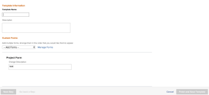

# Een project opslaan als een sjabloon

<!--Audited: 6/2025-->

<!--

(NOTE: Keep this the way it is in the Managing Projects area because the functionality in the UI is "Save as template" at the project level, so users see that in the UI; there is another article that this links to which is more in depth (step-by-step). This functionality needs to stay in both projects AND templates areas.)

-->

<!--

The highlighted information on this page refers to functionality not yet generally available. It is available only in the Preview environment for all customers. The same features will also be available in the Production environment for all customers after a week from the Preview release.     

For more information, see [Interface modernization](/help/quicksilver/product-announcements/product-releases/interface-modernization/interface-modernization.md). 

-->

Als u besluit dat een project ergens in de toekomst opnieuw zal voorkomen, kunt u een malplaatje van dat bestaand project tot stand brengen. Dan, kunt u het malplaatje opnieuw gebruiken, om toekomstige projecten tot stand te brengen die gelijkaardige informatie zouden kunnen bevatten of de zelfde chronologie of de taken met het bestaande project zouden kunnen delen.

## Toegangsvereisten

+++ Breid uit om de toegangseisen voor de functionaliteit in dit artikel weer te geven. 

<table style="table-layout:auto"> 
 <col> 
 <col> 
 <tbody> 
  <tr> 
   <td role="rowheader">Adobe Workfront-pakket</td> 
   <td> 
Alle
 </td> 
  </tr> 
  <tr> 
   <td role="rowheader">Adobe Workfront-licentie</td> 
   <td> 
Standard

   
Plan
 
   </td> 
  </tr> 
  <tr> 
   <td role="rowheader">Configuraties op toegangsniveau</td> 
   <td> 
Toegang tot sjablonen bewerken
 /td&gt; 
  </tr> 
  <tr> 
   <td role="rowheader">Objectmachtigingen</td> 
   <td> 
De toestemmingen van de mening of hoger aan een project 
 
U krijgt de machtiging Beheren voor de sjabloon nadat u het project als een sjabloon hebt opgeslagen
 </td> 
  </tr> 
 </tbody> 
</table>

Voor informatie, zie [&#x200B; vereisten van de Toegang in de documentatie van Workfront &#x200B;](/help/quicksilver/administration-and-setup/add-users/access-levels-and-object-permissions/access-level-requirements-in-documentation.md).

+++

<!--Old:

<table style="table-layout:auto"> 
 <col> 
 <col> 
 <tbody> 
  <tr> 
   <td role="rowheader">Adobe Workfront plan</td> 
   <td> 
Any 
 </td> 
  </tr> 
  <tr> 
   <td role="rowheader">Adobe Workfront license*</td> 
   <td> 
New: Standard 

   Or 
   
Current: Plan 
 
   </td> 
  </tr> 
  <tr> 
   <td role="rowheader">Access level configurations</td> 
   <td> 
Edit access to Templates
 /td> 
  </tr> 
  <tr> 
   <td role="rowheader">Object permissions</td> 
   <td> 
View or higher permissions to a project 
 
You obtain Manage permissions to the template after you save the project as a template
 </td> 
  </tr> 
 </tbody> 
</table>-->

## Een project opslaan als een sjabloon

<!--
Saving a project as a template differs in the Production and the Preview environments. 

### Save a project as a template in the Production environment

1. Go to the project that you want to save as a template. 
1. Click the **More** menu , then **Save as Template**. 
1. Specify the following information for the template:

   <table style="table-layout:auto"> 
    <col> 
    <col> 
    <tbody> 
     <tr> 
      <td role="rowheader">Name</td> 
      <td>Specify a name for the template.</td> 
     </tr> 
     <tr> 
      <td role="rowheader">Description</td> 
      <td>Provide a description for the template.</td> 
     </tr> 
     <tr> 
      <td role="rowheader">Is Active</td> 
      <td> 
Select from the following options:
 
       <ul> 
        <li> 
<strong>Yes</strong>: Other users can find the template and attach it to projects.
 </li> 
        <li><strong>No</strong>: Other users cannot find the template and cannot attach it to projects.</li> 
       </ul> </td> 
     </tr> 
     <tr> 
      <td role="rowheader">Custom Forms</td> 
      <td>Use the drop-down list to select any custom forms to attach to the template. If any custom forms have already been associated with the project, all of the data fields from those custom forms are displayed. You can include up to 10 custom forms on a single template.</td> 
     </tr> 
    </tbody> 
   </table>

1. Click **Manage Forms** to remove or reorder the forms. For information about how to remove and reorder custom forms on the template, see [Custom forms](../../../administration-and-setup/customize-workfront/create-manage-custom-forms/create-and-manage-custom-forms.md).

   

1. Click **Next Step.**
1. In the **Options** section, select the checkbox beside any information you want to clear from the template.

   

1. Click **Next Step.**
1. In the **Exclude** section, select any tasks that you want to exclude from the project.

   

1. Click **Finish and Save Template.**

   Your template now appears in the list of available templates and can either be attached to an existing project or used to create a new one.

### Save a project as a template in the Preview environment

-->

1. Ga naar het project dat u als malplaatje wilt bewaren.
1. Klik **Meer** menu  rechts van de projectnaam in de kopbal, dan **sparen als Malplaatje**.
1. In **sparen als Malplaatje** sectie, specificeer de volgende informatie voor het malplaatje:

   <table style="table-layout:auto"> 
    <col> 
    <col> 
    <tbody> 
     <tr> 
      <td role="rowheader">Sjabloonnaam</td> 
      <td>Geef een naam voor de sjabloon op.</td> 
     </tr> 
     <tr> 
      <td role="rowheader">Beschrijving</td> 
      <td>Geef een beschrijving voor de sjabloon.</td> 
     </tr> 
     <tr> 
      <td role="rowheader">Is actief</td> 
      <td> 
Selecteer een van de volgende opties:
 
       <ul> 
        <li> 
<strong> ja </strong>: Andere gebruikers kunnen het malplaatje vinden en het aan projecten vastmaken.
 </li> 
        <li><strong> Nr </strong>: Andere gebruikers kunnen niet het malplaatje vinden en kunnen het niet aan projecten vastmaken.</li> 
       </ul> </td> 
     </tr> 
     <tr> 
      <td role="rowheader">Aangepaste Forms</td> 
      <td>Gebruik de vervolgkeuzelijst om aangepaste formulieren te selecteren die u aan de sjabloon wilt koppelen. Als er al aangepaste formulieren aan het project zijn gekoppeld, worden alle gegevensvelden van die aangepaste formulieren weergegeven.  u kunt tot 10 douaneformulieren op één enkel malplaatje omvatten.</td> 
     </tr> 
    </tbody> 
   </table>

1. Klik **Forms van de Douane** in het linkerpaneel om de vormen te verwijderen of opnieuw in orde te brengen.

   Als u de volgorde van de formulieren wilt wijzigen, sleept u de formulieren en zet u ze neer in de juiste volgorde.
Om een vorm te verwijderen, selecteer het, dan klik **verwijdert**. Klik **annuleren** om de geselecteerde vormen te verwijderen.

   

1. Werk indien nodig gegevens bij in de bijgevoegde aangepaste formulieren. De informatie wordt naar de sjabloon overgedragen.

1. Klik **Opties** in het linkerpaneel, dan selecteren checkbox naast om het even welke informatie u naar het malplaatje wilt overbrengen. Niet-geselecteerde items worden niet naar de sjabloon overgebracht. Alle opties zijn standaard uitgeschakeld.

   

1. Klik **uitsluiten** in het linkerpaneel, dan om het even welke taken selecteren die u van het project wilt uitsluiten. Standaard zijn alle taken uitgeschakeld.

    uit

1. Klik **Einde en sparen Malplaatje** in de hoger-juiste hoek van het scherm.

   Uw sjabloon wordt nu weergegeven in de lijst met beschikbare sjablonen en kan worden gekoppeld aan een bestaand project of worden gebruikt om een nieuw project te maken.

