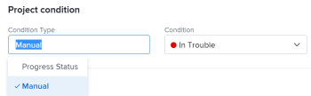

# Stel het Condition Type van een project in

Als projectmanager, kunt u bepalen hoe de Voorwaarde van een project door het Type van Voorwaarde van het project bij te werken wordt berekend. De projectvoorwaarde is een visuele vertegenwoordiging van hoe het project vordert.

## Toegangsvereisten

U moet de volgende toegang hebben om de stappen in dit artikel uit te voeren:

<table style="table-layout:auto"> 
 <col> 
 <col> 
 <tbody> 
  <tr> 
   <td role="rowheader">Adobe Workfront-abonnement*</td> 
   <td> 
Alle
 </td> 
  </tr> 
  <tr> 
   <td role="rowheader">Adobe Workfront-licentie*</td> 
   <td> 
Plan 
 </td> 
  </tr> 
  <tr> 
   <td role="rowheader">Configuraties op toegangsniveau*</td> 
   <td> 
Toegang tot projecten bewerken
 
Opmerking: Als u nog steeds geen toegang hebt, vraagt u de Workfront-beheerder of deze aanvullende beperkingen op uw toegangsniveau instelt. Voor informatie over toegang tot projecten, zie <a href="../../../administration-and-setup/add-users/configure-and-grant-access/grant-access-projects.md" class="MCXref xref">Toegang verlenen tot projecten</a>. Voor informatie over hoe een beheerder van Workfront uw toegangsniveau kan veranderen, zie <a href="../../../administration-and-setup/add-users/configure-and-grant-access/create-modify-access-levels.md" class="MCXref xref">Aangepaste toegangsniveaus maken of wijzigen</a>. 
 </td> 
  </tr> 
  <tr> 
   <td role="rowheader">Objectmachtigingen</td> 
   <td> 
    <ul> 
     <li> 
Contribute-machtigingen voor een project voor het bewerken van het Condition Type in het gebied Projectdetails 
 </li> 
     <li> 
Rechten voor een project beheren om het voorwaardetype te bewerken in het vak Project bewerken
 </li> 
    </ul> 
 Voor informatie over projecttoestemmingen, zie <a href="../../../workfront-basics/grant-and-request-access-to-objects/share-a-project.md" class="MCXref xref">Een project delen in Adobe Workfront</a>.
 
Voor informatie over het aanvragen van aanvullende toegang raadpleegt u <a href="../../../workfront-basics/grant-and-request-access-to-objects/request-access.md" class="MCXref xref">Toegang tot objecten aanvragen </a>.
 </td> 
  </tr> 
 </tbody> 
</table>

&#42;Neem contact op met uw Workfront-beheerder om te weten te komen welk plan, licentietype of toegang u hebt.

## Het voorwaardetype instellen voor een project

1. Ga naar het project waarvoor u het Type van Voorwaarde wilt bijwerken.
1. Voer een van de volgende handelingen uit: 

   * Klik op de knop **Meer** menu  rechts van de projectnaam klikt u op **Bewerken**.
   * Klikken **Projectdetails** in het linkerdeelvenster.

   

1. In de **Type voorwaarde** in het veld kiest u een van de volgende opties:

   * **Handmatig:** De projecteigenaar plaatst manueel de Voorwaarde op het project.

      In dit geval, kan de projecteigenaar de Voorwaarde van het project in de projectkopbal, of de sectie van de Details van het Project bijwerken.

   * **Voortgangsstatus:** Workfront stelt de Voorwaarde in op basis van de Voortgangsstatus van het project. Voor informatie over hoe de Status van de Voortgang wordt berekend, zie [Overzicht van voortgang van project](../../../manage-work/projects/planning-a-project/project-progress-status.md).

1. Klikken **Opslaan** wanneer u het Type van Voorwaarde in het Edit vakje van het Project wijzigt.

   Klikken **Wijzigingen opslaan** wanneer u het Type van Voorwaarde in de sectie van de Details van het Project wijzigt.

 
