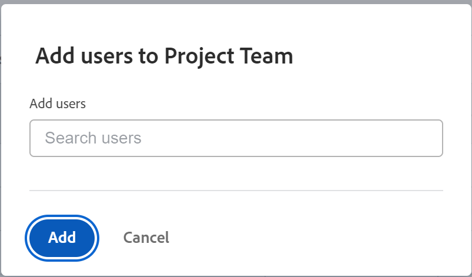
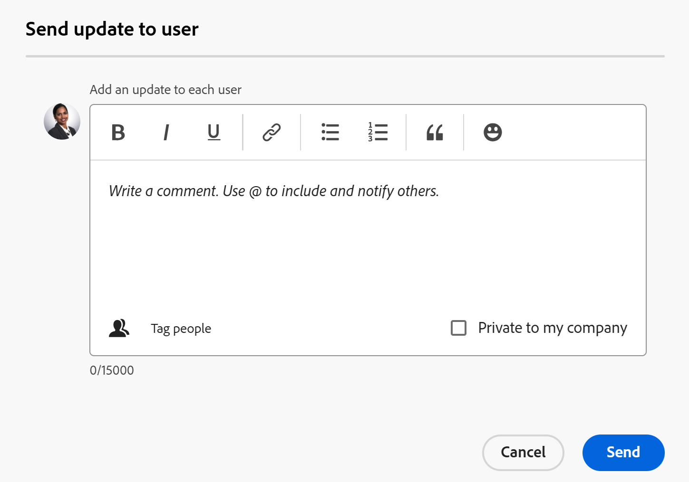

# Het projectteam beheren

<!--take preview and production references out at production - August 7-->

<!--
 

The highlighted information on this page refers to functionality not yet generally available. It is available only in the Preview environment for all customers. The same features will also be available in the Production environment for all customers after a week from the Preview release.      

For more information, see [Interface modernization](/help/quicksilver/product-announcements/product-releases/interface-modernization/interface-modernization.md).  

-->

Het team van het Project bestaat uit gebruikers die met het project worden geassocieerd. Voor meer informatie, zie [&#x200B; Overzicht van het Team van het Project &#x200B;](/help/quicksilver/manage-work/projects/planning-a-project/project-team-overview.md).

De leden van de vertoning van het Team van het Project in de sectie van Mensen van het project.

De gebruikers die in de sectie van Mensen van een projectmalplaatje worden getoond zullen het projectteam worden nadat het project van het malplaatje wordt gecreeerd.

De volgende gebruikers worden automatisch toegevoegd aan het projectteam, voor zowel projecten als malplaatjes:

* Eigenaar
* Sponsor
* Gebruikers die zijn toegewezen aan taken
* Gebruikers die zijn toegewezen aan problemen (alleen voor een project)

De gebruikers in het projectteam ontvangen berichten over het project. Voor meer informatie, zie [&#x200B; de berichttypes van de Gebeurtenis &#x200B;](/help/quicksilver/administration-and-setup/manage-workfront/emails/event-notifications-available-in-wf.md).

U kunt de gebruikers in het project en de teams van het malplaatje beheren door hen (slechts voor het project) toe te voegen, hen te verwijderen, of hen te verzenden een update.

## Toegangsvereisten

+++ Vouw uit om de vereisten voor toegang weer te geven. 

<table style="table-layout:auto"> 
 <col> 
 <col> 
 <tbody> 
  <tr> 
   <td role="rowheader">Adobe Workfront-abonnement*</td> 
   <td> 
Alle
 </td> 
  </tr> 
  <tr> 
   <td role="rowheader">Adobe Workfront-licentie*</td> 
   <td> 
Standard 

    
Plan 

    </td> 
  </tr> 
  <tr> 
   <td role="rowheader">Toegangsniveau</td> 
   <td> 
Toegang tot projecten en sjablonen bewerken
 
Toegang tot gebruikers weergeven of vergroten
 </td> 
  </tr> 
  <tr> 
   <td role="rowheader">Objectmachtigingen</td> 
   <td> 
De toestemmingen van de mening of hoger aan een project of aan een malplaatje
 </td> 
  </tr> 
 </tbody> 
</table>

*For informatie, zie [&#x200B; vereisten van de Toegang in de documentatie van Workfront &#x200B;](/help/quicksilver/administration-and-setup/add-users/access-levels-and-object-permissions/access-level-requirements-in-documentation.md).

+++

<!--Old access: 

You must have the following access to perform the steps in this article:

<table style="table-layout:auto"> 
 <col> 
 <col> 
 <tbody> 
  <tr> 
   <td role="rowheader">Adobe Workfront plan*</td> 
   <td> 
Any
 </td> 
  </tr> 
  <tr> 
   <td role="rowheader">Adobe Workfront license*</td> 
   <td> 
Plan 
 </td> 
  </tr> 
  <tr> 
   <td role="rowheader">Access level configurations*</td> 
   <td> 
Edit access to Projects
 
View or higher access to Users
 
<b>NOTE</b> 
   
   If you still don't have access, ask your Workfront administrator if they set additional restrictions in your access level. For information on how a Workfront administrator can modify your access level, see <a href="../../../administration-and-setup/add-users/configure-and-grant-access/create-modify-access-levels.md" class="MCXref xref">Create or modify custom access levels</a>.
 </td> 
  </tr> 
  <tr> 
   <td role="rowheader">Object permissions</td> 
   <td> 
View or higher permissions to the project
 
For information on requesting additional access, see <a href="../../../workfront-basics/grant-and-request-access-to-objects/request-access.md" class="MCXref xref">Request access to objects </a>.
 </td> 
  </tr> 
 </tbody> 
</table>

*To find out what plan, license type, or access you have, contact your Workfront administrator.-->

## Gebruikers toevoegen aan een projectteam

Wanneer u gebruikers aan het projectteam toevoegt, krijgen zij de toestemmingen van de Mening over het project en de taken, de kwesties, en de documenten van het project. Voor meer informatie, zie het overzicht van het artikel [&#x200B; Team van het Project &#x200B;](../../../manage-work/projects/planning-a-project/project-team-overview.md).

>[!TIP]
>
>De gebruikers op het Team van het Project worden niet automatisch toegevoegd aan de hulpmiddelen van het middelbeheer voor het project.

U kunt gebruikers aan het projectteam op de volgende manieren toevoegen:

* [&#x200B; voegt automatisch gebruikers aan een Team van het Project toe &#x200B;](#automatically-add-users-to-a-project-team)
* [Voeg handmatig gebruikers toe aan een projectteam](#manually-add-users-to-a-project-team)

### Automatisch gebruikers toevoegen aan een projectteam {#automatically-add-users-to-a-project-team}

De gebruikers die de volgende rollen op het project vervullen worden automatisch toegevoegd aan het projectteam en in de sectie van Mensen verschijnen wanneer het project wordt gecreeerd:

* De maker van het project
* De eigenaar van het project
* De projectsponsor

De gebruikers worden ook automatisch toegevoegd aan het projectteam wanneer zij aan het volgende worden toegewezen:

* Taken
* Problemen

### Voeg handmatig gebruikers toe aan een projectteam {#manually-add-users-to-a-project-team}

Als de gebruikers die geen rol op het project vervullen over bepaalde updates of veranderingen tijdens het leven van het project op de hoogte willen worden gebracht, kunt u hen aan het projectteam manueel toevoegen.

Voor meer informatie over welke berichten voor gebruikers op het projectteam kunnen worden toegelaten, zie [&#x200B; het berichttypes van de Gebeurtenis &#x200B;](../../../administration-and-setup/manage-workfront/emails/event-notifications-available-in-wf.md).

<!--drafted - this used to be the case, in the note below but this limitation was removed on Jan 5, 2023 - as a patch, not a release feature:

>[!IMPORTANT]
>
>You can add to the Project Team only users that belong to the Group associated with the project. You cannot add users that belong to the Subgroups of the project's group. 

-->

## Personen in een project beheren

1. Ga naar het project u het projectteam voor wilt beheren.

   >[!TIP]
   >
   >U moet gebruikers hebben die aan taken, kwesties of als belanghebbenden op het project worden toegewezen om hen te hebben tonen in de sectie van Mensen.

1. Klik **Mensen** in het linkerpaneel.

1. Klik **toevoegen gebruikers**.

   **voegt gebruikers aan de vakvertoningen van het Team van het Project** toe.

   

1. In **voeg gebruikers** doos toe, begin typend de naam van een actieve gebruiker van Workfront die u aan het projectteam wilt toevoegen, dan klik de naam wanneer het in de lijst verschijnt.

   Herhaal deze stap om meerdere gebruikers aan het projectteam toe te voegen. De gebruikers moeten tot de groep behoren verbonden aan het project.

   >[!TIP]
   >
   >* U kunt geen gebruikers toevoegen door hun teams, groepen, bedrijven, of baanrollen toe te voegen.
   >* Terwijl u de gebruikers toevoegt, ziet u de avatar, de primaire rol van de gebruiker en hun e-mailadres om onderscheid te maken tussen gebruikers met identieke namen. Gebruikers moeten aan ten minste één taakrol zijn gekoppeld om deze te kunnen bekijken terwijl u ze toevoegt.
   >
   >  De instelling Contactinfo weergeven moet zijn ingeschakeld op uw toegangsniveau zodat gebruikers de e-mails van gebruikers kunnen bekijken. Voor informatie, zie [&#x200B; toegang van de Verlening tot gebruikers &#x200B;](../../../administration-and-setup/add-users/configure-and-grant-access/grant-access-other-users.md).

1. Klik **toevoegen**.

   De gebruikers krijgen de toestemmingen van de Mening aan het project en ontvangen berichten over het project als deel van het projectteam.

1. (Facultatief) als u een gebruiker een bericht wilt ontvangen wanneer hun baanrol aan een taak, een kwestie, of een projectgoedkeuring wordt toegevoegd, binnen de **kolom van de Rol 0&rbrace; van de Baan &lbrace;voor de gebruiker klikt, en een baanrol selecteert die met de goedkeuring zal worden geassocieerd.**

   De gebruikers ontvangen meldingen die betrekking hebben op de goedkeuringen die zijn toegewezen aan de geselecteerde taakrol.

   Voor meer informatie zie de &quot;Op rol-gebaseerde goedkeuringen&quot;sectie in het artikel [&#x200B; overzicht van het Team van het Project &#x200B;](/help/quicksilver/manage-work/projects/planning-a-project/project-team-overview.md).

1. Selecteer één of verscheidene gebruikers in de lijst, dan klik **verwijderen** pictogram  om hen uit het team te verwijderen.

1. Klik **ja, verwijder Geselecteerde Gebruikers** om de gebruikers te bevestigen en te verwijderen.

   De gebruikers worden verwijderd en unassigned van onvolledige het werkpunten.

   Voor meer informatie, zie de [&#x200B; Overwegingen voor het verwijderen van gebruikers uit een sectie van het projectteam &#x200B;](#considerations-for-removing-users-from-a-project-team) in dit artikel.
1. (Facultatief) om een update voor dit project naar gebruikers te verzenden, klik **Update allen** om de update naar iedereen op het team te verzenden

   of

   Selecteer één of veelvoudige gebruikers in de lijst, dan klik **verzenden Update naar Gebruiker**.

   <!--update screen shot when they fix the bug - the text above the box needs to match the OLD box, below-->

   

   <!--Old UI for projects but the text above the comment box is right and matches the functionality):
   -->

   **verzendt update naar gebruiker** opent doos.

1. Voer een van de volgende handelingen uit:

   * Voeg een update toe voor de geselecteerde gebruikers.
   * Klik op het slotpictogram om de update privé te maken voor de gebruikers in uw bedrijf.
   * Geef extra gebruikers de tag om dezelfde update te ontvangen.
   * Klik **verzenden**.

   De update wordt toegevoegd aan de **sectie van Updates** van het project en alle geselecteerde gebruikers tonen als geëtiketteerde gebruikers.

   Gebruikers ontvangen mogelijk een e-mailbericht als ze hiervoor zijn ingeschakeld en ontvangen een melding in de app over de nieuwe update.

1. (Facultatief) klik het **pictogram van de Uitvoer** Uitvoer 

   of

   Selecteer gebruikers, dan klik het **pictogram van de Uitvoer** om slechts specifieke gebruikers uit te voeren.

## Personen op een sjabloon beheren

1. Ga naar het malplaatje u het projectteam voor wilt beheren.

   >[!TIP]
   >
   >U moet gebruikers hebben die aan taken of als belanghebbenden op het malplaatje worden toegewezen om hen te hebben tonen in de sectie van Mensen.

1. Klik **Mensen** in het linkerpaneel.

1. Selecteer één of verscheidene gebruikers in de lijst, dan klik **verwijderen** pictogram om hen uit het team te verwijderen.

1. Klik **ja, verwijder Geselecteerde Gebruikers** om de gebruikers te bevestigen en te verwijderen.

   De gebruikers worden verwijderd en unassigned van de malplaatjetaken.

   Voor meer informatie, zie de [&#x200B; Overwegingen voor het verwijderen van gebruikers uit een sectie van het projectteam &#x200B;](#considerations-for-removing-users-from-a-project-team) in dit artikel.

1. (Facultatief) om een update naar gebruikers te verzenden, klik **Update allen** om de update naar alle gebruikers in de lijst te verzenden

   of

   Selecteer één of veelvoudige gebruikers in de lijst, dan klik **verzenden Update naar Gebruiker**.

   <!--update screen shot for unshim production, notice the text above the box - it needs to say "Post an update to each person's profile"-->

   

   **verzendt update naar gebruiker** opent doos.

1. Ga als volgt te werk:

   * Voeg een update toe voor de geselecteerde gebruikers.
   * Klik **de mensen van de Markering** om extra gebruikers te etiketteren om de zelfde update te ontvangen.
   * Selecteer de **Privé aan mijn bedrijf** optie om de update privé aan de gebruikers in uw bedrijf te maken.
   * Klik **verzenden**.

     >[!TIP]
     >
     >**Privé aan mijn bedrijf** het plaatsen is slechts beschikbaar wanneer uw profiel van Workfront met een bedrijf wordt geassocieerd.

   De update wordt toegevoegd aan de **sectie van Updates** van elk geëtiketteerd gebruikersprofiel.

   Gebruikers ontvangen mogelijk een e-mailbericht als ze hiervoor zijn ingeschakeld en ontvangen een melding in de app over de nieuwe update.

1. Klik het **pictogram van de Uitvoer** pictogram van de Uitvoer 

   of

   Selecteer gebruikers, dan klik het **pictogram van de Uitvoer** om slechts specifieke gebruikers uit te voeren.

## Overwegingen voor het verwijderen van gebruikers uit een Team van het Project

Wanneer u gebruikers uit hun rollen op het project verwijdert, blijven zij deel van het projectteam.

U moet hen uit het projectteam, uit de sectie van Mensen van het project verwijderen, voor hen ophouden ontvangend berichten die naar het projectteam worden verzonden.

Als u een gebruiker uit het projectteam verwijdert en de gebruiker aan taken of kwesties in het project wordt toegewezen, wordt de gebruiker unassigned van de taken en de kwesties die niet worden voltooid. In dit geval worden de taken en uitgaven teruggezet naar het gedeelte Niet toegewezen werk in de werklastbalans.

De gebruikers die aan voltooide taken en kwesties worden toegewezen blijven toegewezen aan de taken en de kwesties, zelfs nadat u hen uit het projectteam verwijdert.

De volgende gebruikers worden verwijderd uit hun rollen op het project wanneer u hen uit de sectie van Mensen van een project of een malplaatje verwijdert:

* Gebruikers die zijn toegewezen aan onvolledige taken
* Gebruikers die zijn toegewezen aan onvolledige problemen

De volgende gebruikers worden niet verwijderd uit hun rollen op het project wanneer u hen uit de sectie van Mensen van een project of een malplaatje verwijdert:

* Eigenaar
* Sponsor

Voor meer informatie over het verwijderen van gebruikers uit het projectteam, zie [&#x200B; gebruikers uit projecten &#x200B;](../../../manage-work/projects/manage-projects/remove-users-from-projects.md) verwijderen.

