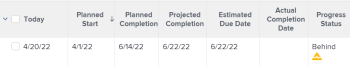

# Overzicht van voortgang van project

<!--Audited: 12/2023-->

Adobe Workfront bepaalt de Voortgangsstatus van een project door de vooruitgang van het project over zijn chronologie te bekijken. U kunt Workfront vormen om de Voorwaarde van een project te bepalen dat op de waarde van de Status van de Voortgang van de taken wordt gebaseerd. Voor meer informatie over het vormen van de Voorwaarde van het project, zie het artikel [&#x200B; Overzicht van het Type van de Voorwaarde en van de Voorwaarde van het Project &#x200B;](../../../manage-work/projects/manage-projects/project-condition-and-condition-type.md).

Hieronder vindt u de stand van de projecten in Workfront:

<table style="table-layout:auto"> 
 <col> 
 <col> 
 <tbody> 
  <tr> 
   <td>Op tijd</td> 
   <td> De Voortgangsstatus van een project is <strong> op Tijd </strong> als:<ul><li>Als zowel de verwachte als de geschatte voltooiingsdata eerder zijn dan of gelijk zijn aan de geplande uitvoeringsdatum van het project</li></ul> 
  
 </td> 
  </tr> 
  <tr> 
   <td>Risico</td> 
   <td> De Voortgangsstatus van een project is <strong> bij Risico </strong> als <strong> allen </strong> van het volgende waar zijn:<ul><li>Zowel de geschatte als de verwachte voltooiingsdata zijn in de toekomst</li><li> De geschatte voltooiingsdatum valt later dan zowel de geplande uitvoeringsdatum als de verwachte uitvoeringsdatum </li></ul>
  
 </td> 
  </tr> 
  <tr> 
   <td>Achter</td> 
   <td> De Voortgangsstatus van een project is <strong> Achter </strong> als <strong> allen </strong> van het volgende waar zijn:<ul><li>Zowel de geschatte als de verwachte voltooiingsdata zijn in de toekomst</li><li> Zowel de geschatte als de verwachte voltooiingsdata zijn later dan de geplande uitvoeringsdatum van het project</li><li> De geschatte voltooiingsdatum is niet later dan de verwachte afsluitdatum</li></ul> 
  
 </td> 
  </tr> 
  <tr> 
   <td>Late</td> 
   <td> 
     De status van de Voortgang van een project is <strong> Late </strong> als <strong> één van beiden </strong> van het volgende waar is:<ul><li>Het project is voltooid en de datum waarop het daadwerkelijk is voltooid is later dan de geplande datum van voltooiing 
  
 </li> 
     <li> 
Het project is niet voltooid en de geplande einddatum van het project is in het verleden 
  
 </li> 
    </ul> </td> 
  </tr> 
 </tbody> 
</table>

Overweeg het volgende:

* De verwachte afsluitende datum van het project wordt bepaald door de taak op het kritieke pad met de meest recente geplande afwerkingsdatum.
* De geschatte uitvoeringsdatum van het project wordt bepaald door de taak op het kritieke pad met de meest recente geschatte uitvoeringsdatum.

Voor informatie over het project Kritieke Weg, zie [&#x200B; Overzicht van het project Kritieke Weg &#x200B;](../../../manage-work/tasks/manage-tasks/critical-path.md).

Voor informatie over Geprojecteerde Datums van de Voltooiing, zie [&#x200B; Overzicht van de Geprojecteerde Datum van de Voltooiing voor projecten, taken, en kwesties &#x200B;](../../../manage-work/projects/planning-a-project/project-projected-completion-date.md).
