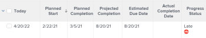

# Overzicht van voortgang van project

Adobe Workfront bepaalt de Voortgangsstatus van een project door de vooruitgang van het project over zijn chronologie te bekijken. U kunt Workfront vormen om de Voorwaarde van een project te bepalen dat op de waarde van de Status van de Voortgang van de taken wordt gebaseerd. Voor meer informatie over het vormen van de Voorwaarde van het project, zie het artikel [Overzicht van het type Projectvoorwaarde en Voorwaarde](../../../manage-work/projects/manage-projects/project-condition-and-condition-type.md).

Hieronder vindt u de stand van de projecten in Workfront:

<table style="table-layout:auto"> 
 <col> 
 <col> 
 <tbody> 
  <tr> 
   <td>Op tijd</td> 
   <td> 
Als zowel de voorspelde als de geschatte voltooiingsdatums eerder zijn dan of gelijk zijn aan de geplande uitvoeringsdatum van het project, is de status van de voortgang van het project <strong>Op tijd</strong>.
 
  
 </td> 
  </tr> 
  <tr> 
   <td>Risico</td> 
   <td> 
Wanneer zowel de geraamde als de verwachte voltooiingsdatums in de toekomst maar later zijn dan de geplande uitvoeringsdatum van het project en de geschatte uitvoeringsdatum later is dan de verwachte uitvoeringsdatum, is de status van de voortgang van het project <strong>Risico</strong>. 
 
  
 </td> 
  </tr> 
  <tr> 
   <td>Achter</td> 
   <td> 
Wanneer zowel de geraamde als de verwachte voltooiingsdatums in de toekomst maar later zijn dan de geplande uitvoeringsdatum van het project, maar de geschatte uitvoeringsdatum niet later is dan de verwachte uitvoeringsdatum, is de status van de voortgang van het project <strong>Achter</strong>.
 
  
 </td> 
  </tr> 
  <tr> 
   <td>Late</td> 
   <td> 
    <ul> 
     <li> 
Als het project volledig is en de Werkelijke Voltooiingsdatum later is dan de Geplande Voltooiingsdatum, is de Voortgangsstatus van het project <strong>Late</strong>. 
 
  
 </li> 
     <li> 
Als het project niet volledig is en de geplande Voltooiingsdatum van het project in het verleden is, dan is de status van de projectvooruitgang <strong>Late</strong>. 
 
  
 </li> 
    </ul> </td> 
  </tr> 
 </tbody> 
</table>

Overweeg het volgende:

* De verwachte afsluitende datum van het project wordt bepaald door de taak op het kritieke pad met de meest recente geplande afwerkingsdatum.
* De geschatte uitvoeringsdatum van het project wordt bepaald door de taak op het kritieke pad met de meest recente geschatte uitvoeringsdatum.

Voor informatie over het project Kritieke Weg, zie [Overzicht van het project Kritieke Weg](../../../manage-work/tasks/manage-tasks/critical-path.md).

Voor informatie over de Geprojecteerde Datums van de Voltooiing, zie [Overzicht van de geplande afsluitdatum voor projecten, taken en problemen](../../../manage-work/projects/planning-a-project/project-projected-completion-date.md).
