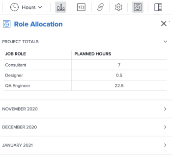

# Geplande uren van project weergeven in het deelvenster Roltoewijzing

U kunt roltoewijzing voor alle baanrollen bekijken die aan het werkpunten in een project in het paneel van de Toewijzing van de Rol van het project worden toegewezen.

>[!NOTE]
>
>In dit artikel wordt verwezen naar het weergeven van de taakrollen die horen bij taken en problemen in een project en de toegewezen geplande uren in het deelvenster Rollen van een project. Raadpleeg het volgende voor informatie over het combineren van geplande uren met initiatiefuren via het deelvenster Roltoewijzing bij gebruik van de Adobe Workfront Scenario-planner:
>
>* [&#x200B; toon roltoewijzing voor projecten en initiatieven in de taaklijst &#x200B;](../../../scenario-planner/show-role-allocation-task-list-nwe.md)
>* [&#x200B; toon roltoewijzing voor projecten en initiatieven in de Balancer van de Werkbelasting &#x200B;](../../../scenario-planner/show-role-allocation-workload-balancer.md)
>
>  U moet een vergunning Scenario Planner hebben om initiatiefuren in het paneel van de Toewijzing van de Rol te zien. Voor informatie over de Planner van het Scenario, zie [&#x200B; begonnen worden met de Planner van het Scenario &#x200B;](../../../scenario-planner/get-started-with-scenario-planning.md).
>
>Als uw bedrijf in het verleden de Adobe Scenario Planner heeft gekocht, is er van alles overgebleven. De functie Scenario Planner kan niet meer worden aangeschaft.

## Toegangsvereisten

+++ Breid uit om de toegangseisen voor de functionaliteit in dit artikel weer te geven. 

<table style="table-layout:auto"> 
 <col> 
 <col> 
 <tbody> 
  <tr> 
   <td role="rowheader">Adobe Workfront-pakket</td> 
   <td> 
Adobe Workfront Ultimate

   
Adobe Workflow Ultimate

    </td> 
  </tr> 
  <tr> 
   <td role="rowheader">Adobe Workfront-licentie</td> 
   <td> 
   
Licht of hoger

   
Controleren of hoger
 </td> 
  </tr> 
  <tr> 
   <td role="rowheader">Configuraties op toegangsniveau</td> 
   <td> 
Toegang tot projecten weergeven of vergroten

   
Toegang tot Scenario-planner bewerken om de uren van initiatieven bij te werken

   </td> 
  </tr> 
  <tr> 
   <td role="rowheader">Objectmachtigingen</td> 
   <td> 
De mening of hogere toestemmingen op het project
 </td> 
  </tr> 
 </tbody> 
</table>

Voor informatie, zie [&#x200B; vereisten van de Toegang in de documentatie van Workfront &#x200B;](/help/quicksilver/administration-and-setup/add-users/access-levels-and-object-permissions/access-level-requirements-in-documentation.md).

+++

<!--Old:

able style="table-layout:auto"> 
 <col> 
 <col> 
 <tbody> 
  <tr> 
   <td role="rowheader">Adobe Workfront plan*</td> 
   <td> 
Any 
 </td> 
  </tr> 
  <tr> 
   <td role="rowheader">Adobe Workfront license*</td> 
   <td> 
Review or higher
 </td> 
  </tr> 
  <tr> 
   <td role="rowheader">Access level configurations*</td> 
   <td> 
View or higher access to Projects
 
If you still don't have access, ask your Workfront administrator if they set additional restrictions in your access level. For information on how a Workfront administrator can modify your access level, see <a href="../../../administration-and-setup/add-users/configure-and-grant-access/create-modify-access-levels.md" class="MCXref xref">Create or modify custom access levels</a>.
 </td> 
  </tr> 
  <tr> 
   <td role="rowheader">Object permissions</td> 
   <td> 
View or higher permissions on the project
 
For information on requesting additional access, see <a href="../../../workfront-basics/grant-and-request-access-to-objects/request-access.md" class="MCXref xref">Request access to objects </a>.
 </td> 
  </tr> 
 </tbody> 
</table>-->

## Vereisten

U moet het volgende hebben:

* Taken of problemen die zijn toegewezen aan taakrollen of aan gebruikers die zijn gekoppeld aan een taakrol.

  >[!TIP]
  >
  >Als de taken of problemen niet zijn toegewezen, niet zijn toegewezen aan teams of zijn toegewezen aan gebruikers zonder taakrol, is de geplande uren van het project nul in het deelvenster Roltoewijzing.

* Taken en kwesties met een Duur hoger dan nul.

## Geplande uren van project weergeven in het deelvenster Roltoewijzing

{{step1-to-projects}}

1. Klik op de naam van een project om het te openen. Hiermee opent u de projectpagina.
1. Klik op een van de volgende opties in het linkerdeelvenster:

   * **Taken**
   * **de Balancer van de Werkbelasting**

1. Klik het **pictogram van de roltoewijzing van de Show** pictogram .

   Het deelvenster Roltoewijzing wordt weergegeven.

   

1. Herzie de volgende informatie in het **deelvenster van de Toewijzing van de Rol**:

   | Veld | Beschrijving |
   |---|---|
   | **Rol van de Baan** | De rollen van de baan die aan taken en kwesties op het project worden toegewezen. Dit kunnen taakrollen zijn die rechtstreeks aan taken en kwesties of baanrollen worden toegewezen verbonden aan gebruikers die aan taken en kwesties op het project worden toegewezen. |
   | **Geplande Uren** | Het totale aantal geplande uren van taken en kwesties die aan baanrollen of gebruikers worden toegewezen verbonden verbonden aan een baanrol op het project. |

