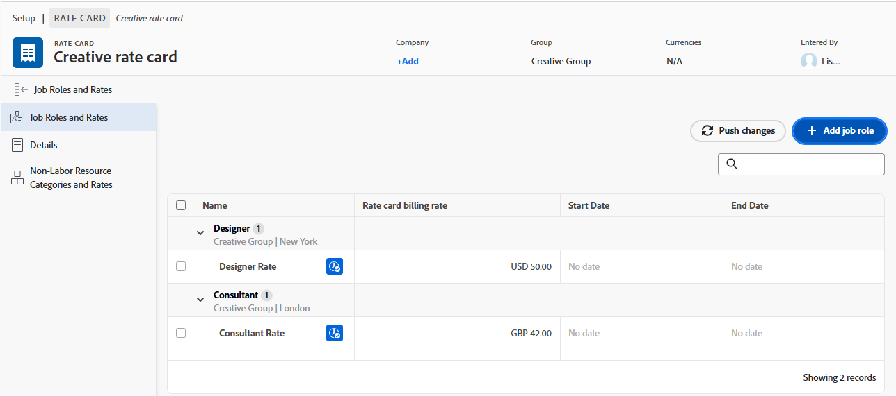

# Overzicht van facturering en inkomsten

<!-- Audited: 1/2024 -->

Als projectmanager, kunt u het factureren tarieven gebruiken om opbrengst op uw projecten te vangen.

In dit artikel worden de ontvangsten voor het bijhouden van projecten beschreven. De opbrengsten worden anders berekend in het gebruiksrapport. Voor informatie over de berekeningen van de Opbrengst in het Rapport van het Gebruik, zie [ informatie van het het middelgebruik van de Mening ](../../../resource-mgmt/resource-utilization/view-utilization-information.md).

## Overzicht van de factuurtarieven

Houd rekening met het volgende wanneer u met factureringssnelheden werkt:

* U hebt een abonnement- of standaardlicentie met Edit-toegang tot financiële gegevens (met name factureringssnelheden) nodig om factureringssnelheden te beheren.
Voor meer informatie over het verlenen van toegang tot Financiële Gegevens, zie [ Toegang van de Verlening tot financiële gegevens ](../../../administration-and-setup/add-users/configure-and-grant-access/grant-access-financial.md).

* Factureringstarieven zijn inkomstenbedragen per werkeenheid die verband houden met functies of gebruikers.

  Door de tarieven te vermenigvuldigen met de uren die aan het werk worden besteed, genereert u inkomsten voor uw projecten.

* Nadat u de factureringssnelheden hebt vastgesteld, kunt u de inkomsten bijhouden door factureringsgegevens te maken om te registreren wat wel en niet is gefactureerd.

  >[!TIP]
  >
  >Wanneer u een Factureringsverslag als Gefactureerd merkt, kan het nooit worden uitgegeven. Dit is belangrijk wanneer uw tarieven variëren en u de opbrengst en de uitgaveninformatie over uw project wilt sluiten. Als u deze aan een factureringsrecord toevoegt en als factureringsrecord markeert, wordt de record niet bijgewerkt wanneer de tarieven in uw systeem worden bijgewerkt.

  Voor meer informatie over het creëren van het factureren verslagen, zie het artikel [ het factureren verslagen ](../../../manage-work/projects/project-finances/create-billing-records.md) creëren.

* U kunt factureringstarieven voor gebruikers, baanrollen tot stand brengen, of u kunt een eenmalig factureringspercentage voor een project of een taak hebben.

>[!IMPORTANT]
>
>De tarieven die de opbrengst berekenen behoren tot de gebruiker die de tijd registreert, of tot hun baanrollen.

### Factureringssnelheden voor kaarten

{{ultimate-package}}

Wanneer u toegang hebt om tariefkaarten te bewerken, kunt u tariefkaarten definiëren met meerdere factureringssnelheden per rol, op basis van kenmerken zoals locatie en groep of instantie. Kenmerken kunnen tot vijf niveaus worden geconfigureerd.

Een tariefkaart moet aan een project worden vastgemaakt om zijn tarieven toe te passen. Wanneer een tarief op de tariefkaart wordt gesloten, kan het niet op het projectniveau worden met voeten getreden.

De kaarttarieven van het tarief maken deel uit van de hiërarchie voor het bepalen van tarieven, die op het type van taakopbrengst worden gebaseerd.

Voor meer informatie over het creëren van tariefkaarten, zie [ tariefkaarten beheren ](/help/quicksilver/administration-and-setup/manage-enterprise-operations/manage-rate-cards.md).

Voor meer informatie over de tariefhiërarchie, zie [ Overzicht van opbrengst en kostenhiërarchie ](/help/quicksilver/manage-work/projects/project-finances/overview-revenue-cost-hierarchy.md).

### Factureringstarieven gebruiker {#user-billing-rates}

Als gebruikersbeheerder, wanneer u een gebruiker creeert, kunt u hen met datum-efficiënte het Factureren Tarieven associëren door waarden voor het Factureren per de gebieden van Uur en de data voor de tarieven te specificeren.

Voor meer informatie over het creëren van gebruikers, zie het artikel [ gebruikers ](../../../administration-and-setup/add-users/create-and-manage-users/add-users.md) toevoegen.

### Factureringstarieven voor functies {#job-role-billing-rates}

Als beheerder van Adobe Workfront, wanneer u een baanrol creeert, kunt u het met datum-efficiënte het Factureren Tarieven associëren door de tariefwaarden en data te specificeren.

U kunt de waarde van de factureringssnelheid van een taakrol definiëren met de basisvaluta van uw Workfront-systeem of met een andere valuta. Ook in de wisselkoersen van uw systeem moeten extra valuta&#39;s worden gedefinieerd.

Voor meer informatie over het creëren van baanrollen, zie het artikel [ creëren en baanrollen beheren ](../../../administration-and-setup/set-up-workfront/organizational-setup/create-manage-job-roles.md).

 uit

### Vaste factureringstarieven voor projecten of taken {#fixed-billing-rates-for-projects-or-tasks}

Naast gebruikers en het aantal werkuren per uur kunt u ook de volgende vaste factureringssnelheden gebruiken:

* Vast bedrag voor Vast uurwerk type van Inkomsten
* Vast bedrag voor type vaste inkomsten

Voor meer informatie over hoe de vaste het factureren tarieven worden gebruikt om opbrengst te berekenen, zie [ Overzicht van de Types van taakopbrengst ](#overview-of-task-revenue-types).

### Factureringssnelheden negeren - Workflow Ultimate-pakket

>[!IMPORTANT]
>
>U kunt factureringstarieven met voeten treden verbonden aan baanrollen of gebruikers op het projectniveau. U kunt vaste tarieven niet overschrijven.

Op projectniveau, kunt u:

* Overschrijf een factureringstarief voor een baanrol (met toegepaste attributen, zoals plaats, groep, of agentschap).
* Overschrijf een factureringstarief voor een specifieke gebruiker op dat project.

Overschrijvingen van factureringssnelheden zijn niet algemeen. U zou bijvoorbeeld &quot;Designer&quot; niet als een rol negeren. In plaats daarvan zou u &quot;Designer - New York - Agency X&quot; voor de relevante datum-effectieve periode overschrijven. Overschrijvingen respecteren de factureringstariefhiërarchie, zodat past het systeem ze altijd toe in volgorde van prioriteit.

### Factureringssnelheden overschrijven - alle andere pakketten

>[!IMPORTANT]
>
>U kunt factureringstarieven met voeten treden verbonden aan baanrollen. Je kunt de factureringssnelheden of vaste tarieven van gebruikers niet overschrijven.

U kunt de factureringssnelheden voor de rol overschrijven voor:

* Een specifieke onderneming

  Voor meer informatie over het creëren van het factureren van de baanrol tarieven specifiek voor een bedrijf, zie [ bedrijven ](../../../administration-and-setup/set-up-workfront/organizational-setup/create-and-edit-companies.md) creëren en uitgeven.

* Een specifiek project

  Voor meer informatie over het creëren van het factureren van de baanrol tarieven specifiek voor een project, zie het artikel [ Overzicht van het met voeten treden van het factureren tarieven en het berekenen van opbrengst op een project ](/help/quicksilver/manage-work/projects/project-finances/override-role-billing-rates-and-calculate-project-revenue.md).

## Opbrengsten bijhouden

Workfront kan Geplande Inkomsten automatisch bijhouden wanneer taken worden gemaakt op basis van de geplande uren van de taken.

Het kan de Ware Winst ook automatisch volgen wanneer de Ware Uren het programma worden geopend op de taken, de kwesties, en op het project.

De volgende lijst toont de soorten opbrengst verbonden aan taken, kwesties, en projecten.

<table style="table-layout:auto"> 
 <col> 
 <col> 
 <tbody> 
  <tr> 
   <td role="rowheader">Geplande inkomsten</td> 
   <td> 
Voor taken, is dit de opbrengst verbonden aan de Geplande Uren van taken. De geplande uren van alle taken lopen tot en met de geplande uren van het project om bij te dragen tot de berekening van het geplande projectuur. 
 
Voor meer informatie over Geplande Uren in Workfront, zie <a href="../../../manage-work/tasks/task-information/planned-hours.md" class="MCXref xref"> Gepland overzicht van Uren </a>. 
 <ul><li>
Workfront berekent de geplande inkomsten voor taken aan de hand van de volgende formule:

   
<code>Task Planned Revenue = Planned Hours * Billing hourly rate</code>
 
<strong> NOTA </strong>  het factureren uurtarief in de formule overweegt om het even welke datum-efficiënte veranderingen van het tarief.
 </li><li>
Workfront berekent de geplande inkomsten voor projecten aan de hand van de volgende formule:
 
<code>Project Planned Revenue = SUM (All tasks Planned Revenue) + Fixed Revenue</code>

   
<b>OPMERKING</b>

De geplande ontvangsten van het project die in het gebied van de Details van het Project en in projectverslagen worden getoond verschillen van de geplande opbrengst die in het rapport van het Gebruik toont. 
</li></ul> 
De geplande ontvangsten in het gebied Projectdetails weerspiegelen de taakontvangsten die verband houden met de geplande uren van de taak en de vaste opbrengsten van het project. De geplande inkomsten in het gebruiksrapport geven de geplande inkomsten weer die alleen verband houden met de geplande uren uit de taakopdrachten voor het project. 
 
     
Example: </b>"> 
      
Als het project 1 taak met 10 uren heeft, die aan een Consultant met $20 uurtarief wordt toegewezen, en het project heeft $100 Vaste Inkomsten, toont het rapport van het Gebruik $200 voor Geplande Inkomsten (de Geplande Inkomsten verbonden aan de uren op de taak). In de sectie Projectdetails wordt $300 weergegeven (de geplande inkomsten uit de taak en de vaste inkomsten voor het project.) 
 
     
 
 
De Geplande Inkomsten van de taak wordt berekend gebruikend de het facturerings uurtarieven van de gebruikers of baanrollen die aan de taken worden toegewezen. Het type inkomsten van de taken is van invloed op het percentage (gebruiker of rol) dat wordt gebruikt voor de berekening van de geplande inkomsten. Raadpleeg de volgende secties in dit artikel voor meer informatie:
 
    <ul> 
     <li> 
<a href="#overview-of-task-revenue-types" class="MCXref xref"> Overzicht van de Types van taakopbrengst </a> 
 </li> 
     <li> 
<a href="#revenue-calculations-for-tasks-based-on-user-and-role-assignments" class="MCXref xref"> de berekeningen van de Inkomsten voor taken die op gebruikers en de taken van de Rol worden gebaseerd </a> 
 </li> 
    </ul> 
Voor informatie over Geplande opbrengstberekeningen in het rapport van het Gebruik, zie <a href="../../../resource-mgmt/resource-utilization/view-utilization-information.md" class="MCXref xref"> informatie van het het middelgebruik van de Mening </a>. 
 </td> 
  </tr> 
  <tr> 
   <td role="rowheader">Werkelijke ontvangsten*</td> 
   <td> 
De inkomsten in verband met de werkelijke uren van taken, kwesties en projecten. 
 
In het algemeen berekent Workfront de werkelijke inkomsten aan de hand van de volgende formule:
 
<code>Actual Revenue = Actual Hours * Billing rate</code> 
 
<strong> NOTA </strong>  het factureren uurtarief in de formule overweegt om het even welke datum-efficiënte veranderingen van het tarief.
 
Voor informatie over de Ware berekeningen van de Inkomsten in het Rapport van het Gebruik, zie <a href="../../../resource-mgmt/resource-utilization/view-utilization-information.md" class="MCXref xref"> informatie van het het middelgebruik van de Mening </a>. 
 
<b>TIP</b>

U kunt de werkelijke inkomsten niet bekijken op het niveau van de uitgave, maar de inkomsten die verband houden met de Werkelijke uren voor de kwesties dragen bij tot de daadwerkelijke inkomsten van het project. 
 </td>
</tr> 
 </tbody> 
</table>

*Voor Werkelijke Uren, verwijzen de tarieven van de gebruiker altijd naar de gebruiker die de uren of aan de tarieven van hun baanrollen registreert. Voor informatie over wanneer Workfront de tarieven van de gebruiker gebruikt en wanneer het de tarieven van hun baanrollen gebruikt, zie de [ sectie van de berekeningen van de Opbrengst ](#revenue-calculations) {in dit artikel.

Bijvoorbeeld, als een taak met het Type van Opbrengst van de Uur van de Gebruiker 2 uren wordt gepland en de gebruiker aan het wordt toegewezen een uurtarief van $30 per uur heeft, dan is de Geplande Opbrengst van de taak $60. Wanneer de taak wordt voltooid, als de gebruiker slechts 1.5 uren als daadwerkelijke tijd om de taak te beëindigen registreert, is de Ware hoeveelheid van Inkomsten $45. Als een andere gebruiker die niet aan de taak wordt toegewezen de tijd registreert, wordt de Ware Opbrengst berekend gebaseerd op de het Facturerings Tarieven van die gebruiker.

U kunt inkomsten op de volgende manieren opnemen:

* Door het Type van Inkomsten van uw taken te bepalen, en gebruikers of rollen te associëren die aan het werkpunten met het factureringspercentages worden toegewezen. Dit berekent de opbrengst met het bedrag van Geplande of Werkelijke Uren op de het werkpunten. U kunt een maximum instellen op het maximumbedrag dat voor uurtarieven wordt aangerekend, of niet.\
  Voor meer informatie over het specificeren van het Type van Ontvangsten van een taak, zie het artikel [ taken ](../../../manage-work/tasks/manage-tasks/edit-tasks.md) uitgeven.

* Door een vast vast inkomstenpercentage voor taken of projecten te factureren.\
  Als u taken hebt met Vaste inkomsten, wordt het bedrag van Vaste inkomsten toegevoegd als de geplande inkomsten van een taak of een project, en de geplande inkomsten van een taak zullen beschikbaar zijn om aan een Factureringsverslag als Vaste Ontvangsten worden toegevoegd.
* Door een vast tarief van de Facturering Vaste Inkomsten voor een project te plaatsen, en dan uurtarieven voor de taken binnen het project te bepalen. Workfront voegt de uurtarieven voor de taken toe aan het vaste tarief van het project.\
  Een monteur die gebruikmaakt van Workfront zou bijvoorbeeld een prijs voor onderdelen kunnen invoeren als vaste inkomsten voor het project, en vervolgens uurkosten kunnen aanrekenen voor de tijd die is besteed aan het repareren van een auto. De vaste Ontvangsten voor projecten of taken worden dan na voltooiing gerealiseerd.

U kunt uw taken ook markeren als &quot;Niet opteerbaar&quot;, in welk geval er geen geplande of werkelijke inkomsten aan zijn gekoppeld.

## Overzicht van de types van taakontvangsten {#overview-of-task-revenue-types}

Standaard wordt het belastingtype voor alle nieuwe taken ingesteld op basis van de voorkeuren voor taken en uitgaven die door uw Workfront of groepsbeheerder zijn opgegeven.

Voor meer informatie over het bepalen van de taak en geef voorkeur voor uw instantie van Workfront uit, zie het artikel [ de taak van het hele systeem en de uitgevende voorkeur ](../../../administration-and-setup/set-up-workfront/configure-system-defaults/set-task-issue-preferences.md) vormen.

De eigenaar van het project kan het inkomstentype van taken en de Vaste Ontvangsten voor projecten wijzigen.

Voor meer informatie over het plaatsen van de Vaste Ontvangsten van een project, zie het artikel [ projecten ](../../../manage-work/projects/manage-projects/edit-projects.md) uitgeven.
Voor meer informatie over het plaatsen van het Type van Ontvangsten van een taak, zie het artikel [ taken ](../../../manage-work/tasks/manage-tasks/edit-tasks.md) uitgeven.

>[!NOTE]
>
>U moet beschikken over het Ultimate-pakket voor workflow om het opbrengsttype Gebruiker en Rol Uur beschikbaar te hebben

U kunt de volgende opbrengsttypes op uw taken of projecten toepassen:

<table border="1" cellspacing="15"> 
 <col> 
 <col> 
 <thead> 
  <tr> 
   <th> 
<strong> Type van Inkomsten </strong> 
 </th> 
   <th> 
<strong> Beschrijving </strong> 
 </th> 
  </tr> 
 </thead> 
 <tbody> 
  <tr> 
   <td> 
Vaste inkomsten
 </td> 
   <td> 
Dit type kan met projecten en taken worden gebruikt. 
 
Wanneer het vastmaken van een malplaatje aan een project, wordt de Vaste Inkomsten van het malplaatje toegevoegd aan de Vaste Inkomsten van het project. Voor informatie, zie <a href="../../../manage-work/projects/create-and-manage-templates/attach-template-to-project-overview.md" class="MCXref xref"> Overzicht van het vastmaken van een malplaatje aan een project </a>. 
 
Voor taken, ongeacht de taaktaken, wordt de opbrengst op de taak altijd berekend gebruikend het Vaste die Bedrag op de taak wordt gespecificeerd. 
 
De Vaste Inkomsten uit kindertaken worden opgevoerd tot de Inkomsten van de moedertaak en vervolgens tot de inkomsten van het project. Als een vast bedrag op de oudertaak en/of het project wordt bepaald, wordt het bedrag toegevoegd aan de geplande opbrengst die van om het even welke kindtaken wordt opgerold.
 
Het bedrag aan vaste inkomsten voor taken kan in een Factureringsverslag over het project worden opgenomen.
 </td> 
  </tr> 
  <tr> 
   <td> 
Uur gebruiker
 </td> 
   <td> 
Dit type kan alleen voor taken worden gebruikt. 
 
De factureringssnelheid die u voor een specifieke gebruiker instelt vermenigvuldigd met het aantal geplande uren voor die taak, wordt de geplande inkomstenwaarde van de taak. De factureringssnelheid die u instelt voor een specifieke gebruiker vermenigvuldigd met het aantal uren dat de gebruiker zich afmeldt tegen de taak, is de werkelijke inkomstenhoeveelheid van de taak.   bijvoorbeeld, wanneer u een gebruiker creeert en u $20 voor hun Facturering per gebied van het Uur plaatst, dan als de gebruiker 5 uren voor een taak op timesheet voorlegt, dan is de Ware het Factureren hoeveelheid van de taak $100.

   
Een gebruikersprofiel kan meerdere factureringssnelheden met effectieve datums bevatten. De eerste factureringsrente van $20 eindigt bijvoorbeeld op 30 april 2023 en de tweede factureringsrente van $25 begint op 1 mei 2023. Als de gebruiker 2 uur op 28 april en 3 uur op 2 mei voor een taak indient, dan is de Ware het Factureren hoeveelheid van de taak $40 + $75 = $115.

   
<b>TIP</b>

Dit is het standaard type van Inkomsten wanneer u een taak creeert.
 </td>
</tr> 
  <tr> 
   <td> 
Rol Uur
 </td> 
   <td> 
Dit type kan alleen voor taken worden gebruikt.
 
Dit type is gelijkaardig aan Uur van de Gebruiker maar gebruikt baan roltarieven eerder dan gebruikerstarieven.
 
<strong> NOTA </strong>  de baanrol van A kan veelvoudige het factureren tarieven met efficiënte data ook hebben.
</td> 
  </tr> 
  <tr> 
   <td> 
Uur gebruiker en rol
 </td> 
   <td> 
Dit type kan alleen voor taken worden gebruikt.
 
Dit type onderzoekt zowel gebruiker als rolinformatie om het aangewezen tarief te bepalen.
</td> 
  </tr>
  <tr> 
   <td> 
Uur gebruiker met uiteinde
 </td> 
   <td> 
Dit type kan alleen voor taken worden gebruikt.
 
Taken worden per uur gefactureerd, net als in Uur door gebruiker, maar ze hebben een maximumhoeveelheid voor uiteinden die u kunt opgeven.   bijvoorbeeld, als het facturerings tarief van een gebruiker $25 is, maar het Bedrag van het Uiteinde op de taak is $20, en de gebruiker registreert één uur, is de Ware Inkomsten op de taak $20. 
 </td> 
  </tr> 
  <tr> 
   <td> 
Rol Uur met GLB
 </td> 
   <td> 
Dit type kan alleen voor taken worden gebruikt.
 
Dit type is gelijkaardig aan Uur van de Gebruiker met Uiteinde maar gebruikt baan roltarieven eerder dan gebruikerstarieven. 
 </td> 
  </tr> 
  <tr> 
   <td> 
Gebruiker en Rol Uur met Uiteinde
 </td> 
   <td> 
Dit type kan alleen voor taken worden gebruikt.
 
Taken worden per uur in rekening gebracht, net als in Uur en Rol, maar ze hebben een maximumhoeveelheid voor uiteinden die u kunt opgeven.
</td> 
  </tr>
  <tr> 
   <td> 
Uur plus vaste kosten gebruiker
 </td> 
   <td> 
Dit type kan alleen voor taken worden gebruikt. 
 
Taken worden per uur gefactureerd, net als in Uur door gebruiker, maar hebben een Vast Bedrag dat u aan het tarief van de gebruiker kunt toevoegen. Het vaste bedrag dat op de taak is opgegeven, kan worden opgenomen in de factureringsrecords voor het project. Het vaste bedrag wordt niet vermenigvuldigd met de uren op de taak. Alleen de factureringssnelheid van de gebruiker. 
 </td> 
  </tr> 
  <tr> 
   <td> 
Rol Uur plus vast
 </td> 
   <td> 
Dit type kan alleen voor taken worden gebruikt. 
 
Taken worden per uur in rekening gebracht, net als in Roll Uur, maar hebben een extra Vast Bedrag dat u aan het roltarief kunt toevoegen. Het vaste bedrag dat op de taak is opgegeven, kan worden opgenomen in de factureringsrecords voor het project. Het vaste bedrag wordt niet vermenigvuldigd met de uren op de taak. Alleen het factureringspercentage van de rol. 
 </td> 
  </tr> 
  <tr> 
   <td> 
Gebruiker en Rol - Uur plus Vast
 </td> 
   <td> 
Dit type kan alleen voor taken worden gebruikt.
 
Taken worden per uur in rekening gebracht, net als in Uur en Rol, maar hebben een extra Vast Bedrag dat u aan het tarief kunt toevoegen. Het vaste bedrag dat op de taak is opgegeven, kan worden opgenomen in de factureringsrecords voor het project. Het vaste bedrag wordt niet vermenigvuldigd met de uren op de taak.
</td> 
  </tr>
  <tr> 
   <td> 
Vast uurwerk
 </td> 
   <td> 
Dit type kan alleen voor taken worden gebruikt.
 
Het maximum of Vaste Bedrag dat u voor de taak plaatst vermenigvuldigd met het aantal uren ingegaan tegen de taak (ongeacht gebruiker of hun baanrollen) is het factureringsbedrag.
 </td> 
  </tr> 
  <tr> 
   <td> 
Niet opblaasbaar
 </td> 
   <td> 
Dit type kan alleen voor taken worden gebruikt.
 
Dit type inkomsten heeft geen invloed op de inkomsten. 
 
Als een bovenliggend object deze instelling heeft, zijn onderliggende taken met een factuurtype nog steeds op de normale wijze van toepassing.
 
Wanneer een gebruiker zonder Toegang tot Financiële Gegevens of een gebruiker zonder financiële toestemmingen op een malplaatje tot een project van dat malplaatje leidt, is dit het standaard Type van Inkomsten voor de taken op het project.
 
Voor informatie over toegang tot Financiële Gegevens, zie de artikel <a href="../../../administration-and-setup/add-users/configure-and-grant-access/grant-access-financial.md" class="MCXref xref"> Toegang van de Verlening tot financiële gegevens </a>.  voor informatie over financiële toestemmingen op voorwerpen, zie het artikel <a href="../../../workfront-basics/grant-and-request-access-to-objects/sharing-permissions-on-objects-overview.md" class="MCXref xref"> Overzicht van het delen van toestemmingen op voorwerpen </a>.  voor informatie over het creëren van projecten van malplaatjes, zie het artikel <a href="../../../manage-work/projects/create-projects/create-project-from-template.md" class="MCXref xref"> een project creëren gebruikend een malplaatje </a>. 
 </td> 
  </tr> 
 </tbody> 
</table>

## Overzicht van inkomsten voor bovenliggende taken

Als u een standalone taak met het factureren van informatie over het in een ouder verandert, behoudt de nieuwe oudertaak nog om het even welke het factureren informatie die eerder op het wordt toegepast, samen met de eerder toegepaste uren. Om het even welke factureringsinformatie die uit uren komt die aan de kindtaken worden geregistreerd zal omhoog als Ware Inkomsten aan de nieuwe oudertaak rollen.

De geplande Inkomsten van de kindertaken worden ook aan de oudertaak toegevoegd.

## Overzicht van de inkomsten voor problemen

Uitgiften hebben geen geplande of werkelijke inkomsten, maar kunnen wel werkelijke kosten hebben.

Als u uren voor een kwestie registreert en u een uurtype gebruikt dat als &quot;Telling als Ontvangsten&quot;duidelijk is, dan berekent Workfront een Ware bedrag van Kosten volgens het tarief van de gebruiker die in de tijd registreert. Dit aantal wordt toegevoegd aan de Ware Kosten van het project. De uren kunnen ook in een factureringsverslag worden opgenomen.

Voor meer informatie over het volgen van kosten, zie de kosten van het artikel [ Spoor ](../../../manage-work/projects/project-finances/track-costs.md).

Voor meer informatie over uurtypes, zie het artikel [ de types van uren ](../../../administration-and-setup/set-up-workfront/configure-timesheets-schedules/hour-types.md) leiden.

## Berekening van de inkomsten

* [Berekeningen van opbrengsten voor taken die zijn gebaseerd op gebruikers- en roltoewijzingen](#revenue-calculations-for-tasks-based-on-user-and-role-assignments)
* [Berekening van de ontvangsten voor projecten](#revenue-calculations-for-projects)

### Berekeningen van opbrengsten voor taken die zijn gebaseerd op gebruikers- en roltoewijzingen {#revenue-calculations-for-tasks-based-on-user-and-role-assignments}

Houd rekening met het volgende wanneer u de inkomsten voor een taak berekent:

* Als een gebruiker of een baanrol een tarief van $0.00 toont, leest Workfront dat als geldig bedrag en het zal dit bedrag met het aantal uren op de taak vermenigvuldigen om de opbrengst te berekenen. Als u geen opbrengst voor uw taken wilt tonen, zorg ervoor dat het gebied voor het facturerings tarief voor uw gebruiker of baanrol leeg is.
* Wanneer de het factureringspercentages van de baanrol van toepassing zijn, gebruikt Workfront het met voeten treden tarief op het projectniveau, in plaats van het factureringspercentage voor die rol die op het systeemniveau wordt bepaald telkens als er een opheffingspercentage op het project is.
* Voor Ware Inkomsten, als de gebruiker of baanrol veelvoudige het facturerings tarieven met daadwerkelijke data heeft, is de taakopbrengst de som inkomsten van elke tijdspanne waarin de gebruiker tijd heeft geregistreerd. De geplande inkomsten zijn gebaseerd op de geplande uren voor de tijdsperiodes.
* In het geval van meervoudige taaktoewijzing gelden de onderstaande scenario&#39;s voor elke verkrijger.

Het systeem gebruikt een hiërarchie om te bepalen welk tarief in opbrengstberekeningen wordt gebruikt die op taaktaken worden gebaseerd.

Als uw beheerder van Workfront **de Rollen van de Baan aan uuringangen manueel** plaatsend in het gebied van de Voorkeur van Tijdopnemers &amp; van Uren toeliet, en de gebruiker het registreren tijd op het project selecteert een verschillende rol om met deze tijd te associëren, berekent de Ware Opbrengst van de taak of het project altijd gebaseerd op de rol verbonden aan de uuringang. Voor informatie over het toelaten van registrerentijd voor een specifieke baanrol, zie het artikel [ timesheet en uurvoorkeur ](../../../administration-and-setup/set-up-workfront/configure-timesheets-schedules/timesheet-and-hour-preferences.md) vormen.

Voor het de opbrengsttype van de Gebruiker en van de Rol van de Uur, kan een Rol van de Taak voor het Factureren op zowel het projectniveau als het taakniveau worden bepaald. Als het op het projectniveau voor een specifieke gebruiker wordt bepaald, verspreidt die rol automatisch aan alle taken van die gebruiker tijdens de datum-efficiënte periode u het hebt toegepast. U kunt deze snelheid desgewenst nog steeds overschrijven op toewijzingsniveau. Bijvoorbeeld, is de primaire de baanrol van een gebruiker Designer, maar u plaatst haar Rol van de Baan voor het Factureren op een project als Senior Designer voor de maand van Augustus. Voor alle taken die ze in augustus hebben toegewezen, wordt automatisch het factureringstarief van senior Designer gebruikt.

Voor een bepaalde taak zou u echter alleen voor die taak de rol kunnen overschrijven, om het werk dat wordt gefactureerd weer te geven. Op deze manier ondersteunt het systeem zowel consistentie op projectniveau als flexibiliteit op toewijzingsniveau. Voor meer informatie, zie [ Overzicht van de Opbrengst en de hiërarchie van Kosten ](/help/quicksilver/manage-work/projects/project-finances/overview-revenue-cost-hierarchy.md) en [ creeer geavanceerde taken ](/help/quicksilver/manage-work/tasks/assign-tasks/create-advanced-assignments.md).

De volgende scenario&#39;s zijn van toepassing wanneer het berekenen van taakopbrengst die op het Type van Ontvangsten en de aard van de taakopdracht wordt gebaseerd:

* **Het type van Inkomsten van de taak is Uur van de Gebruiker**

  <table style="table-layout:auto"> 
   <col> 
   <col> 
   <col> 
   <col> 
   <tbody> 
    <tr> 
     <td role="rowheader">Facturering per uur</td> 
     <td>Geen toewijzing</td> 
     <td>Gebruikerstoewijzing</td> 
     <td>Taakroltoewijzing</td> 
    </tr> 
    <tr> 
     <td role="rowheader">Facturering per uur voor geplande ontvangsten</td> 
     <td>$ 0,00</td> 
     <td> Als een gebruiker een factureringstarief in hun profiel heeft, dan wordt dat tarief gebruikt om Geplande Inkomsten te berekenen. Anders wordt het factureringspercentage van het systeem voor de primaire functie gebruikt.  
<b> NOTA </b> De gebruiker kan aan de taak met één van hun secundaire baanrollen worden toegewezen, maar het tarief van de primaire baanrol wordt hier in plaats daarvan gebruikt.

Als de rol van de gebruiker tijdens de taak is veranderd, worden de correcte tarieven toegepast wanneer de projectfinanciën worden herberekend.
</td> 
     <td>Het factureringspercentage van het systeem van de aan de taak toegewezen functie wordt gebruikt om de geplande inkomsten te berekenen. De factureringstarieven kunnen op projectniveau worden overschreven.</td> 
    </tr> 
    <tr> 
     <td role="rowheader">Facturering per uur voor werkelijke inkomsten</td> 
     <td>Als de gebruiker die de uren registreert een factureringstarief in hun profiel heeft, wordt dat tarief gebruikt.
       anders, wordt het facturerings tarief van hun primaire baanrol gebruikt. Als er geen factureringstarief verbonden aan de gebruiker of hun primaire rol is, is de Ware Opbrengst $0.00.  
<b>OPMERKING</b>

  Slechts worden de tarieven verbonden aan de gebruiker die de tijd registreren in aanmerking genomen voor de berekening, zelfs wanneer een andere gebruiker aan de taak wordt toegewezen.
</td>

  <td>Als de gebruiker die de uren registreert een factureringstarief in hun profiel heeft, wordt dat tarief gebruikt.   anders, wordt het facturerings tarief van hun primaire baanrol gebruikt. Als er geen factureringstarief verbonden aan de gebruiker of hun primaire rol is, is de Ware Opbrengst $0.00.  
<b>OPMERKING</b>

  Slechts worden de tarieven verbonden aan de gebruiker die de tijd registreren in aanmerking genomen voor de berekening, zelfs wanneer een andere gebruiker aan de taak wordt toegewezen.
</td>

  <td>Als de gebruiker die de uren registreert een factureringstarief in hun profiel heeft, wordt dat tarief gebruikt. Anders wordt de factureringsgraad van hun primaire baanrol gebruikt. 
<b>OPMERKING</b>

  Als de gebruiker het registreren tijd geen het factureringspercentage verbonden aan hen heeft, en zij hebben geen baanrol of een het factureren tarief voor hun baanrol, dan wordt het tarief van de baanrol verbonden aan de taak gebruikt. Als er geen factureringstarief voor deze rol is, is de opbrengst $0.00.
</td>
  </tr> 
   </tbody> 
  </table>

* **het type van Inkomsten van de taak is Huur Rol**

  <table style="table-layout:auto"> 
   <col> 
   <col> 
   <col> 
   <col> 
   <tbody> 
    <tr> 
     <td role="rowheader">Facturering per uur</td> 
     <td>Geen toewijzing</td> 
     <td>Gebruikerstoewijzing</td> 
     <td>Taakroltoewijzing</td> 
    </tr> 
    <tr> 
     <td role="rowheader">Facturering per uur voor geplande ontvangsten</td> 
     <td>$ 0,00</td> 
     <td>
Workfront bekijkt de taakrol die de gebruiker vervult bij het berekenen van de geplande inkomsten.   als de gebruiker niet met om het even welke rol op de taak wordt geassocieerd, is de Opbrengst $0.00.
 
<strong> NOTA </strong>  als de rol van de gebruiker tijdens de taak is veranderd, worden de correcte tarieven toegepast wanneer de projectfinanciën worden herberekend.
 </td> 
     <td>De factureringsgraad van de functie die aan de taak is toegewezen, wordt gebruikt om de geplande inkomsten te berekenen. De factureringstarieven kunnen op projectniveau worden overschreven.</td> 
    </tr> 
    <tr> 
     <td role="rowheader">Facturering per uur voor werkelijke inkomsten</td> 
     <td>Workfront gebruikt de factureringssnelheid van de primaire taakrol van de gebruiker die de tijd registreert.   als de gebruiker die de tijd registreert geen baanrol verbonden aan hen heeft, of als de primaire baanrol geen het factureringspercentage heeft, is de Ware Opbrengst $0.00. </td> 
     <td> Als de gebruiker die de tijd registreert aan de taak wordt toegewezen, wordt het factureringspercentage van de baanrol verbonden aan de gebruiker op de taak gebruikt om de Ware Inkomsten te berekenen.   anders, wordt het facturerings tarief van hun primaire baanrol gebruikt. Als de gebruiker geen primaire taakrol heeft of als zijn primaire taakrol geen factureringspercentage heeft, is de werkelijke opbrengst $0.00. </td> 
     <td>Als één van de baanrollen van de gebruiker die de tijd registreert aan de taak wordt toegewezen, wordt dat tarief van de baanrol gebruikt. Als de baanrol die aan de taak wordt toegewezen niet met de gebruiker die de tijd registreert wordt geassocieerd, dan wordt het factureringstarief van de primaire rol van de gebruiker gebruikt om de Ware Inkomsten te berekenen. Als de gebruiker geen baanrol heeft of er geen tarief verbonden aan hun primaire baanrol is, dan wordt het tarief van de baanrol die aan de taak wordt toegewezen gebruikt. </td> 
    </tr> 
   </tbody> 
  </table>

* **Het type van Inkomsten van de taak is Gebruiker en Rol Huur**

| Facturering per uur | Geen toewijzing | Gebruikerstoewijzing | Taakroltoewijzing |
| --- | --- | --- | --- |
| Facturering per uur voor geplande ontvangsten | $ 0,00 | Wanneer een gebruiker wordt toegewezen, zoekt het systeem het tarief in een gespecificeerde orde, die met een bewaarde het factureringstarief begint. Daarna is een gesloten tarief van de tariefkaart, manueel ingegaan tarief op de taak, de Rol van de Baan voor het Factureren op de taak, het project-vlakke gebruiker die tarief met voeten treedt, de Rol van de Taak voor het Factureren op het projectniveau, het tarief van het gebruikerssysteem, en het primaire tarief van de baanrol van de gebruiker. 
 Voor meer informatie, zie [ Overzicht van opbrengst en kostenhiërarchie ](/help/quicksilver/manage-work/projects/project-finances/overview-revenue-cost-hierarchy.md). | Wanneer een baanrol wordt toegewezen, zoekt het systeem eerst een bewaard het factureringspercentage, dan een gesloten tarief kaarttarief voor de baanrol op de taak. Vervolgens wordt gezocht naar een taakrolsnelheid die handmatig aan de toewijzing wordt toegevoegd. Als dat tarief niet wordt gevonden, dan zoekt het een baan roltarief op het projectniveau, eerst van een tariefkaart, en dan van het systeemtarief. 
 Voor meer informatie, zie [ Overzicht van opbrengst en kostenhiërarchie ](/help/quicksilver/manage-work/projects/project-finances/overview-revenue-cost-hierarchy.md). |
| Facturering per uur voor werkelijke inkomsten | Slechts worden de tarieven verbonden aan de gebruiker die de tijd registreren in aanmerking genomen voor de berekening, zelfs wanneer een andere gebruiker aan de taak wordt toegewezen. 
 Het systeem zoekt de snelheid in een bepaalde volgorde, te beginnen met een geconserveerde factureringssnelheid. Daarna is een gesloten tarief kaarttarief, een het facturerings tariefopheffing op het project, de baanrol voor het factureren, het systeem-vlakke tarief op het gebruikersprofiel van de eigenaar, en het factureringspercentage van de primaire baanrol van de eigenaar. 
 Voor meer informatie, zie [ Overzicht van opbrengst en kostenhiërarchie ](/help/quicksilver/manage-work/projects/project-finances/overview-revenue-cost-hierarchy.md). | Wanneer een gebruiker wordt toegewezen, zoekt het systeem het tarief in een gespecificeerde orde, die met een bewaarde het factureringstarief begint. Daarna is een gesloten tarief van de tariefkaart, manueel ingegaan tarief op de taak, de Rol van de Baan voor het Factureren op de taak, het project-vlakke gebruiker die tarief met voeten treedt, de Rol van de Taak voor het Factureren op het projectniveau, het tarief van het gebruikerssysteem, en het primaire tarief van de baanrol van de gebruiker. 
 Voor meer informatie, zie [ Overzicht van opbrengst en kostenhiërarchie ](/help/quicksilver/manage-work/projects/project-finances/overview-revenue-cost-hierarchy.md). | Wanneer een baanrol wordt toegewezen, zoekt het systeem eerst een bewaard het factureringspercentage, dan een gesloten tarief kaarttarief voor de baanrol op de taak. Vervolgens wordt gezocht naar een taakrolsnelheid die handmatig aan de toewijzing wordt toegevoegd. Als dat tarief niet wordt gevonden, dan zoekt het een baan roltarief op het projectniveau, eerst van een tariefkaart, en dan van het systeemtarief. Voor meer informatie, zie [ Overzicht van opbrengst en kostenhiërarchie ](/help/quicksilver/manage-work/projects/project-finances/overview-revenue-cost-hierarchy.md). |

### Berekening van de ontvangsten voor projecten

U kunt de volgende opbrengsttypes voor projecten volgen:

* De geplande inkomsten voor een project worden berekend aan de hand van de volgende formule:

  `Project Planned Revenue = SUM(Task Planned Revenue)+ Fixed Revenue`

  Voor informatie over hoe de taak Gepland Opbrengst wordt berekend, zie de [ berekeningen van de Inkomsten voor taken die op Gebruiker en de sectie van de Taken van de Rol ](#revenue-calculations-for-tasks-based-on-user-and-role-assignments) in dit artikel worden gebaseerd.

* De werkelijke inkomsten voor een project worden berekend aan de hand van de volgende formule:

  `Project Actual Revenue = SUM (Task Actual Revenue) + (Hours logged for the project x User Billing per Hour Rate) + SUM (Hours logged for the issues x User Billing per Hour rate)`

Voor informatie over hoe de taak de Ware Winst wordt berekend, zie de [ berekeningen van de Inkomsten voor taken die op Gebruiker en de sectie van de Taken van de Rol ](#revenue-calculations-for-tasks-based-on-user-and-role-assignments) in dit artikel worden gebaseerd.

Voor de Ware Inkomsten verbonden aan de uren die rechtstreeks aan het project of de kwesties worden geregistreerd, gebruikt Workfront het Factureringstarief van de gebruiker die de tijd op het project registreert. Als de gebruiker geen Factureringstarief verbonden aan hun profiel heeft, gebruikt Workfront het Factureringstarief van hun Primaire Rol van de Baan. Als beide tarieven nul zijn, is de Ware Inkomsten verbonden aan de uren het programma geopend op het project of de kwesties nul.
