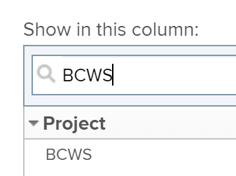

# Berekenen van de begrote kosten van het Geplande Werk (BCWS)

## Overzicht van de geplande kosten van het werk (BCWS)

Ook gekend als Geplande Waarde, is de Begrotende Kosten van het Gepland Werk (BCWS) metrische projectprestaties die de hoeveelheid taak vertegenwoordigt die op het tijdstip zou moeten voltooid zijn dat deze metrisch wordt berekend.

Adobe Workfront berekent de begrote kosten van het Geplande Werk (BCWS) voor zowel projecten als taken.

Overweeg het volgende wanneer het herzien van de waarden voor BCWS op een taak of een project:

* Workfront berekent BCWS voor een taak die op uw configuratie voor de Methode van de Index van Prestaties (PIM) van het project wordt gebaseerd.

  U kunt uw project vormen om PIM te berekenen gebruikend uren of kosten en BCWS wordt ook berekend gebruikend de zelfde waarden.

  Voor informatie over het vormen hoe BCWS wordt berekend, zie de sectie [ vormen hoe BCWS ](#configure-how-bcws-is-calculated) in dit artikel wordt berekend.

* Workfront berekent BCWS voor een project door alle waarden BCWS van alle oudertaken en individuele taken op het project toe te voegen.

  De waarden van kindtaken worden niet toegevoegd aan BCWS van het project.

## Toegangsvereisten

+++ Breid uit om de toegangseisen voor de functionaliteit in dit artikel weer te geven.

<table style="table-layout:auto"> 
 <col> 
 <col> 
 <tbody> 
  <tr> 
   <td>Adobe Workfront-pakket</td> 
   <td>Alle</td> 
  </tr> 
  <tr> 
   <td>Adobe Workfront-licentie</td> 
   <td>
   <p>Standard</p>
   <p>Plan</p></td> 
  </tr> 
  <tr> 
   <td>Configuraties op toegangsniveau</td> 
   <td>Toegang tot projecten bewerken</td> 
  </tr> 
  <tr> 
   <td>Objectmachtigingen</td> 
   <td>Rechten voor het project beheren</td> 
  </tr> 
 </tbody> 
</table>

Voor informatie, zie [ vereisten van de Toegang in de documentatie van Workfront ](/help/quicksilver/administration-and-setup/add-users/access-levels-and-object-permissions/access-level-requirements-in-documentation.md).

+++

## Configureer hoe BCWS wordt berekend {#configure-how-bcws-is-calculated}

U kunt vormen of BCWS in uren of kosten wordt berekend door te vormen hoe de Methode van de Index van Prestaties (PIM) van het project wordt berekend.

1. Ga naar een project en klik **Details van het Project** in het linkerpaneel.
1. Op het **gebied van de Financiën**, bepaal de plaats van het **gebied van de Methode van de Index van Prestaties** en klik het tweemaal om het uit te geven.

   

1. Selecteer een van de volgende opties:

   | Optie | Hoe de berekening wordt uitgevoerd |
   |---|---|
   | Op uurbasis | Workfront berekent de BCWS met de geplande uren van de taken. |
   | Op basis van kosten | Workfront berekent de BCWS met de geplande kosten van de taken. |


1. Klik **sparen Veranderingen**.

   Het BCWS van de taken voor het project wordt berekend aan de hand van uren of kosten.

## BCWS berekenen

Workfront berekent de begrote Kosten van Gepland Werk (BCWS) voor taken of projecten door de volgende formules te gebruiken:

```
Task BCWS = Planned Percent Complete x Task Budget
```

```
Project BCWS = SUM(BCWS values of all parent and individual tasks)
```

In deze berekening worden de volgende waarden gebruikt:

| Gebruikte waarde | Gebruikte waarde |
|---|---|
| Gepland percentage voltooid | Dit is wat het percentage voltooide van de taak zou moeten zijn door te bekijken hoeveel tijd tussen het begin van de taak en vandaag wordt overgegaan. |
| Taakbudget | Dit is de waarde voor de geplande uren of de geplande kosten van de taak. |

Als het vandaag bijvoorbeeld 12 februari is en een taak gepland staat voor 10 februari tot 20 februari, moet de taak vandaag 20% voltooid zijn. Als het Begroting van de Taak (Geplande Kosten) $10.000 is, dan BCWS voor de taak is:

```
Task BCWS = 20% x $10,000 = $2,000
```

## Zoek BCWS voor een project of een taak

U kunt de waarde van de Geplande Kosten van het Werk bekijken die in een rapport of een lijst, door de kolom BCWS aan uw mening toe te voegen wordt gepland.

1. Ga naar een lijst met taken of projecten.
1. Breid het **menu van de Mening** uit en selecteer **Nieuwe Mening** of **aanpassen Mening**.

1. Klik **toevoegen Kolom**.
1. In **toon in deze kolom:** gebiedsbegin typend **BCWS** en klik om het te selecteren wanneer het in de lijst toont.

   

1. Klik **sparen Mening**.
1. Het **BCWS** gebiedsvertoningen in de mening.
