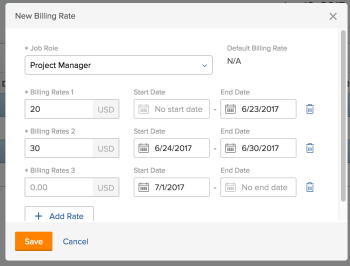

# De Factureringstarieven van de Rol van de Opheffing van de Taak op het projectniveau

Als projectmanager, kunt u specificeren wat het het facturerings tarief voor een baanrol op een specifiek project is. Dit factureringstarief op projectniveau treedt het factureringstarief op het systeemniveau voor deze baanrol met voeten. Workfront gebruikt het factureringstarief op projectniveau van de baanrol om opbrengst te berekenen, in plaats van het systeem-vlakke factureringstarief te gebruiken.

In dit artikel wordt beschreven hoe u de factureringssnelheden voor de rol van het systeem voor een project kunt overschrijven.

Voor algemene informatie over het overschrijden van de tarieven voor het factureren van functies voor projecten en het berekenen van de opbrengsten van projecten, zie [Overzicht van het overschrijven van de Billing Rates van de Rol en het berekenen van Inkomsten op een project](../../../manage-work/projects/project-finances/override-role-billing-rates-and-calculate-project-revenue.md).

Voor meer informatie over welke baanrol wordt gebruikt om opbrengst over het project te berekenen, zie de &quot;Begrip sectie van de Berekeningen van de Ontvangsten voor Taken die op Gebruiker en de Taken van de Rol&quot;in het artikel worden gebaseerd [Overzicht van facturering en inkomsten](../../../manage-work/projects/project-finances/billing-and-revenue-overview.md).

>[!NOTE]
>
>In het geval van werkelijke inkomsten mogen de factureringstarieven die worden toegepast op uren die worden toegevoegd aan een factureringsrecord dat als facturering is gemarkeerd, niet worden beïnvloed door overschrijvingen van factureringstarieven die plaatsvinden nadat de factureringsrecord is gefactureerd.

## Toegangsvereisten

U moet de volgende toegang hebben om de stappen in dit artikel uit te voeren:

<table style="table-layout:auto"> 
 <col> 
 <col> 
 <tbody> 
  <tr> 
   <td role="rowheader">Adobe Workfront-abonnement*</td> 
   <td> 
Alle
 </td> 
  </tr> 
  <tr> 
   <td role="rowheader">Adobe Workfront-licentie*</td> 
   <td> 
Plan 
 </td> 
  </tr> 
  <tr> 
   <td role="rowheader">Configuraties op toegangsniveau*</td> 
   <td> 
Toegang tot projecten en financiële gegevens bewerken
 
Administratieve toegang voor functies
 
Opmerking: Als u nog steeds geen toegang hebt, vraagt u de Workfront-beheerder of deze aanvullende beperkingen op uw toegangsniveau instelt. Voor informatie over hoe een beheerder van Workfront uw toegangsniveau kan wijzigen, zie <a href="../../../administration-and-setup/add-users/configure-and-grant-access/create-modify-access-levels.md" class="MCXref xref">Aangepaste toegangsniveaus maken of wijzigen</a>.
 </td> 
  </tr> 
  <tr> 
   <td role="rowheader">Objectmachtigingen</td> 
   <td> 
Machtigingen beheren voor het project met de optie Financiële gegevens bewerken 
 
Voor informatie over het aanvragen van aanvullende toegang raadpleegt u <a href="../../../workfront-basics/grant-and-request-access-to-objects/request-access.md" class="MCXref xref">Toegang tot objecten aanvragen </a>.
 </td> 
  </tr> 
 </tbody> 
</table>

&#42;Neem contact op met uw Workfront-beheerder om te weten te komen welk plan, licentietype of toegang u hebt.

## De Factureringstarieven van de Rol van de Opheffing van de Taak op het projectniveau

U kunt het factureringspercentage van een taakrol op een project op de volgende manieren overschrijven:

* Eenmaal, door een nieuw tarief voor de baanrol te selecteren.\
   Het nieuwe tarief wordt gebruikt voor de volledige duur van het project, om inkomsten te berekenen.

* Verscheidene tijden, door verscheidene nieuwe tarieven voor specifieke datumwaaiers te selecteren.\
   U kunt voor elk opgegeven datumbereik een andere frequentie gebruiken.

>[!TIP]
>
>U kunt de factureringssnelheden van gebruikers voor een project niet overschrijven.

Een factureringssnelheid voor een project overschrijven:

1. Ga naar het project u het factureren voor wilt met voeten treden.
1. Klikken **Factureringstarieven** in het linkerdeelvenster. Mogelijk moet u eerst op **Meer weergeven**.
1. Klikken **Factureringsfrequentie toevoegen** > **Nieuwe factureringssnelheid**.

   Het vak Nieuwe factureringsfrequentie wordt geopend.

1. In de **Functie** selecteert u de taakrol waarvoor u de factureringsfrequentie wilt wijzigen.

   

   De **Standaardfactureringsfrequentie** wordt het tarief op systeemniveau voor deze baanrol weergegeven.

1. In de **Factureringstarieven 1** veld, voer de eenmalige overschrijving in en klik op **Opslaan** om de factureringssnelheid één keer te overschrijven

   of

   Klikken **Snelheid toevoegen** om meer overschrijvingen van factureringssnelheden toe te voegen.

1. (Voorwaardelijk) Als u meer dan één het factureren tariefopheffing toevoegt, specificeer de volgende informatie:

   * **Factureringstarieven 1**: de waarde van het Factureringstarief van het begin van het project tot de eerste datum van de eerste opheffing. Dit is doorgaans dezelfde hoeveelheid als de **Standaardsnelheid**.
   * **Begindatum**: Dit is de datum waarop het standaardtarief beëindigt.
   * **Einddatum**: de datum waarop de nieuwe factureringssnelheid eindigt.

   

1. De tijdzone voor de data die u selecteert, wordt onder in het vak Nieuwe factureringssnelheid weergegeven. Dit is de tijdzone verbonden aan uw instantie van Workfront, zoals aangetoond in het gebied van Info van de Klant van Opstelling. Zie voor meer informatie [Basisinformatie voor uw systeem configureren](../../../administration-and-setup/get-started-wf-administration/configure-basic-info.md).
1. Workfront past het tarief van de opheffingsbaan op de uren toe die tijdens de gespecificeerde tijdkaders voorkomen wanneer het berekenen van opbrengst op het project.
1. Er mogen geen tussenruimten zijn tussen de tijdframes van twee overschrijvingssnelheden. De **Begindatum** van een overschrijvingstarief moet de dag zijn die onmiddellijk volgt op **Einddatum** van de vorige overschrijvingsdatum.

1. U kunt geen begindatum opgeven voor de eerste overschrijvingsfrequentie en geen einddatum voor de laatste overschrijvingsfrequentie.\
   Wij adviseren dat u het Gebrek Tarief voor het eerste met voeten treden tarief gebruikt.\
   Workfront gaat ervan uit dat de eerste overschrijvingsrente wordt toegepast op alle uren met een datum die ouder is dan de Einddatum van de eerste overschrijving en dat de laatste overschrijvingsrente wordt toegepast op alle uren met een datum die nieuwer is dan de Begindatum van de laatste overschrijving.\
   Als een uur vóór de Geplande Datum van het Begin van het project het programma wordt geopend wordt het zeer eerste het factureringstarief gebruikt.\
   Als een uur na de Geplande Datum van de Voltooiing van het project het programma wordt geopend het zeer laatste factureringstarief wordt gebruikt.

1. Klikken **Opslaan**.
