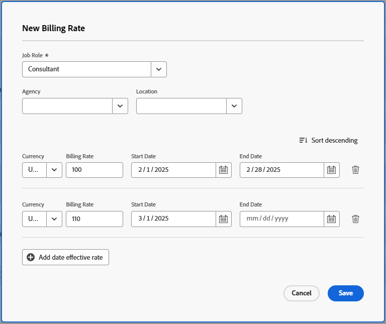

# De Factureringstarieven van de Rol van de Opheffing van de Taak op het projectniveau

Als projectmanager, kunt u specificeren wat het het facturerings tarief voor een baanrol op een specifiek project is. Dit factureringstarief op projectniveau treedt het factureringstarief op het systeemniveau voor deze baanrol met voeten. Workfront gebruikt het factureringstarief op projectniveau van de baanrol om opbrengst te berekenen, in plaats van het systeem-vlakke factureringstarief te gebruiken.

In dit artikel wordt beschreven hoe u de factureringssnelheden voor de rol van het systeem voor een project kunt overschrijven.

Voor algemene informatie over het met voeten treden van de het factureringspercentages van de baanrol voor projecten en het berekenen van de opbrengsten van het project, zie [&#x200B; Overzicht van het met voeten treden van het facturerings tarieven en het berekenen van opbrengst op een project &#x200B;](/help/quicksilver/manage-work/projects/project-finances/override-role-billing-rates-and-calculate-project-revenue.md).

Voor meer informatie over welke baanrol wordt gebruikt om opbrengst op het project te berekenen, zie [&#x200B; Overzicht van opbrengst en kostenhiërarchie &#x200B;](/help/quicksilver/manage-work/projects/project-finances/overview-revenue-cost-hierarchy.md) en de [&#x200B; Berekeningen van de Inkomsten voor Taken die op gebruiker en sectie van de Taken van de Rol &#x200B;](../../../manage-work/projects/project-finances/billing-and-revenue-overview.md#revenue-calculations-for-tasks-based-on-user-and-role-assignments) in het artikel [&#x200B; Overzicht van het Factureren en van de Inkomsten &#x200B;](../../../manage-work/projects/project-finances/billing-and-revenue-overview.md) worden gebaseerd.

>[!NOTE]
>
>In het geval van werkelijke inkomsten mogen de factureringstarieven die worden toegepast op uren die worden toegevoegd aan een factureringsrecord dat als facturering is gemarkeerd, niet worden beïnvloed door overschrijvingen van factureringstarieven die plaatsvinden nadat de factureringsrecord is gefactureerd.

## Toegangsvereisten

+++ Breid uit om de toegangseisen voor de functionaliteit in dit artikel weer te geven.

<table style="table-layout:auto"> 
 <col> 
 <col> 
 <tbody> 
  <tr> 
   <td>Adobe Workfront-pakket</td> 
   <td> 
Een taakrolfactureringsfrequentie voor een project overschrijven: een Workfront- of workflowpakket

        
Om attributen op de baanrol toe te passen: Workflow Ultimate
 </td> 
  </tr> 
  <tr> 
   <td>Adobe Workfront-licentie</td> 
   <td>
   
Standard

   
Plan
</td> 
  </tr> 
  <tr> 
   <td>Configuraties op toegangsniveau</td> 
   <td> 
Toegang tot projecten en financiële gegevens bewerken
 
Administratieve toegang tot functies
</td> 
  </tr> 
  <tr> 
   <td>Objectmachtigingen</td> 
   <td>Machtigingen beheren voor het project met de optie Factureringssnelheden bewerken </td> 
  </tr> 
 </tbody> 
</table>

Voor informatie, zie [&#x200B; vereisten van de Toegang in de documentatie van Workfront &#x200B;](/help/quicksilver/administration-and-setup/add-users/access-levels-and-object-permissions/access-level-requirements-in-documentation.md).

+++

## De Factureringstarieven van de Rol van de Opheffing van de Taak op het projectniveau

Wanneer u het factureringstarief van een baan op een project met voeten treedt, kunt u efficiënte data toewijzen en elke datumwaaier heeft een verschillend tarief. Als u geen effectieve datums toewijst, wordt de tariefoverschrijving die u invoert, gebruikt voor de volledige duur van het project om de inkomsten te berekenen.

U kunt nieuwe het factureren tarieven aan een projectmalplaatje toevoegen en die tarieven worden het factureren van het project wanneer u het project van dat malplaatje creeert. Voor informatie over het uitgeven van malplaatjes, zie [&#x200B; projectmalplaatjes &#x200B;](/help/quicksilver/manage-work/projects/create-and-manage-templates/edit-templates.md) uitgeven.

>[!TIP]
>
>U kunt de factureringssnelheden van gebruikers voor een project niet overschrijven, tenzij u over het Ultimate-pakket voor workflow beschikt.

Een factureringssnelheid voor een project overschrijven:

1. Ga naar het project u het factureren voor wilt met voeten treden.
1. Klik **het Factureren Tarieven** in het linkerpaneel.

   of

   Klik **Tarieven** in het linkerpaneel en klik het **Factureren** lusje als het niet reeds wordt geselecteerd.

1. Klik **toevoegen het FactureringsTarief > het Nieuwe het Facturerings Tarief van de Rol van de Taak**.

   Het vak Nieuwe factureringsfrequentie wordt geopend.

1. Op het **gebied van de Rol van de Baan 0&rbrace;, selecteer de baanrol u het facturerings tarief voor wilt veranderen.**

1. (Optioneel) Selecteer de gewenste kenmerken voor de factureringssnelheid, zoals de instantie of locatie.

   De systeembeheerder bepaalt tariefattributen in het gebied van de Opstelling.

1. Selecteer de **Valuta** voor de het factureren tariefopheffing.
1. In het **FactureringsTarief** gebied, ga de het factureringstariefopheffing in, dan klik **sparen** om het factureringstarief één keer met voeten te treden

   of

   Klik **toevoegen Tarief** om meer het factureren tariefoverschrijvingen toe te voegen.

1. (Voorwaardelijk) Voer voor elke rij de volgende informatie in voor overschrijvingen van de datumeffectieve factureringssnelheid:

   * **het Factureren Tarief**: De waarde van het Facturerings Tarief van het begin van het project aan de eerste datum van de eerste opheffing.
   * **Datum van het Begin**: De datum wanneer de het factureren tariefopheffing begint.
   * **Datum van het Eind**: De datum wanneer de het factureren tariefopheffing beëindigt.

   

   Workfront past het tarief van de opheffingsbaan op de uren toe die tijdens deze tijdkaders voorkomen wanneer het berekenen van opbrengst op het project.

   Met Workfront kunt u tussenruimten tussen overschrijvende tijdframes weglaten, maar u ontvangt een waarschuwing om te bevestigen dat dit opzettelijk is.

   U wordt niet vereist om een Datum van het Begin voor het eerste met voeten treden tarief, noch een Datum van het Eind voor het laatste met voeten treden tarief te specificeren.

   Als u slechts één het factureren tariefopheffing ingaat, is dat tarief van toepassing voor de volledige duur van het project. Als u veelvoudige datum-efficiënte overschrijvingen toevoegt, veronderstelt Workfront dat de eerste opheffing op alle uren vóór zijn Einddatum van toepassing is, en de laatste opheffing is op alle uren na zijn Datum van het Begin van toepassing.

   Workfront gaat ervan uit dat de eerste overschrijvingsrente wordt toegepast op alle uren met een datum die ouder is dan de Einddatum van de eerste overschrijving en dat de laatste overschrijvingsrente wordt toegepast op alle uren met een datum die nieuwer is dan de Begindatum van de laatste overschrijving.

   Als een uur vóór de Geplande Datum van het Begin van het project wordt geregistreerd, wordt het zeer eerste het factureringstarief gebruikt.

   Als een uur na de Geplande Datum van de Voltooiing van het project wordt geregistreerd, wordt het zeer laatste het factureringstarief gebruikt.

1. Klik **sparen**.
