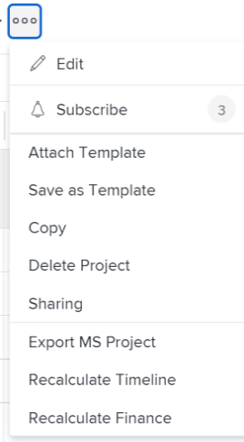

# Projectfinanciën opnieuw berekenen

De financiën worden berekend op een project aangezien de veranderingen in de uren voorkomen die voor het project worden geregistreerd of in de tarieven die worden gebruikt om kosten en opbrengst te berekenen.

## Toegangsvereisten

U moet de volgende toegang hebben om de stappen in dit artikel uit te voeren:

<table style="table-layout:auto"> 
 <col> 
 <col> 
 <tbody> 
  <tr> 
   <td role="rowheader">Adobe Workfront-abonnement*</td> 
   <td> 
Alle
 </td> 
  </tr> 
  <tr> 
   <td role="rowheader">Adobe Workfront-licentie*</td> 
   <td> 
Plan 
 </td> 
  </tr> 
  <tr> 
   <td role="rowheader">Configuraties op toegangsniveau*</td> 
   <td> 
Toegang tot projecten en financiële gegevens bewerken
 
Opmerking: Als u nog steeds geen toegang hebt, vraagt u de Workfront-beheerder of deze aanvullende beperkingen op uw toegangsniveau instelt. Voor informatie over hoe een beheerder van Workfront uw toegangsniveau kan wijzigen, zie <a href="../../../administration-and-setup/add-users/configure-and-grant-access/create-modify-access-levels.md" class="MCXref xref">Aangepaste toegangsniveaus maken of wijzigen</a>.
 </td> 
  </tr> 
  <tr> 
   <td role="rowheader">Objectmachtigingen</td> 
   <td> 
Machtigingen voor het project beheren met beheerdersmachtigingen
 
Voor informatie over het aanvragen van aanvullende toegang raadpleegt u <a href="../../../workfront-basics/grant-and-request-access-to-objects/request-access.md" class="MCXref xref">Toegang tot objecten aanvragen </a>.
 </td> 
  </tr> 
 </tbody> 
</table>

&#42;Neem contact op met uw Workfront-beheerder om te weten te komen welk plan, licentietype of toegang u hebt.

## Overwegingen bij het berekenen van de financiën in Adobe Workfront

De financiën worden in uitgebreide analyses op de volgende manieren berekend:

* U kunt kosten en opbrengsten op een project manueel opnieuw berekenen, door de optie van de Financiën van de Herberekening op een project te gebruiken.
* Daarnaast wordt door sommige handelingen een automatische herberekening gestart.

Wanneer het tarief van een gebruiker of een rol tijdens het leven van een project verandert, kan het volgende voorkomen:

* Wanneer de verandering wordt aangebracht, wordt het bijgewerkte tarief gebruikt vanaf dat punt op aangezien de uren worden geregistreerd en de financiële informatie wordt berekend. Het wijzigen van de snelheid heeft geen invloed op de manier waarop de gegevens zijn berekend voordat de wijziging is aangebracht. Voor alle bestaande geregistreerde uren, wordt het oude tarief gebruikt om financiële informatie te berekenen.
* U kunt Adobe Workfront dwingen om het nieuwe tarief voor alle uren terug te gebruiken die tot nu zijn geregistreerd, door de Recalculate optie van de Financiën te gebruiken. Dit dwingt Workfront alle eerder ingelogde uren, geplande kosten en inkomsten met terugwerkende kracht te herberekenen overeenkomstig de nieuwe tariefinformatie.

>[!CAUTION]
>
>Voordat u de financiën voor een bepaald project handmatig opnieuw berekent, wilt u mogelijk alle financiële gegevens behouden die al zijn berekend op basis van een eerder percentage. Wij adviseren om de optie van de Financiën van de Herberekening slechts te gebruiken wanneer u zeker bent dat u geen veranderingen in bestaande informatie aanbrengt, of slechts wanneer dergelijke veranderingen worden gewenst.

## Financiële gegevens behouden voor taken met bestaande uren {#preserve-financial-data-for-tasks-with-existing-hours}

Wanneer de financiële gegevens voor een project opnieuw worden berekend, herberekent Workfront met terugwerkende kracht alle eerder geregistreerde uren, geplande, werkelijke kosten en geplande en daadwerkelijke inkomsten, overeenkomstig om het even welke nieuwe of bijgewerkte financiële informatie.

* [Ontvangsten van project behouden](#preserve-project-revenue)
* [Projectkosten behouden](#preserve-project-cost)

### Ontvangsten van project behouden  {#preserve-project-revenue}

De inkomstenpercentages kunnen tijdens de levensduur van een project veranderen.

Zie het artikel voor meer informatie over factureringssnelheden en inkomsten [Overzicht van facturering en inkomsten](../../../manage-work/projects/project-finances/billing-and-revenue-overview.md).

De belastingtarieven kunnen op de volgende niveaus veranderen:

* Het systeemniveau (voor functies)\
   Raadpleeg het artikel voor meer informatie over het maken van taakrollen met factureringssnelheden op systeemniveau [Taakrollen maken en beheren](../../../administration-and-setup/set-up-workfront/organizational-setup/create-manage-job-roles.md).

* Het gebruikersniveau\
   Raadpleeg het artikel voor meer informatie over het wijzigen van de factureringssnelheidgegevens over gebruikers [Gebruikersprofiel bewerken](../../../administration-and-setup/add-users/create-and-manage-users/edit-a-users-profile.md).

* Het niveau van het Bedrijf (voor baanrollen)\
   Zie voor meer informatie [Factureringstarieven voor de rol van de werknemer op bedrijfsniveau overschrijven](../../../administration-and-setup/set-up-workfront/organizational-setup/override-job-role-billing-rates-company-level.md).

* Het projectniveau (voor functies)\
   Raadpleeg het artikel voor meer informatie over het overschrijven van de roltarieven op projectniveau [Overzicht van het overschrijven van de Billing Rates van de Rol en het berekenen van Inkomsten op een project](../../../manage-work/projects/project-finances/override-role-billing-rates-and-calculate-project-revenue.md).

Bijvoorbeeld, verandert het het facturerings tarief van een gebruiker tijdens een project van $50 in $75 per uur en u wilt alle bestaande gegevens aan het oude tarief ($50 en uur) worden berekend. Wanneer de projectfinanciën echter opnieuw worden berekend, worden de inkomsten van taken die al over bestaande financiële gegevens beschikken aangepast aan de nieuwe factureringsgraad (van $75 per uur).

* [Projectinkomsten behouden door een factureringsrecord te maken](#preserve-project-revenue-by-creating-a-billing-record)
* [De Ontvangsten van het Project van het behoud door veelvoudige het Tarief met voeten te treden](#preserve-project-revenue-by-using-multiple-billing-rate-overrides)

#### Projectinkomsten behouden door een factureringsrecord te maken {#preserve-project-revenue-by-creating-a-billing-record}

Wanneer de factureringstarieven op om het even welk hierboven vermeld niveau veranderen, kunt u bestaande die reeds op het project is berekend bewaren door te vermijden om de handmatige optie van de Herberekening van Financiën te gebruiken of door de tijd te sluiten die op het project wordt geregistreerd en berekend gebruikend het oude tarief in een het facturerings verslag met een status van Facturering.

Wanneer u geen financiën op het project opnieuw berekent of wanneer u de uren sluit die in een factureringsverslag worden geregistreerd, zullen de uren na de tariefveranderingen na het tarief worden geregistreerd met het nieuwe tarief berekenen, en de uren die vóór de veranderingen van het kostentarief worden geregistreerd blijven berekend bij het oude tarief.

Raadpleeg het artikel voor meer informatie over het maken van factureringsrecords [Factureringsrecords maken](../../../manage-work/projects/project-finances/create-billing-records.md).

#### De Ontvangsten van het Project van het behoud door veelvoudige het Tarief met voeten te treden {#preserve-project-revenue-by-using-multiple-billing-rate-overrides}

Wanneer de factureringstarieven voor baanrollen op het projectniveau veranderen, kunt u bestaande opbrengst behouden die reeds op het project is berekend door veelvoudige het facturerings tariefoverschrijvingen te gebruiken die binnen een gespecificeerd tijdkader worden gesloten.

Raadpleeg het artikel voor meer informatie over het gebruik van meerdere overschrijvingen van factureringssnelheden [Overzicht van het overschrijven van de Billing Rates van de Rol en het berekenen van Inkomsten op een project](../../../manage-work/projects/project-finances/override-role-billing-rates-and-calculate-project-revenue.md).

>[!NOTE]
>
>Dit is alleen van toepassing op de factureringstarieven voor de rol die op projectniveau worden gewijzigd.

### Projectkosten behouden {#preserve-project-cost}

De kostentarieven kunnen op de volgende niveaus veranderen:

* Systeemniveau (voor functies)\
   Raadpleeg het artikel voor meer informatie over het maken van functies met kostensnelheden op systeemniveau [Taakrollen maken en beheren](../../../administration-and-setup/set-up-workfront/organizational-setup/create-manage-job-roles.md).

* Gebruikersniveau\
   Raadpleeg het artikel voor meer informatie over het wijzigen van de kosteninformatie over gebruikers [Gebruikersprofiel bewerken](../../../administration-and-setup/add-users/create-and-manage-users/edit-a-users-profile.md).

Wanneer de factureringstarieven op om het even welk hierboven vermeld niveau veranderen, kunt u bestaande die kosten bewaren die reeds op het project zijn berekend door de tijd te sluiten die op het project wordt geregistreerd en die aan het oude tarief wordt berekend in een facturerings verslag met een status van Factureerde. Raadpleeg het artikel voor meer informatie over het maken van factureringsrecords [Factureringsrecords maken](../../../manage-work/projects/project-finances/create-billing-records.md).

U kunt ook voorkomen dat de optie Handmatige herberekening van financiën wordt gebruikt als u geen factureringsrecord wilt maken, zoals beschreven in de sectie [De financiën van een project handmatig opnieuw berekenen](#manually-recalculate-finances-for-a-project) in dit artikel.

Wanneer u geen financiën op het project opnieuw berekent of wanneer u de uren sluit die in een factureringsverslag worden geregistreerd, zullen de uren na de tariefveranderingen na het tarief worden geregistreerd met het nieuwe tarief berekenen, en de uren die vóór de veranderingen van het kostentarief worden geregistreerd blijven berekend bij het oude tarief.

## De financiën van een project handmatig opnieuw berekenen {#manually-recalculate-finances-for-a-project}

Als uw tarieven tijdens de levensduur van een project veranderen en u uw kosten en opbrengstberekeningen de nieuwe tarieven wilt weerspiegelen, moet u de financiën op het project manueel opnieuw berekenen.

>[!NOTE]
>
>U kunt voorkomen dat de inkomstenwaarden worden bijgewerkt om de nieuwe tarieven weer te geven wanneer u de financiën handmatig herberekent door de stappen in de sectie uit te voeren [Financiële gegevens behouden voor taken met bestaande uren](#preserve-financial-data-for-tasks-with-existing-hours) van dit artikel. Kostenwaarden worden altijd bijgewerkt om de nieuwe tarieven weer te geven wanneer u de financiën handmatig herberekent voor een project.

U kunt de financiën van projecten in Workfront van de projectpagina of van een projectlijst of rapport herberekenen.

U kunt de financiën opnieuw berekenen terwijl u ze bulksgewijs bewerkt. Zie voor meer informatie de [De financiën in bulk manueel opnieuw berekenen in het Edit vakje van Projecten](#manually-recalculate-finances-in-bulk-in-the-edit-projects-box) in dit artikel.

1. Ga naar het project waar u financiën opnieuw wilt berekenen en klik op de knop **Meer** pictogram  rechts van de projectnaam

   

   of

   Ga naar een projectlijst of rapport en selecteer een of meerdere projecten en klik vervolgens op de knop **Meer** pictogram  boven aan de lijst.

   

   >[!TIP]
   >
   >Afhankelijk van de complexiteit van uw projecten raden we u aan geen groot aantal projecten te selecteren wanneer u de financiën in bulk herberekent voor optimale prestaties. Sommige dingen die een project te complex zouden kunnen maken zouden veelvoudige gebiedsdelen of taken of een groot aantal douanevelden kunnen zijn.

1. Klikken **Herberekening van financiën**.

   Alle geplande kosten en inkomsten van het project worden opnieuw berekend met nieuwe informatie.

   U zou een bevestiging bij de bovenkant van browser moeten ontvangen dat de financiën van het project met succes zijn herberekend.\
   Bestaande kostenwaarden en sommige inkomstenwaarden die niet vergrendeld zijn, worden bijgewerkt om de nieuwe tarieven weer te geven.

## De financiën in bulk manueel opnieuw berekenen in het Edit vakje van Projecten {#manually-recalculate-finances-in-bulk-in-the-edit-projects-box}

U kunt de financiën van verschillende projecten handmatig opnieuw berekenen door ze bulksgewijs te bewerken. Hierdoor worden de inkomsten van de projecten met terugwerkende kracht opnieuw berekend.

>[!IMPORTANT]
>
>U kunt voorkomen dat de inkomstenwaarden worden bijgewerkt om de nieuwe tarieven weer te geven wanneer u de financiën handmatig herberekent door de stappen in de sectie uit te voeren [Financiële gegevens behouden voor taken met bestaande uren](#preserve-financial-data-for-tasks-with-existing-hours) van dit artikel. Kostenwaarden worden altijd bijgewerkt om de nieuwe tarieven weer te geven wanneer u de financiën voor projecten handmatig herberekent.

De financiering van verschillende projecten handmatig herberekenen:

1. Ga naar een lijst met projecten.
1. Selecteer meerdere projecten in de lijst en klik op **Bewerken**.

   >[!TIP]
   >
   >Afhankelijk van de complexiteit van uw projecten raden we u aan geen groot aantal projecten te selecteren wanneer u deze in bulk bewerkt, zodat u optimale prestaties krijgt. Sommige dingen die een project te complex zouden kunnen maken zouden veelvoudige gebiedsdelen of taken of een groot aantal douanevelden kunnen zijn.

1. Klikken **Instellingen** selecteert u vervolgens **Herberekening van kosten en opbrengsten**.

1. Klikken **Wijzigingen opslaan**.

## Acties die een automatische herberekening van de financiën in gang zetten

De volgende acties leiden tot de financiële herberekening van projecten in Workfront:

* Taakstatus wijzigen
* Een taak met uren verplaatsen naar een ander project
* De status van het project wijzigen van Voltooid in een actieve status

>[!NOTE]
>
>Wanneer u de projectstatus wijzigt, worden alleen de geplande waarden opnieuw berekend.

U kunt financiën ook handmatig herberekenen onder de **Meer** menu  op projectniveau, door **Herberekening van financiën**.
