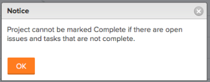

# Veelgestelde vragen over projecten

Hier volgen vaak gestelde vragen over projecten.

## Waarom ontbreekt de Taak van het Tussenvoegsel boven/onder wanneer ik op een taak in de taaklijst met de rechtermuisknop klik?

### Antwoord

Als u de invoegopties wilt gebruiken, moet de takenlijst op nummer worden gesorteerd. Om de kolom door aantal te sorteren, klik **#** in de kolomkopbal links van **Naam van de Taak** om de taak door aantal opnieuw in te sorteren.

## Wat is de werkelijke einddatum?

### Antwoord

De datum van daadwerkelijke voltooiing vertegenwoordigt de datum en de tijd het werk wordt voltooid. Voor meer informatie, zie [ Overzicht van het project de Ware Datum van de Voltooiing ](../../../manage-work/projects/planning-a-project/project-actual-completion-date.md).

## Waarom ontbreekt de knop Inspringing/Uitspringen?

### Antwoord

Als u de knop Inspringing/Uitspringen wilt gebruiken, zorgt u ervoor dat de taken worden gesorteerd op het taaknummer en dat er geen Groepen zijn toegepast.

## Waarom kan ik de projectstatus niet in Voltooid veranderen?

Ik krijg het volgende foutbericht wanneer ik probeer mijn project te markeren voltooid:

### Antwoord

U kunt de status van een project niet wijzigen om te voltooien als u een van de volgende opties voor uw project hebt:

* Onvolledige taken of problemen
* Taak of problemen in afwachting van goedkeuringsstatus

## Waarom kan ik de projectstatus niet wijzigen van Voltooid in Huidig?

### Antwoord

Als voor het project de modus Voltooien is ingesteld op Automatisch, wordt de status van het project automatisch ingesteld op Voltooien als alle taken en problemen zijn voltooid en kunt u de status niet wijzigen in een andere status. De Voltooiingswijze van het project moet aan Handboek worden geplaatst om een volledig project aan Huidig te kunnen veranderen. Voor informatie, zie [ de status van het Project niet van Voltooid in Huidige ](../../../manage-work/projects/tips-tricks-and-troubleshooting/project-status-does-not-change-from-complete-to-current.md) veranderen.

## Waarom kan ik geen Project aan een Portfolio toevoegen, hoewel ik de correcte toestemmingen heb om dit te doen?

Hoewel ik de juiste machtigingen heb, ontbreekt de knop Projecten toevoegen op het tabblad Projecten van de Portfolio.

### Antwoord

Dit wordt veroorzaakt doordat de Portfolio-status Inactief is. De status van de Portfolio wijzigen:

1. Klik op **Details van Portfolio > Overzicht**.
1. Verander de **Status** aan **Actief.**

1. Klik **sparen**.\
   **voeg Projecten** knoop toe zou nu op de **Projecten** tabel zichtbaar moeten zijn.

## Welke toegang ontvangt een Manager van het Middel wanneer toegevoegd aan een project?

### Antwoord

De Managers van het middel ontvangen automatisch leiden toegang tot projecten. Als u de gebruiker verwijdert uit de rol van Resource Manager, wordt de gedeelde beheertoegang niet verwijderd.

## Waarom verandert de projectstatus wanneer ik een groep toevoegt?

### Antwoord

De status van het project verandert als gevolg van de standaardstatus van de groep. Wanneer u een groep aan een project toevoegt, verandert het de lijst van statussen in de standaardstatussen die voor de groep worden geplaatst.

Voor meer informatie, zie het artikel [ creeer of geef een status ](../../../administration-and-setup/customize-workfront/creating-custom-status-and-priority-labels/create-or-edit-a-status.md) uit.

## Wat is de begrotingsstatus?

### Antwoord

In de begrotingsstatus wordt aangegeven of het project momenteel wordt toegevoegd aan de capaciteitsplanner en of de begrotingsberekening is voltooid.

Hieronder vindt u begrotingsstaten:

* Niet inbegrepen - Het project wordt niet toegevoegd aan de capaciteitsplanner.
* Opgenomen maar niet berekend - Het project wordt toegevoegd aan de capaciteitsplanner, maar wordt niet opgenomen in de begrotingsberekening.
* Opgenomen en berekend - Het project wordt toegevoegd aan de capaciteitsplanner en opgenomen in de begrotingsberekening.

## Waarom kan ik geen project delen waarvoor ik de Eigenaar ben en waar ik Beheren toestemmingen met een Team heb? Ik kan het team eenvoudig niet vinden in het dialoogvenster voor delen van het project.

### Antwoord

De beheerder van Adobe Workfront beperkte u tot het bekijken van slechts Bedrijven, Groepen &amp; Teams die u tot in uw Niveau van de Toegang van behoort. Het team dat u zoekt is niet één van de teams u tot behoort.

 behoren

Voor informatie over het toelaten van een gebruiker om alle teams in het systeem te bekijken, zie [ tot douanetoegangsniveaus ](../../../administration-and-setup/add-users/configure-and-grant-access/create-modify-access-levels.md) leiden of wijzigen.
