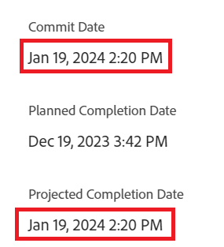

# Datums vastleggen bijwerken voor taken en problemen

<!--Audited: 07/2024-->

<!--The highlighted information on this page refers to functionality not yet generally available. It is available only in the Preview environment for all customers, or in the Production environment for customers who enabled fast releases.

For information about fast releases, see [Enable or disable fast releases for your organization](/help/quicksilver/administration-and-setup/set-up-workfront/configure-system-defaults/enable-fast-release-process.md).

For information about the current release, see [Third Quarter 2024 release overview](/help/quicksilver/product-announcements/product-releases/24-q3-release-activity/24-q3-release-overview.md).-->

U kunt de datum van Vastleggen van een taak of een kwestie manueel bijwerken waaraan u wordt toegewezen. Voor meer informatie over Commit Dates in Adobe Workfront, zie [ Overzicht van de Datum van het Vastleggen ](../../../manage-work/projects/updating-work-in-a-project/overview-of-commit-dates.md).

## Toegangsvereisten

<!--Audited: 01/2024-->

+++ Breid uit om de toegangseisen voor de functionaliteit in dit artikel weer te geven. 

<table style="table-layout:auto"> 
 <col> 
 <col> 
 <tbody> 
  <tr> 
   <td role="rowheader">Adobe Workfront-pakket</td> 
   <td> 
Alle
 </td> 
  </tr> 
  <tr> 
   <td role="rowheader">Adobe Workfront-licentie</td> 
   <td> 
   <ul>
   <li>
Standaard voor taken
 </li>
   <li>
Medewerker of hoger voor problemen
</li>
   </ul>
   
of

<ul>
   <li>
Werk of hoger voor taken
</li> 
   <li>
Aanvraag of hoger voor problemen
</li>
</ul>

</td> 
  </tr> 
  <tr> 
   <td role="rowheader">Configuraties op toegangsniveau</td> 
   <td> 
Toegang tot taken en problemen bewerken
 </td> 
  </tr> 
  <tr> 
   <td role="rowheader">Objectmachtigingen</td> 
   <td> 
Machtigingen beheren voor de taak of uitgave

   
 U moet aan de taak of de kwestie worden toegewezen om de datum bij te werken begaan 

    </td> 
  </tr> 
 </tbody> 
</table>

Voor meer informatie, zie [ vereisten van de Toegang in de documentatie van Workfront ](/help/quicksilver/administration-and-setup/add-users/access-levels-and-object-permissions/access-level-requirements-in-documentation.md).

+++

<!--Old:
<table style="table-layout:auto"> 
 <col> 
 <col> 
 <tbody> 
  <tr> 
   <td role="rowheader">Adobe Workfront plan</td> 
   <td> 
Any
 </td> 
  </tr> 
  <tr> 
   <td role="rowheader">Adobe Workfront license*</td> 
   <td> 
   New:
   <ul>
   <li>
Standard for tasks
 </li>
   <li>
Contributor or higher for issues
</li>
   </ul>
   Current:
<ul>
   <li>
Work or higher for tasks
</li> 
   <li>
Request or higher for issues
</li>
</ul>

   </td> 
  </tr> 
  <tr> 
   <td role="rowheader">Access level configurations</td> 
   <td> 
Edit access to Tasks and Issues
 </td> 
  </tr> 
  <tr> 
   <td role="rowheader">Object permissions</td> 
   <td> 
Manage permissions on the task or issue

   
 You must be assigned to the task or issue to update the commit date 

    </td> 
  </tr> 
 </tbody> 
</table>-->

## Vereisten

Voordat u de datum Vastleggen van een taak of uitgave kunt bewerken, moet u worden toegewezen aan de taak of uitgave waarvan u de datum voor vastleggen moet bijwerken.

## Datums vastleggen bijwerken voor taken en problemen

U kunt de Vastlegdatum van een taak of kwestie op de volgende gebieden van Workfront bijwerken:

* De sectie Details van een taak of kwestie
* De taak- of uitgiftekop

  Uw Workfront of groepsbeheerder moet de datum Vastleggen toevoegen aan de taak- of uitgiftekoptekst van uw lay-outsjabloon om deze weer te geven vanaf de taak- of uitgiftepagina.
Voor informatie, zie [ objecten kopballen aanpassen gebruikend een lay-outmalplaatje ](/help/quicksilver/administration-and-setup/customize-workfront/use-layout-templates/customize-object-headers.md).

Het bijwerken van de Vastlegdatum is identiek voor taken en kwesties.

>[!NOTE]
>
>U kunt uw systeem of groepsbeheerder vragen om het veld Datum vastleggen toe te voegen aan het deelvenster Overzicht, zodat u het in verschillende delen van Workfront gemakkelijker kunt bijwerken.
>
>Raadpleeg de volgende artikelen voor meer informatie:
>
>* [ Overzicht van de Samenvatting ](/help/quicksilver/workfront-basics/the-new-workfront-experience/summary-overview.md)
>* [ pas het Summiere paneel aan gebruikend een lay-outmalplaatje ](/help/quicksilver/administration-and-setup/customize-workfront/use-layout-templates/customize-home-summary-layout-template.md).

1. Ga naar een taak of een kwestie die u aan als **Eigenaar** wordt toegewezen.

   Voor meer informatie over het ontdekken wie de Eigenaar van de Taak voor een kwestie of een taak is, zie de sectie [ taken ](../../../manage-work/tasks/manage-tasks/edit-tasks.md#assignments) in het artikel [ uitgeven taken ](../../../manage-work/tasks/manage-tasks/edit-tasks.md).

1. (Voorwaardelijk en facultatief) als uw Workfront of groepsbeheerder de Vastlegdatum aan uw taak of uitgiftekopbal toevoegde, klik het **gebied van de Datum** Vastleggen {in de kopbal, dan selecteer een datum van de kalender. Ga als volgt te werk als de datum vastleggen zich niet in de koptekst bevindt.

   

1. Klik **Details van de Taak** of **Details van de Uitgave** in het linkerpaneel.
1. Klik **Overzicht** om het uit te breiden.
1. Werk het **gebied van de Datum** vast.

   

1. Klik **sparen Veranderingen**.

   Het volgende gebeurt na het aanbrengen van deze wijziging:

   * De datum van Vastleggen en de geplande datum van voltooiing van de taak of afgifte zijn niet langer dezelfde.

     In plaats daarvan worden de Datum vastleggen en de verwachte Voltooiingsdatum van de taak of uitgave hetzelfde.

     

   * De eigenaar van het project wordt in een Workfront-melding in de app op de hoogte gesteld van het feit dat u een nieuwe Vastlegdatum voor de taak of uitgave hebt voorgesteld.
   * De eigenaar van het project wordt in de sectie Updates op de hoogte gesteld van het feit dat u een nieuwe Vastlegdatum hebt voorgesteld en zij kunnen, op dit moment, de Geplande Voltooiingsdatum van de taak of kwestie bijwerken om de Vastleggingsdatum aan te passen u voorstelde.

     

     <!---->

     Voor informatie over de berichten en de updates die door deze verandering worden teweeggebracht, zie de sectie &quot;Meldingen en updates die door de Vastlegdatum&quot;in het artikel [ worden teweeggebracht het overzicht van de Datum van de Overeenkomst ](/help/quicksilver/manage-work/projects/updating-work-in-a-project/overview-of-commit-dates.md) vastleggen.

<!--at the Production update stream when removing legacy - replace the last bullet with: The Project Owner is notified in the Systems Activity and the All tabs of the Updates section that you have suggested a new Commit Date. They can then update the Planned Completion Date accordingly by editing the task or the issue.-->
