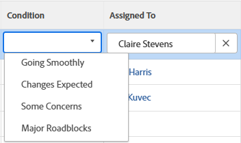
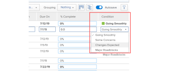

# Voorwaarde voor bijwerken voor taken en problemen

<!--Audited: 07/2024-->

<!--The highlighted information on this page refers to functionality not yet generally available. It is available only in the Preview environment for all customers, or in the Production environment for customers who enabled fast releases.

For information about fast releases, see [Enable or disable fast releases for your organization](/help/quicksilver/administration-and-setup/set-up-workfront/configure-system-defaults/enable-fast-release-process.md).

For information about the current release, see [Third Quarter 2024 release overview](/help/quicksilver/product-announcements/product-releases/24-q3-release-activity/24-q3-release-overview.md).-->

De voorwaarde van een taak of een kwestie is een vlag die op het wordt geplaatst om erop te wijzen hoe het gaat. Dit is anders dan de status van het werkitem, die de huidige fase van de ontwikkeling van het item aangeeft.

U kunt de voorwaarde van een taak of een kwestie of automatisch of manueel plaatsen.

De Condition-waarden waarnaar we in dit artikel verwijzen, zijn standaard beschikbaar in Workfront. Uw beheerder van Adobe Workfront kan douaneVoorwaarden voor uw milieu tot stand brengen, zoals die in [&#x200B; wordt beschreven creeer of geef een douanevoorwaarde &#x200B;](../../../administration-and-setup/customize-workfront/create-manage-custom-conditions/create-edit-custom-conditions.md) uit.

## Toegangsvereisten {#access-requirements}

+++ Breid uit om de toegangseisen voor de functionaliteit in dit artikel weer te geven. 

<table style="table-layout:auto"> 
 <col> 
 <col> 
 <tbody> 
  <tr> 
   <td role="rowheader">Adobe Workfront-pakket</td> 
   <td> 
Alle
 </td> 
  </tr> 
  <tr> 
   <td role="rowheader">Adobe Workfront-licentie</td> 
   <td> 
   <ul><li>
Standaard voor taken
</li>
   <li>
Medewerker of hoger voor problemen
</li></ul>
  
of

   <ul><li>
Werk of hoger voor taken
</li>
   <li>
Aanvraag of hoger voor problemen
</li></ul>
    </td> 
  </tr> 
  <tr> 
   <td role="rowheader">Configuraties op toegangsniveau</td> 
   <td> 
Toegang tot projecten weergeven of vergroten
 
Toegang tot taken en problemen bewerken 
</td> 
  </tr> 
  <tr> 
   <td role="rowheader">Objectmachtigingen</td> 
   <td> 
Machtigingen weergeven voor taken en uitgaven om hun voorwaarde weer te geven

   
Contribute-machtigingen voor taken en uitgaven om de voorwaarde bij te werken

  </td> 
  </tr> 
 </tbody> 
</table>

Voor informatie, zie [&#x200B; vereisten van de Toegang in de documentatie van Workfront &#x200B;](/help/quicksilver/administration-and-setup/add-users/access-levels-and-object-permissions/access-level-requirements-in-documentation.md).

+++

<!--Old:

<table style="table-layout:auto"> 
 <col> 
 <col> 
 <tbody> 
  <tr> 
   <td role="rowheader">Adobe Workfront plan</td> 
   <td> 
Any
 </td> 
  </tr> 
  <tr> 
   <td role="rowheader">Adobe Workfront license*</td> 
   <td> 
   New:
   <ul><li>
Standard for tasks
</li>
   <li>
Contributor or higher for issues
</li></ul>
   Current:
   <ul><li>
Work or higher for tasks
</li>
   <li>
Request or higher for issues
</li></ul>
    </td> 
  </tr> 
  <tr> 
   <td role="rowheader">Access level configurations</td> 
   <td> 
View or higher access to projects
 
Edit access to tasks and issues 
</td> 
  </tr> 
  <tr> 
   <td role="rowheader">Object permissions</td> 
   <td> 
View or higher permissions on tasks and issues to view their Condition

   
Contribute permissions on tasks and issues to update the Condition

  </td> 
  </tr> 
 </tbody> 
</table>-->

## Vereisten

U moet aan een taak of een kwestie worden toegewezen om zijn Voorwaarde manueel bij te werken.

## De voorwaarde van taken en problemen opzoeken

De voorwaarden worden weergegeven als een vlag die is gekoppeld aan taken of problemen. Ze kunnen ook worden gekoppeld aan een getal dat in rapporten kan worden weergegeven in plaats van aan het label. Voor meer informatie over het associëren van voorwaarden met aantallen, zie [&#x200B; een douanevoorwaarde &#x200B;](../../../administration-and-setup/customize-workfront/create-manage-custom-conditions/create-edit-custom-conditions.md) creëren of uitgeven.

U vindt de voorwaarde voor taken en problemen in de volgende gebieden van Workfront:

* De pagina Details nadat een Workfront of groepsbeheerder deze aan uw lay-outsjabloon heeft toegevoegd. Voor informatie, zie [&#x200B; de mening van Details aanpassen gebruikend een lay-outmalplaatje &#x200B;](/help/quicksilver/administration-and-setup/customize-workfront/use-layout-templates/customize-details-view-layout-template.md).

* De koptekst van een taak of uitgave, nadat een Workfront of een groepsbeheerder deze aan uw lay-outmalplaatje toevoegt. Voor informatie, zie [&#x200B; objecten kopballen aanpassen gebruikend een lay-outmalplaatje &#x200B;](/help/quicksilver/administration-and-setup/customize-workfront/use-layout-templates/customize-object-headers.md).

* Het deelvenster Samenvatting nadat een Workfront- of groepsbeheerder het heeft toegevoegd aan uw lay-outsjabloon. Voor informatie, zie [&#x200B; het Summiere paneel aanpassen gebruikend een lay-outmalplaatje &#x200B;](/help/quicksilver/administration-and-setup/customize-workfront/use-layout-templates/customize-home-summary-layout-template.md).

* Hiermee worden rapporten en lijsten weergegeven wanneer u het veld Voorwaarde weergeeft in een weergave of Groepering.

  >[!NOTE]
  >
  >Wanneer het woord &quot;voorwaarde&quot;op het gebied van de Naam van het Gebied van een rapport van de Ingang van het Dagboek toont, wijst dit erop dat de Voorwaarde van een punt werd bijgewerkt. Wanneer het veld Voorwaarde wordt bijgehouden in de rapporten Dagboekvermeldingen, geven de waarden Nieuw en Oud getal het nummer weer dat aan de voorwaarde is gekoppeld in plaats van de naam ervan. Als een voorwaarde oorspronkelijk niet voor een taak of een kwestie wordt bepaald en u het later bijwerkt, zal de dagboekingang die de update vangt de Oude Waarde van het Aantal van het gebied van de Voorwaarde als -2.147.483.648 tonen.

## De voorwaarde automatisch bijwerken door de status bij te werken

Wanneer u een taak of een kwestie wordt toegewezen en u **Werk op het** klikt, de Taak van het Begin of Uitgave van het Begin, of zijn status bijwerkt, verandert de Voorwaarde van de taak of de kwestie automatisch in de standaardVoorwaarde verbonden aan **Vloeiend**.

Voor informatie over het gebruiken van een douanevoorwaarde als standaardVoorwaarde, zie de artikelen [&#x200B; plaatsen een douanetoestand als gebrek voor taken en kwesties &#x200B;](../../../administration-and-setup/customize-workfront/create-manage-custom-conditions/set-custom-condition-default-tasks-issues.md) en [&#x200B; plaatsen een douanetoewijzing als gebrek voor projecten &#x200B;](../../../administration-and-setup/customize-workfront/create-manage-custom-conditions/set-custom-condition-default-projects.md).

Voor informatie over het veranderen van de taakstatus, zie [&#x200B; de taakstatus van de Update &#x200B;](../../../manage-work/projects/updating-work-in-a-project/update-task-status.md).

Voor informatie over het veranderen van de uitgavestatus, zie [&#x200B; de uitgevende status van de Update &#x200B;](../../../manage-work/projects/updating-work-in-a-project/update-issue-status.md).

Voor informatie over het plaatsen van het Werk op het knoop aan een Taak van het Begin of de knoop van de Uitgave van het Begin, zie [&#x200B; het Werk op het knoop met een knoop van het Begin vervangen &#x200B;](../../../people-teams-and-groups/create-and-manage-teams/work-on-it-button-to-start-button.md).

## De voorwaarde handmatig bijwerken

U moet aan een taak of de kwestie worden toegewezen of het hebben leidt toestemmingen aan het om de Voorwaarde op het te kunnen plaatsen.

U kunt de Voorwaarde van een taak of kwestie in een taak of een uitgiftenrapport of een lijst manueel bijwerken wanneer u het gebied van de Voorwaarde in de mening toont.

>[!NOTE]
>
>U kunt het systeem of de groepsbeheerder vragen om het veld Voorwaarde toe te voegen aan het deelvenster Overzicht of aan de pagina&#39;s met de taak- of uitgiftekoptekst of Details.
>
>Raadpleeg de volgende artikelen voor meer informatie:
>
>* [&#x200B; Overzicht van de Samenvatting &#x200B;](/help/quicksilver/workfront-basics/the-new-workfront-experience/summary-overview.md)
>* [&#x200B; pas het Summiere paneel aan gebruikend een lay-outmalplaatje &#x200B;](/help/quicksilver/administration-and-setup/customize-workfront/use-layout-templates/customize-home-summary-layout-template.md).

<!--old Condition update - in the commenting stream: 
Updating the Condition of a task or issue differs depending on whether you are assigned to it or not:

* If you are using the legacy commenting experience, you can update the Condition in the Updates tab or in a list of tasks or issues if you are assigned to them. This is not supported in the new commenting experience. For information, see [New commenting experience](/help/quicksilver/product-announcements/betas/new-commenting-experience-beta/unified-commenting-experience.md). 
* You can update the Condition in a list of tasks or issues if you are not assigned to them, only if you have Manage permissions to them. In this case, you cannot update the Condition in the Update tab of the task or issue. -->

U kunt de voorwaarde van taken en kwesties in diverse gebieden van Workfront manueel bijwerken. In de volgende secties wordt beschreven hoe u de voorwaarde van taken en uitgaven handmatig kunt bijwerken.

### Werk de Voorwaarde van een taak of een kwestie in de taak of de uitgiftekopbal bij

1. (Voorwaardelijk) als uw Workfront of groepsbeheerder het gebied van de Voorwaarde aan de taak of de uitgiftekopbal van uw lay-outmalplaatje toevoegde, klik het **gebied van de Voorwaarde** in de kopbal en selecteer van de volgende opties:
   * Vloeiend
   * Sommige problemen
   * Belangrijkste wegversperringen

   

<!--1. Click Enter to save the Condition.-->

### Werk de Voorwaarde van een taak of kwestie in de taak of de sectie van de Details van de kwestie bij

1. (Voorwaardelijk) als uw Workfront of groepsbeheerder het gebied van de Voorwaarde aan de sectie van Details van een taak of kwestie in uw lay-outmalplaatje toevoegde, **Details** in het linkerpaneel klikken, dan **de Voorwaarde van de Taak** of **Voorwaarde van de Uitgave** en selecteren van de volgende opties:
   * Vloeiend
   * Sommige problemen
   * Belangrijkste wegversperringen
1. Klik **sparen Veranderingen**. De voorwaarde van de taak of kwestie wordt bijgewerkt.

### Werk de Voorwaarde van een taak of een kwestie in een rapport of een lijst bij

1. Ga naar een lijst met taken of problemen waarvoor u beheerdersmachtigingen hebt. Verzeker het **gebied van de Voorwaarde** in de mening van de lijst zichtbaar is.

1. Werk de **Voorwaarde** van de kwestie of de taak gealigneerd bij, door de bestaande voorwaarde tweemaal te klikken en een nieuwe waarde van het drop-down menu te selecteren.

   

   >[!NOTE]
   >
   >De voorwaarden kunnen voor uw milieu worden aangepast, zodat kunt u meer dan drie opties voor Voorwaarde in uw milieu vinden. De namen van de Voorwaarden kunnen verschillen van de hierboven vermelde. Voor informatie over het aanpassen van Voorwaarden in Workfront, zie [&#x200B; creeer of geef een douanevoorwaarde &#x200B;](../../../administration-and-setup/customize-workfront/create-manage-custom-conditions/create-edit-custom-conditions.md) uit.

1. De pers **gaat** op uw toetsenbord binnen, of klikt buiten het gebied van de Voorwaarde om de nieuwe taak of de uitgave Voorwaarde te bewaren.

   >[!NOTE]
   >
   >In de standaardmening van de Voorwaarde, is het **1&rbrace; gebied van de Voorwaarde een type van gebied dat niet inline kan worden uitgegeven.** Wanneer u het **gebied van de Voorwaarde** aan een mening afzonderlijk toevoegt, is het editable. Voor informatie over gealigneerde het uitgeven, zie [&#x200B; gealigneerd punten in een lijst in Adobe Workfront &#x200B;](/help/quicksilver/workfront-basics/navigate-workfront/use-lists/inline-edit-objects.md) uitgeven.

<!--   
<li>
(NOTE: drafted because I can't do this anymore)

If you have Manage permissions to the task or issue but are not assigned to it, perhaps as a project manager, add the <strong>Condition</strong> column to any view you use in a task or issue list, then set the <strong>Condition</strong> in inline edit and press Enter.

For information about adding a column to a view, see <a href="../../../reports-and-dashboards/reports/reporting-elements/views-overview.md">Views overview in Adobe Workfront</a>.
</li>   
     -->

