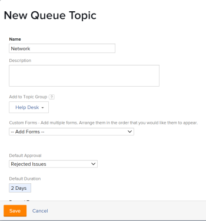

# Werkvoorraadonderwerpen maken

De Onderwerpen van de rij werken samen met het Verpletteren van Regels om het inkomende werk aan een gebruiker, baanrol, team automatisch toe te wijzen, of het op een project te plaatsen. De Onderwerpen van de rij bepalen de voorwaarden die voor de Verpletterende Regel moeten bestaan worden uitgevoerd.

Er is geen grens aan het aantal Onderwerpen van de Rij die aan een Groep van het Onderwerp of aan een project kunnen worden toegewezen. De Onderwerpen van de rij zijn een te melden objecten type.

## Toegangsvereisten

<!--drafted - replace table with P&P:

<table style="table-layout:auto"> 
 <col> 
 <col> 
 <tbody> 
  <tr> 
   <td role="rowheader">Adobe Workfront plan*</td> 
   <td> 
Any 
 </td> 
  </tr> 
  <tr> 
   <td role="rowheader">Adobe Workfront license*</td> 
   <td> 
Current license: Standard 
 
   Or
   
Legacy license: Plan 
 </td> 
  </tr> 
  <tr> 
   <td role="rowheader">Access level configurations*</td> 
   <td> 
Edit access to Projects
 
Note: If you still don't have access, ask your Workfront administrator if they set additional restrictions in your access level. For information on how a Workfront administrator can modify your access level, see <a href="../../../administration-and-setup/add-users/configure-and-grant-access/create-modify-access-levels.md" class="MCXref xref">Create or modify custom access levels</a>.
 </td> 
  </tr> 
  <tr> 
   <td role="rowheader">Object permissions</td> 
   <td> 
 Manage permissions to the project
 
For information on requesting additional access, see <a href="../../../workfront-basics/grant-and-request-access-to-objects/request-access.md" class="MCXref xref">Request access to objects </a>.
 </td> 
  </tr> 
 </tbody> 
</table>
-->

U moet het volgende hebben:

<table style="table-layout:auto"> 
 <col> 
 <col> 
 <tbody> 
  <tr> 
   <td role="rowheader">Adobe Workfront-abonnement*</td> 
   <td> 
Alle 
 </td> 
  </tr> 
  <tr> 
   <td role="rowheader">Adobe Workfront-licentie*</td> 
   <td> 
Plan 
 </td> 
  </tr> 
  <tr> 
   <td role="rowheader">Configuraties op toegangsniveau*</td> 
   <td> 
Toegang tot projecten bewerken
 
Opmerking: Als u nog steeds geen toegang hebt, vraagt u de Workfront-beheerder of deze aanvullende beperkingen op uw toegangsniveau instelt. Voor informatie over hoe een beheerder van Workfront uw toegangsniveau kan wijzigen, zie <a href="../../../administration-and-setup/add-users/configure-and-grant-access/create-modify-access-levels.md" class="MCXref xref">Aangepaste toegangsniveaus maken of wijzigen</a>.
 </td> 
  </tr> 
  <tr> 
   <td role="rowheader">Objectmachtigingen</td> 
   <td> 
 Rechten voor het project beheren
 
Voor informatie over het aanvragen van aanvullende toegang raadpleegt u <a href="../../../workfront-basics/grant-and-request-access-to-objects/request-access.md" class="MCXref xref">Toegang tot objecten aanvragen </a>.
 </td> 
  </tr> 
 </tbody> 
</table>

&#42;Neem contact op met uw Workfront-beheerder als u wilt weten welk plan, licentietype of toegang u hebt

## Een onderwerp in de wachtrij maken

1. Creeer een Verpletterende Regel, een Groep van het Onderwerp, en een douaneformulier, als u van plan bent om hen met uw Onderwerp van de Rij te associëren.\
   Voor meer informatie over hoe te om het Verpletteren van Regels, de Groepen van het Onderwerp of douanevormen tot stand te brengen, verwijs naar de volgende artikelen:

   * [Verpletterende regels maken](../../../manage-work/requests/create-and-manage-request-queues/create-routing-rules.md)
   * [Onderwerpgroepen maken](../../../manage-work/requests/create-and-manage-request-queues/create-topic-groups.md)
   * [Een aangepast formulier maken of bewerken](../../../administration-and-setup/customize-workfront/create-manage-custom-forms/create-or-edit-a-custom-form.md)

1. Ga naar het project u verkoos om als Rij van het Verzoek van de Hulp toe te laten en waar u een nieuw rijonderwerp wilt creëren.\
   Voor meer informatie over hoe te om een project als Rij van het Verzoek van de Hulp aan te wijzen, verwijs naar het volgende artikel:\
   [Een aanvraagwachtrij maken](../../../manage-work/requests/create-and-manage-request-queues/create-request-queue.md)

   U kunt verwante Onderwerpen van de Rij onder een Groep van het Onderwerp of direct onder het project organiseren dat als Rij van het Verzoek van de Hulp wordt aangewezen. De aanvrager krijgt dan een aantal vervolgkeuzemenu&#39;s bij het indienen van een aanvraag.\
   U kunt de Onderwerpen van de Rij onder het project direct nesten dat als Rij van het Verzoek van de Hulp, zonder een Groep van het Onderwerp wordt aangewezen.

   Voor informatie over het creëren van de Groepen van het Onderwerp, zie [Onderwerpgroepen maken](../../../manage-work/requests/create-and-manage-request-queues/create-topic-groups.md).

1. Klikken **Onderwerpen van de Rij** in het linkerdeelvenster. Mogelijk moet u op **Meer weergeven** vervolgens **Onderwerpen van de Rij**.
1. Klikken **Nieuw onderwerp van de Rij**.
1. Op de **Nieuw onderwerp van de Rij** de volgende gegevens invullen:

   <table style="table-layout:auto"> 
    <col> 
    <col> 
    <tbody> 
     <tr> 
      <td role="rowheader"><strong>Naam</strong> </td> 
      <td> Naam van het Onderwerp van de Rij.</td> 
     </tr> 
     <tr> 
      <td role="rowheader"><strong>Beschrijving</strong> </td> 
      <td>Beschrijf de verzoekwachtrij. De beschrijving toont wanneer de gebruikers het rijonderwerp in het proces selecteren om een nieuw verzoek voor te leggen. </td> 
     </tr> 
     <tr> 
      <td role="rowheader"><strong>Toevoegen aan onderwerpgroep</strong> </td> 
      <td> Als er geen Groepen van het Onderwerp op het project zijn, zal de naam van het project als Groep van het Onderwerp in gebreke blijven. Als u van hieruit extra onderwerpgroepen wilt maken, selecteert u <strong>Nieuwe onderwerpgroep maken</strong> in het keuzemenu. </td> 
     </tr> 
     <tr> 
      <td role="rowheader"><strong>Aangepaste Forms</strong> </td> 
      <td>Selecteer de aangepaste formulieren die u aan het onderwerp van de wachtrij wilt koppelen. U moet aangepaste formulieren maken voor problemen voordat u deze kunt koppelen aan onderwerpen in de wachtrij. Voor informatie over het maken van aangepaste formulieren raadpleegt u <a href="../../../administration-and-setup/customize-workfront/create-manage-custom-forms/create-or-edit-a-custom-form.md" class="MCXref xref">Een aangepast formulier maken of bewerken</a>.</td> 
     </tr> 
     <tr> 
      <td role="rowheader">Standaardgoedkeuring</td> 
      <td> 
Koppel een goedkeuringsproces aan dit rijonderwerp. In dit keuzemenu worden alleen processen voor goedkeuring van uitgaven weergegeven. Alle problemen die naar deze wachtrij worden verzonden, worden gekoppeld aan dit goedkeuringsproces. Uw beheerder van Adobe Workfront moet de processen van de Goedkeuring op systeemniveau bepalen alvorens u hen met rijonderwerpen kunt associëren. Een gebruiker met administratieve toegang tot goedkeuringsprocessen kan ook groepsspecifieke goedkeuringsprocessen maken. Ga voor meer informatie over het maken van goedkeuringsprocessen naar <a href="../../../administration-and-setup/customize-workfront/configure-approval-milestone-processes/create-approval-processes.md" class="MCXref xref">Een goedkeuringsproces voor werkitems maken</a>. 
 
       
 
        
Belangrijk: Als de groep van het project verandert, wordt het groep-specifieke goedkeuringsproces verbonden aan bestaande kwesties een enig-gebruiks goedkeuringsproces. Voor meer informatie over hoe de veranderingen in de groep van het project of de veranderingen in het goedkeuringsproces goedkeuringsmontages beïnvloeden, zie <a href="../../../administration-and-setup/customize-workfront/configure-approval-milestone-processes/how-changes-affect-group-approvals.md" class="MCXref xref">De invloed van wijzigingen in groep- en goedkeuringsproces op toegewezen goedkeuringsprocessen</a>.
 
        
Overweeg het volgende wanneer het toevoegen van goedkeuringsprocessen aan rijonderwerpen: 
 
        <ul style="list-style-type: circle;"> 
         <li>Alleen actieve goedkeuringsprocessen worden in de lijst weergegeven. </li> 
         <li> 
Systeemspecifieke en groepsspecifieke goedkeuringsprocessen worden in de lijst weergegeven. Een goedkeuringsproces verbonden aan een groep buiten die van het project toont niet in de lijst.
 </li> 
        </ul> 
       
 </td> 
     </tr> 
     <tr> 
      <td role="rowheader"><strong>Standaardduur</strong> </td> 
      <td>Dit is de standaardduur van het verzoek en de geplande datum van voltooiing van het verzoek wordt berekend op basis van deze waarde.</td> 
     </tr> 
     <tr> 
      <td role="rowheader"><strong>Standaardroute</strong> </td> 
      <td>Specificeer de verpletterende regel u met het Onderwerp van de Rij wilt associëren. U moet de verpletterende regel tot stand brengen alvorens u het aan een Onderwerp van de Rij kunt vastmaken.</td> 
     </tr> 
     <tr> 
      <td role="rowheader"><strong>Aanvraagtypen</strong> </td> 
      <td> 
Kies welk soort verzoeken dit rijonderwerp opslaat. De zichtbare opties worden ingesteld op het tabblad <strong>Wachtrij</strong> tabblad van het project. Dit is een verplicht veld. 
 
Opmerking: De Types van verzoek tonen als selectie op het gebied van Verzoeken slechts als het Type van Verzoek in zowel de Details van de Rij als de pagina's van het Onderwerp van de Rij wordt geselecteerd. Voor informatie over vestiging het gebied van de Details van de Rij van een project, zie <a href="../../../manage-work/requests/create-and-manage-request-queues/create-request-queue.md" class="MCXref xref">Een aanvraagwachtrij maken</a>. 
 
Selecteer een van de volgende typen:
 
       <ul> 
        <li>Foutrapport</li> 
        <li>Volgorde wijzigen</li> 
        <li>Probleem</li> 
        <li>Verzoek</li> 
       </ul> 
Mogelijk is de naam van uw Workfront-beheerder gewijzigd in een aantal van deze opties. 
 </td> 
     </tr> 
    </tbody> 
   </table>

   

1.  
1. Klikken **Opslaan**.\
   Het onderwerp van de Rij is nu beschikbaar aan gebruik en is zichtbaar in het gebied van Verzoeken van Workfront, nadat een Rij van het Verzoek en een Groep van het Onderwerp worden geselecteerd.
