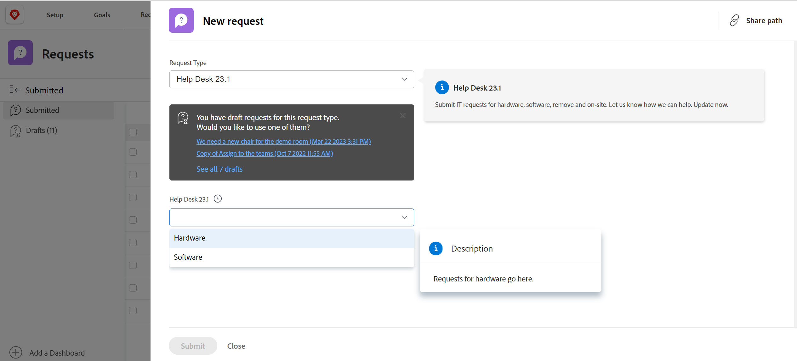
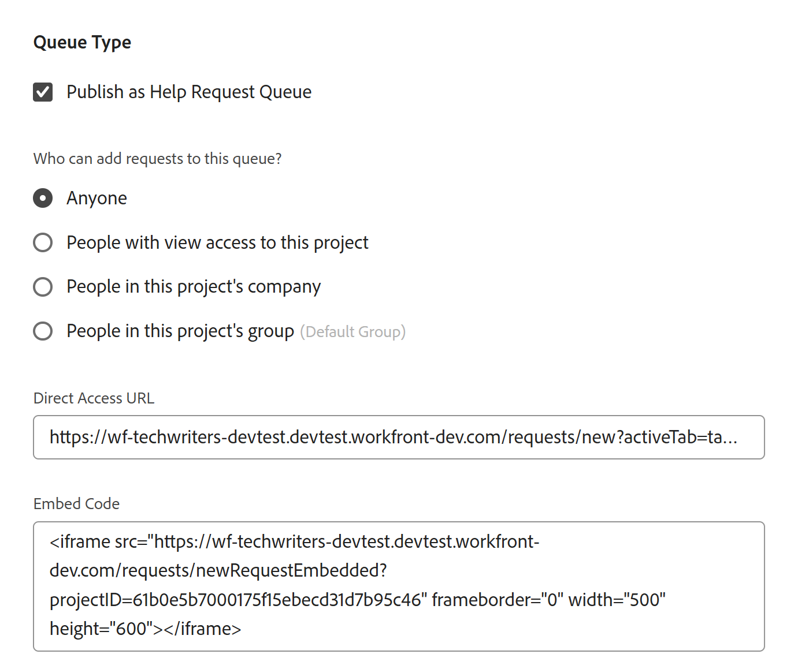

# Een aanvraagwachtrij maken

<!--Audited: 12/2023-->

<!--
<THIS IS CONNECTED TO THE PRODUCT IN BLUEPRINTS. DO NOT MOVE/ CHANGE URL>
-->

<!--remove/ hide the entire "create requests in Production" section and just edit and leave  only the preview section when it releases to Production; also remove the template blurb when the queue details is unshimmed for templates-->

<!--

The highlighted information on this page refers to functionality not yet generally available. It is available only in the Preview environment for all customers. After the monthly releases to Production, the same features are also available in the Production environment for customers who enabled fast releases.    

For information about fast releases, see [Enable or disable fast releases for your organization](/help/quicksilver/administration-and-setup/set-up-workfront/configure-system-defaults/enable-fast-release-process.md).    

-->

U kunt opstelling een Rij van het Verzoek waar de gebruikers occasionele verzoeken kunnen ingaan die niet gepland werk aan een project zijn. Bijvoorbeeld, kan een rij van het hulpdeskverzoek opstelling zijn om alle gebruikersverzoeken te vangen die aan een afdeling van IT komen.

Verzoeken worden kwesties in Adobe Workfront en ze worden toegevoegd aan projecten.

Het opzetten van een verzoekrij helpt informatie over kwesties formaliseren die aan een project zullen worden toegevoegd. Alle kwesties die aan het project worden voorgelegd zullen op dezelfde wijze worden voorgelegd en zullen dezelfde weg naar voltooiing volgen.

U kunt de volgende objecten instellen als aanvraagrijen in Workfront:

* Projecten
* Sjablonen. De projecten die van malplaatjes worden gecreeerd opstelling als verzoekrijen zullen verzoekrijen worden.

Aan opstelling moet een project of een malplaatje als verzoekrij, u het gebied van de Details van de Rij van het project of het malplaatje uitgeven.

Dit artikel beschrijft hoe u een project als verzoekrij kunt vormen waar de gebruikers verzoeken kunnen voorleggen. De Details van de Rij van de vestiging voor een malplaatje is gelijkaardig aan vestiging hen op het project.

Voor informatie over hoe te om een nieuw verzoek aan een verzoekrij voor te leggen, zie [ Exemplaar en verzend verzoeken ](../create-requests/copy-and-submit-requests.md).

## Toegangsvereisten

+++ Breid uit om de toegangseisen voor de functionaliteit in dit artikel weer te geven.

U moet de volgende toegang hebben om de stappen in dit artikel uit te voeren:

<table style="table-layout:auto"> 
 <col> 
 <col> 
 <tbody> 
  <tr> 
   <td role="rowheader">Adobe Workfront-plan</td> 
   <td> 
Alle 
 </td> 
  </tr> 
  <tr> 
   <td role="rowheader">Adobe Workfront-licentie</td> 
   <td> 
   
Nieuwe licentie: standaard 

   of
   
Huidige licentie: abonnement 
 </td> 
  </tr> 
  <tr> 
   <td role="rowheader">Configuraties op toegangsniveau</td> 
   <td> 
Toegang tot projecten bewerken
 </td> 
  </tr> 
  <tr> 
   <td role="rowheader">Objectmachtigingen</td> 
   <td> 
 Rechten voor het project beheren
 </td> 
  </tr> 
 </tbody> 
</table>

Voor meer detail over de informatie in deze lijst, zie [ vereisten van de Toegang in de documentatie van Workfront ](/help/quicksilver/administration-and-setup/add-users/access-levels-and-object-permissions/access-level-requirements-in-documentation.md).

+++

## Overzicht aanvraagrijen

U plaatst opstelling een verzoekrij als project. Wanneer u het project als Rij van het Verzoek aanwijst, wordt de rij toegankelijk van het gebied van Verzoeken van Adobe Workfront. Wanneer u de aanvraagwachtrij aanpast, past u ook de invulling van de formuliergebruikers aan wanneer ze de aanvragen verzenden.

Dit artikel beschrijft hoe te om een verzoekrij van een bestaand project tot stand te brengen. Nochtans, om consistentie voor uw proces van de verzoekinname te bouwen of veelvoudige lagen aan het voor rapporteringsdoeleinden en beter beheer toe te voegen, kunt u extra bouwstenen van een verzoekrij ook vormen die in de volgende lijst worden beschreven.

<table style="table-layout:auto"> 
 <col> 
 <col> 
 <tbody> 
  <tr> 
   <td role="rowheader">Wachtrij</td> 
   <td> 
U moet opstelling een project als verzoekrij in het gebied van de Details van de Rij. Deze stap is verplicht. 
 
Voor meer informatie, zie <a href="#create-a-request-queue" class="MCXref xref"> een sectie van de Rij van het Verzoek </a> in dit artikel creëren.
 </td> 
  </tr> 
  <tr> 
   <td role="rowheader">Onderwerpgroepen</td> 
   <td> 
Het zijn extra menu's die verzoeken classificeren die op gemeenschappelijke eigenschappen worden gebaseerd. Bijvoorbeeld, voor een Rij van het Verzoek van IT, zou u "On-site"en "Verre"onderwerpgroepen kunnen willen hebben. 
 
Voor meer informatie, zie <a href="../../../manage-work/requests/create-and-manage-request-queues/create-topic-groups.md" class="MCXref xref"> de Groepen van het Onderwerp </a> creëren. 
 
Dit is optioneel.
 </td> 
  </tr> 
  <tr> 
   <td role="rowheader">Werkvoorraadonderwerpen</td> 
   <td> 
Zij zijn extra menu's die verzoeken classificeren die tot de zelfde Groep van het Onderwerp behoren die op gemeenschappelijke eigenschappen wordt gebaseerd. Een onderwerpgroep kan verscheidene rijonderwerpen bevatten. 
 
Bijvoorbeeld, kan de "On-site"onderwerpgroep voor de Rij van het Verzoek van IT de "Hardware", "Software"en "Netwerk"rijonderwerpen bevatten. 
 
Voor meer informatie, zie <a href="../../../manage-work/requests/create-and-manage-request-queues/create-queue-topics.md" class="MCXref xref"> de Onderwerpen van de Rij </a> creëren. 
 
Dit is optioneel.
 </td> 
  </tr> 
  <tr> 
   <td role="rowheader">Routeringsregels</td> 
   <td> 
Zij staan u toe om elk verzoek aan een gebruiker, baanrol, team, of aan een project te leiden. 
 
Voor meer informatie, zie <a href="../../../manage-work/requests/create-and-manage-request-queues/create-routing-rules.md" class="MCXref xref"> het Verpletteren van Regels </a> creëren. 
 
Dit is optioneel.
 </td> 
  </tr> 
 </tbody> 
</table>

## Een aanvraagwachtrij maken

<!-- 

Creating a request queue differs depending on what environment you use. 

### Create a Request Queue in the Production environment

This section describes how you can define Queue Details for the following objects:

* A project in the Production environment
* A template in the Production or Preview environment

-->

Wanneer u opstelling een project als Rij van het Verzoek, de projectstatus moet Actief zijn om op het gebied van Verzoeken van Workfront te tonen.

>[!TIP]
>
>Uw Workfront- of groepsbeheerder kan u toewijzen aan een aangepaste lay-outsjabloon die wellicht niet alle secties bevat die in de volgende stappen worden beschreven.

Een aanvraagwachtrij maken:

1. Ga naar het project dat u opstelling als Rij van het Verzoek wilt.
1. (Facultatief) klik **Details van het Project** in het linkerpaneel en voeg a **Beschrijving** aan het project in het **Overzicht** gebied toe. Deze informatie wordt weergegeven bij alle nieuwe aanvragen.
1. Klik **Details van de Rij** in het linkerpaneel. U zou kunnen moeten klikken **Meer** tonen, dan **de Details van de Rij**.

   Hiermee opent u de sectie met gegevens van de wachtrij.

   

1. Geef de volgende informatie op:

   * **publiceer als Rij van het Verzoek van de Hulp:** selecteer deze optie om dit project als verzoekrij te identificeren. Alle inkomende kwesties worden beschouwd als Verzoeken.\
     Als deze optie niet is geselecteerd, gedraagt het project zich als een standaardproject in Workfront en zijn alle binnenkomende problemen van belang.

   * **die verzoeken aan deze rij kan toevoegen:** selecteer welke gebruikers toegang hebben om verzoeken aan deze rij toe te voegen. U kunt de volgende groepen mensen toestaan om de Rij van het Verzoek in hun gebied van Verzoeken van de Globale Bar van de Navigatie te zien wanneer zij een nieuw verzoek toevoegen:

     | Wie aanvragen kan invoeren | Beschrijving |
     |---|---|
     | Iedereen | Elke Workfront-gebruiker met een actief account kan deze aanvraagwachtrij bekijken en er aanvragen aan toevoegen |
     | Personen met toegang tot dit project | Gebruikers met de machtiging Weergeven aan het project kunnen aanvragen weergeven en toevoegen aan deze wachtrij |
     | Personen in het bedrijf van dit project | De gebruikers die tot het bedrijf behoren verbonden aan dit project kunnen verzoeken aan deze rij bekijken en toevoegen. Als er een bedrijf verbonden aan het project is, is de naam van het bedrijf vermeld tussen haakjes na dit het plaatsen. |
     | Personen in de projectgroep | De gebruikers die tot de groep behoren verbonden aan dit project kunnen verzoeken aan deze rij bekijken en toevoegen. Als er een groep is die aan het project is gekoppeld, wordt de naam van de groep na deze instelling tussen haakjes weergegeven, in een grijs lettertype. |

     {style="table-layout:auto"}

   * **Aandeel met deze verbindingen:** de volgende opties laten u toe om directe toegang tot de Rij van het Verzoek en de vormen te verlenen verbonden aan het aan gebruikers buiten Workfront of aan gebruikers Workfront die een externe pagina gebruiken. Voor informatie over het inbedden van een verzoekrij in een dashboard als externe pagina, zie [ een verzoekrij in een dashboard ](../../../reports-and-dashboards/dashboards/creating-and-managing-dashboards/embed-request-queue-dashboard.md) inbedden.

     Gebruikers moeten al toegangsrechten tot de wachtrij hebben om directe toegang te krijgen. Het gebruik van een van de hier beschreven opties verleent niet automatisch toegang aan gebruikers.

     >[!TIP]
     >
     >Gebruikers moeten zich eerst aanmelden bij Workfront voordat ze toegang krijgen tot de wachtrij met aanvragen wanneer ze vanuit een andere toepassing toegang krijgen tot de pagina Wachtrij aanvragen.

      * **Directe Toegang URL:** wanneer een gebruiker tot dit URL van browser toegang heeft, wordt de gebruiker rechtstreeks genomen aan de Nieuwe sectie van het Verzoek in het gebied van Verzoeken en dit verzoek wordt geselecteerd door gebrek voor hen.

        

        >[!NOTE]
        >
        >U kunt een verzoekwachtrij in een dashboard weergeven als een externe pagina. In dit geval is de wachtrij met aanvragen vooraf geselecteerd, maar u kunt een andere wachtrij met aanvragen selecteren in het veld Type verzoek. gebruikers kunnen het Aanvraagtype wijzigen. Navigatiecomponenten van de Verzoeken worden ook weergegeven.

      * **bed Code in:** gebruik deze code van HTML om de vorm van de verzoekrij als iframe binnen om het even welke pagina van HTML in te bedden.\
        Als gebruikers nog niet zijn geverifieerd bij Workfront wanneer ze de pagina bekijken waarop de code is ingesloten, wordt het Workfront-aanmeldingsvenster weergegeven. Nadat gebruikers zich hebben aangemeld, wordt het formulier Wachtrij aanvragen weergegeven.

        >[!NOTE]
        >
        >Als een aanvraagwachtrij wordt weergegeven in een iframe, wordt alleen het aanvraagformulier weergegeven. De naam van de aanvraag wordt dan vooraf geselecteerd en grijs weergegeven. Gebruiker kan het aanvraagtype niet wijzigen. Navigatiecomponenten van het gebied Verzoeken worden niet weergegeven.

        Als u het formulier voor de aanvraagwachtrij wilt weergeven wanneer u deze insluitcode gebruikt, moet u de instelling Insluiten van Workfront in een iFrame toestaan inschakelen in de systeeminstellingen. Voor meer informatie over het toelaten van het inbedden van Workfront in een iframe, zie [ de voorkeur van de systeemveiligheid ](../../../administration-and-setup/manage-workfront/security/configure-security-preferences.md) vormen. Als deze instelling niet is ingeschakeld, wordt het iframe leeg weergegeven.

        U kunt als volgt verschillende aspecten van de weergave van het ingesloten formulier aanpassen:

        <table border="1" cellspacing="15"> 
         <col> 
         <col> 
         <thead> 
          <tr> 
           <th> 
<strong> Functionaliteit </strong> 
 </th> 
           <th> 
<strong> Oplossing </strong> 
 </th> 
          </tr> 
         </thead> 
         <tbody> 
          <tr> 
           <td> 
De grootte van het frame aanpassen
 </td> 
           <td> 
Wijzig de kenmerken "width" en "height".
 
De breedte is standaard "500" en de hoogte is "600"
 </td> 
          </tr> 
          <tr> 
           <td> 
Directe gebruikers aan een specifiek Onderwerp van de Rij of een Groep van het Onderwerp
 </td> 
           <td> 
Voeg de parameter "path" toe aan de URL van de bron. U kunt de wegparameter vinden door aan het gewenste Onderwerp of de Groep van het Onderwerp van de Rij in de niet ingebedde vorm te navigeren en URL te inspecteren.
 </td> 
          </tr> 
          <tr> 
           <td> 
Toon en sta gebruikers toe om de vooraf gevormde drop-down lijst van de Groep van het Onderwerp te veranderen
 </td> 
           <td> 
Gebruik de parameter "path" door de parameter <code>showPreSelectedOptions=true</code> aan <code>src URL</code> toe te voegen.
 </td> 
          </tr> 
          <tr> 
           <td> 
Detecteren wanneer het formulier is verzonden
 </td> 
           <td> 
Voeg een "message"-gebeurtenislistener toe aan het venster van uw webpagina en controleer of <code>event.data.type</code> <code>requestSubmitted</code> is. <code>event.data.newIssueID</code> wordt ingesteld op de id van het gemaakte probleem.
 </td> 
          </tr> 
         </tbody> 
        </table>

   * **de Types van Verzoek:** Uitgezocht van de standaardopties hieronder.

     De Workfront-beheerder kan de standaardaanvraagtypen een andere naam geven. Voor meer informatie over het anders noemen van de verzoektypes, zie [ de types van standaardkwestie ](../../../administration-and-setup/set-up-workfront/configure-system-defaults/customize-default-issue-types.md) aanpassen.

      * Foutrapport
      * Volgorde wijzigen
      * Probleem
      * Verzoek

        Dit is een verplicht veld en u moet ten minste één optie selecteren.

     >[!NOTE]
     >
     >De Types van verzoek tonen als selectie op het gebied van Verzoeken slechts als het Type van Verzoek in zowel de Details van de Rij als de pagina&#39;s van het Onderwerp van de Rij wordt geselecteerd. Voor informatie over vestiging het gebied van de Details van de Rij van een project, zie [ de Onderwerpen van de Rij ](../../../manage-work/requests/create-and-manage-request-queues/create-queue-topics.md) creëren.

     Elk hier geselecteerd type is beschikbaar op het formulier (u kunt meerdere typen selecteren). Als u meerdere typen selecteert, kunt u meerdere aanvragen ordenen die binnenkomen.\
     Als u bijvoorbeeld het formulier op een aanvraagwachtrij voor een IT-project gebruikt, kunnen de volgende aanvraagtypen in de wachtrij worden geplaatst: hardware, software, foutoplossingen en problemen.

   * **StandaardDuur:** De standaardduur is de tijdsduur het typisch neemt om een kwestie te voltooien. Dit wordt de standaardinstelling voor alle binnenkomende uitgaven en kan handmatig worden gewijzigd. De duur wordt over het algemeen ingesteld in uren, dagen of weken. De standaardduur van een uitgave is gelijk aan de geplande uren voor het probleem. De geplande afwerkingsdatum van de uitgave wordt berekend op basis van dit veld.\
     De standaardwaarde voor de duur van de uitgave is 1 dag of 8 uur. Als uw Workfront-beheerder de typische uren per werkdag instelt op minder dan 8 uur, is de standaardduur voor uitgaven nog steeds 8 uur. Als de typische uren per werkdag bijvoorbeeld op 7 uur zijn ingesteld, is de standaardduur voor uitgaven 1,14 dagen of 8 uur. Voor meer informatie over hoe te opstelling ziet de systeem Typische Uren per Dag van het Werk, de &quot;sectie van de Berekeningen van de Chronologie&quot;in het artikel [ systeembrede projectvoorkeur ](../../../administration-and-setup/set-up-workfront/configure-system-defaults/set-project-preferences.md) vormen.

   * **de Mensen van het zelfde bedrijf zullen de zelfde toestemmingen voor alle verzoeken erven.:** Wanneer geselecteerd, zijn alle verzoeken die aan de rij worden voorgelegd zichtbaar voor gebruikers in het zelfde bedrijf. De gebruikers kunnen deze verzoeken in de Al sectie van Verzoeken bekijken, die binnen het gebied van Verzoeken wordt gevestigd. Op het moment dat deze instelling wordt in- of uitgeschakeld, heeft deze invloed op alle toekomstige aanvragen. De instelling heeft geen retroactieve invloed op informatie.
   * **wanneer iemand een verzoek indient, automatisch verlenen:** wanneer een gebruiker een verzoek aan de verzoekrij indient, wordt de gebruiker automatisch verleend het niveau van toestemming dat u aan dat verzoek kiest. Selecteer een van de volgende machtigingsniveaus:

      * **Toegang van de Mening**
      * **draag Toegang** bij. Dit is de standaardselectie.
      * **beheert Toegang**

     Voor informatie over het de toestemmingenmodel van Workfront, zie [ Overzicht van het delen van toestemmingen op voorwerpen ](../../../workfront-basics/grant-and-request-access-to-objects/sharing-permissions-on-objects-overview.md).\
     Het plaatsen van toestemmingen bewaart hier tijd, eerder dan het moeten toestemmingen voor elk individueel inkomend verzoek verlenen. Het kiezen van deze optie is van invloed op alle toekomstige verzoeken, maar heeft geen terugwerkende invloed op bestaande verzoeken.

   * **StandaardGoedkeuring**: Verbind een goedkeuringsproces met deze verzoekrij. In dit keuzemenu worden alleen processen voor goedkeuring van uitgaven weergegeven. Alle kwesties die aan deze rij worden voorgelegd zullen met dit goedkeuringsproces worden geassocieerd. Uw Workfront-beheerder moet goedkeuringsprocessen op systeemniveau definiëren voordat u deze kunt koppelen aan aanvraagwachtrijen. Gebruikers met administratieve toegang tot goedkeuringsprocessen kunnen ook groepsspecifieke goedkeuringsprocessen maken.

     >[!IMPORTANT]
     >
     >Als de groep van het project verandert, wordt het groep-specifieke goedkeuringsproces verbonden aan bestaande kwesties een enig-gebruiks goedkeuringsproces. Voor meer informatie over hoe de veranderingen in de groep van het project of de veranderingen in het goedkeuringsproces goedkeuringsmontages beïnvloeden, zie [ hoe de groep en de veranderingen van het goedkeuringsproces aangewezen goedkeuringsprocessen ](../../../administration-and-setup/customize-workfront/configure-approval-milestone-processes/how-changes-affect-group-approvals.md) beïnvloeden.

     Als u veelvoudige rijonderwerpen verbonden aan een verzoekrij hebt, adviseren wij dat u goedkeuringsprocessen met de rijonderwerpen in plaats daarvan associeert. Voor meer informatie over het creëren van rijonderwerpen, zie [ de Onderwerpen van de Rij ](../../../manage-work/requests/create-and-manage-request-queues/create-queue-topics.md) creëren.

     Overweeg het volgende wanneer het toevoegen van goedkeuringsprocessen om rijen te verzoeken:

      * Alleen actieve goedkeuringsprocessen worden in de lijst weergegeven.
      * Systeemspecifieke en groepsspecifieke goedkeuringsprocessen worden in de lijst weergegeven. Een goedkeuringsproces verbonden aan een groep buiten die van het project toont niet in de lijst.

   * **StandaardRoute**: Verwante een Verpletterende Regel met deze verzoekrij. Het gebruik dat Regels verplettert om nieuwe kwesties automatisch toe te wijzen die aan een Rij van het Verzoek aan het correcte middel (gebruiker, baanrol, of team) worden voorgelegd, en aan het correcte project. Alle kwesties die aan deze rij worden voorgelegd zullen met deze Verpletterende Regel worden geassocieerd. U moet het Verpletteren van Regels vormen alvorens zij in de sectie van de Details van de Rij tonen en alvorens u hen met verzoekrij kunt associëren.\
     Als u veelvoudige rijonderwerpen verbonden aan een verzoekrij hebt, adviseren wij dat u het verpletteren van regels met de rijonderwerpen in plaats daarvan associeert. Voor meer informatie over het creëren van het verpletteren van regels, zie [ het Verpletteren van Regels ](../../../manage-work/requests/create-and-manage-request-queues/create-routing-rules.md) creëren.

   * **Nieuwe Velden van de Uitgave:** In **toon de volgende geselecteerde gebieden aan alle gebruikers** sectie, selecteer om het even welke gebieden die u aan alle gebruikers zichtbaar wilt zijn die een verzoek aan het project voorleggen of een kwestie aan het project of de taken toevoegen.

     >[!TIP]
     >
     >De nieuwe die Velden van de Uitgave in de sectie van de Details van de Rij worden geselecteerd worden ook geassocieerd met om het even welke nieuwe kwestie aan het project <!--this is confusing: or to the tasks in the Issues section--> wordt toegevoegd.

     Wanneer u een van de velden Toegewezen aan, Functie of Team inschakelt, wordt de naam van de toewijzingen altijd gewijzigd in het aanvraagformulier, maar u kunt alleen het hier geselecteerde type toewijzing opgeven.

     >[!NOTE]
     >
     >Als u Toegewezen aan in het gebied van de Details van de Rij selecteerde, kunt u slechts gebruikers op het gebied van Toewijzingen op het verzoekformulier ingaan. In dit geval kunt u geen taakrollen of een team invoeren.

   * **Documenten**: Als u selecteert om de sectie van Documenten in de nieuwe verzoekvorm te tonen, selecteer waar het document uploadende sectie zou moeten worden geplaatst. Selecteer een van de volgende opties:

     <table style="table-layout:auto"> 
      <col> 
      <col> 
      <tbody> 
       <tr> 
        <td role="rowheader">Na aangepaste formulieren</td> 
        <td> de sectie van Documenten toont bij de bodem van de verzoekvorm. </td> 
       </tr> 
       <tr> 
        <td role="rowheader">Voor aangepaste formulieren</td> 
        <td> 
 de sectie van Documenten toont tussen de gebieden van Workfront en de douanegebieden van de verzoekvorm. 
 </td> 
       </tr> 
      </tbody> 
     </table>

     

   * **toon alle geselecteerde en niet geselecteerde gebieden aan:** selecteer welke gebruikers u alle gebieden op de nieuwe verzoekvorm wilt zien. De volgende opties bepalen de toegang tot de velden op het formulier.

     | Welke gebruikers alle velden op het aanvraagformulier kunnen zien | Beschrijving |
     |---|---| 
     | Alle gebruikers (abonnementslicenties) | Alle gebruikers met een licentie voor abonnementen kunnen zowel de geselecteerde als de niet-geselecteerde velden zien. |
     | Personen met toegang tot dit project (licentie voor abonnementen) | Gebruikers met een licentie voor een abonnement die ook weergaverechten voor dit project hebben, kunnen zowel de geselecteerde als de niet-geselecteerde velden zien. De rest van de gebruikers die aanvragen kunnen indienen voor dit project, kunnen alleen de geselecteerde velden zien. |
     | Geen gebruikers | De niet-geselecteerde velden kunnen niet door gebruikers worden weergegeven. Alle gebruikers die aanvragen naar dit project kunnen verzenden, kunnen alleen de geselecteerde velden zien. |

   * **Aangepaste Forms**: Selecteer een douanevorm om met de Rij van het Verzoek te associëren. Alleen Issue Custom Forms is beschikbaar om te selecteren in dit keuzemenu. Aan alle problemen die worden voorgelegd aan de wachtrij met aanvragen worden de geselecteerde formulieren gekoppeld. U moet aangepaste formulieren maken voor uitgaven voordat u deze kunt weergeven in de sectie Wachtrijdetails.
Als u de veelvoudige Onderwerpen van de Rij verbonden aan een Rij van het Verzoek hebt, adviseren wij dat u douaneformulieren met de Onderwerpen van de Rij in plaats daarvan associeert. Voor meer informatie over het creëren van sub-secties voor de Rij van het Verzoek, zie [ de Onderwerpen van de Rij ](../../../manage-work/requests/create-and-manage-request-queues/create-queue-topics.md) creëren.

     

     Als u veelvoudige douanevormen verbonden aan de Rij van het Verzoek hebt, sleep en laat vallen de vormen om hen in de gewenste orde te sorteren, in **herschikt Forms** sectie.

     >[!TIP]
     >
     >Aangepaste formulieren die worden toegevoegd aan de sectie Wachtrijdetails, worden ook gekoppeld aan nieuwe uitgaven die worden toegevoegd aan het project <!--this is confusiong: or the tasks in the Issues  section--> .

1. Ga door selecterend informatie voor de montages in het **E-mailE van de Montages van de Rij** gebied, om gebruikers toe te staan om verzoeken aan het project van de verzoekrij te e-mailen.

   Voor meer informatie, zie [ gebruikers toelaten om een kwestie in een project van de Rij van het Verzoek ](../../../manage-work/requests/create-requests/enable-email-issues-into-projects.md) te e-mailen.

1. Klik **sparen**.\
   Uw project is nu gevormd om een Rij van het Verzoek te zijn en de gebruikers kunnen verzoeken aan het nu toevoegen.

1. (Facultatief) om de functionaliteit van de Rij van het Verzoek te verbeteren, bouw extra ondersecties voor uw rij, evenals regels om de inkomende verzoeken aan het correcte team, de ontvanger of het project te leiden.

   * Voor informatie over het creëren van sub-secties voor de Rij van het Verzoek, zie de artikelen [ de Onderwerpen van de Rij ](../../../manage-work/requests/create-and-manage-request-queues/create-queue-topics.md) creëren en [ creeer de Groepen van het Onderwerp ](../../../manage-work/requests/create-and-manage-request-queues/create-topic-groups.md).
   * Voor informatie over het verpletteren van de verzoeken aan aangewezen ontvanger, team, en aangewezen project, zie [ het Verpletteren van Regels ](../../../manage-work/requests/create-and-manage-request-queues/create-routing-rules.md) creëren.

<!--

### Create a Request Queue in the Preview environment

When you set up a project as a Request Queue, the project status must be Current in order to display in the Requests area of Workfront.

>[!TIP]
>
>Your Workfront or group administrator might assign you to a custom Layout Template that might not include some of the sections described in the following steps.

To create a Request Queue:

1. Go to the project that you want to set up as a Request Queue.
1. (Optional) Click **Project Details** in the left panel and add a **Description** to the project in the **Overview** area. This information displays on all new requests.
1. Click **Queue Details** in the left panel. You might need to click **Show More**, then **Queue Details**.

   This opens the Queue Details section.

   

1. Specify the following information:

   * **Publish as Help Request Queue**: Select this option to identify this project as a request queue. All incoming issues are considered Requests.  
     When this option is not selected, the project behaves like a standard project in Workfront and all incoming issues are issues.
   
   * **Who can add requests to this queue?**: Select which users have access to add requests to this queue. You can allow the following groups of people to see the Request Queue in their Requests area of the Global Navigation Bar when they add a new request:

     |Who can enter requests | Description|
     |---|---|
     | Anyone  |Any Workfront user with an active account can view this request queue and add requests to it |
     | People with view access to this project |Users with View permissions to the project can view and add requests to this queue |
     | People in this project's company |Users who belong to the company associated with this project can view and add requests to this queue. If there is a company associated with the project, the name of the company is listed in parentheses after this setting.  |
     | People in this project's group |Users who belong to the group associated with this project can view and add requests to this queue. If there is a group associated with the project, the name of the group is listed in parentheses after this setting, in gray font.  |

     {style="table-layout:auto"}

   * (*************removed: **Share with these links:** - asked Lusine if this stays***********) Use the following options to provide direct access to the Request Queue and the forms associated with it to users outside of Workfront or to Workfront users using an embedded external page. 
   
    For information about embedding a request queue in a dashboard as an external page, see [Embed a request queue in a dashboard](../../../reports-and-dashboards/dashboards/creating-and-managing-dashboards/embed-request-queue-dashboard.md).

     Users must first have permissions to the Request Queue in order to gain direct access. Using either option described here does not automatically grant access to users.

     >[!TIP]
     >
     >Users must first log in to Workfront before gaining access to the request queue when they access the Request Queue page from another application.

      * **Direct Access URL:** When a user accesses this URL from a browser, the user is taken directly to the New Request  section in the Requests area and this request is selected by default for them.

        

        >[!NOTE]
        >
        >You can display a Request Queue in a dashboard as an external page. In this case, the request queue is preselected, but you can select any other request queue from the Request Type field. Users submitting the request can select another Request Type. Topic Groups and Queue Topics also display.

      * **Embed Code:** Use this HTML code to embed the request queue form as an iframe within any HTML page.  
        If users are not already authenticated to Workfront when they view the page where the code is embedded, the Workfront login dialog box is displayed. After users log in, the Request Queue form is displayed.

        >[!NOTE]
        >
        >When displaying a Request Queue in an iframe, only the request form displays, the request name is preselected and dimmed. User cannot change the Request type. Navigation components of the Requests area do not display.

        In order for the request queue form to be displayed when using this embed code, your Workfront administrator must enable the "Allow embedding of Workfront in an iframe" setting in your system Setup area. 
        
        For more information about enabling embedding of Workfront in an iframe, see [Configure system security preferences](../../../administration-and-setup/manage-workfront/security/configure-security-preferences.md). If this setting is not enabled, the iframe is displayed as blank.

        You can adjust various aspects of how the embedded form is displayed, as follows:

        <table border="1" cellspacing="15"> 
         <col> 
         <col> 
         <thead> 
          <tr> 
           <th> 
<strong>Functionality</strong> 
 </th> 
           <th> 
<strong>Solution</strong> 
 </th> 
          </tr> 
         </thead> 
         <tbody> 
          <tr> 
           <td> 
Adjust the size of the frame
 </td> 
           <td> 
Modify the "width" and "height" attributes.
 
By default, the width is "500" and the height is "600"
 </td> 
          </tr> 
          <tr> 
           <td> 
Direct users to a specific Queue Topic or Topic Group
 </td> 
           <td> 
Add the "path" parameter to the src URL. You can find the path parameter by navigating to the desired Queue Topic or Topic Group in the non-embedded form and inspecting the URL.
 </td> 
          </tr> 
          <tr> 
           <td> 
Show and allow users to change the pre-configured Topic Group drop-down list
 </td> 
           <td> 
Use the "path" parameter by adding the <code>showPreSelectedOptions=true</code> parameter to the <code>src URL</code>.
 </td> 
          </tr> 
          <tr> 
           <td> 
Detect when the form has been submitted
 </td> 
           <td> 
Add a "message" event listener to your web page's window and checking if <code>event.data.type</code> is <code>requestSubmitted</code>. <code>event.data.newIssueID</code> will be set to the ID of the created issue.
 </td> 
          </tr> 
         </tbody> 
        </table>

   * **Request Types:** In the **Queue Properties** section, select from the following options: 

      * Bug Report
      * Change Order
      * Issue
      * Request

      This is a required field and you must select at least one option.

      The Workfront administrator can rename the default request types. For more information about renaming the request types, see [Customize default issue types](../../../administration-and-setup/set-up-workfront/configure-system-defaults/customize-default-issue-types.md).     

     >[!NOTE]
     >
     >When users access the request queue from the Requests area, the Request Types display as a selection only if the Request Type is selected in both the Queue Details and the Queue Topic pages. 
     >
     >For information about setting up the Queue Topics area of a project, see [Create Queue Topics](../../../manage-work/requests/create-and-manage-request-queues/create-queue-topics.md).

     Each type selected here will be available on the form (you can select more than one). Selecting more than one type can help organize multiple requests coming in.  
     For example, if you are using the form on a request queue for an IT project, the following request types can come in to the queue: hardware, software, bug fixes, and issues.

   * **Default Duration:** Enter a number for the Duration, then select from the drop-down menu one of the following duration units:

      * Days
      * Hours
      * Minutes
      * Weeks
   
    The default duration is the length of time it typically takes to complete an issue submitted to this request queue. This becomes the default for all incoming issues and can be modified manually. 
    The Default Duration of an issue is the same as the Planned Hours on the issue. The Planned Completion Date of the issue calculates based on this field.  
    If left unchanged, the default for the issue Duration is 1 day or 8 hours. 
    If your Workfront administrator set the Typical Hours per Work Day as less than 8 hours in the Setup area, the Default Duration for issues is still 8 hours. 
    For example, if the Typical Hours per Work Day is set to 7 hours i the Setup area of Workfront, the Default Duration for issues is 1.14 Days or 8 hours. 
    For more information about how to set up the system Typical Hours per Work Day, see the "Timeline Calculations" section in the article [Configure system-wide project preferences](../../../administration-and-setup/set-up-workfront/configure-system-defaults/set-project-preferences.md).
   
   * **People from the same company will inherit the same permissions for all requests.**: When selected, all requests submitted to the queue are visible for users in the same company. Users can view these requests in the All Requests  section , located within the Requests area. At the time that this setting is enabled or disabled, it impacts all future requests; it does not retroactively impact information. 
   * **When someone makes a request, automatically grant...:** When a user makes a request to the request queue, the user is automatically granted the level of permission that you choose to that request. Click the Access button to select from the following permissions levels: 

      * **View Access** 
      * **Contribute Access**. This is the default selection and the name of the Access button.
      * **Manage Access**

     For information about the Workfront permissions model, see [Overview of sharing permissions on objects](../../../workfront-basics/grant-and-request-access-to-objects/sharing-permissions-on-objects-overview.md).   
     Setting permissions here saves time, rather than having to grant permissions individually, for each incoming request. Choosing this option impacts all future requests, but does not retroactively impact existing requests. 
   
   * **Default Approval**: Click the drop-down menu to select an approval process for this request queue. Only Issue Approval Processes are visible in this drop-down menu. All issues submitted to this queue will be associated with this approval process. Your Workfront administrator must define system-level approval processes before you can associate them with request queues. Users with administrative access to Approval processes can also create group-specific approval processes.

     >[!IMPORTANT]
     >
     >If the group of the project changes, the group-specific approval process attached to existing issues becomes a single-use approval process. For more information about how changes to the group of the project or changes in the approval process affect approval settings, see [How group and approval process changes affect assigned approval processes](../../../administration-and-setup/customize-workfront/configure-approval-milestone-processes/how-changes-affect-group-approvals.md).

     If you have multiple queue topics associated with a request queue, we recommend that you associate approval processes with the queue topics instead. 
     
     For more information about creating queue topics, see [Create Queue Topics](../../../manage-work/requests/create-and-manage-request-queues/create-queue-topics.md). 
   
     Consider the following when adding approval processes to request queues:

      * Only active issue approval processes display in the list. 
      * System-wide and group-specific issue approval processes display in the list. An approval process associated with a group other than that of the project does not display in the list.

   * **Default Route**: Click the drop-down menu to select a routing rule for this request queue. Routing rules automatically assign new issues submitted to a request queue to the correct resource (user, job role, or team), and to the correct project. All issues submitted to this queue will be associated with this routing rule. You must configure Routing Rules before they display in the Queue Details section and before you can associate them with request queue.  
     If you have multiple queue topics associated with a request queue, we recommend that you associate routing rules with the queue topics instead. For more information about creating routing rules, see [Create Routing Rules](../../../manage-work/requests/create-and-manage-request-queues/create-routing-rules.md).
   
   * **New Issue Fields:** In the **Show the following selected fields to all users** section, select the fields that you want to be visible to all users who submit a request to the project or add an issue to this project or to the project's tasks.

      >[!NOTE]
      >
      >* When you enable any of the Assigned to, Job Role, or the Team fields, they are always renamed to Assignments in the request form when users submit the request. You can only specify the type of assignment in the Queue Details area. 
      >
      >* If you selected Assigned To in the Queue Details area, you can enter only users in the Assignments field on the request form. In this case, you cannot enter job roles or a team. 
   
   * **Documents**: Select this option to display the Documents section in the new request form, then select where the document uploading section should be positioned. Select from the following:

     <table style="table-layout:auto"> 
      <col> 
      <col> 
      <tbody> 
       <tr> 
        <td role="rowheader">After custom forms</td> 
        <td>The Documents section displays at the bottom of the request form. </td> 
       </tr> 
       <tr> 
        <td role="rowheader">Before custom forms</td> 
        <td> 
The Documents section displays between the Workfront fields and the custom fields of the request form. 
 </td> 
       </tr> 
      </tbody> 
     </table>   
   
     

   * **Show all selected and unselected fields to:** Select which users should see all the fields on the new request form. The following options control the access to the fields on the form.
    
      |Which users can see all fields on the request form | Description|  
      |---|---| 
      | All Users (Plan Licenses) |All users who have a Plan license can see the selected as well as the unselected fields. |
      | People with view access to this project (Plan License) |Those users with a Plan license that also have View rights to this project can see the selected as well as the unselected fields. The rest of the users who can submit requests to this project can see just the selected fields. |
      | No Users |No users can see the unselected fields. All users who can submit requests to this project can only see the fields selected. This is the default selection. |
  
   * **Custom Forms**: Select a custom form to associate with the Request Queue from the drop-down menu. You can select multiple forms, then drag and drop them in the order you would like them to display in the request form. 
   Only issue custom forms are available to select from this drop-down menu. All issues submitted to this request queue, added to the project or to its tasks will have the selected forms associated with them. 
   You must create issue custom forms before you can see them displayed in the Queue Details section. 
   If you have multiple queue topics associated with a request queue, we recommend that you associate custom forms with the queue topics instead. 
   For more information, see [Create Queue Topics](../../../manage-work/requests/create-and-manage-request-queues/create-queue-topics.md).

     

1. Continue selecting information for the settings in the **Email Queue Settings** area, to allow users to email requests to the request queue project. 

    For more information, see [Enable users to email an issue into a Request Queue project](../../../manage-work/requests/create-requests/enable-email-issues-into-projects.md).

1. Click **Save**.  
   Your project has now been configured to be a Request Queue and users can now add requests to it. 

1. (Optional) To enhance the Request Queue functionality, build additional sub-sections for your queue, as well as rules to route the incoming requests to the correct team, assignee or project.

   * For information about creating sub-sections for the Request Queue, see the following articles
    * [Create Queue Topics](../../../manage-work/requests/create-and-manage-request-queues/create-queue-topics.md)  
    * [Create Topic Groups](../../../manage-work/requests/create-and-manage-request-queues/create-topic-groups.md).  
   
      For information about routing the requests to the appropriate assignee, team, and appropriate project, see [Create Routing Rules](../../../manage-work/requests/create-and-manage-request-queues/create-routing-rules.md).

-->