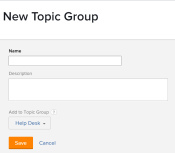

# Onderwerpgroepen maken

De Groepen van het onderwerp worden geassocieerd met de Queues van het Verzoek. Zij staan u toe om uw Vragen van het Verzoek in veelvoudige categorieën, afhankelijk van de aard van de verzoeken te lagen.

## Toegangsvereisten

U moet het volgende hebben:

<table style="table-layout:auto"> 
 <col> 
 <col> 
 <tbody> 
  <tr> 
   <td role="rowheader">Adobe Workfront-abonnement*</td> 
   <td> 
Alle 
 </td> 
  </tr> 
  <tr> 
   <td role="rowheader"> 
Adobe Workfront-licentie*
 </td> 
   <td> 
Plan 
 </td> 
  </tr> 
  <tr> 
   <td role="rowheader">Configuraties op toegangsniveau*</td> 
   <td> 
Toegang tot projecten bewerken
 
Opmerking: Als u nog steeds geen toegang hebt, vraagt u de Workfront-beheerder of deze aanvullende beperkingen op uw toegangsniveau instelt. Voor informatie over hoe een beheerder van Workfront uw toegangsniveau kan wijzigen, zie <a href="../../../administration-and-setup/add-users/configure-and-grant-access/create-modify-access-levels.md" class="MCXref xref">Aangepaste toegangsniveaus maken of wijzigen</a>.
 </td> 
  </tr> 
  <tr> 
   <td role="rowheader">Objectmachtigingen</td> 
   <td> 
 Rechten voor het project beheren
 
Voor informatie over het aanvragen van aanvullende toegang raadpleegt u <a href="../../../workfront-basics/grant-and-request-access-to-objects/request-access.md" class="MCXref xref">Toegang tot objecten aanvragen </a>.
 </td> 
  </tr> 
 </tbody> 
</table>

&#42;Neem contact op met uw Workfront-beheerder als u wilt weten welk plan, licentietype of toegang u hebt

## Overzicht van onderwerpgroepen

Bijvoorbeeld, als u een Rij van het Verzoek voor de Verzoeken van de Marketing hebt, kunt u een Groep van het Onderwerp van de Campagne van de Dag van de Moeder&quot;, met een tweede-vlakke Onderwerpgroep van &quot;Digitale Media&quot;, en een extra tweede-vlakke Onderwerpgroep van &quot;Media van de Druk.&quot; hebben Dan, kunt u de veelvoudige Onderwerpen van de Rij binnen elke Groep van het Onderwerp hebben. Bijvoorbeeld, &quot;Banner Ad&quot;en &quot;Blog&quot;kunnen de Onderwerpen van de Rij voor de &quot;Digitale Media&quot;Onderwerpgroep zijn.

Voor meer informatie over hoe te om de Queuten van het Verzoek tot stand te brengen, zie [Een aanvraagwachtrij maken](../../../manage-work/requests/create-and-manage-request-queues/create-request-queue.md).

>[!TIP]
>
>* U kunt tot 10 rijen van de Groepen van het Onderwerp binnen een Rij van het Verzoek tot stand brengen.
>* Er is geen grens aan het aantal Onderwerpen van de Rij die met een onderwerpgroep kunnen worden geassocieerd.
>* Onderwerpgroepen zijn een te rapporteren object.
>

## Onderwerpgroepen maken

Wij adviseren dat u de Groepen van het Onderwerp creeert alvorens u een Onderwerp van de Rij creeert. Nochtans, kan een Groep van het Onderwerp binnen in de bouwer van het Onderwerp van de Rij worden gecreeerd. Voor meer informatie over het creëren van de Onderwerpen van de Rij, zie [Werkvoorraadonderwerpen maken](../../../manage-work/requests/create-and-manage-request-queues/create-queue-topics.md).

Een onderwerpgroep maken:

1. Ga naar het project dat u als Rij van het Verzoek van de Hulp publiceerde.\
   Voor meer informatie over het publiceren van een project als Rij van het Verzoek van de Hulp, zie [Een aanvraagwachtrij maken](../../../manage-work/requests/create-and-manage-request-queues/create-request-queue.md).

1. Klikken **Onderwerpgroepen** in het linkerdeelvenster. Mogelijk moet u op **Meer weergeven** vervolgens **Onderwerpgroepen**.
1. Klikken **Nieuwe onderwerpgroep**.

   

1. Geef de volgende informatie op:

   * **Naam**: De naam is zichtbaar voor gebruikers die aanvragen naar deze aanvraagwachtrij verzenden.
   * **Beschrijving**: De beschrijving toont wanneer de gebruikers de onderwerpgroep in het proces selecteren om een nieuw verzoek voor te leggen.
   * **Toevoegen aan onderwerpgroep**: U kunt de nieuwe Groep van het Onderwerp aan een bestaande Groep van het Onderwerp toevoegen, of u kunt het direct aan het project toevoegen dat als Rij van het Verzoek van de Hulp wordt gepubliceerd.

1. Klikken **Opslaan**.\
   Dit leidt tot een nieuwe Groep van het Onderwerp in uw Rij van het Verzoek. U kunt nu extra categorieën selecteren in het eerste vervolgkeuzemenu onder Wachtrij aanvragen.\
   Zie voor meer informatie over het verzenden van aanvragen [Adobe Workfront-aanvragen maken en verzenden](../../../manage-work/requests/create-requests/create-submit-requests.md).
