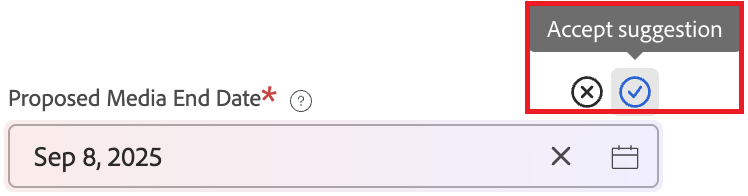

# Een aanvraag automatisch invullen met vragen of documenten

>[!NOTE]
>
>* Deze functionaliteit zal als open bèta op het volgende programma beschikbaar zijn:
>
>   * Maandbericht: 11 september 2025
>   * Kwartaalversie: 16 oktober 2025
>
>* Als u deze functionaliteit wilt gebruiken, moet uw organisatie voldoen aan de vereisten voor het gebruik van de Workfront AI Assistant. Voor details, zie [ Vereisten aan AI Medewerker ](/help/quicksilver/workfront-basics/ai-assistant/ai-assistant-overview.md#prerequisites-to-ai-assistant).

Met AI kunt u aanvraagvelden automatisch invullen op basis van een vraag die u invoert. U kunt ook velden vullen op basis van tekst, zoals e-mails, die zijn geüpload naar documenten. U kunt deze suggesties goedkeuren of verwerpen alvorens het verzoek in te dienen.

Met Automatisch vullen worden geen velden overschreven die u al hebt ingevuld.

Gebruikers ontvangen geen suggesties voor gegevens waartoe zij anders geen toegang hebben.

## Toegangsvereisten

+++ Breid uit om de toegangseisen voor de functionaliteit in dit artikel weer te geven.

U moet de volgende toegang hebben om de stappen in dit artikel uit te voeren:

<table style="table-layout:auto"> 
 <col> 
 <col> 
 <tbody> 
  <tr> 
   <td role="rowheader">Adobe Workfront-plan</td> 
   <td> 
Alle 
 </td> 
  </tr> 
  <tr> 
   <td role="rowheader">Adobe Workfront-licentie</td> 
   <td> 
Nieuw: Medewerker of hoger

   of
   
Huidig: Verzoek of hoger

    </td> 
  </tr> 
  <tr> 
   <td role="rowheader">Configuraties op toegangsniveau</td> 
   <td> 
Toegang tot problemen bewerken
  </td> 
  </tr> 
   <td role="rowheader">Objectmachtigingen</td> 
   <td>
Toegang tot het toevoegen van verzoeken aan een aanvraagwachtrij
 
De toestemmingen van de mening of hoger op het bestaande verzoek
 
Voor informatie bij vestiging ziet een verzoekrij, <a href="../../../manage-work/requests/create-and-manage-request-queues/create-request-queue.md" class="MCXref xref"> een Rij van het Verzoek </a> creëren. 
 </td> 
  <tr>
  </tr>
 </tbody> 
</table>

Voor meer detail over de informatie in deze lijst, zie [ vereisten van de Toegang in de documentatie van Workfront ](/help/quicksilver/administration-and-setup/add-users/access-levels-and-object-permissions/access-level-requirements-in-documentation.md).

## Vereisten

Aan auto-vul verzoeken gebruikend een herinnering of een document, **allen** van het volgende moet van toepassing zijn:

* Uw organisatie moet zijn gemigreerd naar Adobe IMS (Identity Management System)
* De Adobe Unified Experience moet worden ingeschakeld
* Uw organisatie moet een Select-, Prime- of Ultimate Workfront-abonnement hebben
* Adobe moet een ondertekende Adobe Gen AI-overeenkomst hebben in het bestand

  Voor meer informatie bij het ondertekenen van de overeenkomst, zie [ de overeenkomst van Adobe Gen AI ](/help/quicksilver/workfront-basics/ai-assistant/ai-assistant-overview.md#sign-the-adobe-gen-ai-agreement) in het artikelAI Hulpoverzicht ondertekenen.

## Suggesties ophalen van een tekstprompt

Met Automatisch vullen kunt u veldwaarden voorstellen op basis van tekst, zoals e-mails. U plakt in een tekstblok en Workfront verwerkt de tekst om veldwaarden voor te stellen op basis van de tekst.

Als het e-mailbericht bijvoorbeeld &#39;Dit moet gebeuren op 1 juni&#39; bevat en het aanvraagformulier een veld voor de vervaldatum bevat, stelt Workfront voor de veldwaarde op 1 juni in te voeren.

Dit soort voorstellen controleert ook eerdere verzoeken om vergelijkbare contexten. Als de vraag bijvoorbeeld vermeldt dat de aanvraag voor een bepaalde client is, kan Workfront het factureringsadres voor die client automatisch zoeken en invoeren op basis van eerdere aanvragen.

U kunt tekst plakken die op het volledige formulier of op één sectie van het formulier moet worden toegepast.

Suggesties gebruiken op basis van een geplakte tekstprompt:

1. Maak een aanvraag.

   Voor instructies, zie [ verzoeken ](/help/quicksilver/manage-work/requests/create-requests/create-submit-requests.md) creëren en voorleggen.

1. Om de tekstherinnering op de volledige vorm toe te passen, klik het AI pictogram  onder de vormnaam.

   of

   Om de tekstherinnering voor één enkele sectie toe te passen, klik het AI pictogram  naast de sectienaam.

1. Plak de tekst in het snelle vak.
1. Klik **Vul de vorm**.

   Workfront genereert suggesties voor het formulier.
1. Voor elke gebiedssuggestie, keurt de uitgezochte **** goed of **verwerpt** voor dat gebied.

   

   of

   Selecteer **goedkeuren allen** of **verwerping allen** bij de bovenkant van de pagina om alle suggesties goed te keuren of te verwerpen.

   >[!NOTE]
   >
   >Eventuele suggesties die niet zijn gecontroleerd, worden automatisch geaccepteerd wanneer u het verzoek indient.

## Suggesties ophalen op basis van een document dat u uploadt

Automatisch vullen kan veldwaarden voorstellen op basis van een document dat u uploadt.

Dit soort voorstellen controleert ook eerdere verzoeken om vergelijkbare contexten. Als de vraag bijvoorbeeld vermeldt dat de aanvraag voor een bepaalde client is, kan Workfront het factureringsadres voor die client automatisch zoeken en invoeren op basis van eerdere aanvragen.

### Handleidingen voor het uploaden van documenten

#### Ondersteunde bestandstypen

De volgende bestandstypen worden ondersteund:

<table>
<tr style="border: 0;">
<td>
<ul>
<li>BMP</li>
<li>CSV</li>
<li>DOC</li>
<li>DOCX</li>
<li>GIF</li>
<li>JPEG</li>
<li>JPEG</li>
</ul>
</td>
<td>
<ul>
<li>ODP</li>
<li>ODS</li>
<li>ODT</li>
<li>PDF</li>
<li>PNG</li>
<li>PPT</li>
</ul>
</td>
<td>
<ul>
<li>PPTX</li>
<li>RTF</li>
<li>TIFF</li>
<li>TXT</li>
<li>XLS</li>
<li>XLSX</li>
</ul>
</td>
</tr>
</table>

#### Ondersteunde bestandsgrootte

Elk bestand kan maximaal 100 MB groot zijn

#### Aantal bestanden

U kunt maximaal 50 bestanden (pagina&#39;s, dia&#39;s of bladen) uploaden.

>[!IMPORTANT]
>
>Documenten worden omgezet in een reeks afbeeldingen, die elk als een afzonderlijk bestand worden beschouwd.
>
>U kunt bijvoorbeeld één PowerPoint met 50 dia&#39;s of vijf Word-documenten uploaden die elk 10 pagina&#39;s bevatten.

#### Ondersteunde veldtypen

Workfront-veldtypen bepalen of een veld automatisch kan worden ingevuld.

<table>
<tr>
<td><b> Ondersteunde </b>  automatisch vullen kan worden gevuld</td>
<td><b> niet gestaafde </b>   automatisch-vulling vult niet</td>
</tr>
<tr>
<td>
<ul>
<li>Tekst met één regel</li>
<li>Tekstgebied of alinea</li>
<li>Datumveld</li>
<li>Selectievakje</li>
<li>Keuzerondjes</li>
<li>Vervolgkeuzelijsten voor enkelvoudige en meervoudige selectie</li>
</ul>
</td>
<td><li>Typeahead</li>
<li>Externe zoekopdracht</li>
<li>Interne zoekopdracht</li>
<li>Referentie</li>
<li>WF Ingesloten velden plannen</li>
</ul>
</td>
</tr>
</table>

#### Andere beste praktijken

Houd rekening met het volgende wanneer u een document uploadt voor automatisch invullen van aanvragen:

* Automatisch vullen is momenteel geoptimaliseerd voor het Latijnse alfabet.
* We raden u aan een tekstgrootte van 8 punten of groter te gebruiken.
* Automatisch vullen kan problemen opleveren met afbeeldingen in het document, zoals geroteerde of vervormde afbeeldingen, grafieken en het tellen of gebruiken van ruimtelijke redenen voor objecten in afbeeldingen.
* Zoals altijd adviseren wij controleresultaten voor nauwkeurigheid alvorens het verzoek voor te leggen.

### Een document uploaden om een aanvraag automatisch in te vullen

U kunt een document uploaden dat op het volledige formulier of op één sectie van het formulier moet worden toegepast.

1. Maak een aanvraag.

   Voor instructies, zie [ verzoeken ](/help/quicksilver/manage-work/requests/create-requests/create-submit-requests.md) creëren en voorleggen.

1. Om het document op de volledige vorm toe te passen, klik het AI pictogram  onder de vormnaam.

   of

   Om het document voor één enkele sectie toe te passen, klik het AI pictogram  naast de sectienaam.

1. Klik **uploadt dossiers**, dan selecteer het dossier van uw dossiermanager.

   of

   Sleep het document van uw dossiermanager aan **uploadt dossiers aan auto-vult verzoekvorm** doos.
1. Klik **Vul de vorm** van **Vul de sectie**.

   Workfront genereert suggesties voor het formulier.
1. Voor elke gebiedssuggestie, keurt de uitgezochte **** goed of **verwerpt** voor dat gebied.

   

   of

   Selecteer **goedkeuren allen** of **verwerping allen** bij de bovenkant van de pagina om alle suggesties goed te keuren of te verwerpen.

   >[!NOTE]
   >
   >Eventuele suggesties die niet zijn gecontroleerd, worden automatisch geaccepteerd wanneer u het verzoek indient.

## Problemen oplossen

Als u niet de verwachte suggesties krijgt, kan het toe te schrijven zijn aan één van het volgende:

* U moet ten minste één maand aanvraaggegevens in het systeem hebben voordat u veldwaarden van eerdere aanvragen kunt voorstellen.
* Mogelijk hebt u de instructies voor het uploaden van documenten niet opgevolgd bij het uploaden van een document om suggesties van te trekken. Voor meer informatie, zie [ Document uploadt gidsen ](#document-upload-guardrails) in dit artikel.

